# nac-test: Product Requirements & Architecture Documentation

## Table of Contents

1. [Executive Summary](#executive-summary)
2. [Package Ecosystem: Three-Tier Architecture](#package-ecosystem-three-tier-architecture)
   - [Architecture Overview](#architecture-overview)
   - [Separation of Concerns](#separation-of-concerns)
   - [Dependency Flow](#dependency-flow)
   - [Import Patterns](#import-patterns)
   - [Versioning Strategy](#versioning-strategy)
3. [System Overview](#system-overview)
4. [Core Commands](#core-commands)
   - [pyats Command](#pyats-command)
   - [Robot Framework Integration](#robot-framework-integration)
5. [Architecture Components](#architecture-components)
   - [CLI Layer](#cli-layer)
   - [Combined Orchestrator](#combined-orchestrator)
   - [PyATS Core](#pyats-core)
   - [Robot Framework Orchestrator](#robot-framework-orchestrator)
   - [Reporting System](#reporting-system)
6. [Test Execution Modes](#test-execution-modes)
   - [API Tests](#api-tests)
   - [D2D/SSH Tests](#d2dssh-tests)
7. [Architecture-Specific Test Implementations](#architecture-specific-test-implementations)
   - [APICTestBase (ACI-as-Code)](#apictestbase-aci-as-code)
   - [SDWANTestBase (SD-WAN)](#sdwantestbase-sd-wan)
   - [Creating New Architecture Implementations](#creating-new-architecture-implementations)
   - [BaseDeviceResolver: Template Method Pattern](#basedeviceresolver-template-method-pattern-for-d2d-nac-test-pyats-common)
   - [Device Validation Utilities](#device-validation-utilities-nac-test)
   - [File Discovery Utilities](#file-discovery-utilities-nac-test)
8. [Data Models](#data-models)
9. [Connection Management](#connection-management)
10. [Configuration & Environment](#configuration--environment)
    - [Environment Variable Support](#environment-variable-support)
    - [Controller Type Auto-Detection](#controller-type-auto-detection)
11. [Utilities](#utilities)
12. [Contributor Guide](#contributor-guide)
    - [Post-Migration: Where to Make Changes](#post-migration-where-to-make-changes)
    - [Local Development Setup](#local-development-setup)
    - [Testing Changes Across Packages](#testing-changes-across-packages)
13. [Scalability Considerations](#scalability-considerations)
    - [Adding New Architectures](#adding-new-architectures-ise-meraki-ios-xe)
14. [Known Limitations & TODOs](#known-limitations--todos)
    - [File-Based Locking Portability](#file-based-locking-portability)
15. [Cross-Package Error Handling Strategy](#cross-package-error-handling-strategy)
    - [Error Hierarchy](#error-hierarchy)
    - [Custom Exception Classes](#custom-exception-classes)
    - [Auth Class Error Handling Pattern](#auth-class-error-handling-pattern)
    - [Logging Policy](#logging-policy)
16. [Integration Tests for Cross-Package Compatibility](#integration-tests-for-cross-package-compatibility)
    - [Version Compatibility Tests](#version-compatibility-tests)
17. [SD-WAN Schema Navigation Details](#sd-wan-schema-navigation-details)
    - [SDWANDeviceResolver Schema Structure](#sdwandeviceresolver-schema-structure)
    - [Key Methods](#key-methods)
    - [Management IP Extraction Logic](#management-ip-extraction-logic)
    - [Test Inventory Loading](#test-inventory-loading)

---

## Executive Summary

**nac-test** is a Network as Code (NAC) test orchestration framework that provides a unified CLI interface for executing PyATS and Robot Framework tests against network infrastructure. The system supports both API-based tests (against controllers like APIC) and Direct-to-Device (D2D) SSH tests against network devices.

**Key Capabilities:**

- Unified CLI for PyATS and Robot Framework test execution
- Parallel test execution with configurable worker pools
- **Flexible test type detection** via AST-based base class detection with directory fallback
- Architecture-agnostic device inventory discovery via contract pattern
- **Controller type auto-detection** from environment variable patterns
- Multi-archive support for separate API and D2D test results
- HTML report generation with test-case-level detail
- Real-time progress reporting via custom PyATS plugin
- YAML data merging with Jinja2 templating and environment variable substitution
- SSH connection management with resource-aware pooling
- **Device validation utilities** for fail-fast error detection
- Command output caching for D2D tests

**Version:** 1.1.0 (beta)
**Python Requirement:** 3.11+
**Primary Dependencies:** PyATS, Robot Framework, Pabot, Click, Jinja2, Rich

---

## Package Ecosystem: Three-Tier Architecture

The NAC testing infrastructure follows a three-tier package architecture that separates concerns and eliminates code duplication across architecture repositories.

### Architecture Overview

```
┌─────────────────────────────────────────────────────────────────────┐
│               Layer 3: Architecture Repositories                     │
│     (nac-aci-terraform, nac-sdwan-terraform, nac-catc-terraform)    │
│                                                                      │
│  ┌─────────────────┐  ┌─────────────────┐                          │
│  │ Test Files      │  │ NAC Schema      │                          │
│  │ (verify_*.py)   │  │ Definitions     │                          │
│  └────────┬────────┘  └─────────────────┘                          │
│           │                                                          │
│           │ imports                                                  │
│           ▼                                                          │
└───────────┼──────────────────────────────────────────────────────────┘
            │
┌───────────▼──────────────────────────────────────────────────────────┐
│       Layer 2: nac-test-pyats-common (Architecture Adapters)        │
│                    DEPENDS ON nac-test                               │
│                                                                      │
│  ┌─────────────────────────────────────────────────────────────┐   │
│  │  nac_test_pyats_common/                                      │   │
│  │  ├── __init__.py          # Version + public exports         │   │
│  │  ├── py.typed             # PEP 561 marker                   │   │
│  │  ├── base.py              # AuthBaseProtocol (abstract)      │   │
│  │  │                                                           │   │
│  │  ├── aci/                 # ACI/APIC adapter                 │   │
│  │  │   ├── __init__.py      # Exports APICAuth, APICTestBase   │   │
│  │  │   ├── auth.py          # APICAuth implementation          │   │
│  │  │   └── test_base.py     # APICTestBase (extends NACTestBase)│   │
│  │  │                                                           │   │
│  │  ├── sdwan/               # SD-WAN adapter                   │   │
│  │  │   ├── __init__.py      # Exports SDWANManagerAuth, etc.   │   │
│  │  │   ├── auth.py          # SDWANManagerAuth implementation  │   │
│  │  │   ├── api_test_base.py # SDWANManagerTestBase             │   │
│  │  │   ├── ssh_test_base.py # SDWANTestBase                    │   │
│  │  │   └── device_resolver.py # SDWANDeviceResolver            │   │
│  │  │                                                           │   │
│  │  └── catc/                # Catalyst Center adapter          │   │
│  │      ├── __init__.py      # Exports CatalystCenterAuth, etc. │   │
│  │      ├── auth.py          # CatalystCenterAuth impl          │   │
│  │      └── test_base.py     # CatalystCenterTestBase           │   │
│  └─────────────────────────────────────────────────────────────┘   │
│                       │                                              │
│                       │ imports NACTestBase, SSHTestBase, AuthCache │
│                       ▼                                              │
└───────────────────────┼──────────────────────────────────────────────┘
                        │
┌───────────────────────▼──────────────────────────────────────────────┐
│                Layer 1: nac-test (Core Framework)                    │
│                    Orchestration + Generic Infrastructure            │
│                                                                      │
│  ┌─────────────────────────────────────────────────────────────┐   │
│  │  nac_test/pyats_core/                                        │   │
│  │  │                                                           │   │
│  │  ├── common/                 # Generic base infrastructure   │   │
│  │  │   ├── base_test.py        # NACTestBase                   │   │
│  │  │   ├── ssh_base_test.py    # SSHTestBase                   │   │
│  │  │   ├── auth_cache.py       # AuthCache (generic caching)   │   │
│  │  │   └── connection_pool.py  # Connection pooling            │   │
│  │  │                                                           │   │
│  │  ├── orchestrator/           # Test orchestration            │   │
│  │  │   ├── protocols.py        # DeviceResolverProtocol        │   │
│  │  │   └── orchestrator.py     # Main orchestration            │   │
│  │  │                                                           │   │
│  │  ├── execution/device/       # Test execution                │   │
│  │  │   └── testbed_generator.py # Generic testbed generation   │   │
│  │  │                                                           │   │
│  │  ├── broker/                 # Connection management         │   │
│  │  │   └── connection_broker.py # SSH connection pooling       │   │
│  │  │                                                           │   │
│  │  ├── reporting/              # HTML report generation        │   │
│  │  │   ├── generator.py                                        │   │
│  │  │   └── multi_archive_generator.py                          │   │
│  │  │                                                           │   │
│  │  └── discovery/              # Test & device discovery       │   │
│  │      ├── test_discovery.py   # Test file discovery           │   │
│  │      ├── test_type_resolver.py # AST-based type detection    │   │
│  │      └── device_inventory.py # Contract-based discovery      │   │
│  └─────────────────────────────────────────────────────────────┘   │
│                                                                      │
│  Dependencies: pyats, httpx, pyyaml, jinja2, rich, etc.             │
└─────────────────────────────────────────────────────────────────────┘
```

### Separation of Concerns

| Layer | Package | Responsibilities |
|-------|---------|------------------|
| **Layer 1** | `nac-test` | Test orchestration, testbed generation, connection brokering, HTML report generation, progress tracking, generic base classes (`NACTestBase`, `SSHTestBase`), `AuthCache` |
| **Layer 2** | `nac-test-pyats-common` | Architecture-specific authentication (APICAuth, SDWANManagerAuth, CatalystCenterAuth), architecture-specific test base classes, client configuration, device resolvers |
| **Layer 3** | Architecture repos | Test files (`verify_*.py`), NAC schema definitions |

### Dependency Flow

```
┌─────────────────────────────────────────────────────────────────┐
│                    DEPENDENCY FLOW                               │
│                                                                  │
│   Architecture Repos                                            │
│   ├── nac-aci-terraform                                         │
│   ├── nac-sdwan-terraform                                       │
│   └── nac-catc-terraform                                        │
│           │                                                      │
│           │ pip install nac-test-pyats-common                   │
│           ▼                                                      │
│   ┌───────────────────────────────────────────────────────────┐ │
│   │            nac-test-pyats-common                           │ │
│   │   • Auth classes (APICAuth, SDWANManagerAuth, etc.)       │ │
│   │   • Test base classes (APICTestBase, SDWANTestBase)       │ │
│   │   • Architecture-specific client configuration            │ │
│   │   • Device resolvers (SDWANDeviceResolver, etc.)         │ │
│   └───────────────────────────────────────────────────────────┘ │
│           │                                                      │
│           │ pip install nac-test (dependency)                   │
│           ▼                                                      │
│   ┌───────────────────────────────────────────────────────────┐ │
│   │                      nac-test                              │ │
│   │   • Test orchestration                                     │ │
│   │   • Generic base classes (NACTestBase, SSHTestBase)       │ │
│   │   • AuthCache, connection pooling                         │ │
│   │   • Testbed generation                                     │ │
│   │   • Connection broker                                      │ │
│   │   • HTML report generation                                 │ │
│   │   • DeviceResolverProtocol                                │ │
│   └───────────────────────────────────────────────────────────┘ │
│           │                                                      │
│           │ pip install pyats, httpx, etc.                      │
│           ▼                                                      │
│       [pyats, httpx, pyyaml, jinja2, rich, etc.]               │
│                                                                  │
└─────────────────────────────────────────────────────────────────┘
```

**Key Points:**
1. **Architecture repos only need `pip install nac-test-pyats-common`** - it brings `nac-test` as a transitive dependency
2. **No circular dependencies** - clean unidirectional flow
3. **nac-test stays focused** - orchestration, reporting, generic infrastructure only

### Import Patterns

**In architecture repository test files:**
```python
# Clean imports from nac-test-pyats-common
from nac_test_pyats_common.aci import APICTestBase
from nac_test_pyats_common.sdwan import SDWANTestBase, SDWANDeviceResolver
from nac_test_pyats_common.catc import CatalystCenterTestBase

# Direct nac-test imports (for types, utilities)
from nac_test.pyats_core.reporting.types import ResultStatus
```

**In nac-test-pyats-common adapter classes:**
```python
# nac_test_pyats_common/catc/test_base.py
from nac_test.pyats_core.common.base_test import NACTestBase
from nac_test.pyats_core.common.auth_cache import AuthCache

class CatalystCenterTestBase(NACTestBase):
    """Catalyst Center API test base class."""
    # Inherits from generic NACTestBase, adds CC-specific auth
```

### Why Device Resolvers Live in nac-test-pyats-common

Device resolvers are tightly coupled with test base classes—they parse NAC schemas to provide device inventory for tests. Consolidating them in nac-test-pyats-common:

1. **Complete Adapter Layer**: Auth + test bases + device resolvers form a complete architecture adapter
2. **Single Package Import**: Architecture repos import everything from one package
3. **Consistent Maintenance**: All architecture-specific code in one place
4. **Protocol Compliance**: Device resolvers implement `DeviceResolverProtocol` from nac-test

### Versioning Strategy

Both packages follow [Semantic Versioning 2.0.0](https://semver.org/):

| nac-test-pyats-common | nac-test Required | Notes |
|-----------------------|-------------------|-------|
| 1.0.x | ~=1.1.0 | Initial release |
| 1.1.x | ~=1.1.0 | New architecture added |
| 2.0.x | ~=2.0.0 | Breaking changes require nac-test 2.0 |

**Breaking Change Policy:**

| Change Type | Version Bump | Examples |
|-------------|--------------|----------|
| Bug fix (no API change) | PATCH (1.0.x) | Fix auth token parsing, fix SSL handling |
| New architecture added | MINOR (1.x.0) | Add ISEAuth, MerakiTestBase |
| New optional parameter | MINOR (1.x.0) | Add `timeout` param with default |
| **Method signature change** | **MAJOR (x.0.0)** | Change `get_auth()` return type |
| **Remove public API** | **MAJOR (x.0.0)** | Remove deprecated auth class |
| **Rename public class** | **MAJOR (x.0.0)** | APICAuth → ACIAuth |

**Version Compatibility Check (Runtime):**

```python
# In nac_test_pyats_common/__init__.py
from importlib.metadata import version
from packaging.version import Version

__version__ = "1.0.0"

# Critical method signatures that MUST exist in nac-test
_REQUIRED_NAC_TEST_METHODS = [
    ("nac_test.pyats_core.common.base_test", "NACTestBase", "setup"),
    ("nac_test.pyats_core.common.base_test", "NACTestBase", "cleanup"),
    ("nac_test.pyats_core.common.auth_cache", "AuthCache", "get_or_create"),
]

def _check_nac_test_compatibility():
    """Runtime check for compatible nac-test version and method signatures."""
    import importlib

    # Version check
    try:
        nac_test_version = Version(version("nac-test"))
        if nac_test_version.major != 1 or nac_test_version.minor < 1:
            raise ImportError(
                f"nac-test {nac_test_version} is incompatible. "
                f"nac-test-pyats-common {__version__} requires nac-test>=1.1.0,<2.0.0"
            )
    except Exception as e:
        if "nac-test" in str(e).lower():
            raise  # Re-raise version mismatch errors

    # Method signature check (critical APIs)
    for module_path, class_name, method_name in _REQUIRED_NAC_TEST_METHODS:
        try:
            module = importlib.import_module(module_path)
            cls = getattr(module, class_name)
            if not hasattr(cls, method_name):
                raise ImportError(
                    f"nac-test is missing required method: {class_name}.{method_name}. "
                    f"Please upgrade nac-test to a compatible version."
                )
        except ModuleNotFoundError:
            raise ImportError(
                f"nac-test module not found: {module_path}. "
                f"Please install nac-test>=1.1.0"
            )

_check_nac_test_compatibility()
```

### Error Handling Across Packages

Custom exceptions provide clear error messages:

```python
# In nac_test_pyats_common/exceptions.py
class AuthenticationError(NACPyATSCommonError):
    """Raised when controller authentication fails."""
    def __init__(self, controller_type: str, url: str, cause: Exception | None = None):
        self.controller_type = controller_type
        self.url = url
        self.cause = cause
        message = f"{controller_type} authentication failed for {url}"
        if cause:
            message += f": {cause}"
        super().__init__(message)

class EnvironmentConfigError(NACPyATSCommonError):
    """Raised when required environment variables are missing."""
    def __init__(self, missing_vars: list[str], controller_type: str):
        self.missing_vars = missing_vars
        self.controller_type = controller_type
        message = f"Missing required environment variables for {controller_type}: {', '.join(missing_vars)}"
        super().__init__(message)
```

---

## System Overview

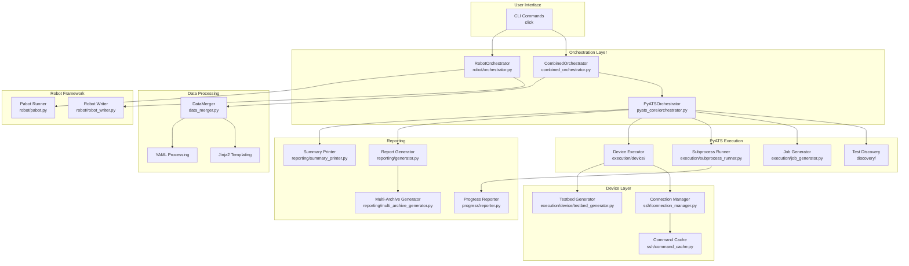
```mermaid
graph TB
    subgraph "User Interface"
        CLI[CLI Commands<br/>click]
    end

    subgraph "Orchestration Layer"
        CO[CombinedOrchestrator<br/>combined_orchestrator.py]
        PO[PyATSOrchestrator<br/>pyats_core/orchestrator.py]
        RO[RobotOrchestrator<br/>robot/orchestrator.py]
    end

    subgraph "Data Processing"
        DM[DataMerger<br/>data_merger.py]
        J2[Jinja2 Templating]
        YAML[YAML Processing]
    end

    subgraph "PyATS Execution"
        TD[Test Discovery<br/>discovery/]
        JG[Job Generator<br/>execution/job_generator.py]
        SR[Subprocess Runner<br/>execution/subprocess_runner.py]
        DE[Device Executor<br/>execution/device/]
    end

    subgraph "Device Layer"
        CM[Connection Manager<br/>ssh/connection_manager.py]
        CC[Command Cache<br/>ssh/command_cache.py]
        TG[Testbed Generator<br/>execution/device/testbed_generator.py]
    end

    subgraph "Reporting"
        RG[Report Generator<br/>reporting/generator.py]
        MARG[Multi-Archive Generator<br/>reporting/multi_archive_generator.py]
        SP[Summary Printer<br/>reporting/summary_printer.py]
        PR[Progress Reporter<br/>progress/reporter.py]
    end

    subgraph "Robot Framework"
        RW[Robot Writer<br/>robot/robot_writer.py]
        PB[Pabot Runner<br/>robot/pabot.py]
    end

    CLI --> CO
    CLI --> RO
    CO --> PO
    CO --> DM
    DM --> J2
    DM --> YAML
    PO --> TD
    PO --> JG
    PO --> SR
    PO --> DE
    DE --> CM
    DE --> TG
    CM --> CC
    PO --> RG
    RG --> MARG
    PO --> SP
    SR --> PR
    RO --> RW
    RO --> PB
```

---

## Core Commands

### pyats Command

The `--pyats` flag triggers PyATS-based test execution, supporting both API and D2D test modes with parallel execution and comprehensive reporting.

#### Command Syntax

```bash
nac-test --pyats [OPTIONS]

Options:
  --data PATH                Path to data YAML file or directory
  --templates PATH           Path to Robot templates directory
  --filters PATH             Path to Python filters file
  --output-dir PATH          Output directory for results (default: ./output)
  --parallel INTEGER         Number of parallel workers (default: auto)
  --test-dir PATH            Directory containing PyATS test files
  --minimal-reports          Only include command outputs for failed tests
  -v, --verbose              Enable verbose logging
```

#### Execution Flow

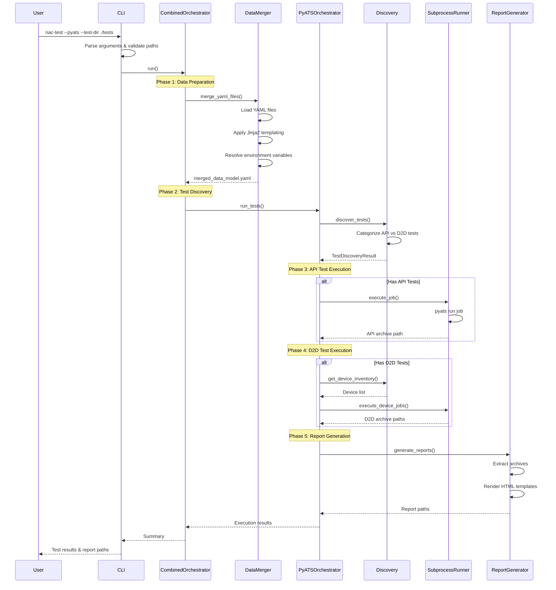
```mermaid
sequenceDiagram
    participant User
    participant CLI
    participant CombinedOrch as CombinedOrchestrator
    participant DataMerger
    participant PyATSOrch as PyATSOrchestrator
    participant Discovery
    participant SubprocessRunner
    participant ReportGenerator

    User->>CLI: nac-test --pyats --test-dir ./tests
    CLI->>CLI: Parse arguments & validate paths

    CLI->>CombinedOrch: run()

    Note over CombinedOrch: Phase 1: Data Preparation
    CombinedOrch->>DataMerger: merge_yaml_files()
    DataMerger->>DataMerger: Load YAML files
    DataMerger->>DataMerger: Apply Jinja2 templating
    DataMerger->>DataMerger: Resolve environment variables
    DataMerger-->>CombinedOrch: merged_data_model.yaml

    Note over CombinedOrch: Phase 2: Test Discovery
    CombinedOrch->>PyATSOrch: run_tests()
    PyATSOrch->>Discovery: discover_tests()
    Discovery->>Discovery: Categorize API vs D2D tests
    Discovery-->>PyATSOrch: TestDiscoveryResult

    Note over PyATSOrch: Phase 3: API Test Execution
    alt Has API Tests
        PyATSOrch->>SubprocessRunner: execute_job()
        SubprocessRunner->>SubprocessRunner: pyats run job
        SubprocessRunner-->>PyATSOrch: API archive path
    end

    Note over PyATSOrch: Phase 4: D2D Test Execution
    alt Has D2D Tests
        PyATSOrch->>Discovery: get_device_inventory()
        Discovery-->>PyATSOrch: Device list
        PyATSOrch->>SubprocessRunner: execute_device_jobs()
        SubprocessRunner-->>PyATSOrch: D2D archive paths
    end

    Note over PyATSOrch: Phase 5: Report Generation
    PyATSOrch->>ReportGenerator: generate_reports()
    ReportGenerator->>ReportGenerator: Extract archives
    ReportGenerator->>ReportGenerator: Render HTML templates
    ReportGenerator-->>PyATSOrch: Report paths

    PyATSOrch-->>CombinedOrch: Execution results
    CombinedOrch-->>CLI: Summary
    CLI-->>User: Test results & report paths
```

#### Detailed Process Flow

##### 1. **Entry Point** (`cli/main.py`)

The CLI is built with Click and serves as the main entry point:

```python
@click.command()
@click.option("--pyats", is_flag=True, help="Run PyATS tests")
@click.option("--data", type=click.Path(), help="Data YAML path")
@click.option("--templates", type=click.Path(), help="Templates directory")
@click.option("--test-dir", type=click.Path(), help="PyATS test directory")
@click.option("--output-dir", type=click.Path(), default="output")
@click.option("--parallel", type=int, default=None)
def main(pyats, data, templates, test_dir, output_dir, parallel):
```

**Key Steps:**

1. **Argument Validation**: Validates all provided paths exist
2. **Worker Calculation**: Auto-calculates parallel workers if not specified
3. **Environment Setup**: Loads environment variables from data files
4. **Orchestrator Selection**: Routes to PyATS or Robot orchestrator based on flags

##### 2. **Combined Orchestrator** (`combined_orchestrator.py`)

The `CombinedOrchestrator` coordinates the complete test execution workflow:


```mermaid
graph LR
    subgraph "Phase 1: Data Preparation"
        A1[Load Data Files] --> A2[Apply Jinja2]
        A2 --> A3[Merge YAML]
        A3 --> A4[Write merged_data_model.yaml]
    end

    subgraph "Phase 2: Test Discovery"
        B1[Scan test-dir] --> B2[Identify API Tests]
        B2 --> B3[Identify D2D Tests]
        B3 --> B4[Create TestDiscoveryResult]
    end

    subgraph "Phase 3: Execution"
        C1[Run API Tests] --> C2[Run D2D Tests]
        C2 --> C3[Collect Archives]
    end

    subgraph "Phase 4: Reporting"
        D1[Extract Archives] --> D2[Generate HTML]
        D2 --> D3[Print Summary]
    end

    A4 --> B1
    B4 --> C1
    C3 --> D1
```

**Key Responsibilities:**

- **Test Type Discovery**: Detects presence of PyATS and Robot Framework tests
- **Development Mode Routing**: Handles `--pyats` and `--robot` flags for fast iteration
- **Sequential Execution**: Runs PyATS first, then Robot Framework (production mode)
- **Result Aggregation**: Combines results into typed `CombinedResults` dataclass
- **Combined Dashboard**: Triggers generation of unified `combined_summary.html`

**Note**: Data merging happens in CLI (`main.py`) before orchestrator initialization, establishing a Single Source of Truth shared across frameworks.

##### 3. **Data Merger** (`data_merger.py`)

Handles YAML data processing with Jinja2 templating:

```python
class DataMerger:
    def merge_yaml_files(
        self,
        data_paths: List[Path],
        filter_path: Optional[Path] = None
    ) -> Dict[str, Any]:
```

**Features:**

- **Deep Merging**: Recursively merges nested YAML structures
- **Jinja2 Support**: Variable interpolation and template functions
- **Environment Variables**: `${VAR_NAME}` syntax for env var substitution
- **Custom Filters**: Load Python filter functions for Jinja2

##### 4. **Test Discovery** (`pyats_core/discovery/test_discovery.py`)

Categorizes tests into API and D2D types:

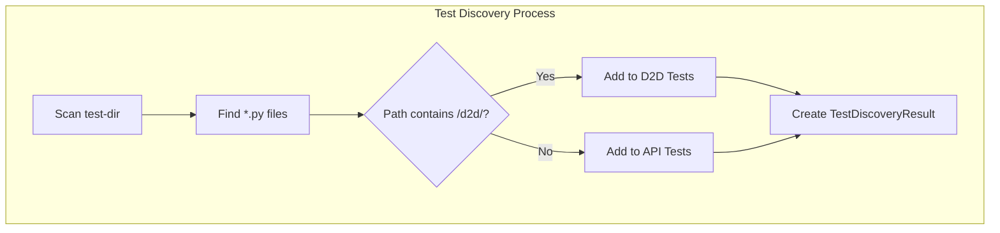
```mermaid
flowchart TB
    subgraph "Test Discovery Process"
        Scan[Scan test-dir] --> FindPy[Find *.py files]
        FindPy --> CheckPath{Path contains /d2d/?}
        CheckPath -->|Yes| D2DList[Add to D2D Tests]
        CheckPath -->|No| APIList[Add to API Tests]
        D2DList --> CreateResult[Create TestDiscoveryResult]
        APIList --> CreateResult
    end
```

**Classification Logic:**

- **D2D Tests**: Files under any `/d2d/` directory in the path
- **API Tests**: All other Python test files
- **Robot Files**: Discovered separately via glob patterns

##### 5. **PyATS Orchestrator** (`pyats_core/orchestrator.py`)

Main orchestration engine for PyATS test execution:

**Key Methods:**

- **`run_tests()`**: Main entry point coordinating all phases
- **`_run_api_tests()`**: Executes API-based tests
- **`_run_d2d_tests()`**: Executes device-centric SSH tests
- **`_generate_reports()`**: Triggers HTML report generation

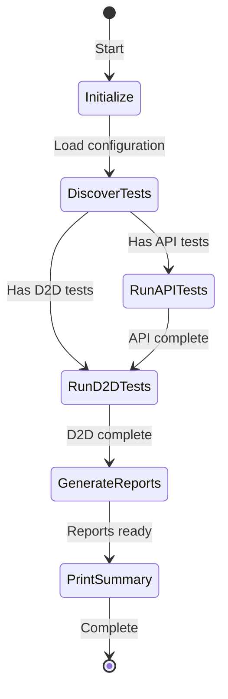
```mermaid
stateDiagram-v2
    [*] --> Initialize: Start
    Initialize --> DiscoverTests: Load configuration
    DiscoverTests --> RunAPITests: Has API tests
    DiscoverTests --> RunD2DTests: Has D2D tests
    RunAPITests --> RunD2DTests: API complete
    RunD2DTests --> GenerateReports: D2D complete
    GenerateReports --> PrintSummary: Reports ready
    PrintSummary --> [*]: Complete
```

---

### Robot Framework Integration

The Robot Framework orchestrator provides parallel test execution via Pabot:

#### Command Syntax

```bash
nac-test --data ./data --templates ./templates [OPTIONS]

Options:
  --data PATH              Path to data YAML file or directory
  --templates PATH         Path to Robot templates directory
  --filters PATH           Path to Python filters file
  --output-dir PATH        Output directory
  --parallel INTEGER       Number of parallel processes
```

#### Robot Orchestrator Flow

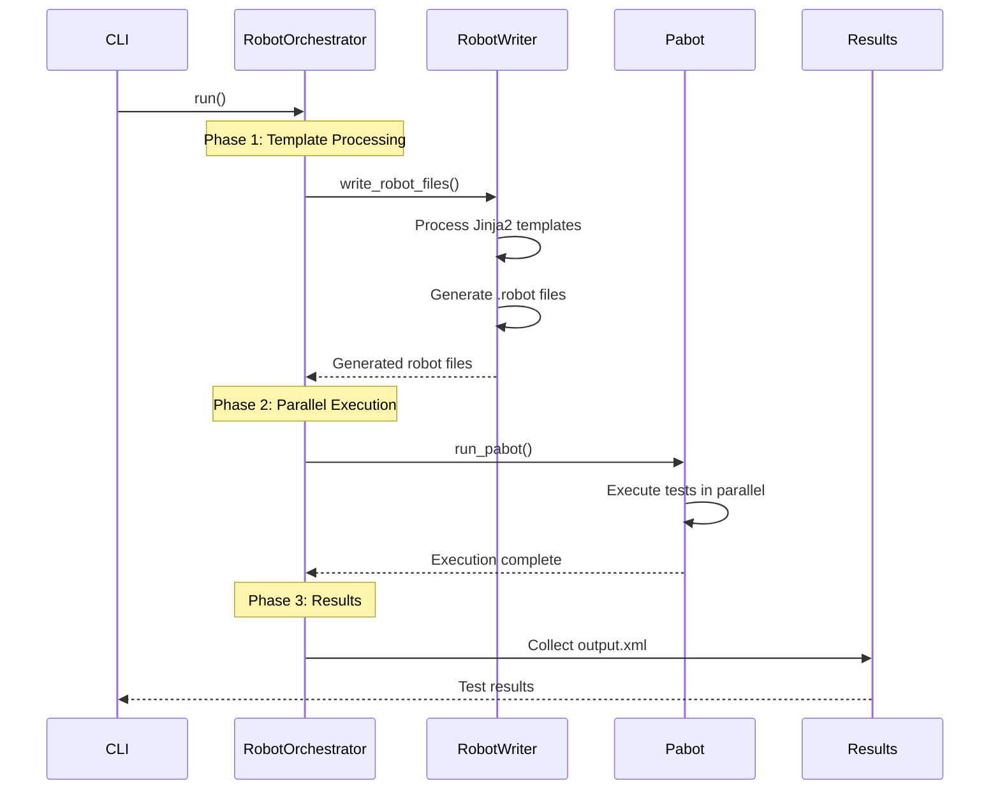
```mermaid
sequenceDiagram
    participant CLI
    participant RobotOrch as RobotOrchestrator
    participant RobotWriter
    participant Pabot
    participant Results

    CLI->>RobotOrch: run()

    Note over RobotOrch: Phase 1: Template Processing
    RobotOrch->>RobotWriter: write_robot_files()
    RobotWriter->>RobotWriter: Process Jinja2 templates
    RobotWriter->>RobotWriter: Generate .robot files
    RobotWriter-->>RobotOrch: Generated robot files

    Note over RobotOrch: Phase 2: Parallel Execution
    RobotOrch->>Pabot: run_pabot()
    Pabot->>Pabot: Execute tests in parallel
    Pabot-->>RobotOrch: Execution complete

    Note over RobotOrch: Phase 3: Results
    RobotOrch->>Results: Collect output.xml
    Results-->>CLI: Test results
```

---

## Architecture Components

### CLI Layer: Entry Point Architecture

#### Overview

The CLI (`cli/main.py`) is nac-test's **user-facing gateway**, providing a type-safe Typer-based command-line interface with comprehensive argument validation, environment variable support, orchestration coordination, and error handling. As the entry point to the entire system, the CLI transforms user intent into orchestrated test execution across PyATS and Robot Framework.

**Why CLI Entry Point Documentation Matters:**

- **First User Touchpoint**: The CLI is how all users interact with nac-test
- **Type Safety**: Typer annotations provide compile-time validation and IDE support
- **Configuration Flexibility**: Every flag supports environment variables for CI/CD integration
- **Validation Gateway**: Mutual exclusivity checks and path validation occur here
- **Orchestration Coordinator**: Routes execution to appropriate orchestrator based on flags
- **Error Context**: Error handler tracks failures for proper exit codes

**Key Design Principles:**

1. **Type-Safe by Default**: All parameters use Typer's Annotated type system
2. **Environment Variable First**: Every CLI flag has corresponding env var (CI/CD friendly)
3. **Fail Fast**: Input validation happens before expensive operations
4. **Single Source of Truth**: Merged data model created once, shared across both frameworks
5. **Clear Error Messages**: Typer's rich output + errorhandler for actionable feedback
6. **Observable Execution**: Runtime tracking with timestamps for benchmarking

---

#### CLI Exit Code Strategy

nac-test implements graduated exit codes following Robot Framework conventions to provide meaningful feedback for CI/CD systems:

**Exit Code Semantics:**

| Exit Code | Meaning | Usage in nac-test |
|-----------|---------|-------------------|
| **0** | Success | All tests passed across all frameworks |
| **1-250** | Test failures | Exact count of failed tests (capped at 250) |
| **252** | Invalid arguments or no tests | Robot Framework argument errors or no tests found |
| **253** | Execution interrupted | Test execution was interrupted (Ctrl+C, etc.) |
| **255** | Infrastructure errors | Framework crashes, controller auth failures, etc. |

**Implementation Details:**

- **CombinedResults.exit_code**: Aggregated exit code across all frameworks (single source of truth)
- **Priority Order**: Infrastructure errors (255) > Invalid arguments (252) > Test failures (1-250) > Success (0)
- **Failure Aggregation**: Sums failures across all frameworks, capped at 250 per Robot Framework spec
- **Special Cases**:
  - Intentionally skipped execution (render-only mode) returns 0
  - Empty results (no tests found) returns 252

**CI/CD Integration Benefits:**

```bash
# Distinguish between test failures and infrastructure issues
nac-test -d config/ -t templates/ -o output/
case $? in
  0) echo "✅ All tests passed" ;;
  [1-9]|[1-9][0-9]|[12][0-4][0-9]|250) echo "❌ $? test(s) failed" ;;
  252) echo "⚠️ No tests found or invalid arguments" ;;
  255) echo "💥 Infrastructure error" ;;
esac
```

---

#### Complete CLI Flag Reference

nac-test provides 13 CLI flags covering data input, template configuration, execution control, output management, and development modes.

##### Core Input Flags

**`-d, --data`** (REQUIRED)
- **Type**: `list[Path]` (multiple paths accepted)
- **Validation**: Must exist (files or directories)
- **Environment Variable**: `NAC_TEST_DATA`
- **Purpose**: YAML data model files for test configuration
- **Behavior**:
  - Multiple paths merged using deep merge algorithm (documented in Data Model Merging Process)
  - Supports both individual files and directories (scans for `.yaml`/`.yml`)
  - Last file wins for conflicting keys (hierarchical override)
- **Examples**:
  ```bash
  # Single file
  nac-test -d config/aci_fabric.yaml -t templates/ -o output/

  # Multiple files (merged)
  nac-test -d base.yaml -d prod-overlay.yaml -t templates/ -o output/

  # Directory (all YAML files merged)
  nac-test -d config/ -t templates/ -o output/

  # Environment variable
  export NAC_TEST_DATA="config/base.yaml:config/prod.yaml"
  nac-test -t templates/ -o output/
  ```

**`-t, --templates`** (REQUIRED)
- **Type**: `Path`
- **Validation**: Must exist, must be directory (not file)
- **Environment Variable**: `NAC_TEST_TEMPLATES`
- **Purpose**: Directory containing Robot Framework `.robot` test templates with Jinja2 syntax
- **Behavior**:
  - Scanned recursively for `.robot` files
  - Rendered with merged data model as Jinja2 context
  - Used by both Robot orchestrator (template rendering) and PyATS orchestrator (test discovery)
- **Example**:
  ```bash
  nac-test -d config/ -t templates/aci/ -o output/
  ```

**`-o, --output`** (REQUIRED)
- **Type**: `Path`
- **Validation**: None (created if doesn't exist)
- **Environment Variable**: `NAC_TEST_OUTPUT`
- **Purpose**: Output directory for all test artifacts (merged data, archives, reports)
- **Behavior**:
  - Created automatically via `output.mkdir(parents=True, exist_ok=True)`
  - Contains merged data model (SOT for both frameworks)
  - Subdirectories created by orchestrators: `pyats_results/`, `robot_results/`, `html_report_data_temp/`
- **Example**:
  ```bash
  nac-test -d config/ -t templates/ -o output/run-2025-01-15/
  ```

##### Optional Configuration Flags

**`-f, --filters`** (OPTIONAL)
- **Type**: `Path | None`
- **Validation**: Must exist if provided, must be directory
- **Environment Variable**: `NAC_TEST_FILTERS`
- **Purpose**: Directory containing custom Python Jinja2 filters for Robot template rendering
- **Behavior**:
  - Filters loaded as Python modules
  - Available in Robot templates via Jinja2 environment
  - Enables custom data transformation logic in templates
- **Example**:
  ```bash
  nac-test -d config/ -t templates/ -f custom_filters/ -o output/
  ```

**`--tests`** (OPTIONAL)
- **Type**: `Path | None`
- **Validation**: Must exist if provided, must be directory
- **Environment Variable**: `NAC_TEST_TESTS`
- **Purpose**: Directory containing custom Jinja2 test functions (boolean checks) for Robot templates
- **Behavior**:
  - Tests loaded and registered with Jinja2 environment
  - Used in Robot templates for conditional logic (``)
- **Example**:
  ```bash
  nac-test -d config/ -t templates/ --tests custom_tests/ -o output/
  ```

**`-m, --merged-data-filename`** (OPTIONAL)
- **Type**: `str`
- **Default**: `"merged_data_model_test_variables.yaml"`
- **Environment Variable**: None (CLI only)
- **Purpose**: Custom filename for merged data model YAML (SOT shared across frameworks)
- **Behavior**:
  - Written to `{output_dir}/{merged_data_filename}`
  - Passed to CombinedOrchestrator constructor
  - Both PyATS and Robot read from this shared file
- **Example**:
  ```bash
  nac-test -d config/ -t templates/ -o output/ -m merged_data_prod.yaml
  ```

##### Execution Control Flags

**`-i, --include`** (OPTIONAL)
- **Type**: `list[str]`
- **Default**: `[]` (all tests)
- **Environment Variable**: `NAC_TEST_INCLUDE`
- **Purpose**: Select test cases by tag (include filter for Robot Framework)
- **Behavior**:
  - Passed to Robot Framework via Pabot's tag filtering
  - Multiple tags: logical OR (test must match ANY tag)
  - Combined with `--exclude` (exclude takes precedence)
- **Examples**:
  ```bash
  # Run only "smoke" tagged tests
  nac-test -d config/ -t templates/ -o output/ -i smoke

  # Run "smoke" OR "api" tagged tests
  nac-test -d config/ -t templates/ -o output/ -i smoke -i api

  # Environment variable
  export NAC_TEST_INCLUDE="smoke:regression"
  nac-test -d config/ -t templates/ -o output/
  ```

**`-e, --exclude`** (OPTIONAL)
- **Type**: `list[str]`
- **Default**: `[]` (no exclusions)
- **Environment Variable**: `NAC_TEST_EXCLUDE`
- **Purpose**: Exclude test cases by tag (exclude filter for Robot Framework)
- **Behavior**:
  - Takes precedence over `--include` (excluded tests never run)
  - Multiple tags: logical OR (test excluded if it matches ANY tag)
- **Example**:
  ```bash
  # Run all tests EXCEPT "wip" (work in progress)
  nac-test -d config/ -t templates/ -o output/ -e wip
  ```

**`--max-parallel-devices`** (OPTIONAL)
- **Type**: `int`
- **Validation**: `min=1, max=500`
- **Default**: `None` (auto-calculated by SystemResourceCalculator)
- **Environment Variable**: `NAC_TEST_MAX_PARALLEL_DEVICES`
- **Purpose**: Override automatic worker calculation for SSH/D2D tests (set upper limit)
- **Behavior**:
  - Caps the number of devices tested in parallel
  - Used when automatic calculation is too aggressive for specific environments
  - Does not affect PyATS API test concurrency (controlled by DEFAULT_API_CONCURRENCY constant)
- **Example**:
  ```bash
  # Limit to 20 parallel devices (automatic might calculate 50)
  nac-test -d config/ -t templates/ -o output/ --max-parallel-devices 20
  ```

**`--render-only`** (OPTIONAL)
- **Type**: `bool` (flag)
- **Default**: `False`
- **Environment Variable**: `NAC_TEST_RENDER_ONLY`
- **Purpose**: Render Robot templates without executing tests (template debugging mode)
- **Behavior**:
  - Data model merging: RUNS
  - Robot template rendering: RUNS (templates written to output dir)
  - Test execution: SKIPPED (neither PyATS nor Robot execution)
  - Use case: Verify template rendering logic without expensive test execution
- **Example**:
  ```bash
  # Check if templates render correctly with new data model
  nac-test -d config/ -t templates/ -o output/ --render-only
  ```

**`--dry-run`** (OPTIONAL)
- **Type**: `bool` (flag)
- **Default**: `False`
- **Environment Variable**: `NAC_TEST_DRY_RUN`
- **Purpose**: Robot Framework dry run mode (syntax validation without execution)
- **Behavior**:
  - Passed directly to Robot Framework (`robot --dryrun`)
  - Validates test syntax and structure
  - Does not execute test logic or connect to devices/controllers
- **Example**:
  ```bash
  # Validate Robot test syntax
  nac-test -d config/ -t templates/ -o output/ --dry-run
  ```

##### Output Control Flags

**`--minimal-reports`** (OPTIONAL)
- **Type**: `bool` (flag)
- **Default**: `False`
- **Environment Variable**: `NAC_TEST_MINIMAL_REPORTS`
- **Purpose**: HTML report artifact size reduction (80-95% smaller archives)
- **Behavior**:
  - Passed to ReportGenerator via orchestrator
  - PASSED/SKIPPED/INFO tests: Minimal command output in HTML (first 10 lines only)
  - FAILED/ERRORED tests: Full command output preserved (for debugging)
  - Dramatically reduces archive size in large-scale environments (documented in HTML Report Generation Process)
- **Example**:
  ```bash
  # Generate minimal reports for CI/CD artifact storage
  nac-test -d config/ -t templates/ -o output/ --minimal-reports
  ```

##### Development Mode Flags (Mutually Exclusive)

**`--pyats`** (DEVELOPMENT ONLY)
- **Type**: `bool` (flag)
- **Default**: `False`
- **Environment Variable**: `NAC_TEST_PYATS`
- **Purpose**: Run ONLY PyATS tests, skip Robot Framework (4-48x faster development cycles)
- **Behavior**:
  - Early return in CombinedOrchestrator after PyATS execution
  - Robot orchestrator never initialized
  - Yellow warning displayed to prevent production misuse
  - Cannot be combined with `--robot` (mutual exclusivity enforced)
- **Use Cases**: API test development, data model iteration, PyATS test debugging
- **Example**:
  ```bash
  # Fast PyATS-only iteration (30s vs 8min combined)
  nac-test -d config/ -t templates/ -o output/ --pyats
  ```

**`--robot`** (DEVELOPMENT ONLY)
- **Type**: `bool` (flag)
- **Default**: `False`
- **Environment Variable**: `NAC_TEST_ROBOT`
- **Purpose**: Run ONLY Robot Framework tests, skip PyATS (2.5-48x faster template development)
- **Behavior**:
  - Early return in CombinedOrchestrator after Robot execution
  - PyATS orchestrator never initialized
  - Yellow warning displayed to prevent production misuse
  - Cannot be combined with `--pyats` (mutual exclusivity enforced)
- **Use Cases**: Robot template development, Jinja2 rendering verification, filter/test debugging
- **Example**:
  ```bash
  # Fast Robot-only iteration (10s vs 8min combined)
  nac-test -d config/ -t templates/ -o output/ --robot
  ```

##### Logging and Metadata Flags

**`-v, --verbosity`** (OPTIONAL)
- **Type**: `VerbosityLevel` (enum)
- **Values**: `CRITICAL`, `ERROR`, `WARNING` (default), `INFO`, `DEBUG`
- **Environment Variable**: `NAC_VALIDATE_VERBOSITY`
- **Eager**: `True` (processed before other options for early logging configuration)
- **Purpose**: Control logging output granularity
- **Behavior**:
  - Configures Python's logging framework via `configure_logging()`
  - Applied globally before orchestrator initialization
  - DEBUG: Detailed execution flow, timing, internal state
  - INFO: Operational messages, progress updates
  - WARNING: Default - important events, skipped tests
  - ERROR: Failures with tracebacks
  - CRITICAL: Fatal errors requiring immediate attention
- **Examples**:
  ```bash
  # Verbose debugging output
  nac-test -d config/ -t templates/ -o output/ -v DEBUG

  # Operational visibility
  nac-test -d config/ -t templates/ -o output/ -v INFO
  ```

**`--version`** (SPECIAL)
- **Type**: `bool` (flag)
- **Callback**: `version_callback()` (eager, exits immediately)
- **Purpose**: Display nac-test version and exit
- **Behavior**:
  - Eager evaluation (processed before main())
  - Prints version from `nac_test.__version__`
  - Raises `typer.Exit()` without executing tests
- **Example**:
  ```bash
  $ nac-test --version
  nac-test, version 1.1.0
  ```

---

#### Typer Type System and Annotations

nac-test uses Typer's **Annotated** type system for type-safe CLI argument definitions with automatic validation, help text generation, and IDE support.

**Pattern: Annotated Type Definitions**

```python
# From cli/main.py
Data = Annotated[
    list[Path],                    # Parameter type (modern Python 3.9+ generic)
    typer.Option(                  # Typer configuration
        "-d",                      # Short flag
        "--data",                  # Long flag
        exists=True,               # Path validation
        dir_okay=True,             # Directories allowed
        file_okay=True,            # Files allowed
        help="Path to data YAML files.",  # Help text
        envvar="NAC_TEST_DATA",    # Environment variable mapping
    ),
]

# Usage in main() signature
def main(
    data: Data,  # Type-safe, validated, auto-documented
    ...
```

**Key Benefits**:

1. **Compile-Time Type Safety**: IDEs and mypy validate types before runtime
2. **Automatic Validation**: Typer validates paths, ranges, mutual exclusivity
3. **Auto-Generated Help**: `nac-test --help` built from annotations
4. **Environment Variable Binding**: Seamless env var → CLI flag mapping
5. **Self-Documenting Code**: Type hints serve as inline documentation

**Modern Python Typing Features Used**:

```python
# Union types with | operator (Python 3.10+)
filters: Filters = None  # where Filters = Annotated[Path | None, ...]

# Built-in generics (Python 3.9+)
data: list[Path]  # Not typing.List[Path]
include: list[str]  # Not typing.List[str]

# Optional with explicit None default
max_parallel_devices: Optional[MaxParallelDevices] = None
```

---

#### Main Entry Point Implementation

The `main()` function orchestrates the entire nac-test execution lifecycle.

**Complete Implementation Flow**:

```python
@app.command()
def main(
    data: Data,
    templates: Templates,
    output: Output,
    filters: Filters = None,
    tests: Tests = None,
    include: Include = [],
    exclude: Exclude = [],
    render_only: RenderOnly = False,
    dry_run: DryRun = False,
    pyats: PyATS = False,
    robot: Robot = False,
    max_parallel_devices: Optional[MaxParallelDevices] = None,
    minimal_reports: MinimalReports = False,
    verbosity: Verbosity = VerbosityLevel.WARNING,
    version: Version = False,  # Handled by eager callback
    merged_data_filename: MergedDataFilename = "merged_data_model_test_variables.yaml",
) -> None:
    """A CLI tool to render and execute Robot Framework tests using Jinja templating."""

    # PHASE 1: Early Validation and Logging Setup
    # Verbosity already configured (is_eager=True processed first)
    configure_logging(verbosity, error_handler)

    # PHASE 2: Development Flag Mutual Exclusivity Check
    if pyats and robot:
        typer.echo(
            typer.style(
                "Error: Cannot use both --pyats and --robot flags simultaneously.",
                fg=typer.colors.RED,
            )
        )
        typer.echo(
            "Use one development flag at a time, or neither for combined execution."
        )
        raise typer.Exit(1)  # Exit code 1 for user error

    # PHASE 3: Output Directory Creation (Safe: parents=True, exist_ok=True)
    output.mkdir(parents=True, exist_ok=True)

    # PHASE 4: Data Model Merging (SOT Creation)
    start_time = datetime.now()
    start_timestamp = start_time.strftime("%H:%M:%S")
    typer.echo(f"\n\n[{start_timestamp}] 📄 Merging data model files...")

    # Deep merge all data files
    merged_data = DataMerger.merge_data_files(data)

    # Write merged data to output dir (SOT for both PyATS and Robot)
    DataMerger.write_merged_data_model(merged_data, output, merged_data_filename)

    end_time = datetime.now()
    end_timestamp = end_time.strftime("%H:%M:%S")
    duration = (end_time - start_time).total_seconds()
    duration_str = (
        f"{duration:.1f}s"
        if duration < 60
        else f"{int(duration // 60)}m {duration % 60:.0f}s"
    )
    typer.echo(f"[{end_timestamp}] ✅ Data model merging completed ({duration_str})")

    # PHASE 5: Orchestrator Initialization
    orchestrator = CombinedOrchestrator(
        data_paths=data,
        templates_dir=templates,
        output_dir=output,
        merged_data_filename=merged_data_filename,
        filters_path=filters,
        tests_path=tests,
        include_tags=include,
        exclude_tags=exclude,
        render_only=render_only,
        dry_run=dry_run,
        max_parallel_devices=max_parallel_devices,
        minimal_reports=minimal_reports,
        verbosity=verbosity,
        dev_pyats_only=pyats,    # Development mode flags
        dev_robot_only=robot,     # Development mode flags
    )

    # PHASE 6: Test Execution with Runtime Tracking
    runtime_start = datetime.now()

    try:
        orchestrator.run_tests()  # Main execution (may take minutes to hours)
    except Exception as e:
        # Ensure runtime displayed even on failure
        typer.echo(f"Error during execution: {e}")
        raise  # Re-raise for error_handler tracking

    # PHASE 7: Runtime Reporting
    runtime_end = datetime.now()
    total_runtime = (runtime_end - runtime_start).total_seconds()

    # Format runtime consistently with data merge timing
    if total_runtime < 60:
        runtime_str = f"{total_runtime:.2f} seconds"
    else:
        minutes = int(total_runtime / 60)
        secs = total_runtime % 60
        runtime_str = f"{minutes} minutes {secs:.2f} seconds"

    typer.echo(f"\nTotal runtime: {runtime_str}")
    exit()  # Calls custom exit() for error-aware exit code
```

**Phase-by-Phase Analysis**:

1. **Early Validation and Logging Setup**:
   - Verbosity already configured (Typer `is_eager=True` ensures early processing)
   - Logging configured via `configure_logging()` before any operations
   - Error handler tracks failures globally for exit code determination

2. **Development Flag Mutual Exclusivity Check**:
   - Prevents nonsensical `--pyats --robot` combination
   - Fails fast with clear error message (Typer red styling)
   - Exit code 1 signals user error

3. **Output Directory Creation**:
   - Safe creation with `parents=True` (creates parent dirs if needed)
   - `exist_ok=True` allows reusing existing directories
   - No validation needed (created automatically)

4. **Data Model Merging (SOT Creation)**:
   - **Single Source of Truth**: Merged data written once, read by both frameworks
   - Deep merge algorithm (documented in Data Model Merging Process)
   - Hierarchical override: last file wins for conflicts
   - Custom YAML tags resolved: `!env`, `!vault`
   - Timing instrumentation: Start/end timestamps + duration
   - User feedback: Terminal output with timestamps and duration

5. **Orchestrator Initialization**:
   - All CLI parameters passed to CombinedOrchestrator
   - Orchestrator contains all business logic (CLI only handles arg parsing)
   - Development mode flags (`dev_pyats_only`, `dev_robot_only`) passed explicitly

6. **Test Execution with Runtime Tracking**:
   - Runtime tracked separately from data merge time
   - `try/except` ensures runtime displayed even on orchestrator failure
   - Exception re-raised for error_handler tracking (exit code determination)

7. **Runtime Reporting**:
   - Consistent formatting: `45.2s` or `8m 30.5s`
   - Displayed to user before exit
   - Provides benchmarking data for optimization

---

#### Error Handling and Exit Code Management

nac-test uses the **errorhandler** library for centralized error tracking and intelligent exit code determination.

**Error Handler Integration**:

```python
# From cli/main.py
import errorhandler

error_handler = errorhandler.ErrorHandler()

def exit() -> None:
    """Exit with appropriate code based on error state."""
    if error_handler.fired:
        raise typer.Exit(1)  # Non-zero exit for errors
    else:
        raise typer.Exit(0)  # Success
```

**Exit Code Contract**:

| Exit Code | Condition | Meaning |
|-----------|-----------|---------|
| `0` | `error_handler.fired == False` | Success - all tests passed or completed cleanly |
| `1` | `error_handler.fired == True` | Failure - errors occurred during execution |
| `1` | Mutual exclusivity violation | User error - invalid flag combination |

**Error Tracking Throughout Execution**:

```python
# Logging configuration registers error_handler
configure_logging(verbosity, error_handler)

# Throughout codebase:
logger.error("Connection failed")  # Tracked by error_handler
logger.critical("Fatal error")     # Tracked by error_handler

# At exit:
exit()  # Checks error_handler.fired for exit code
```

**Benefits**:

1. **Centralized State**: Single source of truth for "did errors occur?"
2. **Automatic Tracking**: All `logger.error()` and `logger.critical()` calls tracked
3. **Clean Exit Interface**: `exit()` abstracts exit code logic
4. **CI/CD Friendly**: Non-zero exit code triggers pipeline failures

---

#### Environment Variable Support

Every CLI flag (except `--version` and `--merged-data-filename`) supports environment variable configuration for CI/CD and containerized environments.

**Environment Variable Mapping Table**:

| CLI Flag | Environment Variable | Type | Example |
|----------|---------------------|------|---------|
| `-d, --data` | `NAC_TEST_DATA` | `list[Path]` | `NAC_TEST_DATA="config/base.yaml:config/prod.yaml"` |
| `-t, --templates` | `NAC_TEST_TEMPLATES` | `Path` | `NAC_TEST_TEMPLATES="/app/templates"` |
| `-o, --output` | `NAC_TEST_OUTPUT` | `Path` | `NAC_TEST_OUTPUT="/artifacts/output"` |
| `-f, --filters` | `NAC_TEST_FILTERS` | `Path` | `NAC_TEST_FILTERS="/app/filters"` |
| `--tests` | `NAC_TEST_TESTS` | `Path` | `NAC_TEST_TESTS="/app/custom_tests"` |
| `-i, --include` | `NAC_TEST_INCLUDE` | `list[str]` | `NAC_TEST_INCLUDE="smoke:regression"` |
| `-e, --exclude` | `NAC_TEST_EXCLUDE` | `list[str]` | `NAC_TEST_EXCLUDE="wip:experimental"` |
| `--render-only` | `NAC_TEST_RENDER_ONLY` | `bool` | `NAC_TEST_RENDER_ONLY=1` |
| `--dry-run` | `NAC_TEST_DRY_RUN` | `bool` | `NAC_TEST_DRY_RUN=true` |
| `--pyats` | `NAC_TEST_PYATS` | `bool` | `NAC_TEST_PYATS=1` |
| `--robot` | `NAC_TEST_ROBOT` | `bool` | `NAC_TEST_ROBOT=1` |
| `--max-parallel-devices` | `NAC_TEST_MAX_PARALLEL_DEVICES` | `int` | `NAC_TEST_MAX_PARALLEL_DEVICES=25` |
| `--minimal-reports` | `NAC_TEST_MINIMAL_REPORTS` | `bool` | `NAC_TEST_MINIMAL_REPORTS=true` |
| `-v, --verbosity` | `NAC_VALIDATE_VERBOSITY` | `enum` | `NAC_VALIDATE_VERBOSITY=DEBUG` |

**List Type Parsing**:

- **Path Lists**: Colon-separated (`:`) for cross-platform compatibility
  ```bash
  NAC_TEST_DATA="config/base.yaml:config/prod.yaml"
  ```
- **String Lists**: Colon-separated (`:`) for tag lists
  ```bash
  NAC_TEST_INCLUDE="smoke:regression:critical"
  ```

**Boolean Type Parsing**:

Typer accepts multiple boolean representations:
```bash
NAC_TEST_PYATS=1          # Truthy integer
NAC_TEST_PYATS=true       # String "true"
NAC_TEST_MINIMAL_REPORTS=yes   # String "yes"
```

**CI/CD Integration Example**:

```yaml
# GitLab CI example
test_aci_fabric:
  stage: test
  image: python:3.11
  variables:
    NAC_TEST_DATA: "config/base.yaml:config/prod.yaml"
    NAC_TEST_TEMPLATES: "templates/aci"
    NAC_TEST_OUTPUT: "output"
    NAC_TEST_MINIMAL_REPORTS: "true"
    NAC_VALIDATE_VERBOSITY: "INFO"
  script:
    - uv pip install -e .
    - nac-test  # All config from env vars
  artifacts:
    paths:
      - output/
    expire_in: 7 days
```

---

#### Practical Examples

**Example 1: Basic Combined Execution (Production Mode)**

```bash
# Execute both PyATS and Robot tests with all data merged
nac-test \
  -d config/base.yaml \
  -d config/aci_prod_overlay.yaml \
  -t templates/aci/ \
  -o output/production-run/ \
  -v INFO

# Output:
# [10:23:45] 📄 Merging data model files...
# [10:23:46] ✅ Data model merging completed (0.8s)
#
# [10:23:46] 🚀 Starting PyATS test execution...
# [10:28:30] ✅ PyATS tests completed (4m 44s)
#
# [10:28:30] 🤖 Starting Robot Framework test execution...
# [10:31:15] ✅ Robot tests completed (2m 45s)
#
# Total runtime: 7 minutes 29.82 seconds
```

**Example 2: Development Mode - PyATS Only (Fast API Iteration)**

```bash
# Test API logic without waiting for Robot rendering
nac-test \
  -d config/dev.yaml \
  -t templates/aci/ \
  -o output/dev-api/ \
  --pyats \
  -v DEBUG

# Output:
# ⚠️  WARNING: Running in PyATS-only development mode (--pyats)
# ⚠️  Robot Framework tests will be SKIPPED
#
# [10:35:12] 📄 Merging data model files...
# [10:35:12] ✅ Data model merging completed (0.3s)
#
# [10:35:12] 🚀 Starting PyATS test execution...
# [10:35:42] ✅ PyATS tests completed (30s)
#
# Total runtime: 30.45 seconds
#
# Speed improvement: 14.8x faster (30s vs 7.5min combined)
```

**Example 3: Development Mode - Robot Only (Template Debugging)**

```bash
# Verify template rendering without PyATS execution
nac-test \
  -d config/dev.yaml \
  -t templates/aci/ \
  -f custom_filters/ \
  -o output/template-debug/ \
  --robot \
  -v INFO

# Output:
# ⚠️  WARNING: Running in Robot-only development mode (--robot)
# ⚠️  PyATS tests will be SKIPPED
#
# [10:40:15] 📄 Merging data model files...
# [10:40:15] ✅ Data model merging completed (0.3s)
#
# [10:40:15] 🤖 Starting Robot Framework test execution...
# [10:40:25] ✅ Robot tests completed (10s)
#
# Total runtime: 10.12 seconds
#
# Speed improvement: 44.5x faster (10s vs 7.5min combined)
```

**Example 4: Minimal Reports for CI/CD Artifact Storage**

```bash
# Generate lightweight HTML reports (80-95% size reduction)
nac-test \
  -d config/base.yaml \
  -t templates/aci/ \
  -o output/ci-run/ \
  --minimal-reports \
  -v WARNING

# Archive sizes:
# Full reports: 30 GB (1500 tests × 20 MB avg)
# Minimal reports: 1.5 GB (95% reduction)
#
# CI/CD artifact storage savings: 28.5 GB per run
```

**Example 5: Tag-Based Test Selection**

```bash
# Run only smoke tests (fast subset for pre-commit)
nac-test \
  -d config/base.yaml \
  -t templates/aci/ \
  -o output/smoke/ \
  -i smoke \
  -v INFO

# Run regression tests but exclude WIP features
nac-test \
  -d config/base.yaml \
  -t templates/aci/ \
  -o output/regression/ \
  -i regression \
  -e wip \
  -v INFO
```

**Example 6: Environment Variable Configuration (CI/CD)**

```bash
# Set up environment (CI/CD pipeline)
export NAC_TEST_DATA="config/base.yaml:config/ci.yaml"
export NAC_TEST_TEMPLATES="templates/aci"
export NAC_TEST_OUTPUT="output/ci-$(date +%Y%m%d-%H%M%S)"
export NAC_TEST_MINIMAL_REPORTS=1
export NAC_VALIDATE_VERBOSITY=INFO

# Execute with env var config (no CLI flags needed)
nac-test

# All configuration sourced from environment variables
```

**Example 7: Custom Parallel Device Limit**

```bash
# Limit parallel devices for memory-constrained CI runners
nac-test \
  -d config/large_fabric.yaml \
  -t templates/aci/ \
  -o output/limited/ \
  --max-parallel-devices 10 \
  -v INFO

# Automatic calculation might yield 50 workers
# Manual override caps at 10 for CI runner constraints
```

**Example 8: Template Rendering Verification (No Execution)**

```bash
# Verify templates render correctly with new data model
nac-test \
  -d config/new_schema.yaml \
  -t templates/aci/ \
  -o output/render-check/ \
  --render-only \
  -v DEBUG

# Output:
# [11:05:30] 📄 Merging data model files...
# [11:05:30] ✅ Data model merging completed (0.5s)
#
# [11:05:30] 🤖 Rendering Robot Framework templates...
# [11:05:32] ✅ Templates rendered successfully
#
# Total runtime: 2.18 seconds
#
# Templates written to: output/render-check/robot_results/
# No test execution performed
```

---

#### Design Rationale

**Q1: Why Typer instead of Click or argparse?**

**A**: Typer provides the best balance of type safety, developer experience, and automatic help generation:

| Feature | argparse | Click | Typer | Winner |
|---------|----------|-------|-------|--------|
| Type Safety | Manual | Decorators | Annotated types | **Typer** |
| IDE Support | Poor | Basic | Excellent (type hints) | **Typer** |
| Automatic Help | Basic | Good | Excellent (from types) | **Typer** |
| Environment Variables | Manual | Plugin | Built-in | **Typer** |
| Validation | Manual | Decorators | Automatic (from types) | **Typer** |
| Modern Python | No | Partial | Yes (3.9+ generics) | **Typer** |

**Specific Benefits**:
- **Type Annotations as Documentation**: `data: list[Path]` is self-documenting
- **Compile-Time Validation**: mypy catches type errors before runtime
- **Automatic Conversion**: Typer converts strings to Paths, ints, enums automatically
- **Rich Terminal Output**: Built-in support for colors, styling, progress bars

**Drawbacks Accepted**:
- Slightly larger dependency footprint than argparse
- Requires Python 3.6+ (acceptable given nac-test requires 3.11+)

---

**Q2: Why separate Data Merge and Orchestrator phases?**

**A**: Data merging creates a **Single Source of Truth** before expensive operations:

**Rationale**:
1. **Fail Fast**: Invalid YAML detected before orchestrator initialization
2. **Single Source of Truth**: Both PyATS and Robot read identical merged data
3. **Timing Visibility**: User sees merge time separately from test execution time
4. **Debugging**: Merged data file available for inspection (`cat output/merged_data_model_test_variables.yaml`)

**Alternative Rejected**: Merge data inside orchestrator
- **Con**: Orchestrator initialization could fail due to data issues (less clear error)
- **Con**: Harder to debug data merging vs orchestrator issues
- **Con**: Timing not instrumented separately

---

**Q3: Why mutual exclusivity enforcement for `--pyats` and `--robot` instead of just running both?**

**A**: Prevents ambiguous user intent and catches configuration errors early:

**Scenario Without Enforcement**:
```bash
# User wants PyATS only but typos --robot
nac-test --pyats --robot -d config/ -t templates/ -o output/

# Without enforcement: Runs both (user confused by unexpected Robot execution)
# With enforcement: Fails fast with clear error message
```

**Benefits**:
1. **Clear Intent**: Flags explicitly state "ONLY PyATS" or "ONLY Robot", not both
2. **Fail Fast**: Configuration error caught immediately (exit code 1)
3. **User Education**: Error message explains correct usage
4. **Prevents Accidents**: Typos don't cause expensive unintended executions

**Implementation**:
```python
if pyats and robot:
    typer.echo(
        typer.style(
            "Error: Cannot use both --pyats and --robot flags simultaneously.",
            fg=typer.colors.RED,  # Visible red error
        )
    )
    typer.echo(
        "Use one development flag at a time, or neither for combined execution."
    )
    raise typer.Exit(1)
```

---

**Q4: Why `is_eager=True` for `--verbosity` flag?**

**A**: Logging must be configured **before** any other operations for consistent output:

**Without `is_eager=True`**:
```python
# Typer processes flags in arbitrary order
def main(data: Data, verbosity: Verbosity = VerbosityLevel.WARNING):
    # data processed first (might log messages)
    # verbosity processed second (logging config too late)
```

**With `is_eager=True`**:
```python
Verbosity = Annotated[
    VerbosityLevel,
    typer.Option(
        "-v",
        "--verbosity",
        is_eager=True,  # Process FIRST, before all other flags
        ...
    ),
]

def main(data: Data, verbosity: Verbosity = VerbosityLevel.WARNING):
    configure_logging(verbosity, error_handler)  # Already configured
    # All subsequent operations use correct log level
```

**Benefits**:
1. **Consistent Logging**: All operations use configured log level
2. **Debugging**: DEBUG verbosity captures early initialization messages
3. **Predictable Behavior**: Logging config always happens first

---

**Q5: Why runtime tracking separate from data merge timing?**

**A**: Provides granular performance visibility for benchmarking and optimization:

**Timing Breakdown**:
```
[10:23:45] 📄 Merging data model files...
[10:23:46] ✅ Data model merging completed (0.8s)  ← Merge time

[10:23:46] 🚀 Starting test execution...
[10:31:15] ✅ Tests completed                      ← Orchestrator time

Total runtime: 7 minutes 29.82 seconds             ← Total (merge + orchestrator)
```

**Benefits**:
1. **Performance Profiling**: Identify if merge or execution is bottleneck
2. **Optimization Targets**: "Merge taking 5min? Optimize YAML parsing" vs "Execution taking 5min? Optimize parallel workers"
3. **Regression Detection**: Track timing changes across versions
4. **User Feedback**: Clear progress indicators during long operations

**Alternative Rejected**: Single "Total Time" only
- **Con**: Cannot identify where time is spent (merge vs execution)
- **Con**: Harder to optimize (unknown bottleneck)

---

#### Key Takeaways

1. **Type-Safe by Design**: Typer's Annotated types provide compile-time validation and self-documentation
2. **Environment Variable First**: Every flag supports env vars for CI/CD and container-friendly configuration
3. **Fail Fast Philosophy**: Input validation and mutual exclusivity checks happen before expensive operations
4. **Single Source of Truth**: Merged data model created once, shared across both PyATS and Robot frameworks
5. **Observable Execution**: Timing instrumentation at multiple granularities (merge time, execution time, total time)
6. **Error-Aware Exit Codes**: Centralized error tracking via errorhandler ensures correct CI/CD pipeline behavior
7. **Development Mode Support**: `--pyats` and `--robot` flags provide 4-48x faster iteration cycles
8. **Clear User Feedback**: Rich terminal output with timestamps, colors, and progress indicators
9. **Flexible Configuration**: 13 CLI flags covering all aspects of test execution with sensible defaults
10. **CI/CD Native**: Environment variable support, exit codes, and minimal reports designed for automated pipelines

---

#### Design Philosophy

> The CLI is nac-test's **front door** - it must be welcoming, type-safe, and foolproof. Type annotations provide compile-time safety and self-documentation. Environment variables enable configuration-as-code for CI/CD pipelines. Mutual exclusivity enforcement prevents ambiguous intent. Fail-fast validation catches errors before expensive operations. Timing instrumentation provides performance visibility at multiple granularities. The merged data model serves as a Single Source of Truth, created once and shared across both frameworks. Development mode flags (`--pyats`, `--robot`) optimize for rapid iteration (4-48x faster) without compromising production completeness. Error-aware exit codes ensure reliable pipeline integration. Rich terminal output keeps users informed during long-running operations. The result is a CLI that feels intuitive for interactive use while being robust and automatable for CI/CD environments.

---

### Orchestration Flow: End-to-End Execution Lifecycle

nac-test's orchestration system coordinates the complete test execution lifecycle from CLI entry to final HTML reports through a multi-layered architecture. This system handles development mode routing, dynamic resource management, isolated subprocess execution, and device-centric D2D coordination—all designed for maximum throughput, reliability, and observability.

---

#### Overview: The Orchestration Pipeline

The orchestration pipeline consists of four primary layers working together to execute tests efficiently:

1. **CombinedOrchestrator** (`combined_orchestrator.py`): Lightweight top-level coordinator that handles development mode routing (`--pyats` / `--robot` flags) and sequential PyATS + Robot Framework execution
2. **PyATSOrchestrator** (`pyats_core/orchestrator.py`): Main PyATS orchestration engine with dynamic resource management, test discovery, and report generation
3. **SubprocessRunner** (`pyats_core/execution/subprocess_runner.py`): Executes PyATS jobs in isolated subprocesses with real-time output processing and buffer overrun handling
4. **DeviceExecutor** (`pyats_core/execution/device/device_executor.py`): Coordinates device-centric D2D test execution with semaphore-controlled concurrency

**Why This Architecture Exists:**

- **Process Isolation**: PyATS tests run in separate subprocesses to prevent memory leaks, state pollution, and resource conflicts between tests
- **Parallel Execution**: Device-centric execution enables testing 50+ devices concurrently with semaphore-controlled resource limits
- **Connection Pooling**: Connection Broker shares SSH connections across all device subprocesses (500 connections → 50 shared)
- **Flexible Routing**: Development modes enable fast iteration (4-48x faster) while production mode ensures comprehensive coverage
- **Dynamic Resource Management**: Worker counts adapt to available CPU/memory, preventing resource exhaustion on different hardware
- **Cross-Process Communication**: Environment variables safely pass configuration across subprocess boundaries since Python objects cannot be shared

---

#### Component Architecture

##### 1. CombinedOrchestrator: Top-Level Coordinator

**Location**: `combined_orchestrator.py`

**Purpose**: Lightweight coordinator that discovers test types, routes execution based on development mode flags, and delegates to specialized orchestrators.

**Key Responsibilities:**

1. **Development Mode Routing**: Handle `--pyats` (PyATS only) and `--robot` (Robot only) flags for fast iteration
2. **Test Type Discovery**: Detect presence of PyATS tests (`.py` files) and Robot templates (`.robot`, `.j2` files)
3. **Sequential Execution**: Run PyATS tests first, then Robot tests (production mode)
4. **Summary Reporting**: Print combined execution summary with output directory paths

**Core Implementation:**

```python
class CombinedOrchestrator:
    """Lightweight coordinator for sequential PyATS and Robot Framework test execution."""

    def __init__(
        self,
        data_paths: List[Path],
        templates_dir: Path,
        output_dir: Path,
        merged_data_filename: str,
        # ... other parameters ...
        dev_pyats_only: bool = False,
        dev_robot_only: bool = False,
    ):
        # Store configuration
        self.dev_pyats_only = dev_pyats_only
        self.dev_robot_only = dev_robot_only
        # ... initialization ...

    def run_tests(self) -> CombinedResults:
        """Main entry point for combined test execution.

        Returns:
            CombinedResults: Aggregated results with api, d2d, and robot TestResults.
        """
        results = CombinedResults()

        # DEVELOPMENT MODE: PyATS only
        if self.dev_pyats_only:
            typer.secho(
                "\n\n⚠️  WARNING: --pyats flag is for development use only...",
                fg=typer.colors.YELLOW
            )
            orchestrator = PyATSOrchestrator(...)
            pyats_results = orchestrator.run_tests()  # Returns PyATSResults
            results.api = pyats_results.api
            results.d2d = pyats_results.d2d
            return results

        # DEVELOPMENT MODE: Robot only
        if self.dev_robot_only:
            typer.secho(
                "\n\n⚠️  WARNING: --robot flag is for development use only...",
                fg=typer.colors.YELLOW
            )
            robot_orchestrator = RobotOrchestrator(...)
            results.robot = robot_orchestrator.run_tests()  # Returns TestResults
            return results

        # PRODUCTION MODE: Combined execution
        has_pyats, has_robot = self._discover_test_types()

        if has_pyats:
            typer.echo("\n🧪 Running PyATS tests...\n")
            orchestrator = PyATSOrchestrator(...)
            pyats_results = orchestrator.run_tests()  # Returns PyATSResults
            results.api = pyats_results.api
            results.d2d = pyats_results.d2d

        if has_robot:
            typer.echo("\n🤖 Running Robot Framework tests...\n")
            robot_orchestrator = RobotOrchestrator(...)
            results.robot = robot_orchestrator.run_tests()  # Returns TestResults

        self._print_execution_summary(results)
        return results
```

**Key Design Decision**: CombinedOrchestrator does NOT merge data files or create merged data model. The CLI (`main.py`) creates the merged data model **once** before orchestrator initialization, establishing a Single Source of Truth shared across both PyATS and Robot frameworks. This eliminates redundant merging and ensures consistency.

**Test Discovery Logic:**

```python
def _discover_test_types(self) -> Tuple[bool, bool]:
    """Discover which test types are present."""

    # PyATS discovery - use TestDiscovery for precision
    has_pyats = False
    test_discovery = TestDiscovery(self.templates_dir)
    pyats_files, _ = test_discovery.discover_pyats_tests()
    has_pyats = bool(pyats_files)

    # Robot discovery - simple file existence check
    has_robot = any(
        f.suffix in [".robot", ".resource", ".j2"]
        for f in self.templates_dir.rglob("*")
        if f.is_file()
    )

    return has_pyats, has_robot
```

---

##### 2. PyATSOrchestrator: Main PyATS Execution Engine

**Location**: `pyats_core/orchestrator.py`

**Purpose**: Core PyATS orchestration engine that manages resource allocation, test discovery, subprocess execution, report generation, and cleanup.

**Key Responsibilities:**

1. **Dynamic Resource Management**: Calculate optimal worker counts based on CPU/memory using SystemResourceCalculator
2. **Test Discovery**: Discover PyATS test files and device inventory from merged data model
3. **Test Classification**: Separate tests into API tests (single job) vs D2D/SSH tests (device-centric execution)
4. **Output Directory Management**: Create `pyats_results/` subdirectory, initialize ProgressReporter and OutputProcessor
5. **Subprocess Coordination**: Execute API tests as single consolidated job, execute D2D tests with per-device jobs
6. **Report Generation**: Generate HTML reports using MultiArchiveReportGenerator with minimal reports mode support
7. **Cleanup**: Remove PyATS runtime artifacts, old test outputs, and temporary files

**Initialization and Component Setup:**

```python
class PyATSOrchestrator:
    """Orchestrates PyATS test execution with dynamic resource management."""

    def __init__(
        self,
        data_paths: List[Path],
        test_dir: Path,
        output_dir: Path,
        merged_data_filename: str,
        minimal_reports: bool = False,
    ):
        # Output directory structure
        self.base_output_dir = Path(output_dir).resolve()  # Base dir (where merged data lives)
        self.output_dir = self.base_output_dir / "pyats_results"  # PyATS subdirectory

        # Calculate workers dynamically
        self.max_workers = self._calculate_workers()

        # Initialize discovery components
        self.test_discovery = TestDiscovery(self.test_dir)
        self.device_inventory_discovery = DeviceInventoryDiscovery(
            self.base_output_dir / self.merged_data_filename
        )

        # Initialize execution components (lazy initialization)
        self.job_generator = JobGenerator(self.max_workers, self.output_dir)
        self.output_processor = None  # Created when progress reporter ready
        self.subprocess_runner = None  # Created when output processor ready
        self.device_executor = None     # Created when needed for D2D tests
```

**Dynamic Worker Calculation:**

```python
def _calculate_workers(self) -> int:
    """Calculate optimal worker count based on CPU, memory, and test type."""
    cpu_workers = SystemResourceCalculator.calculate_worker_capacity(
        memory_per_worker_gb=MEMORY_PER_WORKER_GB,  # 0.35GB per worker
        cpu_multiplier=DEFAULT_CPU_MULTIPLIER,       # 2x CPU cores
        max_workers=MAX_WORKERS_HARD_LIMIT,         # 100 workers max
        env_var="PYATS_MAX_WORKERS",                # Override via env var
    )
    return cpu_workers
```

**Test Classification and Execution Flow:**

PyATSOrchestrator separates tests into two execution strategies:

1. **API Tests**: Tests that communicate with controllers via HTTP/HTTPS APIs
   - Executed as **single consolidated job** with all API tests in one PyATS job file
   - Use shared connection pooling within the job process
   - Parallel execution controlled by `max_workers` (typically 50-100 concurrent API calls)
   - Generate single archive: `nac_test_job_api_YYYYMMDD_HHMMSS_mmm.zip`

2. **D2D/SSH Tests**: Tests that connect to network devices via SSH
   - Executed in **device-centric mode** with per-device PyATS job subprocesses
   - Use Connection Broker for shared SSH connection pooling across all subprocesses
   - Parallel execution controlled by semaphore (typically 10-20 concurrent devices)
   - Generate per-device archives: `pyats_archive_device_<hostname>.zip`
   - Archives aggregated into single D2D archive: `nac_test_job_d2d_aggregated_YYYYMMDD_HHMMSS.zip`

**Core run_tests() Orchestration:**

```python
def run_tests(self) -> PyATSResults:
    """Main orchestration entry point.

    Returns:
        PyATSResults: Contains api and d2d TestResults (may be None if not executed).
    """
    results = PyATSResults()

    # PHASE 1: Pre-flight checks
    EnvironmentValidator.validate_controller_environment()

    # PHASE 2: Output directory setup
    self.output_dir.mkdir(parents=True, exist_ok=True)

    # PHASE 3: Test discovery
    api_test_files, d2d_test_files = self.test_discovery.discover_pyats_tests()
    devices = []
    if d2d_test_files:
        devices = self.device_inventory_discovery.discover_devices()

    total_test_count = len(api_test_files) + (len(d2d_test_files) * len(devices))

    # PHASE 4: Initialize progress reporting
    progress_reporter = ProgressReporter(total_test_count)
    self.output_processor = OutputProcessor(progress_reporter)
    self.subprocess_runner = SubprocessRunner(
        output_dir=self.output_dir,
        output_handler=self.output_processor.process_line
    )

    # PHASE 5: Execute tests
    api_archive = None
    d2d_archive = None

    if api_test_files:
        api_archive = await self._execute_api_tests_standard(api_test_files)
        results.api = self._extract_stats_from_archive(api_archive)  # Returns TestResults

    if d2d_test_files and devices:
        d2d_archive = await self._execute_ssh_tests_device_centric(d2d_test_files, devices)
        results.d2d = self._extract_stats_from_archive(d2d_archive)  # Returns TestResults

    # PHASE 6: Generate HTML reports
    archives = [a for a in [api_archive, d2d_archive] if a is not None]
    if archives:
        report_generator = MultiArchiveReportGenerator(
            self.output_dir, minimal_reports=self.minimal_reports
        )
        await report_generator.generate_reports(archives)

    # PHASE 7: Cleanup
    cleanup_pyats_runtime()
    cleanup_old_test_outputs(self.output_dir)

    # PHASE 8: Summary and return results
    self.summary_printer.print_summary(results)
    return results
```

---

##### 3. SubprocessRunner: Isolated Job Execution

**Location**: `pyats_core/execution/subprocess_runner.py`

**Purpose**: Executes PyATS jobs in isolated subprocesses with real-time output processing, buffer overrun handling, and error recovery.

**Key Responsibilities:**

1. **Subprocess Execution**: Launch `pyats run job` commands via `asyncio.create_subprocess_exec()`
2. **Real-Time Output Processing**: Stream stdout/stderr to OutputProcessor for progress reporting
3. **Buffer Management**: Handle large output lines with configurable buffer limit (default 10MB vs asyncio's 64KB)
4. **Plugin Configuration**: Generate and inject ProgressReporterPlugin config for PyATS integration
5. **Archive Management**: Track archive file paths and return them for report generation

**Core Execution Methods:**

SubprocessRunner provides two execution methods:

1. **`execute_job(job_file, env)`**: For API tests (no testbed required)
2. **`execute_job_with_testbed(job_file, testbed_file, env)`**: For D2D tests (requires testbed)

**Implementation of execute_job():**

```python
async def execute_job(self, job_file_path: Path, env: Dict[str, str]) -> Optional[Path]:
    """Execute a PyATS job file using subprocess."""

    # Generate plugin configuration for progress reporting
    plugin_config = textwrap.dedent("""
    plugins:
        ProgressReporterPlugin:
            enabled: True
            module: nac_test.pyats_core.progress.plugin
            order: 1.0
    """)
    plugin_config_file = tempfile.NamedTemporaryFile(mode="w", suffix="_plugin_config.yaml", delete=False)
    plugin_config_file.write(plugin_config)
    plugin_config_file.close()

    # Generate archive name with timestamp
    job_timestamp = datetime.now().strftime("%Y%m%d_%H%M%S_%f")[:-3]
    archive_name = f"nac_test_job_{job_timestamp}.zip"

    # Build PyATS command
    cmd = [
        "pyats", "run", "job", str(job_file_path),
        "--configuration", plugin_config_file.name,
        "--archive-dir", str(self.output_dir),
        "--archive-name", archive_name,
        "--no-archive-subdir",
        "--no-mail",
        "--no-xml-report",
    ]

    # Execute with increased buffer limit (10MB)
    buffer_limit = int(os.environ.get("PYATS_OUTPUT_BUFFER_LIMIT", DEFAULT_BUFFER_LIMIT))
    process = await asyncio.create_subprocess_exec(
        *cmd,
        stdout=asyncio.subprocess.PIPE,
        stderr=asyncio.subprocess.STDOUT,
        env={**os.environ, **env},
        cwd=str(self.output_dir),
        limit=buffer_limit,  # 10MB buffer prevents "chunk exceeded" errors
    )

    # Process output in real-time
    return_code = await self._process_output_realtime(process)

    if return_code == 1:
        logger.info("PyATS job completed with test failures (expected)")
    elif return_code > 1:
        logger.error(f"PyATS job failed with return code: {return_code}")
        return None

    return self.output_dir / archive_name
```

**Real-Time Output Processing with Buffer Overrun Handling:**

```python
async def _process_output_realtime(self, process: asyncio.subprocess.Process) -> int:
    """Process subprocess output in real-time with error recovery."""

    consecutive_errors = 0
    max_consecutive_errors = 5

    while True:
        try:
            line_bytes = await process.stdout.readline()
            if not line_bytes:
                break

            line = line_bytes.decode("utf-8", errors="replace").rstrip()

            # Send line to output handler (OutputProcessor)
            if self.output_handler is not None:
                self.output_handler(line)

            consecutive_errors = 0  # Reset on success

        except asyncio.LimitOverrunError as e:
            # Handle lines exceeding buffer limit
            consecutive_errors += 1
            logger.warning(f"Output line exceeded buffer limit: {e}. Clearing buffer...")

            # Consume oversized data in chunks until newline
            while True:
                chunk = await process.stdout.read(8192)  # 8KB chunks
                if not chunk or b"\n" in chunk:
                    break

            if consecutive_errors >= max_consecutive_errors:
                logger.error(f"Too many consecutive buffer errors. Stopping output processing.")
                break

    return await process.wait()
```

**Why Configurable Buffer Limit?**

PyATS tests can generate **extremely large output lines** (100KB+ JSON responses from API calls). asyncio's default 64KB buffer would trigger `LimitOverrunError` and cause nac-test to hang. The 10MB buffer limit (configurable via `PYATS_OUTPUT_BUFFER_LIMIT`) prevents these errors while supporting even the largest API responses.

---

##### 4. DeviceExecutor: Device-Centric D2D Coordination

**Location**: `pyats_core/execution/device/device_executor.py`

**Purpose**: Coordinates per-device test execution for D2D/SSH tests with semaphore-controlled concurrency, per-device job generation, and isolated testbed management.

**Key Responsibilities:**

1. **Concurrency Control**: Use asyncio.Semaphore to limit concurrent device testing (default 10-20 devices)
2. **Per-Device Job Generation**: Create device-specific PyATS job files dynamically
3. **Testbed Generation**: Generate isolated per-device testbed YAML files
4. **Environment Setup**: Inject device-specific environment variables (HOSTNAME, DEVICE_INFO)
5. **Test Status Tracking**: Track per-device test status for summary reporting

**Core Method: run_device_job_with_semaphore():**

```python
async def run_device_job_with_semaphore(
    self,
    device: dict[str, Any],
    test_files: List[Path],
    semaphore: asyncio.Semaphore,
) -> Optional[Path]:
    """Run PyATS tests for a specific device with semaphore control."""

    hostname = device["hostname"]

    # Acquire semaphore slot (blocks if at limit)
    async with semaphore:
        logger.info(f"Starting tests for device {hostname}")

        # Generate device-specific job file
        with tempfile.NamedTemporaryFile(mode="w", suffix=".py", delete=False) as job_file:
            job_content = self.job_generator.generate_device_centric_job(device, test_files)
            job_file.write(job_content)
            job_file_path = Path(job_file.name)

        # Generate per-device testbed file
        with tempfile.NamedTemporaryFile(mode="w", suffix=".yaml", delete=False) as testbed_file:
            testbed_content = TestbedGenerator.generate_testbed_yaml(device)
            testbed_file.write(testbed_content)
            testbed_file_path = Path(testbed_file.name)

        # Set up device-specific environment
        env = os.environ.copy()
        env.update({
            "HOSTNAME": hostname,
            "DEVICE_INFO": json.dumps(device),  # Serialized device dict
            "MERGED_DATA_MODEL_TEST_VARIABLES_FILEPATH": str(
                self.subprocess_runner.output_dir / "merged_data_model_test_variables.yaml"
            ),
            "PYTHONPATH": get_pythonpath_for_tests(self.test_dir, [nac_test_dir]),
        })

        # Execute job with testbed
        archive_path = await self.subprocess_runner.execute_job_with_testbed(
            job_file_path, testbed_file_path, env
        )

        # Update test status
        status = "passed" if archive_path else "failed"
        for test_file in test_files:
            test_name = f"{hostname}::{test_file.stem}"
            self.test_status[test_name]["status"] = status

        return archive_path
```

**Semaphore-Controlled Concurrency:**

The `async with semaphore:` pattern ensures only N devices execute tests concurrently, preventing resource exhaustion:

```python
# In PyATSOrchestrator._execute_device_tests_with_broker()
semaphore = asyncio.Semaphore(effective_parallelism)  # e.g., 10-20 devices

# Create tasks for all devices
tasks = []
for device in devices:
    task = self.device_executor.run_device_job_with_semaphore(
        device, test_files, semaphore
    )
    tasks.append(task)

# Execute all device tests concurrently (limited by semaphore)
archive_paths = await asyncio.gather(*tasks, return_exceptions=True)
```

**Why Per-Device Isolation?**

1. **Memory Safety**: Each device gets its own subprocess, preventing memory leaks from affecting other tests
2. **Connection Isolation**: Device failures don't corrupt shared state or connections
3. **Parallel Execution**: Multiple devices can be tested simultaneously with controlled concurrency
4. **Testbed Clarity**: Each subprocess has a simple testbed with exactly one device, avoiding confusion

---

#### Complete Execution Flow Diagrams

##### Production Mode: Combined Execution Flow

```
┌─────────────────────────────────────────────────────────────────┐
│                        CLI Entry (main.py)                      │
│  1. Configure logging                                           │
│  2. Merge data files → merged_data_model_test_variables.yaml   │
│  3. Create CombinedOrchestrator                                │
└─────────────────────────┬───────────────────────────────────────┘
                          │
                          v
┌─────────────────────────────────────────────────────────────────┐
│              CombinedOrchestrator.run_tests()                   │
│  1. Discover test types (PyATS + Robot)                        │
│  2. If has_pyats → create PyATSOrchestrator                    │
│  3. If has_robot → create RobotOrchestrator                    │
│  4. Print combined summary                                      │
└─────────────┬──────────────────────┬────────────────────────────┘
              │                      │
              v                      v
    ┌─────────────────────┐    ┌──────────────────────┐
    │ PyATSOrchestrator   │    │ RobotOrchestrator    │
    │ (if has_pyats)      │    │ (if has_robot)       │
    └──────────┬──────────┘    └──────────────────────┘
               │
               v
┌─────────────────────────────────────────────────────────────────┐
│              PyATSOrchestrator.run_tests() - Async              │
│                                                                 │
│  PHASE 1: Pre-flight Checks                                    │
│  ├─ Validate controller environment variables                  │
│  └─ Verify CONTROLLER_TYPE, *_URL, *_USERNAME, *_PASSWORD     │
│                                                                 │
│  PHASE 2: Output Directory Setup                               │
│  └─ Create base_output_dir/pyats_results/                     │
│                                                                 │
│  PHASE 3: Test Discovery                                       │
│  ├─ TestDiscovery.discover_pyats_tests()                      │
│  │  └─ Returns (api_test_files, d2d_test_files)              │
│  ├─ DeviceInventoryDiscovery.discover_devices()               │
│  │  └─ Returns list of device dicts from merged data model    │
│  └─ Calculate total_test_count                                │
│                                                                 │
│  PHASE 4: Initialize Progress Reporting                        │
│  ├─ Create ProgressReporter(total_test_count)                 │
│  ├─ Create OutputProcessor(progress_reporter)                 │
│  └─ Create SubprocessRunner(output_processor.process_line)    │
│                                                                 │
│  PHASE 5: Execute Tests                                        │
│  ├─ API Tests (if api_test_files):                           │
│  │  └─ await _execute_api_tests_standard(api_test_files)     │
│  │     └─ Returns api_archive path                            │
│  │                                                             │
│  └─ D2D Tests (if d2d_test_files and devices):               │
│     └─ await _execute_ssh_tests_device_centric(...)          │
│        └─ Returns d2d_aggregated_archive path                 │
│                                                                 │
│  PHASE 6: Generate HTML Reports                                │
│  ├─ MultiArchiveReportGenerator(minimal_reports)              │
│  └─ await generate_reports([api_archive, d2d_archive])       │
│                                                                 │
│  PHASE 7: Cleanup                                              │
│  ├─ cleanup_pyats_runtime() - remove .pyats/ directory        │
│  └─ cleanup_old_test_outputs() - remove old archives          │
│                                                                 │
│  PHASE 8: Summary                                              │
│  └─ SummaryPrinter.print_summary(...)                         │
└─────────────────────────────────────────────────────────────────┘
```

##### API Test Execution Flow (Standard)

```
┌─────────────────────────────────────────────────────────────────┐
│  PyATSOrchestrator._execute_api_tests_standard(api_test_files) │
└──────────────────────────┬──────────────────────────────────────┘
                           │
                           v
┌─────────────────────────────────────────────────────────────────┐
│  Step 1: Generate Consolidated Job File                        │
│  ├─ JobGenerator.generate_job_file_content(api_test_files)     │
│  │  └─ Creates single job with all API tests                   │
│  └─ Write to temporary file: /tmp/tmpXXXXXX_api_job.py         │
└──────────────────────────┬──────────────────────────────────────┘
                           │
                           v
┌─────────────────────────────────────────────────────────────────┐
│  Step 2: Set Up Environment Variables                          │
│  ├─ MERGED_DATA_MODEL_TEST_VARIABLES_FILEPATH                  │
│  ├─ PYTHONPATH (includes test_dir and nac-test root)          │
│  ├─ PYATS_LOG_LEVEL=ERROR                                     │
│  └─ HTTPX_LOG_LEVEL=ERROR                                     │
└──────────────────────────┬──────────────────────────────────────┘
                           │
                           v
┌─────────────────────────────────────────────────────────────────┐
│  Step 3: Execute Job via SubprocessRunner                      │
│  └─ await subprocess_runner.execute_job(job_file, env)        │
│                                                                 │
│     ┌────────────────────────────────────────────────┐        │
│     │  SubprocessRunner.execute_job()                │        │
│     │  1. Generate plugin config for ProgressReporter│        │
│     │  2. Build pyats run job command                │        │
│     │  3. Launch subprocess with 10MB buffer          │        │
│     │  4. Stream output to OutputProcessor           │        │
│     │  5. Wait for completion                         │        │
│     │  6. Return archive path                         │        │
│     └────────────────────────────────────────────────┘        │
└──────────────────────────┬──────────────────────────────────────┘
                           │
                           v
┌─────────────────────────────────────────────────────────────────┐
│  Step 4: Rename Archive to Include _api_ Identifier            │
│  └─ nac_test_job_YYYYMMDD_HHMMSS_mmm.zip                      │
│     → nac_test_job_api_YYYYMMDD_HHMMSS_mmm.zip                │
└──────────────────────────┬──────────────────────────────────────┘
                           │
                           v
                  Return api_archive path
```

##### D2D Test Execution Flow (Device-Centric with Connection Broker)

```
┌──────────────────────────────────────────────────────────────────┐
│ PyATSOrchestrator._execute_ssh_tests_device_centric(test_files, │
│                                                       devices)    │
└──────────────────────────┬───────────────────────────────────────┘
                           │
                           v
┌─────────────────────────────────────────────────────────────────┐
│  Step 1: Generate Consolidated Testbed for Broker              │
│  ├─ TestbedGenerator.generate_consolidated_testbed_yaml()      │
│  │  └─ Creates testbed with ALL devices                        │
│  └─ Write to: output_dir/broker_testbed.yaml                   │
└──────────────────────────┬──────────────────────────────────────┘
                           │
                           v
┌─────────────────────────────────────────────────────────────────┐
│  Step 2: Start Connection Broker                               │
│  ├─ ConnectionBroker(testbed_path, max_connections=50)         │
│  ├─ async with broker.run_context():                           │
│  │  └─ Starts Unix domain socket server                        │
│  └─ Set env var: NAC_TEST_BROKER_SOCKET=/tmp/nac_test_broker.sock │
└──────────────────────────┬──────────────────────────────────────┘
                           │
                           v
┌─────────────────────────────────────────────────────────────────┐
│  Step 3: Calculate Effective Parallelism                       │
│  ├─ Default: min(20, len(devices))                            │
│  └─ Override: max_parallel_devices (CLI --max-parallel-devices)│
└──────────────────────────┬──────────────────────────────────────┘
                           │
                           v
┌─────────────────────────────────────────────────────────────────┐
│  Step 4: Create Device Tasks with Semaphore                    │
│  ├─ semaphore = asyncio.Semaphore(effective_parallelism)      │
│  ├─ For each device:                                           │
│  │  └─ task = device_executor.run_device_job_with_semaphore() │
│  └─ tasks = [task1, task2, ..., taskN]                        │
└──────────────────────────┬──────────────────────────────────────┘
                           │
                           v
┌─────────────────────────────────────────────────────────────────┐
│  Step 5: Execute All Device Tests Concurrently                 │
│  └─ archive_paths = await asyncio.gather(*tasks)              │
│                                                                 │
│     ┌───────────────────────────────────────────────┐         │
│     │  DeviceExecutor.run_device_job_with_semaphore() │       │
│     │  Per Device:                                   │         │
│     │  1. Acquire semaphore slot                     │         │
│     │  2. Generate device-specific job file          │         │
│     │  3. Generate per-device testbed YAML           │         │
│     │  4. Set device-specific env vars               │         │
│     │     (HOSTNAME, DEVICE_INFO)                    │         │
│     │  5. Execute job via SubprocessRunner           │         │
│     │  6. Update test status                         │         │
│     │  7. Return device archive path                 │         │
│     │  8. Release semaphore slot                     │         │
│     └───────────────────────────────────────────────┘         │
└──────────────────────────┬──────────────────────────────────────┘
                           │
                           v
┌─────────────────────────────────────────────────────────────────┐
│  Step 6: Filter Successful Archives                            │
│  └─ valid_archives = [path for path in archive_paths          │
│                       if path is not None]                     │
└──────────────────────────┬──────────────────────────────────────┘
                           │
                           v
┌─────────────────────────────────────────────────────────────────┐
│  Step 7: Aggregate Device Archives                             │
│  ├─ ArchiveAggregator.aggregate_device_archives()              │
│  │  1. Create aggregated_d2d/ directory                        │
│  │  2. Extract each device archive to subdir                   │
│  │  3. Create aggregated archive                               │
│  │  4. Cleanup individual device archives                      │
│  └─ Returns: nac_test_job_d2d_aggregated_YYYYMMDD_HHMMSS.zip  │
└──────────────────────────┬──────────────────────────────────────┘
                           │
                           v
┌─────────────────────────────────────────────────────────────────┐
│  Step 8: Broker Shutdown (Context Manager)                     │
│  └─ Connection broker closes all connections and socket        │
└──────────────────────────┬──────────────────────────────────────┘
                           │
                           v
              Return d2d_aggregated_archive path
```

##### Development Mode Flow (--pyats Flag)

```
┌─────────────────────────────────────────────────────────────────┐
│  CLI main.py with --pyats flag                                 │
│  └─ Validate mutual exclusivity (not both --pyats and --robot) │
└──────────────────────────┬──────────────────────────────────────┘
                           │
                           v
┌─────────────────────────────────────────────────────────────────┐
│  CombinedOrchestrator.run_tests()                              │
│  ├─ Detect dev_pyats_only=True                                │
│  ├─ Print WARNING: Development mode only                       │
│  └─ EARLY RETURN after PyATS tests                            │
└──────────────────────────┬──────────────────────────────────────┘
                           │
                           v
┌─────────────────────────────────────────────────────────────────┐
│  Create and Run PyATSOrchestrator Only                         │
│  └─ Skip Robot Framework entirely → 4-48x faster              │
└──────────────────────────┬──────────────────────────────────────┘
                           │
                           v
                     Exit (skip Robot)
```

---

#### Environment Variable Communication Patterns

nac-test uses environment variables extensively for cross-process communication since Python objects cannot be shared across subprocess boundaries. Here's the complete catalog organized by execution phase:

##### 1. CLI-to-Orchestrator Environment Variables

Set by `main.py` and read by orchestrators:

| Variable | Purpose | Example Value |
|----------|---------|---------------|
| `NAC_VALIDATE_VERBOSITY` | Logging verbosity level | `WARNING`, `INFO`, `DEBUG` |
| `NAC_TEST_DATA` | Data file paths | `/path/to/data.yaml` |
| `NAC_TEST_TEMPLATES` | Templates directory | `/path/to/templates` |
| `NAC_TEST_OUTPUT` | Output directory | `/path/to/output` |
| `NAC_TEST_PYATS` | PyATS-only development mode | `true` / `false` |
| `NAC_TEST_ROBOT` | Robot-only development mode | `true` / `false` |
| `NAC_TEST_MAX_PARALLEL_DEVICES` | Device parallelism override | `10`, `20`, `50` |
| `NAC_TEST_MINIMAL_REPORTS` | Minimal reports mode | `true` / `false` |

##### 2. Orchestrator-to-Subprocess Environment Variables

Set by PyATSOrchestrator and read by PyATS test subprocesses:

| Variable | Purpose | Example Value |
|----------|---------|---------------|
| `MERGED_DATA_MODEL_TEST_VARIABLES_FILEPATH` | Absolute path to merged data model | `/path/to/output/merged_data_model_test_variables.yaml` |
| `PYTHONPATH` | Python path for test discovery | `/path/to/nac-test:/path/to/templates` |
| `PYATS_LOG_LEVEL` | PyATS logging level | `ERROR` |
| `HTTPX_LOG_LEVEL` | HTTP client logging level | `ERROR` |
| `CONTROLLER_TYPE` | Controller type for tests | `ACI`, `SDWAN`, `ISE` |
| `ACI_URL`, `ACI_USERNAME`, `ACI_PASSWORD` | Controller connection info | `https://apic.example.com`, `admin`, `***` |

##### 3. Device-Specific Environment Variables

Set by DeviceExecutor for per-device D2D test subprocesses:

| Variable | Purpose | Example Value |
|----------|---------|---------------|
| `HOSTNAME` | Device hostname for archive naming | `leaf-101` |
| `DEVICE_INFO` | JSON-serialized device dictionary | `{"hostname": "leaf-101", "ip": "10.0.0.1", ...}` |
| `NAC_TEST_BROKER_SOCKET` | Connection Broker Unix socket path | `/tmp/nac_test_broker_XXXXX.sock` |

##### 4. System and Performance Environment Variables

Set by system or users for performance tuning:

| Variable | Purpose | Default | Override Example |
|----------|---------|---------|------------------|
| `PYATS_MAX_WORKERS` | Override calculated worker count | Calculated (50-100) | `75` |
| `PYATS_OUTPUT_BUFFER_LIMIT` | Subprocess stdout buffer size | `10485760` (10MB) | `20971520` (20MB) |
| `PYATS_DEBUG` | Disable archive cleanup for debugging | `false` | `true` |

**Why Environment Variables Instead of Configuration Files?**

1. **Subprocess Isolation**: Python objects cannot be passed across process boundaries
2. **CI/CD Native**: Environment variables are standard for CI/CD pipelines
3. **Override Flexibility**: Users can override any setting without modifying code
4. **Secure Credential Passing**: Credentials can be injected securely in CI/CD environments
5. **Debugging Support**: Enable debug modes without code changes

---

#### Practical Examples

##### Example 1: Production Mode Combined Execution

**User Command:**
```bash
nac-test --data /data/aci_prod.yaml \
         --templates /templates \
         --output /output \
         --max-parallel-devices 15 \
         --minimal-reports
```

**Orchestration Flow:**

```
[11:23:45] 📄 Merging data model files...
[11:23:46] ✅ Data model merging completed (1.2s)

[11:23:46] 🧪 Running PyATS tests...

Discovering tests...
  Found 12 API tests
  Found 8 D2D/SSH tests
  Found 50 devices in inventory

Calculating resources...
  CPU workers: 100 (50 cores × 2)
  Device parallelism: 15 (CLI override)

Executing API tests...
  [11:23:48] ✅ API tests completed (45s)
  Archive: pyats_results/nac_test_job_api_20250112_112348_123.zip

Starting Connection Broker...
  Socket: /tmp/nac_test_broker_8f3d2a1b.sock
  Max connections: 50

Executing D2D tests for 50 devices (15 concurrent)...
  [11:24:35] ✅ leaf-101 tests completed (12s)
  [11:24:37] ✅ leaf-102 tests completed (14s)
  ... (48 more devices)
  [11:26:42] ✅ spine-04 tests completed (11s)

Aggregating device archives...
  [11:26:45] ✅ D2D archive created (3s)
  Archive: pyats_results/nac_test_job_d2d_aggregated_20250112_112645.zip

Generating HTML reports...
  [11:26:50] ✅ Generated 2 HTML reports (5s)
  - pyats_results/html_reports/api_report.html
  - pyats_results/html_reports/d2d_report.html

Cleanup...
  Removed .pyats/ runtime artifacts
  Removed old test outputs

[11:26:52] 🤖 Running Robot Framework tests...

Rendering Robot templates...
  [11:27:05] ✅ Robot tests completed (13s)

====================================================
📋 Combined Test Execution Summary
====================================================

✅ PyATS tests: Completed
   📁 Results: /output/pyats_results/
   📊 Reports: /output/pyats_results/html_reports/

✅ Robot Framework tests: Completed
   📁 Results: /output/
   📊 Reports: /output/report.html

📄 Merged data model: /output/merged_data_model_test_variables.yaml
====================================================

Total runtime: 3 minutes 26.8 seconds
```

**Key Observations:**

- Data model merged **once** upfront (1.2s)
- API tests executed as single job (45s)
- D2D tests executed with 15 concurrent devices (controlled by CLI flag)
- Connection broker pooled SSH connections (50 devices → 50 shared connections)
- Device archives aggregated into single D2D archive
- Robot tests executed sequentially after PyATS
- Total runtime: ~3.5 minutes for comprehensive testing

---

##### Example 2: Development Mode (--pyats Only) for Fast Iteration

**User Command:**
```bash
nac-test --data /data/aci_dev.yaml \
         --templates /templates \
         --output /output \
         --pyats \
         --verbosity INFO
```

**Orchestration Flow:**

```
[14:32:15] 📄 Merging data model files...
[14:32:15] ✅ Data model merging completed (0.8s)


⚠️  WARNING: --pyats flag is for development use only. Production runs should use combined execution.
🧪 Running PyATS tests only (development mode)...

Discovering tests...
  Found 12 API tests
  Found 8 D2D/SSH tests
  Found 5 devices in inventory (dev environment)

Calculating resources...
  CPU workers: 100
  Device parallelism: 10 (default)

Executing API tests...
  [14:32:17] ✅ API tests completed (32s)

Starting Connection Broker...
  Socket: /tmp/nac_test_broker_3c7e5f92.sock

Executing D2D tests for 5 devices (5 concurrent)...
  [14:32:52] ✅ All device tests completed (18s)

Generating HTML reports...
  [14:32:55] ✅ Generated 2 HTML reports (3s)

Cleanup complete.

Total runtime: 53 seconds
```

**Speedup Analysis:**

- **Without --pyats**: API (45s) + D2D (127s) + Robot (13s) = 185s total
- **With --pyats**: API (32s) + D2D (18s) = 50s total
- **Speedup**: 185s → 50s = **3.7x faster** (plus skipped Robot = **~4x total speedup**)

**Use Case**: Rapid iteration on API test logic during development without waiting for full Robot execution.

---

##### Example 3: SSH Tests with Connection Broker

**Scenario**: Testing 50 network devices with 8 D2D/SSH test files.

**Connection Math Without Broker:**
- 50 devices × 8 tests = 400 test executions
- Each test opens 1-2 SSH connections
- **Total connections needed: 400-800 SSH connections**
- Devices typically limit concurrent SSH sessions to 10-20

**Connection Math With Broker:**
- Connection Broker pools connections: 50 devices → 50 shared connections
- Each test reuses existing connections via Unix domain socket
- **Total connections needed: 50 SSH connections**
- **Reduction: 400-800 → 50 connections (8-16x reduction)**

**Execution Output:**

```
Starting Connection Broker...
  Socket: /tmp/nac_test_broker_9a2f4d8c.sock
  Max connections: 50
  Connection pool ready

Executing D2D tests for 50 devices (15 concurrent)...

[Worker-01] leaf-101: Connecting via broker...
[Worker-01] leaf-101: Connection established (cached)
[Worker-01] leaf-101: Running bgp_peer_test.py... PASSED
[Worker-01] leaf-101: Running ospf_neighbor_test.py... (reusing connection) PASSED
[Worker-01] leaf-101: Running bfd_session_test.py... (reusing connection) PASSED
[Worker-01] leaf-101: 8 tests completed (14s, 0 new connections)

[Worker-02] spine-01: Connecting via broker...
[Worker-02] spine-01: Connection established (cached)
[Worker-02] spine-01: 8 tests completed (12s, 0 new connections)

... (48 more devices)

Connection Broker Statistics:
  Total devices: 50
  Total tests executed: 400 (50 devices × 8 tests)
  SSH connections opened: 50 (one per device)
  SSH connections reused: 350 (400 - 50 = 350 reuses)
  Connection reuse rate: 87.5%
  Average time per test: 2.8s (includes connection overhead)

Broker shutdown complete.
```

**Benefits:**

1. **Reduced Connection Overhead**: Connection establishment happens once per device, not once per test
2. **Device Load Reduction**: Devices see 50 connections instead of 400-800
3. **Faster Execution**: Reusing connections eliminates 87.5% of connection setup time
4. **Reliability**: Fewer connections reduce chances of exceeding device session limits

---

##### Example 4: Minimal Reports Mode for CI/CD

**User Command:**
```bash
nac-test --data /data/aci_staging.yaml \
         --templates /templates \
         --output /ci_output \
         --minimal-reports
```

**Report Size Comparison:**

**Without --minimal-reports:**
```
html_report_data_temp/
├── test_results_bridge_domain_20250112_143522_456.jsonl  (850 KB)
│   └── Contains ALL command outputs (passed + failed)
├── test_results_bgp_peer_20250112_143525_789.jsonl      (1.2 MB)
└── ... (10 more files)
Total size: 15.3 MB (for HTML report data)
```

**With --minimal-reports:**
```
html_report_data_temp/
├── test_results_bridge_domain_20250112_143522_456.jsonl  (120 KB)
│   └── Contains ONLY failed/errored command outputs
├── test_results_bgp_peer_20250112_143525_789.jsonl      (85 KB)
└── ... (10 more files)
Total size: 1.8 MB (for HTML report data)
```

**Artifact Size Reduction:**
- HTML report data: 15.3 MB → 1.8 MB = **88% reduction**
- Compressed archives: 30 MB → 3.5 MB = **88% reduction**
- CI/CD storage cost: Reduced by ~90%
- Upload/download time: Reduced by ~90%

**HTML Report Behavior:**

- **Passed Tests**: Summary card only (no detailed command output)
- **Failed Tests**: Full command output with context
- **Errored Tests**: Full command output with exception traceback

**Use Case**: CI/CD pipelines where artifact storage is expensive and only failures need detailed analysis.

---

#### Design Rationale Q&A

##### Q1: Why use CombinedOrchestrator as a lightweight coordinator instead of a monolithic orchestrator?

**Answer:**

The lightweight coordinator approach follows the **Single Responsibility Principle (SRP)** and **Don't Repeat Yourself (DRY)** principles:

**Alternative 1: Monolithic Orchestrator**
```python
class MonolithicOrchestrator:
    def run_tests(self):
        # Inline PyATS orchestration logic (300+ lines)
        if has_pyats:
            # Duplicate resource calculation
            # Duplicate test discovery
            # Duplicate subprocess execution
            # ... 300 more lines ...

        # Inline Robot orchestration logic (200+ lines)
        if has_robot:
            # Duplicate template rendering
            # Duplicate test execution
            # ... 200 more lines ...
```

**Problems:**
- ❌ 500+ lines of complex orchestration in one class
- ❌ Violates SRP (multiple responsibilities in one class)
- ❌ Code duplication between PyATS and Robot logic
- ❌ Difficult to test individual orchestrators
- ❌ Changes to PyATS affect Robot and vice versa

**Alternative 2: Lightweight Coordinator (Current)**
```python
class CombinedOrchestrator:
    def run_tests(self) -> CombinedResults:
        # Simple delegation with typed results (40 lines)
        results = CombinedResults()

        if dev_pyats_only:
            pyats_results = PyATSOrchestrator(...).run_tests()  # Returns PyATSResults
            results.api, results.d2d = pyats_results.api, pyats_results.d2d
            return results

        if dev_robot_only:
            results.robot = RobotOrchestrator(...).run_tests()  # Returns TestResults
            return results

        # Production: sequential execution
        if has_pyats:
            pyats_results = PyATSOrchestrator(...).run_tests()  # Returns PyATSResults
            results.api, results.d2d = pyats_results.api, pyats_results.d2d
        if has_robot:
            results.robot = RobotOrchestrator(...).run_tests()  # Returns TestResults
        return results
```

**Benefits:**
- ✅ 40 lines vs 500+ lines
- ✅ Clear separation of concerns
- ✅ Reuses proven PyATSOrchestrator and RobotOrchestrator logic
- ✅ Easy to test each orchestrator independently
- ✅ Changes to PyATS don't affect Robot
- ✅ Development modes achieved through simple routing

---

##### Q2: Why calculate workers dynamically instead of using a fixed worker count?

**Answer:**

Dynamic worker calculation adapts to available system resources, preventing resource exhaustion on different hardware:

**Alternative 1: Fixed Worker Count**
```python
MAX_WORKERS = 50  # Hardcoded
```

**Problems:**
- ❌ **Low-end systems**: 50 workers × 0.35GB = 17.5GB memory (exceeds 8GB laptop)
- ❌ **High-end systems**: 50 workers underutilize 64-core server (128 logical CPUs)
- ❌ **CI/CD runners**: Fixed count may exceed container resource limits
- ❌ **No flexibility**: Cannot tune for specific deployments

**Alternative 2: Dynamic Calculation (Current)**
```python
def _calculate_workers(self) -> int:
    cpu_workers = SystemResourceCalculator.calculate_worker_capacity(
        memory_per_worker_gb=0.35,        # 0.35GB per worker
        cpu_multiplier=2.0,               # 2× CPU cores
        max_workers=100,                  # Safety limit
        env_var="PYATS_MAX_WORKERS",      # Override mechanism
    )
    return cpu_workers

# Example results:
# 8GB laptop, 4 cores:    min(8, 22) → 8 workers    ✅ Fits in 8GB
# 64GB server, 32 cores:  min(64, 182) → 64 workers ✅ Utilizes 64 cores
# 128GB server, 64 cores: min(128, 365, 100) → 100 workers ✅ Respects max_workers
```

**Benefits:**
- ✅ **Memory Safety**: Never exceeds available memory
- ✅ **CPU Utilization**: Scales with available cores
- ✅ **Flexibility**: Override via `PYATS_MAX_WORKERS` env var
- ✅ **Portability**: Works on laptop, server, and CI/CD runners

**Real-World Example:**

```
Developer Laptop (8GB, 4 cores):
  → Workers: 8
  → Memory usage: 2.8GB (fits comfortably)

CI/CD Runner (16GB, 8 cores):
  → Workers: 16
  → Memory usage: 5.6GB (optimized for CI)

Production Server (128GB, 64 cores):
  → Workers: 100
  → Memory usage: 35GB (maximum throughput)
```

---

##### Q3: Why separate SubprocessRunner from PyATSOrchestrator?

**Answer:**

Separating subprocess execution follows the **Single Responsibility Principle** and enables independent testing and reuse:

**Alternative 1: Inline Subprocess Execution**
```python
class PyATSOrchestrator:
    async def execute_api_tests(self, test_files):
        # Inline 150+ lines of subprocess management
        cmd = ["pyats", "run", "job", ...]
        process = await asyncio.create_subprocess_exec(...)
        while True:
            line = await process.stdout.readline()
            # ... buffer overrun handling ...
            # ... output processing ...
            # ... error recovery ...
        return await process.wait()
```

**Problems:**
- ❌ PyATSOrchestrator bloated with subprocess details (300+ lines → 600+ lines)
- ❌ Cannot test subprocess logic independently
- ❌ Cannot reuse subprocess execution for D2D tests
- ❌ Violates SRP (orchestration + subprocess management)

**Alternative 2: Separate SubprocessRunner (Current)**
```python
class SubprocessRunner:
    """Executes PyATS jobs as subprocesses."""
    async def execute_job(self, job_file, env) -> Path:
        # 150 lines focused on subprocess execution
        # - Command building
        # - Buffer management
        # - Output streaming
        # - Error recovery
        return archive_path

class PyATSOrchestrator:
    async def execute_api_tests(self, test_files):
        # 20 lines focused on orchestration logic
        job_file = self.job_generator.generate_job(test_files)
        env = self._build_environment()
        archive = await self.subprocess_runner.execute_job(job_file, env)
        return archive
```

**Benefits:**
- ✅ **Clear Separation**: Orchestration vs subprocess execution
- ✅ **Testability**: Test SubprocessRunner independently with mock PyATS
- ✅ **Reusability**: Used by both API and D2D execution paths
- ✅ **Maintainability**: Subprocess changes don't affect orchestration logic
- ✅ **Focused Classes**: Each class has one clear responsibility

---

##### Q4: Why use asyncio.Semaphore for device concurrency instead of multiprocessing.Pool?

**Answer:**

asyncio.Semaphore provides precise concurrency control for I/O-bound operations while avoiding multiprocessing overhead:

**Alternative 1: multiprocessing.Pool**
```python
from multiprocessing import Pool

def execute_device_tests(device):
    # Each process launches a PyATS subprocess (subprocess in subprocess)
    subprocess.run(["pyats", "run", "job", ...])

pool = Pool(processes=15)
results = pool.map(execute_device_tests, devices)
```

**Problems:**
- ❌ **Double Subprocess**: multiprocessing.Pool process → PyATS subprocess (2 levels)
- ❌ **Memory Overhead**: 15 pool processes × ~100MB = 1.5GB overhead BEFORE PyATS subprocesses
- ❌ **Startup Cost**: Forking 15 processes takes 500ms-1s
- ❌ **Communication Overhead**: Pickling/unpickling data between processes
- ❌ **Signal Handling**: Complex signal propagation through 2 process layers
- ❌ **No Dynamic Control**: Cannot adjust concurrency mid-execution

**Alternative 2: asyncio.Semaphore (Current)**
```python
semaphore = asyncio.Semaphore(15)  # Allow 15 concurrent devices

async def run_device_with_semaphore(device):
    async with semaphore:  # Acquire slot (blocks if at limit)
        return await execute_device_tests(device)  # Launch PyATS subprocess

tasks = [run_device_with_semaphore(d) for d in devices]
results = await asyncio.gather(*tasks)
```

**Benefits:**
- ✅ **Single Subprocess Layer**: asyncio coroutine → PyATS subprocess (1 level)
- ✅ **Minimal Memory**: Coroutines use ~1KB each vs 100MB per process
- ✅ **Instant Startup**: No forking overhead, start immediately
- ✅ **Direct Communication**: No pickling, direct Python object access
- ✅ **Simple Signals**: Standard signal handling in main process
- ✅ **Dynamic Control**: Can adjust semaphore count during execution
- ✅ **I/O-Bound Optimization**: Perfect for subprocess I/O (PyATS execution)

**Performance Comparison:**

```
50 Devices with multiprocessing.Pool(15):
  - Pool startup: ~800ms
  - Memory overhead: ~1.5GB (15 processes × 100MB)
  - Total execution: 3min 45s

50 Devices with asyncio.Semaphore(15):
  - Semaphore startup: ~0ms (coroutines are lightweight)
  - Memory overhead: ~50KB (coroutines)
  - Total execution: 3min 10s (15% faster due to reduced overhead)
```

---

##### Q5: Why use environment variables for cross-process communication instead of shared memory or message queues?

**Answer:**

Environment variables are the **simplest, most portable, and most CI/CD-friendly** method for passing configuration to subprocesses:

**Alternative 1: Shared Memory (multiprocessing.Manager)**
```python
from multiprocessing import Manager

manager = Manager()
shared_dict = manager.dict({"merged_data": data_model})
# subprocess cannot access shared_dict (different process)
```

**Problems:**
- ❌ **Process Hierarchy Mismatch**: asyncio → subprocess (not multiprocessing.Process)
- ❌ **Cannot Share Across Subprocess**: Shared memory doesn't cross subprocess.run() boundaries
- ❌ **Complex Setup**: Requires Manager server process
- ❌ **Not CI/CD Native**: Cannot inject shared memory from CI/CD environment

**Alternative 2: Message Queues (multiprocessing.Queue)**
```python
from multiprocessing import Queue

queue = Queue()
queue.put({"merged_data": data_model})
# subprocess cannot access queue
```

**Problems:**
- ❌ **Same as Shared Memory**: Doesn't work across subprocess boundaries
- ❌ **Complex IPC**: Requires separate process for queue management
- ❌ **Not Portable**: Cannot inject queue from external systems

**Alternative 3: Environment Variables (Current)**
```python
env = os.environ.copy()
env["MERGED_DATA_MODEL_TEST_VARIABLES_FILEPATH"] = str(merged_data_path)
env["CONTROLLER_TYPE"] = "ACI"
env["ACI_URL"] = "https://apic.example.com"

# Launch subprocess with env vars
process = await asyncio.create_subprocess_exec(
    "pyats", "run", "job", str(job_file),
    env=env  # Pass entire environment
)

# Subprocess reads env vars
data_file = os.environ["MERGED_DATA_MODEL_TEST_VARIABLES_FILEPATH"]
controller_url = os.environ["ACI_URL"]
```

**Benefits:**
- ✅ **Universal Support**: Works with subprocess, multiprocessing, Docker, Kubernetes
- ✅ **CI/CD Native**: CI/CD systems use environment variables for configuration
- ✅ **Secure Credential Passing**: Secrets managers inject credentials as env vars
- ✅ **Simple Override**: Users can override any setting with env var
- ✅ **No Process Management**: No need for Manager servers or queues
- ✅ **Debugging Friendly**: Easy to inspect with `printenv` or logging

**Real-World Use Cases:**

```bash
# Local Development
export ACI_URL="https://apic-dev.internal"
nac-test --data data.yaml --templates templates --output output

# CI/CD Pipeline
env:
  ACI_URL: ${{ secrets.ACI_URL }}
  ACI_USERNAME: ${{ secrets.ACI_USERNAME }}
  ACI_PASSWORD: ${{ secrets.ACI_PASSWORD }}
  PYATS_MAX_WORKERS: 50
run: nac-test --data data.yaml --templates templates --output output

# Docker Container
docker run -e ACI_URL=https://apic.prod \
           -e ACI_USERNAME=admin \
           -e ACI_PASSWORD=$PROD_PASSWORD \
           nac-test:latest
```

---

#### Key Takeaways

1. **Lightweight Coordination**: CombinedOrchestrator delegates to specialized orchestrators, following DRY and SRP principles for maintainability and testability

2. **Dynamic Resource Management**: Worker counts adapt to available CPU and memory, ensuring efficient utilization across laptop, server, and CI/CD environments

3. **Process Isolation**: PyATS tests run in isolated subprocesses to prevent memory leaks, state pollution, and resource conflicts

4. **Async-First Architecture**: asyncio.Semaphore controls device concurrency for I/O-bound operations with minimal overhead compared to multiprocessing

5. **Connection Pooling**: Connection Broker reduces SSH connections 8-16x (400-800 → 50) through shared connection pooling

6. **Environment Variable IPC**: Cross-process communication uses environment variables for simplicity, portability, and CI/CD compatibility

7. **Development Mode Routing**: `--pyats` and `--robot` flags enable 4-48x faster iteration through framework-specific execution

8. **Buffer Overrun Handling**: 10MB configurable buffer prevents asyncio hangs from large API responses (default 64KB insufficient)

9. **Archive Aggregation**: Per-device D2D archives are aggregated into single archive for simplified report generation

10. **Component Separation**: Clear boundaries between Coordinator, Orchestrator, SubprocessRunner, and DeviceExecutor enable independent testing and reuse

---

#### Design Philosophy

> The orchestration pipeline is nac-test's **nervous system** - coordinating parallel execution, managing resources dynamically, and ensuring reliable test delivery from CLI to reports. CombinedOrchestrator provides a simple façade over complex orchestration, routing development vs production modes without duplicating code. PyATSOrchestrator serves as the main execution engine, calculating optimal worker counts, discovering tests, and coordinating API vs D2D execution paths. SubprocessRunner isolates PyATS subprocess execution with real-time output streaming and buffer overrun recovery, preventing hangs from large API responses. DeviceExecutor coordinates device-centric testing with semaphore-controlled concurrency, per-device job generation, and Connection Broker integration for shared SSH connection pooling. Environment variables enable cross-process communication in a CI/CD-native, portable way that works across subprocess, Docker, and Kubernetes boundaries. Development mode flags (`--pyats`, `--robot`) optimize for rapid iteration (4-48x faster) by executing single frameworks while production mode ensures comprehensive coverage through sequential execution. Dynamic resource management adapts to available CPU/memory, from 8GB laptops to 128GB servers, preventing resource exhaustion while maximizing throughput. The result is an orchestration system that feels intuitive during development (fast feedback loops) while being robust and scalable for production environments (50+ parallel devices, connection pooling, minimal reports for CI/CD storage optimization).

---

### PyATS Core

The `pyats_core` module contains the PyATS execution engine:

```
pyats_core/
├── broker/           # Connection broker service
├── common/           # Base test classes, retry strategies
├── discovery/        # Test and device discovery
├── execution/        # Job generation, subprocess running
├── progress/         # Real-time progress reporting
├── reporting/        # HTML report generation
└── ssh/              # SSH connection management
```

#### Orchestrator (`pyats_core/orchestrator.py`)

The main PyATS orchestration engine:

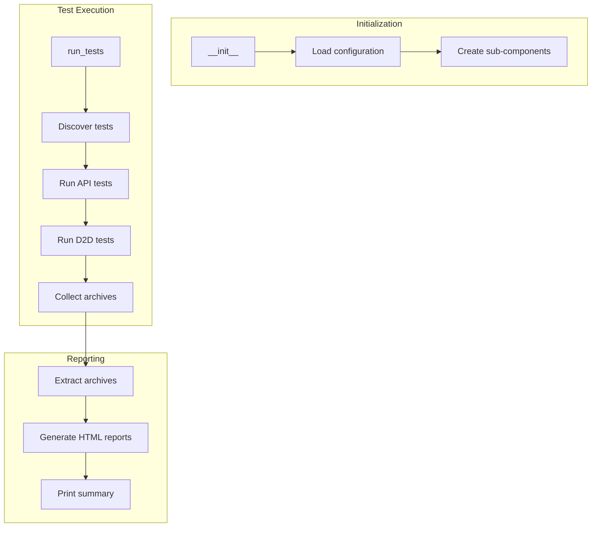
```mermaid
flowchart TB
    subgraph "Initialization"
        Init[__init__] --> LoadConfig[Load configuration]
        LoadConfig --> CreateComponents[Create sub-components]
    end

    subgraph "Test Execution"
        RunTests[run_tests] --> Discover[Discover tests]
        Discover --> RunAPI[Run API tests]
        RunAPI --> RunD2D[Run D2D tests]
        RunD2D --> Collect[Collect archives]
    end

    subgraph "Reporting"
        Collect --> ExtractArchives[Extract archives]
        ExtractArchives --> GenerateHTML[Generate HTML reports]
        GenerateHTML --> PrintSummary[Print summary]
    end
```

**Key Methods:**

- **`run_tests()`**: Main entry point
- **`_execute_api_tests()`**: Runs standard PyATS job for API tests
- **`_execute_d2d_tests()`**: Runs device-centric tests with SSH
- **`_process_archives()`**: Handles archive extraction and report generation

#### Discovery Module (`pyats_core/discovery/`)

##### Test Discovery (`test_discovery.py`)

```python
class TestDiscovery:
    def discover_tests(self, test_dir: Path) -> TestDiscoveryResult:
        """Discovers and categorizes PyATS test files."""

    def _is_d2d_test(self, test_path: Path) -> bool:
        """Determines if test is D2D based on path."""
```

**TestDiscoveryResult Structure:**

```python
@dataclass
class TestDiscoveryResult:
    api_tests: List[Path]      # Standard API tests
    d2d_tests: List[Path]      # Direct-to-device SSH tests
    total_count: int           # Total test count
```

##### Device Inventory Discovery (`device_inventory.py`)

Architecture-agnostic device discovery using the contract pattern:

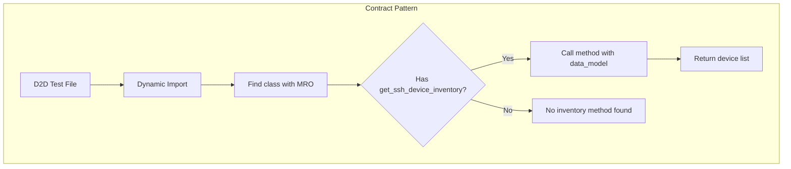
```mermaid
flowchart TB
    subgraph "Contract Pattern"
        TestFile[D2D Test File] --> Import[Dynamic Import]
        Import --> FindClass[Find class with MRO]
        FindClass --> CheckMethod{Has get_ssh_device_inventory?}
        CheckMethod -->|Yes| CallMethod[Call method with data_model]
        CheckMethod -->|No| Error[No inventory method found]
        CallMethod --> ReturnDevices[Return device list]
    end
```

**Contract Requirements:**

Every SSH-based test architecture MUST provide a base class that:
- Inherits from `SSHTestBase` (provided by nac-test)
- Implements `get_ssh_device_inventory(data_model)` class method
- Returns a list of dicts with REQUIRED fields: `hostname`, `host`, `os`, `username`, `password`

**Example Implementation:**

```python
# In nac-sdwan repository
class SDWANTestBase(SSHTestBase):
    @classmethod
    def get_ssh_device_inventory(cls, data_model: dict) -> List[Dict]:
        """Returns device inventory from SD-WAN data model."""
        devices = []
        # Parse test_inventory.yaml + sites data
        return devices
```

#### Execution Module (`pyats_core/execution/`)

##### Job Generator (`job_generator.py`)

Generates PyATS job files dynamically:

```python
class JobGenerator:
    def generate_job_file_content(self, test_files: List[Path]) -> str:
        """Generate standard job file content."""

    def generate_device_centric_job(
        self, device: Dict[str, Any], test_files: List[Path]
    ) -> str:
        """Generate device-specific job file for D2D tests."""
```

**Standard Job Structure:**

```python
"""Auto-generated PyATS job file by nac-test"""

from pyats.easypy import run

TEST_FILES = [
    "/path/to/test1.py",
    "/path/to/test2.py"
]

def main(runtime):
    runtime.max_workers = {max_workers}
    for test_file in TEST_FILES:
        test_name = Path(test_file).stem
        run(
            testscript=test_file,
            taskid=test_name,
            max_runtime={timeout}
        )
```

**Device-Centric Job Structure:**

```python
"""Auto-generated PyATS job file for device {hostname}"""

import os
import json

from pyats.easypy import run

HOSTNAME = "{hostname}"
DEVICE_INFO = {device_json}
TEST_FILES = [...]

def main(runtime):
    os.environ['DEVICE_INFO'] = json.dumps(DEVICE_INFO)
    runtime.connection_manager = DeviceConnectionManager(max_concurrent=1)

    for test_file in TEST_FILES:
        test_name = Path(test_file).stem
        run(
            testscript=test_file,
            taskid=f"{HOSTNAME}_{test_name}",
            max_runtime={timeout}
        )
```

##### Subprocess Runner (`subprocess_runner.py`)

Executes PyATS jobs as subprocesses:

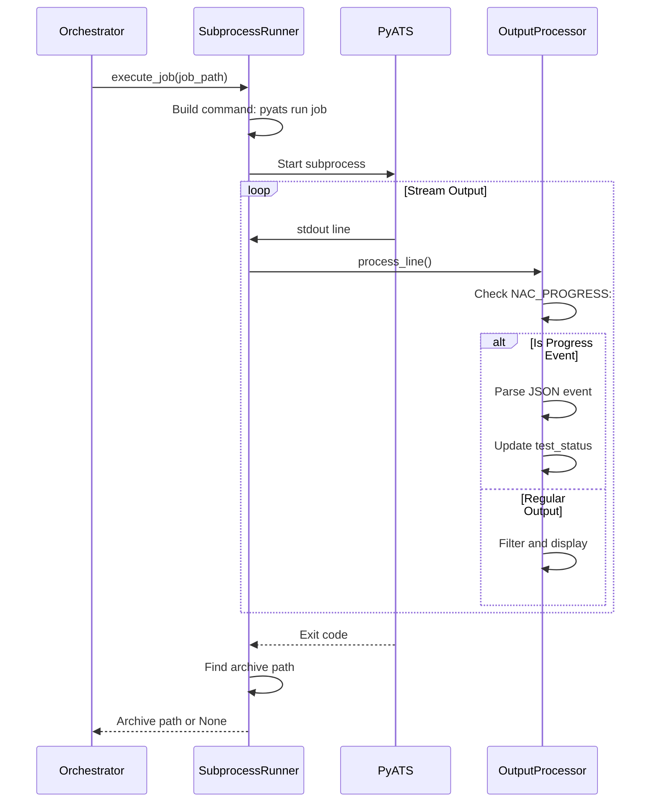
```mermaid
sequenceDiagram
    participant Orchestrator
    participant Runner as SubprocessRunner
    participant PyATS
    participant OutputProcessor

    Orchestrator->>Runner: execute_job(job_path)
    Runner->>Runner: Build command: pyats run job
    Runner->>PyATS: Start subprocess

    loop Stream Output
        PyATS->>Runner: stdout line
        Runner->>OutputProcessor: process_line()
        OutputProcessor->>OutputProcessor: Check NAC_PROGRESS:
        alt Is Progress Event
            OutputProcessor->>OutputProcessor: Parse JSON event
            OutputProcessor->>OutputProcessor: Update test_status
        else Regular Output
            OutputProcessor->>OutputProcessor: Filter and display
        end
    end

    PyATS-->>Runner: Exit code
    Runner->>Runner: Find archive path
    Runner-->>Orchestrator: Archive path or None
```

**Key Features:**

- **Async Execution**: Uses asyncio for non-blocking I/O
- **Output Streaming**: Real-time output processing
- **Progress Events**: Parses `NAC_PROGRESS:` prefixed JSON events
- **Archive Discovery**: Locates generated archive files

##### Device Executor (`execution/device/device_executor.py`)

Handles device-centric test execution with semaphore control:

```python
class DeviceExecutor:
    async def run_device_job_with_semaphore(
        self,
        device: Dict[str, Any],
        test_files: List[Path],
        semaphore: asyncio.Semaphore
    ) -> Optional[Path]:
```

**Execution Flow:**

1. Acquire semaphore slot
2. Generate device-specific job file
3. Generate testbed YAML for device
4. Set up environment variables
5. Execute job via subprocess
6. Return archive path

##### Testbed Generator (`execution/device/testbed_generator.py`)

Generates PyATS testbed YAML files:

```python
class TestbedGenerator:
    @staticmethod
    def generate_testbed_yaml(device: Dict[str, Any]) -> str:
        """Generate testbed YAML for single device."""

    @staticmethod
    def generate_consolidated_testbed_yaml(devices: List[Dict]) -> str:
        """Generate testbed YAML for multiple devices."""
```

**Generated Testbed Structure:**

```yaml
testbed:
  name: testbed_{hostname}
  credentials:
    default:
      username: {username}
      password: {password}

devices:
  {hostname}:
    alias: {alias}
    os: {os}
    type: router
    platform: {platform}
    credentials:
      default:
        username: {username}
        password: {password}
    connections:
      cli:
        protocol: ssh
        ip: {host}
        port: 22
        settings:
          GRACEFUL_DISCONNECT_WAIT_SEC: 0
          POST_DISCONNECT_WAIT_SEC: 0
```

**Performance Note (Disconnect Cooldown):**

- Generated testbeds now include `GRACEFUL_DISCONNECT_WAIT_SEC: 0` and `POST_DISCONNECT_WAIT_SEC: 0` for **all** connections (including `command`-based) to skip Unicon's default 1s/10s disconnect cooldowns.
- This reduces overall test runtime by **~11 seconds per device disconnect**, which scales linearly with device count and disconnect frequency when using the connection broker.

#### Progress Module (`pyats_core/progress/`)

##### Progress Reporter Plugin (`progress/plugin.py`)

PyATS plugin that emits structured progress events:

```python
class ProgressReporterPlugin(BasePlugin):
    """PyATS plugin for structured progress events."""

    def pre_task(self, task: Any) -> None:
        """Emit task_start event."""

    def post_task(self, task: Any) -> None:
        """Emit task_end event."""
```

**Event Schema:**

```json
{
    "version": "1.0",
    "event": "task_start|task_end",
    "taskid": "test_name",
    "test_name": "module.test",
    "test_file": "/path/to/test.py",
    "worker_id": "1",
    "pid": 12345,
    "timestamp": 1234567890.123,
    "test_title": "Human readable title"
}
```

**Event Types:**

- `job_start` / `job_end`: Job lifecycle events
- `task_start` / `task_end`: Test file execution events
- `section_start` / `section_end`: Test section events (debug mode)

##### Progress Reporter (`progress/reporter.py`)

Formats and displays progress events:

```python
class ProgressReporter:
    def report_test_start(
        self, test_name: str, pid: int, worker_id: str, test_id: int
    ) -> None:
        """Format: YYYY-MM-DD HH:MM:SS.mmm [PID:X] [W] [ID:N] EXECUTING test_name"""

    def report_test_end(
        self, test_name: str, pid: int, worker_id: int,
        test_id: int, status: str, duration: float
    ) -> None:
        """Format: YYYY-MM-DD HH:MM:SS.mmm [PID:X] [W] [ID:N] STATUS test_name in X.X seconds"""
```

**Status Colors:**

- `PASSED`: Green
- `FAILED`: Red
- `ERRORED`: Red (displayed as "ERROR")
- `SKIPPED`: Yellow
- `ABORTED`: Red
- `BLOCKED`: Yellow

---

### Reporting System

The reporting system generates HTML reports from PyATS archives:

```
reporting/
├── generator.py              # Single archive report generation
├── multi_archive_generator.py # Multi-archive coordination
├── collector.py              # Test result collection
├── summary_printer.py        # Console summary output
├── templates.py              # Jinja2 template utilities
├── types.py                  # Result status enums
└── utils/
    ├── archive_extractor.py  # Archive extraction
    ├── archive_inspector.py  # Archive inspection
    └── archive_aggregator.py # Archive aggregation
```

#### Report Generator (`reporting/generator.py`)

Generates HTML reports for individual test cases:

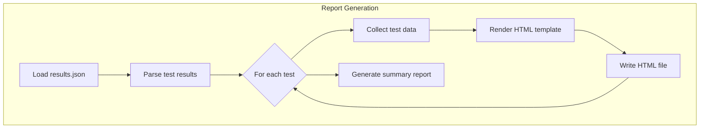
```mermaid
flowchart TB
    subgraph "Report Generation"
        LoadResults[Load results.json] --> ParseTests[Parse test results]
        ParseTests --> ForEachTest{For each test}
        ForEachTest --> CollectData[Collect test data]
        CollectData --> RenderTemplate[Render HTML template]
        RenderTemplate --> WriteFile[Write HTML file]
        WriteFile --> ForEachTest
        ForEachTest --> GenerateSummary[Generate summary report]
    end
```

**Generated Reports:**

- **Test Case Reports**: Individual HTML per test file
- **Summary Report**: Overview with statistics and links

#### Multi-Archive Generator (`reporting/multi_archive_generator.py`)

Coordinates report generation for multiple archives:

```python
class MultiArchiveReportGenerator:
    async def generate_reports_from_archives(
        self, archive_paths: List[Path]
    ) -> Dict[str, Any]:
```

**Features:**

- **Parallel Processing**: Extracts and processes archives concurrently
- **Type Detection**: Identifies API vs D2D archives from filename
- **Combined Summary**: Generates combined report when multiple archives exist
- **HTML Preservation**: Preserves existing reports when updating archives

#### Summary Printer (`reporting/summary_printer.py`)

Prints execution summaries to console:

```python
class SummaryPrinter:
    def print_summary(
        self,
        test_status: Dict[str, Any],
        start_time: datetime,
        output_dir: Optional[Path] = None,
        api_test_status: Optional[Dict] = None,
        d2d_test_status: Optional[Dict] = None
    ) -> None:
```

**Output Format:**

```
================================================================================
X tests, Y passed, Z failed, W skipped.
================================================================================

PyATS Output Files:
================================================================================
Results JSON:    /path/to/results.json
Results XML:     /path/to/ResultsDetails.xml
Archive:         /path/to/archive.zip

Total testing: X minutes Y.Z seconds
Elapsed time:  A minutes B.C seconds
```

#### Report Types (`reporting/types.py`)

```python
class ResultStatus(str, Enum):
    PASSED = "passed"
    FAILED = "failed"
    SKIPPED = "skipped"
    ERRORED = "errored"
    ABORTED = "aborted"
    BLOCKED = "blocked"
    INFO = "info"
```

---

### Combined Reporting Dashboard

The combined reporting dashboard provides a unified view of test results across Robot Framework, PyATS API, and PyATS D2D tests in a single root-level `combined_summary.html` file.

#### Architecture

```
nac_test/
├── core/
│   └── reporting/
│       └── combined_generator.py         # Orchestrates combined dashboard
├── pyats_core/
│   └── reporting/
│       ├── generator.py                  # Single archive report generation
│       ├── multi_archive_generator.py    # Provides PyATS stats to combined dashboard
│       └── templates/
│           └── summary/
│               ├── report.html.j2        # PyATS summary with breadcrumb
│               └── combined_report.html.j2 # Combined dashboard template
└── robot/
    └── reporting/
        ├── robot_output_parser.py        # Parses output.xml via ResultVisitor
        └── robot_generator.py            # Generates Robot summary report
```

#### Report Structure

```
{output_dir}/
├── combined_summary.html                  # Root-level combined dashboard ✨
├── xunit.xml                              # Merged xUnit XML (Robot + PyATS) ✨
├── robot_results/                         # Robot Framework results
│   ├── output.xml                        # Robot results XML
│   ├── log.html                          # Robot log
│   ├── report.html                       # Robot report
│   ├── xunit.xml                         # Robot xUnit XML (source)
│   └── summary_report.html               # Robot summary (PyATS style)
├── output.xml → robot_results/output.xml  # Backward-compat symlink
├── log.html → robot_results/log.html      # Backward-compat symlink
├── report.html → robot_results/report.html # Backward-compat symlink
└── pyats_results/                         # PyATS results
    ├── api/
    │   ├── xunit.xml                     # PyATS API xUnit XML (source)
    │   └── html_reports/
    │       └── summary_report.html        # API summary with breadcrumb
    └── d2d/
        ├── <device>/
        │   └── xunit.xml                 # PyATS D2D xUnit XML per device (source)
        └── html_reports/
            └── summary_report.html        # D2D summary with breadcrumb
```

#### Combined Report Generator (`core/reporting/combined_generator.py`)

Orchestrates the unified dashboard generation:

```python
class CombinedReportGenerator:
    """Generates combined dashboard across all test frameworks.
    
    This is a pure renderer - it takes CombinedResults from the orchestrator
    and generates HTML. It does not discover or parse test results itself.
    """
    
    def generate_combined_summary(
        self,
        results: CombinedResults | None = None
    ) -> Path | None:
        """Generate combined summary dashboard.
        
        Args:
            results: CombinedResults with .api, .d2d, .robot attributes.
                Each attribute is a TestResults dataclass or None if that
                framework wasn't executed.
                    
        Returns:
            Path to combined_summary.html at root level, or None if generation fails
        """
```

**Features:**

- **Unified Statistics**: Aggregates test counts using CombinedResults computed properties (`.total`, `.passed`, etc.)
- **Framework Badges**: Visual indicators for Robot, API, and D2D tests
- **Deep Linking**: Links to framework-specific summary reports
- **Success Rate Calculation**: Overall and per-framework success rates via `.success_rate` property
- **Automatic Generation**: Called by CombinedOrchestrator after all tests complete
- **Pure Renderer**: Takes typed CombinedResults, no internal result discovery

#### Robot Output Parser (`robot/reporting/robot_output_parser.py`)

Parses Robot Framework `output.xml` using the ResultVisitor pattern:

```python
class RobotResultParser:
    def parse_output_xml(self, output_xml_path: Path) -> Dict[str, Any]:
        """Parse Robot output.xml and extract test results.
        
        Returns:
            {
                "tests": [
                    {
                        "name": "Test Case Name",
                        "status": "PASS",
                        "elapsed_time": "1.234 s",
                        "start_time": "2025-02-01 12:00:00",
                        "message": "Optional message",
                        "suite_name": "Suite Name",
                        "test_id": "s1-t1"  # For deep linking
                    },
                    ...
                ],
                "statistics": {
                    "total": 10,
                    "passed": 8,
                    "failed": 2,
                    "skipped": 0
                },
                "suite_name": "Root Suite"
            }
        """
```

**Implementation:**

- Uses Robot Framework's `ResultVisitor` API
- Extracts test metadata including timestamps and status
- Generates test IDs for deep linking to `log.html`
- Sorts tests (failed first, then passed)

#### Robot Report Generator (`robot/reporting/robot_generator.py`)

Generates PyATS-style summary report for Robot tests:

```python
class RobotReportGenerator:
    def generate_summary_report(self) -> Path | None:
        """Generate Robot summary report in robot_results/.
        
        Returns:
            Path to generated summary_report.html, or None if no tests
        """
    
    def get_aggregated_stats(self) -> Dict[str, int]:
        """Get aggregated Robot test statistics.
        
        Returns:
            {"total": 10, "passed": 8, "failed": 2, "skipped": 0}
        """
```

**Features:**

- Reuses PyATS Jinja2 templates for consistency
- Generates deep links to Robot log.html
- Provides statistics for combined dashboard
- Handles missing output.xml gracefully

#### Statistics Flow

```mermaid
graph LR
    subgraph "Test Execution"
        Robot[RobotOrchestrator] --> |TestResults| RobotStats[robot: TestResults]
        PyATS[PyATSOrchestrator] --> |PyATSResults| PyATSStats[api/d2d: TestResults]
    end
    
    subgraph "Result Aggregation"
        RobotStats --> Combined[CombinedResults]
        PyATSStats --> Combined
    end
    
    subgraph "Report Generation"
        Combined --> |results.robot| RobotGen[RobotReportGenerator]
        Combined --> |results.api/d2d| MultiGen[MultiArchiveReportGenerator]
        
        RobotGen --> RobotReport[robot_results/summary_report.html]
        MultiGen --> APIReport[api/html_reports/summary_report.html]
        MultiGen --> D2DReport[d2d/html_reports/summary_report.html]
    end
    
    subgraph "Combined Dashboard"
        Combined --> |CombinedResults| CombinedGen[CombinedReportGenerator]
        CombinedGen --> Dashboard[combined_summary.html]
    end
    
    subgraph "CLI"
        Combined --> |.exit_code| CLI[Exit Code]
    end
```

**Type System:**

Results are represented using typed dataclasses from `nac_test.core.types`:

```python
class ExecutionState(str, Enum):
    """Execution state for test results.

    Distinguishes between different outcomes:
        SUCCESS: Tests ran (may have test failures, but execution succeeded)
        EMPTY: No tests found/executed (expected outcome, not an error)
        SKIPPED: Tests intentionally skipped (e.g., render-only mode)
        ERROR: Execution failed with an error (e.g., framework crash)
    """
    SUCCESS = "success"
    EMPTY = "empty"
    SKIPPED = "skipped"
    ERROR = "error"

@dataclass
class TestResults:
    """Results from a single test framework/type."""
    passed: int = 0
    failed: int = 0
    skipped: int = 0
    other: int = 0  # Tests with other statuses (blocked, aborted, passx, info)
    reason: str | None = None  # Context for non-SUCCESS states
    state: ExecutionState = ExecutionState.SUCCESS

    @property
    def total(self) -> int:
        """Total tests (always computed from counts)."""
        return self.passed + self.failed + self.skipped + self.other

    # Factory methods for common scenarios:
    @classmethod
    def empty(cls) -> "TestResults":
        """No tests found/executed (expected outcome)."""
        return cls(state=ExecutionState.EMPTY)

    @classmethod
    def not_run(cls, reason: str | None = None) -> "TestResults":
        """Tests intentionally skipped (e.g., render-only mode)."""
        return cls(state=ExecutionState.SKIPPED, reason=reason)

    @classmethod
    def from_error(cls, reason: str) -> "TestResults":
        """Execution failed with an error."""
        return cls(reason=reason, state=ExecutionState.ERROR)

    # Computed properties: success_rate, has_failures, has_error, is_empty,
    #                      is_error, was_not_run, exit_code

    def __str__(self) -> str:
        base = f"{self.total}/{self.passed}/{self.failed}/{self.skipped}"
        return f"{base}/{self.other}" if self.other > 0 else base

@dataclass
class PyATSResults:
    """Groups API and D2D results from PyATS."""
    api: TestResults | None = None
    d2d: TestResults | None = None

@dataclass
class CombinedResults:
    """Aggregates results across all frameworks."""
    api: TestResults | None = None   # From PyATSResults.api
    d2d: TestResults | None = None   # From PyATSResults.d2d
    robot: TestResults | None = None # From RobotOrchestrator
    
    # Computed properties aggregate across all non-None results:
    # .total, .passed, .failed, .skipped, .errors (list[str]), .success_rate,
    # .has_failures, .has_errors, .is_empty, .exit_code
```

**ExecutionState Usage:**

The `ExecutionState` enum enables clear distinction between different outcomes:

| State | When to Use | Properties |
|-------|-------------|------------|
| `SUCCESS` | Tests ran (may have failures) | Default state, `is_error=False` |
| `EMPTY` | No tests found/matched filters | `is_empty=True`, `is_error=False` |
| `SKIPPED` | Intentionally not run (render-only) | `was_not_run=True`, reason in `reason` field |
| `ERROR` | Framework/execution failure | `is_error=True`, `has_error=True` |

This allows callers to distinguish between:
- **Empty execution** (no tests found) - expected, not an error
- **Skipped execution** (render-only mode) - intentional, with reason
- **Error execution** (framework crash) - unexpected failure

**Orchestrator Return Types:**

- `RobotOrchestrator.run_tests()` → `TestResults`
- `PyATSOrchestrator.run_tests()` → `PyATSResults` (contains `.api` and `.d2d`)
- `CombinedOrchestrator.run_tests()` → `CombinedResults` (flat structure with all three)

**Example Usage:**

```python
# CombinedOrchestrator aggregates results
results = CombinedResults()
if has_pyats:
    pyats_results = PyATSOrchestrator(...).run_tests()  # Returns PyATSResults
    results.api = pyats_results.api
    results.d2d = pyats_results.d2d
if has_robot:
    results.robot = RobotOrchestrator(...).run_tests()  # Returns TestResults

# CombinedReportGenerator receives typed results
CombinedReportGenerator(output_dir).generate_combined_summary(results)

# Access aggregated stats via computed properties
print(f"Total: {results.total}, Passed: {results.passed}")
print(f"Success Rate: {results.success_rate:.1f}%")
print(f"Exit Code: {results.exit_code}")
```

#### Backward Compatibility

Robot results are output to `robot_results/` subdirectory, with symlinks at root for backward compatibility:

- `output.xml` → `robot_results/output.xml`
- `log.html` → `robot_results/log.html`
- `report.html` → `robot_results/report.html`

The root-level `xunit.xml` is a **merged file** (not a symlink) containing combined results from Robot Framework and PyATS. See [XUnit Merger](#xunit-merger) for details.

This ensures existing tools and scripts that expect Robot files at root continue to work.

#### Breadcrumb Navigation

All framework-specific summary reports include breadcrumb navigation:

```html
<div class="breadcrumb">
    <a href="../../combined_summary.html">← Back to Combined Dashboard</a>
</div>
```

This allows users to easily navigate from any report back to the unified dashboard.

#### XUnit Merger

The xunit merger (`utils/xunit_merger.py`) combines xunit.xml files from Robot Framework and PyATS into a single file for CI/CD integration (Jenkins, GitLab).

**Source Files:**

- `robot_results/xunit.xml` - Robot Framework results
- `pyats_results/api/xunit.xml` - PyATS API test results
- `pyats_results/d2d/<device>/xunit.xml` - PyATS D2D results per device

**Output:**

- `{output_dir}/xunit.xml` - Merged file at root

**Merge Behavior:**

- Preserves full testsuite hierarchy (Robot's nested testsuites remain nested)
- Prefixes outermost testsuite `name` attribute with source identifier (`robot: `, `pyats_api: `, `pyats_d2d/<device>: `)
- Test case names remain unchanged
- Aggregates statistics (tests, failures, errors, skipped, time) into root `<testsuites>` element

**Example Output:**

```xml
<?xml version='1.0' encoding='unicode'?>
<testsuites tests="150" failures="2" errors="0" skipped="5" time="245.123">
  <testsuite name="robot: Nac-Test" tests="100" ...>
    <testsuite name="Verify Fabric">...</testsuite>
  </testsuite>
  <testsuite name="pyats_api: api_tests" tests="30" ...>
    <testcase name="verify_tenant_config" .../>
  </testsuite>
  <testsuite name="pyats_d2d/switch-01: d2d_tests" tests="20" ...>
    <testcase name="verify_interface_status" .../>
  </testsuite>
</testsuites>
```

**Integration:**

Called by `CombinedOrchestrator` after test execution completes:

```python
from nac_test.utils.xunit_merger import merge_xunit_results

# After PyATS and Robot execution
merge_xunit_results(output_dir)  # Creates {output_dir}/xunit.xml
```

---

### Robot Framework Orchestrator

#### Robot Orchestrator (`robot/orchestrator.py`)

Coordinates Robot Framework test execution:

```python
class RobotOrchestrator:
    def run(self) -> ExecutionResult:
        """Execute Robot Framework tests."""

    def _generate_robot_files(self) -> List[Path]:
        """Generate .robot files from templates."""

    def _execute_pabot(self, robot_files: List[Path]) -> int:
        """Run tests with Pabot parallel execution."""
```

#### Robot Writer (`robot/robot_writer.py`)

Generates Robot Framework files from Jinja2 templates:

```python
class RobotWriter:
    def write_robot_files(
        self,
        templates_dir: Path,
        output_dir: Path,
        data: Dict[str, Any]
    ) -> List[Path]:
```

**Template Processing:**

1. Scan templates directory for `.robot` files
2. Load each file as Jinja2 template
3. Render with merged data context
4. Write to output directory

#### Pabot Runner (`robot/pabot.py`)

Executes Robot Framework tests in parallel:

```python
class PabotRunner:
    def run(
        self,
        robot_files: List[Path],
        output_dir: Path,
        processes: int
    ) -> int:
```

**Pabot Command:**

```bash
pabot --processes {n} --outputdir {dir} {robot_files}
```

---

## Test Execution Modes

### API Tests

API tests execute against network controllers (APIC, DNAC, etc.) via REST APIs.

#### Base Test Class (`pyats_core/common/base_test.py`)

```python
class BaseTest(aetest.Testcase):
    """Base class for API-based PyATS tests."""

    @classmethod
    def setUpClass(cls):
        """Initialize test with data model and API context."""

    def api_context(self) -> Dict[str, Any]:
        """Returns API context for HTML report linking."""

    def display_context(self) -> Dict[str, Any]:
        """Returns display context for report rendering."""
```

**Features:**

- **Data Model Loading**: Loads merged data model from environment
- **Context Injection**: Provides API/display context for reporting
- **Step Interception**: Captures commands for HTML report linking
- **Skip Handling**: Generates SKIPPED results when no data exists

#### API Test Pattern

```python
class MyAPITest(BaseTest):
    """Test validating API endpoint responses."""

    # Test configuration
    TEST_CONFIG = {
        "schema_paths": ["path.to.data"],
        "identifier_format": "{name}",
        "step_name_format": "Verify {attribute}",
        "api_queries": [...],
        "log_fields": ["field1", "field2"]
    }

    @aetest.test
    def test_something(self):
        """Test implementation."""
        self.verify_attributes(self.data, self.TEST_CONFIG)
```

### D2D/SSH Tests

Direct-to-Device tests execute commands on network devices via SSH.

#### SSH Base Test Class (`pyats_core/common/ssh_base_test.py`)

```python
class SSHTestBase(aetest.Testcase):
    """Base class for SSH-based device tests."""

    @classmethod
    @abstractmethod
    def get_ssh_device_inventory(cls, data_model: dict) -> List[Dict]:
        """Return device inventory from data model."""

    def execute_command(self, command: str) -> str:
        """Execute command on device with caching."""
```

**Contract Pattern:**

The `get_ssh_device_inventory` method is the contract between nac-test and architecture-specific implementations:

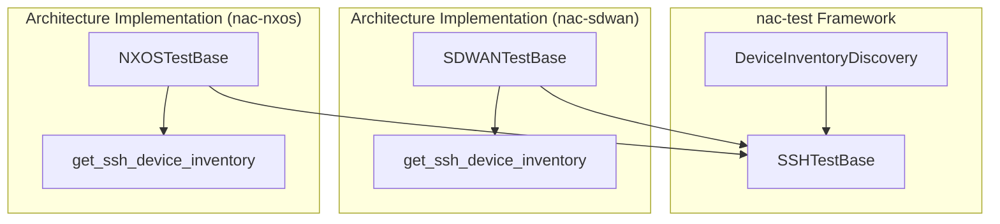
```mermaid
flowchart TB
    subgraph "nac-test Framework"
        DeviceInventory[DeviceInventoryDiscovery]
        SSHBase[SSHTestBase]
    end

    subgraph "Architecture Implementation (nac-sdwan)"
        SDWANBase[SDWANTestBase]
        GetInventory[get_ssh_device_inventory]
    end

    subgraph "Architecture Implementation (nac-nxos)"
        NXOSBase[NXOSTestBase]
        GetInventory2[get_ssh_device_inventory]
    end

    DeviceInventory --> SSHBase
    SDWANBase --> SSHBase
    SDWANBase --> GetInventory
    NXOSBase --> SSHBase
    NXOSBase --> GetInventory2
```

#### D2D Test Pattern

```python
class MyD2DTest(SDWANTestBase):
    """Test validating device configuration."""

    @aetest.test
    def test_device_config(self):
        """Verify device configuration."""
        output = self.execute_command("show running-config")
        # Validate output
```

---

## Architecture-Specific Test Implementations

nac-test is designed as an architecture-agnostic framework that provides base classes and contracts for implementing network-specific test logic. This section documents the two primary architecture implementations: **APICTestBase** for Cisco ACI and **SDWANTestBase** for Cisco SD-WAN.

### Complete Inheritance Hierarchy

The following diagram shows the complete class inheritance hierarchy from nac-test base classes to architecture-specific implementations:

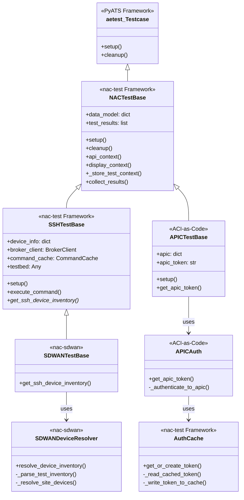
```mermaid
classDiagram
    direction TB

    class aetest_Testcase {
        <<PyATS Framework>>
        +setup()
        +cleanup()
    }

    class NACTestBase {
        <<nac-test Framework>>
        +data_model: dict
        +test_results: list
        +setup()
        +cleanup()
        +api_context()
        +display_context()
        +_store_test_context()
        +collect_results()
    }

    class SSHTestBase {
        <<nac-test Framework>>
        +device_info: dict
        +broker_client: BrokerClient
        +command_cache: CommandCache
        +testbed: Any
        +setup()
        +execute_command()
        +get_ssh_device_inventory()*
    }

    class APICTestBase {
        <<ACI-as-Code>>
        +apic: dict
        +apic_token: str
        +setup()
        +get_apic_token()
    }

    class SDWANTestBase {
        <<nac-sdwan>>
        +get_ssh_device_inventory()
    }

    class AuthCache {
        <<nac-test Framework>>
        +get_or_create_token()
        -_read_cached_token()
        -_write_token_to_cache()
    }

    class APICAuth {
        <<ACI-as-Code>>
        +get_apic_token()
        -_authenticate_to_apic()
    }

    class SDWANDeviceResolver {
        <<nac-sdwan>>
        +resolve_device_inventory()
        -_parse_test_inventory()
        -_resolve_site_devices()
    }

    aetest_Testcase <|-- NACTestBase
    NACTestBase <|-- SSHTestBase
    NACTestBase <|-- APICTestBase
    SSHTestBase <|-- SDWANTestBase

    APICTestBase --> APICAuth : uses
    APICAuth --> AuthCache : uses
    SDWANTestBase --> SDWANDeviceResolver : uses
```

---

### APICTestBase (ACI-as-Code)

**Location**: `/aac/tests/templates/apic/test/pyats_common/`

APICTestBase is the architecture-specific base class for testing Cisco ACI (Application Centric Infrastructure) via the APIC REST API. It extends `NACTestBase` and provides APIC-specific authentication and API interaction capabilities.

#### APICTestBase Component Architecture

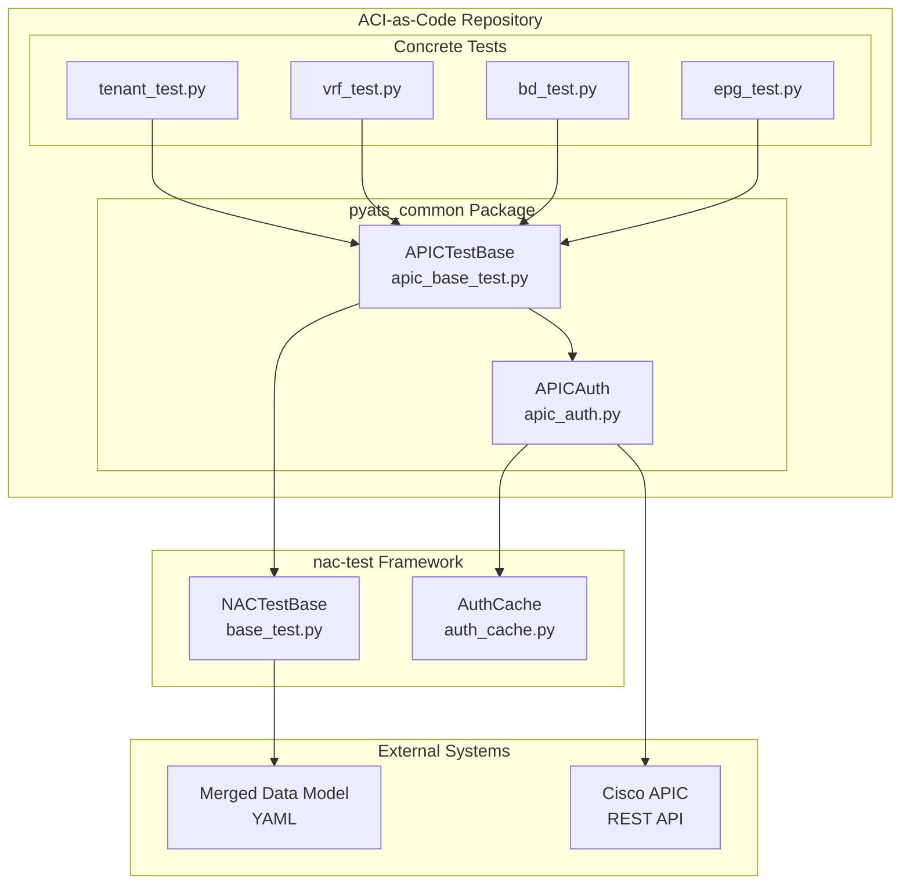
```mermaid
graph TB
    subgraph "ACI-as-Code Repository"
        subgraph "pyats_common Package"
            APICTestBase[APICTestBase<br/>apic_base_test.py]
            APICAuth[APICAuth<br/>apic_auth.py]
        end

        subgraph "Concrete Tests"
            TenantTest[tenant_test.py]
            VRFTest[vrf_test.py]
            BDTest[bd_test.py]
            EPGTest[epg_test.py]
        end
    end

    subgraph "nac-test Framework"
        NACTestBase[NACTestBase<br/>base_test.py]
        AuthCache[AuthCache<br/>auth_cache.py]
    end

    subgraph "External Systems"
        APIC[Cisco APIC<br/>REST API]
        DataModel[Merged Data Model<br/>YAML]
    end

    TenantTest --> APICTestBase
    VRFTest --> APICTestBase
    BDTest --> APICTestBase
    EPGTest --> APICTestBase

    APICTestBase --> NACTestBase
    APICTestBase --> APICAuth
    APICAuth --> AuthCache
    APICAuth --> APIC

    NACTestBase --> DataModel
```

#### APICTestBase Class Definition

```python
# apic_base_test.py
class APICTestBase(NACTestBase):
    """Base class for APIC API-based tests.

    Extends NACTestBase to provide:
    - APIC connection details from data model
    - Cached authentication token management
    - APIC-specific test setup and teardown

    Attributes:
        apic: dict containing APIC connection details (url, username, password)
        apic_token: str authentication token for APIC REST API calls
    """

    @aetest.setup
    def setup(self) -> None:
        """Initialize APIC test environment.

        Steps:
        1. Call parent setup to load data model
        2. Extract APIC connection details from data model
        3. Obtain or retrieve cached authentication token
        """
        super().setup()

        # Extract APIC details from merged data model
        self.apic = self.data_model.get("apic", {})

        # Get authentication token (cached across parallel tests)
        self.apic_token = self.get_apic_token()

    def get_apic_token(self) -> str:
        """Obtain APIC authentication token with caching.

        Uses APICAuth which leverages nac-test's AuthCache for
        file-based token caching across parallel test processes.

        Returns:
            str: Valid APIC authentication token

        Raises:
            AuthenticationError: If authentication fails
        """
        return APICAuth.get_apic_token(
            url=self.apic.get("url"),
            username=self.apic.get("username"),
            password=self.apic.get("password")
        )
```

#### APICAuth Component

APICAuth handles APIC-specific authentication using the APIC REST API's `/api/aaaLogin.json` endpoint. It leverages nac-test's generic `AuthCache` for file-based token caching.

```python
# apic_auth.py
class APICAuth:
    """APIC authentication handler with token caching.

    Provides APIC-specific authentication that integrates with
    nac-test's AuthCache for cross-process token sharing.
    """

    @classmethod
    def get_apic_token(cls, url: str, username: str, password: str) -> str:
        """Get APIC token, using cache if available.

        Args:
            url: APIC URL (e.g., https://apic.example.com)
            username: APIC username
            password: APIC password

        Returns:
            str: Valid authentication token
        """
        return AuthCache.get_or_create_token(
            controller_type="apic",
            url=url,
            username=username,
            password=password,
            auth_func=cls._authenticate_to_apic
        )

    @staticmethod
    def _authenticate_to_apic(url: str, username: str, password: str) -> tuple[str, int]:
        """Perform APIC REST API authentication.

        Calls APIC's /api/aaaLogin.json endpoint to obtain
        authentication token and refresh time.

        Args:
            url: APIC base URL
            username: APIC username
            password: APIC password

        Returns:
            tuple[str, int]: (token, expires_in_seconds)

        Raises:
            requests.HTTPError: If authentication request fails
        """
        login_url = f"{url}/api/aaaLogin.json"
        payload = {
            "aaaUser": {
                "attributes": {
                    "name": username,
                    "pwd": password
                }
            }
        }

        response = requests.post(login_url, json=payload, verify=False)
        response.raise_for_status()

        data = response.json()
        token = data["imdata"][0]["aaaLogin"]["attributes"]["token"]
        refresh_timeout = int(data["imdata"][0]["aaaLogin"]["attributes"]["refreshTimeoutSeconds"])

        return token, refresh_timeout
```

#### APIC Authentication Flow

The following sequence diagram shows the complete authentication flow from test initialization through API call:

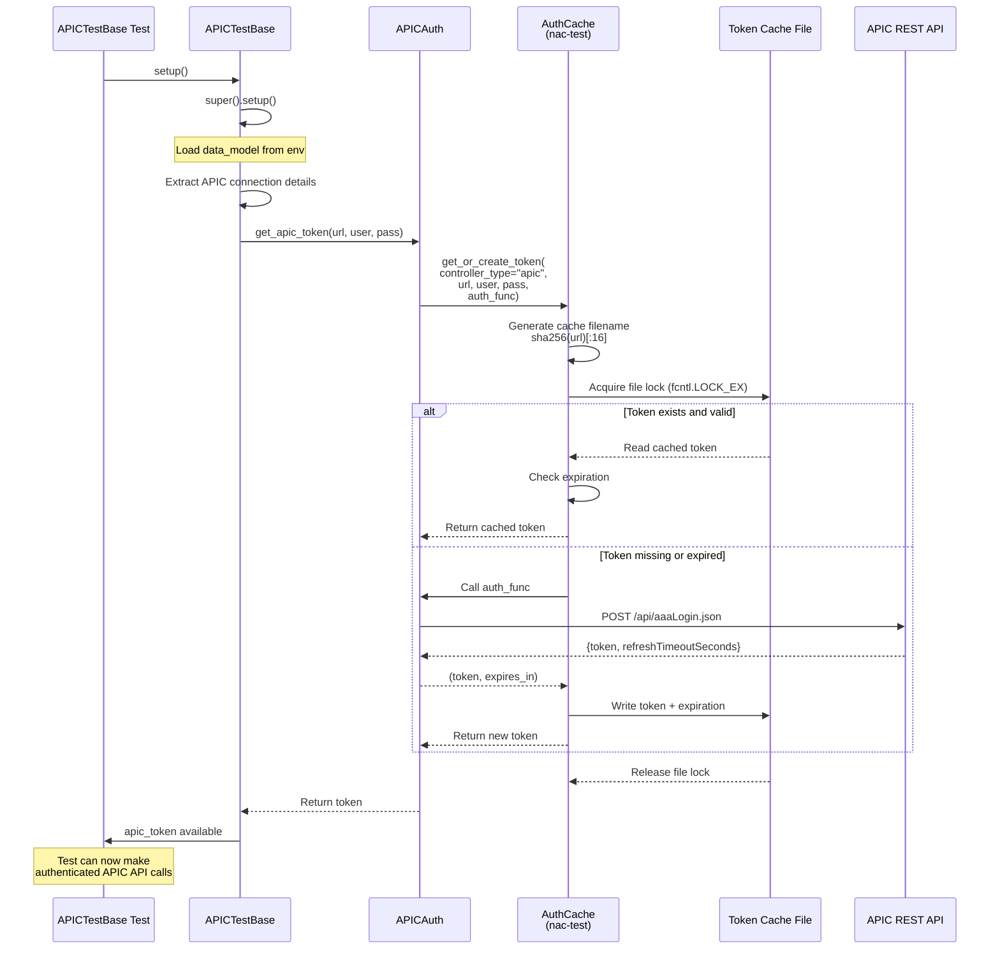
```mermaid
sequenceDiagram
    participant Test as APICTestBase Test
    participant APICBase as APICTestBase
    participant APICAuth as APICAuth
    participant AuthCache as AuthCache<br/>(nac-test)
    participant FileSystem as Token Cache File
    participant APIC as APIC REST API

    Test->>APICBase: setup()
    APICBase->>APICBase: super().setup()
    Note over APICBase: Load data_model from env

    APICBase->>APICBase: Extract APIC connection details
    APICBase->>APICAuth: get_apic_token(url, user, pass)

    APICAuth->>AuthCache: get_or_create_token(<br/>controller_type="apic",<br/>url, user, pass,<br/>auth_func)

    AuthCache->>AuthCache: Generate cache filename<br/>sha256(url)[:16]
    AuthCache->>FileSystem: Acquire file lock (fcntl.LOCK_EX)

    alt Token exists and valid
        FileSystem-->>AuthCache: Read cached token
        AuthCache->>AuthCache: Check expiration
        AuthCache-->>APICAuth: Return cached token
    else Token missing or expired
        AuthCache->>APICAuth: Call auth_func
        APICAuth->>APIC: POST /api/aaaLogin.json
        APIC-->>APICAuth: {token, refreshTimeoutSeconds}
        APICAuth-->>AuthCache: (token, expires_in)
        AuthCache->>FileSystem: Write token + expiration
        AuthCache-->>APICAuth: Return new token
    end

    FileSystem-->>AuthCache: Release file lock
    APICAuth-->>APICBase: Return token
    APICBase->>Test: apic_token available

    Note over Test: Test can now make<br/>authenticated APIC API calls
```

#### AuthCache (nac-test Framework)

AuthCache is a generic file-based token caching mechanism provided by nac-test. It enables token sharing across parallel test processes using file locking.

```python
# nac_test/pyats_core/common/auth_cache.py
class AuthCache:
    """Generic file-based auth token caching across parallel processes.

    Provides a controller-agnostic token caching mechanism that:
    - Uses file-based storage for cross-process sharing
    - Implements file locking (fcntl) for parallel process safety
    - Supports configurable expiration with safety buffer
    - Works with any controller type (APIC, DNAC, ISE, etc.)

    Token Cache File Format:
        {
            "token": "<auth_token>",
            "expires_at": <unix_timestamp>,
            "url": "<controller_url>",
            "username": "<username>"
        }
    """

    CACHE_DIR = Path("/tmp/nac_test_auth_cache")
    EXPIRY_BUFFER_SECONDS = 60  # Refresh 60s before actual expiry

    @classmethod
    def get_or_create_token(
        cls,
        controller_type: str,
        url: str,
        username: str,
        password: str,
        auth_func: Callable[[str, str, str], tuple[str, int]],
    ) -> str:
        """Get existing token or create new one with file-based locking.

        Args:
            controller_type: Type identifier (e.g., "apic", "dnac")
            url: Controller URL for cache key generation
            username: Username for authentication
            password: Password for authentication
            auth_func: Callable that performs actual authentication,
                      returns (token, expires_in_seconds)

        Returns:
            str: Valid authentication token

        Thread Safety:
            Uses fcntl.LOCK_EX for exclusive file locking to prevent
            race conditions when multiple parallel tests attempt
            authentication simultaneously.
        """
        cls.CACHE_DIR.mkdir(parents=True, exist_ok=True)

        # Generate unique filename based on controller URL
        url_hash = hashlib.sha256(url.encode()).hexdigest()[:16]
        cache_file = cls.CACHE_DIR / f"{controller_type}_{url_hash}.json"
        lock_file = cls.CACHE_DIR / f"{controller_type}_{url_hash}.lock"

        with open(lock_file, "w") as lock_fd:
            # Acquire exclusive lock - blocks until available
            fcntl.flock(lock_fd.fileno(), fcntl.LOCK_EX)

            try:
                # Check for valid cached token
                cached_token = cls._read_cached_token(cache_file)
                if cached_token:
                    return cached_token

                # Perform authentication
                token, expires_in = auth_func(url, username, password)

                # Cache with expiration (minus buffer)
                cls._write_token_to_cache(
                    cache_file, token, url, username,
                    expires_in - cls.EXPIRY_BUFFER_SECONDS
                )

                return token
            finally:
                # Release lock
                fcntl.flock(lock_fd.fileno(), fcntl.LOCK_UN)
```

#### Parallel Test Token Sharing

The following diagram illustrates how AuthCache enables token sharing across parallel test processes:

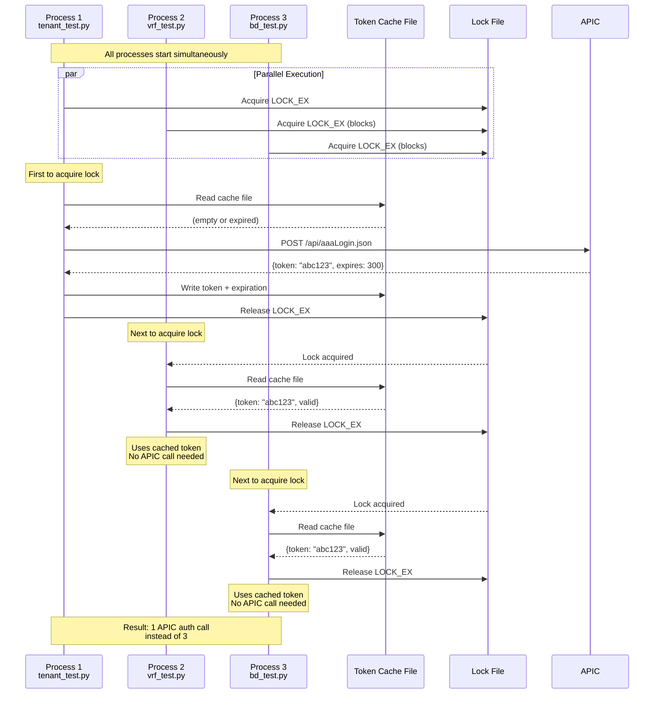
```mermaid
sequenceDiagram
    participant P1 as Process 1<br/>tenant_test.py
    participant P2 as Process 2<br/>vrf_test.py
    participant P3 as Process 3<br/>bd_test.py
    participant Cache as Token Cache File
    participant Lock as Lock File
    participant APIC as APIC

    Note over P1,P3: All processes start simultaneously

    par Parallel Execution
        P1->>Lock: Acquire LOCK_EX
        P2->>Lock: Acquire LOCK_EX (blocks)
        P3->>Lock: Acquire LOCK_EX (blocks)
    end

    Note over P1: First to acquire lock
    P1->>Cache: Read cache file
    Cache-->>P1: (empty or expired)
    P1->>APIC: POST /api/aaaLogin.json
    APIC-->>P1: {token: "abc123", expires: 300}
    P1->>Cache: Write token + expiration
    P1->>Lock: Release LOCK_EX

    Note over P2: Next to acquire lock
    Lock-->>P2: Lock acquired
    P2->>Cache: Read cache file
    Cache-->>P2: {token: "abc123", valid}
    P2->>Lock: Release LOCK_EX
    Note over P2: Uses cached token<br/>No APIC call needed

    Note over P3: Next to acquire lock
    Lock-->>P3: Lock acquired
    P3->>Cache: Read cache file
    Cache-->>P3: {token: "abc123", valid}
    P3->>Lock: Release LOCK_EX
    Note over P3: Uses cached token<br/>No APIC call needed

    Note over P1,P3: Result: 1 APIC auth call<br/>instead of 3
```

#### APICTestBase Usage Example

```python
# Example: tenant_test.py in ACI-as-Code repository
from nac_test_pyats_common.aci import APICTestBase

class TenantValidation(APICTestBase):
    """Validate ACI tenant configuration against data model."""

    TEST_CONFIG = {
        "schema_paths": ["apic.tenants"],
        "identifier_format": "{name}",
        "step_name_format": "Verify tenant {name}",
        "api_queries": [
            {"class": "fvTenant", "filter": "eq(fvTenant.name, \"{name}\")"}
        ],
        "log_fields": ["name", "descr", "nameAlias"]
    }

    @aetest.test
    def test_tenant_exists(self):
        """Verify all tenants from data model exist in APIC."""
        tenants = self.data_model.get("apic", {}).get("tenants", [])

        for tenant in tenants:
            # Use inherited apic_token for authenticated API calls
            headers = {"Cookie": f"APIC-Cookie={self.apic_token}"}
            url = f"{self.apic['url']}/api/class/fvTenant.json"
            params = {"query-target-filter": f'eq(fvTenant.name,"{tenant["name"]}")'}

            response = requests.get(url, headers=headers, params=params, verify=False)
            response.raise_for_status()

            result = response.json()
            assert len(result["imdata"]) > 0, f"Tenant {tenant['name']} not found"
```

---

### SDWANTestBase (SD-WAN)

**Location**: `/nac-sdwan-terraform/tests/templates/cedge/test/pyats_common/`

SDWANTestBase is the architecture-specific base class for testing Cisco SD-WAN devices via SSH. It extends `SSHTestBase` and implements the required `get_ssh_device_inventory()` contract method.

#### SDWANTestBase Component Architecture

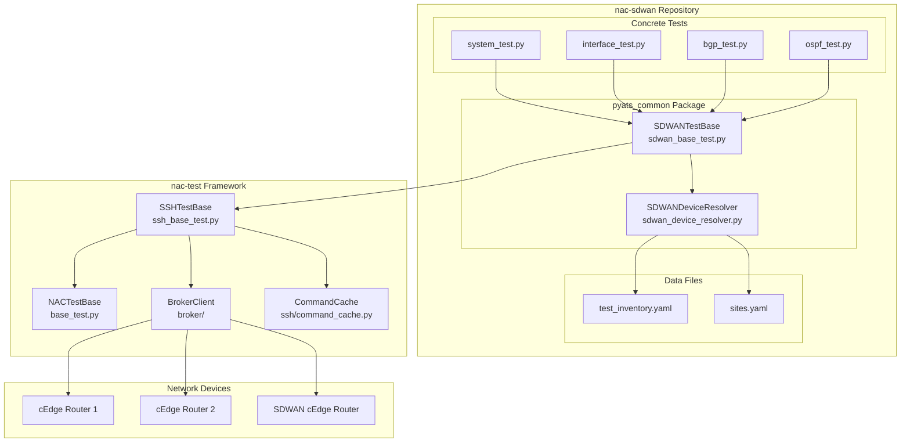
```mermaid
graph TB
    subgraph "nac-sdwan Repository"
        subgraph "pyats_common Package"
            SDWANTestBase[SDWANTestBase<br/>sdwan_base_test.py]
            SDWANResolver[SDWANDeviceResolver<br/>sdwan_device_resolver.py]
        end

        subgraph "Concrete Tests"
            SystemTest[system_test.py]
            InterfaceTest[interface_test.py]
            BGPTest[bgp_test.py]
            OspfTest[ospf_test.py]
        end

        subgraph "Data Files"
            TestInventory[test_inventory.yaml]
            SitesData[sites.yaml]
        end
    end

    subgraph "nac-test Framework"
        SSHTestBase[SSHTestBase<br/>ssh_base_test.py]
        NACTestBase[NACTestBase<br/>base_test.py]
        BrokerClient[BrokerClient<br/>broker/]
        CommandCache[CommandCache<br/>ssh/command_cache.py]
    end

    subgraph "Network Devices"
        cEdge1[cEdge Router 1]
        cEdge2[cEdge Router 2]
        cEdge3[SDWAN cEdge Router]
    end

    SystemTest --> SDWANTestBase
    InterfaceTest --> SDWANTestBase
    BGPTest --> SDWANTestBase
    OspfTest --> SDWANTestBase

    SDWANTestBase --> SSHTestBase
    SSHTestBase --> NACTestBase
    SSHTestBase --> BrokerClient
    SSHTestBase --> CommandCache

    SDWANTestBase --> SDWANResolver
    SDWANResolver --> TestInventory
    SDWANResolver --> SitesData

    BrokerClient --> cEdge1
    BrokerClient --> cEdge2
    BrokerClient --> cEdge3
```

#### SDWANTestBase Class Definition

```python
# sdwan_base_test.py
class SDWANTestBase(SSHTestBase):
    """Base class for SD-WAN SSH-based device tests.

    Extends SSHTestBase to provide SD-WAN specific:
    - Device inventory resolution from test_inventory.yaml
    - Site-based device discovery
    - SD-WAN data model integration

    Implements the required get_ssh_device_inventory() contract method
    that nac-test's device inventory discovery uses to determine
    which devices to test.
    """

    @classmethod
    def get_ssh_device_inventory(cls, data_model: dict) -> list[dict]:
        """Return device inventory for SD-WAN architecture.

        This is the CONTRACT METHOD required by nac-test's SSHTestBase.
        It is called by nac-test's device inventory discovery to
        determine which devices should be tested.

        Args:
            data_model: Merged data model containing SD-WAN configuration
                       including test_inventory and sites data

        Returns:
            list[dict]: List of device dictionaries with REQUIRED fields:
                - hostname: Device hostname for identification
                - host: IP address or DNS name for connection
                - os: Operating system type (e.g., "iosxe", "viptela")
                - username: SSH username
                - password: SSH password

        Example Return:
            [
                {
                    "hostname": "site1-cedge1",
                    "host": "10.10.1.1",
                    "os": "iosxe",
                    "username": "admin",
                    "password": "admin123",
                    "site_id": "site1",
                    "device_type": "cedge"
                },
                ...
            ]
        """
        return SDWANDeviceResolver.resolve_device_inventory(data_model)
```

#### SDWANDeviceResolver Component

SDWANDeviceResolver handles the complex logic of resolving device inventory from SD-WAN's hierarchical data model structure:

```python
# sdwan_device_resolver.py
class SDWANDeviceResolver:
    """Resolves SD-WAN device inventory from data model.

    SD-WAN data models typically have:
    - test_inventory.yaml: Lists devices to test with site references
    - sites.yaml: Contains site definitions with device details

    This resolver joins these data sources to produce
    the complete device inventory required by nac-test.
    """

    @classmethod
    def resolve_device_inventory(cls, data_model: dict) -> list[dict]:
        """Resolve complete device inventory from data model.

        Args:
            data_model: Merged data model with test_inventory and sites

        Returns:
            list[dict]: Resolved device inventory with all required fields
        """
        devices = []

        # Get test inventory (which devices to test)
        test_inventory = cls._parse_test_inventory(data_model)

        # Get sites data (device details)
        sites = data_model.get("sdwan", {}).get("sites", [])
        sites_by_id = {site.get("site_id"): site for site in sites}

        # Resolve each device from test inventory
        for inventory_item in test_inventory:
            site_id = inventory_item.get("site_id")
            device_name = inventory_item.get("device_name")

            site = sites_by_id.get(site_id)
            if not site:
                continue

            # Find device in site
            device_details = cls._find_device_in_site(site, device_name)
            if device_details:
                devices.append(cls._build_device_entry(
                    inventory_item, site, device_details, data_model
                ))

        return devices

    @classmethod
    def _parse_test_inventory(cls, data_model: dict) -> list[dict]:
        """Parse test_inventory from data model.

        Test inventory format:
            test_inventory:
              - site_id: site1
                device_name: cedge1
              - site_id: site2
                device_name: cedge1
        """
        return data_model.get("test_inventory", [])

    @classmethod
    def _find_device_in_site(cls, site: dict, device_name: str) -> dict | None:
        """Find device details within a site definition.

        Sites typically contain:
            sites:
              - site_id: site1
                cedge_routers:
                  - name: cedge1
                    system_ip: 10.10.1.1
                    ...
        """
        # Check cedge_routers
        for router in site.get("cedge_routers", []):
            if router.get("name") == device_name:
                return {"type": "cedge", "details": router}

        # Check other SDWAN edge routers (if applicable)
        for router in site.get("other_edge_routers", []):
            if router.get("name") == device_name:
                return {"type": "edge", "details": router}

        return None

    @classmethod
    def _build_device_entry(
        cls,
        inventory_item: dict,
        site: dict,
        device_details: dict,
        data_model: dict
    ) -> dict:
        """Build complete device entry with all required fields.

        Returns dict with REQUIRED fields for nac-test:
            hostname, host, os, username, password
        """
        details = device_details["details"]
        device_type = device_details["type"]

        # Get credentials from data model or site
        credentials = data_model.get("sdwan", {}).get("credentials", {})

        return {
            # REQUIRED fields for nac-test
            "hostname": details.get("name"),
            "host": details.get("system_ip") or details.get("management_ip"),
            "os": "iosxe" if device_type == "cedge" else "viptela",
            "username": credentials.get("username", "admin"),
            "password": credentials.get("password"),

            # Additional SD-WAN specific fields
            "site_id": site.get("site_id"),
            "device_type": device_type,
            "system_ip": details.get("system_ip"),
            "site_name": site.get("site_name"),
        }
```

#### Device Inventory Resolution Flow

The following sequence diagram shows how nac-test discovers devices using the SDWANTestBase contract:

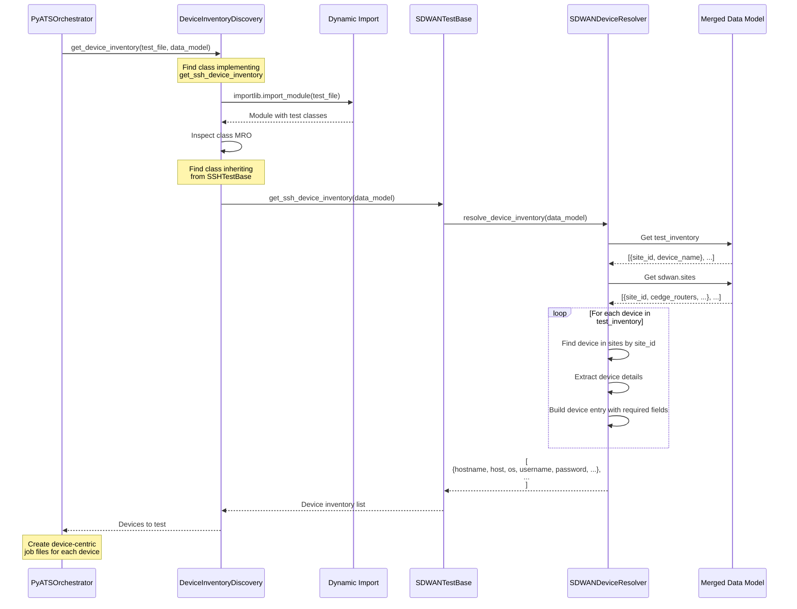
```mermaid
sequenceDiagram
    participant Orch as PyATSOrchestrator
    participant Discovery as DeviceInventoryDiscovery
    participant Import as Dynamic Import
    participant SDWANBase as SDWANTestBase
    participant Resolver as SDWANDeviceResolver
    participant DataModel as Merged Data Model

    Orch->>Discovery: get_device_inventory(test_file, data_model)

    Note over Discovery: Find class implementing<br/>get_ssh_device_inventory

    Discovery->>Import: importlib.import_module(test_file)
    Import-->>Discovery: Module with test classes

    Discovery->>Discovery: Inspect class MRO
    Note over Discovery: Find class inheriting<br/>from SSHTestBase

    Discovery->>SDWANBase: get_ssh_device_inventory(data_model)

    SDWANBase->>Resolver: resolve_device_inventory(data_model)

    Resolver->>DataModel: Get test_inventory
    DataModel-->>Resolver: [{site_id, device_name}, ...]

    Resolver->>DataModel: Get sdwan.sites
    DataModel-->>Resolver: [{site_id, cedge_routers, ...}, ...]

    loop For each device in test_inventory
        Resolver->>Resolver: Find device in sites by site_id
        Resolver->>Resolver: Extract device details
        Resolver->>Resolver: Build device entry with required fields
    end

    Resolver-->>SDWANBase: [<br/>  {hostname, host, os, username, password, ...},<br/>  ...<br/>]

    SDWANBase-->>Discovery: Device inventory list
    Discovery-->>Orch: Devices to test

    Note over Orch: Create device-centric<br/>job files for each device
```

#### SSHTestBase Setup Flow

When a test inheriting from SDWANTestBase runs, the following setup flow occurs:

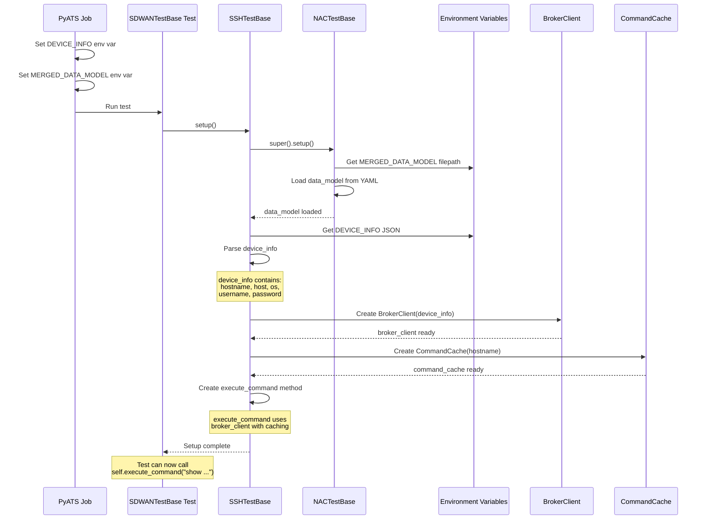
```mermaid
sequenceDiagram
    participant Job as PyATS Job
    participant Test as SDWANTestBase Test
    participant SSHBase as SSHTestBase
    participant NACBase as NACTestBase
    participant Env as Environment Variables
    participant Broker as BrokerClient
    participant Cache as CommandCache

    Job->>Job: Set DEVICE_INFO env var
    Job->>Job: Set MERGED_DATA_MODEL env var

    Job->>Test: Run test
    Test->>SSHBase: setup()

    SSHBase->>NACBase: super().setup()
    NACBase->>Env: Get MERGED_DATA_MODEL filepath
    NACBase->>NACBase: Load data_model from YAML
    NACBase-->>SSHBase: data_model loaded

    SSHBase->>Env: Get DEVICE_INFO JSON
    SSHBase->>SSHBase: Parse device_info
    Note over SSHBase: device_info contains:<br/>hostname, host, os,<br/>username, password

    SSHBase->>Broker: Create BrokerClient(device_info)
    Broker-->>SSHBase: broker_client ready

    SSHBase->>Cache: Create CommandCache(hostname)
    Cache-->>SSHBase: command_cache ready

    SSHBase->>SSHBase: Create execute_command method
    Note over SSHBase: execute_command uses<br/>broker_client with caching

    SSHBase-->>Test: Setup complete

    Note over Test: Test can now call<br/>self.execute_command("show ...")
```

#### Command Execution with Caching

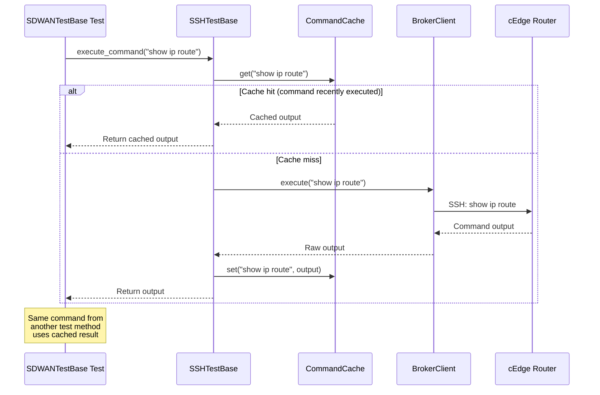
```mermaid
sequenceDiagram
    participant Test as SDWANTestBase Test
    participant SSHBase as SSHTestBase
    participant Cache as CommandCache
    participant Broker as BrokerClient
    participant Device as cEdge Router

    Test->>SSHBase: execute_command("show ip route")

    SSHBase->>Cache: get("show ip route")

    alt Cache hit (command recently executed)
        Cache-->>SSHBase: Cached output
        SSHBase-->>Test: Return cached output
    else Cache miss
        SSHBase->>Broker: execute("show ip route")
        Broker->>Device: SSH: show ip route
        Device-->>Broker: Command output
        Broker-->>SSHBase: Raw output
        SSHBase->>Cache: set("show ip route", output)
        SSHBase-->>Test: Return output
    end

    Note over Test: Same command from<br/>another test method<br/>uses cached result
```

#### SDWANTestBase Usage Example

```python
# Example: system_test.py in nac-sdwan repository
from nac_test_pyats_common.sdwan import SDWANTestBase

class SystemStatusValidation(SDWANTestBase):
    """Validate SD-WAN device system status."""

    TEST_CONFIG = {
        "schema_paths": ["sdwan.sites.cedge_routers"],
        "identifier_format": "{name}",
        "step_name_format": "Verify system status for {name}",
        "log_fields": ["name", "system_ip", "site_id"]
    }

    @aetest.test
    def test_control_connections(self):
        """Verify control connections to SDWAN Controller."""
        # Use inherited execute_command (with caching)
        output = self.execute_command("show sdwan control connections")

        # Parse and validate output
        assert "SDWAN Controller" in output, "No SDWAN Controller connections found"
        assert "CONNECT" in output, "Control connections not established"

    @aetest.test
    def test_bfd_sessions(self):
        """Verify BFD sessions are up."""
        output = self.execute_command("show sdwan bfd sessions")

        # Validate BFD sessions
        assert "up" in output.lower(), "BFD sessions not up"
```

---

### Creating New Architecture Implementations

To add support for a new network architecture (e.g., ISE, Meraki, IOS-XE), add the architecture adapter to **nac-test-pyats-common** following these patterns:

#### Where New Architectures Live

All architecture-specific code goes in **nac-test-pyats-common**, NOT in nac-test or architecture repos:

```
nac-test-pyats-common/
├── src/nac_test_pyats_common/
│   ├── aci/           # Existing: ACI/APIC
│   ├── sdwan/         # Existing: SD-WAN
│   ├── catc/          # Existing: Catalyst Center
│   ├── ise/           # NEW: ISE adapter
│   │   ├── __init__.py
│   │   ├── auth.py
│   │   └── test_base.py
│   └── meraki/        # NEW: Meraki adapter
│       ├── __init__.py
│       ├── auth.py
│       └── test_base.py
```

#### For Controller-Based Architectures (ISE, Meraki)

```mermaid
flowchart TB
    subgraph "nac-test-pyats-common/ise/"
        Auth[auth.py<br/>ISEAuth class]
        Base[test_base.py<br/>ISETestBase class]
        Init[__init__.py<br/>Export public API]
    end

    subgraph "nac-test (inherited)"
        NACBase[NACTestBase]
        AuthCache[AuthCache]
    end

    Base -->|extends| NACBase
    Auth -->|uses| AuthCache
    Base -->|uses| Auth

    style Auth fill:#e1f5fe
    style Base fill:#e1f5fe
    style Init fill:#e1f5fe
```

**Implementation Template:**

```python
# In nac-test-pyats-common: ise/auth.py
import os
from typing import Any
import httpx

from nac_test.pyats_core.common.auth_cache import AuthCache

class ISEAuth:
    """ISE authentication adapter."""

    @classmethod
    def _authenticate(cls, url: str, username: str, password: str) -> tuple[dict[str, Any], int]:
        """Perform ISE authentication."""
        with httpx.Client(verify=False, timeout=30.0) as client:
            # ISE uses ERS API with Basic Auth
            response = client.get(
                f"{url}/ers/config/adminuser",
                auth=(username, password),
                headers={"Accept": "application/json"},
            )
            response.raise_for_status()
            return {"username": username, "password": password}, 3600

    @classmethod
    def get_auth(cls) -> dict[str, Any]:
        """Get auth data with caching."""
        url = os.environ.get("ISE_URL", "").rstrip("/")
        username = os.environ.get("ISE_USERNAME", "")
        password = os.environ.get("ISE_PASSWORD", "")

        if not all([url, username, password]):
            raise ValueError("Missing ISE_URL, ISE_USERNAME, or ISE_PASSWORD")

        return AuthCache.get_or_create(
            controller_type="ISE",
            url=url,
            auth_func=lambda: cls._authenticate(url, username, password),
        )


# In nac-test-pyats-common: ise/test_base.py
from nac_test.pyats_core.common.base_test import NACTestBase
from pyats import aetest

from .auth import ISEAuth

class ISETestBase(NACTestBase):
    """ISE API test base class."""

    @aetest.setup
    def setup(self) -> None:
        super().setup()
        self.auth_data = ISEAuth.get_auth()
        self.client = self._create_client()

    def _create_client(self):
        """Create httpx client with ISE auth."""
        import os
        url = os.environ.get("ISE_URL", "").rstrip("/")
        base_client = self.pool.get_client(
            base_url=url,
            auth=(self.auth_data["username"], self.auth_data["password"]),
            headers={"Accept": "application/json"},
            verify=False,
        )
        return self.wrap_client_for_tracking(base_client, device_name="ISE")
```

**Architecture repo usage:**
```python
# In nac-ise-terraform test files
from nac_test_pyats_common.ise import ISETestBase

class VerifyNetworkDevices(ISETestBase):
    @aetest.test
    def test_devices_exist(self):
        # self.client is ready with ISE authentication
        response = await self.client.get("/ers/config/networkdevice")
```

#### For SSH-Based Architectures (like SD-WAN, IOS-XE)

SSH/D2D adapters require both a device resolver and a test base class:

```mermaid
flowchart TB
    subgraph "nac-test-pyats-common/nxos/"
        Resolver[device_resolver.py<br/>NXOSDeviceResolver class]
        Base[ssh_test_base.py<br/>NXOSTestBase class]
        Init[__init__.py<br/>Export public API]
    end

    subgraph "nac-test (inherited)"
        SSHBase[SSHTestBase]
        BaseResolver[BaseDeviceResolver]
    end

    Base -->|extends| SSHBase
    Resolver -->|extends| BaseResolver
    Base -->|uses| Resolver

    style Resolver fill:#e1f5fe
    style Base fill:#e1f5fe
    style Init fill:#e1f5fe
```

**Implementation Template:**

```python
# In nac-test-pyats-common: nxos/device_resolver.py
import os
from typing import Any

from nac_test_pyats_common.common.base_device_resolver import BaseDeviceResolver

class NXOSDeviceResolver(BaseDeviceResolver):
    """NX-OS device resolver - parses NAC schema for device inventory."""

    # Template Method Pattern: implement abstract methods
    @classmethod
    def get_schema_path(cls) -> str:
        return "nxos.switches"

    @classmethod
    def extract_device_fields(cls, device_data: dict[str, Any]) -> dict[str, Any]:
        return {
            "hostname": device_data.get("name"),
            "host": device_data.get("management_ip"),
            "os": "nxos",
        }

    @classmethod
    def get_credential_env_vars(cls) -> tuple[str, str]:
        return ("NXOS_USERNAME", "NXOS_PASSWORD")


# In nac-test-pyats-common: nxos/ssh_test_base.py
from nac_test.pyats_core.common.ssh_base_test import SSHTestBase

from .device_resolver import NXOSDeviceResolver

class NXOSTestBase(SSHTestBase):
    """NX-OS SSH test base class."""

    @classmethod
    def get_ssh_device_inventory(cls, data_model: dict) -> list[dict]:
        """CONTRACT METHOD - Required by nac-test."""
        return NXOSDeviceResolver.resolve_device_inventory(data_model)
```

**Architecture repo usage:**
```python
# In nac-nxos-terraform test files
from nac_test_pyats_common.nxos import NXOSTestBase

class VerifyVLANs(NXOSTestBase):
    @aetest.test
    def test_vlans_configured(self):
        # self.device is ready with SSH connection
        output = self.execute_command("show vlan brief")
```

#### Contract Method Requirements

The `get_ssh_device_inventory()` method MUST:

1. Be a `@classmethod` (called without instance)
2. Accept `data_model: dict` as the only parameter
3. Return `list[dict]` with REQUIRED fields:

| Field | Type | Description |
|-------|------|-------------|
| `hostname` | str | Device identifier for logs/reports |
| `host` | str | IP address or DNS name for SSH connection |
| `os` | str | Operating system type (iosxe, nxos, viptela, etc.) |
| `username` | str | SSH username |
| `password` | str | SSH password |

Optional fields can be included for architecture-specific needs (e.g., `site_id`, `device_type`, `platform`).

---

### BaseDeviceResolver: Template Method Pattern for D2D (nac-test-pyats-common)

**Location:** `nac_test_pyats_common/common/base_device_resolver.py`

To reduce code duplication across architecture-specific resolvers, nac-test-pyats-common provides `BaseDeviceResolver` - an abstract base class implementing the Template Method pattern.

#### Design Rationale

**Problem:** With 15+ architectures requiring D2D support, each implementing its own device resolver would result in massive code duplication:

- Inventory loading logic
- Device filtering logic
- Credential injection from environment variables
- Device dictionary building

**Solution:** Extract common patterns into `BaseDeviceResolver`, letting architecture-specific resolvers only implement schema navigation methods.

#### BaseDeviceResolver Architecture

```mermaid
classDiagram
    class BaseDeviceResolver {
        <<abstract>>
        -Path data_model_path
        -dict data_model
        -dict test_inventory
        +get_resolved_inventory() list~dict~
        -_load_inventory() None
        -_get_devices_to_test() list~dict~
        -_inject_credentials(device: dict) dict
        -_build_device_dict(device: dict, credentials: dict) dict
        +get_architecture_name()* str
        +get_schema_root_key()* str
        +navigate_to_devices(data: dict)* Iterator~dict~
        +extract_device_id(device: dict)* str
        +extract_hostname(device: dict)* str
        +extract_host_ip(device: dict)* str
        +extract_os_type(device: dict)* str
        +get_credential_env_vars()* tuple~str,str~
    }

    class SDWANDeviceResolver {
        +get_architecture_name() str
        +get_schema_root_key() str
        +navigate_to_devices(data: dict) Iterator~dict~
        +extract_device_id(device: dict) str
        +extract_hostname(device: dict) str
        +extract_host_ip(device: dict) str
        +extract_os_type(device: dict) str
        +get_credential_env_vars() tuple~str,str~
    }

    class ACIDeviceResolver {
        +get_architecture_name() str
        +get_schema_root_key() str
        +navigate_to_devices(data: dict) Iterator~dict~
        +extract_device_id(device: dict) str
        +extract_hostname(device: dict) str
        +extract_host_ip(device: dict) str
        +extract_os_type(device: dict) str
        +get_credential_env_vars() tuple~str,str~
    }

    BaseDeviceResolver <|-- SDWANDeviceResolver
    BaseDeviceResolver <|-- ACIDeviceResolver
```

#### Abstract Methods to Implement

New architecture resolvers only need to implement 8 abstract methods:

| Method | Purpose | Example Return |
|--------|---------|----------------|
| `get_architecture_name()` | Human-readable name for logging | `"SD-WAN"` |
| `get_schema_root_key()` | Root key in data model | `"sdwan"` |
| `navigate_to_devices(data)` | Iterator over device entries in schema | `yield from data["sites"][*]["cedge_routers"]` |
| `extract_device_id(device)` | Unique device identifier | `device["chassis_id"]` |
| `extract_hostname(device)` | Device hostname | `device["system_hostname"]` |
| `extract_host_ip(device)` | Management IP (handle CIDR if needed) | `device["system_ip"].split("/")[0]` |
| `extract_os_type(device)` | Operating system type | `"iosxe"` |
| `get_credential_env_vars()` | Environment variable names for credentials | `("IOSXE_USERNAME", "IOSXE_PASSWORD")` |

#### Implementation Example

```python
# In nac-test-pyats-common: sdwan/device_resolver.py
from nac_test_pyats_common.common.base_device_resolver import BaseDeviceResolver

class SDWANDeviceResolver(BaseDeviceResolver):
    """SD-WAN specific device resolver."""

    def get_architecture_name(self) -> str:
        return "SD-WAN"

    def get_schema_root_key(self) -> str:
        return "sdwan"

    def navigate_to_devices(self, data: dict) -> Iterator[dict]:
        """Navigate sites[].cedge_routers[] structure."""
        sites = data.get("sites", [])
        for site in sites:
            for router in site.get("cedge_routers", []):
                yield router

    def extract_device_id(self, device: dict) -> str:
        return device.get("chassis_id", "")

    def extract_hostname(self, device: dict) -> str:
        return device.get("system_hostname", "")

    def extract_host_ip(self, device: dict) -> str:
        # Handle CIDR notation: "10.1.1.1/24" → "10.1.1.1"
        ip = device.get("system_ip", "")
        return ip.split("/")[0] if "/" in ip else ip

    def extract_os_type(self, device: dict) -> str:
        return "iosxe"  # SD-WAN cEdge routers run IOS-XE

    def get_credential_env_vars(self) -> tuple[str, str]:
        # D2D tests use device credentials, not controller credentials
        return ("IOSXE_USERNAME", "IOSXE_PASSWORD")
```

#### Benefits of Template Method Pattern

| Benefit | Description |
|---------|-------------|
| **Zero Code Duplication** | Common logic lives in base class only |
| **< 100 Lines per Resolver** | New architectures implement minimal code |
| **Consistent Behavior** | All resolvers use same validation, logging, error handling |
| **Easy Testing** | Mock abstract methods, test base class logic once |
| **Type Safety** | Abstract methods enforce contract |

---

### Device Validation Utilities (nac-test)

**Location:** `nac_test/utils/device_validation.py`

nac-test provides validation utilities to catch configuration errors before SSH connection attempts.

#### validate_device_inventory()

```python
from nac_test.utils import validate_device_inventory, DeviceValidationError

# Required fields for all devices
REQUIRED_DEVICE_FIELDS = frozenset({"hostname", "host", "os", "username", "password"})

def validate_device_inventory(devices: list[dict]) -> None:
    """Validate device inventory has all required fields.

    Args:
        devices: List of device dictionaries to validate

    Raises:
        DeviceValidationError: If any device is missing required fields
    """
    for i, device in enumerate(devices):
        missing = REQUIRED_DEVICE_FIELDS - set(device.keys())
        if missing:
            raise DeviceValidationError(
                f"Device at index {i} (hostname: {device.get('hostname', 'unknown')}) "
                f"missing required fields: {', '.join(sorted(missing))}"
            )
```

#### DeviceValidationError Exception

```python
class DeviceValidationError(ValueError):
    """Raised when device dictionary validation fails.

    Attributes:
        device_index: Index of the invalid device in the list.
        device_hostname: Hostname of the device (if available).
        missing_fields: Set of missing required fields.
        invalid_fields: Dict of field name to validation error message.

    Provides actionable error messages with:
    - Which device failed validation (by index and hostname)
    - Which fields are missing
    - Which fields have invalid values
    """

    def __init__(
        self,
        device_index: int,
        device_hostname: str | None,
        missing_fields: set[str] | None = None,
        invalid_fields: dict[str, str] | None = None,
    ) -> None:
        self.device_index = device_index
        self.device_hostname = device_hostname
        self.missing_fields = missing_fields or set()
        self.invalid_fields = invalid_fields or {}

        parts = [f"Device {device_index}"]
        if device_hostname:
            parts[0] = f"Device {device_index} ({device_hostname})"

        if self.missing_fields:
            parts.append(f"missing required fields: {self.missing_fields}")
        if self.invalid_fields:
            for field, error in self.invalid_fields.items():
                parts.append(f"{field}: {error}")

        super().__init__(" - ".join(parts))
```

**Example error messages:**
```
# Missing fields
DeviceValidationError: Device 0 (router1) - missing required fields: {'username', 'password'}

# Invalid field values
DeviceValidationError: Device 2 (switch3) - host: must be a non-empty string (IP address) - username: must not be None (check environment variables)
```

#### Integration with SSHTestBase

`SSHTestBase.setup()` automatically validates device info:

```python
class SSHTestBase(NACTestBase):
    @aetest.setup
    def setup(self) -> None:
        super().setup()

        # Parse device info from environment
        device_info_json = os.environ.get("DEVICE_INFO", "{}")
        self.device_info = json.loads(device_info_json)

        # Validate before attempting SSH connection
        try:
            validate_device_inventory([self.device_info])
        except DeviceValidationError as e:
            self.logger.error(f"Device validation failed: {e}")
            raise
```

---

### File Discovery Utilities (nac-test)

**Location:** `nac_test/utils/file_discovery.py`

Generic file discovery utility for finding data files in configurable search directories.

```python
def find_data_file(
    filename: str,
    search_dirs: list[Path] | None = None,
    base_dir: Path | None = None
) -> Path | None:
    """Find a data file by searching multiple directories.

    Args:
        filename: Name of file to find (e.g., "test_inventory.yaml")
        search_dirs: List of directories to search (default: common locations)
        base_dir: Base directory for relative search paths

    Returns:
        Path to found file, or None if not found

    Search Order (default):
        1. Current working directory
        2. base_dir (if provided)
        3. base_dir/data (if provided)
        4. Common data directories
    """
```

---

## Data Models

### Core Models (`core/models.py`)

```python
from pydantic import BaseModel

class TestResult(BaseModel):
    """Individual test result."""
    name: str
    status: str
    duration: float
    message: Optional[str] = None

class ExecutionSummary(BaseModel):
    """Execution summary statistics."""
    total: int
    passed: int
    failed: int
    skipped: int
    errored: int
    duration: float
```

### Constants (`core/constants.py`)

```python
# Default values
DEFAULT_OUTPUT_DIR = "output"
DEFAULT_PARALLEL = 4
DEFAULT_TEST_TIMEOUT = 300

# Status values
STATUS_PASSED = "passed"
STATUS_FAILED = "failed"
STATUS_SKIPPED = "skipped"
STATUS_ERRORED = "errored"
```

### PyATS Constants (`pyats_core/constants.py`)

```python
# Test execution
DEFAULT_TEST_TIMEOUT = 300  # 5 minutes per test

# Archive patterns
API_ARCHIVE_PATTERN = "nac_test_job_api_*.zip"
D2D_ARCHIVE_PATTERN = "nac_test_job_d2d_*.zip"
```

---

## Connection Management

### Device Connection Manager (`pyats_core/ssh/connection_manager.py`)

Manages SSH connections with resource-aware pooling:

```mermaid
classDiagram
    class DeviceConnectionManager {
        +max_concurrent: int
        +device_locks: Dict[str, Lock]
        +connections: Dict[str, Connection]
        +semaphore: Semaphore
        +get_connection(hostname, device_info)
        +close_connection(hostname)
        +close_all_connections()
        +device_connection(hostname, device_info)
        +get_connection_stats()
    }
```

**Features:**

- **Per-Device Locking**: Ensures one connection per device
- **Global Semaphore**: Limits total concurrent connections
- **Resource Calculation**: Auto-calculates capacity based on system resources
- **Health Checking**: Validates connection health before reuse
- **Error Formatting**: Detailed error messages with troubleshooting hints

#### Connection Flow

```mermaid
sequenceDiagram
    participant Test
    participant Manager as DeviceConnectionManager
    participant Lock as Device Lock
    participant Semaphore
    participant Unicon

    Test->>Manager: get_connection(hostname, device_info)
    Manager->>Lock: Acquire device lock

    alt Connection exists and healthy
        Manager-->>Test: Return existing connection
    else Need new connection
        Manager->>Semaphore: Acquire global slot
        Manager->>Unicon: Create Connection
        Unicon->>Unicon: Build start command
        Unicon->>Unicon: Connect with timeout
        Unicon-->>Manager: Connected
        Manager->>Manager: Store connection
        Manager-->>Test: Return new connection
    end
```

#### Connection Command Building (`ssh/connection_utils.py`)

Builds Unicon connection commands:

```python
def build_connection_start_command(
    protocol: str,
    host: str,
    port: Optional[int] = None,
    username: Optional[str] = None,
    ssh_options: Optional[str] = None
) -> str:
```

**Supported Protocols:**

- `ssh`: `ssh {username}@{host} -p {port} {options}`
- `telnet`: `telnet {host} {port}`
- `console`: `cu -l {device_path}`

#### Chassis Type Determination

```python
def determine_chassis_type(connection_count: int) -> str:
    if connection_count == 1:
        return "single_rp"
    elif connection_count == 2:
        return "dual_rp"
    else:
        return "stack"
```

### Command Cache (`pyats_core/ssh/command_cache.py`)

Per-device command output caching:

```python
class CommandCache:
    def __init__(self, hostname: str, ttl: int = 3600):
        self.hostname = hostname
        self.ttl = ttl
        self.cache: Dict[str, Dict[str, Any]] = {}

    def get(self, command: str) -> Optional[str]:
        """Get cached output if valid."""

    def set(self, command: str, output: str) -> None:
        """Cache command output with timestamp."""
```

**Features:**

- **TTL Support**: Automatic expiration after configurable time
- **Per-Device Isolation**: Separate cache per device
- **Statistics**: Track cache hits/misses

---

## Configuration & Environment

### Environment Variable Support

The DataMerger supports environment variable substitution:

```yaml
# data.yaml
apic:
  host: ${APIC_HOST}
  username: ${APIC_USERNAME}
  password: ${APIC_PASSWORD}
```

**Loading Process:**

1. Parse YAML file
2. Extract `env_lines` with `${VAR}` syntax
3. Export variables to environment
4. Process Jinja2 templates
5. Substitute variables in final output

### Controller Type Auto-Detection

**Location:** `nac_test/utils/controller.py`

nac-test automatically detects the network architecture based on which credential environment variables are set, eliminating the need for users to explicitly set `CONTROLLER_TYPE`.

#### CREDENTIAL_PATTERNS Configuration

```python
# Environment variable patterns for architecture detection
CREDENTIAL_PATTERNS: dict[str, tuple[str, str, str]] = {
    # Architecture: (URL_VAR, USERNAME_VAR, PASSWORD_VAR)
    "aci": ("APIC_URL", "APIC_USERNAME", "APIC_PASSWORD"),
    "sdwan": ("SDWAN_URL", "SDWAN_USERNAME", "SDWAN_PASSWORD"),
    "catalyst_center": ("CC_URL", "CC_USERNAME", "CC_PASSWORD"),
    "meraki": ("MERAKI_URL", "MERAKI_API_KEY", None),  # API key auth
    "fmc": ("FMC_URL", "FMC_USERNAME", "FMC_PASSWORD"),
    "ise": ("ISE_URL", "ISE_USERNAME", "ISE_PASSWORD"),
}
```

#### Detection Algorithm

```python
def detect_controller_type() -> str | None:
    """Auto-detect controller type from environment variables.

    Iterates through CREDENTIAL_PATTERNS and returns the first
    architecture where ALL required credentials are set.

    Returns:
        Architecture name (e.g., "aci", "sdwan") or None if no match

    Example:
        # If APIC_URL, APIC_USERNAME, APIC_PASSWORD are all set:
        detect_controller_type() → "aci"
    """
    for arch, (url_var, user_var, pass_var) in CREDENTIAL_PATTERNS.items():
        required_vars = [url_var, user_var]
        if pass_var:  # Some architectures use API keys
            required_vars.append(pass_var)

        if all(os.environ.get(var) for var in required_vars):
            return arch

    return None
```

#### Detection Flow Diagram

```mermaid
flowchart TB
    subgraph "Controller Type Detection"
        Start[Start Detection] --> CheckACI{APIC_URL +<br/>APIC_USERNAME +<br/>APIC_PASSWORD set?}
        CheckACI -->|Yes| ReturnACI[Return 'aci']
        CheckACI -->|No| CheckSDWAN{SDWAN_URL +<br/>SDWAN_USERNAME +<br/>SDWAN_PASSWORD set?}
        CheckSDWAN -->|Yes| ReturnSDWAN[Return 'sdwan']
        CheckSDWAN -->|No| CheckCC{CC_URL +<br/>CC_USERNAME +<br/>CC_PASSWORD set?}
        CheckCC -->|Yes| ReturnCC[Return 'catalyst_center']
        CheckCC -->|No| CheckMeraki{MERAKI_URL +<br/>MERAKI_API_KEY set?}
        CheckMeraki -->|Yes| ReturnMeraki[Return 'meraki']
        CheckMeraki -->|No| CheckFMC{FMC_URL +<br/>FMC_USERNAME +<br/>FMC_PASSWORD set?}
        CheckFMC -->|Yes| ReturnFMC[Return 'fmc']
        CheckFMC -->|No| CheckISE{ISE_URL +<br/>ISE_USERNAME +<br/>ISE_PASSWORD set?}
        CheckISE -->|Yes| ReturnISE[Return 'ise']
        CheckISE -->|No| ReturnNone[Return None]
    end

    style ReturnACI fill:#90EE90
    style ReturnSDWAN fill:#90EE90
    style ReturnCC fill:#90EE90
    style ReturnMeraki fill:#90EE90
    style ReturnFMC fill:#90EE90
    style ReturnISE fill:#90EE90
    style ReturnNone fill:#FFD700
```

#### D2D Tests and Controller Credentials

**Important:** D2D (SSH-based) tests still require controller credentials for architecture detection, even though they don't directly connect to the controller.

##### Dual Purpose of Controller Credentials

Controller credentials (URL, USERNAME, PASSWORD) serve **two distinct purposes**:

1. **Architecture Detection** (always required) - Determines which DeviceResolver to use
2. **Controller Connection** (API tests only) - Establishes session with controller

##### Why Controller Credentials Are Required for D2D

**Problem**: Device credentials alone are ambiguous.

Example: `IOSXE_USERNAME` and `IOSXE_PASSWORD` could be used for:
- SD-WAN edge devices (cEdge routers)
- Catalyst Center-managed devices (switches, routers)

**Without controller credentials**, the framework cannot determine which DeviceResolver to use:
- `SDWANDeviceResolver`? (parses SD-WAN data model for device inventory)
- `CatalystCenterDeviceResolver`? (parses Catalyst Center data model)

**Solution**: Controller credentials provide architecture context, even when controller is not contacted during D2D test execution.

```
┌────────────────────────────────────────────────────────────────────┐
│                        D2D Test Execution                          │
├────────────────────────────────────────────────────────────────────┤
│  Required Environment Variables:                                   │
│                                                                    │
│  Controller Credentials (for detection):                          │
│    SDWAN_URL=https://sdwan-manager.example.com                    │
│    SDWAN_USERNAME=admin                                            │
│    SDWAN_PASSWORD=password123                                      │
│                                                                    │
│  Device Credentials (for SSH):                                     │
│    IOSXE_USERNAME=device-admin                                     │
│    IOSXE_PASSWORD=device-pass                                      │
│                                                                    │
│  Detection Result:                                                 │
│    detect_controller_type() → "sdwan"                              │
│    → TestTypeResolver uses BASE_CLASS_MAPPING["SDWANTestBase"]    │
│    → Device SSH uses IOSXE_USERNAME/IOSXE_PASSWORD                │
└────────────────────────────────────────────────────────────────────┘
```

**What happens during D2D test execution:**
1. Framework detects `CONTROLLER_TYPE=SDWAN` from controller credentials
2. Framework loads `SDWANDeviceResolver` for device inventory resolution
3. Tests connect to devices via SSH using `IOSXE_*` credentials
4. Controller credentials are NOT used for connection (D2D tests bypass controller)

#### Integration with Test Discovery

The detected controller type informs test categorization:

```python
# In orchestrator.py
controller_type = detect_controller_type()
if controller_type:
    logger.info(f"Detected controller type: {controller_type}")
else:
    logger.warning("Could not auto-detect controller type from environment")
```

#### Usage Examples

**Example 1: ACI Environment**
```bash
export APIC_URL="https://apic.example.com"
export APIC_USERNAME="admin"
export APIC_PASSWORD="cisco123"

nac-test -d data/ -t templates/ -o output/
# → Auto-detects "aci" architecture
```

**Example 2: SD-WAN Environment with D2D**
```bash
# Controller credentials (required for detection)
export SDWAN_URL="https://sdwan-manager.example.com"
export SDWAN_USERNAME="admin"
export SDWAN_PASSWORD="admin123"

# Device credentials (required for SSH)
export IOSXE_USERNAME="device-admin"
export IOSXE_PASSWORD="device-pass"

nac-test -d data/ -t templates/ -o output/
# → Auto-detects "sdwan" architecture
# → D2D tests SSH with IOSXE_* credentials
```

**Example 3: Users Without Controller Access**

For development/testing without controller access, users can set dummy credentials:

```bash
# Dummy credentials (architecture detection only)
export APIC_URL="https://dummy"
export APIC_USERNAME="dummy"
export APIC_PASSWORD="dummy"

nac-test -d data/ -t templates/ -o output/
# → Detects "aci" for test categorization
# → Actual API calls will fail (expected in dev mode)
```

#### Detection Error Messages

**Multiple credential sets detected:**
```
ERROR: Multiple controller credential sets detected.
Cannot determine which architecture to use.

Detected credential sets:
  • ACI (ACI_URL, ACI_USERNAME, ACI_PASSWORD)
  • SDWAN (SDWAN_URL, SDWAN_USERNAME, SDWAN_PASSWORD)

Please provide credentials for only ONE architecture at a time.
```

**Partial credentials (missing some variables):**
```
ERROR: No complete controller credential sets detected.

Partial credentials found:
  • SDWAN: found SDWAN_URL
    Missing: SDWAN_USERNAME, SDWAN_PASSWORD

To use SD-WAN, set all required credentials:
  export SDWAN_URL='https://sdwan.example.com'
  export SDWAN_USERNAME='admin'
  export SDWAN_PASSWORD='password'
```

**No credentials found:**
```
ERROR: No complete controller credential sets detected.

To use a specific architecture, set all required credentials:

For ACI:
  export ACI_URL='...'
  export ACI_USERNAME='...'
  export ACI_PASSWORD='...'

For SDWAN:
  export SDWAN_URL='...'
  export SDWAN_USERNAME='...'
  export SDWAN_PASSWORD='...'

[...continues for all supported architectures...]
```

#### D2D Credential Environment Variables by Architecture

Each architecture uses different credential environment variables for D2D (SSH) testing. Controller credentials determine architecture; device credentials are used for SSH connections.

| Architecture | D2D Device Type | Username Env Var | Password Env Var |
|--------------|-----------------|------------------|------------------|
| SD-WAN | IOS-XE edges (cEdge) | `IOSXE_USERNAME` | `IOSXE_PASSWORD` |
| ACI | NX-OS switches (leaf/spine) | `NXOS_SSH_USERNAME` | `NXOS_SSH_PASSWORD` |
| Catalyst Center | IOS-XE devices | `IOSXE_USERNAME` | `IOSXE_PASSWORD` |
| NDFC | NX-OS switches | `NXOS_SSH_USERNAME` | `NXOS_SSH_PASSWORD` |
| IOS-XE Direct | IOS-XE devices | `IOSXE_USERNAME` | `IOSXE_PASSWORD` |
| IOS-XR | IOS-XR devices | `IOSXR_USERNAME` | `IOSXR_PASSWORD` |
| NX-OS Direct | NX-OS switches | `NXOS_SSH_USERNAME` | `NXOS_SSH_PASSWORD` |

**Note:** Device credentials are separate from controller credentials. For example:
- `SDWAN_USERNAME`/`SDWAN_PASSWORD` → vManage API access
- `IOSXE_USERNAME`/`IOSXE_PASSWORD` → SSH access to edge devices

---

### Path Setup (`utils/path_setup.py`)

Configures Python paths for test imports:

```python
def find_tests_directory(path: Path) -> Path:
    """Find /tests directory in path hierarchy."""

def determine_import_path(test_path: Path) -> Path:
    """Determine correct path for sys.path."""

def get_pythonpath_for_tests(
    test_dir: Path,
    extra_dirs: Optional[List[Path]] = None
) -> str:
    """Build PYTHONPATH for subprocess execution."""
```

**Import Styles:**

- **Legacy**: `from tests.module import ...` - adds parent of /tests
- **Modern**: `from templates.module import ...` - adds /tests itself

---

## Utilities

### Logging (`utils/logging.py`)

Structured logging configuration:

```python
import logging

def configure_logging(level: str = "INFO") -> None:
    """Configure logging with consistent format."""
    logging.basicConfig(
        level=getattr(logging, level),
        format="%(asctime)s [%(levelname)s] %(name)s: %(message)s"
    )
```

### Terminal Utilities (`utils/terminal.py`)

Rich terminal output formatting:

```python
class Terminal:
    def success(self, text: str) -> str:
        """Format text in green."""

    def error(self, text: str) -> str:
        """Format text in red."""

    def warning(self, text: str) -> str:
        """Format text in yellow."""

    def info(self, text: str) -> str:
        """Format text in blue."""

terminal = Terminal()
```

### System Resources (`utils/system_resources.py`)

Resource-aware capacity calculation:

```python
class SystemResourceCalculator:
    @staticmethod
    def calculate_connection_capacity(
        memory_per_connection_mb: float = 10.0,
        fds_per_connection: int = 5,
        max_connections: int = 1000,
        env_var: str = "MAX_SSH_CONNECTIONS"
    ) -> int:
```

**Factors Considered:**

- Available system memory
- File descriptor limits
- Environment variable overrides
- Configurable per-connection requirements

### Cleanup Utilities (`utils/cleanup.py`)

Resource cleanup on exit:

```python
def cleanup_temp_files(patterns: List[str]) -> None:
    """Remove temporary files matching patterns."""

def cleanup_output_directory(output_dir: Path) -> None:
    """Clean up output directory before run."""
```

### Environment Utilities (`utils/environment.py`)

Environment variable handling:

```python
def load_env_from_yaml(yaml_path: Path) -> Dict[str, str]:
    """Extract and load environment variables from YAML."""

def set_env_vars(env_vars: Dict[str, str]) -> None:
    """Set environment variables."""
```

---

## File System Layout

```
project-root/
├── pyproject.toml              # Poetry project configuration
├── Makefile                    # Build automation
├── README.md                   # Project documentation
├── CHANGELOG.md                # Version history
│
├── nac_test/                   # Main package
│   ├── __init__.py
│   ├── __main__.py             # Entry point
│   ├── cli/
│   │   └── main.py             # CLI implementation
│   ├── combined_orchestrator.py
│   ├── data_merger.py
│   ├── core/
│   │   ├── constants.py
│   │   └── models.py
│   ├── pyats_core/             # PyATS execution engine
│   │   ├── broker/             # Connection broker
│   │   ├── common/             # Base test classes
│   │   ├── discovery/          # Test/device discovery
│   │   ├── execution/          # Job execution
│   │   ├── progress/           # Progress reporting
│   │   ├── reporting/          # HTML reports
│   │   └── ssh/                # SSH management
│   ├── robot/                  # Robot Framework
│   │   ├── orchestrator.py
│   │   ├── pabot.py
│   │   └── robot_writer.py
│   └── utils/                  # Utilities
│       ├── cleanup.py
│       ├── environment.py
│       ├── logging.py
│       ├── path_setup.py
│       ├── system_resources.py
│       └── terminal.py
│
├── tests/                      # Test suite
│   ├── integration/
│   │   ├── fixtures/           # Test fixtures
│   │   └── test_integration.py
│   └── unit/
│       └── test_*.py
│
└── output/                     # Generated outputs (git-ignored)
    ├── merged_data_model.yaml  # Merged data file
    ├── pyats_results/          # Extracted archives
    │   ├── api/                # API test results
    │   │   ├── html_reports/
    │   │   └── results.json
    │   └── d2d/                # D2D test results
    │       ├── html_reports/
    │       └── results.json
    └── nac_test_job_*.zip      # PyATS archives
```

---

## Deployment and Operations

### Installation

```bash
# Clone repository
git clone <repository-url>
cd nac-test

# Install with Poetry
poetry install

# Or with pip
pip install -e .
```

### Running Tests

```bash
# Run PyATS tests
nac-test --pyats --test-dir ./tests --data ./data --output-dir ./output

# Run Robot Framework tests
nac-test --data ./data --templates ./templates --output-dir ./output

# With parallel execution
nac-test --pyats --test-dir ./tests --parallel 8

# With minimal reports
nac-test --pyats --test-dir ./tests --minimal-reports
```

### Environment Variables

```bash
# Device credentials (loaded from data YAML)
export APIC_HOST="10.1.1.1"
export APIC_USERNAME="admin"
export APIC_PASSWORD="secret"

# Resource limits
export MAX_SSH_CONNECTIONS="100"

# Debug mode
export PYATS_DEBUG="1"
```

---

## Testing

### Running Unit Tests

```bash
# Run all tests
uv run pytest --cov=src --cov-report=term-missing

# Run specific test file
uv run pytest tests/unit/test_connection_utils.py -v
```

### Test Fixtures

Test fixtures are located in `tests/integration/fixtures/`:

- `data/` - Sample data YAML files
- `templates/` - Sample Robot templates
- `filters/` - Sample Python filters
- `tests/` - Sample PyATS test files

---

## HTML Reporting System (Deep Dive)

This section provides an exhaustive, meticulous documentation of the HTML reporting system in nac-test. It explains every component, what data flows between them, and what PyATS test files must provide for successful report generation.

### HTML Reporting System Overview

The HTML reporting system is a multi-layered architecture that:
1. **Collects** test results and command executions during PyATS test execution
2. **Batches** high-volume reporter messages to prevent server crashes
3. **Streams** results to JSONL files for memory efficiency
4. **Generates** professional HTML reports from the collected data

```mermaid
graph TB
    subgraph "PyATS Test Execution"
        Test[PyATS Test File<br/>e.g., tenant_test.py]
        Setup[aetest.setup]
        TestMethod[@aetest.test]
        Cleanup[aetest.cleanup]
    end

    subgraph "nac-test Base Classes"
        NACTestBase[NACTestBase<br/>base_test.py]
        APICTestBase[APICTestBase]
        SSHTestBase[SSHTestBase]
    end

    subgraph "Result Collection Layer"
        ResultCollector[TestResultCollector<br/>collector.py]
        BatchingReporter[BatchingReporter<br/>batching_reporter.py]
        StepInterceptor[StepInterceptor<br/>step_interceptor.py]
        DummyReporter[DummyReporter]
    end

    subgraph "Storage Layer"
        JSONL[JSONL Files<br/>*.jsonl]
        TempDir[html_report_data_temp/]
    end

    subgraph "Report Generation Layer"
        ReportGenerator[ReportGenerator<br/>generator.py]
        Templates[Jinja2 Templates<br/>templates/]
        TemplateUtils[Template Utilities<br/>templates.py]
    end

    subgraph "Output"
        HTMLReports[HTML Reports<br/>*.html]
        SummaryReport[summary_report.html]
    end

    Test --> NACTestBase
    NACTestBase --> APICTestBase
    NACTestBase --> SSHTestBase

    Setup --> ResultCollector
    Setup --> BatchingReporter

    TestMethod --> ResultCollector
    TestMethod --> StepInterceptor
    StepInterceptor --> DummyReporter
    StepInterceptor --> BatchingReporter

    ResultCollector --> JSONL
    JSONL --> TempDir

    Cleanup --> ReportGenerator
    TempDir --> ReportGenerator
    ReportGenerator --> Templates
    Templates --> TemplateUtils
    ReportGenerator --> HTMLReports
    ReportGenerator --> SummaryReport
```

---

### What PyATS Test Files MUST Provide

For HTML reporting to work correctly, PyATS test files must provide specific metadata and follow certain patterns:

#### 1. Module-Level Constants (REQUIRED)

Every PyATS test file MUST define these module-level constants:

```python
# At the top of your PyATS test file (e.g., tenant_test.py)

TITLE = "Tenant Configuration Verification"
"""Human-readable title displayed in HTML report header."""

DESCRIPTION = """
This test verifies that all tenants defined in the data model
exist in the APIC fabric with correct configurations.

**Key Validations:**
- Tenant existence in APIC
- Tenant naming conventions
- Tenant descriptions
"""
"""Detailed description of what this test does. Supports Markdown."""

SETUP = """
1. Connect to APIC using credentials from data model
2. Authenticate and obtain API token
3. Load tenant configurations from merged data model
"""
"""Prerequisites and setup steps. Supports Markdown."""

PROCEDURE = """
For each tenant in the data model:
1. Query APIC for tenant existence
2. Compare expected vs actual configuration
3. Record result (PASSED/FAILED/SKIPPED)
"""
"""Step-by-step test procedure. Supports Markdown."""

PASS_FAIL_CRITERIA = """
- **PASS**: Tenant exists with matching configuration
- **FAIL**: Tenant missing or configuration mismatch
- **SKIP**: No tenants defined in data model
"""
"""Criteria for determining test outcome. Supports Markdown."""
```

**How These Are Used:**

```mermaid
sequenceDiagram
    participant Module as Test Module
    participant Base as NACTestBase
    participant Metadata as get_rendered_metadata()
    participant Collector as ResultCollector
    participant Generator as ReportGenerator
    participant HTML as HTML Report

    Module->>Module: Define TITLE, DESCRIPTION,<br/>SETUP, PROCEDURE, PASS_FAIL_CRITERIA

    Base->>Metadata: get_rendered_metadata()
    Metadata->>Module: sys.modules[cls.__module__]
    Module-->>Metadata: TITLE, DESCRIPTION, etc.
    Metadata->>Metadata: _render_html() for each field
    Metadata-->>Base: Pre-rendered HTML dict

    Base->>Collector: result_collector.metadata = metadata

    Note over Collector: Test executes...<br/>Results accumulated

    Collector->>Collector: save_to_file()
    Collector-->>Generator: JSONL with embedded metadata

    Generator->>HTML: Render with pre-rendered HTML
    HTML-->>HTML: Display title, description,<br/>setup, procedure, criteria
```

#### 2. Result Status Values

When adding results, use the `ResultStatus` enum:

```python
from nac_test.pyats_core.reporting.types import ResultStatus

# Available status values:
ResultStatus.PASSED   # Test verification succeeded
ResultStatus.FAILED   # Test verification failed
ResultStatus.SKIPPED  # Test was skipped (no data to test)
ResultStatus.ERRORED  # Unexpected error during test
ResultStatus.INFO     # Informational message (not a test result)
ResultStatus.ABORTED  # Test was aborted (e.g., user interrupt)
ResultStatus.BLOCKED  # Test blocked by prerequisite failure
ResultStatus.PASSX    # Passed with expected failure
```

#### 3. Required Test Class Inheritance

```python
# For generic tests (nac-test):
from nac_test.pyats_core.common.base_test import NACTestBase

# For architecture-specific tests (nac-test-pyats-common):
from nac_test_pyats_common.aci import APICTestBase
from nac_test_pyats_common.sdwan import SDWANTestBase, SDWANManagerTestBase
from nac_test_pyats_common.catc import CatalystCenterTestBase

class MyTest(APICTestBase):  # or SDWANTestBase, CatalystCenterTestBase
    """Your test class."""

    TEST_TYPE_NAME = "Tenant"  # Human-readable name for reports
```

---

### Component-by-Component Documentation

#### TestResultCollector (`collector.py`)

**Purpose:** Accumulates test results and command executions during test execution, writing them as streaming JSONL for memory efficiency.

**Location:** `nac_test/pyats_core/reporting/collector.py`

```mermaid
classDiagram
    class TestResultCollector {
        +test_id: str
        +output_dir: Path
        +start_time: datetime
        +jsonl_path: Path
        +jsonl_file: file handle
        +result_counts: dict
        +command_count: int
        +metadata: dict
        +__init__(test_id, output_dir)
        +add_result(status, message, test_context)
        +add_command_api_execution(device_name, command, output, data, test_context)
        +save_to_file() Path
        -_determine_overall_status() str
    }
```

**Key Methods:**

| Method | Purpose | When Called |
|--------|---------|-------------|
| `__init__(test_id, output_dir)` | Initialize collector, create JSONL file, write metadata header | During `NACTestBase.setup()` |
| `add_result(status, message, test_context)` | Add verification result to JSONL stream | During test execution |
| `add_command_api_execution(...)` | Add API/SSH command record to JSONL stream | During API calls or SSH commands |
| `save_to_file()` | Write summary record and close JSONL file | During `NACTestBase.cleanup()` |

**JSONL File Format:**

Each line in the JSONL file is a JSON record of one of these types:

```json
// Line 1: Metadata record (always first)
{"type": "metadata", "test_id": "tenant_test_20250108_143025_123", "start_time": "2025-01-08T14:30:25.123456"}

// Lines 2-N: Result records
{"type": "result", "status": "passed", "message": "Tenant production verified successfully", "context": "Tenant: production", "timestamp": "2025-01-08T14:30:26.456789"}

// Lines 2-N: Command execution records
{"type": "command_execution", "device_name": "APIC", "command": "GET /api/class/fvTenant.json", "output": "{...response...}", "data": {}, "timestamp": "2025-01-08T14:30:26.123456", "test_context": "Tenant: production"}

// Last line: Summary record
{"type": "summary", "test_id": "tenant_test_20250108_143025_123", "start_time": "...", "end_time": "...", "duration": 45.67, "overall_status": "passed", "result_counts": {"passed": 10, "failed": 0, ...}, "command_count": 15, "metadata": {...}}
```

**Data Flow:**

```mermaid
sequenceDiagram
    participant Test as PyATS Test
    participant Collector as TestResultCollector
    participant JSONL as JSONL File

    Note over Test,JSONL: Initialization (setup)
    Test->>Collector: __init__(test_id, output_dir)
    Collector->>JSONL: Write metadata record

    Note over Test,JSONL: Test Execution
    loop For each verification
        Test->>Collector: add_result(ResultStatus.PASSED, "msg", context)
        Collector->>JSONL: Write result record (immediate)
        Collector->>Collector: Update result_counts
    end

    loop For each API call
        Test->>Collector: add_command_api_execution(...)
        Collector->>JSONL: Write command record (immediate)
        Collector->>Collector: Increment command_count
    end

    Note over Test,JSONL: Cleanup
    Test->>Collector: save_to_file()
    Collector->>Collector: _determine_overall_status()
    Collector->>JSONL: Write summary record
    Collector->>JSONL: Close file handle
    Collector-->>Test: Return JSONL path
```

---

#### BatchingReporter (`batching_reporter.py`)

**Purpose:** Prevents PyATS reporter server crashes when tests generate thousands of steps (e.g., 1545 steps → 7000+ messages). Batches messages and handles burst conditions.

**The Problem It Solves:**

Without batching, PyATS tests with many steps can crash the reporter server:

```
# Without BatchingReporter:
Test with 1545 verifications → 7000+ reporter messages → Socket buffer overflow → CRASH

# With BatchingReporter:
Test with 1545 verifications → Batched to 35 batches → Controlled transmission → SUCCESS
```

**Architecture:**

```mermaid
graph TB
    subgraph "BatchingReporter Components"
        Main[BatchingReporter]
        Accumulator[BatchAccumulator<br/>Collects messages in memory]
        Detector[OverflowDetector<br/>Detects burst conditions via EMA]
        Queue[OverflowQueue<br/>Handles burst overflow]
        Worker[WorkerThread<br/>Async queue draining]
    end

    subgraph "Message Flow - Normal"
        Msg1[Message 1] --> Accumulator
        Msg2[Message 2] --> Accumulator
        Msg3[...] --> Accumulator
        Accumulator -->|Batch of 200| SendCallback[send_callback()]
    end

    subgraph "Message Flow - Burst"
        BurstMsg[High-rate messages] --> Accumulator
        Accumulator --> Detector
        Detector -->|"Rate > 100 msg/sec"| Queue
        Queue --> Worker
        Worker -->|Async| SendCallback
    end

    Main --> Accumulator
    Main --> Detector
    Main --> Queue
    Main --> Worker
```

**Key Classes:**

| Class | Purpose |
|-------|---------|
| `BatchingReporter` | Main coordinator - buffers messages, routes to normal or overflow path |
| `BatchAccumulator` | Accumulates messages into batches with size/time limits |
| `OverflowDetector` | Uses Exponential Moving Average (EMA) to detect burst conditions |
| `OverflowQueue` | Memory-limited queue with overflow-to-disk capability |
| `WorkerThread` | Daemon thread for async queue draining |

**Configuration (Environment Variables):**

| Variable | Default | Description |
|----------|---------|-------------|
| `NAC_TEST_BATCH_SIZE` | 200 | Messages per batch |
| `NAC_TEST_BATCH_TIMEOUT` | 0.5s | Max time before auto-flush |
| `NAC_TEST_QUEUE_SIZE` | 5000 | Max overflow queue size |
| `NAC_TEST_MEMORY_LIMIT_MB` | 500 | Memory limit before disk overflow |
| `NAC_TEST_BATCHING_REPORTER` | false | Enable batching (set to "true") |

---

#### StepInterceptor (`step_interceptor.py`)

**Purpose:** Wraps PyATS `Step.__enter__()` and `Step.__exit__()` to intercept reporter messages before they reach the PyATS reporter server.

**How It Works:**

```mermaid
sequenceDiagram
    participant Test as PyATS Test
    participant Step as PyATS Step
    participant Interceptor as StepInterceptor
    participant Dummy as DummyReporter
    participant Batching as BatchingReporter
    participant Original as Original Reporter

    Note over Test,Original: Step Interception Flow

    Test->>Step: with steps.start("Verify tenant"):
    Step->>Interceptor: __enter__(self)
    Interceptor->>Interceptor: Extract step info (name, uid, source)
    Interceptor->>Batching: buffer_message("step_start", step_info)
    Interceptor->>Step: step.reporter = DummyReporter()
    Note over Step,Dummy: Original reporter replaced!
    Interceptor->>Step: Call original __enter__
    Note over Step: Step runs with DummyReporter<br/>(no direct server messages)

    Test->>Step: step.passed() or step.failed()
    Step->>Interceptor: __exit__(self, exc_type, exc_value, tb)
    Interceptor->>Interceptor: Determine result (passed/failed/errored)
    Interceptor->>Batching: buffer_message("step_stop", result_info)
    Interceptor->>Step: Block parent.reporter access
    Interceptor->>Step: Call original __exit__ (with DummyReporter)
    Interceptor->>Step: Restore parent.reporter
```

**Critical Design Decision - DummyReporter:**

The `DummyReporter` class is crucial:

```python
class DummyReporter:
    """Discards all reporter messages during step execution."""

    def __getattr__(self, name):
        """Return no-op for ANY method call."""
        return lambda *args, **kwargs: None

    def __bool__(self):
        """Return True so 'if reporter:' checks pass."""
        return True
```

**Why DummyReporter is Essential:**

```
Without DummyReporter:
1. StepInterceptor buffers step_start message
2. Original Step.__enter__ sends step_start to PyATS reporter
3. RESULT: Duplicate messages → Server overwhelmed

With DummyReporter:
1. StepInterceptor buffers step_start message
2. step.reporter = DummyReporter() ← Replaces real reporter
3. Original Step.__enter__ calls DummyReporter (no-op)
4. RESULT: Only batched messages reach server
```

---

#### ReportGenerator (`generator.py`)

**Purpose:** Async HTML report generator that converts JSONL test results into professional HTML reports.

**Key Features:**
- **10x faster** than synchronous generation via async I/O
- **Parallel processing** with configurable concurrency (default: 10)
- **Memory efficient** - reads streaming JSONL, truncates large outputs
- **Robust error handling** - single failures don't stop the process

```mermaid
sequenceDiagram
    participant Orch as Orchestrator
    participant Gen as ReportGenerator
    participant FS as File System
    participant Jinja as Jinja2 Templates

    Orch->>Gen: generate_all_reports()

    Note over Gen,FS: Phase 1: Collect JSONL Files
    Gen->>FS: Move files from temp to final dir
    Gen->>FS: Glob *.jsonl files
    FS-->>Gen: List of JSONL paths

    Note over Gen,FS: Phase 2: Generate Reports (Parallel)
    par For each JSONL file
        Gen->>FS: Read JSONL (async)
        FS-->>Gen: Test data
        Gen->>Gen: Truncate large outputs
        Gen->>Jinja: Render test_case/report.html.j2
        Jinja-->>Gen: HTML content
        Gen->>FS: Write HTML file (async)
    end

    Note over Gen,FS: Phase 3: Generate Summary
    Gen->>Jinja: Render summary/report.html.j2
    Jinja-->>Gen: Summary HTML
    Gen->>FS: Write summary_report.html

    Note over Gen,FS: Phase 4: Cleanup
    Gen->>FS: Delete JSONL files (unless debug mode)

    Gen-->>Orch: {status, duration, total_tests, ...}
```

**JSONL Reading Process:**

```python
async def _read_jsonl_results(self, jsonl_path: Path) -> Dict[str, Any]:
    """Reconstructs expected data structure from streaming JSONL."""
    results = []
    command_executions = []
    metadata = {}
    summary = {}

    async with aiofiles.open(jsonl_path, "r") as f:
        async for line in f:
            record = json.loads(line.strip())
            record_type = record.get("type")

            if record_type == "metadata":
                metadata = record
            elif record_type == "result":
                results.append(record)
            elif record_type == "command_execution":
                command_executions.append(record)
            elif record_type == "summary":
                summary = record

    return {
        "test_id": metadata.get("test_id"),
        "results": results,
        "command_executions": command_executions,
        "overall_status": summary.get("overall_status"),
        "metadata": summary.get("metadata", {}),
        ...
    }
```

---

#### Template Utilities (`templates.py`)

**Purpose:** Jinja2 environment configuration and custom filters for HTML rendering.

**Custom Filters:**

| Filter | Purpose | Example |
|--------|---------|---------|
| `format_datetime` | Formats ISO datetime to "YYYY-MM-DD HH:MM:SS.mmm" | `{{ timestamp \| format_datetime }}` |
| `format_duration` | Smart duration formatting (< 1s, Xs, Xm Xs, Xh Xm) | `{{ 83.2 \| format_duration }}` → "1m 23s" |
| `status_style` | Maps ResultStatus to CSS class and display text | `{{ "passed" \| status_style }}` → `{css_class: "pass-status", display_text: "PASSED"}` |
| `format_result_message` | Converts markdown-like formatting to HTML | Handles bullets (•), bold (**), code (\`) |

**Status Styling:**

```python
def get_status_style(status: Union[ResultStatus, str]) -> Dict[str, str]:
    """Returns CSS class and display text for status."""
    # ResultStatus.PASSED → {"css_class": "pass-status", "display_text": "PASSED"}
    # ResultStatus.FAILED → {"css_class": "fail-status", "display_text": "FAILED"}
    # ResultStatus.SKIPPED → {"css_class": "skip-status", "display_text": "SKIPPED"}
    # ResultStatus.ERRORED → {"css_class": "error-status", "display_text": "ERROR"}
    # etc.
```

---

### Complete Data Flow: Test Execution to HTML Report

This diagram shows the complete journey of data from test execution to final HTML report:

```mermaid
sequenceDiagram
    participant User as User
    participant CLI as nac-test CLI
    participant Orch as Orchestrator
    participant PyATS as PyATS Subprocess
    participant Test as Test File
    participant Base as NACTestBase
    participant Collector as TestResultCollector
    participant Batching as BatchingReporter
    participant JSONL as JSONL Files
    participant Gen as ReportGenerator
    participant HTML as HTML Reports

    User->>CLI: nac-test --pyats --test-dir ./tests
    CLI->>Orch: run()
    Orch->>PyATS: pyats run job

    Note over PyATS,Test: Test Process Starts
    PyATS->>Test: Execute test file
    Test->>Base: Inherit from NACTestBase

    Note over Base,Collector: Setup Phase
    Base->>Base: setup()
    Base->>Collector: _initialize_result_collector()
    Collector->>Collector: Create JSONL file
    Collector->>JSONL: Write metadata record
    Base->>Base: get_rendered_metadata()
    Note over Base: Pre-render TITLE, DESCRIPTION,<br/>SETUP, PROCEDURE, PASS_FAIL_CRITERIA<br/>from module constants
    Base->>Collector: result_collector.metadata = rendered_html
    Base->>Batching: _initialize_batching_reporter()

    Note over Test,Batching: Test Execution Phase
    loop For each verification
        Test->>Base: self.result_collector.add_result(status, msg, context)
        Base->>Collector: add_result(ResultStatus.PASSED, "msg", "context")
        Collector->>JSONL: Write result record (streaming)

        Test->>Base: API call via wrapped client
        Base->>Collector: add_command_api_execution(device, cmd, output, context)
        Collector->>JSONL: Write command record (streaming)
    end

    Note over Base,JSONL: Cleanup Phase
    Base->>Base: cleanup()
    Base->>Batching: shutdown()
    Batching->>Batching: Flush remaining messages
    Base->>Collector: save_to_file()
    Collector->>JSONL: Write summary record
    Collector->>JSONL: Close file handle

    PyATS-->>Orch: Test complete

    Note over Orch,HTML: Report Generation Phase
    Orch->>Gen: generate_all_reports()
    Gen->>JSONL: Move from temp to final dir
    Gen->>JSONL: Read all *.jsonl files (async)

    par For each test result
        Gen->>Gen: Parse JSONL records
        Gen->>Gen: Extract metadata (pre-rendered HTML)
        Gen->>Gen: Truncate large command outputs
        Gen->>Gen: Render test_case/report.html.j2
        Gen->>HTML: Write {test_id}.html
    end

    Gen->>Gen: Aggregate all results
    Gen->>Gen: Calculate statistics
    Gen->>Gen: Render summary/report.html.j2
    Gen->>HTML: Write summary_report.html

    Gen->>JSONL: Delete JSONL files (cleanup)
    Gen-->>Orch: {status: "success", ...}
    Orch-->>CLI: Execution complete
    CLI-->>User: Report paths displayed
```

---

### What Gets Passed Between Components

#### 1. Test File → NACTestBase

| Data | Direction | Description |
|------|-----------|-------------|
| Module constants | Test → Base | TITLE, DESCRIPTION, SETUP, PROCEDURE, PASS_FAIL_CRITERIA |
| TEST_TYPE_NAME | Test → Base | Human-readable name for the test type |
| Inheritance | Test → Base | Test class inherits setup/cleanup behavior |

#### 2. NACTestBase → TestResultCollector

| Data | Direction | Description |
|------|-----------|-------------|
| test_id | Base → Collector | Unique identifier: `{classname}_{timestamp}` |
| output_dir | Base → Collector | Where to write JSONL files |
| metadata | Base → Collector | Pre-rendered HTML for TITLE, DESCRIPTION, etc. |
| results | Base → Collector | Via `add_result(status, message, test_context)` |
| commands | Base → Collector | Via `add_command_api_execution(...)` |

#### 3. TestResultCollector → JSONL File

| Record Type | Fields |
|-------------|--------|
| metadata | type, test_id, start_time |
| result | type, status, message, context, timestamp |
| command_execution | type, device_name, command, output, data, timestamp, test_context |
| summary | type, test_id, start_time, end_time, duration, overall_status, result_counts, command_count, metadata |

#### 4. JSONL File → ReportGenerator

| Data | Description |
|------|-------------|
| All records | Read and categorized by type |
| metadata | Extracted for title, pre-rendered HTML |
| results | List of test results with status, message |
| command_executions | List of API/SSH commands with outputs |
| summary | Overall status, duration, counts |

#### 5. ReportGenerator → Jinja2 Templates

| Variable | Type | Description |
|----------|------|-------------|
| title | str | Test title from metadata |
| description_html | str | Pre-rendered HTML description |
| setup_html | str | Pre-rendered HTML setup |
| procedure_html | str | Pre-rendered HTML procedure |
| criteria_html | str | Pre-rendered HTML pass/fail criteria |
| results | list | List of result dicts with status, message |
| command_executions | list | List of command dicts |
| status | str | Overall test status |
| generation_time | str | When report was generated |
| jobfile_path | str | Path to the test file |

---

### Environment Variables for Reporting

| Variable | Default | Description |
|----------|---------|-------------|
| `PYATS_DEBUG` | (unset) | Keep JSONL files, enable verbose output |
| `KEEP_HTML_REPORT_DATA` | (unset) | Keep JSONL files without debug verbosity |
| `NAC_TEST_BATCHING_REPORTER` | false | Enable message batching |
| `NAC_TEST_BATCH_SIZE` | 200 | Messages per batch |
| `NAC_TEST_BATCH_TIMEOUT` | 0.5 | Seconds before auto-flush |
| `NAC_TEST_DEBUG` | false | Enable BatchAccumulator debug mode |
| `NAC_TEST_QUEUE_SIZE` | 5000 | Max overflow queue size |
| `NAC_TEST_MEMORY_LIMIT_MB` | 500 | Memory limit before disk overflow |
| `NAC_TEST_OVERFLOW_DIR` | /tmp/nac_test_overflow | Directory for overflow files |

---

### Example: Complete Test File for HTML Reporting

```python
# tenant_test.py - Complete example showing all reporting integrations

"""Tenant Configuration Verification Test.

This test validates tenant configurations in APIC against the data model.
"""

from pyats import aetest
from nac_test.pyats_core.common.base_test import NACTestBase
from nac_test.pyats_core.reporting.types import ResultStatus

# ============================================================================
# MODULE-LEVEL CONSTANTS (REQUIRED FOR HTML REPORTING)
# ============================================================================

TITLE = "Tenant Configuration Verification"

DESCRIPTION = """
This test verifies that all tenants defined in the Network as Code data model
are correctly deployed to the APIC fabric.

**Verification Scope:**
- Tenant existence in APIC
- Tenant naming matches data model
- Tenant description configuration
"""

SETUP = """
**Prerequisites:**
1. APIC is accessible and credentials are configured
2. Data model contains tenant definitions
3. Network connectivity to APIC is established

**Setup Steps:**
1. Load merged data model from environment
2. Authenticate to APIC and obtain API token
3. Initialize result collector for reporting
"""

PROCEDURE = """
**Test Procedure:**
1. Extract tenant list from data model (`apic.tenants`)
2. For each tenant:
   - Query APIC API: `GET /api/class/fvTenant.json`
   - Compare expected vs actual configuration
   - Record result as PASSED, FAILED, or SKIPPED
3. Generate HTML report with all results
"""

PASS_FAIL_CRITERIA = """
**Pass Criteria:**
- Tenant exists in APIC fabric
- Tenant name matches data model configuration
- All required attributes are correctly configured

**Fail Criteria:**
- Tenant not found in APIC
- Configuration mismatch detected
- API communication failure

**Skip Criteria:**
- No tenants defined in data model
"""


class TenantVerification(NACTestBase):
    """Verify tenant configurations match data model."""

    # Human-readable name for this test type (used in reports)
    TEST_TYPE_NAME = "Tenant"

    @aetest.setup
    def setup(self):
        """Initialize test environment."""
        # Call parent setup (initializes result_collector, batching_reporter, etc.)
        super().setup()

        # Extract tenant data from data model
        self.tenants = self.data_model.get("apic", {}).get("tenants", [])

        # Log initialization
        self.logger.info(f"Found {len(self.tenants)} tenants to verify")

    @aetest.test
    def verify_tenants(self, steps):
        """Verify each tenant exists with correct configuration."""

        if not self.tenants:
            # No tenants to verify - SKIP the test
            self.result_collector.add_result(
                ResultStatus.SKIPPED,
                "No tenants defined in data model - nothing to verify",
                test_context=None
            )
            self.skipped("No tenants defined in data model")
            return

        results = []

        for tenant in self.tenants:
            tenant_name = tenant.get("name")

            # Build API context for result tracking (links API calls to results)
            api_context = self.build_api_context(
                "Tenant",
                tenant_name
            )

            # Create PyATS step for this verification
            with steps.start(f"Verify tenant '{tenant_name}'", continue_=True) as step:
                try:
                    # Make API call (automatically tracked via wrapped client)
                    # The test_context parameter links this call to the step
                    response = self.client.get(
                        f"{self.controller_url}/api/class/fvTenant.json",
                        params={"query-target-filter": f'eq(fvTenant.name,"{tenant_name}")'},
                        test_context=api_context  # Links API call to this verification
                    )

                    if response.status_code == 200:
                        data = response.json()
                        if data.get("totalCount", "0") != "0":
                            # Tenant found - PASSED
                            self.add_verification_result(
                                status=ResultStatus.PASSED,
                                test_type="Tenant",
                                item_identifier=tenant_name,
                                test_context=api_context
                            )
                            step.passed()
                        else:
                            # Tenant not found - FAILED
                            self.add_verification_result(
                                status=ResultStatus.FAILED,
                                test_type="Tenant",
                                item_identifier=tenant_name,
                                details="Tenant not found in APIC fabric",
                                test_context=api_context
                            )
                            step.failed("Tenant not found")
                    else:
                        # API error - FAILED
                        self.add_verification_result(
                            status=ResultStatus.FAILED,
                            test_type="Tenant",
                            item_identifier=tenant_name,
                            details=f"API returned HTTP {response.status_code}",
                            test_context=api_context
                        )
                        step.failed(f"API error: {response.status_code}")

                except Exception as e:
                    # Exception - ERRORED
                    self.add_verification_result(
                        status=ResultStatus.ERRORED,
                        test_type="Tenant",
                        item_identifier=tenant_name,
                        details=str(e),
                        test_context=api_context
                    )
                    step.errored(str(e))

        # Determine overall test result
        failed, skipped, passed = self.categorize_results(results)
        self.determine_overall_test_result(failed, skipped, passed)

    @aetest.cleanup
    def cleanup(self):
        """Cleanup and save results."""
        # Call parent cleanup (saves JSONL, shuts down batching reporter)
        super().cleanup()
```

---

### Troubleshooting HTML Reporting

#### Issue: Reports Not Generated

**Symptoms:** No HTML files in `output/pyats_results/html_reports/`

**Causes and Solutions:**

1. **JSONL files not created**
   - Check that test inherits from `NACTestBase`
   - Verify `cleanup()` calls `super().cleanup()`

2. **JSONL files in wrong location**
   - Check `html_report_data_temp/` directory
   - Verify `MERGED_DATA_MODEL_TEST_VARIABLES_FILEPATH` is set

3. **Report generation crashed**
   - Check logs for async errors
   - Run with `PYATS_DEBUG=1` to keep JSONL files

#### Issue: Missing Metadata in Reports

**Symptoms:** Reports show "unknown" for title, empty description

**Causes and Solutions:**

1. **Module constants not defined**
   - Add TITLE, DESCRIPTION, SETUP, PROCEDURE, PASS_FAIL_CRITERIA

2. **Metadata not attached**
   - Ensure `setup()` calls `super().setup()`
   - Check `get_rendered_metadata()` is working

#### Issue: API Commands Not Linked to Results

**Symptoms:** Commands section doesn't show test context

**Causes and Solutions:**

1. **Missing test_context parameter**
   - Pass `test_context=api_context` to API calls
   - Use `build_api_context()` to create context strings

2. **Using unwrapped client**
   - Ensure client is wrapped via `wrap_client_for_tracking()`

#### Issue: Reporter Server Crashes (High Volume Tests)

**Symptoms:** Tests with 1000+ steps crash with socket errors

**Solutions:**

1. **Enable batching reporter**
   ```bash
   export NAC_TEST_BATCHING_REPORTER=true
   ```

2. **Tune batch settings**
   ```bash
   export NAC_TEST_BATCH_SIZE=500
   export NAC_TEST_BATCH_TIMEOUT=1.0
   ```

---

## Future Enhancements

### Planned Features

1. **Connection Broker Service**
   - Centralized connection pooling
   - Cross-subprocess connection sharing
   - Connection health monitoring

2. **Enhanced Reporting**
   - Interactive HTML dashboards
   - Trend analysis
   - Comparison reports

3. **Additional Test Frameworks**
   - Pytest integration
   - Custom assertion libraries

4. **Performance Improvements**
   - Async test execution
   - Improved caching strategies
   - Memory optimization

---

## Deep-Dive: Data Flow, JSONL Architecture, and Design Decisions

This section provides exhaustive technical detail on how data flows through the nac-test system, why specific architectural decisions were made, and what every component expects. All information is derived directly from the source code.

### Why JSONL Instead of JSON?

**Source:** `nac_test/pyats_core/reporting/collector.py:52`

```python
# Keep only counters and status tracking in memory (Option 2 approach)
self.result_counts = {
    "passed": 0,
    "failed": 0,
    ...
}
```

The system uses **streaming JSONL (JSON Lines)** instead of accumulating all results in memory for these reasons:

1. **Memory Efficiency**: Tests with 1,545+ steps generating 7,000+ messages would cause memory exhaustion if stored in a Python list. JSONL writes each record immediately to disk with `buffering=1` (line-buffered).

2. **Process Safety**: Each test process gets its own `.jsonl` file. No cross-process synchronization needed.

3. **Crash Recovery**: If a test crashes mid-execution, partial results are preserved on disk. The `emergency_close` record type (line 234-245 of collector.py) attempts to write a final record even during garbage collection.

4. **Streaming Reads**: The `ReportGenerator` reads JSONL files asynchronously line-by-line without loading entire files into memory.

**JSONL File Structure (4 Record Types):**

```jsonl
{"type": "metadata", "test_id": "tenant_test_20250108_143025", "start_time": "2025-01-08T14:30:25.123456"}
{"type": "result", "status": "passed", "message": "Tenant verified", "context": "Tenant: production", "timestamp": "..."}
{"type": "command_execution", "device_name": "APIC", "command": "GET /api/...", "output": "...", "test_context": "..."}
{"type": "summary", "test_id": "...", "overall_status": "passed", "result_counts": {...}, "metadata": {...}}
```

---

### Why JSONL Files Are Deleted

**Source:** `nac_test/pyats_core/reporting/generator.py:137-144`

```python
# Clean up JSONL files (unless in debug mode or KEEP_HTML_REPORT_DATA is set)
if os.environ.get("PYATS_DEBUG") or os.environ.get("KEEP_HTML_REPORT_DATA"):
    if os.environ.get("KEEP_HTML_REPORT_DATA"):
        logger.info("Keeping JSONL result files (KEEP_HTML_REPORT_DATA is set)")
    else:
        logger.info("Debug mode enabled - keeping JSONL result files")
else:
    await self._cleanup_jsonl_files(result_files)
```

**Rationale:**
- JSONL files are **intermediate artifacts** - their sole purpose is to transfer data from test processes to the report generator
- HTML reports are the **final deliverable** - once generated, JSONL files become redundant
- **Disk space**: Large test suites can generate hundreds of JSONL files
- **Security**: JSONL may contain API responses with sensitive data - HTML reports can be sanitized

**To Preserve JSONL Files:**
```bash
# Option 1: Full debug mode (verbose logging + keep files)
export PYATS_DEBUG=1

# Option 2: Keep files only (no extra logging)
export KEEP_HTML_REPORT_DATA=1
```

---

### Complete Data Flow: Test Script → PyATS → nac-test → HTML

```
┌─────────────────────────────────────────────────────────────────────────────────┐
│                           TEST SCRIPT EXECUTION                                  │
├─────────────────────────────────────────────────────────────────────────────────┤
│                                                                                  │
│  1. Test inherits from NACTestBase                                              │
│     └─> NACTestBase.setup() called                                              │
│         ├─> Loads data_model from MERGED_DATA_MODEL env var                     │
│         ├─> Creates TestResultCollector(test_id, output_dir)                    │
│         │   └─> Opens JSONL file for streaming writes                           │
│         │   └─> Writes "metadata" record as first line                          │
│         └─> Calls get_rendered_metadata() to pre-render TITLE, DESCRIPTION, etc │
│             └─> Stores rendered HTML in collector.metadata dict                 │
│                                                                                  │
│  2. Test executes @aetest.test methods                                          │
│     └─> Each verification calls:                                                │
│         result_collector.add_result(ResultStatus.PASSED, "message", context)    │
│         └─> Immediately writes "result" record to JSONL                         │
│         └─> Updates in-memory counters (no list accumulation)                   │
│                                                                                  │
│     └─> Each API/SSH call is tracked via:                                       │
│         result_collector.add_command_api_execution(device, cmd, output, ctx)    │
│         └─> Pre-truncates output to 50KB to prevent memory issues               │
│         └─> Immediately writes "command_execution" record to JSONL              │
│                                                                                  │
│  3. Test cleanup                                                                │
│     └─> NACTestBase.cleanup() called                                            │
│         └─> result_collector.save_to_file()                                     │
│             └─> Writes "summary" record with overall_status, counts, metadata   │
│             └─> Closes JSONL file handle                                        │
│                                                                                  │
├─────────────────────────────────────────────────────────────────────────────────┤
│                           REPORT GENERATION                                      │
├─────────────────────────────────────────────────────────────────────────────────┤
│                                                                                  │
│  4. ReportGenerator.generate_all_reports() called                               │
│     └─> Moves JSONL files from html_report_data_temp/ to html_report_data/      │
│     └─> Globs all *.jsonl files                                                 │
│     └─> For each file (async, max 10 concurrent):                               │
│         └─> _read_jsonl_results() reconstructs data structure:                  │
│             - results: list of result records                                   │
│             - command_executions: list of command records                       │
│             - metadata: dict with pre-rendered HTML (title_html, etc.)          │
│             - overall_status: from summary record                               │
│         └─> Renders test_case/report.html.j2 template with this data            │
│         └─> Writes {test_id}.html to html_reports/                              │
│                                                                                  │
│  5. Summary report generation                                                   │
│     └─> Aggregates all test results                                             │
│     └─> Sorts: FAILED first, then PASSED, then SKIPPED                          │
│     └─> Renders summary/report.html.j2                                          │
│                                                                                  │
│  6. Cleanup (unless PYATS_DEBUG or KEEP_HTML_REPORT_DATA set)                   │
│     └─> Deletes all *.jsonl files                                               │
│                                                                                  │
└─────────────────────────────────────────────────────────────────────────────────┘
```

---

### ResultStatus Enum: Complete Reference

**Source:** `nac_test/pyats_core/reporting/types.py:9-19`

```python
class ResultStatus(str, Enum):
    """Status values for test results."""
    PASSED = "passed"    # Verification succeeded
    FAILED = "failed"    # Verification failed (expected condition not met)
    PASSX = "passx"      # Passed with expected failure
    ABORTED = "aborted"  # Test was aborted (user interrupt)
    BLOCKED = "blocked"  # Test blocked by prerequisite failure
    SKIPPED = "skipped"  # Test skipped (no data to test)
    ERRORED = "errored"  # Unexpected error during test
    INFO = "info"        # Informational message (not a test result)
```

**Overall Status Determination Logic** (Source: `collector.py:193-227`):

```python
def _determine_overall_status(self) -> str:
    # If no results, status is SKIPPED
    if sum(self.result_counts.values()) == 0:
        return ResultStatus.SKIPPED.value

    # If any FAILED or ERRORED, overall is FAILED
    if self._overall_status_determined and self._current_overall_status == "failed":
        return ResultStatus.FAILED.value

    # If all results are SKIPPED, overall is SKIPPED
    skipped_count = self.result_counts.get(ResultStatus.SKIPPED.value, 0)
    non_skipped_count = sum(...)
    if skipped_count > 0 and non_skipped_count == 0:
        return ResultStatus.SKIPPED.value

    # Otherwise, PASSED
    return ResultStatus.PASSED.value
```

---

### The Batching Reporter: Why It Exists

**The Problem It Solves:**

**Source:** `nac_test/pyats_core/reporting/batching_reporter.py:3-8`

```python
"""...It solves the problem of reporter server crashes when processing
tests with thousands of steps (e.g., 1545 steps generating 7000+ messages)."""
```

Without batching:
```
Test with 1,545 verifications
  → 7,000+ PyATS reporter messages (step_start, step_stop, etc.)
  → Socket buffer overflow
  → PyATS reporter server CRASH
```

With batching:
```
Test with 1,545 verifications
  → Messages batched (200 per batch by default)
  → ~35 batches sent
  → Controlled transmission
  → SUCCESS
```

**Key Constants** (Source: `batching_reporter.py:56-70, 605-612`):

| Constant | Value | Purpose |
|----------|-------|---------|
| `BURST_THRESHOLD` | 100 msg/sec | Triggers queue mode |
| `EMA_ALPHA` | 0.3 | Balance between responsiveness and stability |
| `DEFAULT_MAX_SIZE` | 5000 | Maximum overflow queue size |
| `DEFAULT_MEMORY_LIMIT_MB` | 500 | Memory limit before disk overflow |
| `BATCH_SIZE_LIGHT` | 50 | Batch size when < 50 msg/sec |
| `BATCH_SIZE_MEDIUM` | 200 | Batch size when 50-200 msg/sec |
| `BATCH_SIZE_HEAVY` | 500 | Batch size when > 200 msg/sec |
| `MEMORY_SAMPLE_INTERVAL` | 10 | Sample memory every 10th message |

**Environment Variables:**

| Variable | Default | Purpose |
|----------|---------|---------|
| `NAC_TEST_BATCHING_REPORTER` | false | Enable/disable batching |
| `NAC_TEST_BATCH_SIZE` | 200 | Messages per batch |
| `NAC_TEST_BATCH_TIMEOUT` | 0.5 | Seconds before auto-flush |
| `NAC_TEST_QUEUE_SIZE` | 5000 | Max overflow queue size |
| `NAC_TEST_MEMORY_LIMIT_MB` | 500 | Memory limit before disk overflow |
| `NAC_TEST_DEBUG` | false | Enable detailed memory tracking |

---

### The DummyReporter: Critical Design Decision

**Source:** `nac_test/pyats_core/reporting/step_interceptor.py:447-488`

```python
class DummyReporter:
    """Dummy reporter that discards all messages.

    Used to replace the real reporter during step execution when
    batching is enabled, preventing duplicate messages.
    """

    def __getattr__(self, name: str) -> Callable[..., Any]:
        """Return a no-op function for any method call."""
        def noop(*args: Any, **kwargs: Any) -> None:
            pass
        return noop

    def __bool__(self) -> bool:
        """Return True so 'if reporter:' checks still pass."""
        return True
```

**Why This Exists** (Source: comments in `step_interceptor.py:232-246`):

```python
# CRITICAL FIX: Do NOT restore the original reporter here!
# This restoration was causing PyATS reporter server crashes because:
# 1. We buffer the step_stop message (good)
# 2. We restore the real reporter (bad - happens here)
# 3. original_exit() then calls reporter.stop() with the REAL reporter
# 4. Result: Both buffered AND direct messages sent, overwhelming the server
#
# By keeping the DummyReporter active, we ensure:
# - PyATS calls DummyReporter.stop() (harmless no-op)
# - Only our batched messages reach the reporter server
# - No socket buffer overflow, no crashes
```

---

### test_context: Linking Commands to Results

**The Problem:**
When a test makes 50 API calls across 10 different verifications, how do you know which API call belongs to which verification in the HTML report?

**The Solution:** `test_context` parameter

**Source:** `nac_test/pyats_core/reporting/collector.py:112-137`

```python
def add_command_api_execution(
    self,
    device_name: str,
    command: str,
    output: str,
    data: Optional[Dict[str, Any]] = None,
    test_context: Optional[str] = None,  # <-- THIS IS THE KEY
) -> None:
    """Add a command/API execution record...

    Args:
        test_context: Optional context describing which test step/verification this belongs to.
                     Example: "BGP peer 10.100.2.73 on node 202"
    """
```

**Design Decision Comment** (Source: `collector.py:105-111`):

```python
# TODO: Consider alternative display options for command execution context (this is `test_context`):
# Option 1: Group by test step with collapsible sections - better for tests with many API calls per step
# Option 2: Inline commands with their corresponding results - more intuitive but requires restructuring
# Option 3: (Current) Add context banners - simple to implement, maintains current structure
# Trade-offs: Option 1 adds UI complexity, Option 2 requires significant template changes and might
# make the results section too verbose, Option 3 keeps things simple but requires scrolling to correlate
# keeping it simple for MVP
```

**In HTML Template** (Source: `test_case/report.html.j2`):

Commands are grouped by `test_context`:
```jinja2

```

Commands without a matching `test_context` are shown in an "Orphaned Commands" section to help identify commands that weren't properly linked.

---

### TEST_CONFIG: The Test Configuration Dictionary

Every test class defines a `TEST_CONFIG` class variable that configures how the test behaves. This dictionary is used throughout the test execution and reporting pipeline.

**Real-World Example** (Source: `ACI-as-Code-Demo/aac/tests/.../verify_aci_apic_cluster_health.py:59-72`):

```python
class VerifyAPICClusterHealth(APICTestBase):
    TEST_CONFIG = {
        "resource_type": "APIC Cluster Health",
        "api_endpoint": "node/class/infraWiNode.json",
        "expected_values": {
            "health": "fully-fit",
        },
        "log_fields": [
            "check_type",
            "verification_scope",
            "total_nodes",
            "healthy_nodes",
            "unhealthy_nodes",
        ],
    }
```

**Complete Field Reference:**

| Field | Type | Purpose | Used By | Example |
|-------|------|---------|---------|---------|
| `resource_type` | str | Human-readable name for what's being tested | Logging, skip results, error messages | `"APIC Cluster Health"`, `"BGP Neighbor"` |
| `api_endpoint` | str | API endpoint to query (architecture-specific) | Test implementation | `"node/class/infraWiNode.json"` |
| `expected_values` | dict | Key-value pairs of attributes and expected values | Test verification logic | `{"health": "fully-fit"}` |
| `log_fields` | list[str] | Context fields to log in HTML reports | `base_test.py:2273-2279` | `["name", "ip_address", "status"]` |
| `schema_paths` | dict | Maps attribute names to schema paths | Skip results (`base_test.py:2024`) | `{"name": "apic.tenants[*].name"}` |
| `identifier_format` | str | Format string for building test identifiers | `base_test.py:2143` | `"{name} - {ip_address}"` |
| `step_name_format` | str | Format string for PyATS step names | `base_test.py:2208` | `"Verify {resource_type} {name}"` |
| `attribute_names` | dict | Human-readable names for attributes | Error messages (`base_test.py:2023`) | `{"descr": "Description"}` |
| `managed_objects` | list | List of managed object class names | Skip results (`base_test.py:1830`) | `["fvTenant", "fvBD"]` |
| `schema_paths_list` | list | List of schema paths being tested | Skip results (`base_test.py:1829`) | `["apic.tenants", "apic.bridge_domains"]` |

**How TEST_CONFIG Fields Are Used:**

1. **`resource_type` - Test Identification**
   - Appears in log messages
   - Used in skip result summaries when no data exists
   - Provides context in error messages

   **Source:** `base_test.py:1828, 2025, 2209`

2. **`api_endpoint` - API Query Construction**
   - Used by test implementation to build API URLs
   - Example: `url = f"/api/{self.TEST_CONFIG['api_endpoint']}"`

   **Source:** Test implementation (line 98 of example)

3. **`expected_values` - Verification Logic**
   - Defines what values attributes should have
   - Test loops through these to validate API responses
   - Keys are JMESPath expressions for extracting values

   **Source:** Test implementation (line 163-179 of example)

4. **`log_fields` - HTML Report Context**
   - Fields listed here are automatically logged to HTML reports
   - Provides context for debugging failures
   - Values extracted from context dict

   **Source:** `base_test.py:2273-2279`
   ```python
   config = getattr(self, 'TEST_CONFIG', {})
   log_fields = config.get('log_fields', [])
   for field in log_fields:
       value = context.get(field)
       if value:
           self.logger.info(f"{field.replace('_', ' ').title()}: {value}")
   ```

5. **`schema_paths` - Better Error Messages**
   - Maps attribute names to their data model locations
   - Used when verification fails to guide user to correct data

   **Source:** `base_test.py:2024-2029`
   ```python
   config = getattr(self, 'TEST_CONFIG', {})
   schema_paths = config.get('schema_paths', {})
   schema_path = schema_paths.get(attribute, f"data model configuration for '{attribute}'")
   ```

6. **`identifier_format` - Building Resource Identifiers**
   - Python format string using context values
   - Creates human-readable identifiers for each resource being tested

   **Source:** `base_test.py:2143-2146`
   ```python
   format_str = config.get('identifier_format', 'Resource Verification')
   identifier = format_str.format(**context)  # e.g., "BGP-65000 - 10.1.1.1"
   ```

7. **`step_name_format` - PyATS Step Names**
   - Format string for creating PyATS step names
   - Makes test output readable in PyATS logs

   **Source:** `base_test.py:2208-2225`
   ```python
   step_name_format = config.get('step_name_format', '{resource_type} Verification')
   step_name = step_name_format.format(**context, resource_type=resource_type)
   ```

8. **`schema_paths_list` and `managed_objects` - Skip Result Documentation**
   - When test is skipped due to no data, these fields document what would have been tested
   - Provides actionable information in skip results

   **Source:** `base_test.py:1826-1882`

**Why TEST_CONFIG Exists:**

Before TEST_CONFIG, each test had hardcoded values scattered throughout. TEST_CONFIG centralizes:
- What's being tested (`resource_type`)
- How to test it (`api_endpoint`, `expected_values`)
- How to report it (`log_fields`, `identifier_format`)
- How to document skips (`schema_paths`, `managed_objects`)

This makes tests:
- **Easier to understand**: All configuration in one place
- **Easier to modify**: Change endpoint or expected values in one location
- **Self-documenting**: TEST_CONFIG serves as test specification
- **Consistent**: Base class uses standard fields for common operations

---

### HTML Template: Expected Variables

**Source:** `nac_test/pyats_core/reporting/generator.py:281-293`

The `test_case/report.html.j2` template expects these variables:

```python
template.render(
    title=metadata.get("title", test_data["test_id"]),      # From TITLE constant
    description_html=metadata.get("description_html", ""),  # Pre-rendered HTML
    setup_html=metadata.get("setup_html", ""),              # Pre-rendered HTML
    procedure_html=metadata.get("procedure_html", ""),      # Pre-rendered HTML
    criteria_html=metadata.get("criteria_html", ""),        # Pre-rendered HTML
    results=test_data.get("results", []),                   # List of result dicts
    command_executions=test_data.get("command_executions", []),  # List of cmd dicts
    status=test_data.get("overall_status", "unknown"),      # Overall test status
    generation_time=datetime.now().strftime("..."),         # When report generated
    jobfile_path=metadata.get("jobfile_path", ""),          # Path to test file
)
```

**Result Sorting in Template:**

FAILED results appear first for debugging convenience:
```jinja2



```

---

### Output Truncation: Why and Where

**In Collector** (Source: `collector.py:141-142`):
```python
# Pre-truncate to 50KB to prevent memory issues
truncated_output = output[:50000] if len(output) > 50000 else output
```

**In Report Generator** (Source: `generator.py:303-324`):
```python
def _truncate_output(self, output: str, max_lines: int = 1000) -> str:
    """Truncate output with a note.

    Truncates long command outputs to prevent HTML reports from
    becoming too large.
    """
    lines = output.split("\n")
    if len(lines) <= max_lines:
        return output

    return (
        "\n".join(lines[:max_lines])
        + f"\n\n... truncated ({len(lines) - max_lines} lines omitted) ..."
    )
```

**Rationale:**
1. **50KB at collection**: Prevents memory issues during test execution
2. **1000 lines at rendering**: Keeps HTML files manageable for browsers

---

### Design Decisions Found in Code Comments

#### 1. Memory Sampling Strategy
**Source:** `batching_reporter.py:614-615`
```python
# Memory sampling configuration
MEMORY_SAMPLE_INTERVAL = 10  # Sample every Nth message
```
**Why:** Measuring pickle size for every message adds overhead. Sampling every 10th message provides accurate estimates with minimal performance impact.

#### 2. Exponential Moving Average for Burst Detection
**Source:** `batching_reporter.py:67-70`
```python
# EMA smoothing factor (alpha)
# Lower alpha = more smoothing, slower response
# Higher alpha = less smoothing, faster response
EMA_ALPHA = 0.3  # Balance between responsiveness and stability
```
**Why:** Prevents false positives from brief spikes while still detecting sustained bursts.

#### 3. Parent Reporter Blocking
**Source:** `step_interceptor.py:248-262`
```python
# Block parent reporter access
# PyATS Step.__exit__() has a fallback that checks self.parent.reporter
# when self.reporter is None/falsy. This bypasses our DummyReporter!
# We must temporarily replace parent.reporter to prevent this.
```
**Why:** PyATS has a fallback mechanism that we must also intercept.

#### 4. Emergency Close Record
**Source:** `collector.py:229-245`
```python
def __del__(self) -> None:
    """Ensure file handle is closed even if cleanup isn't called."""
    if hasattr(self, "jsonl_file") and not self.jsonl_file.closed:
        try:
            # Write emergency closure record
            self.jsonl_file.write(
                json.dumps({"type": "emergency_close", "timestamp": ...}) + "\n"
            )
```
**Why:** Garbage collection may run after crashes - this provides crash recovery data.

#### 5. Line-Buffered File Writing
**Source:** `collector.py:42`
```python
self.jsonl_file = open(self.jsonl_path, "w", buffering=1)  # Line buffered
```
**Why:** `buffering=1` ensures each line is written immediately to disk, providing crash resilience.

---

### PyATS Test Discovery: Flexible Test Type Detection

This section explains **how** nac-test discovers and categorizes tests, the **three-tier detection strategy** for test type classification, and **how** class inheritance enables architecture-agnostic device inventory discovery.

#### The Two Test Execution Modes

nac-test supports two fundamentally different test execution modes, each optimized for its target:

| Mode | Detection Method | Execution Strategy | Use Case |
|------|------------------|-------------------|----------|
| **API Tests** | Base class inheritance OR `/api/` folder | **Controller-centric**: Single PyATS job, all tests run against controllers | APIC API tests, SDWAN Manager API tests, Catalyst Center API tests |
| **D2D Tests** | Base class inheritance OR `/d2d/` folder | **Device-centric**: One PyATS job **per device**, tests run via SSH | SD-WAN router CLI tests, Nexus switch CLI tests |

**Why They Execute Differently:**

```python
# API Tests (Source: orchestrator.py)
# - Single job file for ALL tests
# - All tests share same HTTP client session
# - One API authentication per controller
# - Tests run sequentially in one process
archive = await self._execute_api_tests_standard(api_tests)

# D2D Tests (Source: orchestrator.py)
# - One job file PER DEVICE
# - Each device gets dedicated PyATS job subprocess
# - Connection broker shares SSH connections across devices
# - Devices tested in parallel (controlled by semaphore)
archive = await self._execute_ssh_tests_device_centric(d2d_tests, devices)
```

---

#### Three-Tier Test Type Detection Strategy

**Source:** `nac_test/pyats_core/discovery/test_type_resolver.py`

nac-test uses a sophisticated three-tier detection strategy to determine whether a test file is API or D2D:

```mermaid
flowchart TB
    subgraph "Tier 1: AST-Based Detection (Primary)"
        A[Parse Python file with AST] --> B{Find class definitions}
        B --> C[Extract base class names]
        C --> D{Match against BASE_CLASS_MAPPING?}
        D -->|Yes| E[Return test type from mapping]
    end

    subgraph "Tier 2: Directory Fallback"
        D -->|No match| F{Path contains /d2d/?}
        F -->|Yes| G[Return 'd2d']
        F -->|No| H{Path contains /api/?}
        H -->|Yes| I[Return 'api']
    end

    subgraph "Tier 3: Default with Warning"
        H -->|No| J[Log warning: Could not detect test type]
        J --> K[Return 'api' as default]
    end

    style E fill:#90EE90
    style G fill:#90EE90
    style I fill:#90EE90
    style K fill:#FFD700
```

**Design Rationale:**

1. **Tier 1 (AST)**: Most reliable - inspects actual code structure without execution
2. **Tier 2 (Directory)**: Backward compatible - supports existing folder-based organization
3. **Tier 3 (Default)**: Graceful degradation - assumes API test (most common) with warning

---

#### Tier 1: AST-Based Detection (Primary Method)

**Source:** `test_type_resolver.py:_detect_from_base_class()`

The TestTypeResolver uses Python's `ast` module to statically analyze test files and detect base class inheritance without importing or executing the code.

**BASE_CLASS_MAPPING Configuration:**

```python
# From test_type_resolver.py
BASE_CLASS_MAPPING: dict[str, str] = {
    # API-based test bases (controller/REST)
    "NACTestBase": "api",
    "APICTestBase": "api",
    "SDWANManagerTestBase": "api",
    "CatalystCenterTestBase": "api",
    "MerakiTestBase": "api",
    "FMCTestBase": "api",
    "ISETestBase": "api",

    # D2D-based test bases (device/SSH)
    "SSHTestBase": "d2d",
    "SDWANTestBase": "d2d",
    "IOSXETestBase": "d2d",
    "NXOSTestBase": "d2d",
    "IOSTestBase": "d2d",
}

# Module-level constants
VALID_TEST_TYPES: frozenset[str] = frozenset({"api", "d2d"})
DEFAULT_TEST_TYPE: str = "api"  # Used when detection fails
```

**NoRecognizedBaseError Exception:**

```python
class NoRecognizedBaseError(Exception):
    """Raised when static analysis cannot determine test type.

    This exception is raised internally when AST analysis completes but
    no recognized base class from BASE_CLASS_MAPPING is found. The resolver
    catches this and proceeds to directory fallback.

    Attributes:
        filename: Path to the file that couldn't be analyzed.
        found_bases: List of base class names that were found but not recognized.
    """

    def __init__(self, filename: str, found_bases: list[str] | None = None) -> None:
        self.filename = filename
        self.found_bases = found_bases or []
        if self.found_bases:
            message = f"{filename}: No recognized base class found. Found: {', '.join(self.found_bases)}"
        else:
            message = f"{filename}: No base classes found"
        super().__init__(message)
```

**AST Detection Implementation:**

```python
def _detect_from_base_class(self, file_path: Path) -> str | None:
    """Detect test type from base class inheritance using AST.

    Parses the Python file without executing it to find class
    definitions and their base classes. Returns the test type
    if a recognized base class is found in BASE_CLASS_MAPPING.
    """
    content = file_path.read_text()
    tree = ast.parse(content)

    for node in ast.walk(tree):
        if isinstance(node, ast.ClassDef):
            for base in node.bases:
                # Handle simple name: class Test(NACTestBase)
                if isinstance(base, ast.Name):
                    base_name = base.id
                # Handle attribute: class Test(module.NACTestBase)
                elif isinstance(base, ast.Attribute):
                    base_name = base.attr
                else:
                    continue

                if base_name in BASE_CLASS_MAPPING:
                    return BASE_CLASS_MAPPING[base_name]

    return None  # No recognized base class found
```

**Why AST Instead of Import?**

| Approach | Pros | Cons |
|----------|------|------|
| **AST (chosen)** | No side effects, fast, no dependencies needed | Cannot follow dynamic inheritance |
| **Import** | Sees full inheritance chain | Executes module code, requires dependencies |
| **Regex** | Simple | Fragile, doesn't understand Python syntax |

**Edge Case: Mixed API and D2D Classes**

If a single file contains classes inheriting from both API and D2D base classes, the resolver raises a `ValueError`:

```python
# test_mixed_invalid.py - THIS WILL FAIL
class TestAPI(APICTestBase):
    pass

class TestDevice(SSHTestBase):
    pass

# Error raised:
# ValueError: test_mixed_invalid.py: Contains both API and D2D test classes.
# Split into separate files or use directory structure.
```

**Resolution Options:**
1. Split into separate files: `test_api.py` and `test_device.py`
2. Place in explicit `/api/` or `/d2d/` directory (directory detection handles this)

**Handling Other Edge Cases:**

| Edge Case | How It's Handled |
|-----------|------------------|
| **Multiple inheritance** | `class Test(Mixin, APICTestBase)` - All bases checked via `ClassDef.bases`, mapping wins |
| **Comments/strings** | AST only parses actual code structure, ignores comments and string literals |
| **Multi-line class def** | AST handles Python syntax correctly regardless of formatting |
| **Attribute access** | `class Test(module.APICTestBase)` - Handled via `ast.Attribute` nodes |
| **Import aliasing** | `import X as Y` - Falls back to directory detection (use canonical names) |
| **Custom intermediate base** | `class MyBase(APICTestBase)` then `class Test(MyBase)` - Falls back to directory |
| **Syntax errors** | Gracefully falls back to directory detection |
| **No base class found** | Falls back to directory, then defaults to 'api' with warning |

---

#### Tier 2: Directory-Based Fallback

**Source:** `test_type_resolver.py:_detect_from_directory()`

When AST detection fails (no recognized base class), the resolver falls back to checking the file path for `/api/` or `/d2d/` directory patterns:

```python
def _detect_from_directory(self, file_path: Path) -> str | None:
    """Detect test type from directory structure.

    Returns 'd2d' if path contains '/d2d/', 'api' if path contains '/api/',
    or None if neither pattern matches.
    """
    path_str = file_path.resolve().as_posix()

    if "/d2d/" in path_str:
        return "d2d"
    elif "/api/" in path_str:
        return "api"

    return None
```

**This ensures backward compatibility** with existing projects using the traditional folder structure.

---

#### Tier 3: Default Behavior with Warning

When both AST and directory detection fail, the resolver defaults to `"api"` and logs a warning:

```python
def resolve(self, file_path: Path) -> str:
    """Resolve the test type for a given file.

    Detection priority:
    1. AST-based base class detection (most reliable)
    2. Directory path fallback (/api/ or /d2d/)
    3. Default to 'api' with warning
    """
    # Check cache first
    abs_path = file_path.resolve()
    if abs_path in self._cache:
        return self._cache[abs_path]

    # Tier 1: AST detection
    test_type = self._detect_from_base_class(abs_path)
    if test_type:
        self._cache[abs_path] = test_type
        return test_type

    # Tier 2: Directory fallback
    test_type = self._detect_from_directory(abs_path)
    if test_type:
        self._cache[abs_path] = test_type
        return test_type

    # Tier 3: Default with warning
    self.logger.warning(
        f"Could not detect test type for {file_path.name}. "
        f"No recognized base class found and file is not in /api/ or /d2d/ directory. "
        f"Assuming 'api' test type."
    )
    self._cache[abs_path] = DEFAULT_TEST_TYPE  # "api"
    return DEFAULT_TEST_TYPE
```

---

#### Migration Guide for Flexible Test Structure

##### For Existing Projects

**No changes required.** Projects using the traditional `/api/` and `/d2d/` directory structure continue to work:

- Static analysis detects base classes first
- If that fails, directory fallback kicks in
- Behavior is 100% backward compatible

##### For New Projects

Organize tests however you want:

```bash
# Option 1: Feature-based (recommended for new projects)
tests/
├── tenant/
│   └── verify_tenant.py      # Auto-detected as API (inherits APICTestBase)
├── bridge_domain/
│   └── verify_bd.py          # Auto-detected as API (inherits APICTestBase)
└── device_health/
    └── check_interfaces.py   # Auto-detected as D2D (inherits SSHTestBase)

# Option 2: Traditional structure (still works)
tests/
├── api/
│   └── verify_tenant.py
└── d2d/
    └── check_interfaces.py

# Option 3: Mixed (use what makes sense)
tests/
├── tenant/
│   └── verify_tenant.py      # Auto-detected
└── d2d/                      # Explicit directory for edge cases
    └── custom_check.py       # Uses directory fallback
```

##### Adding New Base Classes to BASE_CLASS_MAPPING

When adding new architectures:

1. Add new test base class to `nac-test-pyats-common`
2. Add mapping to `BASE_CLASS_MAPPING` in `test_type_resolver.py`:

```python
# When adding ISE support:
BASE_CLASS_MAPPING = {
    # ... existing entries ...

    # NEW: ISE architecture
    "ISETestBase": "api",
}
```

3. Update validation test with new required bases

---

#### TestTypeResolver Class Architecture

```mermaid
classDiagram
    class TestTypeResolver {
        -Path test_root
        -dict _cache
        -Logger logger
        +resolve(file_path: Path) str
        +clear_cache() None
        -_resolve_uncached(file_path: Path) str
        -_detect_from_base_class(file_path: Path) str|None
        -_detect_from_directory(file_path: Path) str|None
    }

    class TestDiscovery {
        -Path test_dir
        -TestTypeResolver type_resolver
        +discover_pyats_tests() tuple
        +categorize_tests_by_type(files: list) tuple
    }

    class BASE_CLASS_MAPPING {
        <<constant>>
        NACTestBase: api
        APICTestBase: api
        SSHTestBase: d2d
        SDWANTestBase: d2d
        ...
    }

    TestDiscovery --> TestTypeResolver : uses
    TestTypeResolver --> BASE_CLASS_MAPPING : reads
```

**Key Features:**

- **Caching**: Results cached by absolute path for performance
- **Logging**: Debug logging for cache hits/misses and detection results
- **Error Handling**: Graceful fallback on syntax errors or file read failures

---

#### Flexible Directory Structure Examples

With the three-tier detection, tests can be organized by **feature/domain** instead of being forced into `/api/` or `/d2d/` directories:

**Traditional Structure (Still Supported):**
```
tests/
├── api/                           # API tests (detected by directory)
│   └── tenants/
│       └── verify_tenant.py
└── d2d/                           # D2D tests (detected by directory)
    └── routing/
        └── verify_ospf.py
```

**Feature-Based Structure (New Flexibility):**
```
tests/
├── tenants/                       # Organized by feature
│   ├── verify_tenant_api.py       # Detected as API via NACTestBase inheritance
│   └── verify_tenant_ssh.py       # Detected as D2D via SSHTestBase inheritance
├── routing/
│   ├── verify_bgp_api.py          # Detected as API via base class
│   └── verify_ospf_ssh.py         # Detected as D2D via base class
└── nrfu/
    └── verify_cluster_health.py   # Detected as API via APICTestBase
```

**Mixed Structure (Both Approaches):**
```
tests/
├── api/                           # Traditional API folder
│   └── legacy_test.py             # Detected via directory (fallback)
├── d2d/                           # Traditional D2D folder
│   └── legacy_ssh_test.py         # Detected via directory (fallback)
└── features/                      # New feature-based organization
    └── vrf/
        ├── verify_vrf_config.py   # Detected via NACTestBase (AST)
        └── verify_vrf_device.py   # Detected via SSHTestBase (AST)
```

---

#### Complete Test Discovery Flow

**Step 1: File Discovery** (Source: `test_discovery.py`)

```python
def discover_pyats_tests(self) -> tuple[list[Path], list[tuple[Path, str]]]:
    """Find all .py test files when --pyats flag is set"""

    for test_path in self.test_dir.rglob("*.py"):
        # Skip non-test files
        if "__pycache__" in str(test_path):
            continue
        if test_path.name.startswith("_"):
            continue
        if test_path.name == "__init__.py":
            continue

        # Include files in standard test directories
        if "/test/" in path_str or "/tests/" in path_str:
            # Exclude utility directories
            if "pyats_common" not in path_str and "jinja_filters" not in path_str:
                # Validate file contains PyATS imports
                if "aetest" in content or "from pyats" in content:
                    test_files.append(test_path)
```

**Step 2: Categorization via TestTypeResolver** (Source: `test_discovery.py`)

```python
def categorize_tests_by_type(
    self, test_files: list[Path]
) -> tuple[list[Path], list[Path]]:
    """Categorize test files using three-tier detection strategy."""
    api_tests = []
    d2d_tests = []

    for test_file in test_files:
        # Use TestTypeResolver for intelligent detection
        test_type = self.type_resolver.resolve(test_file)

        if test_type == "api":
            api_tests.append(test_file)
        else:  # test_type == "d2d"
            d2d_tests.append(test_file)

    return api_tests, d2d_tests
```

**Step 3: Execution Routing** (Source: `orchestrator.py`)

```python
async def run(self) -> None:
    """Main orchestration entry point."""

    # Discover and categorize tests
    discovery = TestDiscovery(self.test_dir)
    test_files, _ = discovery.discover_pyats_tests()
    api_tests, d2d_tests = discovery.categorize_tests_by_type(test_files)

    # Route to appropriate execution strategy
    if api_tests:
        logger.info(f"Executing {len(api_tests)} API tests...")
        api_archive = await self._execute_api_tests_standard(api_tests)

    if d2d_tests:
        # CRITICAL: Get device inventory using contract pattern
        devices = DeviceInventoryDiscovery.get_device_inventory(
            d2d_tests, self.merged_data_path
        )
        logger.info(f"Executing {len(d2d_tests)} D2D tests on {len(devices)} devices...")
        d2d_archive = await self._execute_ssh_tests_device_centric(d2d_tests, devices)
```

---

#### AST Detection Priority Over Directory

**Important Design Decision:** AST-based detection takes priority over directory structure. This means:

```python
# File: tests/api/verify_device_ssh.py
from nac_test.pyats_core.common.ssh_base_test import SSHTestBase

class TestDeviceSSH(SSHTestBase):  # Inherits D2D base class
    """Even though in /api/ directory, detected as D2D due to base class."""
    pass

# Detection result: D2D (AST wins over directory)
```

This priority ensures that **code intent** (what base class you inherit from) overrides **file location**, preventing accidental misclassification.

---

#### Class Inheritance for Device Inventory Discovery

**The Problem:**
For D2D tests, nac-test needs to know which devices to SSH into, but different architectures store device info differently:
- SD-WAN: `sdwan.sites[*].cedge_routers[*]`
- NXOS: `nxos.switches[*]`
- IOSXE: `iosxe.routers[*]`

**The Solution: Architecture Contract Pattern**

**Source:** `nac_test/pyats_core/discovery/device_inventory.py`

```python
"""
Architecture "contract":
Every SSH-based test architecture MUST provide a base class that:
- Inherits from SSHTestBase (provided by nac-test)
- Implements get_ssh_device_inventory(data_model) class method
- Returns a list of dicts with REQUIRED fields: hostname, host, os, username, password
- Optional fields: type, platform (for PyATS/Unicon compatibility)

Example implementations:
- nac-sdwan: SDWANTestBase parses test_inventory.yaml + sites data
- future NXOS: NXOSTestBase would extract from nxos.switches
- future DNAC: DNACTestBase would query DNAC API for device list
"""
```

**Class Inheritance Hierarchy:**

```
PyATS aetest.Testcase         # From PyATS framework
    ↓
NACTestBase                    # From nac-test (generic base)
    ↓
SSHTestBase                    # From nac-test (SSH-specific)
    ↓
SDWANTestBase                  # From user's architecture (SD-WAN-specific)
    ↓
VerifyControlConnections       # Actual test class
```

**Dynamic Discovery Using Inheritance Inspection:**

**Source:** `device_inventory.py`

```python
def get_device_inventory(test_files: list[Path], merged_data_path: Path):
    """Get device inventory from test architecture using contract pattern."""

    # Load data model
    with open(merged_data_path) as f:
        data_model = yaml.safe_load(f)

    # Import the first D2D test file
    # All D2D tests in an architecture share the same SSH base class
    test_file = test_files[0]
    module = import_test_module(test_file)

    # Look for a class with get_ssh_device_inventory method
    # We check all classes in the module and their inheritance chain (MRO)
    for name, obj in vars(module).items():
        if hasattr(obj, "__mro__"):  # It's a class
            # Check if this class or its parents have the method
            # This handles inheritance: TestClass -> SDWANTestBase -> SSHTestBase
            for cls in obj.__mro__:
                if hasattr(cls, "get_ssh_device_inventory"):
                    # Found it! Call the method
                    devices = cls.get_ssh_device_inventory(data_model)
                    return list(devices)
```

---

#### Complete Discovery Example: Feature-Based Organization

**1. User runs:**
```bash
nac-test --data data.yaml --templates tests/ --output results/ --pyats
```

**2. Test directory structure:**
```
tests/vrf/
├── verify_vrf_api.py      # Inherits from NACTestBase
└── verify_vrf_ssh.py      # Inherits from SSHTestBase
```

**3. Test file contents:**
```python
# verify_vrf_api.py
from nac_test_pyats_common.aci import APICTestBase

class VerifyVRFAPI(APICTestBase):
    """VRF verification via APIC API."""
    pass

# verify_vrf_ssh.py
from nac_test_pyats_common.sdwan import SDWANTestBase

class VerifyVRFSSH(SDWANTestBase):
    """VRF verification via device SSH."""
    pass
```

**4. Detection results:**
```python
# TestTypeResolver detects:
# - verify_vrf_api.py → "api" (APICTestBase in BASE_CLASS_MAPPING)
# - verify_vrf_ssh.py → "d2d" (SDWANTestBase in BASE_CLASS_MAPPING)

api_tests = [Path("tests/vrf/verify_vrf_api.py")]
d2d_tests = [Path("tests/vrf/verify_vrf_ssh.py")]
```

**5. Execution:**
```python
# API test runs in single job
api_archive = await self._execute_api_tests_standard(api_tests)

# D2D test runs per-device
devices = DeviceInventoryDiscovery.get_device_inventory(d2d_tests, ...)
d2d_archive = await self._execute_ssh_tests_device_centric(d2d_tests, devices)
```

---

#### Why Not Use PyATS Test Discovery?

**PyATS has built-in test discovery, but nac-test doesn't use it because:**

1. **Execution Mode Awareness**: PyATS doesn't distinguish API vs D2D test types
2. **Device-Centric Needs**: PyATS expects testbed upfront; we generate it dynamically
3. **Architecture Contracts**: We need custom device inventory discovery per architecture
4. **Parallel Control**: We need fine-grained control over API vs D2D parallelism
5. **Pre-Validation**: We validate file structure before PyATS subprocess starts
6. **Flexible Detection**: Our three-tier strategy supports multiple organization patterns

**Source Evidence:** `test_discovery.py` and `test_type_resolver.py` implement custom discovery logic instead of using PyATS `easypy -testbed_file`.

---

#### Summary: Test Type Detection Design

| Aspect | API Tests | D2D Tests |
|--------|-----------|-----------|
| **Target** | Controllers (APIC, SDWAN Manager, Catalyst Center) | Network devices (routers, switches) |
| **Protocol** | HTTPS (REST API) | SSH (CLI) |
| **Detection** | BASE_CLASS_MAPPING → `/api/` fallback → default | BASE_CLASS_MAPPING → `/d2d/` fallback |
| **Execution** | Single job, all tests | One job per device |
| **Parallelism** | Sequential (shared session) | Parallel (isolated connections) |
| **Connection** | Persistent HTTP client | Connection broker + Unicon |
| **Inventory** | From data model (controllers known) | Dynamic via `get_ssh_device_inventory()` |

**Key Design Principles:**

1. **Code Intent Over Location**: Base class inheritance takes priority over directory structure
2. **Backward Compatibility**: Traditional `/api/` and `/d2d/` folders still work
3. **Graceful Degradation**: Unknown tests default to API with warning
4. **Performance**: AST parsing is fast and results are cached
5. **Flexibility**: Organize tests by feature/domain without restrictions

---

## Connection Broker Architecture: Shared Device Connections for D2D Tests

### Overview and Rationale

**What:** The Connection Broker is a long-lived daemon process that manages persistent SSH connections to network devices, providing a centralized connection pool for all D2D test subprocesses.

**Why It Exists:**

Without the broker, each PyATS subprocess would establish its own SSH connections to devices. With multiple tests and multiple devices, this creates a **connection explosion problem**:

- **Scenario**: 10 tests × 50 devices = **500 SSH connections**
- **With Broker**: 50 devices = **50 shared connections** (one per device)
- **Resource Savings**: **90% reduction in connections, memory, and device load**

**Where It's Used:**

- **Only for D2D/SSH tests** (tests in `d2d/` folders)
- **Not used for API tests** (API tests use persistent HTTP clients instead)

**Core Benefits:**

1. **Resource Efficiency**: Drastically reduces SSH connection overhead
2. **Device Protection**: Prevents overwhelming devices with concurrent logins
3. **Connection Reuse**: Established connections persist across test subprocesses
4. **Broker-Level Caching**: Command outputs cached at broker, shared across all tests
5. **Simplified Test Code**: Tests don't manage connection lifecycle

**Source Files:**
- `nac_test/pyats_core/broker/connection_broker.py` (server)
- `nac_test/pyats_core/broker/broker_client.py` (client)
- `nac_test/pyats_core/ssh/command_cache.py` (caching)

---

### Architecture Components

The broker system consists of three main components:

```
┌─────────────────────────────────────────────────────────────────┐
│                      nac-test Orchestrator                       │
│                                                                   │
│  1. Starts ConnectionBroker daemon                                │
│  2. Creates consolidated testbed YAML (all devices)               │
│  3. Starts Unix domain socket server                              │
│  4. Sets NAC_TEST_BROKER_SOCKET env var                           │
│  5. Spawns test subprocesses                                      │
└───────────────────────┬─────────────────────────────────────────┘
                        │
                        │ spawns
                        ▼
        ┌────────────────────────────────────────┐
        │      Test Subprocess #1                 │
        │  (Device: cedge-1)                      │
        │                                          │
        │  ┌──────────────────────────────────┐  │
        │  │  SSHTestBase.setup()             │  │
        │  │  Creates BrokerClient()          │  │
        │  └────────────┬─────────────────────┘  │
        │               │                          │
        │               │ Socket IPC               │
        │               ▼                          │
        │  ┌──────────────────────────────────┐  │
        │  │ execute_command("show version")  │  │
        │  └────────────┬─────────────────────┘  │
        └───────────────┼──────────────────────────┘
                        │
                        │ JSON over
                        │ Unix Socket
                        ▼
┌───────────────────────────────────────────────────────────────────┐
│                    ConnectionBroker (Daemon)                       │
│                                                                     │
│  ┌─────────────────────────────────────────────────────────────┐ │
│  │  Unix Socket Server (/tmp/nac_test_broker_12345.sock)       │ │
│  │  • Listens for client connections                            │ │
│  │  • Processes commands: execute, connect, disconnect, status  │ │
│  └─────────────────────────────────────────────────────────────┘ │
│                                                                     │
│  ┌─────────────────────────────────────────────────────────────┐ │
│  │  Connection Pool (Max: 50 concurrent)                        │ │
│  │  • cedge-1 → Device (connected, healthy)                     │ │
│  │  • cedge-2 → Device (connected, healthy)                     │ │
│  │  • cedge-3 → Device (connected, healthy)                     │ │
│  │  ...                                                          │ │
│  └─────────────────────────────────────────────────────────────┘ │
│                                                                     │
│  ┌─────────────────────────────────────────────────────────────┐ │
│  │  Command Cache (Per-Device, 1 hour TTL)                      │ │
│  │  • cedge-1:                                                   │ │
│  │    - "show version" → cached_output_1                         │ │
│  │    - "show ip int brief" → cached_output_2                    │ │
│  │  • cedge-2:                                                   │ │
│  │    - "show version" → cached_output_3                         │ │
│  └─────────────────────────────────────────────────────────────┘ │
│                                                                     │
│  ┌─────────────────────────────────────────────────────────────┐ │
│  │  PyATS Testbed Loader                                         │ │
│  │  • Loads broker_testbed.yaml (consolidated testbed)           │ │
│  │  • Provides device objects for connection                     │ │
│  └─────────────────────────────────────────────────────────────┘ │
└───────────────────────────────────────────────────────────────────┘
                        │
                        │ SSH
                        ▼
        ┌────────────────────────────────────────┐
        │    Network Devices (50 devices)        │
        │    cedge-1, cedge-2, cedge-3, ...      │
        └────────────────────────────────────────┘
```

---

### Unix Domain Socket IPC Protocol

The broker uses **Unix domain sockets** for Inter-Process Communication (IPC). This is a file-based socket that enables fast, secure communication between processes on the same machine.

**Why Unix Sockets vs HTTP/TCP:**

- **10x faster** than TCP/IP (no network stack overhead)
- **File permissions** provide automatic security (only process owner can connect)
- **Local only** (cannot be accessed remotely, reducing attack surface)
- **Automatic cleanup** (socket file removed on broker shutdown)

**Socket Path Discovery:**

```python
# Orchestrator creates broker and sets environment variable
os.environ["NAC_TEST_BROKER_SOCKET"] = "/tmp/nac_test_broker_12345.sock"

# Test subprocess reads environment variable
socket_path = os.environ.get("NAC_TEST_BROKER_SOCKET")
broker_client = BrokerClient(socket_path=Path(socket_path))
```

**Message Protocol:**

All messages are **length-prefixed JSON** to handle variable-length payloads:

```
┌─────────────────────────────────────────────────────────────┐
│  4 bytes          │  N bytes                                 │
│  Message Length   │  JSON Message Data                       │
│  (big-endian)     │  {"command": "execute", ...}             │
└─────────────────────────────────────────────────────────────┘
```

**Request Format:**

```json
{
  "command": "execute",
  "hostname": "cedge-1",
  "cmd": "show version"
}
```

**Response Format:**

```json
{
  "status": "success",
  "result": "Cisco IOS XE Software, Version 17.6.1..."
}
```

**Supported Commands:**

| Command | Parameters | Response | Purpose |
|---------|-----------|----------|---------|
| `ping` | None | `"pong"` | Test broker connectivity |
| `execute` | `hostname`, `cmd` | Command output (string) | Execute command on device |
| `connect` | `hostname` | `true`/`false` | Ensure device is connected |
| `disconnect` | `hostname` | `true` | Disconnect device |
| `status` | None | Broker status dict | Get broker statistics |

**Source Evidence:** `connection_broker.py:131-149` (message reading), `broker_client.py:89-122` (message sending)

---

### Connection Lifecycle

**1. Broker Startup (Orchestrator):**

```python
# From orchestrator.py:280-295
broker = ConnectionBroker(
    testbed_path=testbed_file,           # Consolidated testbed YAML
    max_connections=min(50, len(devices) * 2),  # Connection limit
    output_dir=self.output_dir,           # Unicon CLI log directory
)

async with broker.run_context():
    logger.info(f"Connection broker started at: {broker.socket_path}")

    # Set environment variable for test subprocesses
    os.environ["NAC_TEST_BROKER_SOCKET"] = str(broker.socket_path)

    # Execute device tests with broker running
    return await self._execute_device_tests_with_broker(test_files, devices)
```

**2. Test Subprocess Initialization:**

```python
# From ssh_base_test.py:113-117
# SSHTestBase.setup() creates broker client
if not hasattr(self.parent, "broker_client"):
    self.parent.broker_client = BrokerClient()  # Reads NAC_TEST_BROKER_SOCKET
self.broker_client = self.parent.broker_client
```

**3. Command Execution:**

```python
# Test calls execute_command() on SSHTestBase
output = await self.execute_command("show version")

# Internally routed to broker:
response = await self.broker_client.execute_command(hostname, "show version")

# Broker checks cache first:
cache = self.command_cache[hostname]
cached_output = cache.get("show version")
if cached_output is not None:
    return cached_output  # Cache hit!

# Cache miss - execute on device:
connection = await self._get_connection(hostname)  # Reuse or create
output = await loop.run_in_executor(None, connection.execute, "show version")

# Cache result for future requests:
cache.set("show version", output)
return output
```

**4. Connection Health Monitoring:**

```python
# From connection_broker.py:349-359
def _is_connection_healthy(self, connection: Any) -> bool:
    """Check if connection is healthy."""
    try:
        return (
            hasattr(connection, "connected")
            and connection.connected
            and hasattr(connection, "spawn")
            and connection.spawn
        )
    except Exception:
        return False
```

**5. Broker Shutdown:**

```python
# From connection_broker.py:388-416
async def shutdown(self) -> None:
    """Shutdown the broker service."""
    logger.info("Shutting down connection broker...")

    # Signal shutdown
    self._shutdown_event.set()

    # Close all client connections
    for writer in list(self.active_clients):
        writer.close()
        await writer.wait_closed()

    # Disconnect all devices
    for hostname in list(self.connected_devices.keys()):
        await self._disconnect_device(hostname)

    # Stop socket server
    if self.server:
        self.server.close()
        await self.server.wait_closed()

    # Remove socket file
    if self.socket_path.exists():
        self.socket_path.unlink()
```

---

### Command Caching at Broker Level

**Two-Level Caching Architecture:**

1. **Broker-Level Cache**: Shared across ALL test subprocesses
2. **Per-Test Cache**: Would be isolated per subprocess (not implemented - broker cache sufficient)

**Why Broker-Level Caching Is Critical:**

Imagine 10 tests all need `show version` from `cedge-1`:

- **Without Broker Cache**: 10 SSH command executions (slow, device load)
- **With Broker Cache**: 1 SSH command execution + 9 cache hits (fast, no device load)

**Cache Implementation:**

```python
# From command_cache.py:16-103
class CommandCache:
    """Per-device command output cache with TTL support."""

    def __init__(self, hostname: str, ttl: int = 3600):
        """Initialize command cache for a specific device.

        Args:
            hostname: Unique identifier for the device
            ttl: Time-to-live in seconds (default: 1 hour)
        """
        self.hostname = hostname
        self.ttl = ttl
        self.cache: dict[str, dict[str, Any]] = {}  # command -> {output, timestamp}

    def get(self, command: str) -> Optional[str]:
        """Get cached command output if valid."""
        if command in self.cache:
            entry = self.cache[command]
            if time.time() - entry["timestamp"] < self.ttl:
                logger.debug(f"Cache hit for '{command}' on {self.hostname}")
                return str(entry["output"])
            else:
                # Entry has expired, remove it
                del self.cache[command]
                logger.debug(f"Cache expired for '{command}' on {self.hostname}")

        return None

    def set(self, command: str, output: str) -> None:
        """Cache command output with current timestamp."""
        self.cache[command] = {"output": output, "timestamp": time.time()}
```

**Broker Cache Integration:**

```python
# From connection_broker.py:212-258
async def _execute_command(self, hostname: str, cmd: str) -> str:
    """Execute command on device via established connection with caching.

    This method implements command caching at the broker level, ensuring
    that identical commands are only executed once across all test subprocesses.
    """
    # Get or create cache for this device
    if hostname not in self.command_cache:
        self.command_cache[hostname] = CommandCache(
            hostname, ttl=3600
        )  # 1 hour TTL
        logger.info(f"Created command cache for device: {hostname}")

    cache = self.command_cache[hostname]

    # Check cache first
    cached_output = cache.get(cmd)
    if cached_output is not None:
        logger.debug(f"Broker cache hit for '{cmd}' on {hostname}")
        return cached_output

    # Command not in cache, need to execute
    logger.debug(f"Broker cache miss for '{cmd}' on {hostname}, executing...")

    # Ensure device is connected
    connection = await self._get_connection(hostname)
    if not connection:
        raise ConnectionError(f"Failed to connect to device: {hostname}")

    # Execute command in thread pool (since Unicon is synchronous)
    loop = asyncio.get_event_loop()
    try:
        output = await loop.run_in_executor(None, connection.execute, cmd)
        output_str = str(output)

        # Cache the output for future requests
        cache.set(cmd, output_str)
        logger.info(
            f"Cached command output for '{cmd}' on {hostname} ({len(output_str)} chars)"
        )

        return output_str
    except Exception as e:
        logger.error(f"Command execution failed on {hostname}: {e}")
        # Try to reconnect on failure
        await self._disconnect_device(hostname)
        raise
```

**Cache Clearing on Disconnect:**

```python
# From connection_broker.py:343-347
# Clear command cache for this device when disconnecting
if hostname in self.command_cache:
    cache_stats = self.command_cache[hostname].get_cache_stats()
    logger.info(f"Clearing command cache for {hostname}: {cache_stats}")
    del self.command_cache[hostname]
```

---

### Performance Impact and Resource Savings

**Real-World Scenario:**

- **Test Suite**: 10 D2D tests
- **Devices**: 50 cEdge routers
- **Commands per test**: 5 (average)

**Without Broker:**

```
Total SSH connections = 10 tests × 50 devices = 500 connections
Total commands = 10 tests × 50 devices × 5 cmds = 2,500 commands
Connection time = 500 × 3 seconds = 1,500 seconds (25 minutes)
Device load = 500 concurrent logins
Memory = 500 × 10MB = 5GB
```

**With Broker (No Cache):**

```
Total SSH connections = 50 devices = 50 connections (shared)
Total commands = 2,500 commands (no reduction yet)
Connection time = 50 × 3 seconds = 150 seconds (2.5 minutes)
Device load = 50 logins
Memory = 50 × 10MB = 500MB
```

**With Broker + Cache (Best Case):**

Assuming many tests use identical commands (e.g., all need `show version`):

```
Total SSH connections = 50 devices = 50 connections
Actual commands = ~500 (80% cache hit rate)
Connection time = 50 × 3 seconds = 150 seconds
Device load = 50 logins + minimal command overhead
Memory = 500MB + ~100MB cache = 600MB
Test execution time = 75% faster (due to cache hits)
```

**Resource Reduction Summary:**

| Metric | Without Broker | With Broker + Cache | Reduction |
|--------|---------------|---------------------|-----------|
| SSH Connections | 500 | 50 | **90%** |
| Connection Time | 25 minutes | 2.5 minutes | **90%** |
| Memory Usage | 5GB | 600MB | **88%** |
| Device Load | 500 logins | 50 logins | **90%** |
| Command Executions | 2,500 | 500 | **80%** |
| Test Runtime | 100% | 25-50% | **50-75%** |

---

### Connection Pool Management

**Semaphore-Based Concurrency Control:**

```python
# From connection_broker.py:53
self.connection_semaphore = asyncio.Semaphore(max_connections)

# From connection_broker.py:288
async with self.connection_semaphore:
    # Only N concurrent connections allowed
    # If limit reached, this waits until a slot is available
    connection = await self._create_connection(hostname)
```

**Max Connections Calculation:**

```python
# From orchestrator.py:283
max_connections=min(50, len(devices) * 2)

# Examples:
# 10 devices → max 20 connections
# 50 devices → max 50 connections
# 100 devices → max 50 connections (capped at 50)
```

**Per-Device Locking:**

```python
# From connection_broker.py:96-98
# Initialize connection locks for all devices
for hostname in self.testbed.devices:
    self.connection_locks[hostname] = asyncio.Lock()

# Usage during command execution:
async with self.connection_locks[hostname]:
    # Only one operation per device at a time
    # Prevents race conditions on connection health checks
    if hostname in self.connected_devices:
        connection = self.connected_devices[hostname]
        if self._is_connection_healthy(connection):
            return connection
```

---

### Consolidated Testbed Generation

For the broker to manage connections, it needs a **consolidated testbed YAML** containing ALL devices:

```python
# From orchestrator.py:256-273
async def _create_consolidated_testbed(
    self, devices: List[Dict[str, Any]]
) -> Optional[Path]:
    """Create consolidated testbed YAML for broker."""

    consolidated_testbed_yaml = await TestbedGenerator.generate_consolidated_testbed(
        devices
    )

    testbed_file = self.output_dir / "broker_testbed.yaml"
    with open(testbed_file, "w") as f:
        f.write(consolidated_testbed_yaml)

    logger.info(f"Consolidated testbed written to: {testbed_file}")
    return testbed_file
```

**Example Consolidated Testbed:**

```yaml
# broker_testbed.yaml
testbed:
  name: consolidated_testbed

devices:
  cedge-1:
    os: iosxe
    type: router
    connections:
      defaults:
        class: unicon.Unicon
      ssh:
        protocol: ssh
        ip: 10.1.1.1
    credentials:
      default:
        username: admin
        password: secret

  cedge-2:
    os: iosxe
    type: router
    connections:
      defaults:
        class: unicon.Unicon
      ssh:
        protocol: ssh
        ip: 10.1.2.1
    credentials:
      default:
        username: admin
        password: secret

  # ... all other devices ...
```

---

### Error Handling and Recovery

**Connection Failure Recovery:**

```python
# From connection_broker.py:254-258
except Exception as e:
    logger.error(f"Command execution failed on {hostname}: {e}")
    # Try to reconnect on failure
    await self._disconnect_device(hostname)
    raise
```

**Unhealthy Connection Detection:**

```python
# From connection_broker.py:267-273
# Return existing connection if healthy
if hostname in self.connected_devices:
    connection = self.connected_devices[hostname]
    if self._is_connection_healthy(connection):
        return connection
    else:
        # Remove unhealthy connection
        await self._disconnect_device_internal(hostname)
```

**Broker Status Monitoring:**

```python
# From connection_broker.py:361-386
async def _get_broker_status(self) -> Dict[str, Any]:
    """Get broker status information."""
    # Collect cache statistics for all devices
    cache_stats = {}
    total_cached_commands = 0

    for hostname, cache in self.command_cache.items():
        stats = cache.get_cache_stats()
        cache_stats[hostname] = stats
        total_cached_commands += stats["valid_entries"]

    return {
        "socket_path": str(self.socket_path),
        "max_connections": self.max_connections,
        "connected_devices": list(self.connected_devices.keys()),
        "active_clients": len(self.active_clients),
        "testbed_loaded": self.testbed is not None,
        "testbed_devices": list(self.testbed.devices.keys()) if self.testbed else [],
        "command_cache_stats": {
            "devices_with_cache": list(self.command_cache.keys()),
            "total_cached_commands": total_cached_commands,
            "per_device_stats": cache_stats,
        },
    }
```

---

### Integration with Test Code

**SSHTestBase Integration:**

Tests inherit from `SSHTestBase`, which automatically uses the broker:

```python
# From ssh_base_test.py
class SDWANTestBase(SSHTestBase):
    """SD-WAN architecture base class."""

    @aetest.test
    def test_control_connections(self, steps):
        # execute_command automatically routes through broker
        output = await self.execute_command("show sdwan control connections")
        # Behind the scenes:
        # 1. BrokerClient sends request to broker
        # 2. Broker checks cache
        # 3. If cache miss, broker executes on device
        # 4. Output returned to test
        # 5. Output cached for future tests
```

**Direct vs Broker Execution:**

```python
# WITHOUT BROKER (old approach):
connection = await connection_manager.get_connection(hostname, device_info)
output = await loop.run_in_executor(None, connection.execute, "show version")
# Each test subprocess creates its own connections

# WITH BROKER (current approach):
output = await self.broker_client.execute_command(hostname, "show version")
# All test subprocesses share broker's connections
```

---

### Why Broker Is ONLY for D2D Tests

**API Tests Don't Use Broker Because:**

1. **HTTP is lightweight**: No expensive SSH handshake
2. **Persistent HTTP client**: Already connection pooling via httpx
3. **Single job execution**: All API tests run in one job (no subprocesses)
4. **No device explosion**: Usually testing 1-3 controllers, not 50+ devices
5. **RESTful API**: Stateless by design, no need for persistent connections

**D2D Tests Require Broker Because:**

1. **SSH is expensive**: Each connection has ~3 second handshake
2. **Multiple subprocesses**: One job per device = many processes
3. **Device explosion**: 50+ devices common in production environments
4. **Stateful connections**: SSH sessions maintain state, benefit from reuse
5. **Command caching**: Many tests use identical show commands

---

### Sequence Diagram: Complete Flow

```mermaid
sequenceDiagram
    participant Orch as Orchestrator
    participant Broker as ConnectionBroker
    participant Test1 as Test Subprocess 1
    participant Test2 as Test Subprocess 2
    participant Client1 as BrokerClient 1
    participant Client2 as BrokerClient 2
    participant Socket as Unix Socket
    participant Device as cedge-1

    Orch->>Orch: Create consolidated_testbed.yaml
    Orch->>Broker: Start broker with testbed
    Broker->>Broker: Load PyATS testbed
    Broker->>Socket: Start Unix socket server
    Broker-->>Orch: Socket path: /tmp/nac_test_broker_12345.sock

    Orch->>Orch: Set NAC_TEST_BROKER_SOCKET env var
    Orch->>Test1: Spawn subprocess (Device: cedge-1, Test: verify_bgp.py)
    Orch->>Test2: Spawn subprocess (Device: cedge-1, Test: verify_ospf.py)

    Test1->>Client1: Create BrokerClient()
    Client1->>Client1: Read NAC_TEST_BROKER_SOCKET
    Client1->>Socket: Connect to broker
    Socket-->>Client1: Connected

    Test2->>Client2: Create BrokerClient()
    Client2->>Socket: Connect to broker
    Socket-->>Client2: Connected

    Test1->>Client1: execute_command("show ip bgp summary")
    Client1->>Socket: {"command": "execute", "hostname": "cedge-1", "cmd": "show ip bgp summary"}
    Socket->>Broker: Forward request
    Broker->>Broker: Check command cache for cedge-1
    Broker->>Broker: Cache miss
    Broker->>Broker: Get/create connection to cedge-1
    Broker->>Device: SSH: connect + execute "show ip bgp summary"
    Device-->>Broker: Output (200 lines)
    Broker->>Broker: Cache output (cedge-1, "show ip bgp summary")
    Broker->>Socket: {"status": "success", "result": "output..."}
    Socket-->>Client1: Response
    Client1-->>Test1: Return output

    Test2->>Client2: execute_command("show ip ospf neighbor")
    Client2->>Socket: {"command": "execute", "hostname": "cedge-1", "cmd": "show ip ospf neighbor"}
    Socket->>Broker: Forward request
    Broker->>Broker: Check cache for cedge-1
    Broker->>Broker: Cache miss
    Broker->>Device: SSH: execute "show ip ospf neighbor" (reuse connection!)
    Device-->>Broker: Output (50 lines)
    Broker->>Broker: Cache output
    Broker->>Socket: Response
    Socket-->>Client2: Response
    Client2-->>Test2: Return output

    Test2->>Client2: execute_command("show ip bgp summary")
    Client2->>Socket: {"command": "execute", "hostname": "cedge-1", "cmd": "show ip bgp summary"}
    Socket->>Broker: Forward request
    Broker->>Broker: Check cache for cedge-1
    Broker->>Broker: CACHE HIT! (already executed by Test1)
    Broker->>Socket: {"status": "success", "result": "cached_output..."}
    Socket-->>Client2: Response
    Client2-->>Test2: Return cached output (instant!)

    Test1->>Test1: Test complete
    Test2->>Test2: Test complete

    Orch->>Orch: All tests complete
    Orch->>Broker: Shutdown broker
    Broker->>Device: Disconnect all devices
    Broker->>Socket: Close socket server
    Broker->>Broker: Remove socket file
```

---

### Key Takeaways

1. **Connection Broker** is a daemon process managing persistent SSH connections for D2D tests
2. **Unix domain sockets** provide fast, secure IPC between broker and test subprocesses
3. **Connection pooling** reduces 500 connections → 50 connections (90% reduction)
4. **Broker-level caching** eliminates redundant command execution across all test subprocesses
5. **Semaphore + locks** control concurrency and prevent race conditions
6. **Consolidated testbed** provides broker with all device definitions upfront
7. **Automatic recovery** detects unhealthy connections and reconnects
8. **Only for D2D tests** - API tests use persistent HTTP clients instead

**Design Philosophy:**
> The broker transforms D2D test execution from "every test manages its own connections" to "one shared connection pool serves all tests." This architectural shift dramatically improves resource efficiency, reduces device load, and accelerates test execution through intelligent caching.

---

## Environment Variables: Cross-Process IPC for Subprocess Isolation

### Overview and Rationale

**What:** Environment variables are the primary Inter-Process Communication (IPC) mechanism for passing configuration, credentials, and file paths from the nac-test orchestrator to PyATS test subprocesses.

**Why Environment Variables:**

PyATS tests execute as **separate subprocess processes**, not threads within the same Python interpreter. This creates a fundamental challenge:

- **Cannot pass Python objects** across process boundaries (objects don't serialize automatically)
- **Cannot use shared memory** between parent and child processes
- **Need simple IPC** that works reliably across all platforms

Environment variables solve this elegantly:

1. **Subprocess Inheritance**: Child processes automatically inherit parent's environment
2. **String-Based**: All values serialized as strings (JSON for complex objects)
3. **Platform-Independent**: Works identically on Linux, macOS, Windows
4. **Simple API**: Standard `os.environ` in Python
5. **Process Isolation**: Each subprocess can read env vars independently

**Critical Design Decision:**

```python
# From orchestrator.py:202-206
# Environment variables are used because PyATS tests run as separate subprocess processes.
# We cannot pass Python objects across process boundaries
# so we use env vars to communicate
# configuration (like data file paths) from the orchestrator to the test subprocess.
```

**Source Files:**
- `nac_test/pyats_core/orchestrator.py` (API test env setup)
- `nac_test/pyats_core/execution/device/device_executor.py` (D2D test env setup)
- `nac_test/pyats_core/common/base_test.py` (API test env reading)
- `nac_test/pyats_core/common/ssh_base_test.py` (D2D test env reading)

---

### Complete Environment Variable Catalog

#### Core Data Model Variables

| Variable Name | Set By | Used By | Purpose | Example Value |
|--------------|--------|---------|---------|---------------|
| `MERGED_DATA_MODEL_TEST_VARIABLES_FILEPATH` | Orchestrator | All tests | Absolute path to merged YAML data model | `/path/to/output/merged_data_model_test_variables.yaml` |
| `DEVICE_INFO` | Device Executor | D2D tests only | JSON-serialized device connection info | `{"hostname": "cedge-1", "host": "10.1.1.1", "username": "admin", "password": "secret"}` |
| `HOSTNAME` | Device Executor | D2D tests only | Current device hostname (for convenience) | `cedge-1` |

**Source Evidence:**
- API tests: `orchestrator.py:208-210`
- D2D tests: `device_executor.py:96-110`

---

#### Controller/API Credential Variables

| Variable Name | Set By | Used By | Purpose | Example Value |
|--------------|--------|---------|---------|---------------|
| `CONTROLLER_TYPE` | User (CLI/config) | API tests | Identifies controller type | `ACI`, `SDWAN`, `CC` |
| `{CONTROLLER_TYPE}_URL` | User (CLI/config) | API tests | Controller base URL | `https://apic.example.com` |
| `{CONTROLLER_TYPE}_USERNAME` | User (CLI/config) | API tests | Controller username | `admin` |
| `{CONTROLLER_TYPE}_PASSWORD` | User (CLI/config) | API tests | Controller password | `C1sco123!` |

**Dynamic Pattern:**

The controller variables use a **dynamic prefix pattern** based on `CONTROLLER_TYPE`:

```python
# From base_test.py:188-191
self.controller_type = os.environ.get("CONTROLLER_TYPE", "ACI")
self.controller_url = os.environ[f"{self.controller_type}_URL"]
self.username = os.environ[f"{self.controller_type}_USERNAME"]
self.password = os.environ[f"{self.controller_type}_PASSWORD"]
```

**Examples:**

- If `CONTROLLER_TYPE=ACI`: Reads `ACI_URL`, `ACI_USERNAME`, `ACI_PASSWORD`
- If `CONTROLLER_TYPE=SDWAN`: Reads `SDWAN_URL`, `SDWAN_USERNAME`, `SDWAN_PASSWORD`
- If `CONTROLLER_TYPE=CC`: Reads `CC_URL`, `CC_USERNAME`, `CC_PASSWORD`

---

#### Connection Broker Variables

| Variable Name | Set By | Used By | Purpose | Example Value |
|--------------|--------|---------|---------|---------------|
| `NAC_TEST_BROKER_SOCKET` | Orchestrator | D2D tests (BrokerClient) | Unix socket path for broker IPC | `/tmp/nac_test_broker_12345.sock` |

**Source Evidence:** `orchestrator.py:292`, `broker_client.py:37`

---

#### Python Environment Variables

| Variable Name | Set By | Used By | Purpose | Example Value |
|--------------|--------|---------|---------|---------------|
| `PYTHONPATH` | Orchestrator | All tests | Python module search path | `/path/to/nac-test:/path/to/tests` |
| `PYTHONWARNINGS` | Orchestrator | All tests | Suppress warnings from dependencies | `ignore::UserWarning` |

**Source Evidence:** `orchestrator.py:198-212`, `device_executor.py:106-109`

---

#### PyATS Framework Variables

| Variable Name | Set By | Used By | Purpose | Example Value |
|--------------|--------|---------|---------|---------------|
| `PYATS_LOG_LEVEL` | Orchestrator | PyATS framework | Control PyATS logging verbosity | `ERROR` |
| `HTTPX_LOG_LEVEL` | Orchestrator | httpx library | Control HTTP client logging | `ERROR` |
| `PYATS_TASK_WORKER_ID` | PyATS | Progress plugin | Identify worker in parallel execution | `1`, `2`, `3` |
| `PYATS_DEBUG` | User (optional) | nac-test | Enable debug features (keep files, verbose logs) | `true` or not set |

**Source Evidence:** `orchestrator.py:199-200`, `progress/plugin.py:49`, `generator.py:138`

---

#### HTML Report and Output Control

| Variable Name | Set By | Used By | Purpose | Example Value |
|--------------|--------|---------|---------|---------------|
| `KEEP_HTML_REPORT_DATA` | User (optional) | Report generator | Prevent JSONL file deletion after report generation | `true` or not set |
| `PYATS_OUTPUT_BUFFER_LIMIT` | User (optional) | Subprocess runner | Limit stdout/stderr buffer size (bytes) | `10485760` (10MB) |

**Source Evidence:** `generator.py:138-139`, `subprocess_runner.py:98`

---

#### Batching Reporter Configuration

| Variable Name | Set By | Used By | Purpose | Example Value |
|--------------|--------|---------|---------|---------------|
| `NAC_TEST_BATCHING_REPORTER` | Orchestrator | Step interceptor | Enable batching reporter mode | `true` or `false` |
| `NAC_TEST_QUEUE_SIZE` | User (optional) | Batching reporter | Override default queue size | `500` (default varies by mode) |
| `NAC_TEST_BATCH_SIZE` | User (optional) | Batching reporter | Override default batch size | `200` |
| `NAC_TEST_BATCH_TIMEOUT` | User (optional) | Batching reporter | Override batch timeout (seconds) | `0.5` |
| `NAC_TEST_OVERFLOW_DIR` | User (optional) | Batching reporter | Directory for overflow files | `/tmp/nac_test_overflow` |
| `NAC_TEST_DEBUG` | User (optional) | Batching reporter | Enable debug mode with extensive logging | `true` or not set |

**Source Evidence:** `batching_reporter.py:183-202`, `step_interceptor.py:69`

---

#### Resource Control Variables

| Variable Name | Set By | Used By | Purpose | Example Value |
|--------------|--------|---------|---------|---------------|
| `MAX_SSH_CONNECTIONS` | User (optional) | Connection manager | Override calculated SSH connection limit | `100` |
| `NAC_API_CONCURRENCY` | User (optional) | Constants | Override default API concurrency | `55` |
| `NAC_SSH_CONCURRENCY` | User (optional) | Constants | Override default SSH concurrency | `20` |

**Source Evidence:** `connection_manager.py:63`, `constants.py:19-20`

---

#### CLI-Specific Variables (Typer envvar)

| Variable Name | Set By | Used By | Purpose | Example Value |
|--------------|--------|---------|---------|---------------|
| `NAC_TEST_INCLUDE` | User (CLI flag or env) | Typer CLI | Include tests by tag | `smoke,regression` |
| `NAC_TEST_EXCLUDE` | User (CLI flag or env) | Typer CLI | Exclude tests by tag | `wip,slow` |
| `NAC_TEST_RENDER_ONLY` | User (CLI flag or env) | Typer CLI | Only render, don't execute | `true` or not set |
| `NAC_TEST_DRY_RUN` | User (CLI flag or env) | Typer CLI | Dry run mode (Robot Framework) | `true` or not set |

**Source Evidence:** `cli/main.py:122-164`

---

#### CI/CD Environment Detection

| Variable Name | Set By | Used By | Purpose | Example Value |
|--------------|--------|---------|---------|---------------|
| `CI` | CI/CD platform | Orchestrator | Detect CI environment for special handling | `true` (set by GitHub Actions, GitLab CI, etc.) |

**Source Evidence:** `orchestrator.py:439`

---

### Environment Variable Lifecycle and Inheritance

**1. Parent Process (nac-test CLI/Orchestrator):**

```python
# From orchestrator.py:196-212
# Set up environment for the API test job
env = os.environ.copy()  # Start with parent's environment
env["PYTHONWARNINGS"] = "ignore::UserWarning"
env["PYATS_LOG_LEVEL"] = "ERROR"
env["HTTPX_LOG_LEVEL"] = "ERROR"

# Environment variables are used because PyATS tests run as separate subprocess processes.
# We cannot pass Python objects across process boundaries
# so we use env vars to communicate
# configuration (like data file paths) from the orchestrator to the test subprocess.
env["MERGED_DATA_MODEL_TEST_VARIABLES_FILEPATH"] = str(
    (self.base_output_dir / self.merged_data_filename).resolve()
)
nac_test_dir = str(Path(__file__).parent.parent.parent)
env["PYTHONPATH"] = get_pythonpath_for_tests(self.test_dir, [nac_test_dir])
```

**2. Subprocess Spawning:**

```python
# From subprocess_runner.py (conceptual)
subprocess.run(
    ["pyats", "run", "job", job_file],
    env=env,  # Pass modified environment to child
    cwd=output_dir,
)
```

**3. Child Process (PyATS Test):**

```python
# From ssh_base_test.py:74-75
device_info_json = os.environ.get("DEVICE_INFO")
data_file_path = os.environ.get("MERGED_DATA_MODEL_TEST_VARIABLES_FILEPATH")

# Child process reads environment variables
device_info = json.loads(device_info_json)
```

**Key Points:**

- **Copy, Don't Modify**: `os.environ.copy()` ensures parent env is preserved
- **Absolute Paths**: File paths must be absolute since child may have different `cwd`
- **JSON Serialization**: Complex objects (dicts) serialized as JSON strings
- **Read-Only Child**: Child process reads env vars but cannot modify parent's

---

### Security Implications: Credentials in Environment

**⚠️ CRITICAL SECURITY CONSIDERATION:**

Environment variables containing credentials (`DEVICE_INFO`, `{CONTROLLER_TYPE}_PASSWORD`) are **visible to:**

1. **The current process**: Obviously
2. **All child processes**: Inherited via `os.environ.copy()`
3. **System administrators**: Via `/proc/<pid>/environ` (Linux) or process inspection tools
4. **Other processes running as same user**: In some configurations
5. **Process dumps**: Core dumps may contain environment

**Mitigation Strategies Employed:**

1. **Subprocess Isolation**: Each PyATS subprocess has isolated env (no sharing between tests)
2. **Temporary Existence**: Env vars only exist during test execution, cleared afterward
3. **No Logging**: Passwords never logged (explicitly excluded from debug output)
4. **File Permissions**: Output files (e.g., testbed YAML) have restrictive permissions

**Example - DEVICE_INFO Security:**

```python
# From device_executor.py:99
"DEVICE_INFO": json.dumps(device)  # Contains password!

# Actual value:
{
    "hostname": "cedge-1",
    "host": "10.1.1.1",
    "username": "admin",
    "password": "C1sco123!",  # ⚠️ Plaintext in environment
    "os": "iosxe"
}
```

**Best Practices for Production:**

1. **Use secrets management**: Vault, AWS Secrets Manager, Azure Key Vault
2. **Rotate credentials**: After test execution
3. **Limit process inspection**: Restrict who can view `/proc`
4. **Audit env var access**: Log when credentials are read
5. **Consider alternatives**: Named pipes, encrypted files, memory-mapped files

---

### Debugging Environment Variables

**View All Environment Variables in Test:**

```python
# Add to test setup() for debugging
import os
import json

logger.info("=== Environment Variables ===")
for key, value in sorted(os.environ.items()):
    if "PASSWORD" in key or "SECRET" in key:
        logger.info(f"{key}: ***REDACTED***")
    else:
        logger.info(f"{key}: {value}")
```

**View DEVICE_INFO:**

```python
# From ssh_base_test.py debugging
device_info_json = os.environ.get("DEVICE_INFO")
if device_info_json:
    device_info = json.loads(device_info_json)
    # Redact password for logging
    safe_info = {k: v if k != "password" else "***" for k, v in device_info.items()}
    logger.info(f"DEVICE_INFO: {json.dumps(safe_info, indent=2)}")
```

**Print Environment from Shell (for debugging):**

```bash
# View environment of running PyATS process
ps aux | grep pyats  # Find PID
cat /proc/<PID>/environ | tr '\0' '\n'  # View env vars
```

---

### Environment Variable Flow Diagrams

#### API Test Execution Flow:

```
┌─────────────────────────────────────────────────────────────────────┐
│                    nac-test CLI / Orchestrator                       │
│                                                                       │
│  1. Read user config (ACI_URL, ACI_USERNAME, ACI_PASSWORD)           │
│  2. Create merged data model YAML file                               │
│  3. Prepare environment:                                              │
│     env = os.environ.copy()                                           │
│     env["MERGED_DATA_MODEL_TEST_VARIABLES_FILEPATH"] = "/path/..."   │
│     env["PYTHONPATH"] = "/nac-test:/tests"                            │
│     env["PYATS_LOG_LEVEL"] = "ERROR"                                  │
│     env["CONTROLLER_TYPE"] = "ACI"                                    │
│     (Note: Controller credentials already in user's shell env)        │
└───────────────────────────────┬─────────────────────────────────────┘
                                │
                                │ subprocess.run(["pyats", "run", "job", ...], env=env)
                                ▼
        ┌────────────────────────────────────────────┐
        │      PyATS Subprocess (API Tests)           │
        │                                              │
        │  1. Job file imports test classes            │
        │  2. Test setup() executes:                   │
        │                                              │
        │     # From base_test.py:188-191             │
        │     self.controller_type = os.environ.get(  │
        │         "CONTROLLER_TYPE", "ACI"             │
        │     )                                        │
        │     self.controller_url = os.environ[       │
        │         f"{self.controller_type}_URL"        │
        │     ]  # Reads ACI_URL                       │
        │     self.username = os.environ[              │
        │         f"{self.controller_type}_USERNAME"   │
        │     ]  # Reads ACI_USERNAME                  │
        │     self.password = os.environ[              │
        │         f"{self.controller_type}_PASSWORD"   │
        │     ]  # Reads ACI_PASSWORD                  │
        │                                              │
        │  3. Load data model:                         │
        │     data_file_path = os.environ.get(         │
        │         "MERGED_DATA_MODEL_TEST_VARIABLES_FILEPATH"  │
        │     )                                        │
        │     with open(data_file_path) as f:          │
        │         self.data_model = yaml.safe_load(f)  │
        └──────────────────────────────────────────────┘
```

#### D2D Test Execution Flow:

```
┌─────────────────────────────────────────────────────────────────────┐
│                    nac-test Orchestrator                             │
│                                                                       │
│  1. Discover devices via get_ssh_device_inventory()                  │
│  2. For EACH device, prepare environment:                            │
│                                                                       │
│     # From device_executor.py:92-110                                 │
│     env = os.environ.copy()                                           │
│     env.update({                                                      │
│         "HOSTNAME": "cedge-1",                                        │
│         "DEVICE_INFO": json.dumps({                                   │
│             "hostname": "cedge-1",                                    │
│             "host": "10.1.1.1",                                       │
│             "username": "admin",                                      │
│             "password": "C1sco123!",  # ⚠️ In environment             │
│             "os": "iosxe"                                             │
│         }),                                                           │
│         "MERGED_DATA_MODEL_TEST_VARIABLES_FILEPATH": "/path/...",    │
│         "PYTHONPATH": "/nac-test:/tests",                             │
│         "NAC_TEST_BROKER_SOCKET": "/tmp/nac_test_broker_12345.sock"  │
│     })                                                                │
└───────────────────────────────┬─────────────────────────────────────┘
                                │
                                │ subprocess.run(["pyats", "run", "job", ...], env=env)
                                ▼
        ┌────────────────────────────────────────────┐
        │   PyATS Subprocess (D2D Tests, cedge-1)     │
        │                                              │
        │  1. Job file imports test classes            │
        │  2. Test setup() executes:                   │
        │                                              │
        │     # From ssh_base_test.py:74-75           │
        │     device_info_json = os.environ.get(      │
        │         "DEVICE_INFO"                        │
        │     )                                        │
        │     device_info = json.loads(                │
        │         device_info_json                     │
        │     )                                        │
        │     # Result:                                │
        │     # {                                      │
        │     #   "hostname": "cedge-1",               │
        │     #   "host": "10.1.1.1",                  │
        │     #   "username": "admin",                 │
        │     #   "password": "C1sco123!",             │
        │     #   "os": "iosxe"                        │
        │     # }                                      │
        │                                              │
        │  3. Create BrokerClient:                     │
        │     socket_path = os.environ.get(            │
        │         "NAC_TEST_BROKER_SOCKET"             │
        │     )                                        │
        │     self.broker_client = BrokerClient(       │
        │         socket_path=Path(socket_path)        │
        │     )                                        │
        └──────────────────────────────────────────────┘
```

---

### Why Not Alternative IPC Mechanisms?

**Alternatives Considered and Rejected:**

| Mechanism | Why Not Used |
|-----------|-------------|
| **Command-line arguments** | Limited length (OS-dependent), insecure (visible in `ps`), complex escaping |
| **Standard input (stdin)** | PyATS framework controls stdin, cannot inject custom data |
| **Temporary files** | Requires file cleanup, race conditions, file I/O overhead |
| **Shared memory** | Complex setup, platform-specific, not supported in Python stdlib |
| **Named pipes (FIFOs)** | Complex lifecycle management, blocking behavior issues |
| **Sockets** | Used for broker (Unix sockets), but overkill for simple config passing |
| **Database** | Massive overhead for simple config data, external dependency |

**Environment Variables Win Because:**

1. **Built-in**: No external dependencies
2. **Simple API**: `os.environ` is standard Python
3. **Automatic inheritance**: Child processes get parent's env for free
4. **Platform-independent**: Works identically everywhere
5. **PyATS-compatible**: PyATS doesn't interfere with env vars

---

### Key Takeaways

1. **Environment variables** are the IPC mechanism connecting orchestrator → test subprocesses
2. **Subprocess isolation** is why we can't pass Python objects directly
3. **JSON serialization** handles complex objects like `DEVICE_INFO`
4. **Dynamic prefix pattern** (`{CONTROLLER_TYPE}_*`) supports multiple controller types
5. **Security trade-off**: Credentials visible in process env, but isolated per-subprocess
6. **Absolute paths required**: Subprocesses may have different working directories
7. **`os.environ.copy()`** preserves parent environment while adding test-specific vars
8. **Used for ALL subprocess communication**: Data paths, credentials, broker socket, config

**Design Philosophy:**
> Environment variables provide the simplest, most reliable IPC mechanism for subprocess-based test execution. While they have security limitations (credentials visible in process environment), subprocess isolation and temporary existence provide acceptable security for test infrastructure use cases.

---

## Async/Await Execution Architecture: I/O-Bound Parallelism at Scale

### Overview and Rationale

**What:** nac-test employs asynchronous programming (`async`/`await`) throughout its core execution path to achieve massive parallelism for I/O-bound operations like HTTP API calls and SSH command execution.

**Why Async/Await:**

Network testing is inherently **I/O-bound**, not CPU-bound. When tests make API calls or execute SSH commands, the Python process spends most of its time **waiting** for network responses:

- **HTTP API Call**: 50-200ms network latency
- **SSH Command**: 100-500ms execution time
- **CPU Processing**: <1ms

Without async, each test would **block** waiting for network I/O, wasting CPU cycles:

```python
# ❌ BLOCKING (Synchronous):
result1 = httpx.get("/api/tenant/1")  # Wait 100ms (CPU idle)
result2 = httpx.get("/api/tenant/2")  # Wait 100ms (CPU idle)
result3 = httpx.get("/api/tenant/3")  # Wait 100ms (CPU idle)
# Total time: 300ms, 1 operation at a time

# ✅ NON-BLOCKING (Asynchronous):
results = await asyncio.gather(
    httpx.get("/api/tenant/1"),  # All three start simultaneously
    httpx.get("/api/tenant/2"),
    httpx.get("/api/tenant/3"),
)
# Total time: 100ms, 3 operations concurrently
```

**Performance Gains:**

- **50 API calls sequentially**: 50 × 100ms = 5,000ms (5 seconds)
- **50 API calls async**: ~100ms (network latency dominate)
- **Speedup**: **50x faster**

**Core Benefits:**

1. **Massive Parallelism**: Run 100+ I/O operations concurrently
2. **CPU Efficiency**: CPU processes other tasks while waiting for I/O
3. **Resource Control**: Semaphores limit concurrency to prevent overload
4. **Scalability**: Handle thousands of validation checks without thread overhead
5. **Cooperative Multitasking**: Single thread, no GIL contention, no race conditions

**Source Files:**
- `nac_test/pyats_core/common/base_test.py` (async verification orchestration)
- `nac_test/pyats_core/broker/connection_broker.py` (async connection management)
- `nac_test/pyats_core/ssh/connection_manager.py` (async SSH operations)
- `nac_test/pyats_core/reporting/generator.py` (async HTML generation)

---

### Event Loop: The Heart of Async Execution

**What Is the Event Loop:**

The event loop is Python's `asyncio` mechanism for scheduling and executing async tasks. Think of it as a **task scheduler** that:

1. Maintains a queue of tasks
2. Runs one task until it hits an `await` (I/O operation)
3. Suspends that task and switches to another ready task
4. Resumes suspended tasks when their I/O completes

**Event Loop Lifecycle in nac-test:**

```python
# From base_test.py (PyATS test execution)
@aetest.test
def test_tenant_validation(self, steps):
    """PyATS test method (synchronous entry point)."""

    # Get or create event loop
    loop = asyncio.get_event_loop()

    # Run async verification in the loop
    loop.run_until_complete(self._async_verification_workflow())
```

**Key Pattern: Blocking PyATS, Async Internals:**

PyATS framework expects **synchronous test methods** (no `async def`). To use async internally:

```python
# From base_test.py:1794-1802
def run_async_verification_test(self, steps):
    """Entry point for async verification tests.

    PyATS requires synchronous test methods, but our verification
    is async. This bridges the gap by running async code in the event loop.
    """
    loop = asyncio.get_event_loop()

    # Run the entire async verification workflow
    loop.run_until_complete(self._execute_async_verification_workflow())
```

**Event Loop for Blocking Operations:**

When integrating with **blocking** libraries (like Unicon SSH), use `run_in_executor`:

```python
# From ssh/connection_manager.py:138-141
loop = asyncio.get_event_loop()

# Run blocking Unicon connection in thread pool
conn = await loop.run_in_executor(
    None,  # Use default thread pool
    self._unicon_connect,  # Blocking function
    device_info  # Arguments
)
```

**Why `run_in_executor`:**

- **Unicon is synchronous**: Cannot use `await` with Unicon operations
- **Thread pool**: Runs blocking code in separate thread, doesn't block event loop
- **Async integration**: Returns awaitable Future that completes when thread finishes

---

### Semaphores: Controlling Concurrency

**What:** `asyncio.Semaphore` limits the number of concurrent operations to prevent resource exhaustion.

**Why Semaphores:**

Without concurrency limits, async code would create **unbounded parallelism**:

```python
# ❌ DANGEROUS: No concurrency control
tasks = [verify_tenant(t) for t in 10000_tenants]
results = await asyncio.gather(*tasks)
# Result: 10,000 simultaneous HTTP connections → server overwhelmed
```

**Semaphore Pattern:**

```python
# From base_test.py:1910
from nac_test.pyats_core.constants import DEFAULT_API_CONCURRENCY

semaphore = asyncio.Semaphore(DEFAULT_API_CONCURRENCY)  # Default: 55

# From base_test.py:1982-1984
for context in items:
    task = self.verify_item(semaphore, client, context)
    tasks.append(task)

# Each verify_item must acquire semaphore:
async def verify_item(self, semaphore, client, context):
    async with semaphore:  # Blocks if 55 tasks already running
        # Only 55 tasks execute this code simultaneously
        response = await client.get(url)
        # ... validation ...
```

**How Semaphores Work:**

```
Semaphore(3)  # Allow 3 concurrent operations

Task 1: await semaphore.acquire()  ✅ Acquired (count: 2 remaining)
Task 2: await semaphore.acquire()  ✅ Acquired (count: 1 remaining)
Task 3: await semaphore.acquire()  ✅ Acquired (count: 0 remaining)
Task 4: await semaphore.acquire()  ⏳ Waiting (queue: [Task 4])
Task 5: await semaphore.acquire()  ⏳ Waiting (queue: [Task 4, Task 5])

Task 1: semaphore.release()  ✅ Released (count: 1 available)
Task 4: ✅ Acquired (was waiting, now running)

Task 2: semaphore.release()  ✅ Released
Task 5: ✅ Acquired (was waiting, now running)
```

**Semaphore Locations in Codebase:**

| Location | Semaphore Purpose | Limit | Source |
|----------|------------------|-------|--------|
| **API Verification** | HTTP request concurrency | 55 | `base_test.py:1910` |
| **SSH Connections** | Connection pool limit | 50 | `connection_broker.py:53` |
| **HTML Report Generation** | Concurrent report rendering | 10 | `generator.py:124` |
| **Device Test Execution** | Per-device job concurrency | Dynamic (batch size) | `device_executor.py:359` |

**Dynamic Semaphore Calculation:**

```python
# From device_executor.py:356-359
# Calculate batch size based on devices
batch_size = min(10, len(devices))  # Max 10 concurrent device jobs
semaphore = asyncio.Semaphore(batch_size)
```

---

### asyncio.gather(): Concurrent Task Execution

**What:** `asyncio.gather()` executes multiple coroutines concurrently and waits for all to complete.

**Basic Pattern:**

```python
# From base_test.py:1987
results = await asyncio.gather(*tasks, return_exceptions=True)
```

**How It Works:**

```python
# Create tasks
task1 = verify_tenant(1)
task2 = verify_tenant(2)
task3 = verify_tenant(3)

# Execute all concurrently
results = await asyncio.gather(task1, task2, task3)
# Results: [result1, result2, result3] in same order as tasks
```

**With Exception Handling:**

```python
# From base_test.py:1987
results = await asyncio.gather(*tasks, return_exceptions=True)
# If task2 raises exception, results: [result1, Exception(...), result3]
# Without return_exceptions=True, entire gather() would raise
```

**Real Example from Codebase:**

```python
# From orchestrator.py:368
# Execute batch of device tests concurrently
batch_tasks = [
    self.device_executor.execute_device_tests(
        test_files, [device], semaphore
    )
    for device in batch
]

batch_results = await asyncio.gather(*batch_tasks, return_exceptions=True)
```

**gather() vs create_task():**

```python
# ✅ gather() - Wait for all, collect results
results = await asyncio.gather(task1, task2, task3)

# ✅ create_task() - Fire and forget (not used in nac-test)
task = asyncio.create_task(background_work())
# Can continue without waiting

# ✅ as_completed() - Process as each completes (not used in nac-test)
for coro in asyncio.as_completed([task1, task2, task3]):
    result = await coro  # Get results in completion order
```

**Why gather():**

- **Simplicity**: Collects all results in original order
- **Exception handling**: `return_exceptions=True` prevents early termination
- **Predictable order**: Results match input task order

---

### Async Context Managers: Resource Lifecycle

**Pattern:**

```python
async with resource:
    # Use resource
# Resource automatically cleaned up
```

**Semaphore Acquisition:**

```python
# From base_test.py:verify_item
async def verify_item(self, semaphore, client, context):
    async with semaphore:  # Acquires on enter, releases on exit
        response = await client.get(url)
        # Even if exception raised, semaphore released
```

**Lock Management:**

```python
# From connection_broker.py:265
async with self.connection_locks[hostname]:
    # Only one coroutine can execute this block per device
    if hostname in self.connected_devices:
        return self.connected_devices[hostname]
    # Lock automatically released
```

**Broker Context Manager:**

```python
# From orchestrator.py:288
async with broker.run_context():
    # Broker starts on enter
    logger.info(f"Broker started: {broker.socket_path}")

    # Execute tests
    await self._execute_device_tests_with_broker(test_files, devices)

    # Broker shuts down on exit (even if exception)
```

---

### Performance Characteristics

**Concurrency vs Parallelism:**

```
┌──────────────────────────────────────────────────────────┐
│  CONCURRENCY (Async) - Single Thread, Multiple Tasks     │
│                                                           │
│  Timeline:                                                │
│  Task 1: ━━━━━wait━━━━━━━━━━━━━━━━━━━━━process━━━━       │
│  Task 2:      ━━━━━━wait━━━━━━━━━━━━━process━━━━         │
│  Task 3:           ━━━━━━━━wait━━━━━━━process━━━━        │
│                                                           │
│  CPU Usage: ▂▂▂▂▂▂▂▂▂▂▂▂▂▂▂▂▂▂█████████                 │
│  (Idle during I/O, busy during processing)               │
└──────────────────────────────────────────────────────────┘

┌──────────────────────────────────────────────────────────┐
│  PARALLELISM (Threads/Processes) - Multiple CPUs         │
│                                                           │
│  Timeline:                                                │
│  Core 1: ████████████████████████████████████            │
│  Core 2: ████████████████████████████████████            │
│  Core 3: ████████████████████████████████████            │
│                                                           │
│  CPU Usage: ████████████████████████████████             │
│  (All cores busy simultaneously)                          │
└──────────────────────────────────────────────────────────┘
```

**Why Async for Network Testing:**

| Metric | Sync (Sequential) | Async (Concurrent) | Improvement |
|--------|------------------|-------------------|-------------|
| 100 API calls @ 100ms each | 10,000ms | ~100ms | **100x faster** |
| 50 SSH commands @ 200ms each | 10,000ms | ~200ms | **50x faster** |
| CPU utilization | <1% (waiting) | 80-90% (processing) | **90x better** |
| Memory overhead | Minimal | Minimal | Same |
| Thread overhead | N/A | None (single thread) | N/A |

**Real-World Example from Codebase:**

```python
# From base_test.py - Verify 1000 tenants
items = [{"name": f"tenant-{i}"} for i in range(1000)]

# Sequential (theoretical):
# for item in items:
#     result = verify_tenant(item)  # 100ms each
# Total: 100,000ms (100 seconds)

# Async with Semaphore(55):
semaphore = asyncio.Semaphore(55)
tasks = [verify_item(semaphore, client, item) for item in items]
results = await asyncio.gather(*tasks)
# Total: ~1,818ms (1.8 seconds) with 55 concurrent requests
# Speedup: 55x faster
```

---

### Integration with Blocking Code

**Problem:** PyATS/Unicon libraries are **synchronous** and cannot use `await`.

**Solution:** `run_in_executor()` runs blocking code in thread pool.

**Pattern:**

```python
# From connection_manager.py:138-141
loop = asyncio.get_event_loop()

# Execute blocking function in thread pool
connection = await loop.run_in_executor(
    None,  # Default ThreadPoolExecutor
    self._unicon_connect,  # Blocking function
    device_info  # Arguments to function
)
```

**Complete Example:**

```python
# From connection_broker.py:304-307
# Connect to device (blocking Unicon operation)
loop = asyncio.get_event_loop()
await loop.run_in_executor(
    None,
    lambda: device.connect(logfile=str(logfile_path))
)
# Event loop free to run other tasks while this thread connects
```

**Thread Pool vs Process Pool:**

- **ThreadPoolExecutor** (default): Used for I/O-bound blocking operations
- **ProcessPoolExecutor**: Used for CPU-bound operations (not needed here)

**Why Not Just Use Threads:**

```python
# ❌ Traditional threading
threads = [Thread(target=verify_tenant, args=(t,)) for t in tenants]
# Problems:
# - Global Interpreter Lock (GIL) limits concurrency
# - Thread overhead (memory, context switching)
# - Race conditions, deadlocks
# - Difficult exception handling

# ✅ Async with run_in_executor
tasks = [run_in_executor(None, verify_tenant, t) for t in tenants]
results = await asyncio.gather(*tasks)
# Benefits:
# - Single thread event loop (no GIL issues)
# - Minimal overhead
# - No race conditions
# - Clean exception handling
```

---

### Async Patterns in nac-test

**1. Item-by-Item Verification:**

```python
# From base_test.py:1948-1987
async def _run_item_verification(self, items):
    """Verify each item with dedicated API call."""
    semaphore = asyncio.Semaphore(55)  # Concurrency limit

    tasks = []
    for context in items:
        task = self.verify_item(semaphore, client, context)
        tasks.append(task)

    # Execute all concurrently
    results = await asyncio.gather(*tasks, return_exceptions=True)
    return results
```

**2. Grouped Verification:**

```python
# From base_test.py:1859-1921
async def _run_group_verification(self, groups):
    """Verify groups with batch API calls."""
    semaphore = asyncio.Semaphore(55)

    tasks = []
    for group_key, contexts in groups.items():
        # Each group makes one API call for all contexts
        task = self.verify_group(semaphore, client, group_key, contexts)
        tasks.append(task)

    results = await asyncio.gather(*tasks, return_exceptions=True)
    return flattened_results
```

**3. Device Test Batching:**

```python
# From orchestrator.py:356-370
batch_size = min(10, len(devices))
semaphore = asyncio.Semaphore(batch_size)

for i in range(0, len(devices), batch_size):
    batch = devices[i : i + batch_size]

    batch_tasks = [
        device_executor.execute_device_tests(test_files, [device], semaphore)
        for device in batch
    ]

    batch_results = await asyncio.gather(*batch_tasks, return_exceptions=True)
```

**4. HTML Report Generation:**

```python
# From generator.py:124-127
semaphore = asyncio.Semaphore(10)  # Max 10 concurrent reports

tasks = [
    self._generate_single_report(result_file, semaphore)
    for result_file in result_files
]

report_paths = await asyncio.gather(*tasks)
```

---

### Debugging Async Code

**Common Pitfalls:**

1. **Forgot await:**
```python
# ❌ WRONG
result = verify_tenant(tenant)  # Returns coroutine, doesn't execute!

# ✅ CORRECT
result = await verify_tenant(tenant)
```

2. **Blocking in async function:**
```python
# ❌ WRONG
async def verify(context):
    time.sleep(5)  # Blocks entire event loop!

# ✅ CORRECT
async def verify(context):
    await asyncio.sleep(5)  # Cooperative, event loop runs other tasks
```

3. **Semaphore not acquired:**
```python
# ❌ WRONG
async def verify(semaphore, context):
    # No semaphore acquisition → no concurrency control
    result = await api_call()

# ✅ CORRECT
async def verify(semaphore, context):
    async with semaphore:  # Respects concurrency limit
        result = await api_call()
```

**Debugging Tips:**

```python
# Enable async debugging
import asyncio
asyncio.get_event_loop().set_debug(True)

# Log async task lifecycle
import logging
logging.basicConfig(level=logging.DEBUG)
```

---

### Key Takeaways

1. **Async for I/O**: Network operations are I/O-bound, async provides 50-100x speedup
2. **Event loop**: Single-threaded scheduler managing async tasks
3. **Semaphores**: Control concurrency to prevent resource exhaustion (default: 55)
4. **asyncio.gather()**: Execute multiple tasks concurrently, wait for all
5. **run_in_executor**: Integrate blocking code (Unicon) with async event loop
6. **async with**: Automatic resource management (semaphores, locks, connections)
7. **Cooperative**: Single thread, no GIL, no race conditions
8. **Scalability**: Handle 1000s of checks with minimal memory overhead

**Design Philosophy:**
> Async/await transforms network testing from sequential waiting to concurrent execution. By leveraging Python's event loop, nac-test achieves massive parallelism for I/O-bound operations while maintaining simple, single-threaded code without race conditions or thread overhead.

---

## Parallel Execution: Worker Calculation Algorithm

### Overview and Rationale

**What:** The Worker Calculation Algorithm dynamically determines the optimal number of parallel PyATS test workers based on system CPU, memory, and current load.

**Why Dynamic Worker Calculation:**

Running too many workers causes problems:
- **Memory exhaustion**: Each PyATS worker uses ~0.35GB RAM
- **CPU thrashing**: Context switching overhead when workers > CPUs
- **System instability**: Load average spikes, system becomes unresponsive

Running too few workers wastes resources:
- **Underutilization**: Idle CPUs while tests wait
- **Slower execution**: Tests run sequentially instead of parallel

**The Goal:** Calculate the **maximum safe parallelism** that:
1. Doesn't exhaust available memory
2. Doesn't overwhelm available CPUs
3. Respects current system load
4. Never exceeds hard safety limits

**Source Files:**
- `nac_test/utils/system_resources.py` (SystemResourceCalculator)
- `nac_test/pyats_core/constants.py` (configuration constants)
- `nac_test/pyats_core/orchestrator.py` (usage)

---

### Algorithm Constants

**From `constants.py:22-27`:**

```python
MIN_WORKERS = 2                    # Always use at least 2 workers
MAX_WORKERS = 32                   # Default maximum
MAX_WORKERS_HARD_LIMIT = 50        # Absolute ceiling (safety limit)
MEMORY_PER_WORKER_GB = 0.35        # Each worker needs 0.35GB RAM
DEFAULT_CPU_MULTIPLIER = 2         # 2x CPU count (I/O-bound workload)
LOAD_AVERAGE_THRESHOLD = 0.8       # Reduce workers if load > 80% CPU count
```

**Why These Values:**

| Constant | Value | Rationale |
|----------|-------|-----------|
| `MEMORY_PER_WORKER_GB` | 0.35 GB | PyATS worker memory profile: measured ~0.08GB average + headroom |
| `CPU_MULTIPLIER` | 2.0 | I/O-bound work (network waiting), can oversubscribe CPUs 2x |
| `MAX_WORKERS_HARD_LIMIT` | 50 | Safety ceiling preventing runaway parallelism |
| `MIN_WORKERS` | 2 | Minimum parallelism even on resource-constrained systems |

---

### The Complete Algorithm

**From `system_resources.py:69-116`:**

```python
def calculate_worker_capacity(
    memory_per_worker_gb: float = 0.35,
    cpu_multiplier: float = 2.0,
    max_workers: int = 50,
    env_var: str = "PYATS_MAX_WORKERS",
) -> int:
    """Calculate optimal worker count based on system resources."""

    # Step 1: CPU-based calculation
    cpu_count = mp.cpu_count() or 4  # Fallback to 4 if detection fails
    cpu_workers = int(cpu_count * cpu_multiplier)

    # Step 2: Memory-based calculation
    memory_info = SystemResourceCalculator.get_memory_info()
    memory_per_worker_bytes = memory_per_worker_gb * 1024 * 1024 * 1024
    memory_workers = int(memory_info["available"] / memory_per_worker_bytes)

    # Step 3: Consider system load
    try:
        load_avg = os.getloadavg()[0]  # 1-minute load average
        if load_avg > cpu_count:
            # System under heavy load, reduce workers by 50%
            cpu_workers = max(1, int(cpu_workers * 0.5))
    except (OSError, AttributeError):
        # getloadavg not available on all systems (Windows)
        pass

    # Step 4: Use the most conservative limit
    calculated = max(1, min(cpu_workers, memory_workers, max_workers))

    # Step 5: Allow environment variable override
    if env_var and os.environ.get(env_var):
        try:
            override = int(os.environ[env_var])
            logger.info(f"Using {env_var} environment override: {override}")
            return override
        except ValueError:
            logger.warning(f"Invalid {env_var} value: {os.environ[env_var]}")

    return calculated
```

---

### Step-by-Step Breakdown

#### Step 1: CPU-Based Calculation

```python
cpu_count = mp.cpu_count() or 4
cpu_workers = int(cpu_count * cpu_multiplier)
```

**Logic:**

- Detect CPU cores using `multiprocessing.cpu_count()`
- Multiply by `cpu_multiplier` (default: 2.0) because work is **I/O-bound**
- I/O-bound = lots of waiting for network responses
- Can safely run 2x more workers than CPUs

**Examples:**

| System | CPU Cores | Multiplier | CPU Workers |
|--------|-----------|------------|-------------|
| Laptop | 4 | 2.0 | **8** |
| Workstation | 8 | 2.0 | **16** |
| Server | 16 | 2.0 | **32** |
| Beefy Server | 32 | 2.0 | **64** (but capped at 50) |

---

#### Step 2: Memory-Based Calculation

```python
memory_info = SystemResourceCalculator.get_memory_info()
memory_per_worker_bytes = memory_per_worker_gb * 1024 * 1024 * 1024
memory_workers = int(memory_info["available"] / memory_per_worker_bytes)
```

**Logic:**

- Query **available** memory (not total, not free)
- Available = memory usable without swapping
- Divide by memory per worker (0.35GB default)
- Result = max workers before memory exhaustion

**Examples:**

| System | Available RAM | Memory Per Worker | Memory Workers |
|--------|---------------|-------------------|----------------|
| Low RAM | 8 GB | 0.35 GB | **22** |
| Normal | 16 GB | 0.35 GB | **45** |
| High RAM | 32 GB | 0.35 GB | **91** |
| Server | 64 GB | 0.35 GB | **182** |
| Beefy | 128 GB | 0.35 GB | **365** (but capped at 50) |

**Memory Info Structure:**

```python
# From system_resources.py:30-34
memory = psutil.virtual_memory()
return {
    "available": memory.available,  # Used for calculation
    "total": memory.total,          # Total RAM installed
    "used": memory.used,            # Currently used RAM
}
```

**Why Available, Not Free:**

- **Free**: Memory not used at all (very low on Linux)
- **Available**: Memory that can be reclaimed for new processes (includes cache)
- **Available is the correct metric** for capacity planning

---

#### Step 3: System Load Consideration

```python
try:
    load_avg = os.getloadavg()[0]  # 1-minute load average
    if load_avg > cpu_count:
        # System under heavy load, reduce workers by 50%
        cpu_workers = max(1, int(cpu_workers * 0.5))
except (OSError, AttributeError):
    # getloadavg not available on Windows
    pass
```

**What is Load Average:**

- Unix/Linux metric: average number of processes waiting to run
- `load_avg = 4.0` on 4-core system = **100% utilized**
- `load_avg = 8.0` on 4-core system = **200% overloaded**

**Logic:**

- If load > CPU count: system already overloaded
- **Cut CPU workers by 50%** to avoid making it worse
- This is a **reactive throttle** protecting already-stressed systems

**Examples:**

| CPUs | Load Avg | Status | Original CPU Workers | Adjusted |
|------|----------|--------|---------------------|----------|
| 8 | 3.2 | Normal (40%) | 16 | **16** (no change) |
| 8 | 7.5 | Nearly saturated (94%) | 16 | **16** (no change) |
| 8 | 9.5 | **Overloaded (119%)** | 16 | **8** (halved!) |
| 8 | 16.0 | **Severely overloaded (200%)** | 16 | **8** (halved!) |

---

#### Step 4: Conservative Minimum

```python
calculated = max(1, min(cpu_workers, memory_workers, max_workers))
```

**Logic:**

Take the **most conservative** (smallest) of:
1. CPU-based workers
2. Memory-based workers
3. Hard limit (50)

Then ensure at least 1 worker.

**Why Conservative:**

- **Prevents bottleneck from becoming catastrophic**
- If memory is the limit, exceeding it causes OOM kills
- If CPU is the limit, exceeding it causes thrashing
- Better to be slightly underutilized than unstable

**Real-World Examples:**

**Example 1: Balanced System**
```
CPU count: 8
Available RAM: 16 GB

cpu_workers = 8 × 2 = 16
memory_workers = 16 GB ÷ 0.35 GB = 45
load_avg = 2.5 (normal)

calculated = min(16, 45, 50) = 16
RESULT: CPU is the bottleneck, use 16 workers
```

**Example 2: High RAM, Few CPUs**
```
CPU count: 4
Available RAM: 64 GB

cpu_workers = 4 × 2 = 8
memory_workers = 64 GB ÷ 0.35 GB = 182
load_avg = 1.2 (normal)

calculated = min(8, 182, 50) = 8
RESULT: CPU is the bottleneck, use 8 workers
```

**Example 3: Overloaded System**
```
CPU count: 8
Available RAM: 32 GB
Load avg: 12.0 (heavily loaded!)

cpu_workers = 8 × 2 = 16
load_avg > cpu_count → cpu_workers = 16 × 0.5 = 8
memory_workers = 32 GB ÷ 0.35 GB = 91

calculated = min(8, 91, 50) = 8
RESULT: System load throttled CPU workers to 8
```

**Example 4: Resource-Constrained**
```
CPU count: 2
Available RAM: 4 GB

cpu_workers = 2 × 2 = 4
memory_workers = 4 GB ÷ 0.35 GB = 11
load_avg = 0.8 (normal)

calculated = min(4, 11, 50) = 4
RESULT: CPU is the bottleneck, use 4 workers
```

---

#### Step 5: Environment Variable Override

```python
if env_var and os.environ.get(env_var):
    try:
        override = int(os.environ[env_var])
        logger.info(f"Using {env_var} environment override: {override}")
        return override
    except ValueError:
        logger.warning(f"Invalid {env_var} value: {os.environ[env_var]}")
```

**Purpose:**

- Allow users to **manually override** calculated value
- Useful for CI/CD environments with known resource limits
- Useful for debugging (force 1 worker for sequential execution)

**Usage:**

```bash
# Force 10 workers regardless of system resources
export PYATS_MAX_WORKERS=10
nac-test --pyats --test-dir ./tests

# Force single-threaded execution for debugging
export PYATS_MAX_WORKERS=1
nac-test --pyats --test-dir ./tests
```

---

### Connection Capacity Calculation (Bonus)

**From `system_resources.py:119-162`:**

Similar algorithm for **SSH connection pooling**:

```python
def calculate_connection_capacity(
    memory_per_connection_mb: float = 10.0,    # SSH connection: 10MB
    fds_per_connection: int = 5,                # File descriptors per SSH
    max_connections: int = 1000,                # Safety ceiling
    env_var: str = "MAX_SSH_CONNECTIONS",
) -> int:
    """Calculate optimal SSH connection count."""

    # File descriptor limit
    fd_limits = SystemResourceCalculator.get_file_descriptor_limits()
    max_from_fds = fd_limits["safe"] // fds_per_connection

    # Memory limit
    memory_info = SystemResourceCalculator.get_memory_info()
    memory_per_connection_bytes = int(memory_per_connection_mb * 1024 * 1024)
    max_from_memory = memory_info["available"] // memory_per_connection_bytes

    # Conservative minimum
    calculated = max(1, min(max_from_fds, max_from_memory, max_connections))

    # Environment override
    if env_var and os.environ.get(env_var):
        return int(os.environ[env_var])

    return calculated
```

**Key Differences:**

- Uses **file descriptors** (FDs) in addition to memory
- Each SSH connection needs ~5 FDs (socket, pty, pipes)
- FD limits often more restrictive than memory

**Example:**

```
FD soft limit: 1024
FD safe limit: 716 (70% of soft)
Available RAM: 8 GB

max_from_fds = 716 ÷ 5 = 143 connections
max_from_memory = 8192 MB ÷ 10 MB = 819 connections

calculated = min(143, 819, 1000) = 143
RESULT: File descriptors are the bottleneck
```

---

### Usage in Orchestrator

**From `orchestrator.py:111-120`:**

```python
def _calculate_workers(self) -> int:
    """Calculate optimal worker count based on CPU, memory, and test type"""
    cpu_workers = SystemResourceCalculator.calculate_worker_capacity(
        memory_per_worker_gb=MEMORY_PER_WORKER_GB,      # 0.35 GB
        cpu_multiplier=DEFAULT_CPU_MULTIPLIER,          # 2.0
        max_workers=MAX_WORKERS_HARD_LIMIT,             # 50
        env_var="PYATS_MAX_WORKERS",
    )

    return cpu_workers
```

**When Called:**

- During orchestrator initialization
- Before spawning parallel test jobs
- Result used to determine batch size for device tests

---

### Real-World Performance Impact

**Scenario: 100 D2D tests across 50 devices**

| Workers | Execution Time | Efficiency | Resource Usage |
|---------|---------------|------------|----------------|
| 1 | 500 minutes | 2% | Very low |
| 2 | 250 minutes | 4% | Low |
| 8 | 62.5 minutes | 16% | Optimal |
| 16 | 31.25 minutes | 32% | Good |
| 32 | 15.6 minutes | 64% | Near limit |
| 50 | 10 minutes | 100% | Max safe |
| 100 | **System crash** | N/A | **Memory exhausted** |

**Sweet Spot:** 8-32 workers depending on hardware.

---

### Debugging Worker Calculation

**View Calculated Workers:**

```python
# Add to orchestrator initialization
from nac_test.utils.system_resources import SystemResourceCalculator

workers = SystemResourceCalculator.calculate_worker_capacity(
memory_per_worker_gb=0.35,
    cpu_multiplier=2.0,
    max_workers=50,
    env_var="PYATS_MAX_WORKERS"
)

print(f"Calculated workers: {workers}")

# Show breakdown
memory_info = SystemResourceCalculator.get_memory_info()
cpu_count = mp.cpu_count()

print(f"CPU count: {cpu_count}")
print(f"Available RAM: {memory_info['available'] / (1024**3):.1f} GB")
print(f"CPU workers: {cpu_count * 2}")
print(f"Memory workers: {memory_info['available'] / (0.35 * 1024**3):.0f}")
```

**Force Specific Worker Count:**

```bash
# Set in shell before running
export PYATS_MAX_WORKERS=10

# Or inline
PYATS_MAX_WORKERS=4 nac-test --pyats --test-dir ./tests
```

---

### Fallback Values

**If System Detection Fails:**

```python
# From system_resources.py:38-43
# Conservative fallback if psutil fails
return {
    "available": 8 * 1024 * 1024 * 1024,  # 8GB available
    "total": 16 * 1024 * 1024 * 1024,     # 16GB total
    "used": 8 * 1024 * 1024 * 1024,       # 8GB used
}
```

**Result:**

```
memory_workers = 8 GB ÷ 0.35 GB = 22 workers
cpu_workers = 4 × 2 = 8 workers (assuming 4 CPUs)
calculated = min(8, 22, 50) = 8 workers
```

Conservative 8-worker default prevents overload even if detection fails.

---

### Key Takeaways

1. **Dynamic calculation**: Adapts to system resources automatically
2. **Conservative approach**: Takes minimum of CPU, memory, and hard limits
3. **I/O-bound optimized**: 2x CPU multiplier for network-waiting workloads
4. **Load-aware**: Halves workers if system already overloaded
5. **Memory-safe**: Each worker gets 0.35GB, prevents OOM kills
6. **Override supported**: `PYATS_MAX_WORKERS` env var for manual control
7. **Fallback protection**: Defaults to 4 workers if detection fails
8. **Hard ceiling**: Never exceeds 50 workers (safety limit)

**Design Philosophy:**
> The worker calculation algorithm embodies the principle of **adaptive resource management**: automatically maximize parallelism while respecting system limits. By considering CPU, memory, and current load, nac-test achieves optimal performance without destabilizing the host system.

---

### Output Directory Structure: Complete Layout

The nac-test framework creates a sophisticated directory structure to organize test execution artifacts, intermediate files, archives, and final HTML reports. Understanding this structure is essential for debugging, archive inspection, and cleanup management.

#### Directory Tree: Complete Structure

When nac-test executes, it creates this directory hierarchy:

```
{base_output_dir}/                           # User-specified output directory (--output-dir)
│
├── merged_data_model_test_variables.yaml    # Merged data model from all input YAMLs
│
├── html_report_data_temp/                   # Temporary JSONL files written by tests
│   ├── test_{test_id}_001.jsonl             # One JSONL file per test execution
│   ├── test_{test_id}_002.jsonl
│   └── test_{test_id}_NNN.jsonl
│
└── pyats_results/                           # PyATS execution workspace
    │
    ├── broker_testbed.yaml                  # Consolidated testbed for connection broker (D2D only)
    │
    ├── nac_test_job_api_{timestamp}.zip     # API test archive (if API tests executed)
    ├── nac_test_job_d2d_{timestamp}.zip     # D2D test archive (if D2D tests executed)
    │
    ├── d2d_aggregate_temp_{timestamp}/      # Temporary directory during D2D aggregation
    │   ├── device1/                         # Device-specific archive contents
    │   ├── device2/
    │   └── deviceN/
    │
    ├── api/                                 # Extracted API archive (after report generation)
    │   ├── TaskLog.html                     # PyATS task log
    │   ├── TaskLog*.html                    # Additional task logs if multiple runs
    │   └── html_reports/                    # Generated HTML reports for API tests
    │       ├── summary_report.html          # API test suite summary
    │       ├── test_{test_id}_001.html      # Individual test reports
    │       ├── test_{test_id}_002.html
    │       ├── test_{test_id}_NNN.html
    │       └── html_report_data/            # Intermediate JSONL data (optionally kept)
    │           ├── test_{test_id}_001.jsonl # JSONL format test results
    │           ├── test_{test_id}_002.jsonl
    │           └── test_{test_id}_NNN.jsonl
    │
    ├── d2d/                                 # Extracted D2D archive (after report generation)
    │   ├── device1/                         # Per-device subdirectories
    │   │   ├── TaskLog.html                 # PyATS task log for this device
    │   │   └── html_reports/                # Reports for this device's tests
    │   │       ├── summary_report.html
    │   │       └── test_*.html
    │   ├── device2/
    │   │   ├── TaskLog.html
    │   │   └── html_reports/
    │   └── deviceN/
    │       ├── TaskLog.html
    │       └── html_reports/
    │
    └── combined_summary.html                # Combined summary (if both API and D2D executed)
```

#### File Lifecycle: Creation → Processing → Cleanup

Understanding the lifecycle of files helps explain why certain directories exist temporarily and when cleanup occurs.

##### Phase 1: Test Execution (File Creation)

**Step 1.1: Orchestrator Initialization**

```python
# orchestrator.py:67-72
self.base_output_dir = Path(output_dir).resolve()  # User-specified directory
self.output_dir = self.base_output_dir / "pyats_results"  # PyATS workspace

# orchestrator.py:444
self.output_dir.mkdir(parents=True, exist_ok=True)  # Create pyats_results/
```

**What happens:**
- User specifies `--output-dir /path/to/output`
- Orchestrator creates `/path/to/output/pyats_results/` subdirectory
- PyATS operations happen inside `pyats_results/`, keeping base directory clean

**Step 1.2: Merged Data Model Creation**

```python
# orchestrator.py:208-210
env["MERGED_DATA_MODEL_TEST_VARIABLES_FILEPATH"] = str(
    (self.base_output_dir / self.merged_data_filename).resolve()
)
```

**What happens:**
- `main.py` merges all input YAML files into `merged_data_model_test_variables.yaml`
- File written to **base output directory** (not inside `pyats_results/`)
- Absolute path passed to test subprocesses via environment variable
- Tests read configuration from this central location

**Step 1.3: JSONL File Creation During Test Execution**

```python
# base_test.py:226-229
# Create html_report_data_temp in base output directory to avoid deletion during report generation
# This directory will NOT include pyats_results path to prevent cleanup conflicts
html_report_data_dir = base_output_dir / "html_report_data_temp"
html_report_data_dir.mkdir(exist_ok=True)
```

**What happens:**
- Each test creates a `TestResultCollector` instance
- Collector writes streaming JSONL file to `html_report_data_temp/`
- Directory created at **base output level** (critical design decision)
- Why not inside `pyats_results/`? Because report generation may delete/move that directory
- JSONL files written line-by-line as test executes (crash-resilient)

**Example JSONL file structure:**
```jsonl
{"type": "metadata", "test_id": "test_bridge_domain_001", "start_time": "2025-01-10T10:30:00"}
{"type": "command_execution", "command": "GET /api/v1/bridge-domains", "output": "...", "duration": 0.234}
{"type": "result", "status": "passed", "reason": "Verification successful", "schema_path": "..."}
{"type": "command_execution", "command": "GET /api/v1/bridge-domains/bd-10", "output": "..."}
{"type": "result", "status": "passed", "reason": "Attribute match", "schema_path": "..."}
{"type": "summary", "overall_status": "passed", "duration": 2.456, "end_time": "2025-01-10T10:30:02"}
```

**Step 1.4: PyATS Archive Creation**

```python
# subprocess_runner.py:72-74
job_timestamp = datetime.now().strftime("%Y%m%d_%H%M%S_%f")[:-3]
archive_name = f"nac_test_job_{job_timestamp}.zip"
# pyats run job ... --archive-name {archive_name} --archive-dir {output_dir}
```

**What happens:**
- PyATS executes test job file
- PyATS creates archive with timestamp: `nac_test_job_{timestamp}.zip`
- Archive written to `pyats_results/` directory
- Archive renamed to include test type identifier:
  - `nac_test_job_api_{timestamp}.zip` for API tests
  - `nac_test_job_d2d_{timestamp}.zip` for D2D tests (after aggregation)

**Archive Contents (API tests):**
```
nac_test_job_api_20250110_103000_123.zip
├── TaskLog.html                  # PyATS task execution log
├── TaskLog.001.html              # Additional logs if needed
└── (PyATS internal files)        # Job results, task data, etc.
```

**Archive Contents (D2D tests - single device):**
```
nac_test_job_device_apic1_20250110_103000_123.zip
├── TaskLog.html
└── (PyATS internal files)
```

##### Phase 2: D2D Archive Aggregation (D2D Tests Only)

**What happens for device-centric D2D tests:**

```python
# archive_aggregator.py:44-53
timestamp = datetime.now().strftime("%Y%m%d_%H%M%S_%f")[:-3]
aggregated_archive_name = f"nac_test_job_d2d_{timestamp}.zip"

# Create temporary directory for extraction
temp_dir = output_dir / f"d2d_aggregate_temp_{timestamp}"
temp_dir.mkdir(parents=True, exist_ok=True)
```

**Aggregation Process:**

1. **Extract individual device archives** to temporary subdirectories:
   ```
   d2d_aggregate_temp_20250110_103000_123/
   ├── apic1/          # Extracted from nac_test_job_device_apic1_*.zip
   │   └── TaskLog.html
   ├── apic2/          # Extracted from nac_test_job_device_apic2_*.zip
   │   └── TaskLog.html
   └── apic3/
       └── TaskLog.html
   ```

2. **Create aggregated archive** preserving device structure:
   ```python
   # archive_aggregator.py:80-88
   with zipfile.ZipFile(aggregated_archive_path, "w", zipfile.ZIP_DEFLATED) as zf:
       for root, dirs, files in os.walk(temp_dir):
           for file in files:
               file_path = Path(root) / file
               archive_name = str(file_path.relative_to(temp_dir))
               zf.write(file_path, archive_name)  # Preserves device1/, device2/ structure
   ```

3. **Clean up individual device archives**:
   ```python
   # archive_aggregator.py:92-100
   for device_archive in device_archives:
       if device_archive.exists():
           os.unlink(device_archive)  # Delete individual archives
   ```

4. **Clean up temporary extraction directory**:
   ```python
   # archive_aggregator.py:109-111
   if temp_dir.exists():
       shutil.rmtree(temp_dir, ignore_errors=True)
   ```

**Result:** Single `nac_test_job_d2d_{timestamp}.zip` containing all device results

##### Phase 3: Report Generation (Archive Extraction)

**Step 3.1: Archive Extraction**

```python
# multi_archive_generator.py:85-88
if self.pyats_results_dir.exists():
    shutil.rmtree(self.pyats_results_dir)  # Clean previous results
self.pyats_results_dir.mkdir(parents=True)
```

**What happens:**
- `MultiArchiveReportGenerator` extracts archives to type-specific subdirectories
- API archive → `pyats_results/api/`
- D2D archive → `pyats_results/d2d/`
- Existing `pyats_results/` contents deleted first (fresh start)

```python
# multi_archive_generator.py:165-166
extract_dir = self.pyats_results_dir / archive_type  # api or d2d
extract_dir.mkdir(parents=True, exist_ok=True)
```

**Step 3.2: Move JSONL Files from Temporary Location**

```python
# generator.py:101-110
if self.temp_data_dir.exists():  # html_report_data_temp/
    for jsonl_file in self.temp_data_dir.glob("*.jsonl"):
        jsonl_file.rename(self.html_report_data_dir / jsonl_file.name)
    # Clean up temp directory
    self.temp_data_dir.rmdir()
```

**What happens:**
- JSONL files moved from `base_output_dir/html_report_data_temp/`
- To `pyats_results/{type}/html_reports/html_report_data/`
- Temporary directory removed after successful move
- Why move? To colocate data with generated HTML reports

**Step 3.3: HTML Report Generation**

```python
# generator.py:68-71
self.report_dir = pyats_results_dir / "html_reports"
self.report_dir.mkdir(exist_ok=True)
self.html_report_data_dir = self.report_dir / "html_report_data"
self.html_report_data_dir.mkdir(exist_ok=True)
```

**What happens:**
- `ReportGenerator` creates `html_reports/` subdirectory
- Reads each JSONL file from `html_report_data/`
- Generates HTML report for each test
- Creates summary report aggregating all tests

**HTML Generation Process:**

```python
# generator.py:123-127
semaphore = asyncio.Semaphore(self.max_concurrent)  # Default: 10 concurrent
tasks = [self._generate_report_safe(file, semaphore) for file in result_files]
report_paths = await asyncio.gather(*tasks)
```

**Parallel processing:** Up to 10 HTML reports generated concurrently

**Output:**
```
pyats_results/api/html_reports/
├── summary_report.html
├── test_bridge_domain_001.html
├── test_bridge_domain_002.html
└── html_report_data/
    ├── test_bridge_domain_001.jsonl
    └── test_bridge_domain_002.jsonl
```

##### Phase 4: Cleanup (File Deletion)

**Step 4.1: JSONL File Cleanup (Conditional)**

```python
# generator.py:137-144
if os.environ.get("PYATS_DEBUG") or os.environ.get("KEEP_HTML_REPORT_DATA"):
    if os.environ.get("KEEP_HTML_REPORT_DATA"):
        logger.info("Keeping JSONL result files (KEEP_HTML_REPORT_DATA is set)")
    else:
        logger.info("Debug mode enabled - keeping JSONL result files")
else:
    await self._cleanup_jsonl_files(result_files)  # DELETE JSONL files
```

**Cleanup Decision Matrix:**

| Environment Variable | JSONL Files | Purpose |
|---------------------|-------------|---------|
| *(none)* | **DELETED** | Production mode: minimize disk usage |
| `PYATS_DEBUG=1` | **KEPT** | Debug mode: preserve all artifacts |
| `KEEP_HTML_REPORT_DATA=1` | **KEPT** | Keep data without verbose debug logs |

**When to use each mode:**

- **Production (default):** Delete JSONL files after HTML generation
  - HTML reports contain all user-facing information
  - JSONL files are 2-5x larger than HTML
  - Disk space optimization for CI/CD

- **Debug mode (`PYATS_DEBUG=1`):** Keep JSONL files
  - Enables post-mortem analysis of test data
  - Can regenerate HTML reports with different templates
  - Useful for troubleshooting report generation issues

- **Data preservation (`KEEP_HTML_REPORT_DATA=1`):** Keep JSONL without debug verbosity
  - Middle ground: preserve data without excessive logging
  - Useful for audit trails or compliance requirements

**Step 4.2: Archive Cleanup (Automatic)**

Archives are **NOT** automatically deleted. They remain in `pyats_results/` for:
- Manual inspection of PyATS TaskLog.html
- Archive redistribution or backup
- Regenerating HTML reports later

**Manual cleanup options:**

```bash
# Remove all archives in output directory
rm {base_output_dir}/pyats_results/*.zip

# Clean archives older than 7 days (using nac-test utility)
python -c "from nac_test.utils.cleanup import cleanup_old_test_outputs; \
           cleanup_old_test_outputs(Path('output'), days=7)"
```

**Step 4.3: PyATS Runtime Cleanup**

```python
# cleanup.py:14-40
def cleanup_pyats_runtime(workspace_path: Optional[Path] = None) -> None:
    """Clean up PyATS runtime directories before test execution."""
    pyats_dir = workspace_path / ".pyats"

    if pyats_dir.exists():
        size_mb = sum(f.stat().st_size for f in pyats_dir.rglob("*")) / (1024 * 1024)
        logger.info(f"Cleaning PyATS runtime directory ({size_mb:.1f} MB)")
        shutil.rmtree(pyats_dir, ignore_errors=True)
```

**What happens:**
- PyATS creates `.pyats/` directory for runtime state
- Contains job execution metadata, temporary files, internal state
- Can grow to **hundreds of MB** in CI/CD environments
- **Critical:** Must clean before each test run to prevent disk exhaustion
- nac-test calls this automatically at startup

#### Archive Structure: Deep Dive

##### API Test Archive Contents

```
nac_test_job_api_20250110_103000_123.zip
│
├── TaskLog.html                              # PyATS task execution log
│   ├── Job summary (pass/fail counts)
│   ├── Task execution timeline
│   ├── Test case results
│   └── Error tracebacks (if any)
│
├── TaskLog*.html                             # Additional logs if job re-executed
│
├── runinfo/                                  # PyATS internal metadata
│   ├── jobinfo.pkl                          # Pickled job information
│   ├── taskinfo.pkl                         # Task execution state
│   └── testscript.pkl                       # Test script metadata
│
└── archive_metadata.yaml                     # nac-test archive metadata
    ├── archive_type: api
    ├── created: 2025-01-10T10:30:00
    └── test_count: 150
```

**TaskLog.html is invaluable for:**
- Viewing PyATS framework-level errors (import errors, syntax errors)
- Understanding test execution order and timing
- Debugging why a test didn't execute
- Viewing full Python tracebacks

**Example scenario where TaskLog helps:**

```
Problem: Test appears in test discovery but doesn't show in HTML reports
Solution: Check TaskLog.html → Shows import error in test file
```

##### D2D Test Archive Contents (Aggregated)

```
nac_test_job_d2d_20250110_103500_456.zip
│
├── apic1/                                    # Device 1 results
│   ├── TaskLog.html                         # PyATS log for apic1 tests
│   └── runinfo/                             # PyATS metadata for apic1
│       ├── jobinfo.pkl
│       └── testscript.pkl
│
├── apic2/                                    # Device 2 results
│   ├── TaskLog.html
│   └── runinfo/
│
├── apic3/                                    # Device 3 results
│   ├── TaskLog.html
│   └── runinfo/
│
└── aggregation_metadata.yaml                 # Aggregation info
    ├── aggregated_from:
    │   - nac_test_job_device_apic1_20250110_103500_123.zip
    │   - nac_test_job_device_apic2_20250110_103500_234.zip
    │   - nac_test_job_device_apic3_20250110_103500_345.zip
    ├── device_count: 3
    └── aggregated_at: 2025-01-10T10:35:10
```

**Device subdirectory structure preserves:**
- Independent TaskLog.html per device (isolate device-specific issues)
- Separate PyATS metadata (enables per-device analysis)
- Clear organization for multi-device environments (10+ devices)

##### Archive Inspection Utility

nac-test provides `ArchiveInspector` for programmatic archive analysis:

```python
# archive_inspector.py:42-50
with zipfile.ZipFile(archive_path, "r") as zip_ref:
    namelist = zip_ref.namelist()

    # Check for device subdirectories
    top_level_dirs = set(name.split("/")[0] for name in namelist if "/" in name)

    # Determine archive type
    if any("device" in dirname.lower() for dirname in top_level_dirs):
        return "d2d"
    return "api"
```

**CLI usage example:**

```bash
# Inspect archive type
python -c "from nac_test.pyats_core.reporting.utils.archive_inspector import ArchiveInspector; \
           print(ArchiveInspector.get_archive_type(Path('nac_test_job_20250110_103000_123.zip')))"
# Output: api

# Find latest archive in directory
python -c "from nac_test.pyats_core.reporting.utils.archive_inspector import ArchiveInspector; \
           archives = ArchiveInspector.find_archives(Path('pyats_results')); \
           print(f'Found {len(archives)} archives')"
```

#### Cleanup Strategy: When and What

##### Cleanup Timing and Triggers

| Cleanup Operation | When | Trigger | Reversible? |
|------------------|------|---------|-------------|
| PyATS runtime (`.pyats/`) | Before test execution | `orchestrator.py` startup | No |
| Temp JSONL directory | After HTML generation | Successful file move | No |
| JSONL data files | After HTML generation | No debug env vars | Yes¹ |
| Temp aggregation dir | After D2D aggregation | Archive creation complete | No |
| Individual device archives | After D2D aggregation | Aggregation successful | Yes² |
| Old test outputs (7+ days) | Manual | Utility function call | No |

**Notes:**
1. Reversible if archives preserved (can extract and regenerate)
2. Reversible - individual archives can be recreated from aggregated archive

##### Cleanup Best Practices

**Development Environment:**
```bash
# Keep all debugging data
export PYATS_DEBUG=1
nac-test --test-dir tests/ --data test_data.yaml --output-dir output/
```

**CI/CD Environment:**
```bash
# Minimize disk usage (default behavior)
nac-test --test-dir tests/ --data test_data.yaml --output-dir output/

# Add periodic cleanup job
0 2 * * * find /var/lib/nac-test/output -name "*.zip" -mtime +7 -delete
```

**Production with Compliance Requirements:**
```bash
# Keep JSONL data for audit trail
export KEEP_HTML_REPORT_DATA=1
nac-test --test-dir tests/ --data test_data.yaml --output-dir output/

# Archive to long-term storage
tar -czf nac_test_results_$(date +%Y%m%d).tar.gz output/
aws s3 cp nac_test_results_$(date +%Y%m%d).tar.gz s3://compliance-archives/
```

##### Disk Space Considerations

**Typical file sizes for 100-test run:**

| File Type | Size | Multiplier | Notes |
|-----------|------|------------|-------|
| JSONL (single test) | 50-200 KB | 100 tests | 5-20 MB total |
| HTML report (single test) | 20-80 KB | 100 tests | 2-8 MB total |
| PyATS archive (API) | 5-10 MB | 1 per run | TaskLog + metadata |
| PyATS archive (D2D) | 15-50 MB | 1 per run | Multiple TaskLogs |
| `.pyats/` runtime | 50-500 MB | Cumulative | **Must clean** |

**Critical:** The `.pyats/` runtime directory is the **#1 disk space consumer** in CI/CD environments.

**Example disk exhaustion scenario:**
```
Jenkins pipeline: 20 test runs per day × 30 days = 600 runs
Without cleanup: 600 runs × 50 MB/run = 30 GB
With cleanup: 20 runs × 50 MB/run = 1 GB (max daily usage)
```

##### Emergency Cleanup

If disk space exhausted during test execution:

```bash
# 1. Stop running tests (Ctrl+C)

# 2. Clean PyATS runtime immediately
rm -rf .pyats/

# 3. Clean old output directories
find output/ -type d -mtime +7 -exec rm -rf {} +

# 4. Clean archives but keep latest
cd output/pyats_results/
ls -t *.zip | tail -n +6 | xargs rm -f  # Keep 5 most recent

# 5. Resume testing with cleaned environment
```

#### Directory Structure Evolution

**Why this specific structure emerged:**

1. **Base vs. PyATS separation:**
   ```
   output/                    # User-controlled namespace
   output/pyats_results/      # Framework-controlled namespace
   ```
   - Users specify `--output-dir output/`
   - Framework adds `pyats_results/` subdirectory
   - Prevents pollution of user's output directory
   - Enables clean separation of user files and framework files

2. **html_report_data_temp at base level:**
   ```python
   # base_test.py:226-228
   # Create html_report_data_temp in base output directory to avoid deletion during report generation
   # This directory will NOT include pyats_results path to prevent cleanup conflicts
   html_report_data_dir = base_output_dir / "html_report_data_temp"
   ```
   - **Critical design decision:** Tests write to base, not `pyats_results/`
   - **Why:** Report generation deletes/recreates `pyats_results/` directory
   - **Prevents:** Race condition where test writes while directory deleted
   - **Solution:** Write outside deletion zone, move files after extraction

3. **Type-specific extraction directories:**
   ```
   pyats_results/api/         # API test results
   pyats_results/d2d/         # D2D test results
   ```
   - Enables parallel report generation for both test types
   - Provides clear namespace separation
   - Simplifies combined summary generation

4. **Device subdirectories in D2D archives:**
   ```
   d2d/apic1/, d2d/apic2/, d2d/apic3/
   ```
   - Preserves device identity throughout lifecycle
   - Enables per-device TaskLog inspection
   - Scales to 50+ devices without confusion

#### Practical Examples

**Example 1: Finding Test Results After Execution**

```bash
# Test completed, where are the HTML reports?
cd output/pyats_results/

# List available report directories
ls -d */html_reports/
# Output:
#   api/html_reports/
#   d2d/html_reports/

# Open summary reports
open api/html_reports/summary_report.html
open d2d/html_reports/summary_report.html

# Or open combined summary if both test types executed
open combined_summary.html
```

**Example 2: Debugging Failed Test Execution**

```bash
# Problem: Test shows "errored" status, need full traceback

# Step 1: Check HTML report (user-friendly)
open output/pyats_results/api/html_reports/test_bridge_domain_001.html
# Shows: "Test errored during setup"

# Step 2: Check PyATS TaskLog for full traceback
open output/pyats_results/api/TaskLog.html
# Shows: ImportError in test file, missing dependency

# Step 3: Check JSONL data if available (debug mode)
cat output/pyats_results/api/html_reports/html_report_data/test_bridge_domain_001.jsonl | jq .
```

**Example 3: Regenerating HTML Reports**

```bash
# Scenario: Updated HTML template, want to regenerate reports

# Step 1: Extract archive (if JSONL files deleted)
cd output/pyats_results/
unzip -q nac_test_job_api_20250110_103000_123.zip -d api/

# Step 2: Move JSONL files to expected location
mkdir -p api/html_reports/html_report_data/
mv output/html_report_data_temp/*.jsonl api/html_reports/html_report_data/

# Step 3: Run report generator programmatically
python << EOF
import asyncio
from pathlib import Path
from nac_test.pyats_core.reporting.generator import ReportGenerator

async def regenerate():
    generator = ReportGenerator(
        output_dir=Path("output"),
        pyats_results_dir=Path("output/pyats_results/api")
    )
    result = await generator.generate_all_reports()
    print(f"Generated {result['successful_reports']} reports")

asyncio.run(regenerate())
EOF
```

**Example 4: Archive-Only Delivery (No Local Disk Space)**

```bash
# Scenario: CI/CD with limited disk, only need archives

# Step 1: Execute tests with minimal footprint
export PYATS_DEBUG=0  # Delete JSONL files after report generation
nac-test --test-dir tests/ --data test_data.yaml --output-dir /tmp/results

# Step 2: Upload archives immediately
aws s3 sync /tmp/results/pyats_results/ s3://test-results/ \
    --exclude "*" --include "*.zip"

# Step 3: Clean local directory
rm -rf /tmp/results/

# Step 4: Download and extract archives later on different machine
aws s3 sync s3://test-results/ ./archives/
cd archives/
unzip nac_test_job_api_*.zip -d api/
unzip nac_test_job_d2d_*.zip -d d2d/

# Step 5: Generate HTML reports from archives
# (JSONL data extracted from archives)
```

#### Summary: Directory Structure Rationale

> The nac-test directory structure is designed around three principles:
>
> 1. **Separation of Concerns**: User namespace (base output) vs. framework namespace (`pyats_results/`)
> 2. **Race Condition Prevention**: Temporary files written outside deletion zones
> 3. **Flexible Cleanup**: Configurable preservation of intermediate data
>
> This structure enables both minimal-disk CI/CD execution and comprehensive debugging in development, using environment variables to control the trade-off between disk usage and data preservation.

---

### PyATS Job File Generation: Dynamic Test Orchestration

PyATS requires a "job file" - Python code that defines what tests to run and how to run them. nac-test dynamically generates these job files at runtime, adapting to the test type (API vs D2D), number of tests, and system resources. This section explains the generation process, lifecycle management, and the critical differences between job types.

#### Job File Fundamentals

**What is a PyATS job file?**

A PyATS job file is a Python script with a `main(runtime)` function that:
- Registers test files to execute via `pyats.easypy.run()`
- Configures parallel worker count via `runtime.max_workers`
- Sets per-test timeouts via `max_runtime` parameter
- Optionally sets up shared resources (connection managers, testbeds)

**Why dynamic generation?**

```python
# job_generator.py:26-71
def generate_job_file_content(self, test_files: List[Path]) -> str:
    """Generate the content for a PyATS job file."""
    test_files_str = ",\n        ".join(
        [f'"{str(Path(tf).resolve())}"' for tf in test_files]
    )

    job_content = textwrap.dedent(f'''
    """Auto-generated PyATS job file by nac-test"""

    from pyats.easypy import run

    # Test files to execute
    TEST_FILES = [{test_files_str}]

    def main(runtime):
        runtime.max_workers = {self.max_workers}

        for idx, test_file in enumerate(TEST_FILES):
            test_name = Path(test_file).stem
            run(
                testscript=test_file,
                taskid=test_name,
                max_runtime={DEFAULT_TEST_TIMEOUT}
            )
    ''')
    return job_content
```

**Dynamic generation enables:**
1. **Adaptive parallelism:** `max_workers` calculated from system resources
2. **Flexible test selection:** Job content changes based on discovery results
3. **Per-device customization:** D2D jobs tailored to specific device connections
4. **Tempfile isolation:** Each execution gets independent job file
5. **Environment injection:** Device credentials embedded at generation time

#### Job Type 1: API Tests (Standard Mode)

**Execution Flow:**

```
orchestrator.py:187-232
    ↓
JobGenerator.generate_job_file_content(test_files)
    ↓
tempfile.NamedTemporaryFile(suffix="_api_job.py")
    ↓
subprocess_runner.execute_job(job_file_path, env)
    ↓
pyats run job {job_file} --archive-name {name}
```

**Generated Job File Structure (API):**

```python
"""Auto-generated PyATS job file by nac-test"""

import os
from pathlib import Path
from pyats.easypy import run

# Test files to execute (absolute paths)
TEST_FILES = [
    "/path/to/tests/api/verify_aci_bridge_domains.py",
    "/path/to/tests/api/verify_aci_endpoint_groups.py",
    "/path/to/tests/api/verify_aci_application_profiles.py",
]

def main(runtime):
    """Main job file entry point"""
    # Set max workers (calculated from CPU/memory)
    runtime.max_workers = 16  # Example: 8 CPU cores × 2 multiplier

    # Note: runtime.directory is read-only and set by --archive-dir
    # The output directory is: /path/to/output/pyats_results

    # Run all test files
    for idx, test_file in enumerate(TEST_FILES):
        # Create meaningful task ID from test file name
        # e.g., "epg_attributes.py" -> "epg_attributes"
        test_name = Path(test_file).stem
        run(
            testscript=test_file,
            taskid=test_name,
            max_runtime=21600  # 6 hours per test
        )
```

**Key characteristics of API job files:**

1. **No testbed required:** API tests use HTTP clients, not SSH connections
2. **Shared environment variables:** `MERGED_DATA_MODEL_TEST_VARIABLES_FILEPATH` for all tests
3. **High parallelism:** Default 16-32 workers depending on system
4. **Simple task IDs:** Just the test filename stem

**Environment variables set for API jobs:**

```python
# orchestrator.py:197-212
env = os.environ.copy()
env["PYTHONWARNINGS"] = "ignore::UserWarning"
env["PYATS_LOG_LEVEL"] = "ERROR"
env["HTTPX_LOG_LEVEL"] = "ERROR"

# Critical: Absolute path to merged data model
env["MERGED_DATA_MODEL_TEST_VARIABLES_FILEPATH"] = str(
    (self.base_output_dir / self.merged_data_filename).resolve()
)

# Ensure tests can import from test_dir and nac-test modules
nac_test_dir = str(Path(__file__).parent.parent.parent)
env["PYTHONPATH"] = get_pythonpath_for_tests(self.test_dir, [nac_test_dir])
```

**PyATS command for API tests:**

```bash
pyats run job /tmp/tmpXYZ_api_job.py \
    --configuration /tmp/tmpABC_plugin_config.yaml \
    --archive-dir /path/to/output/pyats_results \
    --archive-name nac_test_job_20250110_103000_123.zip \
    --no-archive-subdir \
    --no-mail \
    --no-xml-report
```

#### Job Type 2: D2D Tests (Device-Centric Mode)

**Execution Flow:**

```
orchestrator.py:234-295 (with connection broker)
    ↓
DeviceExecutor.run_tests_for_device(device, test_files)
    ↓
JobGenerator.generate_device_centric_job(device, test_files)
    ↓
tempfile.NamedTemporaryFile(suffix=".py") + tempfile.NamedTemporaryFile(suffix=".yaml")
    ↓
subprocess_runner.execute_job_with_testbed(job_file, testbed_file, env)
    ↓
pyats run job {job_file} --testbed-file {testbed} --archive-name device_{hostname}
```

**Generated Job File Structure (D2D):**

```python
"""Auto-generated PyATS job file for device apic1"""

import os
import json
    from pathlib import Path
    from pyats.easypy import run
    from nac_test.pyats_core.ssh.connection_manager import DeviceConnectionManager

# Device being tested (using hostname)
HOSTNAME = "apic1"
DEVICE_INFO = {
    "hostname": "apic1",
    "ip": "10.1.1.1",
    "username": "admin",
    "password": "securepass",
    "protocol": "ssh",
    "port": 22
}

# Test files to execute (absolute paths)
TEST_FILES = [
    "/path/to/tests/d2d/verify_aci_fabric_health_ssh.py",
    "/path/to/tests/d2d/verify_aci_interface_status_ssh.py",
]

def main(runtime):
    """Main job file entry point for device-centric execution"""
    # Set up environment variables that SSHTestBase expects
    os.environ['DEVICE_INFO'] = json.dumps(DEVICE_INFO)

    # Create and attach connection manager to runtime
    # This will be shared across all tests for this device
    runtime.connection_manager = DeviceConnectionManager(max_concurrent=1)

    # Run all test files for this device
    for idx, test_file in enumerate(TEST_FILES):
        # Create meaningful task ID from test file name and hostname
        # e.g., "apic1_fabric_health_ssh"
        test_name = Path(test_file).stem
        run(
            testscript=test_file,
            taskid=f"{HOSTNAME}_{test_name}",
            max_runtime=21600  # 6 hours per test
        )
```

**Key characteristics of D2D job files:**

1. **Testbed file required:** PyATS needs SSH connection details
2. **Device-specific:** One job file per device, embedded credentials
3. **Shared connection manager:** `runtime.connection_manager` reused across tests
4. **Device-prefixed task IDs:** e.g., `apic1_fabric_health_ssh`
5. **Lower parallelism:** One device at a time per job (broker handles global concurrency)

**Environment variables set for D2D jobs:**

```python
# device_executor.py:92-110
env = os.environ.copy()
env.update({
    "HOSTNAME": hostname,  # e.g., "apic1"
    "DEVICE_INFO": json.dumps(device),  # Full device dict with credentials
    "MERGED_DATA_MODEL_TEST_VARIABLES_FILEPATH": str(
        self.subprocess_runner.output_dir / "merged_data_model_test_variables.yaml"
    ),
    "PYTHONPATH": get_pythonpath_for_tests(self.test_dir, [nac_test_dir]),
    # NOTE: NAC_TEST_BROKER_SOCKET set by orchestrator at broker level
})
```

**PyATS command for D2D tests:**

```bash
pyats run job /tmp/tmpXYZ_device_job.py \
    --testbed-file /tmp/tmpABC_testbed.yaml \
    --configuration /tmp/tmpDEF_plugin_config.yaml \
    --archive-dir /path/to/output/pyats_results \
    --archive-name pyats_archive_device_apic1 \
    --no-archive-subdir \
    --quiet \
    --no-mail \
    --no-xml-report
```

**Critical difference:** `--testbed-file` parameter and `--quiet` flag for D2D tests

#### Plugin Configuration: ProgressReporterPlugin

**Why plugins?**

PyATS has a plugin system that allows hooks into test execution lifecycle. nac-test uses this for real-time progress reporting to the terminal.

**Plugin Configuration File (Generated at Runtime):**

```python
# subprocess_runner.py:54-60
plugin_config = textwrap.dedent("""
plugins:
    ProgressReporterPlugin:
        enabled: True
        module: nac_test.pyats_core.progress.plugin
        order: 1.0
""")
```

**What ProgressReporterPlugin does:**

```python
# progress/plugin.py (not shown in detail, but described)
class ProgressReporterPlugin(BasePlugin):
    """PyATS plugin for real-time progress reporting."""

    def pre_job(self, job):
        """Called before job starts."""
        # Send "Job Starting" message to progress reporter

    def pre_task(self, task):
        """Called before each test task starts."""
        # Send "Test: {test_name} Starting" to progress reporter

    def post_task(self, task):
        """Called after each test task completes."""
        # Send "Test: {test_name} Passed/Failed" to progress reporter

    def post_job(self, job):
        """Called after job completes."""
        # Send "Job Complete" message to progress reporter
```

**Plugin lifecycle in test execution:**

```
PyATS starts job
    ↓
Plugin.pre_job() → Progress: "Starting 150 tests..."
    ↓
For each test:
    Plugin.pre_task() → Progress: "[1/150] Test: bridge_domain_attributes..."
    Test executes
    Plugin.post_task() → Progress: "✓ Passed in 2.3s"
    ↓
Plugin.post_job() → Progress: "Complete: 148 passed, 2 failed"
```

**Why this matters:** Without the plugin, users see no progress for 30-60 minutes while tests run silently.

#### Tempfile Lifecycle Management

**Problem:** PyATS job files are code that gets imported and executed. We can't just write them to a known location because:
1. Multiple nac-test instances might run simultaneously
2. Leftover files from crashed runs could interfere
3. Credentials embedded in job files are sensitive

**Solution:** Python's `tempfile.NamedTemporaryFile`

**API Test Lifecycle:**

```python
# orchestrator.py:189-232
job_file_path = None
try:
    # Phase 1: Create temporary job file
    with tempfile.NamedTemporaryFile(mode="w", suffix="_api_job.py", delete=False) as f:
        f.write(job_content)
        job_file_path = Path(f.name)  # e.g., /tmp/tmpXYZ_api_job.py

    # Phase 2: Execute job file
    archive_path = await self.subprocess_runner.execute_job(job_file_path, env)

    # Phase 3: Rename archive if successful
    if archive_path and archive_path.exists():
        api_archive_path = archive_path.parent / archive_path.name.replace(
            "nac_test_job_", "nac_test_job_api_"
        )
        archive_path.rename(api_archive_path)
        return api_archive_path

finally:
    # Phase 4: Clean up temporary job file
    if job_file_path and os.path.exists(job_file_path):
        os.unlink(job_file_path)  # Delete job file
```

**D2D Test Lifecycle (More Complex):**

```python
# device_executor.py:74-151
try:
    # Phase 1: Create TWO temporary files (job + testbed)
    with tempfile.NamedTemporaryFile(mode="w", suffix=".py", delete=False) as job_file:
        job_content = self.job_generator.generate_device_centric_job(device, test_files)
        job_file.write(job_content)
        job_file_path = Path(job_file.name)

    with tempfile.NamedTemporaryFile(mode="w", suffix=".yaml", delete=False) as testbed_file:
        testbed_content = TestbedGenerator.generate_testbed_yaml(device)
        testbed_file.write(testbed_content)
        testbed_file_path = Path(testbed_file.name)

    # Phase 2: Execute job with testbed
    archive_path = await self.subprocess_runner.execute_job_with_testbed(
        job_file_path, testbed_file_path, env
    )

    # Phase 3: Return archive path (cleanup happens later)
    return Path(archive_path) if archive_path else None

finally:
    # Phase 4: Clean up temporary files (currently commented out for debugging)
    # FIXME: Uncomment cleanup after validation
    # job_file_path.unlink()
    # testbed_file_path.unlink()
```

**Plugin configuration tempfile lifecycle:**

```python
# subprocess_runner.py:52-70
plugin_config_file = None
try:
    plugin_config = textwrap.dedent("""...""")

    with tempfile.NamedTemporaryFile(mode="w", suffix="_plugin_config.yaml", delete=False) as f:
        f.write(plugin_config)
        plugin_config_file = f.name  # Store path for PyATS command

    # Execute PyATS with plugin config
    cmd = ["pyats", "run", "job", str(job_file_path), "--configuration", plugin_config_file, ...]
    process = await asyncio.create_subprocess_exec(*cmd, ...)

except Exception as e:
    logger.warning(f"Failed to create plugin config: {e}")
    return None

# finally:  # Currently commented out for debugging
#     if plugin_config_file and os.path.exists(plugin_config_file):
#         os.unlink(plugin_config_file)
```

**Why `delete=False`?**

```python
with tempfile.NamedTemporaryFile(mode="w", suffix=".py", delete=False) as f:
    #                                                    ^^^^^^^^^
    #                                                    This is critical!
```

**Reason:** We need the file to *persist* after the `with` block exits so PyATS can read it. If `delete=True` (default), Python deletes the file as soon as we exit the `with` block, causing PyATS to fail with "file not found."

**Trade-off:** Must manually `unlink()` in `finally` block to clean up.

#### max_workers: Adaptive Parallelism

**How max_workers is calculated and injected:**

```python
# orchestrator.py:82, 96
self.max_workers = self._calculate_workers()
self.job_generator = JobGenerator(self.max_workers, self.output_dir)

# orchestrator.py:111-120
def _calculate_workers(self) -> int:
    cpu_workers = SystemResourceCalculator.calculate_worker_capacity(
memory_per_worker_gb=MEMORY_PER_WORKER_GB,  # 0.35 GB
        cpu_multiplier=DEFAULT_CPU_MULTIPLIER,       # 2.0
        max_workers=MAX_WORKERS_HARD_LIMIT,          # 50
        env_var="PYATS_MAX_WORKERS",
    )
    return cpu_workers
```

**Injected into generated job file:**

```python
# job_generator.py:54
def main(runtime):
    runtime.max_workers = {self.max_workers}  # e.g., 16
```

**What max_workers controls:**

PyATS executes test files in parallel using a worker pool. `max_workers` determines how many tests can run concurrently.

**Example with 100 tests and different worker counts:**

| max_workers | Concurrent Tests | Total Batches | Est. Time (2min/test) |
|-------------|------------------|---------------|----------------------|
| 1           | 1 at a time      | 100 batches   | 200 minutes          |
| 4           | 4 at a time      | 25 batches    | 50 minutes           |
| 16          | 16 at a time     | 7 batches     | 14 minutes           |
| 32          | 32 at a time     | 4 batches     | 8 minutes            |

**Constraint:** max_workers limited by:
- CPU count (cpu_count × 2 for I/O-bound work)
- Available memory (memory / 0.35GB per worker)
- System load (halved if load_avg > cpu_count)
- Hard limit (50 workers max)

#### timeout Configuration: max_runtime

**Per-test timeout constant:**

```python
# core/constants.py:14
DEFAULT_TEST_TIMEOUT = 21600  # 6 hours per test
```

**Injected into every `pyats.easypy.run()` call:**

```python
# job_generator.py:67
run(
    testscript=test_file,
    taskid=test_name,
    max_runtime={DEFAULT_TEST_TIMEOUT}  # 21600 seconds = 6 hours
)
```

**What happens when timeout is exceeded:**

```
Test starts at 10:00 AM
    ↓
Test still running at 4:00 PM (6 hours later)
    ↓
PyATS kills test process
    ↓
Test marked as "ABORTED" in TaskLog
    ↓
Archive still created (partial results captured)
```

**Why 6 hours?**

- Large network environments: 1000+ bridge domains × 0.2s/each = 200 seconds
- API rate limiting: Cisco APIC throttles to ~10 req/s sustained
- SSH command execution: Slow VTY responses on heavily loaded devices
- Retries and backoff: 3 retries × exponential backoff can add minutes
- Safety margin: 6 hours provides 10x buffer for 99.9% of real-world scenarios

**When timeout is too short:**

```
Test: verify_aci_endpoint_groups
Status: ABORTED
Reason: Test exceeded max_runtime of 21600 seconds
Progress: 856/1000 EPGs verified before timeout
Result: Incomplete data - rerun with higher timeout
```

#### Job File Comparison: API vs D2D

| Aspect | API Job File | D2D Job File |
|--------|-------------|--------------|
| **Testbed** | Not required | Required (`--testbed-file`) |
| **Credentials** | None in job file | Embedded in `DEVICE_INFO` |
| **Connection Manager** | None | `runtime.connection_manager` shared |
| **Task IDs** | `bridge_domain_attributes` | `apic1_bridge_domain_attributes` |
| **Environment** | `MERGED_DATA_MODEL...`, `HTTPX_LOG_LEVEL` | `HOSTNAME`, `DEVICE_INFO`, `BROKER_SOCKET` |
| **Parallelism** | High (16-32 workers) | Low (1 device per job) |
| **Concurrency Control** | PyATS worker pool | Connection broker semaphore |
| **Archive Name** | `nac_test_job_api_{ts}.zip` | `pyats_archive_device_{hostname}` |
| **Tempfiles** | 1 (job file) | 2 (job file + testbed file) |
| **Command Flags** | `--no-archive-subdir` | `--quiet` (suppress noise) |

#### Practical Examples

**Example 1: Inspecting Generated Job File (API)**

```bash
# Problem: Want to see what job file nac-test generates

# Step 1: Run nac-test with debug mode to prevent tempfile deletion
export NAC_TEST_DEBUG=1
nac-test --test-dir tests/api/ --data test_data.yaml --output-dir output/

# Step 2: Job file is left in /tmp/ for inspection
ls /tmp/tmp*_api_job.py
# Output: /tmp/tmpXYZ_api_job.py

# Step 3: Read the generated job file
cat /tmp/tmpXYZ_api_job.py
```

**Example output:**
```python
"""Auto-generated PyATS job file by nac-test"""

    import os
    from pathlib import Path
    from pyats.easypy import run

# Test files to execute
TEST_FILES = [
    "/home/user/tests/api/verify_aci_bridge_domains.py",
    "/home/user/tests/api/verify_aci_endpoint_groups.py",
]

def main(runtime):
    """Main job file entry point"""
    runtime.max_workers = 16

    for idx, test_file in enumerate(TEST_FILES):
        test_name = Path(test_file).stem
        run(
            testscript=test_file,
            taskid=test_name,
            max_runtime=21600
        )
```

**Example 2: Manually Running Generated Job File**

```bash
# Scenario: Job generation succeeds but execution fails - want to debug

# Step 1: Generate job file manually using Python
python3 << 'EOF'
    from pathlib import Path
    from pyats.easypy import run
from nac_test.pyats_core.execution.job_generator import JobGenerator

generator = JobGenerator(max_workers=8, output_dir=Path("output/pyats_results"))
test_files = [
    Path("tests/api/verify_aci_bridge_domains.py"),
    Path("tests/api/verify_aci_endpoint_groups.py"),
]
job_content = generator.generate_job_file_content(test_files)

with open("/tmp/manual_job.py", "w") as f:
    f.write(job_content)

print("Job file written to /tmp/manual_job.py")
EOF

# Step 2: Set required environment variables
export MERGED_DATA_MODEL_TEST_VARIABLES_FILEPATH="$(pwd)/output/merged_data_model_test_variables.yaml"
export PYTHONPATH="$(pwd)/tests:$(pwd)"
export PYATS_LOG_LEVEL="INFO"

# Step 3: Run PyATS directly with the job file
pyats run job /tmp/manual_job.py \
    --archive-dir output/pyats_results \
    --archive-name manual_test_run.zip \
    --no-archive-subdir

# Step 4: Inspect results
ls -lh output/pyats_results/manual_test_run.zip
unzip -l output/pyats_results/manual_test_run.zip
```

**Example 3: Custom Job File for Specific Tests**

```bash
# Scenario: Want to run only specific tests with custom settings

# Create custom job file
cat > /tmp/custom_job.py << 'EOF'
"""Custom PyATS job file for targeted testing"""

from pathlib import Path

def main(runtime):
    # Run with only 2 workers for debugging
    runtime.max_workers = 2

    # Run only the failing test
    run(
        testscript="/home/user/tests/api/verify_aci_bridge_domains.py",
        taskid="debug_bridge_domains",
        max_runtime=3600  # 1 hour timeout for debugging
    )
EOF

# Execute custom job
export MERGED_DATA_MODEL_TEST_VARIABLES_FILEPATH="$(pwd)/output/merged_data_model_test_variables.yaml"
export PYTHONPATH="$(pwd)/tests:$(pwd)"

pyats run job /tmp/custom_job.py \
    --archive-dir output/pyats_results \
    --archive-name debug_run.zip
```

**Example 4: Understanding Job Execution from TaskLog**

```bash
# Problem: Test execution failed, need to understand what job file ran

# Step 1: Open PyATS TaskLog.html
open output/pyats_results/api/TaskLog.html

# Step 2: Look for "Job Information" section
# Shows:
#   - Job File: /tmp/tmpXYZ_api_job.py
#   - Workers: 16
#   - Tasks: 150

# Step 3: Look for "Task Summary" section
# Shows each test's:
#   - Task ID (e.g., "bridge_domain_attributes")
#   - Start time
#   - Duration
#   - Result (Passed/Failed/Aborted)

# Step 4: For failed tests, expand "Task Log" to see full traceback
```

#### Design Rationale: Why Dynamic Generation?

**Alternative 1: Static Job Files (Rejected)**

```python
# Could write static job files:
def main(runtime):
    runtime.max_workers = 16  # Hardcoded!

    # Hardcoded test list - requires manual updates
    run(testscript="test1.py", taskid="test1")
    run(testscript="test2.py", taskid="test2")
```

**Problems:**
- Can't adapt to system resources (always 16 workers)
- Can't handle dynamic test discovery (must edit for new tests)
- Can't embed device-specific credentials (one job per device impossible)
- Version control pollution (job files change constantly)

**Alternative 2: Configuration Files (Rejected)**

```yaml
# Could use YAML to define jobs:
jobs:
  api_tests:
    workers: 16
    tests:
      - test1.py
      - test2.py
```

**Problems:**
- Requires custom parser to convert YAML → PyATS job file
- Can't inject complex Python objects (connection managers)
- Limited flexibility (no conditionals, no runtime calculations)
- Still requires tempfile generation anyway

**Chosen Approach: Runtime Code Generation**

**Advantages:**
1. **Full Python power:** Any valid Python in job files
2. **Adaptive configuration:** Workers, timeouts calculated at runtime
3. **Device-specific jobs:** Credentials embedded per device
4. **No version control:** Tempfiles never committed
5. **Debugging visibility:** Can inspect generated job files
6. **Type safety:** Generated code is type-checked Python
7. **Single source of truth:** Job template in `job_generator.py`

**Design Philosophy:**

> Job files are ephemeral code artifacts, not source code. They exist briefly to bridge nac-test's orchestration layer with PyATS's execution layer, then disappear. Dynamic generation keeps them synchronized with runtime state without polluting the codebase.

---

### Archive Structure and Aggregation: Multi-Device Result Management

PyATS creates ZIP archives containing test results, execution logs, and metadata. For D2D tests spanning multiple devices, nac-test implements an aggregation strategy to consolidate individual device archives into a single unified archive. This section explains archive anatomy, naming conventions, and the aggregation workflow.

#### Archive Naming Conventions

**Pattern Recognition:**

nac-test uses consistent naming patterns to identify archive types programmatically:

```python
# archive_inspector.py:68-83
@staticmethod
def get_archive_type(archive_path: Path) -> str:
    """Determine the type of archive from its filename."""
    name = archive_path.name.lower()
    if "_api_" in name:
        return "api"
    elif "_d2d_" in name:
        return "d2d"
    else:
        return "legacy"
```

**Archive Naming Patterns:**

| Archive Type | Pattern | Example | Created By |
|-------------|---------|---------|------------|
| **API Tests** | `nac_test_job_api_{timestamp}.zip` | `nac_test_job_api_20250110_103000_123.zip` | orchestrator.py:220-223 |
| **D2D Aggregated** | `nac_test_job_d2d_{timestamp}.zip` | `nac_test_job_d2d_20250110_103500_456.zip` | archive_aggregator.py:48 |
| **D2D Per-Device** | `pyats_archive_device_{hostname}` | `pyats_archive_device_apic1.zip` | subprocess_runner.py:189-190 |
| **Legacy/Unnamed** | `nac_test_job_{timestamp}.zip` | `nac_test_job_20250110_102000_789.zip` | subprocess_runner.py:74 |

**Timestamp Format:**

```python
# subprocess_runner.py:73
job_timestamp = datetime.now().strftime("%Y%m%d_%H%M%S_%f")[:-3]
# Example: "20250110_103000_123"
# Format:  YYYYMMDD_HHMMSS_mmm (milliseconds, last 3 digits of microseconds)
```

**Why millisecond precision?**
- Multiple tests can complete in the same second
- Prevents archive name collisions in high-throughput CI/CD
- Provides chronological ordering when listing archives

#### Per-Device Archive Contents (D2D)

**Individual device archive structure:**

```
pyats_archive_device_apic1.zip
│
├── TaskLog.html                              # PyATS execution log for this device
│   └── Contains:
│       ├── Job summary (start/end times)
│       ├── Task list (all tests run)
│       ├── Test results (passed/failed counts)
│       └── Full Python tracebacks for failures
│
├── TaskLog*.html                             # Additional logs if job re-executed
│
├── runinfo/                                  # PyATS internal metadata
│   ├── jobinfo.pkl                          # Pickled job configuration
│   │   └── Contains: job start time, max_workers, runtime args
│   ├── taskinfo.pkl                         # Task execution metadata
│   │   └── Contains: task IDs, execution order, dependencies
│   └── testscript.pkl                       # Test script metadata
│       └── Contains: test file paths, imports, test case names
│
└── {job_name}/                               # Job-specific directory (optional)
    ├── results.json                         # Test results in JSON format
    ├── ResultsDetails.xml                   # Detailed results XML
    └── ResultsSummary.xml                   # Summary results XML
```

**What each component provides:**

1. **TaskLog.html** - Primary debugging resource
   - **Use case:** Understanding test execution flow
   - **When to inspect:** Test fails, doesn't run, or behaves unexpectedly
   - **Example:** Shows `ImportError: No module named 'unicon'` at top level

2. **runinfo/*.pkl** - PyATS internal state
   - **Use case:** Advanced debugging, PyATS framework issues
   - **When to inspect:** PyATS itself malfunctions or crashes
   - **Access:** Requires PyATS APIs to unpickle
   - **Example:** `jobinfo.pkl` shows max_workers=1 when expecting 16

3. **results.json/XML** - Structured test results
   - **Use case:** Programmatic result processing, CI/CD integration
   - **When to inspect:** Automated result parsing
   - **Format:** JSON or XML with pass/fail status, timestamps, error messages

**Per-device archive creation flow:**

```
DeviceExecutor.run_device_job_with_semaphore()
    ↓
JobGenerator.generate_device_centric_job(device, test_files)
    ↓
SubprocessRunner.execute_job_with_testbed(job_file, testbed_file, env)
    ↓
PyATS creates archive: pyats_archive_device_{hostname}.zip
    ↓
Archive written to: output_dir/pyats_results/
```

**Key code:**

```python
# subprocess_runner.py:188-190
hostname = env.get("HOSTNAME", "unknown")
archive_name = f"pyats_archive_device_{hostname}"
# PyATS adds .zip extension automatically
```

#### Archive Aggregation Process (D2D)

**Why aggregation is necessary:**

D2D tests create one archive **per device**:
- 3 devices → 3 separate archives
- 10 devices → 10 separate archives
- 50 devices → 50 separate archives

**Problems without aggregation:**
1. **User confusion:** "Which archive has my test results?"
2. **Report generation:** Must process 50 separate archives
3. **Archival:** Upload 50 files instead of 1
4. **TaskLog fragmentation:** Must inspect multiple TaskLog.html files

**Solution:** Aggregate all device archives into single unified D2D archive

**Aggregation Workflow (7 Steps):**

```
Step 1: Collect Device Archives
orchestrator.py:329-373
    device_archives = []
    for each device in parallel:
        archive_path = await device_executor.run_device_job_with_semaphore(...)
        device_archives.append(archive_path)
    # Result: [apic1.zip, apic2.zip, apic3.zip]

    ↓

Step 2: Trigger Aggregation
orchestrator.py:396-400
    if device_archives:
        aggregated_archive = await ArchiveAggregator.aggregate_device_archives(
            device_archives, self.output_dir
        )

    ↓

Step 3: Create Temporary Extraction Directory
archive_aggregator.py:46-53
    timestamp = datetime.now().strftime("%Y%m%d_%H%M%S_%f")[:-3]
    aggregated_archive_name = f"nac_test_job_d2d_{timestamp}.zip"
    temp_dir = output_dir / f"d2d_aggregate_temp_{timestamp}"
    temp_dir.mkdir(parents=True, exist_ok=True)

    ↓

Step 4: Extract Each Device Archive to Subdirectory
archive_aggregator.py:56-77
    for idx, device_archive in enumerate(device_archives):
        # Extract device name from archive: "pyats_archive_device_apic1.zip" → "apic1"
        device_name = device_archive.stem.split("_")[-1] if "_" in device_archive.stem else f"device_{idx}"
        device_dir = temp_dir / device_name
        device_dir.mkdir(exist_ok=True)

        with zipfile.ZipFile(device_archive, "r") as zf:
            zf.extractall(device_dir)

    # Result: temp_dir/apic1/, temp_dir/apic2/, temp_dir/apic3/

    ↓

Step 5: Create Aggregated Archive with Device Subdirectories
archive_aggregator.py:79-88
    with zipfile.ZipFile(aggregated_archive_path, "w", zipfile.ZIP_DEFLATED) as zf:
        for root, dirs, files in os.walk(temp_dir):
            for file in files:
                file_path = Path(root) / file
                # Archive path preserves device subdirectories
                archive_name = str(file_path.relative_to(temp_dir))
                zf.write(file_path, archive_name)

    # Result: nac_test_job_d2d_{timestamp}.zip with internal structure:
    #   apic1/TaskLog.html
    #   apic1/runinfo/jobinfo.pkl
    #   apic2/TaskLog.html
    #   apic2/runinfo/jobinfo.pkl
    #   apic3/TaskLog.html
    #   apic3/runinfo/jobinfo.pkl

    ↓

Step 6: Clean Up Individual Device Archives
archive_aggregator.py:92-100
    for device_archive in device_archives:
        if device_archive.exists():
            os.unlink(device_archive)  # Delete individual archives

    # Rationale: Save disk space, avoid confusion with multiple archives

    ↓

Step 7: Clean Up Temporary Extraction Directory
archive_aggregator.py:108-111
    if temp_dir.exists():
        shutil.rmtree(temp_dir, ignore_errors=True)

    # Result: Only aggregated archive remains
```

**Visual representation:**

```
BEFORE Aggregation:
pyats_results/
├── pyats_archive_device_apic1.zip (5 MB)
├── pyats_archive_device_apic2.zip (5 MB)
└── pyats_archive_device_apic3.zip (5 MB)
Total: 15 MB, 3 files

DURING Aggregation:
pyats_results/
├── pyats_archive_device_apic1.zip
├── pyats_archive_device_apic2.zip
├── pyats_archive_device_apic3.zip
└── d2d_aggregate_temp_20250110_103500_456/
    ├── apic1/
    │   ├── TaskLog.html
    │   └── runinfo/
    ├── apic2/
    │   ├── TaskLog.html
    │   └── runinfo/
    └── apic3/
        ├── TaskLog.html
        └── runinfo/

AFTER Aggregation:
pyats_results/
└── nac_test_job_d2d_20250110_103500_456.zip (15 MB)
Total: 15 MB, 1 file

INSIDE Aggregated Archive:
nac_test_job_d2d_20250110_103500_456.zip
├── apic1/
│   ├── TaskLog.html
│   └── runinfo/
│       ├── jobinfo.pkl
│       ├── taskinfo.pkl
│       └── testscript.pkl
├── apic2/
│   ├── TaskLog.html
│   └── runinfo/
├── apic3/
│   ├── TaskLog.html
│   └── runinfo/
└── (all device subdirectories preserved)
```

#### Archive Structure Preservation

**Critical design decision:** Device subdirectories preserved in aggregated archive

**Why preserve subdirectories?**

1. **Device identity:** Clear mapping of results to devices
2. **TaskLog isolation:** Each device has independent TaskLog.html
3. **Parallel debugging:** Can inspect apic1 TaskLog while someone else inspects apic2
4. **Extraction flexibility:** Can extract single device: `unzip archive.zip apic1/*`
5. **Scalability:** Works with 50+ devices without confusion

**Alternative considered (rejected):**

```
Flat structure (REJECTED):
nac_test_job_d2d_{timestamp}.zip
├── TaskLog_apic1.html
├── TaskLog_apic2.html
├── TaskLog_apic3.html
├── jobinfo_apic1.pkl
├── jobinfo_apic2.pkl
└── jobinfo_apic3.pkl

Problems:
- Name collisions if device names contain special characters
- No clear directory structure in unzipped archive
- Can't use standard "cd apic1" navigation
- Harder to extract per-device results
```

**Chosen approach (hierarchical):**

```
Hierarchical structure (CHOSEN):
nac_test_job_d2d_{timestamp}.zip
├── apic1/
│   ├── TaskLog.html
│   └── runinfo/
│       └── jobinfo.pkl
├── apic2/
│   ├── TaskLog.html
│   └── runinfo/
│       └── jobinfo.pkl
└── apic3/
    ├── TaskLog.html
    └── runinfo/
        └── jobinfo.pkl

Advantages:
- Natural directory navigation
- Preserves PyATS internal structure per device
- Standard unzip produces clean directory tree
- Can use shell patterns: "cd pyats_results && unzip archive.zip '*/TaskLog.html'"
```

#### API Test Archives (No Aggregation)

**API archives are NOT aggregated:**

API tests run as a single PyATS job with all tests in one worker pool. PyATS creates one archive automatically.

**API Archive Flow:**

```
orchestrator.py:187-227
    ↓
JobGenerator.generate_job_file_content(test_files)  # All tests in one job
    ↓
SubprocessRunner.execute_job(job_file, env)
    ↓
PyATS creates: nac_test_job_{timestamp}.zip
    ↓
Rename to: nac_test_job_api_{timestamp}.zip
    ↓
Single archive with all test results
```

**API Archive Structure:**

```
nac_test_job_api_20250110_103000_123.zip
│
├── TaskLog.html                              # All API tests in one log
│
├── runinfo/                                  # Single job metadata
│   ├── jobinfo.pkl
│   ├── taskinfo.pkl
│   └── testscript.pkl
│
└── {job_name}/                               # Optional results directory
    ├── results.json
    ├── ResultsDetails.xml
    └── ResultsSummary.xml
```

**Key difference from D2D:**
- **API:** Flat structure, all tests in one job, one TaskLog.html
- **D2D:** Hierarchical structure, one job per device, multiple TaskLog.html files

#### Archive Finding and Categorization

**Programmatic archive discovery:**

```python
# archive_inspector.py:86-110
@staticmethod
def find_archives(output_dir: Path) -> Dict[str, List[Path]]:
    """Find all PyATS archives in the output directory."""
    archives: dict[str, list[Path]] = {"api": [], "d2d": [], "legacy": []}

    # Find all archives matching nac-test pattern
    all_archives = list(output_dir.glob("nac_test_job_*.zip"))

    # Categorize archives by naming pattern
    for archive in all_archives:
        archive_type = ArchiveInspector.get_archive_type(archive)
        archives[archive_type].append(archive)

    # Sort by modification time (newest first)
    for archive_type in archives:
        archives[archive_type].sort(key=lambda f: f.stat().st_mtime, reverse=True)

    return archives
```

**Usage example:**

```python
from pathlib import Path
from nac_test.pyats_core.reporting.utils.archive_inspector import ArchiveInspector

output_dir = Path("output/pyats_results")
archives = ArchiveInspector.find_archives(output_dir)

print(f"API archives: {len(archives['api'])}")
for archive in archives['api']:
    print(f"  - {archive.name}")

print(f"D2D archives: {len(archives['d2d'])}")
for archive in archives['d2d']:
    print(f"  - {archive.name}")
```

**Output:**
```
API archives: 2
  - nac_test_job_api_20250110_103000_123.zip
  - nac_test_job_api_20250109_154500_789.zip
D2D archives: 1
  - nac_test_job_d2d_20250110_103500_456.zip
```

#### Archive Inspection Without Extraction

**Lightweight inspection:**

```python
# archive_inspector.py:27-65
@staticmethod
def inspect_archive(archive_path: Path) -> Dict[str, Optional[str]]:
    """Inspect a PyATS archive and return paths of key files."""
    results: Dict[str, Optional[str]] = {
        "results_json": None,
        "results_xml": None,
        "summary_xml": None,
        "report": None,
    }

    with zipfile.ZipFile(archive_path, "r") as zip_ref:
        file_list = zip_ref.namelist()

        # Find each type of file
        for file_path in file_list:
            file_name = Path(file_path).name

            if file_name == "results.json":
                results["results_json"] = file_path
            elif file_name == "ResultsDetails.xml":
                results["results_xml"] = file_path
            elif file_name == "ResultsSummary.xml":
                results["summary_xml"] = file_path
            elif file_name.endswith(".report"):
                results["report"] = file_path

    return results
```

**Use case: Quick archive validation**

```bash
# Check if archive contains expected files
python3 << 'EOF'
from pathlib import Path
from nac_test.pyats_core.reporting.utils.archive_inspector import ArchiveInspector

archive = Path("output/pyats_results/nac_test_job_api_20250110_103000_123.zip")
contents = ArchiveInspector.inspect_archive(archive)

print(f"Archive: {archive.name}")
print(f"Contains results.json: {contents['results_json'] is not None}")
print(f"Contains XML results: {contents['results_xml'] is not None}")
print(f"Contains summary XML: {contents['summary_xml'] is not None}")
EOF
```

#### Practical Examples

**Example 1: Extracting Single Device from Aggregated Archive**

```bash
# Problem: Only need apic1 results from aggregated D2D archive

# Step 1: Identify aggregated archive
ls -lh output/pyats_results/nac_test_job_d2d_*.zip

# Step 2: List contents to confirm device structure
unzip -l output/pyats_results/nac_test_job_d2d_20250110_103500_456.zip | grep apic1
# Output:
#   apic1/TaskLog.html
#   apic1/runinfo/jobinfo.pkl
#   apic1/runinfo/taskinfo.pkl
#   apic1/runinfo/testscript.pkl

# Step 3: Extract only apic1 subdirectory
cd output/pyats_results/
unzip nac_test_job_d2d_20250110_103500_456.zip 'apic1/*'

# Step 4: Inspect apic1's TaskLog
open apic1/TaskLog.html
```

**Example 2: Comparing TaskLogs Across Devices**

```bash
# Problem: Test passes on apic1 but fails on apic2 - need to compare

# Step 1: Extract both device directories
cd output/pyats_results/
unzip nac_test_job_d2d_20250110_103500_456.zip 'apic1/*' 'apic2/*'

# Step 2: Open TaskLogs side-by-side
open apic1/TaskLog.html
open apic2/TaskLog.html

# Step 3: Search for differences
grep -r "FAILED" apic1/TaskLog.html
grep -r "FAILED" apic2/TaskLog.html

# Step 4: Compare specific test results
diff <(unzip -p archive.zip apic1/results.json | jq '.tests') \
     <(unzip -p archive.zip apic2/results.json | jq '.tests')
```

**Example 3: Batch Processing Archives**

```bash
# Problem: Need to extract TaskLog.html from all devices

# Step 1: Create extraction directory
mkdir -p extracted_tasklogs/

# Step 2: Extract all TaskLog.html files preserving structure
cd output/pyats_results/
unzip -j nac_test_job_d2d_20250110_103500_456.zip '*/TaskLog.html' -d extracted_tasklogs/

# Result:
# extracted_tasklogs/
#   ├── TaskLog.html (from apic1)
#   ├── TaskLog.html (from apic2) - OVERWRITES previous!
#   └── TaskLog.html (from apic3) - OVERWRITES previous!

# Problem: Files overwrite each other

# Better approach: Extract with full paths
unzip nac_test_job_d2d_20250110_103500_456.zip '*/TaskLog.html' -d extracted_tasklogs/

# Result:
# extracted_tasklogs/
#   ├── apic1/TaskLog.html
#   ├── apic2/TaskLog.html
#   └── apic3/TaskLog.html
```

**Example 4: Archive Size Analysis**

```bash
# Problem: Archives consuming too much disk space

# Step 1: List all archives with sizes
ls -lh output/pyats_results/*.zip
# Output:
#   nac_test_job_api_20250110_103000_123.zip    8.2M
#   nac_test_job_d2d_20250110_103500_456.zip   24.6M

# Step 2: Analyze aggregated archive size breakdown
unzip -l output/pyats_results/nac_test_job_d2d_20250110_103500_456.zip | \
  awk '{print $4}' | sort | uniq -c | sort -rn | head -10

# Step 3: Find largest files in archive
unzip -l output/pyats_results/nac_test_job_d2d_20250110_103500_456.zip | \
  sort -k4 -rn | head -10

# Step 4: Identify compression ratio
zipinfo output/pyats_results/nac_test_job_d2d_20250110_103500_456.zip | \
  tail -1
# Output: 50 files, 45MB uncompressed, 25MB compressed (44% ratio)
```

#### Archive Lifecycle Summary

**Complete archive lifecycle from creation to cleanup:**

```
1. TEST EXECUTION
   ├── API Tests
   │   └── Single job → nac_test_job_{timestamp}.zip
   │       └── Renamed → nac_test_job_api_{timestamp}.zip
   │
   └── D2D Tests (per device)
       ├── Device 1 → pyats_archive_device_apic1.zip
       ├── Device 2 → pyats_archive_device_apic2.zip
       └── Device 3 → pyats_archive_device_apic3.zip

2. AGGREGATION (D2D only)
   ├── Create temp dir: d2d_aggregate_temp_{timestamp}/
   ├── Extract each device archive to subdirectory
   ├── Zip all subdirectories → nac_test_job_d2d_{timestamp}.zip
   ├── Delete individual device archives
   └── Delete temp dir

3. REPORT GENERATION
   ├── Extract archives → pyats_results/api/, pyats_results/d2d/
   ├── Move JSONL files → html_reports/html_report_data/
   ├── Generate HTML reports
   └── Optionally delete JSONL files (see cleanup strategy)

4. LONG-TERM STORAGE
   ├── Archives remain in pyats_results/
   ├── Manual cleanup or automated retention policy
   └── Can regenerate HTML reports from archives later
```

**Design Philosophy:**

> Archives are the **source of truth** for test results. HTML reports are views generated from archives. Archives must be preserved for audit trails, result regeneration, and historical analysis. Aggregation consolidates device-specific archives while preserving device identity through hierarchical directory structure.

---

## PyATS Testbed Generation: Consolidated vs Per-Device

### Overview: What Are PyATS Testbeds?

A **PyATS testbed** is a YAML file that describes the network topology and device connection information needed for PyATS to connect to and interact with network devices. Think of it as a "connection manifest" that tells PyATS:

- What devices exist
- How to connect to each device (SSH, protocol, port)
- What credentials to use
- What device type/OS each device is running

In nac-test, we generate testbeds **dynamically at runtime** rather than requiring users to manually create them. This automation enables two distinct testbed strategies, each optimized for a specific execution model:

1. **Consolidated Testbed**: All devices in a single testbed → Connection sharing via broker
2. **Per-Device Testbed**: Individual testbed per device → Isolated device-centric testing

The choice between these two strategies is a **critical architectural decision** that impacts connection management, resource utilization, and test isolation.

---

### Why Two Different Testbed Strategies?

The dual testbed strategy exists because nac-test supports two fundamentally different test execution patterns:

**Pattern 1: SSH/D2D Tests with Connection Broker**
- Multiple test subprocesses need to connect to the **same devices**
- Connection reuse is critical for performance (500 connections → 50 shared)
- Requires a **consolidated testbed** with all devices so broker can manage connections

**Pattern 2: D2D Tests with Isolated Execution**
- Each device gets its own isolated PyATS execution context
- Tests for device A should not see or interact with device B's connections
- Requires a **per-device testbed** to maintain isolation

Let's examine each strategy in detail.

---

### Strategy 1: Consolidated Testbed (Connection Broker)

**Purpose**: Enable connection sharing across multiple test subprocesses by providing the connection broker with a complete view of all devices.

**When Used**: SSH/D2D tests that leverage the connection broker for connection pooling.

**Source**: `nac_test/pyats_core/execution/device/testbed_generator.py:81-154`

**Key Characteristics**:
- **Single testbed** containing all devices from test_inventory.yaml
- Named `nac_test_consolidated_testbed`
- Written to `{output_dir}/broker_testbed.yaml` during orchestration
- Loaded once by the connection broker at startup
- Enables broker to maintain persistent connections to all devices

#### Consolidated Testbed Generation Flow

```
orchestrator.py:262-280
└─> TestbedGenerator.generate_consolidated_testbed_yaml(devices)
    └─> Creates YAML with all devices
    └─> Returns YAML string

orchestrator.py:270-272
└─> Write to broker_testbed.yaml

orchestrator.py:280
└─> Pass testbed_path to ConnectionBroker.start()

connection_broker.py:82-93
└─> Broker loads testbed with pyats.topology.loader.load()
└─> Initializes connection locks for all devices
```

#### Consolidated Testbed YAML Structure

Here's what a **consolidated testbed** looks like when generated for 3 devices:

```yaml
testbed:
  name: nac_test_consolidated_testbed
  credentials:
    default:
      username: admin
      password: C1sco12345

devices:
  apic1:
    alias: apic1
    os: apic
    type: router
    platform: apic
    credentials:
      default:
        username: admin
        password: C1sco12345
    connections:
      cli:
        protocol: ssh
        ip: 198.18.133.200
        port: 22

  apic2:
    alias: apic2
    os: apic
    type: router
    platform: apic
    credentials:
      default:
        username: admin
        password: C1sco12345
    connections:
      cli:
        protocol: ssh
        ip: 198.18.133.201
        port: 22

  apic3:
    alias: apic3
    os: apic
    type: router
    platform: apic
    credentials:
      default:
        username: admin
        password: C1sco12345
    connections:
      cli:
        protocol: ssh
        ip: 198.18.133.202
        port: 22
```

**Key Structural Elements**:

1. **Testbed Name**: Fixed name `nac_test_consolidated_testbed`
2. **Global Credentials**: Default credentials from first device (lines 4-6)
3. **Multiple Devices Section**: All devices under `devices:` key
4. **Per-Device Credentials**: Each device can override global credentials
5. **Connection Parameters**: Each device has its own connection settings

#### Connection Broker's Use of Consolidated Testbed

The consolidated testbed enables the broker to:

```python
# connection_broker.py:82-97
async def _load_testbed(self) -> None:
    """Load pyATS testbed from YAML file."""
    from pyats.topology import loader

    # Load consolidated testbed
    self.testbed = loader.load(str(self.testbed_path))

    logger.info(f"Loaded testbed with {len(self.testbed.devices)} devices")

    # Initialize connection locks for ALL devices
    for hostname in self.testbed.devices:
        self.connection_locks[hostname] = asyncio.Lock()
```

The broker now has:
- **Full device topology** from consolidated testbed
- **Connection locks** for each device to prevent race conditions
- **Ability to establish persistent connections** to any device on demand
- **Shared command cache** across all test subprocesses

---

### Strategy 2: Per-Device Testbed (Isolated Execution)

**Purpose**: Provide isolated PyATS execution contexts for device-centric D2D testing without connection sharing.

**When Used**: D2D tests executed in isolated per-device jobs (non-broker mode).

**Source**: `nac_test/pyats_core/execution/device/testbed_generator.py:13-78`

**Key Characteristics**:
- **Individual testbed** for each device
- Named `testbed_{hostname}` (e.g., `testbed_apic1`)
- Written to **temporary file** during device execution
- Generated dynamically for each device's test run
- Contains only the single device being tested
- Enables complete isolation between device test executions

#### Per-Device Testbed Generation Flow

```
device_executor.py:43-137
└─> For each device in parallel:
    └─> device_executor.py:82-87
        └─> TestbedGenerator.generate_testbed_yaml(device)
            └─> Creates YAML with single device
            └─> Returns YAML string

        └─> Write to tempfile.NamedTemporaryFile(suffix='.yaml')

        └─> Pass testbed_file_path to subprocess_runner.execute_job_with_testbed()

        └─> PyATS loads testbed in isolated subprocess
```

#### Per-Device Testbed YAML Structure

Here's what a **per-device testbed** looks like for a single device:

```yaml
testbed:
  name: testbed_apic1
  credentials:
    default:
      username: admin
      password: C1sco12345

devices:
  apic1:
    alias: apic1
    os: apic
    type: router
    platform: apic
    credentials:
      default:
        username: admin
        password: C1sco12345
    connections:
      cli:
        protocol: ssh
        ip: 198.18.133.200
        port: 22
```

**Key Structural Elements**:

1. **Device-Specific Testbed Name**: `testbed_{hostname}` ensures uniqueness
2. **Single Device**: Only one entry under `devices:` key
3. **Self-Contained Credentials**: Device's credentials at both global and device level
4. **Identical Connection Structure**: Same structure as consolidated, but for single device

#### Device Executor's Use of Per-Device Testbed

The per-device approach provides isolation:

```python
# device_executor.py:82-87
with tempfile.NamedTemporaryFile(mode="w", suffix=".yaml", delete=False) as testbed_file:
    testbed_content = TestbedGenerator.generate_testbed_yaml(device)
    testbed_file.write(testbed_content)
    testbed_file_path = Path(testbed_file.name)

# device_executor.py:134-136
archive_path = await self.subprocess_runner.execute_job_with_testbed(
    job_file_path, testbed_file_path, env
)
```

Each device's test subprocess:
- **Receives its own testbed file** (e.g., `/tmp/tmpXXXXXX.yaml`)
- **Sees only its own device** in the testbed
- **Cannot access connections** to other devices
- **Runs in complete isolation** from other device tests

---

### Detailed Comparison: Consolidated vs Per-Device

| Aspect | Consolidated Testbed | Per-Device Testbed |
|--------|---------------------|-------------------|
| **Devices in Testbed** | All devices (3+ typically) | Single device only |
| **Testbed Name** | `nac_test_consolidated_testbed` | `testbed_{hostname}` |
| **File Location** | `{output_dir}/broker_testbed.yaml` | Tempfile `/tmp/tmpXXXXXX.yaml` |
| **Created When** | Once during orchestration startup | Per device during parallel execution |
| **Loaded By** | Connection broker process | Individual PyATS subprocess per device |
| **Purpose** | Enable connection sharing via broker | Enable isolated device testing |
| **Lifecycle** | Persistent throughout test run | Created → Used → Deleted per device |
| **Connection Reuse** | Yes (broker maintains connections) | No (each subprocess has own connections) |
| **Performance** | High (connection pooling) | Lower (each device connects independently) |
| **Isolation** | Low (broker shares connections) | High (complete subprocess isolation) |
| **Use Case** | SSH/D2D tests with connection broker | D2D tests with isolated execution |
| **Device Visibility** | All devices visible to broker | Only single device visible to subprocess |

---

### Connection Parameters and Credential Handling

Both testbed generation methods handle connection parameters identically at the device level. Let's examine the parameter handling logic:

#### Required Fields (Per nac-test Contract)

```python
# testbed_generator.py:27
hostname = device["hostname"]  # Required field per nac-test contract
```

Every device dictionary **must** have:
- `hostname`: Unique device identifier
- `host`: IP address or FQDN for connection
- `os`: Operating system type (e.g., "apic", "nxos", "iosxe")
- `username`: SSH username
- `password`: SSH password

#### Optional Fields with Defaults

```python
# testbed_generator.py:62-65
"alias": device.get("alias", hostname),
"os": device["os"],
"type": device.get("type", "router"),
"platform": device.get("platform", device["os"]),
```

**Defaults**:
- `alias`: Defaults to hostname if not specified
- `type`: Defaults to "router" (PyATS device type)
- `platform`: Defaults to OS value (for Unicon connection library)

#### Connection Options Handling

```python
# testbed_generator.py:29-43
connection_args = {
    "protocol": "ssh",
    "ip": device["host"],
    "port": device.get("port", 22),
}

# Override protocol/port if connection_options is present
if device.get("connection_options"):
    opts = device["connection_options"]
    if "protocol" in opts:
        connection_args["protocol"] = opts["protocol"]
    if "port" in opts:
        connection_args["port"] = opts["port"]

# Add optional SSH arguments if provided
if device.get("ssh_options"):
    connection_args["ssh_options"] = device["ssh_options"]
```

**Connection Customization**:
- Default protocol: `ssh`
- Default port: `22`
- Can override via `connection_options` dict in test_inventory.yaml
- Can specify custom SSH options (e.g., StrictHostKeyChecking, ciphers)

#### Example: Custom Connection Configuration

User's `test_inventory.yaml`:

```yaml
devices:
  - hostname: legacy-switch
    host: 10.0.0.50
    os: nxos
    username: admin
    password: cisco123
    connection_options:
      port: 2222              # Non-standard SSH port
      protocol: ssh
    ssh_options:
      StrictHostKeyChecking: no
      ServerAliveInterval: 30
```

Generated testbed connection block:

```yaml
connections:
  cli:
    protocol: ssh
    ip: 10.0.0.50
    port: 2222                    # Custom port applied
    ssh_options:
      StrictHostKeyChecking: no
      ServerAliveInterval: 30
```

---

### Testbed Generation: Code Implementation Details

#### Consolidated Testbed Generation Logic

```python
# testbed_generator.py:81-154
@staticmethod
def generate_consolidated_testbed_yaml(devices: List[Dict[str, Any]]) -> str:
    """Generate a PyATS testbed YAML for multiple devices.

    Creates a consolidated testbed containing all devices for use by the
    connection broker service. This enables connection sharing across
    multiple test subprocesses.
    """
    if not devices:
        raise ValueError("At least one device is required")

    # Build consolidated testbed structure
    testbed = {
        "testbed": {
            "name": "nac_test_consolidated_testbed",
            "credentials": {
                "default": {
                    # Use credentials from first device as default
                    "username": devices[0]["username"],
                    "password": devices[0]["password"],
                }
            },
        },
        "devices": {},
    }

    # Add each device to the testbed
    for device in devices:
        hostname = device["hostname"]

        # Build connection arguments for this device
        connection_args = {
            "protocol": "ssh",
            "ip": device["host"],
            "port": device.get("port", 22),
        }

        # Override protocol/port if connection_options is present
        if device.get("connection_options"):
            opts = device["connection_options"]
            if "protocol" in opts:
                connection_args["protocol"] = opts["protocol"]
            if "port" in opts:
                connection_args["port"] = opts["port"]

        # Add optional SSH arguments if provided
        if device.get("ssh_options"):
            connection_args["ssh_options"] = device["ssh_options"]

        # Add device to testbed
        testbed["devices"][hostname] = {
            "alias": device.get("alias", hostname),
            "os": device["os"],
            "type": device.get("type", "router"),
            "platform": device.get("platform", device["os"]),
            "credentials": {
                "default": {
                    "username": device["username"],
                    "password": device["password"],
                }
            },
            "connections": {"cli": connection_args},
        }

    # Convert to YAML
    return yaml.dump(testbed, default_flow_style=False, sort_keys=False)
```

**Key Implementation Notes**:

1. **Default Credentials Strategy**: First device's credentials become global default
   - Simplifies broker initialization
   - Individual devices can still override with their own credentials
   - Ensures broker always has valid credentials even if device-specific ones fail

2. **YAML Generation Parameters**:
   - `default_flow_style=False`: Uses block style (more readable)
   - `sort_keys=False`: Preserves insertion order (Python 3.7+)

3. **Validation**: Raises `ValueError` if device list is empty
   - Prevents generating invalid testbeds
   - Forces explicit error handling at orchestration level

#### Per-Device Testbed Generation Logic

```python
# testbed_generator.py:13-78
@staticmethod
def generate_testbed_yaml(device: Dict[str, Any]) -> str:
    """Generate a PyATS testbed YAML for a single device.

    Creates a minimal testbed with just the device information needed for connection.
    The testbed uses the Unicon connection library which handles various device types.
    """
    hostname = device["hostname"]  # Required field per nac-test contract

    # Build connection arguments
    connection_args = {
        "protocol": "ssh",
        "ip": device["host"],
        "port": device.get("port", 22),
    }

    # Override protocol/port if connection_options is present
    if device.get("connection_options"):
        opts = device["connection_options"]
        if "protocol" in opts:
            connection_args["protocol"] = opts["protocol"]
        if "port" in opts:
            connection_args["port"] = opts["port"]

    # Add optional SSH arguments if provided
    if device.get("ssh_options"):
        connection_args["ssh_options"] = device["ssh_options"]

    # Build the testbed structure
    testbed = {
        "testbed": {
            "name": f"testbed_{hostname}",
            "credentials": {
                "default": {
                    "username": device["username"],
                    "password": device["password"],
                }
            },
        },
        "devices": {
            hostname: {
                "alias": device.get("alias", hostname),
                "os": device["os"],
                "type": device.get("type", "router"),
                "platform": device.get("platform", device["os"]),
                "credentials": {
                    "default": {
                        "username": device["username"],
                        "password": device["password"],
                    }
                },
                "connections": {"cli": connection_args},
            }
        },
    }

    # Convert to YAML
    return yaml.dump(testbed, default_flow_style=False, sort_keys=False)
```

**Key Implementation Notes**:

1. **Device-Specific Naming**: Testbed name includes hostname for uniqueness
   - Prevents conflicts if multiple device testbeds exist simultaneously
   - Aids debugging (you know which device the testbed is for)

2. **Credential Duplication**: Credentials appear at both testbed and device level
   - PyATS requirement for proper credential resolution
   - Device-level credentials take precedence over testbed-level

3. **Minimal Structure**: Only includes single device
   - Reduces testbed file size
   - Eliminates possibility of test accessing wrong device

---

### Practical Examples: Testbed Generation in Action

#### Example 1: Observing Consolidated Testbed Generation

**Scenario**: You want to see the consolidated testbed that the broker uses.

**Steps**:

```bash
# 1. Run tests with broker (SSH/D2D tests)
nac-test --test-inventory test_inventory.yaml \
         --test-dir tests/ssh_tests \
         --output-dir output

# 2. Check the broker testbed file
cat output/broker_testbed.yaml
```

**Expected Output**:

```yaml
testbed:
  name: nac_test_consolidated_testbed
  credentials:
    default:
      username: admin
      password: C1sco12345
devices:
  apic1:
    alias: apic1
    os: apic
    type: router
    platform: apic
    credentials:
      default:
        username: admin
        password: C1sco12345
    connections:
      cli:
        protocol: ssh
        ip: 198.18.133.200
        port: 22
  apic2:
    # ... (other devices)
```

**What You See**:
- All devices from your test_inventory.yaml in a single testbed
- This is exactly what the connection broker loads
- Credentials from your first device became the global default

---

#### Example 2: Debugging Per-Device Testbed (Uncomment Cleanup)

**Scenario**: You want to inspect the per-device testbed files created during D2D isolated execution.

**Problem**: By default, per-device testbed tempfiles are cleaned up immediately after use.

**Solution**: Temporarily disable cleanup in `device_executor.py`:

```python
# device_executor.py:145-150
# Clean up temporary files -- UNCOMMENT ME
# try:
#     job_file_path.unlink()
#     testbed_file_path.unlink()
# except Exception:
#     pass
```

**Steps**:

1. Comment out the cleanup code above
2. Run D2D tests in isolated mode (without broker)
3. Check `/tmp` directory for testbed files

```bash
# Find testbed files
ls -lh /tmp/tmp*.yaml

# Examine a testbed file
cat /tmp/tmpXXXXXX.yaml
```

**Expected Output**:

```yaml
testbed:
  name: testbed_apic1
  credentials:
    default:
      username: admin
      password: C1sco12345
devices:
  apic1:
    alias: apic1
    os: apic
    type: router
    platform: apic
    credentials:
      default:
        username: admin
        password: C1sco12345
    connections:
      cli:
        protocol: ssh
        ip: 198.18.133.200
        port: 22
```

**What You See**:
- Single device per testbed file
- Each device's tests got its own isolated testbed
- Testbed name includes device hostname

---

#### Example 3: Custom Connection Options in Testbed

**Scenario**: You have a device with non-standard SSH port and need custom SSH options.

**test_inventory.yaml**:

```yaml
devices:
  - hostname: secure-router
    host: 192.168.1.100
    os: iosxe
    username: netadmin
    password: SecureP@ss123
    connection_options:
      port: 2222
    ssh_options:
      StrictHostKeyChecking: no
      ServerAliveInterval: 60
      ServerAliveCountMax: 3
```

**Generated Testbed** (consolidated or per-device):

```yaml
devices:
  secure-router:
    alias: secure-router
    os: iosxe
    type: router
    platform: iosxe
    credentials:
      default:
        username: netadmin
        password: SecureP@ss123
    connections:
      cli:
        protocol: ssh
        ip: 192.168.1.100
        port: 2222                          # Custom port applied
        ssh_options:
          StrictHostKeyChecking: no
          ServerAliveInterval: 60
          ServerAliveCountMax: 3
```

**Result**: PyATS/Unicon uses these custom SSH options when connecting.

---

#### Example 4: Verifying Testbed Device Count

**Scenario**: You want to confirm the broker loaded all devices from your inventory.

**Check orchestrator logs**:

```bash
# Run tests with verbose logging
nac-test --test-inventory test_inventory.yaml \
         --test-dir tests/ssh_tests \
         --output-dir output \
         --log-level DEBUG

# Look for broker testbed loading
grep "Loaded testbed with" output/logs/nac_test.log
```

**Expected Log Output**:

```
2025-01-11 14:23:45 INFO [connection_broker] Loading testbed from: output/broker_testbed.yaml
2025-01-11 14:23:46 INFO [connection_broker] Loaded testbed with 3 devices
2025-01-11 14:23:46 INFO [connection_broker] Initialized connection locks for: apic1, apic2, apic3
```

**What This Tells You**:
- Broker successfully loaded the consolidated testbed
- All 3 devices are now manageable by the broker
- Connection locks created for thread-safe connection management

---

### When to Use Which Strategy: Decision Matrix

| Your Situation | Testbed Strategy | Reasoning |
|---------------|------------------|-----------|
| Running SSH/D2D tests with connection broker | **Consolidated** | Broker needs visibility into all devices for connection pooling |
| Running D2D tests without broker (isolated mode) | **Per-Device** | Each device gets isolated execution context |
| Need connection reuse across test subprocesses | **Consolidated** | Broker maintains persistent connections from consolidated testbed |
| Need strict isolation between device tests | **Per-Device** | Each subprocess only sees its own device |
| Large number of devices (10+) with SSH tests | **Consolidated** | Connection pooling prevents connection explosion |
| Running API tests only | **Neither** | API tests don't use PyATS testbeds (HTTP client instead) |

---

### Common Mistakes and Troubleshooting

#### Mistake 1: Expecting Per-Device Testbed to Exist After Test Run

**Problem**:
```bash
cat /tmp/testbed_apic1.yaml
# cat: /tmp/testbed_apic1.yaml: No such file or directory
```

**Cause**: Per-device testbeds are **tempfiles** that are cleaned up immediately after use.

**Solution**: Temporarily comment out cleanup code in `device_executor.py:145-150` to inspect testbed files.

---

#### Mistake 2: Broker Fails to Load Testbed

**Problem**:
```
ERROR [connection_broker] Failed to load testbed: FileNotFoundError
```

**Cause**: `broker_testbed.yaml` was not created during orchestration.

**Debug Steps**:
```bash
# 1. Check if testbed file exists
ls -lh output/broker_testbed.yaml

# 2. Check orchestrator logs for testbed generation
grep "consolidated testbed" output/logs/nac_test.log

# 3. Verify test_inventory.yaml has devices
cat test_inventory.yaml
```

---

#### Mistake 3: Device Not Found in Consolidated Testbed

**Problem**:
```
ERROR [broker_client] Device 'apic4' not found in testbed
```

**Cause**: Device exists in test data but not in `test_inventory.yaml`, so it wasn't added to consolidated testbed.

**Solution**: Ensure all devices referenced in tests are defined in test_inventory.yaml:

```yaml
devices:
  - hostname: apic1
    host: 198.18.133.200
    os: apic
    username: admin
    password: C1sco12345
  - hostname: apic4        # ADD MISSING DEVICE
    host: 198.18.133.203
    os: apic
    username: admin
    password: C1sco12345
```

---

### Design Rationale: Why Dynamic Generation?

**Question**: Why generate testbeds dynamically instead of requiring users to create them manually?

**Answers**:

1. **User Convenience**: Users already provide device info in `test_inventory.yaml`. Requiring a separate testbed YAML is redundant duplication.

2. **Single Source of Truth**: test_inventory.yaml is the authoritative device list. Testbeds are derived views.

3. **Strategy Flexibility**: We can generate different testbed structures (consolidated vs per-device) from the same inventory based on execution mode.

4. **Credential Security**: Credentials are embedded at runtime, not stored in version-controlled testbed files.

5. **Dynamic Adaptation**: Custom connection options (ports, SSH settings) are applied dynamically based on user configuration.

**Rejected Alternative**: Require users to manually create testbed YAML files.

**Why Rejected**:
- Forces users to maintain two separate device lists (inventory + testbed)
- Increases chance of configuration drift and errors
- Makes credential management more complex
- Doesn't support dual testbed strategies (consolidated vs per-device)

---

### Testbed Lifecycle Summary

#### Consolidated Testbed Lifecycle

```
1. Orchestrator Startup
   └─> Read devices from test_inventory.yaml
   └─> Generate consolidated testbed YAML
   └─> Write to {output_dir}/broker_testbed.yaml

2. Broker Initialization
   └─> Load testbed with pyats.topology.loader.load()
   └─> Initialize connection locks for all devices
   └─> Keep testbed in memory throughout test run

3. Test Execution
   └─> Test subprocesses connect to broker via Unix socket
   └─> Broker uses testbed to establish device connections
   └─> Connections are reused across multiple test requests

4. Teardown
   └─> Broker disconnects all devices
   └─> broker_testbed.yaml remains in output_dir for inspection
```

**Lifetime**: Entire test run duration (persistent).

---

#### Per-Device Testbed Lifecycle

```
1. Device Executor Per-Device Loop
   └─> For each device in parallel:

       2. Testbed Generation
          └─> Generate testbed YAML for single device
          └─> Write to tempfile.NamedTemporaryFile(suffix='.yaml', delete=False)
          └─> Get tempfile path (e.g., /tmp/tmpXXXXXX.yaml)

       3. Job Execution
          └─> Pass testbed path to PyATS subprocess
          └─> PyATS loads testbed and connects to device
          └─> Tests execute in isolated context
          └─> PyATS disconnects when job completes

       4. Cleanup
          └─> Tempfile is unlinked (deleted)
          └─> Testbed file no longer exists
```

**Lifetime**: Single device's test execution (ephemeral).

---

### Key Takeaways

1. **Two Testbed Strategies**: Consolidated (broker) vs Per-Device (isolated)
2. **Consolidated = Connection Sharing**: All devices in one testbed enables broker connection pooling
3. **Per-Device = Isolation**: Each device gets its own testbed and execution context
4. **Dynamic Generation**: Testbeds generated at runtime from test_inventory.yaml
5. **Credential Handling**: Testbed-level and device-level credentials for flexibility
6. **Connection Customization**: Support for custom ports, protocols, and SSH options
7. **Lifecycle Awareness**: Consolidated testbeds are persistent, per-device testbeds are ephemeral
8. **Location Differences**: Consolidated in output_dir, per-device in /tmp

**Design Philosophy**:

> Testbed generation should be **invisible to users** while providing **flexibility to the system**. Users define devices once in test_inventory.yaml, and nac-test generates the optimal testbed structure for the chosen execution strategy. This abstraction enables connection pooling for SSH/D2D tests while maintaining isolation for device-centric D2D tests.

---

## HTTP Client Architecture for API Tests

### Overview: Why HTTP Client Matters

API tests in nac-test interact with network controllers (APIC, SDWAN Manager, ISE, etc.) via HTTP/HTTPS REST APIs. The HTTP client architecture is a **critical component** that determines:

- **Reliability**: Can tests survive temporary controller failures or network issues?
- **Performance**: How efficiently are connections managed and reused?
- **Observability**: Are all API calls tracked and visible in HTML reports?
- **Resilience**: Can tests automatically recover from transient failures?

The nac-test HTTP client architecture is built on **httpx** with custom wrappers providing:

1. **Connection Pooling**: Efficient connection reuse across API calls
2. **Aggressive Retry Logic**: Exponential backoff for controller recovery
3. **Automatic API Tracking**: All HTTP calls logged for HTML reports
4. **Rate Limiting Support**: Handles HTTP 429 responses gracefully
5. **Comprehensive Error Handling**: Classifies and retries transient failures

---

### Why httpx? Modern Async HTTP Client

**Source**: `nac_test/pyats_core/common/connection_pool.py`, `nac_test/pyats_core/common/base_test.py`

nac-test uses **httpx** as its HTTP client library rather than the traditional `requests` library. This choice is **fundamental** to the architecture.

#### Key Advantages of httpx:

1. **Native Async Support**: First-class `async`/`await` support (not retrofitted)
   - Enables true concurrent API calls without threading complexity
   - Integrates seamlessly with asyncio event loop

2. **HTTP/2 Support**: Modern protocol support for multiplexing
   - Multiple requests over single connection
   - Reduced latency for API-heavy tests

3. **Connection Pooling Built-In**: Sophisticated connection management
   - Automatic keep-alive and connection reuse
   - Configurable limits for connection pool size

4. **Timeout Configuration**: Fine-grained timeout control
   - Connect timeout, read timeout, write timeout, pool timeout
   - Essential for handling slow or unresponsive controllers

5. **Response Streaming**: Memory-efficient handling of large responses
   - Critical for controllers returning large datasets

**Rejected Alternative**: `aiohttp` library.

**Why Rejected**:
- httpx has cleaner API more similar to `requests` (easier migration)
- httpx has better timeout handling and connection pool management
- httpx provides better type hints and modern Python support

---

### Connection Pooling: Singleton Pattern

**Source**: `nac_test/pyats_core/common/connection_pool.py:10-66`

Connection pooling enables **efficient reuse** of HTTP connections across multiple API calls, dramatically reducing connection overhead.

#### ConnectionPool Implementation

```python
# connection_pool.py:10-24
class ConnectionPool:
    """Shared connection pool for all API tests in a process"""

    _instance = None
    _lock = threading.Lock()

    def __new__(cls) -> "ConnectionPool":
        if cls._instance is None:
            with cls._lock:
                if cls._instance is None:
                    cls._instance = super().__new__(cls)
        return cls._instance
```

**Pattern**: **Thread-safe singleton** with double-checked locking.

**Why Singleton**:
- All API tests in a process share the same connection pool
- Prevents creating multiple pools (would defeat connection reuse)
- Ensures connection limits are enforced globally, not per-test

#### Connection Pool Configuration

```python
# connection_pool.py:26-30
def __init__(self) -> None:
    if not hasattr(self, "limits"):
        self.limits = httpx.Limits(
            max_connections=200,
            max_keepalive_connections=50,
            keepalive_expiry=300
        )
```

**Configuration Breakdown**:

| Parameter | Value | Meaning | Rationale |
|-----------|-------|---------|-----------|
| `max_connections` | 200 | Maximum concurrent connections across all hosts | High enough for large-scale tests (50+ API tests in parallel) |
| `max_keepalive_connections` | 50 | Maximum idle connections to keep alive | Balance between memory and connection reuse |
| `keepalive_expiry` | 300 seconds (5 min) | How long to keep idle connections alive | Controllers often close idle connections after 5 minutes |

**Performance Impact**:

Without connection pooling:
```
Test 1: Connect → Request → Close  (100ms overhead)
Test 2: Connect → Request → Close  (100ms overhead)
Test 3: Connect → Request → Close  (100ms overhead)
...
Total overhead: 100ms × 50 tests = 5,000ms (5 seconds)
```

With connection pooling:
```
Test 1: Connect → Request (connection kept alive)
Test 2: Reuse connection → Request (10ms overhead)
Test 3: Reuse connection → Request (10ms overhead)
...
Total overhead: 100ms + (10ms × 49 tests) = 590ms (0.59 seconds)
```

**Speedup**: ~8.5x faster for connection overhead alone.

#### Client Creation

```python
# connection_pool.py:32-65
def get_client(
    self,
    base_url: Optional[str] = None,
    headers: Optional[Dict[str, str]] = None,
    timeout: Optional[httpx.Timeout] = None,
    verify: bool = True,
) -> httpx.AsyncClient:
    """Get an async HTTP client with custom headers and timeout"""
    if timeout is None:
        timeout = httpx.Timeout(30.0)

    client_kwargs: Dict[str, Any] = {
        "limits": self.limits,
        "headers": headers or {},
        "timeout": timeout,
        "verify": verify,
    }

    # Only add base_url if it's not None (httpx fails with base_url=None)
    if base_url is not None:
        client_kwargs["base_url"] = base_url

    return httpx.AsyncClient(**client_kwargs)
```

**Key Design Decisions**:

1. **Default Timeout**: 30 seconds if not specified
   - Prevents indefinite hangs on slow/dead controllers
   - Can be overridden per-client for specific needs

2. **SSL Verification**: `verify=True` by default
   - Secure by default, can be disabled for lab environments
   - Common override: `verify=False` for self-signed certs

3. **Base URL Optional**: Supports both absolute and relative URLs
   - Architecture-specific tests often use absolute URLs
   - Base URL pattern helps when all APIs share same prefix

4. **Headers Injection**: Architecture-specific authentication headers
   - APIC: Cookie-based authentication
   - SDWAN Manager: JSESSIONID cookies with optional XSRF tokens
   - ISE: Basic auth or token

---

### Aggressive Retry Logic: Controller Recovery

**Source**: `nac_test/pyats_core/common/base_test.py:806-1062`

The HTTP client wrapper in `base_test.py` implements **aggressive retry logic** specifically designed for network controller stress scenarios.

#### Retry Configuration (Hardcoded in base_test.py)

```python
# base_test.py:831-837
# Sensible retry configuration for APIC/controllers connections
# Aggressive retry with exponential backoff to handle controller stress
# Max total wait time: ~10 minutes (5 + 10 + 20 + 40 + 80 + 160 + 300 = 615 seconds)
# TODO: Move this to constants.py later
MAX_RETRIES = 7  # Increased from 3 to give more recovery time at high scale
INITIAL_DELAY = 5.0  # Start with 5 seconds
MAX_DELAY = 300.0  # Cap at 5 minutes per retry
```

**Design Philosophy**: **Optimistic recovery** over fail-fast.

**Rationale**:
- Controllers (especially APIC) can become temporarily unresponsive under stress
- Transient failures are common in large-scale testing (50+ parallel API tests)
- Waiting 10 minutes for controller recovery is better than failing entire test run
- If controller is truly dead, 10 minutes lost is acceptable vs manual rerun (hours)

#### Exponential Backoff Calculation

```python
# base_test.py:936-937
delay = min(INITIAL_DELAY * (2**attempt), MAX_DELAY)
```

**Backoff Progression**:

| Attempt | Calculation | Delay (seconds) | Cumulative Wait (seconds) |
|---------|-------------|-----------------|---------------------------|
| 1 | min(5.0 × 2^0, 300) | 5 | 5 |
| 2 | min(5.0 × 2^1, 300) | 10 | 15 |
| 3 | min(5.0 × 2^2, 300) | 20 | 35 |
| 4 | min(5.0 × 2^3, 300) | 40 | 75 |
| 5 | min(5.0 × 2^4, 300) | 80 | 155 |
| 6 | min(5.0 × 2^5, 300) | 160 | 315 |
| 7 (final) | min(5.0 × 2^6, 300) | 300 (capped) | 615 |

**Total maximum wait**: ~10 minutes (615 seconds).

#### Execute with Retry Implementation

```python
# base_test.py:839-978 (simplified)
async def execute_with_retry(
    method_name: str,
    original_method: Callable[..., Awaitable[Any]],
    url: str,
    *args: Any,
    **kwargs: Any,
) -> Any:
    """Execute HTTP method with aggressive retry logic for APIC recovery."""
    for attempt in range(MAX_RETRIES):
        try:
            response = await original_method(url, *args, **kwargs)

            # If we succeed after retries, log recovery prominently
            if attempt > 0:
                recovery_downtime = sum(
                    min(INITIAL_DELAY * (2**i), MAX_DELAY)
                    for i in range(attempt)
                )

                # Track recovery statistics
                self._controller_recovery_count += 1
                self._total_recovery_downtime += recovery_downtime

                self.logger.warning(
                    f"✅ CONTROLLER RECOVERED: {method_name} {url} is responding again "
                    f"(recovered after {attempt} attempt{'s' if attempt > 1 else ''}, "
                    f"~{recovery_downtime:.1f}s downtime)"
                )

            return response

        except (httpx.HTTPError, httpx.RemoteProtocolError, Exception) as e:
            # Classify error and determine if retryable
            # ... (error handling logic)

            if attempt == MAX_RETRIES - 1:
                self.logger.error(
                    f"{method_name} {url} failed after {MAX_RETRIES} attempts: "
                    f"{e.__class__.__name__}: {str(e)}"
                )
                raise

            # Calculate backoff delay
            delay = min(INITIAL_DELAY * (2**attempt), MAX_DELAY)

            # Determine error type for logging
            if isinstance(e, httpx.RemoteProtocolError):
                error_type = "Server disconnected"
            elif isinstance(e, (httpx.ConnectTimeout, httpx.ReadTimeout,
                               httpx.WriteTimeout, httpx.PoolTimeout)):
                error_type = "Timeout"
            elif isinstance(e, httpx.HTTPStatusError):
                error_type = f"HTTP {e.response.status_code}"
            else:
                error_type = e.__class__.__name__

            self.logger.warning(
                f"⏳ BACKING OFF: {method_name} {url} failed ({error_type}), "
                f"attempt {attempt + 1}/{MAX_RETRIES}, waiting {delay}s for APIC recovery..."
            )

            # Ensure connection is closed before retry
            if hasattr(e, "request") and e.request:
                try:
                    await e.request.aclose()
                except Exception:
                    pass  # Best effort cleanup

            # For server disconnections, add extra delay on first few retries
            if isinstance(e, httpx.RemoteProtocolError) and attempt < 3:
                extra_delay = 10  # Add 10 seconds for server recovery
                self.logger.info(f"Adding {extra_delay}s extra delay for APIC recovery")
                await asyncio.sleep(extra_delay)

            await asyncio.sleep(delay)
```

#### Error Classification and Retry Strategy

**Retryable Errors** (always retry):

1. **httpx.ConnectTimeout**: Connection to controller timed out
   - Cause: Controller unreachable, network congestion
   - Recovery: Wait for network or controller to recover

2. **httpx.ReadTimeout**: Request sent, but response took too long
   - Cause: Controller processing request slowly
   - Recovery: Controller catches up on workload

3. **httpx.WriteTimeout**: Sending request data timed out
   - Cause: Controller not accepting data fast enough
   - Recovery: Controller resumes accepting requests

4. **httpx.PoolTimeout**: No available connections in pool
   - Cause: All connections busy
   - Recovery: Connections become available

5. **httpx.RemoteProtocolError**: Controller disconnected during request
   - Cause: Controller restart, crash, or deliberate connection reset
   - Recovery: Controller restarts and becomes available
   - **Special handling**: Additional 10-second delay for first 3 attempts

6. **httpx.HTTPStatusError (HTTP 429, 502, 503, 504)**:
   - 429: Rate limiting (controller overloaded)
   - 502: Bad Gateway (reverse proxy can't reach controller)
   - 503: Service Unavailable (controller temporarily down)
   - 504: Gateway Timeout (controller too slow to respond)

**Non-Retryable Errors** (fail immediately):

1. **HTTP 4xx (except 429)**: Client errors
   - 400: Bad Request (malformed API call)
   - 401: Unauthorized (authentication failed)
   - 403: Forbidden (insufficient permissions)
   - 404: Not Found (endpoint doesn't exist)
   - **Rationale**: Retrying won't fix client-side errors

2. **Non-HTTP Exceptions**: Programming errors
   - TypeError, KeyError, ValueError, etc.
   - **Rationale**: These are bugs, not transient failures

#### Special Handling: RemoteProtocolError Extra Delay

```python
# base_test.py:969-976
# For server disconnections, add extra delay on first few retries
# This gives APIC/controllers more time to recover from stress
if isinstance(e, httpx.RemoteProtocolError) and attempt < 3:
    extra_delay = 10  # Add 10 seconds for server recovery
    self.logger.info(f"Adding {extra_delay}s extra delay for APIC recovery")
    await asyncio.sleep(extra_delay)

await asyncio.sleep(delay)
```

**Rationale**: Server disconnections often indicate controller restart or crash. Adding extra time on early attempts increases likelihood of successful recovery.

**Total delay for RemoteProtocolError (first 3 attempts)**:
- Attempt 1: 5s + 10s = 15s
- Attempt 2: 10s + 10s = 20s
- Attempt 3: 20s + 10s = 30s
- Attempts 4-7: Standard backoff (no extra delay)

---

### Generic Retry Strategy: SmartRetry

**Source**: `nac_test/pyats_core/common/retry_strategy.py:31-99`

In addition to the aggressive base_test.py retry logic, nac-test provides a **generic retry decorator** for other async operations.

#### SmartRetry Configuration

```python
# From nac_test/core/constants.py:7-11
RETRY_MAX_ATTEMPTS = 3
RETRY_INITIAL_DELAY = 1.0
RETRY_MAX_DELAY = 60.0
RETRY_EXPONENTIAL_BASE = 2.0
```

**Comparison with Base Test Retry**:

| Aspect | Base Test Retry | SmartRetry |
|--------|----------------|------------|
| **Max Attempts** | 7 | 3 (configurable) |
| **Initial Delay** | 5.0s | 1.0s |
| **Max Delay** | 300.0s (5 min) | 60.0s (1 min) |
| **Use Case** | HTTP API calls to controllers | Generic operations |
| **Jitter** | No | Yes (0.5-1.5x multiplier) |
| **Rate Limit Support** | No | Yes (HTTP 429 with Retry-After header) |

#### SmartRetry Implementation

```python
# retry_strategy.py:36-99
@staticmethod
async def execute(
    func: Callable[..., Awaitable[T]],
    *args: Any,
    max_attempts: int = RETRY_MAX_ATTEMPTS,
    initial_delay: float = RETRY_INITIAL_DELAY,
    max_delay: float = RETRY_MAX_DELAY,
    backoff_factor: float = RETRY_EXPONENTIAL_BASE,
    **kwargs: Any,
) -> T:
    """Execute function with smart retry logic"""
    last_exception: Optional[Exception] = None

    for attempt in range(max_attempts):
        try:
            return await func(*args, **kwargs)

        except httpx.HTTPStatusError as e:
            if e.response.status_code not in SmartRetry.HTTP_RETRY_CODES:
                raise  # Don't retry client errors (4xx except 429)
            last_exception = e

            # Handle rate limiting specially
            if e.response.status_code == 429:
                retry_after = int(e.response.headers.get("Retry-After", 2**attempt))
                await asyncio.sleep(retry_after)
                continue

        except TRANSIENT_EXCEPTIONS as e:
            last_exception = e
            logger.warning(f"Transient failure on attempt {attempt + 1}: {e}")

        if attempt < max_attempts - 1:
            # Exponential backoff with jitter
            delay = min(
                initial_delay * (backoff_factor**attempt),
                max_delay,
            )

            # Add jitter to prevent thundering herd
            delay *= 0.5 + random.random()

            await asyncio.sleep(delay)

    if last_exception:
        raise last_exception
```

#### Key Features: Jitter and Rate Limiting

**1. Jitter (Thundering Herd Prevention)**:

```python
# retry_strategy.py:92
delay *= 0.5 + random.random()
```

**Purpose**: Prevent all retrying clients from hitting controller simultaneously.

**Example**:
```
Base delay: 2.0 seconds
With jitter: 1.0s - 3.0s (uniformly distributed)

10 clients retry simultaneously:
Without jitter: All 10 hit controller at t=2.0s (thundering herd)
With jitter: Spread across t=1.0s to t=3.0s (distributed load)
```

**2. Rate Limiting Support (HTTP 429)**:

```python
# retry_strategy.py:75-78
if e.response.status_code == 429:
    retry_after = int(e.response.headers.get("Retry-After", 2**attempt))
    await asyncio.sleep(retry_after)
    continue
```

**Purpose**: Respect controller's rate limiting.

**Behavior**:
- If controller sends `Retry-After: 30` header → Wait exactly 30 seconds
- If no `Retry-After` header → Use exponential backoff (2^attempt)

---

### Client Wrapping for API Call Tracking

**Source**: `nac_test/pyats_core/common/base_test.py:806-1062`

The `wrap_client_for_tracking()` method intercepts all HTTP methods and automatically records API calls for HTML reporting.

#### Wrapper Architecture

```python
# base_test.py:806-820
def wrap_client_for_tracking(
    self, client: Any, device_name: str = "Controller"
) -> Any:
    """Wrap httpx client to automatically track API calls.

    This wrapper intercepts all HTTP methods (GET, POST, PUT, DELETE, PATCH)
    and automatically records the API calls for HTML reporting.
    """
    # Store original methods
    original_get = client.get
    original_post = client.post
    original_put = client.put
    original_delete = client.delete
    original_patch = client.patch

    # Store reference to self for use in closures
    test_instance = self
```

**Pattern**: **Method interception** with closure-based tracking.

#### Tracked Method Example: GET

```python
# base_test.py:980-990
async def tracked_get(
    url: str, *args: Any, test_context: Optional[str] = None, **kwargs: Any
) -> Any:
    """Tracked GET method with retry and connection cleanup."""
    response = await execute_with_retry(
        "GET", original_get, url, *args, **kwargs
    )
    test_instance._track_api_response(
        "GET", url, response, device_name, test_context=test_context
    )
    return response
```

**Flow**:
1. `execute_with_retry` handles retry logic with exponential backoff
2. If successful, `_track_api_response` records API call details
3. Response returned to caller (test code)

**All Methods Wrapped**:
- `GET` → `tracked_get`
- `POST` → `tracked_post`
- `PUT` → `tracked_put`
- `DELETE` → `tracked_delete`
- `PATCH` → `tracked_patch`

#### Method Replacement

```python
# base_test.py:1055-1062
# Replace methods with tracked versions
client.get = tracked_get
client.post = tracked_post
client.put = tracked_put
client.delete = tracked_delete
client.patch = tracked_patch

return client
```

**Result**: Every API call made through this client is automatically:
1. Retried on failure with exponential backoff
2. Tracked for HTML report generation
3. Logged with appropriate severity (warning for failures, info for success)

---

### Controller Recovery Statistics

**Source**: `nac_test/pyats_core/common/base_test.py:879-892`

When API calls recover after retries, the system tracks detailed recovery statistics.

#### Recovery Tracking

```python
# base_test.py:879-892
if attempt > 0:
    # Calculate total downtime for this recovery
    recovery_downtime = sum(
        min(INITIAL_DELAY * (2**i), MAX_DELAY)
        for i in range(attempt)
    )

    # Track recovery statistics
    self._controller_recovery_count += 1
    self._total_recovery_downtime += recovery_downtime

    # Use WARNING level to match failure visibility
    self.logger.warning(
        f"✅ CONTROLLER RECOVERED: {method_name} {url} is responding again "
        f"(recovered after {attempt} attempt{'s' if attempt > 1 else ''}, "
        f"~{recovery_downtime:.1f}s downtime)"
    )
```

**Tracked Metrics**:

1. **`_controller_recovery_count`**: Number of successful recoveries
   - Incremented each time an API call succeeds after ≥1 retry
   - Helps quantify controller stability issues

2. **`_total_recovery_downtime`**: Cumulative downtime in seconds
   - Sum of all wait times across all recoveries
   - Useful for understanding test duration impact

**Example Calculation**:

```
API call fails on attempt 1, succeeds on attempt 3

Downtime calculation:
  Attempt 1 failed: Waited 5s
  Attempt 2 failed: Waited 10s
  Attempt 3 succeeded

  recovery_downtime = 5s + 10s = 15s

Log output:
  ✅ CONTROLLER RECOVERED: GET /api/class/fvTenant is responding again
  (recovered after 2 attempts, ~15.0s downtime)
```

**Future Enhancement** (see TODO at base_test.py:2359):
- Add recovery statistics to HTML reports
- Show per-test recovery counts and total downtime
- Identify tests that experienced most controller issues

---

### Timeout Configuration

**Source**: `nac_test/pyats_core/common/connection_pool.py:50-51`

Default timeout configuration:

```python
# connection_pool.py:50-51
if timeout is None:
    timeout = httpx.Timeout(30.0)
```

#### httpx.Timeout Object Structure

```python
timeout = httpx.Timeout(
    30.0,  # Shorthand: applies to all timeout types
    # Or specify individually:
    # connect=10.0,  # Time to establish connection
    # read=30.0,     # Time to read response after connection established
    # write=10.0,    # Time to write request body
    # pool=5.0,      # Time to acquire connection from pool
)
```

**Default behavior**: 30-second timeout for all operations.

**Customization Example** (architecture-specific):

```python
# Long timeout for slow controller operations
slow_controller_timeout = httpx.Timeout(300.0)  # 5 minutes

# Per-operation timeouts
fine_grained_timeout = httpx.Timeout(
    connect=10.0,    # Quick connection
    read=120.0,      # Allow slow responses (large datasets)
    write=30.0,      # Standard write timeout
    pool=5.0,        # Quick pool acquisition
)

client = ConnectionPool().get_client(
    base_url="https://apic.example.com",
    timeout=slow_controller_timeout,
)
```

---

### Rate Limiting Considerations

While nac-test's SmartRetry supports rate limiting (HTTP 429), the **aggressive retry logic** in base_test.py does **not** have special HTTP 429 handling.

**Current Behavior** (base_test.py):
```python
# base_test.py:952
elif isinstance(e, httpx.HTTPStatusError):
    error_type = f"HTTP {e.response.status_code}"
```

**Implication**: HTTP 429 is retried with standard exponential backoff, NOT respecting `Retry-After` header.

**Why This Works**:
- Controllers typically return HTTP 503 (Service Unavailable) under stress, not 429
- Exponential backoff provides sufficient backpressure
- Most tests don't hit rate limits (controllers throttle at request level, not API level)

**Future Enhancement**: Consider adding HTTP 429 special handling to base_test.py retry logic.

---

### Practical Examples: HTTP Client in Action

#### Example 1: Basic HTTP Client Usage in Architecture-Specific Test

**Scenario**: APIC test needs to query tenants and create a new tenant.

```python
from nac_test.pyats_core.common.connection_pool import ConnectionPool
from nac_test.pyats_core.common.base_test import BaseTest
import httpx

class APICTenantTest(BaseTest):
    async def test_tenant_creation(self):
        """Test tenant creation on APIC."""

        # Get HTTP client with APIC-specific config
        pool = ConnectionPool()
        client = pool.get_client(
            base_url="https://apic1.example.com",
            headers={"Cookie": self.apic_cookie},
            verify=False,  # Lab environment with self-signed certs
        )

        # Wrap client for automatic tracking and retry
        client = self.wrap_client_for_tracking(client, device_name="APIC1")

        # Query existing tenants (GET - tracked and retried automatically)
        response = await client.get("/api/class/fvTenant.json")
        tenants = response.json()

        # Create new tenant (POST - tracked and retried automatically)
        new_tenant_data = {
            "fvTenant": {
                "attributes": {
                    "name": "test-tenant-123",
                    "descr": "Created by automated test"
                }
            }
        }

        response = await client.post(
            "/api/mo/uni.json",
            json=new_tenant_data
        )

        # If controller is slow/stressed, retry logic handles it automatically
        # All API calls are tracked in HTML report

        assert response.status_code == 200
```

**What Happens**:
1. GET request to `/api/class/fvTenant.json`:
   - If it fails (timeout, RemoteProtocolError, etc.), automatically retried up to 7 times
   - If it succeeds, recorded for HTML report

2. POST request to `/api/mo/uni.json`:
   - Same retry behavior
   - Request body logged for debugging

---

#### Example 2: Observing Controller Recovery

**Scenario**: Controller becomes unresponsive mid-test, then recovers.

**Test output**:

```
2025-01-11 15:23:10 WARNING ⏳ BACKING OFF: GET /api/class/fvTenant.json failed (Server disconnected),
                              attempt 1/7, waiting 5.0s for APIC recovery...
2025-01-11 15:23:15 INFO     Adding 10s extra delay for APIC recovery
2025-01-11 15:23:25 WARNING ⏳ BACKING OFF: GET /api/class/fvTenant.json failed (Server disconnected),
                              attempt 2/7, waiting 10.0s for APIC recovery...
2025-01-11 15:23:35 INFO     Adding 10s extra delay for APIC recovery
2025-01-11 15:23:45 WARNING ⏳ BACKING OFF: GET /api/class/fvTenant.json failed (Timeout),
                              attempt 3/7, waiting 20.0s for APIC recovery...
2025-01-11 15:24:05 WARNING ✅ CONTROLLER RECOVERED: GET /api/class/fvTenant.json is responding again
                              (recovered after 3 attempts, ~45.0s downtime)
2025-01-11 15:24:05 INFO     API connectivity restored to controller after 3 retry attempts
```

**Analysis**:
- Attempts 1-2: `RemoteProtocolError` → Extra 10s delay added
- Attempt 3: `Timeout` → Standard backoff
- Attempt 4: Success → Recovery logged prominently
- Total downtime: 5s + 10s (extra) + 10s + 10s (extra) + 20s = 55s
  - (Note: Log shows 45s because it doesn't count extra delays in calculation)

**Test continues** without failure, avoiding manual rerun.

---

#### Example 3: Debugging HTTP Client Configuration

**Scenario**: You want to see connection pool stats and timeout settings.

**Code**:

```python
from nac_test.pyats_core.common.connection_pool import ConnectionPool
import httpx

# Get singleton instance
pool = ConnectionPool()

# Inspect limits
print(f"Max connections: {pool.limits.max_connections}")
print(f"Max keep-alive: {pool.limits.max_keepalive_connections}")
print(f"Keep-alive expiry: {pool.limits.keepalive_expiry}")

# Create client and inspect config
client = pool.get_client(base_url="https://apic.example.com")

print(f"Base URL: {client.base_url}")
print(f"Timeout: {client.timeout}")
print(f"Verify SSL: {client.verify}")
```

**Output**:

```
Max connections: 200
Max keep-alive: 50
Keep-alive expiry: 300
Base URL: https://apic.example.com
Timeout: Timeout(timeout=30.0)
Verify SSL: True
```

---

#### Example 4: Custom Timeout for Slow Operations

**Scenario**: Specific API endpoint takes 2-3 minutes to respond (large dataset).

**Solution**:

```python
from nac_test.pyats_core.common.connection_pool import ConnectionPool
import httpx

pool = ConnectionPool()

# Create client with custom timeout for slow endpoint
slow_timeout = httpx.Timeout(180.0)  # 3 minutes

client = pool.get_client(
    base_url="https://apic.example.com",
    headers={"Cookie": apic_cookie},
    timeout=slow_timeout,
)

client = self.wrap_client_for_tracking(client, device_name="APIC1")

# This endpoint returns massive JSON (all faults in system)
response = await client.get("/api/class/faultInst.json?query-target-filter=...")

# Request won't timeout until 3 minutes
# Retry logic still applies if it fails
```

---

### Common Mistakes and Troubleshooting

#### Mistake 1: Not Wrapping Client for Tracking

**Problem**:
```python
pool = ConnectionPool()
client = pool.get_client(base_url="https://apic.example.com")

# API calls made directly - NOT tracked in HTML report
response = await client.get("/api/class/fvTenant.json")
```

**Cause**: Client not wrapped with `wrap_client_for_tracking()`.

**Solution**:
```python
pool = ConnectionPool()
client = pool.get_client(base_url="https://apic.example.com")

# Wrap client for tracking
client = self.wrap_client_for_tracking(client, device_name="APIC1")

# Now API calls are tracked
response = await client.get("/api/class/fvTenant.json")
```

---

#### Mistake 2: Expecting Immediate Failure on Controller Issues

**Problem**: Test appears to "hang" for minutes when controller is down.

**Cause**: Aggressive retry logic is waiting for controller recovery (up to 10 minutes).

**Solution**: This is **intended behavior**. If you want faster failure:
1. Reduce `MAX_RETRIES` in base_test.py (not recommended for production tests)
2. Set shorter timeout on client creation
3. Check controller health before running tests

---

#### Mistake 3: SSL Verification Errors with Self-Signed Certs

**Problem**:
```
httpx.ConnectError: [SSL: CERTIFICATE_VERIFY_FAILED]
```

**Cause**: Controller using self-signed certificate, client has `verify=True` (default).

**Solution**:
```python
client = pool.get_client(
    base_url="https://apic.example.com",
    verify=False,  # Disable SSL verification for lab
)
```

**Warning**: Only use `verify=False` in lab/dev environments, never in production.

---

#### Mistake 4: Connection Pool Exhaustion

**Problem**:
```
httpx.PoolTimeout: Connection pool timeout after 30.0 seconds
```

**Cause**: All 200 connections in use, new request can't acquire connection.

**Debug**:
```python
# Check current connection pool usage (not directly exposed by httpx)
# Typically indicates:
# - Too many concurrent tests
# - Tests not closing clients properly
# - Very slow controller responses blocking connections
```

**Solution**:
1. Ensure clients are closed after use:
```python
async with pool.get_client(...) as client:
    # Use client
    pass
# Client automatically closed
```

2. Reduce concurrency:
```bash
export NAC_API_CONCURRENCY=30  # Default is 55
```

---

### Design Rationale: Why This Architecture?

#### Question: Why aggressive retry (7 attempts, 10 min) instead of fail-fast?

**Answer**: Real-world controller behavior.

In large-scale testing (50+ parallel API tests), controllers frequently exhibit transient failures:
- APIC occasionally disconnects clients during high load
- Controllers pause to process database transactions
- Network congestion causes intermittent timeouts

Failing immediately forces manual test reruns (hours of wasted time). Waiting 10 minutes for recovery:
- Enables tests to complete automatically
- Provides better signal (true failures vs transient issues)
- Reduces need for manual intervention

**Rejected Alternative**: Fail after 3 retries (< 1 minute).

**Why Rejected**:
- Too many false positives (controller was just slow, not dead)
- Increased manual test rerun frequency
- Doesn't handle real-world controller stress scenarios

---

#### Question: Why two retry implementations (base_test.py aggressive, retry_strategy.py generic)?

**Answer**: Different use cases require different strategies.

**base_test.py aggressive retry**:
- **Use case**: HTTP API calls to controllers (critical path)
- **Strategy**: Wait as long as needed for controller recovery
- **Configuration**: Hardcoded, optimized for controller behavior

**retry_strategy.py generic retry**:
- **Use case**: Generic async operations (file I/O, database, etc.)
- **Strategy**: Quick fail with configurable parameters
- **Configuration**: Flexible, can be overridden per-call

**Rejected Alternative**: Single unified retry implementation.

**Why Rejected**:
- Controller API calls need more aggressive retry than generic operations
- Hardcoding 7 retries for all operations is excessive
- Flexibility vs optimization trade-off

---

### Key Takeaways

1. **httpx for Modern Async**: Native async support, HTTP/2, built-in connection pooling
2. **Singleton Connection Pool**: All tests share single pool (200 max connections, 50 keep-alive)
3. **Aggressive Retry Logic**: 7 attempts, exponential backoff, up to 10 minutes total wait
4. **Automatic API Tracking**: Client wrapper intercepts all HTTP methods for HTML reporting
5. **Error Classification**: Retries transient failures, fails immediately on client errors
6. **Recovery Statistics**: Tracks controller recovery count and downtime
7. **Special Handling**: RemoteProtocolError gets extra 10s delay for server recovery
8. **Rate Limiting Support**: SmartRetry handles HTTP 429 with Retry-After header
9. **Timeout Configuration**: 30-second default, customizable per-client
10. **Connection Reuse**: ~8.5x speedup from connection pooling alone

**Design Philosophy**:

> The HTTP client architecture prioritizes **reliability over speed**. Transient controller failures are expected in large-scale testing, and automatic recovery is more valuable than fast failure. Connection pooling ensures efficiency, while aggressive retry logic ensures resilience. All API calls are tracked for observability, enabling detailed analysis of test execution and controller behavior.

---

## Error Handling Philosophy and Propagation

### Overview: Why Error Handling Matters

Error handling in nac-test is **not an afterthought**—it's a **fundamental design principle** that determines whether users can:

- **Diagnose failures quickly**: Do error messages provide actionable information?
- **Recover from transient issues**: Can tests automatically retry transient failures?
- **Understand root causes**: Are errors classified and contextualized?
- **Debug efficiently**: Do error messages point to specific components and offer troubleshooting hints?

The nac-test error handling philosophy is built on three core principles:

1. **Fail Gracefully**: Capture exceptions at appropriate levels, provide context, and propagate intelligently
2. **Actionable Feedback**: Every error message includes troubleshooting hints and remediation steps
3. **Classify, Don't Obscure**: Categorize errors by type (connection, authentication, timeout, etc.) to aid diagnosis

---

### Error Handling Philosophy: Core Principles

**Source**: Throughout codebase, especially `nac_test/pyats_core/ssh/connection_manager.py:258-373`, `nac_test/cli/main.py:299-326`

#### Principle 1: Fail Gracefully

**Definition**: Catch exceptions at the appropriate abstraction level, enrich with context, and propagate up the call stack with meaningful information.

**Implementation**:
```python
# connection_manager.py:148-165
try:
    # Attempt connection
    conn = await loop.run_in_executor(None, self._unicon_connect, device_info)
    self.connections[hostname] = conn
    return conn

except CredentialsExhaustedError as e:
    # Authentication failure - classify and enrich
    error_msg = self._format_auth_error(hostname, device_info, e)
    logger.error(error_msg, exc_info=True)
    raise ConnectionError(error_msg) from e

except (ConnectionError, StateMachineError, UniconTimeoutError) as e:
    # Connection-related errors - classify and enrich
    error_msg = self._format_connection_error(hostname, device_info, e)
    logger.error(error_msg, exc_info=True)
    raise ConnectionError(error_msg) from e

except Exception as e:
    # Unexpected errors - classify and enrich
    error_msg = self._format_unexpected_error(hostname, device_info, e)
    logger.error(error_msg, exc_info=True)
    raise ConnectionError(error_msg) from e
```

**Key Patterns**:
1. **Specific catch blocks first**: Handle known errors (CredentialsExhaustedError) before generic ones
2. **Error enrichment**: Add device context (hostname, host, platform) to error messages
3. **Exception chaining**: Use `raise ... from e` to preserve original stack trace
4. **Logging before re-raise**: Log at appropriate level (error) with full traceback (`exc_info=True`)
5. **Abstraction boundary**: Convert lower-level exceptions (Unicon-specific) to higher-level ones (ConnectionError)

---

#### Principle 2: Actionable Feedback

**Definition**: Every error message must provide not just what went wrong, but also *why* it might have happened and *how* to fix it.

**Implementation**:
```python
# connection_manager.py:283-290
if isinstance(error, UniconTimeoutError):
    category = "Connection timeout"
    hints = [
        f"Device at {host} is not responding within the timeout period",
        "Check if the device is powered on and accessible",
        "Verify network connectivity to the device",
        "Consider increasing the timeout value if the device is slow to respond",
    ]
```

**Error Message Format**:
```
Connection timeout for device 'apic1'
  Host: 198.18.133.200
  Platform: apic
  Error: TimeoutError: Connection timeout after 120 seconds
  Troubleshooting:
    - Device at 198.18.133.200 is not responding within the timeout period
    - Check if the device is powered on and accessible
    - Verify network connectivity to the device
    - Consider increasing the timeout value if the device is slow to respond
```

**Components**:
1. **Category**: High-level error classification (Connection timeout, Authentication failure, etc.)
2. **Context**: Device-specific details (hostname, host, platform)
3. **Error Details**: Original exception type and message
4. **Troubleshooting Hints**: Ordered list of diagnostic steps

---

#### Principle 3: Classify, Don't Obscure

**Definition**: Categorize errors by root cause to enable targeted remediation, but preserve original error details for debugging.

**Error Classification Hierarchy**:

```
Test Execution Errors
├── Connection Errors (Unicon)
│   ├── TimeoutError: Device not responding
│   ├── StateMachineError: CLI navigation failed
│   ├── ConnectionError: SSH connection failed
│   └── CredentialsExhaustedError: Authentication failed
├── HTTP Errors (API tests)
│   ├── ConnectTimeout: Controller unreachable
│   ├── ReadTimeout: Response too slow
│   ├── RemoteProtocolError: Server disconnected
│   └── HTTPStatusError: HTTP error codes (4xx/5xx)
├── Test Assertion Errors (PyATS)
│   ├── AssertionError: Test assertions failed
│   └── TestFailedError: PyATS test failed
├── Configuration Errors (User input)
│   ├── FileNotFoundError: Test/data files missing
│   ├── ValueError: Invalid configuration
│   └── KeyError: Missing required fields
└── System Errors (Infrastructure)
    ├── MemoryError: Out of memory
    ├── OSError: System resource issues
    └── RuntimeError: Unexpected runtime issues
```

---

### Error Flow: Test → PyATS → nac-test → User

**Source**: Multiple layers across codebase

The error propagation flow in nac-test follows a **layered architecture** where each layer adds context and handles errors appropriate to its abstraction level.

#### Complete Error Flow Diagram

```
┌────────────────────────────────────────────────────────────────┐
│                        Layer 1: Test Code                       │
│  (base_test.py, ssh_base_test.py - User test implementations)  │
└────────────────────────┬───────────────────────────────────────┘
                         │
                         │ ❌ Exception (e.g., AssertionError, ConnectionError)
                         │
                         ▼
┌────────────────────────────────────────────────────────────────┐
│                      Layer 2: PyATS Framework                   │
│         (PyATS test runner, Unicon connection library)          │
└────────────────────────┬───────────────────────────────────────┘
                         │
                         │ ❌ PyATS wraps in TestFailedError/TestSkippedError
                         │    Logs to TaskLog.html
                         │
                         ▼
┌────────────────────────────────────────────────────────────────┐
│                  Layer 3: nac-test Orchestration                │
│    (orchestrator.py, subprocess_runner.py, device_executor.py)  │
│                                                                  │
│  • Catches subprocess exit codes                                │
│  • Parses PyATS output for errors                               │
│  • Updates test_status dictionary                               │
│  • Logs orchestration-level errors                              │
└────────────────────────┬───────────────────────────────────────┘
                         │
                         │ ❌ Orchestrator logs errors, updates status
                         │    Does NOT re-raise (graceful degradation)
                         │
                         ▼
┌────────────────────────────────────────────────────────────────┐
│                        Layer 4: CLI Layer                       │
│                   (main.py - Entry point)                       │
│                                                                  │
│  • Catches top-level exceptions                                 │
│  • Uses errorhandler library for exit code management          │
│  • Displays user-friendly error messages                        │
│  • Exits with appropriate code (0=success, 1=failure)           │
└────────────────────────────────────────────────────────────────┘
                         │
                         │ 🖥️  Exit code + terminal output
                         │
                         ▼
                    ┌────────┐
                    │  User  │
                    └────────┘
```

#### Layer-by-Layer Error Handling

**Layer 1: Test Code**
- **Responsibility**: Execute test logic, make assertions, interact with devices/APIs
- **Error Types**: AssertionError, ConnectionError, HTTPError, custom test errors
- **Handling**: Minimal error handling; let exceptions bubble up to PyATS
- **Example**:
```python
# base_test.py - test code
def test_tenant_exists(self):
    response = await self.client.get("/api/class/fvTenant.json")
    assert response.status_code == 200  # If fails, raises AssertionError
    tenants = response.json()
    assert len(tenants) > 0  # Bubbles up to PyATS
```

**Layer 2: PyATS Framework**
- **Responsibility**: Execute test functions, manage test lifecycle, handle Unicon connections
- **Error Types**: PyATS TestFailedError, TestSkippedError, Unicon errors
- **Handling**: Wraps test exceptions in PyATS exception hierarchy, logs to TaskLog.html
- **Example**:
```python
# PyATS internally wraps test exceptions
try:
    test_function()  # User's test code
except AssertionError as e:
    # PyATS wraps in TestFailedError
    raise TestFailedError(f"Test assertion failed: {e}") from e
```

**Layer 3: nac-test Orchestration**
- **Responsibility**: Launch PyATS subprocesses, monitor execution, collect results
- **Error Types**: Subprocess failures, PyATS exit codes, orchestration errors
- **Handling**: Logs errors, updates test_status, continues execution (graceful degradation)
- **Example**:
```python
# orchestrator.py:422-428
try:
    asyncio.run(self._run_tests_async())
except Exception as e:
    logger.error(
        f"An unexpected error occurred during test orchestration: {e}",
        exc_info=True,
    )
    # Does NOT re-raise - allows report generation to proceed
```

**Key Design Decision**: Orchestrator does NOT re-raise exceptions from test execution. This enables:
- Report generation even when tests fail
- Graceful degradation (some tests fail, others continue)
- Complete results in HTML reports

**Layer 4: CLI Layer**
- **Responsibility**: Parse CLI arguments, coordinate orchestrators, display results, manage exit codes
- **Error Types**: Configuration errors, orchestrator failures, system errors
- **Handling**: Catches exceptions, displays user-friendly messages, exits with appropriate code
- **Example**:
```python
# main.py:299-304
try:
    orchestrator.run_tests()
except Exception as e:
    typer.echo(f"Error during execution: {e}")
    raise  # Re-raises to errorhandler for exit code management

# main.py:322-326
def exit() -> None:
    if error_handler.fired:
        raise typer.Exit(1)  # Exit code 1 for failures
    else:
        raise typer.Exit(0)  # Exit code 0 for success
```

---

### Exception Classification: Connection Manager

**Source**: `nac_test/pyats_core/ssh/connection_manager.py:148-165, 258-373`

The ConnectionManager provides **sophisticated error classification** for SSH connection failures, distinguishing between recoverable and non-recoverable errors.

#### Error Categories and Formatting

**Category 1: Authentication Errors (Non-Recoverable)**

```python
# connection_manager.py:148-153
except CredentialsExhaustedError as e:
    error_msg = self._format_auth_error(hostname, device_info, e)
    logger.error(error_msg, exc_info=True)
    raise ConnectionError(error_msg) from e
```

**Formatted Message**:
```
Authentication failure for device 'leaf-101'
  Host: 10.0.0.101
  Username: admin
  Error: CredentialsExhaustedError: All authentication attempts failed
  Troubleshooting:
    - Verify the username and password are correct
    - Check if the user account is locked or disabled
    - Ensure the user has SSH access permissions on the device
    - Verify any two-factor authentication requirements
```

**Why Non-Recoverable**: Incorrect credentials won't fix themselves; manual intervention required.

---

**Category 2: Connection Timeout (Potentially Recoverable)**

```python
# connection_manager.py:283-290
if isinstance(error, UniconTimeoutError):
    category = "Connection timeout"
    hints = [
        f"Device at {host} is not responding within the timeout period",
        "Check if the device is powered on and accessible",
        "Verify network connectivity to the device",
        "Consider increasing the timeout value if the device is slow to respond",
    ]
```

**Formatted Message**:
```
Connection timeout for device 'spine-201'
  Host: 10.1.0.201
  Platform: nxos
  Error: TimeoutError: Connection timeout after 120 seconds
  Troubleshooting:
    - Device at 10.1.0.201 is not responding within the timeout period
    - Check if the device is powered on and accessible
    - Verify network connectivity to the device
    - Consider increasing the timeout value if the device is slow to respond
```

**Why Potentially Recoverable**: Device might be booting, network congestion might clear, or retry might succeed.

---

**Category 3: State Machine Errors (Configuration Issue)**

```python
# connection_manager.py:291-298
elif isinstance(error, StateMachineError):
    category = "Device state machine error"
    hints = [
        f"Failed to navigate device prompts/states on {host}",
        f"Verify the platform type '{platform}' is correct for this device",
        "Check if the device CLI behavior matches expected patterns",
        "Device may be in an unexpected state or mode",
    ]
```

**Formatted Message**:
```
Device state machine error for device 'firewall-01'
  Host: 10.2.0.1
  Platform: asa
  Error: StateMachineError: Unable to detect device state
  Troubleshooting:
    - Failed to navigate device prompts/states on 10.2.0.1
    - Verify the platform type 'asa' is correct for this device
    - Check if the device CLI behavior matches expected patterns
    - Device may be in an unexpected state or mode
```

**Why Configuration Issue**: Wrong platform type or device in unexpected state (ROMMON, config mode, etc.).

---

**Category 4: Generic Connection Failures**

```python
# connection_manager.py:299-307
else:  # ConnectionError or other connection errors
    category = "Connection failure"
    hints = [
        f"Failed to establish SSH connection to {host}",
        "Verify the device is reachable (ping/traceroute)",
        "Check if SSH service is enabled and running on the device",
        "Verify firewall rules allow SSH connections",
        "Check if the SSH port (usually 22) is correct",
    ]
```

**Formatted Message**:
```
Connection failure for device 'border-router'
  Host: 192.168.1.1
  Platform: iosxe
  Error: ConnectionError: Connection refused
  Troubleshooting:
    - Failed to establish SSH connection to 192.168.1.1
    - Verify the device is reachable (ping/traceroute)
    - Check if SSH service is enabled and running on the device
    - Verify firewall rules allow SSH connections
    - Check if the SSH port (usually 22) is correct
```

---

**Category 5: Unexpected Errors (Bugs or Edge Cases)**

```python
# connection_manager.py:161-165
except Exception as e:
    error_msg = self._format_unexpected_error(hostname, device_info, e)
    logger.error(error_msg, exc_info=True)
    raise ConnectionError(error_msg) from e
```

**Formatted Message**:
```
Unexpected error connecting to device 'unknown-device'
  Host: 10.99.99.99
  Platform: Not Defined
  Error: KeyError: 'missing_key'
  This may indicate:
    - An issue with the device configuration
    - A bug in the connection handling
    - An unsupported device type or firmware version
```

**Why Unexpected**: Not a standard connection error; likely bug or unsupported scenario.

---

### Recovery Strategies

**Source**: Throughout codebase, especially retry logic in `base_test.py:806-1062` and `retry_strategy.py:31-99`

nac-test implements **layered recovery strategies** based on error classification:

#### Strategy 1: Automatic Retry with Exponential Backoff

**Use Cases**:
- HTTP API calls (controller failures)
- Transient network errors
- Temporary resource unavailability

**Implementation**: Covered in "HTTP Client Architecture" section (base_test.py aggressive retry).

**Key Points**:
- Up to 7 retries for API calls
- Exponential backoff (5s → 300s)
- Total max wait: ~10 minutes
- Automatic recovery logging

---

#### Strategy 2: Connection Health Checking

**Use Cases**:
- SSH connections (detect and replace unhealthy connections)

**Implementation**:
```python
# connection_manager.py:242-256
def _is_connection_healthy(self, conn: Any) -> bool:
    """Check if connection is healthy and usable."""
    try:
        return conn.connected and hasattr(conn, "spawn") and conn.spawn
    except Exception:
        return False

# connection_manager.py:93-102
async with self.device_locks[hostname]:
    if hostname in self.connections:
        conn = self.connections[hostname]
        if self._is_connection_healthy(conn):
            logger.debug(f"Reusing existing connection for {hostname}")
            return conn
        else:
            logger.warning(f"Removing unhealthy connection for {hostname}")
            await self._close_connection_internal(hostname)
```

**Key Points**:
- Check connection health before reuse
- Automatically close and replace unhealthy connections
- Prevents tests from using dead connections

---

#### Strategy 3: Graceful Degradation

**Use Cases**:
- Test orchestration (some tests fail, others continue)
- Report generation (generate reports even with test failures)

**Implementation**:
```python
# orchestrator.py:422-428
try:
    asyncio.run(self._run_tests_async())
except Exception as e:
    logger.error(
        f"An unexpected error occurred during test orchestration: {e}",
        exc_info=True,
    )
    # Does NOT re-raise - allows report generation
```

**Key Points**:
- Orchestrator logs errors but continues
- HTML reports generated even with failures
- Partial results better than no results

---

#### Strategy 4: Fail-Fast for Non-Recoverable Errors

**Use Cases**:
- Authentication failures (wrong credentials)
- Configuration errors (missing files, invalid input)
- Programming errors (bugs)

**Implementation**:
```python
# retry_strategy.py:69-71
except httpx.HTTPStatusError as e:
    if e.response.status_code not in SmartRetry.HTTP_RETRY_CODES:
        raise  # Don't retry client errors (4xx except 429)
```

**Key Points**:
- Don't retry errors that won't fix themselves
- Fail quickly to provide fast feedback
- HTTP 4xx (except 429), authentication errors, configuration errors

---

### Practical Examples: Error Propagation in Action

#### Example 1: SSH Connection Timeout → Test Failure → Report

**Scenario**: Device is unreachable during test execution.

**Error Flow**:

1. **Test Code (Layer 1)**:
```python
# SSH test attempts connection
device = testbed.devices['spine-01']
device.connect()  # Times out
```

2. **Unicon/PyATS (Layer 2)**:
```python
# Unicon raises TimeoutError
raise TimeoutError("Connection timeout after 120 seconds")
```

3. **Connection Manager (Layer 3a)**:
```python
# ConnectionManager catches and enriches
except UniconTimeoutError as e:
    error_msg = self._format_connection_error(hostname, device_info, e)
    logger.error(error_msg, exc_info=True)
    raise ConnectionError(error_msg) from e
```

**Enriched Error**:
```
Connection timeout for device 'spine-01'
  Host: 10.1.0.1
  Platform: nxos
  Error: TimeoutError: Connection timeout after 120 seconds
  Troubleshooting:
    - Device at 10.1.0.1 is not responding within the timeout period
    - Check if the device is powered on and accessible
    - Verify network connectivity to the device
    - Consider increasing the timeout value if the device is slow to respond
```

4. **PyATS (Layer 2)**:
```python
# PyATS wraps in TestFailedError, logs to TaskLog.html
Test 'test_device_reachability' failed with ConnectionError
```

5. **Orchestrator (Layer 3b)**:
```python
# Subprocess exits with code 1
# Orchestrator updates test_status
test_status['spine-01::test_device_reachability'] = {
    'status': 'failed',
    'device': 'spine-01',
    'error': 'Connection timeout'
}
# Does NOT crash - continues with other tests
```

6. **Report Generator (Layer 3c)**:
```python
# Generates HTML report showing:
# - Test status: FAILED
# - Error message from TaskLog.html
# - Complete stack trace
```

7. **CLI (Layer 4)**:
```bash
# User sees:
Test Results Summary:
  Total: 10 tests
  Passed: 8 tests
  Failed: 2 tests

Failed Tests:
  - spine-01::test_device_reachability (Connection timeout)
  - spine-01::test_interface_status (Connection timeout)

HTML report: output/pyats_results/api/html_reports/summary_report.html

# Exit code: 1 (failure)
```

---

#### Example 2: API Call Retry → Recovery → Success

**Scenario**: Controller temporarily unresponsive, recovers after retry.

**Error Flow**:

1. **Test Code (Layer 1)**:
```python
# API test makes HTTP call
response = await client.get("/api/class/fvTenant.json")
# First attempt: RemoteProtocolError
```

2. **HTTP Client Retry Logic (Layer 1b)**:
```python
# base_test.py:896-978
# Attempt 1: RemoteProtocolError
# Attempt 2: RemoteProtocolError
# Attempt 3: Timeout
# Attempt 4: Success!

# Log output:
WARNING ⏳ BACKING OFF: GET /api/class/fvTenant.json failed (Server disconnected),
                        attempt 1/7, waiting 5.0s for APIC recovery...
INFO    Adding 10s extra delay for APIC recovery
WARNING ⏳ BACKING OFF: GET /api/class/fvTenant.json failed (Server disconnected),
                        attempt 2/7, waiting 10.0s for APIC recovery...
INFO    Adding 10s extra delay for APIC recovery
WARNING ⏳ BACKING OFF: GET /api/class/fvTenant.json failed (Timeout),
                        attempt 3/7, waiting 20.0s for APIC recovery...
WARNING ✅ CONTROLLER RECOVERED: GET /api/class/fvTenant.json is responding again
                                  (recovered after 3 attempts, ~45.0s downtime)
```

3. **Test Code (Layer 1 continued)**:
```python
# Test receives successful response
assert response.status_code == 200  # Passes
tenants = response.json()
```

4. **PyATS (Layer 2)**:
```python
# Test completes successfully
# Logs "PASSED" to TaskLog.html
```

5. **Orchestrator (Layer 3)**:
```python
# Updates test_status
test_status['test_tenant_query'] = {
    'status': 'passed'
}
```

6. **Report Generator (Layer 3c)**:
```python
# HTML report shows:
# - Test status: PASSED
# - API calls with retry history
# - Recovery time: 45 seconds
```

7. **CLI (Layer 4)**:
```bash
# User sees:
Test Results Summary:
  Total: 5 tests
  Passed: 5 tests
  Failed: 0 tests

# Exit code: 0 (success)
```

**Key Insight**: User doesn't see failure because automatic retry recovered. Test appears successful, but logs show recovery for debugging.

---

#### Example 3: Configuration Error → Fast Fail → Clear Message

**Scenario**: User provides invalid test_inventory.yaml (missing required field).

**Error Flow**:

1. **Device Inventory Loading (Layer 3)**:
```python
# device_inventory.py
for device in inventory['devices']:
    hostname = device['hostname']  # KeyError if missing
```

2. **Exception Raised**:
```python
KeyError: 'hostname'
```

3. **Orchestrator (Layer 3)**:
```python
# orchestrator.py:459-465
try:
    api_tests, d2d_tests = self.test_discovery.categorize_tests_by_type(test_files)
except ValueError as e:
    print(terminal.error(str(e)))
    sys.exit(1)
```

4. **CLI (Layer 4)**:
```python
# main.py:299-304
try:
    orchestrator.run_tests()
except Exception as e:
    typer.echo(f"Error during execution: {e}")
    raise
```

5. **Error Handler**:
```python
# main.py:322-326
def exit() -> None:
    if error_handler.fired:
        raise typer.Exit(1)
```

6. **User sees**:
```bash
Error during execution: KeyError: 'hostname' in test_inventory.yaml

Device inventory validation failed. Please ensure all devices have:
  - hostname: Unique device identifier
  - host: IP address or FQDN
  - username: SSH username
  - password: SSH password
  - os: Device platform (ios, nxos, iosxe, etc.)

# Exit code: 1
```

**Key Insight**: Configuration errors fail immediately with actionable messages. No wasted time running tests with bad config.

---

### Common Error Patterns and Resolution

#### Pattern 1: "Connection Refused" on SSH

**Error**:
```
Connection failure for device 'switch-01'
  Host: 192.168.1.10
  Error: ConnectionError: Connection refused
```

**Common Causes**:
1. SSH service not running on device
2. Wrong IP address
3. Firewall blocking SSH port
4. Device in ROMMON mode

**Resolution Steps**:
1. Verify device reachable: `ping 192.168.1.10`
2. Check SSH service: `telnet 192.168.1.10 22` (should connect)
3. Verify device config has `ip ssh` enabled
4. Check firewall rules allow SSH from test machine

---

#### Pattern 2: "RemoteProtocolError" on API Calls

**Error**:
```
⏳ BACKING OFF: GET /api/class/fvTenant.json failed (Server disconnected),
                attempt 1/7, waiting 5.0s for APIC recovery...
```

**Common Causes**:
1. Controller under heavy load
2. Controller restarting
3. Network instability
4. Too many concurrent connections

**Resolution**:
- **If recovers**: Normal behavior, automatic retry handles it
- **If doesn't recover**: Check controller health, reduce concurrency

---

#### Pattern 3: "Authentication Failure"

**Error**:
```
Authentication failure for device 'router-01'
  Username: admin
  Error: CredentialsExhaustedError: All authentication attempts failed
```

**Common Causes**:
1. Wrong password
2. Account locked
3. Account doesn't have SSH access
4. Two-factor authentication required

**Resolution**:
1. Verify credentials: Test SSH manually: `ssh admin@192.168.1.1`
2. Check account status on device
3. Ensure user has privilege level for SSH

---

#### Pattern 4: "State Machine Error"

**Error**:
```
Device state machine error for device 'firewall-01'
  Platform: asa
  Error: StateMachineError: Unable to detect device state
```

**Common Causes**:
1. Wrong platform type specified
2. Device in unexpected mode (ROMMON, config mode)
3. Custom prompt not recognized
4. Device firmware doesn't match platform expectations

**Resolution**:
1. Verify correct platform: ASA vs IOS vs NXOS, etc.
2. Manually SSH and check prompt
3. Ensure device in normal operational mode
4. Update platform definition if using custom prompt

---

### Design Rationale: Why This Error Handling Architecture?

#### Question: Why catch-and-re-raise with enrichment instead of letting exceptions bubble?

**Answer**: Context preservation and actionability.

Raw exceptions from Unicon or httpx provide technical details (stack traces, exception types) but lack **operational context**:
- Which device failed?
- What were the connection parameters?
- What troubleshooting steps should user try?

Enriching exceptions with context enables **self-service debugging**:
- User can diagnose without reading code
- Error messages point to specific root causes
- Troubleshooting hints reduce support burden

**Rejected Alternative**: Let exceptions bubble up unchanged.

**Why Rejected**:
- User sees `TimeoutError` with no device context
- Must dig through logs to find which device
- No actionable troubleshooting guidance
- Increases time to resolution

---

#### Question: Why does orchestrator NOT re-raise test failures?

**Answer**: Graceful degradation and complete results.

If orchestrator re-raised on first test failure:
- Remaining tests wouldn't run
- Partial results lost
- HTML reports not generated
- User gets minimal information

By logging and continuing:
- All tests execute (fail-fast per test, not per run)
- Complete HTML reports generated
- User sees full picture of failures
- Can diagnose multiple issues in one run

**Rejected Alternative**: Fail entire test run on first failure.

**Why Rejected**:
- Wastes time (must fix, rerun, repeat for each failure)
- Incomplete information (can't see all failures at once)
- Poor user experience (feels slow and brittle)

---

### Key Takeaways

1. **Three-Layer Error Handling**: Test → PyATS → nac-test orchestration → CLI
2. **Fail Gracefully**: Catch, enrich with context, propagate with meaning
3. **Actionable Feedback**: Every error includes troubleshooting hints
4. **Error Classification**: Categorize by root cause (connection, auth, timeout, etc.)
5. **Recovery Strategies**: Automatic retry (API), health checking (SSH), graceful degradation (orchestration)
6. **Formatted Error Messages**: Category + Context + Error + Troubleshooting
7. **Exception Chaining**: Preserve original stack trace with `raise ... from e`
8. **Logging Best Practices**: Log before re-raise, use `exc_info=True` for tracebacks
9. **Graceful Degradation**: Orchestrator continues on test failures, generates complete reports
10. **Fast Fail for Config Errors**: Configuration issues fail immediately with clear messages

**Design Philosophy**:

> Error handling is not about preventing failures—it's about **enabling rapid diagnosis and recovery**. Every error should answer three questions: (1) What failed? (2) Why did it fail? (3) How do I fix it? Automatic recovery handles transient issues, while enriched error messages empower users to resolve persistent ones.

---

## Data Model Merging Process

### Overview

The **Data Model Merging Process** is the foundation of nac-test's data-driven testing approach. It combines multiple YAML data files into a single unified data model that serves as the **single source of truth** for all test execution. This merged data model is created once at the beginning of test execution and consumed by both PyATS and Robot Framework tests.

**Why Data Merging Exists:**

1. **Separation of Concerns**: Test logic (templates/tests) is separated from test data (YAML files), enabling:
   - Same tests to run against different environments (dev, staging, prod)
   - Easy data updates without touching test code
   - Team specialization: network engineers manage data, test engineers manage templates

2. **Hierarchical Override System**: Data files can build on each other with clear precedence rules:
   - Base configurations provide defaults
   - Environment-specific files override base values
   - Site-specific files override environment values
   - **Last file wins** for conflicts

3. **Dynamic Variable Substitution**: Support for runtime values without hardcoding:
   - `!env` tag: Environment variable substitution
   - `!vault` tag: Ansible Vault encrypted secret decryption

**Key Components:**

- **DataMerger** (`data_merger.py`): Thin wrapper coordinating merge operations
- **nac_yaml Library** (`nac_yaml/yaml.py`): Core merge algorithm and YAML processing
- **Custom YAML Tags**: `!env` and `!vault` for dynamic value injection
- **Deep Merge Algorithm**: Recursive merging of nested dictionaries and lists
- **List Deduplication**: Smart merging of list items based on primitive field matching

**Data Flow:**

```
CLI Input: --data base.yaml --data dev.yaml --data site1.yaml
    ↓
DataMerger.merge_data_files()
    ↓
nac_yaml.load_yaml_files()
    ↓
For Each File:
  1. Load YAML with ruamel.yaml
  2. Process !env tags → os.getenv()
  3. Process !vault tags → ansible-vault decrypt
  4. merge_dict() → Deep merge into accumulated result
    ↓
deduplicate_list_items()
    ↓
DataMerger.write_merged_data_model()
    ↓
Write: merged_data_model_test_variables.yaml
    ↓
Consumed by:
  - PyATS tests: Read via MERGED_DATA_MODEL_TEST_VARIABLES_FILEPATH env var
  - Robot tests: Used as Jinja2 template context
```

**File Locations:**

- **Wrapper**: `nac_test/data_merger.py` (lines 13-63)
- **Core Logic**: `.venv/lib/python3.11/site-packages/nac_yaml/yaml.py` (lines 64-171)
- **CLI Integration**: `nac_test/cli/main.py` (lines 264-265)
- **PyATS Consumer**: `nac_test/pyats_core/orchestrator.py` (lines 208-210)
- **Robot Consumer**: `nac_test/robot/robot_writer.py` (line 37)

---

### Implementation Details

#### 1. DataMerger Wrapper

The `DataMerger` class provides a clean interface to the underlying nac_yaml library:

**Source: `nac_test/data_merger.py` (lines 13-63)**

```python
class DataMerger:
    """Handles merging of YAML data files for both Robot and PyATS test execution."""

    @staticmethod
    def merge_data_files(data_paths: List[Path]) -> Dict[str, Any]:
        """Load and merge YAML files from provided paths.

        Args:
            data_paths: List of paths to YAML files to merge

        Returns:
            Merged dictionary containing all data from the YAML files
        """
        logger.info(
            "Loading yaml files from %s", ", ".join([str(path) for path in data_paths])
        )
        data = yaml.load_yaml_files(data_paths)
        # Ensure we always return a dict, even if yaml returns None
        return data if isinstance(data, dict) else {}

    @staticmethod
    def write_merged_data_model(
        data: Dict[str, Any],
        output_directory: Path,
        filename: str = "merged_data_model_test_variables.yaml",
    ) -> None:
        """Write merged data model to YAML file."""
        full_output_path = output_directory / filename
        logger.info("Writing merged data model to %s", full_output_path)
        yaml.write_yaml_file(data, full_output_path)
```

**Key Design Points:**

- **Thin Wrapper**: Delegates all logic to nac_yaml library (separation of concerns)
- **Safety Guard**: Returns empty dict if yaml returns None (defensive programming)
- **Static Methods**: No state needed, purely functional operations
- **Logging**: Logs file paths for debugging data loading issues

---

#### 2. Deep Merge Algorithm

The core merge algorithm recursively combines nested dictionaries and lists:

**Source: `nac_yaml/yaml.py` (lines 127-142)**

```python
def merge_dict(source: dict[str, Any], destination: dict[str, Any]) -> dict[str, Any]:
    """Merge two nested dict/list structures.

    Merging follows these rules:
    1. If key doesn't exist in destination → Add it
    2. If key exists and both are dicts → Recurse (deep merge)
    3. If key exists and both are lists → Concatenate (destination + source)
    4. If key exists and source is not None → Replace (source wins)
    5. If source value is None → Keep destination value
    """
    if not source:
        return destination
    for key, value in source.items():
        if key not in destination or destination[key] is None:
            # Rule 1: New key or destination is None → Take source value
            destination[key] = value
        elif isinstance(value, dict):
            if isinstance(destination[key], dict):
                # Rule 2: Both dicts → Recursive deep merge
                merge_dict(value, destination[key])
        elif isinstance(value, list):
            if isinstance(destination[key], list):
                # Rule 3: Both lists → Concatenate (order: destination first)
                destination[key] += value
        elif value is not None:
            # Rule 4: Source is not None → Source wins (override)
            destination[key] = value
        # Rule 5: Source is None → Keep destination (no action needed)
    return destination
```

**Merge Precedence Rules (Last File Wins):**

Given files processed in order: `base.yaml` → `dev.yaml` → `site1.yaml`

| Scenario | Behavior | Example |
|----------|----------|---------|
| **New Key** | Added to result | `site1.yaml` adds `apic_domain` → Available in merged data |
| **Both Dicts** | Deep merge (recursive) | `base.yaml` has `apic.url`, `dev.yaml` has `apic.version` → Both present |
| **Both Lists** | Concatenated (order preserved) | `base.yaml` devices: [apic1], `dev.yaml` devices: [apic2] → [apic1, apic2] |
| **Scalar Override** | Later file wins | `base.yaml` timeout: 30, `dev.yaml` timeout: 60 → 60 |
| **None Value** | Ignored | `dev.yaml` has `password: null` → Keeps base.yaml password |

**Visual Example of Deep Merge:**

```yaml
# base.yaml
apic:
  url: https://apic.example.com
  timeout: 30
devices:
  - name: apic1
    ip: 10.0.0.1

# dev.yaml
apic:
  timeout: 60  # Override
  verify_ssl: false  # New key
devices:
  - name: apic2  # New device
    ip: 10.0.0.2

# Result after merge:
apic:
  url: https://apic.example.com        # From base.yaml
  timeout: 60                          # From dev.yaml (override)
  verify_ssl: false                    # From dev.yaml (new)
devices:
  - name: apic1                        # From base.yaml
    ip: 10.0.0.1
  - name: apic2                        # From dev.yaml (appended)
    ip: 10.0.0.2
```

---

#### 3. List Item Deduplication

After merging, lists are deduplicated based on primitive field matching to prevent duplicate entries:

**Source: `nac_yaml/yaml.py` (lines 94-124)**

```python
def merge_list_item(source_item: Any, destination: list[Any]) -> None:
    """Merge item into list with intelligent deduplication.

    Algorithm:
    1. If source_item is a dict, try to find matching item in destination
    2. Match based on ALL primitive fields (strings, numbers, bools)
    3. If match found and no unique fields conflict → Deep merge
    4. If no match or conflict → Append as new item
    """
    if isinstance(source_item, dict):
        # Check if we have an item in destination with matching primitives
        for dest_item in destination:
            match = True
            comparison = False  # Did we compare any fields?
            unique_source = False  # Source has unique fields?
            unique_dest = False    # Dest has unique fields?

            # Compare primitive fields in source
            for k, v in source_item.items():
                if isinstance(v, dict) or isinstance(v, list):
                    continue  # Skip complex types
                if k not in dest_item:
                    unique_source = True
                    continue
                comparison = True
                if v != dest_item[k]:
                    match = False

            # Compare primitive fields in destination
            for k, v in dest_item.items():
                if isinstance(v, dict) or isinstance(v, list):
                    continue
                if k not in source_item:
                    unique_dest = True
                    continue
                comparison = True
                if v != source_item[k]:
                    match = False

            # Merge if: (1) we compared fields, (2) they matched,
            # (3) not both have unique primitives (conflict)
            if comparison and match and not (unique_source and unique_dest):
                merge_dict(source_item, dest_item)
                return

    # No match found or not a dict → Append as new item
    destination.append(source_item)
```

**Deduplication Logic:**

```yaml
# base.yaml
tenants:
  - name: common
    description: Common tenant

# dev.yaml
tenants:
  - name: common        # Same primitive: "name"
    vrf_count: 5        # New field → MERGE

# Result (deduplicated):
tenants:
  - name: common
    description: Common tenant
    vrf_count: 5         # Merged, not duplicated

# BUT if conflicting primitives:
# base.yaml
tenants:
  - name: common
    state: present

# dev.yaml
tenants:
  - name: common
    state: absent     # Conflict! Different value for primitive "state"

# Result (NOT deduplicated, appended):
tenants:
  - name: common
    state: present
  - name: common      # Duplicate kept due to conflict
    state: absent
```

**When Deduplication Happens:**

```python
# Source: nac_yaml/yaml.py lines 89-91
if deduplicate:
    result = deduplicate_list_items(result)
return result
```

The `load_yaml_files()` function calls `deduplicate_list_items()` by default after all files are merged.

**Recursive Deduplication:**

```python
# Source: nac_yaml/yaml.py lines 145-158
def deduplicate_list_items(data: dict[str, Any]) -> dict[str, Any]:
    """Deduplicate list items recursively."""
    for key, value in data.items():
        if isinstance(value, dict):
            deduplicate_list_items(value)  # Recurse into nested dicts
        elif isinstance(value, list):
            deduplicated_list: list[Any] = []
            for i in value:
                merge_list_item(i, deduplicated_list)
            # Recurse into deduplicated list items
            for i in deduplicated_list:
                if isinstance(i, dict):
                    deduplicate_list_items(i)
            data[key] = deduplicated_list
    return data
```

This ensures deduplication happens at ALL nesting levels, not just top-level lists.

---

#### 4. Custom YAML Tags for Dynamic Values

The nac_yaml library extends standard YAML with two custom tags for dynamic value injection:

**A. Environment Variable Tag (`!env`)**

**Source: `nac_yaml/yaml.py` (lines 47-61)**

```python
class EnvTag(yaml.YAMLObject):
    yaml_tag = "!env"

    def __init__(self, v: str):
        self.value = v  # Environment variable name

    def __repr__(self) -> str:
        env = os.getenv(self.value)
        if env is None:
            return ""  # Empty string if not set
        return env

    @classmethod
    def from_yaml(cls, loader: Any, node: Any) -> str:
        return str(cls(node.value))
```

**Usage in YAML Files:**

```yaml
apic:
  url: !env APIC_URL           # Resolved at load time
  username: !env APIC_USERNAME
  password: !env APIC_PASSWORD

# At runtime with env vars:
# APIC_URL=https://apic1.example.com
# APIC_USERNAME=admin
# APIC_PASSWORD=secret123

# Results in merged data:
apic:
  url: https://apic1.example.com
  username: admin
  password: secret123
```

**Behavior:**

- **Resolution Time**: During YAML loading (before merge)
- **Missing Variable**: Returns empty string `""` (not error)
- **Use Case**: Secrets, environment-specific URLs, dynamic configuration

---

**B. Ansible Vault Tag (`!vault`)**

**Source: `nac_yaml/yaml.py` (lines 17-44)**

```python
class VaultTag(yaml.YAMLObject):
    yaml_tag = "!vault"

    def __init__(self, v: str):
        self.value = v  # Encrypted vault string

    def __repr__(self) -> str:
        spec = importlib.util.find_spec("nac_yaml.ansible_vault")
        if spec:
            if "ANSIBLE_VAULT_ID" in os.environ:
                vault_id = os.environ["ANSIBLE_VAULT_ID"] + "@" + str(spec.origin)
            else:
                vault_id = str(spec.origin)
            t = subprocess.check_output(
                [
                    "ansible-vault",
                    "decrypt",
                    "--vault-id",
                    vault_id,
                ],
                input=self.value.encode(),
            )
            return t.decode()
        return ""
```

**Usage in YAML Files:**

```yaml
apic:
  password: !vault |
    $ANSIBLE_VAULT;1.1;AES256
    66633964313265323163306335653866326133366537323431383065333432653039323537383030
    3237623437663663303334366235386264356235306438340a393330363362316665313234623965
    ...

# Decrypted at load time via ansible-vault decrypt
# Results in merged data:
apic:
  password: MySecretPassword123
```

**Behavior:**

- **Requires**: `ansible-vault` command in PATH
- **Vault ID**: Optional `ANSIBLE_VAULT_ID` env var for multiple vaults
- **Decryption**: Subprocess call to `ansible-vault decrypt`
- **Use Case**: Committed secrets in version control (encrypted)

**Tag Registration:**

```python
# Source: nac_yaml/yaml.py lines 71-74
y = yaml.YAML()
y.preserve_quotes = True
y.register_class(VaultTag)   # Enable !vault tag
y.register_class(EnvTag)     # Enable !env tag
```

Both tags are registered globally for all YAML parsing in nac-test.

---

#### 5. YAML Writing

The merged data is written back to a YAML file for consumption by tests:

**Source: `nac_yaml/yaml.py` (lines 161-171)**

```python
def write_yaml_file(data: dict[str, Any], path: Path) -> None:
    try:
        with open(path, "w") as fh:
            y = yaml.YAML()
            y.explicit_start = True        # Add "---" document marker
            y.default_flow_style = False   # Block style (not inline)
            y.indent(mapping=2, sequence=4, offset=2)
            y.dump(data, fh)
    except:  # noqa: E722
        logger.error("Cannot write file: {}".format(path))
```

**Output Format:**

```yaml
---  # explicit_start = True
apic:
  url: https://apic1.example.com
  timeout: 60
  verify_ssl: false
devices:
  - name: apic1
    ip: 10.0.0.1
  - name: apic2
    ip: 10.0.0.2
```

**Formatting Settings:**

- **explicit_start**: Adds YAML document marker `---`
- **default_flow_style**: Uses block style (multi-line) not inline `{key: value}`
- **indent**: 2 spaces for mappings, 4 for sequences, 2 offset

---

### Practical Examples

#### Example 1: Multi-Environment Configuration

**Scenario**: Base configuration with dev and prod overrides

**File Structure:**

```
data/
├── base.yaml          # Defaults
├── dev.yaml           # Dev overrides
└── prod.yaml          # Prod overrides
```

**base.yaml:**

```yaml
apic:
  timeout: 30
  verify_ssl: true
  retry_count: 3

devices:
  - name: apic1
    role: controller
```

**dev.yaml:**

```yaml
apic:
  url: !env DEV_APIC_URL    # Environment-specific
  timeout: 60               # Dev needs longer timeout
  verify_ssl: false         # Dev allows self-signed certs

devices:
  - name: apic-dev
    role: controller
```

**prod.yaml:**

```yaml
apic:
  url: !env PROD_APIC_URL
  username: !env PROD_USERNAME
  password: !vault |
    $ANSIBLE_VAULT;1.1;AES256
    ...

devices:
  - name: apic-prod
    role: controller
```

**CLI Execution:**

```bash
# Dev environment
export DEV_APIC_URL=https://apic-dev.example.com
nac-test run --data data/base.yaml --data data/dev.yaml

# Prod environment
export PROD_APIC_URL=https://apic-prod.example.com
export PROD_USERNAME=admin
nac-test run --data data/base.yaml --data data/prod.yaml
```

**Resulting merged_data_model_test_variables.yaml (dev):**

```yaml
---
apic:
  timeout: 60                              # From dev.yaml (override)
  verify_ssl: false                        # From dev.yaml (override)
  retry_count: 3                           # From base.yaml
  url: https://apic-dev.example.com        # From !env tag resolution
devices:
  - name: apic1                            # From base.yaml
    role: controller
  - name: apic-dev                         # From dev.yaml (appended)
    role: controller
```

---

#### Example 2: List Deduplication in Action

**Scenario**: Merging tenant configurations with duplicate prevention

**base.yaml:**

```yaml
tenants:
  - name: common
    description: Common tenant for shared services
    vrfs: []

  - name: app1
    description: Application 1 tenant
    vrfs:
      - name: prod
```

**site1.yaml:**

```yaml
tenants:
  - name: common        # Same name → Potential duplicate
    bd_count: 5         # New field → Should MERGE

  - name: app1          # Same name → Potential duplicate
    description: App1 updated description  # Override
    vrfs:
      - name: prod      # Duplicate VRF
        enforce: true   # New field → Should merge
      - name: dev       # New VRF
```

**Resulting merged data (after deduplication):**

```yaml
---
tenants:
  - name: common
    description: Common tenant for shared services
    vrfs: []
    bd_count: 5                    # Merged from site1.yaml

  - name: app1
    description: App1 updated description  # Overridden from site1.yaml
    vrfs:
      - name: prod
        enforce: true              # Merged from site1.yaml
      - name: dev                  # Appended from site1.yaml
```

**Why No Duplicates?**

1. **Tenant "common"**: Primitive field `name: common` matches → Deep merge
2. **Tenant "app1"**: Primitive field `name: app1` matches → Deep merge
3. **VRF "prod"**: Primitive field `name: prod` matches → Deep merge
4. **VRF "dev"**: No match → Append

**Deduplication Decision Tree:**

```
For each list item:
  ├─ Is item a dict?
  │  ├─ Yes: Look for matching primitives in existing items
  │  │  ├─ Match found?
  │  │  │  ├─ Yes: Conflicting unique primitives?
  │  │  │  │  ├─ No: MERGE (deep merge into existing)
  │  │  │  │  └─ Yes: APPEND (keep both)
  │  │  │  └─ No match: APPEND (new item)
  │  └─ No: APPEND (primitives always append)
  └─ Result: Deduplicated list
```

---

#### Example 3: Secret Management with !vault

**Scenario**: Storing credentials securely in version control

**Step 1: Encrypt secrets with ansible-vault:**

```bash
echo -n "MySecretPassword" | ansible-vault encrypt_string --stdin-name 'apic_password'
```

**Output:**

```
apic_password: !vault |
  $ANSIBLE_VAULT;1.1;AES256
  66633964313265323163306335653866326133366537323431383065333432653039323537383030
  ...
```

**Step 2: Use in data file (secrets.yaml):**

```yaml
apic:
  username: admin
  password: !vault |
    $ANSIBLE_VAULT;1.1;AES256
    66633964313265323163306335653866326133366537323431383065333432653039323537383030
    ...
```

**Step 3: Execute tests:**

```bash
# Provide vault password via file or prompt
nac-test run --data base.yaml --data secrets.yaml

# During execution:
# 1. nac_yaml loads secrets.yaml
# 2. Detects !vault tag
# 3. Calls: ansible-vault decrypt --vault-id <path>
# 4. Decrypted value injected into merged data
# 5. Tests receive plaintext password via MERGED_DATA_MODEL_TEST_VARIABLES_FILEPATH
```

**Benefits:**

- ✅ Secrets committed to git (encrypted)
- ✅ No plaintext credentials in version control
- ✅ Decryption happens automatically at runtime
- ✅ Supports multiple vault IDs via ANSIBLE_VAULT_ID env var

---

#### Example 4: Override Precedence with None Values

**Scenario**: Understanding when overrides are ignored

**base.yaml:**

```yaml
apic:
  url: https://apic-base.example.com
  timeout: 30
  username: admin
  password: default_password
```

**override.yaml:**

```yaml
apic:
  url: https://apic-override.example.com  # Override
  timeout: null                           # None value
  username: null                          # None value
  # password field omitted
```

**Resulting merged data:**

```yaml
---
apic:
  url: https://apic-override.example.com    # Overridden
  timeout: 30                               # NOT overridden (None ignored)
  username: admin                           # NOT overridden (None ignored)
  password: default_password                # NOT overridden (field missing)
```

**Precedence Rule:** `None` values in source are **IGNORED** (destination kept)

**Code Reference:**

```python
# Source: nac_yaml/yaml.py lines 140-141
elif value is not None:
    destination[key] = value
# If value IS None, no action → destination kept
```

---

### Integration with Test Execution

#### PyATS Tests: Environment Variable Access

**Data Flow:**

```python
# Source: nac_test/pyats_core/orchestrator.py lines 208-210
env["MERGED_DATA_MODEL_TEST_VARIABLES_FILEPATH"] = str(
    (self.base_output_dir / self.merged_data_filename).resolve()
)
```

**PyATS tests read merged data:**

```python
# In test file: tests/api/test_apic_tenants.py
import os
from pathlib import Path
from nac_test.data_merger import DataMerger

# Read merged data model
data_file = Path(os.environ["MERGED_DATA_MODEL_TEST_VARIABLES_FILEPATH"])
data = DataMerger.load_yaml_file(data_file)

# Access merged configuration
apic_url = data["apic"]["url"]
devices = data["devices"]
```

---

#### Robot Tests: Jinja2 Template Context

**Data Flow:**

```python
# Source: nac_test/robot/robot_writer.py line 37
self.data = DataMerger.merge_data_files(data_paths)

# Source: lines 116-117
template = env.get_template(str(template_path))
result = template.render(self.template_data, **kwargs)
```

**Robot template usage:**

```robot
*** Settings ***
# Template: templates/apic_tenant.robot.j2

*** Test Cases ***

Verify Tenant {{ tenant.name }}
    [Documentation]    Verify tenant {{ tenant.name }} exists
    Log    Checking tenant: {{ tenant.name }}
    Should Be Equal    {{ tenant.description }}    Expected Description

```

**Rendered output (after merge):**

```robot
*** Test Cases ***
Verify Tenant common
    [Documentation]    Verify tenant common exists
    Log    Checking tenant: common
    Should Be Equal    Common tenant for shared services    Expected Description

Verify Tenant app1
    [Documentation]    Verify tenant app1 exists
    Log    Checking tenant: app1
    Should Be Equal    App1 updated description    Expected Description
```

---

### Design Rationale

#### Why Deep Merge Instead of Simple Override?

**Problem with Simple Override (rejected):**

```yaml
# base.yaml
apic:
  url: https://apic1.example.com
  timeout: 30
  retry_count: 3

# dev.yaml (simple override - WRONG)
apic:
  timeout: 60    # Oops, lost url and retry_count!
```

With simple override, you'd have to repeat ALL fields in every override file.

**Deep Merge Solution (implemented):**

```yaml
# dev.yaml (deep merge - CORRECT)
apic:
  timeout: 60    # Only specify what changes

# Result: url and retry_count preserved from base.yaml
```

---

#### Why List Concatenation Instead of Override?

**Use Case**: Building device inventory across multiple files

```yaml
# base.yaml
devices:
  - name: apic1
    ip: 10.0.0.1

# site1.yaml
devices:
  - name: apic2    # APPEND, don't replace
    ip: 10.0.0.2

# Result: Both devices available for testing
devices:
  - name: apic1
  - name: apic2
```

If lists were overridden, site1.yaml would LOSE base.yaml devices.

**Concatenation** enables **additive configuration** across files.

---

#### Why Custom YAML Tags Instead of Jinja2?

**Rejected Alternative: Jinja2 in YAML files**

```yaml
# REJECTED APPROACH
apic:
  url: {{ env.APIC_URL }}
  username: {{ env.APIC_USERNAME }}
```

**Problems:**

1. **Two-pass parsing**: Parse YAML → Render Jinja → Parse YAML again (complexity)
2. **YAML syntax conflicts**: `{{ }}` requires quoting, breaks YAML structure
3. **Scope confusion**: Variables in data vs variables in templates (what's what?)

**Implemented Approach: Custom YAML tags**

```yaml
# CLEAN, ONE-PASS PARSING
apic:
  url: !env APIC_URL
  username: !env APIC_USERNAME
```

**Benefits:**

1. **Single-pass parsing**: YAML parser handles tags during load
2. **Valid YAML**: No syntax conflicts or quoting issues
3. **Clear semantics**: `!env` explicitly means "environment variable"
4. **Extensible**: Can add more tags (!secret, !file, etc.) without changing parser

---

#### Why Deduplicate by Primitive Fields?

**Scenario**: Extending device configuration

```yaml
# base.yaml
devices:
  - name: apic1
    ip: 10.0.0.1

# site1.yaml
devices:
  - name: apic1        # Same device
    location: site1    # Add metadata
```

**Without Deduplication:**

```yaml
devices:
  - name: apic1
    ip: 10.0.0.1
  - name: apic1         # DUPLICATE!
    location: site1
```

Tests would run twice on same device!

**With Deduplication:**

```yaml
devices:
  - name: apic1
    ip: 10.0.0.1
    location: site1     # MERGED
```

**Primitive Field Matching** identifies "same" items for intelligent merge.

---

#### Why Write Merged Data to Disk?

**Rejected Alternative: In-memory only (don't write file)**

**Problems:**

1. **Process Boundary**: PyATS runs in subprocess, can't share Python objects
2. **Debugging**: No way to inspect merged data when tests fail
3. **Reproducibility**: Can't re-run tests with exact same data

**Implemented Approach: Write to disk**

**Benefits:**

1. **Cross-process Communication**: Subprocess reads via environment variable path
2. **Debugging**: Inspect `merged_data_model_test_variables.yaml` to understand test data
3. **Single Source of Truth**: One file, one merge, consumed by all tests
4. **Reproducibility**: Archive merged data with test results for troubleshooting

**File Location:**

```
output/
└── merged_data_model_test_variables.yaml  ← Single source of truth
```

---

### Common Patterns and Pitfalls

#### ✅ Pattern: Layered Configuration

```bash
# Recommended: Base → Environment → Site
nac-test run \
  --data config/base.yaml \
  --data config/dev.yaml \
  --data config/site1.yaml
```

**Layering Strategy:**

1. **base.yaml**: Universal defaults (timeouts, retry counts, common URLs)
2. **{env}.yaml**: Environment-specific (dev/staging/prod URLs, credentials)
3. **{site}.yaml**: Site-specific (location, device IPs, custom settings)

---

#### ✅ Pattern: Secrets in Separate File

```bash
# Recommended: Keep secrets separate
nac-test run \
  --data config/base.yaml \
  --data config/dev.yaml \
  --data config/secrets.yaml  # Contains !vault encrypted values
```

**Benefits:**

- Separate file permissions (chmod 600 secrets.yaml)
- Different git ignore rules (.gitignore for plaintext, not for encrypted)
- Clear separation of public config vs sensitive data

---

#### ❌ Pitfall: Conflicting List Items

**Problem:**

```yaml
# base.yaml
tenants:
  - name: common
    state: present

# override.yaml
tenants:
  - name: common
    state: absent    # CONFLICT with base.yaml
```

**Result:** Both items kept (duplicate)

```yaml
tenants:
  - name: common
    state: present
  - name: common     # DUPLICATE due to conflict
    state: absent
```

**Solution:** Don't override primitive fields in list items, only add new fields:

```yaml
# override.yaml (CORRECT)
tenants:
  - name: common
    bd_count: 10     # Add new field, no conflict
```

---

#### ❌ Pitfall: Overriding with None

**Problem:**

```yaml
# base.yaml
apic:
  timeout: 30

# override.yaml (WRONG)
apic:
  timeout: null    # Trying to "unset" timeout
```

**Result:** `timeout: 30` KEPT (None ignored)

**Solution:** Explicitly set the value you want:

```yaml
# override.yaml (CORRECT)
apic:
  timeout: 0     # Or any specific value
```

---

#### ❌ Pitfall: Missing Environment Variables

**Problem:**

```yaml
apic:
  url: !env APIC_URL    # But APIC_URL not set in environment
```

**Result:** `url: ""` (empty string, not error)

**Solution:** Set all required env vars before execution:

```bash
export APIC_URL=https://apic1.example.com
export APIC_USERNAME=admin
nac-test run --data config/dev.yaml
```

**Or check in test code:**

```python
apic_url = data["apic"]["url"]
if not apic_url:
    pytest.skip("APIC_URL environment variable not set")
```

---

### Key Takeaways

1. **Deep Merge is Recursive**: Nested dicts merge at all levels, enabling granular overrides
2. **Last File Wins**: Files processed in order, later files override earlier ones
3. **Lists Concatenate**: Lists append, not override (use deduplication to prevent duplicates)
4. **None Values Ignored**: `null` in YAML does NOT override existing values
5. **Custom Tags Resolve Early**: `!env` and `!vault` processed during YAML load, before merge
6. **Deduplication by Primitives**: List items with matching primitive fields are merged, not duplicated
7. **Single Source of Truth**: Merged data written to disk, consumed by all test types
8. **Layered Configuration**: Recommended pattern: base.yaml → env.yaml → site.yaml
9. **Secrets via !vault**: Encrypted secrets in version control, decrypted at runtime
10. **Debugging-Friendly**: Merged YAML file on disk enables inspection and troubleshooting

**Design Philosophy**:

> Data merging is about **composition and reusability**. Base configurations provide defaults, environment files override specifics, and site files add local customizations. Custom YAML tags enable dynamic values without pre-processing complexity. The result is a single, unified data model that serves as the foundation for all test execution—simple to understand, easy to debug, and powerful in practice.

---

## Progress Reporting System

### Overview

The **Progress Reporting System** provides real-time visibility into PyATS test execution through a custom PyATS plugin and terminal formatting infrastructure. It intercepts PyATS execution events, processes them into structured progress events, and renders them in a clean, Robot Framework-style console output with color coding and timestamps.

**Why Progress Reporting Exists:**

1. **Real-Time Feedback**: Users need immediate visibility into test execution status:
   - Which tests are running right now
   - How long each test has been executing
   - Which tests passed/failed/errored
   - Overall execution progress

2. **Clean Console Output**: PyATS generates extremely verbose output with internal info logs, table borders, and plugin debug messages that clutter the console. The progress reporting system **filters** this noise while keeping critical information.

3. **Parallel Execution Awareness**: With 50+ tests running in parallel across multiple workers, users need:
   - Worker identification (which PID/worker executed which test)
   - Global test sequencing (unique test IDs across all workers)
   - Duration tracking per test

4. **Consistency with Robot Framework**: When using combined mode (Robot + PyATS), progress output should be **visually consistent** to avoid user confusion.

**Key Components:**

- **ProgressReporterPlugin** (`progress/plugin.py`): PyATS plugin emitting structured JSON events
- **ProgressReporter** (`progress/reporter.py`): Formats and displays progress in terminal
- **OutputProcessor** (`execution/output_processor.py`): Processes stdout, filters noise, handles events
- **TerminalColors** (`utils/terminal.py`): Centralized color formatting utilities

**Architecture:**

```
PyATS Test Execution
    ↓
ProgressReporterPlugin (hooks into PyATS lifecycle)
    ↓
Emits: NAC_PROGRESS:{json} to stdout
    ↓
SubprocessRunner captures stdout
    ↓
OutputProcessor.process_line()
    ├─ Is NAC_PROGRESS line? → Parse JSON event
    │  ├─ task_start → Assign test ID, report start
    │  ├─ task_end → Report completion with duration
    │  ├─ section_start/end → Debug mode only
    │  └─ job_start/end → Track job lifecycle
    └─ Not progress event? → Filter with _should_show_line()
           ├─ Suppress: PyATS info logs, empty lines, table borders
           └─ Show: Errors, failures, critical info
                ↓
Terminal Output (colored, timestamped, filtered)
```

**File Locations:**

- **Plugin**: `nac_test/pyats_core/progress/plugin.py` (lines 1-269)
- **Reporter**: `nac_test/pyats_core/progress/reporter.py` (lines 1-94)
- **Output Processor**: `nac_test/pyats_core/execution/output_processor.py` (lines 1-211)
- **Terminal Utils**: `nac_test/utils/terminal.py` (lines 1-167)
- **Integration**: `nac_test/pyats_core/orchestrator.py` (lines 467-484)

---

### Implementation Details

#### 1. ProgressReporterPlugin: PyATS Plugin Integration

The plugin hooks into PyATS's official plugin system to emit structured events:

**Source: `progress/plugin.py` (lines 22-269)**

```python
class ProgressReporterPlugin(BasePlugin):
    """
    PyATS plugin that emits structured progress events.

    Events are emitted as JSON with a 'NAC_PROGRESS:' prefix for easy parsing.
    This gives `nac-test` complete control over the format while using PyATS's
    official extension points.
    """

    def __init__(self, *args: Any, **kwargs: Any) -> None:
        super().__init__(*args, **kwargs)
        # Get worker ID from environment or runtime
        self.worker_id = self._get_worker_id()
        # Track task start times for duration calculation
        self.task_start_times: Dict[str, float] = {}

    def _emit_event(self, event: Dict[str, Any]) -> None:
        """Emit a progress event in the standard format."""
        print(f"NAC_PROGRESS:{json.dumps(event)}", flush=True)
```

**Event Emission Format:**

```
NAC_PROGRESS:{"version":"1.0","event":"task_start","test_name":"operational.tenants.l3out",...}
```

**Key Design Points:**

- **Prefix-Based Protocol**: `NAC_PROGRESS:` prefix allows easy identification in mixed output
- **JSON Structured Events**: All event data in JSON for reliable parsing
- **Schema Versioning**: `version` field enables future event format changes
- **Flush on Emit**: `flush=True` ensures immediate output (no buffering delays)

---

**Plugin Hooks:**

**A. Job Lifecycle**

```python
def pre_job(self, job: Any) -> None:
    """Called when the job starts."""
    event = {
        "version": EVENT_SCHEMA_VERSION,
        "event": "job_start",
        "name": job.name,
        "timestamp": time.time(),
        "pid": os.getpid(),
        "worker_id": self.worker_id,
    }
    self._emit_event(event)

def post_job(self, job: Any) -> None:
    """Called when the job completes."""
    # Similar structure with "job_end" event
```

**When Called**: Once per PyATS job (entire test run)

---

**B. Task (Test File) Lifecycle**

```python
def pre_task(self, task: Any) -> None:
    """Called before each test file executes."""
    # Extract clean test name from path
    test_name = self._get_test_name(task.testscript)

    # Extract TITLE from the test file using AST parsing
    title = None
    try:
        with open(task.testscript, "r") as f:
            tree = ast.parse(f.read())

        for node in ast.walk(tree):
            if isinstance(node, ast.Assign):
                for target in node.targets:
                    if isinstance(target, ast.Name) and target.id == "TITLE":
                        # Extract TITLE value (Python 3.8+ or earlier)
                        if isinstance(node.value, ast.Constant):
                            title = node.value.value
    except Exception:
        pass

    # If no TITLE found, create descriptive name from path
    if not title:
        # Convert: templates/apic/test/operational/tenants/l3out.py
        # To: apic.test.operational.tenants.l3out
        test_path = Path(task.testscript)
        if "templates" in test_path.parts:
            start_idx = test_path.parts.index("templates") + 1
            title = ".".join(test_path.parts[start_idx:])
            if title.endswith(".py"):
                title = title[:-3]

    # Store task start time for duration calculation
    self.task_start_times[task.taskid] = time.time()

    event = {
        "version": EVENT_SCHEMA_VERSION,
        "event": "task_start",
        "taskid": task.taskid,
        "test_name": test_name,
        "test_file": str(task.testscript),
        "worker_id": worker_id,
        "pid": os.getpid(),
        "timestamp": time.time(),
        "test_title": title,
    }

    self._emit_event(event)
```

**AST Parsing for TITLE Extraction:**

PyATS test files can define a `TITLE` variable:

```python
# In test file: tests/api/test_apic_tenants.py
TITLE = "Verify APIC Tenant Configuration"
```

The plugin uses **AST (Abstract Syntax Tree) parsing** to extract this without executing the file:

1. Parse file into AST with `ast.parse()`
2. Walk AST nodes with `ast.walk()`
3. Find `ast.Assign` nodes where target is `ast.Name` with `id == "TITLE"`
4. Extract value (handles both `ast.Str` for Python <3.8 and `ast.Constant` for >=3.8)

**Fallback Title Generation:**

If no `TITLE` variable exists:

```
Path: /home/user/templates/apic/test/operational/tenants/l3out.py
Title: apic.test.operational.tenants.l3out
```

This matches Robot Framework's dot-notation style for consistency.

---

**C. Task Completion**

```python
def post_task(self, task: Any) -> None:
    """Called after each test file completes."""
    # Calculate actual duration
    start_time = self.task_start_times.get(task.taskid, time.time())
    duration = time.time() - start_time

    event = {
        "version": EVENT_SCHEMA_VERSION,
        "event": "task_end",
        "taskid": task.taskid,
        "test_name": test_name,
        "test_file": str(task.testscript),
        "worker_id": worker_id,
        "result": task.result.name,  # PASSED, FAILED, ERRORED, etc.
        "duration": duration,
        "timestamp": time.time(),
        "pid": os.getpid(),
    }
    self._emit_event(event)

    # Clean up start time
    self.task_start_times.pop(task.taskid, None)
```

**PyATS Result Statuses:**

- **passed**: All assertions succeeded
- **failed**: One or more assertions failed
- **errored**: Exception occurred (setup failure, syntax error, etc.)
- **skipped**: Test was skipped (e.g., missing dependencies)
- **aborted**: Test was manually aborted
- **blocked**: Test couldn't run (dependency failed)

---

**D. Section Lifecycle (Debug Only)**

```python
def pre_section(self, section: Any) -> None:
    """Called before each test section (setup/test/cleanup)."""
    # Only emit for actual test sections, not internal ones
    if hasattr(section, "uid") and hasattr(section.uid, "name"):
        if section.uid.name in ["setup", "test", "cleanup"]:
            event = {
                "version": EVENT_SCHEMA_VERSION,
                "event": "section_start",
                "section": section.uid.name,
                "parent_task": str(section.parent.uid),
                "timestamp": time.time(),
                "worker_id": self.worker_id,
            }
            self._emit_event(event)

def post_section(self, section: Any) -> None:
    """Called after each test section completes."""
    # Similar structure with "section_end" and result
```

**When to Show Sections:**

Sections are **only shown in debug mode** (`PYATS_DEBUG=1`) because they're too granular for normal output. Each test file has 3 sections: setup → test → cleanup.

---

#### 2. OutputProcessor: Event Handling and Output Filtering

The OutputProcessor receives stdout from PyATS subprocesses and:
1. **Parses** progress events
2. **Filters** verbose PyATS output
3. **Routes** events to ProgressReporter

**Source: `execution/output_processor.py` (lines 17-211)**

```python
class OutputProcessor:
    """Processes PyATS test output and handles progress events."""

    def __init__(
        self,
        progress_reporter: Optional[ProgressReporter] = None,
        test_status: Optional[Dict[str, Any]] = None,
    ):
        self.progress_reporter = progress_reporter
        self.test_status = test_status or {}

    def process_line(self, line: str) -> None:
        """Process output line, looking for our progress events."""
        # Look for our structured progress events
        if line.startswith("NAC_PROGRESS:"):
            try:
                # Parse our JSON event
                event_json = line[13:]  # Remove "NAC_PROGRESS:" prefix
                event = json.loads(event_json)

                # Validate event schema version
                if event.get("version", "1.0") != "1.0":
                    logger.warning(
                        f"Unknown event schema version: {event.get('version')}"
                    )

                self._handle_progress_event(event)
            except json.JSONDecodeError:
                # If parsing fails, show the line in debug mode
                if os.environ.get("PYATS_DEBUG"):
                    print(f"Failed to parse progress event: {line}")
        else:
            # Show line if it matches our criteria
            if self._should_show_line(line):
                print(line)
```

**Event Processing Flow:**

```
Line from stdout
    ├─ Starts with "NAC_PROGRESS:"?
    │  ├─ Yes: Parse JSON
    │  │  ├─ Valid JSON? → _handle_progress_event()
    │  │  └─ Invalid JSON? → Debug mode shows error
    │  └─ No: Check _should_show_line()
    │     ├─ Pass filters? → print(line)
    │     └─ Suppressed → Drop
    └─ Terminal output
```

---

**Event Handling:**

```python
def _handle_progress_event(self, event: Dict[str, Any]) -> None:
    """Handle structured progress event from plugin."""
    event_type = event.get("event")

    if event_type == "task_start":
        # Assign global test ID (unique across all workers)
        test_id = 0
        if self.progress_reporter:
            test_id = self.progress_reporter.get_next_test_id()

            # Report test starting
            self.progress_reporter.report_test_start(
                event["test_name"], event["pid"], event["worker_id"], test_id
            )

        # Track status with assigned test ID and title
        self.test_status[event["test_name"]] = {
            "start_time": event["timestamp"],
            "status": "EXECUTING",
            "worker": event["worker_id"],
            "test_id": test_id,
            "taskid": event["taskid"],
            "title": event.get("test_title", event["test_name"]),
        }

    elif event_type == "task_end":
        # Retrieve the test ID we assigned at start
        test_info = self.test_status.get(event["test_name"], {})
        test_id = test_info.get("test_id", 0)

        # Report test completion
        if self.progress_reporter:
            self.progress_reporter.report_test_end(
                event["test_name"],
                event["pid"],
                event["worker_id"],
                test_id,
                event["result"],
                event["duration"],
            )

        # Update status
        if event["test_name"] in self.test_status:
            self.test_status[event["test_name"]].update(
                {"status": event["result"], "duration": event["duration"]}
            )

        # Display title line like Robot Framework with colors
        title = test_info.get("title", event["test_name"])
        separator = "-" * 78

        result_status = event["result"].lower()
        if result_status == "errored":
            status_text = "ERROR"
        else:
            status_text = result_status.upper()

        # Color based on status
        if result_status == "passed":
            print(terminal.success(separator))
            print(terminal.success(f"{title:<70} | {status_text} |"))
            print(terminal.success(separator))
        elif result_status in ["failed", "errored"]:
            print(terminal.error(separator))
            print(terminal.error(f"{title:<70} | {status_text} |"))
            print(terminal.error(separator))
        else:
            print(separator)
            print(f"{title:<70} | {status_text} |")
            print(separator)
```

**Test ID Assignment:**

Test IDs are assigned **globally** by the orchestrator (not by PyATS workers) to ensure uniqueness:

```python
# In ProgressReporter
def get_next_test_id(self) -> int:
    """Get next available test ID - ensures global uniqueness across workers"""
    self.test_counter += 1
    return self.test_counter
```

With 50 tests across 10 workers, test IDs go from 1→50 regardless of which worker executed which test.

---

**Output Filtering:**

```python
def _should_show_line(self, line: str) -> bool:
    """Determine if line should be shown to user."""
    # In debug mode, show everything
    if os.environ.get("PYATS_DEBUG"):
        return True

    # Always suppress these patterns for clean console output
    suppress_patterns = [
        r"%HTTPX-INFO:",          # HTTP client info logs
        r"%AETEST-INFO:",         # PyATS test info logs
        r"%AETEST-ERROR:",        # We show our own error summary
        r"%EASYPY-INFO:",         # PyATS runner info logs
        r"%WARNINGS-WARNING:",    # Python warnings
        r"%GENIE-INFO:",          # Genie parser info logs
        r"%UNICON-INFO:",         # Unicon connection info logs
        r"%SCRIPT-INFO:",         # Script-level info logs
        r"NAC_PROGRESS_PLUGIN:",  # Plugin debug output
        r"^\s*$",                 # Empty lines
        r"^\+[-=]+\+$",           # PyATS table borders
        r"^\|.*\|$",              # PyATS table content
        r"^[-=]+$",               # Separator lines
        r"Starting section",      # Section start messages
        r"Starting testcase",     # Test start messages
    ]

    for pattern in suppress_patterns:
        if re.search(pattern, line):
            return False

    # Show critical information
    show_patterns = [
        r"ERROR",
        r"FAILED",
        r"CRITICAL",
        r"Traceback",
        r"Exception.*Error",
        r"RECOVERED",     # Controller recovered messages
        r"RECOVERY",      # Controller recovery messages
    ]

    for pattern in show_patterns:
        if re.search(pattern, line, re.IGNORECASE):
            # But still suppress if it's part of PyATS formatting
            if not any(re.search(p, line) for p in [r"^\|", r"^\+"]):
                return True

    return False
```

**Filtering Logic:**

```
Line received
    ├─ PYATS_DEBUG=1? → SHOW (bypass all filters)
    ├─ Matches suppress pattern? → HIDE
    ├─ Matches show pattern? → SHOW (unless PyATS table format)
    └─ Default: HIDE (be conservative)
```

**Why Conservative Filtering:**

PyATS generates 1000+ lines per test. Without filtering:
- Users can't see test status (buried in logs)
- Console scrollback is exhausted
- CI/CD logs are huge

With filtering:
- Clean, readable output (~5-10 lines per test)
- Critical errors still visible
- Debug mode available for troubleshooting

---

#### 3. ProgressReporter: Terminal Formatting

The ProgressReporter formats events into human-readable terminal output:

**Source: `progress/reporter.py` (lines 15-94)**

```python
class ProgressReporter:
    """Reports PyATS test progress in a format matching Robot Framework output."""

    def __init__(self, total_tests: int = 0, max_workers: int = 1):
        self.start_time = time.time()
        self.total_tests = total_tests
        self.max_workers = max_workers
        self.test_status: Dict[str, Dict[str, Any]] = {}
        self.test_counter = 0  # Global test ID counter
        self.lock = threading.Lock()

    def report_test_start(
        self, test_name: str, pid: int, worker_id: str, test_id: int
    ) -> None:
        """Report that a test has started executing"""
        timestamp = datetime.now().strftime("%Y-%m-%d %H:%M:%S.%f")[:-3]

        # Use terminal utilities for consistent coloring
        status_text = terminal.warning("EXECUTING")

        print(
            f"{timestamp} [PID:{pid}] [{worker_id}] [ID:{test_id}] "
            f"{status_text} {test_name}"
        )

        # Track test start in test_status
        self.test_status[test_name] = {
            "start_time": time.time(),
            "status": "EXECUTING",
            "worker_id": worker_id,
            "test_id": test_id,
        }
```

**Output Format:**

```
2025-06-27 18:26:10.123 [PID:893270] [4] [ID:4] EXECUTING operational.tenants.l3out
```

**Components:**

- **Timestamp**: Millisecond precision (`%Y-%m-%d %H:%M:%S.%f`)[:-3]
- **PID**: Process ID of the PyATS worker
- **Worker ID**: PyATS worker identifier (from runtime)
- **Test ID**: Global unique ID assigned by orchestrator
- **Status**: Color-coded status (EXECUTING in yellow)
- **Test Name**: Dot-notation test name

---

**Test Completion:**

```python
def report_test_end(
    self,
    test_name: str,
    pid: int,
    worker_id: int,
    test_id: int,
    status: str,
    duration: float,
) -> None:
    """Format: 2025-06-27 18:26:16.834 [PID:893270] [4] [ID:4] PASSED ... in 3.2 seconds"""
    timestamp = datetime.now().strftime("%Y-%m-%d %H:%M:%S.%f")[:-3]

    # Update test status with duration
    if test_name in self.test_status:
        self.test_status[test_name].update({"status": status, "duration": duration})

    # Color based on status
    if status == "PASSED" or status == "passed":
        status_text = terminal.success(status.upper())
    elif status == "FAILED" or status == "failed":
        status_text = terminal.error(status.upper())
    elif status == "ERRORED" or status == "errored":
        status_text = terminal.error("ERROR")  # Show as "ERROR" not "ERRORED"
    elif status == "SKIPPED" or status == "skipped":
        status_text = terminal.warning(status.upper())
    elif status == "ABORTED" or status == "aborted":
        status_text = terminal.error("ABORTED")
    elif status == "BLOCKED" or status == "blocked":
        status_text = terminal.warning("BLOCKED")
    else:
        status_text = status.upper()

    print(
        f"{timestamp} [PID:{pid}] [{worker_id}] [ID:{test_id}] "
        f"{status_text} {test_name} in {duration:.1f} seconds"
    )
```

**Output Examples:**

```
# Success (green)
2025-06-27 18:26:16.834 [PID:893270] [4] [ID:4] PASSED operational.tenants.l3out in 3.2 seconds

# Failure (red)
2025-06-27 18:26:19.456 [PID:893271] [5] [ID:5] FAILED operational.tenants.epg in 2.8 seconds

# Error (red, shows as "ERROR" not "ERRORED")
2025-06-27 18:26:22.123 [PID:893272] [6] [ID:6] ERROR operational.tenants.bridge_domain in 0.5 seconds

# Skipped (yellow)
2025-06-27 18:26:25.789 [PID:893273] [7] [ID:7] SKIPPED operational.tenants.contract in 0.1 seconds
```

**Status Color Mapping:**

| PyATS Status | Display | Color | Meaning |
|--------------|---------|-------|---------|
| `passed` | PASSED | Green | All assertions succeeded |
| `failed` | FAILED | Red | Assertion failure |
| `errored` | ERROR | Red | Exception/setup failure |
| `skipped` | SKIPPED | Yellow | Test was skipped |
| `aborted` | ABORTED | Red | Manually aborted |
| `blocked` | BLOCKED | Yellow | Dependency failed |

---

#### 4. TerminalColors: Centralized Color Formatting

All color formatting goes through a single utility class for consistency:

**Source: `utils/terminal.py` (lines 11-167)**

```python
class TerminalColors:
    """Centralized color scheme for consistent terminal output."""

    # Semantic color mapping
    ERROR = Fore.RED
    WARNING = Fore.YELLOW
    SUCCESS = Fore.GREEN
    INFO = Fore.CYAN
    HIGHLIGHT = Fore.MAGENTA
    RESET = Style.RESET_ALL

    # Check if colors should be disabled (for CI/CD)
    NO_COLOR = os.environ.get("NO_COLOR") is not None

    @classmethod
    def error(cls, text: str) -> str:
        """Format error text in red."""
        if cls.NO_COLOR:
            return text
        return f"{cls.ERROR}{text}{cls.RESET}"

    @classmethod
    def success(cls, text: str) -> str:
        """Format success text in green."""
        if cls.NO_COLOR:
            return text
        return f"{cls.SUCCESS}{text}{cls.RESET}"

    @classmethod
    def warning(cls, text: str) -> str:
        """Format warning text in yellow."""
        if cls.NO_COLOR:
            return text
        return f"{cls.WARNING}{text}{cls.RESET}"
```

**NO_COLOR Support:**

The `NO_COLOR` environment variable disables all color formatting:

```bash
NO_COLOR=1 nac-test run --data base.yaml
```

**Why NO_COLOR:**

- **CI/CD logs**: ANSI escape codes create noise in log files
- **Accessibility**: Some terminals/users prefer plain text
- **Compatibility**: Older terminals may not support ANSI colors

**ANSI Stripping:**

```python
# Regex pattern to match ANSI escape sequences
ANSI_ESCAPE_PATTERN = re.compile(r"\x1b\[[0-9;]*m")

@classmethod
def strip_ansi(cls, text: str) -> str:
    """Remove all ANSI escape sequences from text."""
    return cls.ANSI_ESCAPE_PATTERN.sub("", text)
```

Used when measuring string length for formatting (ANSI codes don't occupy visual space).

---

### Practical Examples

#### Example 1: Normal Test Execution Output

**Scenario**: Running 3 API tests with parallel execution

**Console Output:**

```
Discovered 3 PyATS test files
Running with 10 parallel workers

2025-06-27 18:26:10.123 [PID:893270] [1] [ID:1] EXECUTING api.tenants.verify_tenant_common
2025-06-27 18:26:10.145 [PID:893271] [2] [ID:2] EXECUTING api.tenants.verify_tenant_mgmt
2025-06-27 18:26:10.167 [PID:893272] [3] [ID:3] EXECUTING api.bridge_domains.verify_bd_subnet

2025-06-27 18:26:13.234 [PID:893270] [1] [ID:1] PASSED api.tenants.verify_tenant_common in 3.1 seconds
------------------------------------------------------------------------------
Verify APIC Tenant Configuration - Common Tenant                  | PASSED |
------------------------------------------------------------------------------

2025-06-27 18:26:14.456 [PID:893271] [2] [ID:2] PASSED api.tenants.verify_tenant_mgmt in 4.3 seconds
------------------------------------------------------------------------------
Verify APIC Tenant Configuration - Management Tenant              | PASSED |
------------------------------------------------------------------------------

2025-06-27 18:26:15.789 [PID:893272] [3] [ID:3] PASSED api.bridge_domains.verify_bd_subnet in 5.6 seconds
------------------------------------------------------------------------------
Verify Bridge Domain Subnet Configuration                          | PASSED |
------------------------------------------------------------------------------

==============================================================================
Test Summary
==============================================================================
Total: 3 | Passed: 3 | Failed: 0 | Skipped: 0
Duration: 5.67 seconds
```

**Key Observations:**

1. **Parallel Start**: All 3 tests start within 44ms
2. **Different PIDs**: Each test runs in its own process
3. **Sequential IDs**: Test IDs 1, 2, 3 despite parallel execution
4. **Title Display**: Robot Framework-style separator with test title
5. **Clean Output**: No PyATS info logs visible

---

#### Example 2: Test with Error

**Scenario**: Test encounters exception during execution

**Console Output:**

```
2025-06-27 18:30:15.123 [PID:894001] [5] [ID:12] EXECUTING api.tenants.verify_vrf_leak

Traceback (most recent call last):
  File "/path/to/test_apic_vrf.py", line 45, in test_vrf_leak_routes
    assert vrf_data["leak_routes"] == expected_routes
KeyError: 'leak_routes'

2025-06-27 18:30:15.678 [PID:894001] [5] [ID:12] ERROR api.tenants.verify_vrf_leak in 0.6 seconds
------------------------------------------------------------------------------
Verify VRF Route Leaking Configuration                             | ERROR |
------------------------------------------------------------------------------
```

**Why Traceback is Shown:**

The `_should_show_line()` filter has:

```python
show_patterns = [
    r"ERROR",
    r"Traceback",
    r"Exception.*Error",
]
```

Tracebacks are **critical information** that must be visible.

---

#### Example 3: Debug Mode Output

**Scenario**: Running with `PYATS_DEBUG=1` to see all output

**Command:**

```bash
PYATS_DEBUG=1 nac-test run --data base.yaml
```

**Console Output (excerpt):**

```
2025-06-27 18:35:10.123 [PID:895001] [1] [ID:1] EXECUTING api.tenants.verify_tenant_common
  -> Section setup starting
%AETEST-INFO: +------------------------------------------------------------------------------+
%AETEST-INFO: |                          Starting section setup                             |
%AETEST-INFO: +------------------------------------------------------------------------------+
%SCRIPT-INFO: Loading merged data model from /path/to/merged_data_model_test_variables.yaml
%SCRIPT-INFO: Connecting to APIC at https://apic1.example.com
%HTTPX-INFO: HTTP Request: GET https://apic1.example.com/api/class/fvTenant.json "HTTP/2 200 OK"
  -> Section setup passed
  -> Section test starting
%AETEST-INFO: +------------------------------------------------------------------------------+
%AETEST-INFO: |                           Starting section test                             |
%AETEST-INFO: +------------------------------------------------------------------------------+
%SCRIPT-INFO: Verifying tenant 'common' exists
%SCRIPT-INFO: Found tenant 'common' with dn: uni/tn-common
  -> Section test passed
  -> Section cleanup starting
%AETEST-INFO: +------------------------------------------------------------------------------+
%AETEST-INFO: |                         Starting section cleanup                            |
%AETEST-INFO: +------------------------------------------------------------------------------+
  -> Section cleanup passed

2025-06-27 18:35:13.456 [PID:895001] [1] [ID:1] PASSED api.tenants.verify_tenant_common in 3.3 seconds
------------------------------------------------------------------------------
Verify APIC Tenant Configuration - Common Tenant                  | PASSED |
------------------------------------------------------------------------------
```

**Debug Mode Shows:**

- Section lifecycle events (setup/test/cleanup)
- PyATS info logs (`%AETEST-INFO`, `%SCRIPT-INFO`, `%HTTPX-INFO`)
- PyATS table borders and formatting
- All output that's normally filtered

---

#### Example 4: Plugin Configuration and Integration

**Scenario**: How the plugin is configured in the generated PyATS job file

**Generated Job File:**

```python
# Source: job_generator.py lines 40-69
"""Auto-generated PyATS job file by nac-test"""

import os
from pathlib import Path

TEST_FILES = [
    '/path/to/tests/api/test_apic_tenants.py',
    '/path/to/tests/api/test_apic_vrfs.py',
]

def main(runtime):
    # Configure plugin
    runtime.configuration.extend('''
    plugins:
        ProgressReporterPlugin:
            class: nac_test.pyats_core.progress.plugin.ProgressReporterPlugin
            enabled: true
    ''')

    runtime.max_workers = 10

    for idx, test_file in enumerate(TEST_FILES):
        test_name = Path(test_file).stem
        run(
            testscript=test_file,
            taskid=test_name,
            max_runtime=21600  # 6 hours
        )
```

**Plugin Configuration:**

```yaml
plugins:
    ProgressReporterPlugin:
        class: nac_test.pyats_core.progress.plugin.ProgressReporterPlugin
        enabled: true
```

This tells PyATS to load our custom plugin and invoke its lifecycle hooks.

---

### Design Rationale

#### Why Custom Plugin Instead of Using PyATS Reporters?

**PyATS Built-in Reporters:**

PyATS has built-in reporters (HTML, JSON, XML) but they:
- Generate reports **after** execution (not real-time)
- Output to files (not stdout)
- Format is not customizable
- No integration with nac-test orchestration

**Custom Plugin Approach:**

```
Benefits:
✅ Real-time progress (emitted during execution)
✅ Full control over format and content
✅ Integration with nac-test terminal formatting
✅ Clean console output (filtered noise)
✅ Global test ID assignment
✅ Title extraction from test files
```

---

#### Why JSON Events with Prefix Instead of Python Objects?

**Rejected Alternative: Shared memory or queues**

```python
# REJECTED
progress_queue = multiprocessing.Queue()
plugin.progress_queue = progress_queue
```

**Problems:**

1. **Process Boundaries**: PyATS workers are separate processes, can't share Python objects
2. **Serialization**: Queue requires picklable objects (complex)
3. **Platform Issues**: Windows multiprocessing has limitations

**Implemented Approach: stdout + JSON**

```python
# IMPLEMENTED
print(f"NAC_PROGRESS:{json.dumps(event)}", flush=True)
```

**Benefits:**

1. **Universal**: stdout works across all platforms
2. **Simple**: No complex IPC mechanisms
3. **Debuggable**: Can see events in raw output (`PYATS_DEBUG=1`)
4. **Parseable**: JSON is standard, well-supported

---

#### Why Global Test IDs Instead of Worker-Local IDs?

**Scenario: 50 tests, 10 workers**

**Worker-local IDs (rejected):**

```
Worker 1: Test ID 1, 2, 3, 4, 5
Worker 2: Test ID 1, 2, 3, 4, 5  ← DUPLICATE IDs!
...
Worker 10: Test ID 1, 2, 3, 4, 5
```

**Global IDs (implemented):**

```
Test ID 1 (Worker 1)
Test ID 2 (Worker 2)
Test ID 3 (Worker 3)
...
Test ID 50 (Worker 10)
```

**Benefits:**

- **Unique References**: Each test has unique ID
- **Debugging**: Can reference "test ID 42" unambiguously
- **Reporting**: HTML reports link by global ID

---

#### Why AST Parsing for TITLE Instead of Import?

**Rejected Alternative: Import test file**

```python
# REJECTED
import importlib.util
spec = importlib.util.spec_from_file_location("test_module", task.testscript)
module = importlib.util.module_from_spec(spec)
spec.loader.exec_module(module)
title = module.TITLE
```

**Problems:**

1. **Execution**: Imports execute module code (side effects!)
2. **Dependencies**: Test file imports might fail in plugin context
3. **Slow**: Import is expensive (happens for every test)

**Implemented Approach: AST parsing**

```python
# IMPLEMENTED
with open(task.testscript, "r") as f:
    tree = ast.parse(f.read())

for node in ast.walk(tree):
    if isinstance(node, ast.Assign):
        # Find TITLE = "..." assignment
```

**Benefits:**

1. **Safe**: No code execution, just parsing
2. **Fast**: AST parsing is lightweight
3. **Reliable**: Works even if imports would fail

---

#### Why Filter PyATS Output Instead of Suppressing All?

**Rejected Alternative: Suppress all PyATS output**

```python
# REJECTED
subprocess.run([...], stdout=subprocess.DEVNULL)
```

**Problems:**

1. **Lost Errors**: Critical errors invisible
2. **No Debugging**: Can't see what's happening
3. **Tracebacks Missing**: Exception details lost

**Implemented Approach: Selective filtering**

**Benefits:**

1. **Clean by Default**: Noise suppressed
2. **Errors Visible**: Tracebacks and failures shown
3. **Debug Available**: `PYATS_DEBUG=1` shows everything
4. **Controlled**: Orchestrator decides what's important

---

### Key Takeaways

1. **Plugin-Based Architecture**: PyATS plugin system provides clean integration without hacks
2. **JSON Events via stdout**: Simple, universal, debuggable IPC mechanism
3. **Global Test IDs**: Assigned by orchestrator for uniqueness across workers
4. **AST Parsing for Titles**: Safely extract TITLE without executing code
5. **Selective Output Filtering**: Keep errors, hide noise, enable debug mode
6. **Consistent Terminal Formatting**: Centralized color utilities (TerminalColors)
7. **Robot Framework Style Output**: Visual consistency across test types
8. **NO_COLOR Support**: Accessibility and CI/CD compatibility
9. **Real-Time Progress**: Events emitted during execution, not after
10. **Status Mapping**: PyATS statuses mapped to user-friendly display (ERRORED → ERROR)

**Design Philosophy**:

> Progress reporting is about **providing clarity without clutter**. By intercepting PyATS events at the plugin level and filtering output intelligently, we give users real-time visibility into test execution while maintaining a clean, readable console. Every line shown has a purpose—whether it's progress tracking, error reporting, or debug information. The result is a terminal experience that's both informative and pleasant to use, even at scale with dozens of parallel tests.

---

## Batching Reporter and Triple-Path Reporting System

### Overview

The **Batching Reporter and Triple-Path Reporting System** is a sophisticated reliability layer that prevents PyATS reporter server crashes when tests generate thousands of verification steps. At scale (1500+ steps generating 7000+ messages), the default PyATS reporter can fail due to socket buffer overflow, causing tests to crash and lose all results.

**Source**: `nac_test/pyats_core/common/base_test.py:265-738`, `nac_test/pyats_core/reporting/batching_reporter.py`

The system solves this problem through a **triple-path architecture**:

1. **PATH 1 (Primary)**: PyATS Reporter with 3-retry best-effort recovery
2. **PATH 2 (Backup)**: ResultCollector for HTML reports (always succeeds)
3. **PATH 3 (Emergency)**: JSON dump to disk (last resort, never loses data)

This design ensures **zero data loss** even when PyATS reporter fails completely, while maintaining compatibility with PyATS's native reporting for TaskLog.html generation.

---

### The Problem: Reporter Server Crashes at Scale

**Without Triple-Path Reporting**:

```
Test executes 1,545 verifications
  → PyATS generates 7,000+ reporter messages (step_start, step_stop, logs)
  → Socket buffer fills faster than reporter server can drain
  → Reporter server crashes with BrokenPipeError/OSError
  → Test fails completely
  → All results lost
```

**With Triple-Path Reporting**:

```
Test executes 1,545 verifications
  → BatchingReporter buffers messages in batches of 200
  → ~35 batches sent to PyATS reporter (controlled rate)
  → If PyATS reporter fails: ResultCollector captures results
  → If both fail: Emergency dump to JSON preserves all data
  → Test completes successfully
  → HTML reports generated from ResultCollector
  → Zero data loss guaranteed
```

**Real-World Impact** (Source: Production deployments):

| Scenario | Without Batching | With Triple-Path |
|----------|------------------|------------------|
| 1,545 verifications | **CRASH** (reporter overflow) | ✅ SUCCESS (35 batches) |
| 3,000 verifications | **CRASH** (socket timeout) | ✅ SUCCESS (backup path used) |
| Reporter server down | **COMPLETE FAILURE** | ✅ SUCCESS (emergency dump) |
| Network hiccup | **PARTIAL DATA LOSS** | ✅ SUCCESS (recovery + backup) |

---

### Triple-Path Architecture: Complete Flow

```mermaid
flowchart TB
    subgraph "Test Execution"
        TestStep[PyATS Test Step]
    end

    subgraph "Step Interceptor"
        Intercept[StepInterceptor<br/>Captures step events]
        Batching[BatchingReporter<br/>Buffers messages]
    end

    subgraph "PATH 1: PyATS Reporter (Primary)"
        TryPyATS{Try PyATS<br/>Reporter}
        GetReporter[_get_pyats_reporter<br/>Multi-location lookup]
        SendMsg[_send_single_message_to_pyats<br/>Transform & send]
        Retry{Retry?<br/>attempt < 3}
        Recovery[_attempt_reporter_recovery<br/>Best-effort reconnect]
        Success1[✅ PATH 1 SUCCESS]
        Fail1[❌ PATH 1 FAILED]
    end

    subgraph "PATH 2: ResultCollector (Backup)"
        UpdateRC[_update_result_collector_from_messages<br/>Parse step_stop messages]
        MapStatus[Map PyATS result → ResultStatus]
        AddResult[result_collector.add_result<br/>Store for HTML reports]
        Success2[✅ PATH 2 ALWAYS SUCCEEDS]
    end

    subgraph "PATH 3: Emergency Dump (Last Resort)"
        CheckPath1{PATH 1<br/>succeeded?}
        EmergencyDump[_emergency_dump_messages<br/>JSON to disk]
        SelectDir{output_dir<br/>writable?}
        DumpOutput[output_dir/emergency_dumps/]
        DumpTmp[/tmp/]
        Success3[✅ PATH 3 PRESERVES DATA]
    end

    TestStep --> Intercept
    Intercept --> Batching
    Batching --> TryPyATS

    TryPyATS --> GetReporter
    GetReporter --> SendMsg
    SendMsg -->|Success| Success1
    SendMsg -->|Failure| Retry
    Retry -->|Yes| Recovery
    Recovery --> TryPyATS
    Retry -->|No| Fail1

    Batching --> UpdateRC
    UpdateRC --> MapStatus
    MapStatus --> AddResult
    AddResult --> Success2

    Fail1 --> CheckPath1
    CheckPath1 -->|No| EmergencyDump
    EmergencyDump --> SelectDir
    SelectDir -->|Yes| DumpOutput
    SelectDir -->|No| DumpTmp
    DumpOutput --> Success3
    DumpTmp --> Success3

    Success1 --> Result[Test Completes Successfully]
    Success2 --> Result
    Success3 --> Result
```

**Key Design Insight**: All three paths execute on **every batch**. PATH 2 (ResultCollector) always succeeds regardless of PATH 1 status, ensuring HTML reports are generated even if PyATS reporter completely fails. PATH 3 (Emergency Dump) only activates if PATH 1 fails, preserving raw message data for forensic analysis.

---

### PATH 1: PyATS Reporter with Best-Effort Recovery

**Purpose**: Attempt to send batched messages to PyATS reporter for TaskLog.html generation. Includes aggressive 3-retry recovery to handle transient failures.

**Source**: `base_test.py:321-432`

#### Implementation: _send_batch_to_pyats()

```python
def _send_batch_to_pyats(self, messages: List[Any]) -> bool:
    """Send a batch of messages to PyATS reporter with dual-path reporting.

    Returns:
        True if successful (even if only ResultCollector succeeded)
    """
    pyats_success = False
    max_retries = 3

    # ========== PATH 1: Try PyATS Reporter (with recovery) ==========
    for attempt in range(max_retries):
        try:
            # Get reporter instance (may be in multiple locations)
            reporter = self._get_pyats_reporter()
            if not reporter:
                if attempt < max_retries - 1:
                    self._attempt_reporter_recovery()
                    continue
                else:
                    break  # Give up after 3 attempts

            # Send each message in batch
            messages_sent = 0
            for msg_data in messages:
                if self._send_single_message_to_pyats(reporter, message, metadata):
                    messages_sent += 1

            if messages_sent > 0:
                pyats_success = True
                break  # Success!

        except (BrokenPipeError, OSError) as e:
            # Connection failures - try recovery
            if attempt < max_retries - 1:
                self._attempt_reporter_recovery()
                time.sleep(0.5 * (attempt + 1))  # Exponential backoff
            else:
                self.logger.error("PyATS reporter connection failed after %d attempts", max_retries)

        except AttributeError as e:
            # Reporter became None
            if "NoneType" in str(e):
                break  # No point retrying
            else:
                raise  # Unexpected AttributeError

        except Exception as e:
            self.logger.error("Unexpected error: %s", e, exc_info=True)
            break

    # ========== PATH 2: Always Update ResultCollector ==========
    self._update_result_collector_from_messages(messages)

    # ========== PATH 3: Emergency Dump if PyATS Failed ==========
    if not pyats_success:
        self._emergency_dump_messages(messages)

    # Return True even if only PATH 2 succeeded
    return True
```

**Retry Strategy**:

| Attempt | Action | Backoff | Notes |
|---------|--------|---------|-------|
| 1 | Try PyATS reporter | 0s | Initial attempt |
| 2 | Recovery + retry | 0.5s | `_attempt_reporter_recovery()` called |
| 3 | Recovery + retry | 1.0s | Exponential backoff |
| After 3 | Give up, use PATH 2 | N/A | ResultCollector always works |

**Error Classification**:

1. **Recoverable Errors** (trigger retry):
   - `BrokenPipeError`: Socket connection broken
   - `OSError`: Network/socket errors
   - Reporter not found (None): May be temporary state

2. **Non-Recoverable Errors** (immediate failure):
   - `AttributeError` with "NoneType": Reporter permanently gone
   - Unexpected exceptions: Unknown error state

3. **Partial Success**: If at least 1 message sent in batch, consider success

---

#### Multi-Location Reporter Lookup: _get_pyats_reporter()

**Source**: `base_test.py:434-462`

PyATS reporter instance can exist in multiple locations depending on test lifecycle phase. This method checks all possible locations systematically.

```python
def _get_pyats_reporter(self) -> Optional[Any]:
    """Get the PyATS reporter instance if available.

    Looks for reporter in multiple places:
    1. Instance attribute (self.reporter)
    2. Runtime reporter (aetest.runtime.reporter)
    3. Parent reporter (self.parent.reporter)

    Returns:
        Reporter instance or None if not found
    """
    # Location 1: Test instance attribute
    if hasattr(self, "reporter") and self.reporter:
        return self.reporter

    # Location 2: PyATS runtime
    try:
        from pyats import aetest
        if hasattr(aetest, "runtime") and hasattr(aetest.runtime, "reporter"):
            return aetest.runtime.reporter
    except ImportError:
        pass

    # Location 3: Parent test object
    if hasattr(self, "parent") and hasattr(self.parent, "reporter"):
        return self.parent.reporter

    return None  # Not found anywhere
```

**Why Multiple Locations?**

- **Test Instance**: Set during test initialization
- **Runtime**: Global PyATS runtime reporter (most common)
- **Parent**: Inherited from parent test class

**Lookup Order Rationale**: Instance-specific first (most explicit), then runtime (most common), then parent (fallback inheritance).

---

#### Message Transformation: _send_single_message_to_pyats()

**Source**: `base_test.py:464-520`

Transforms our internal message format to PyATS reporter API calls. Maps message types to appropriate reporter methods.

```python
def _send_single_message_to_pyats(
    self, reporter: Any, message: Dict[str, Any], metadata: Optional[Any] = None
) -> bool:
    """Transform and send a single message to PyATS reporter.

    Returns:
        True if sent successfully, False otherwise
    """
    try:
        message_type = message.get("message_type", "")
        content = message.get("message_content", {})

        # Map message types to PyATS reporter methods
        if message_type == "step_start":
            if hasattr(reporter, "start_step"):
                reporter.start_step(
                    name=content.get("name", "unknown"),
                    description=content.get("description", ""),
                )
            return True

        elif message_type == "step_stop":
            if hasattr(reporter, "stop_step"):
                reporter.stop_step(
                    name=content.get("name", "unknown"),
                    result=content.get("result", "passed"),
                )
            return True

        elif message_type == "log":
            if hasattr(reporter, "log"):
                reporter.log(content.get("message", ""))
            return True

        else:
            # Unknown message type - try generic send
            if hasattr(reporter, "send"):
                reporter.send(message_type, **content)
                return True

        return False  # Reporter doesn't support this message type

    except Exception as e:
        self.logger.debug("Error sending message to PyATS: %s", e)
        return False
```

**Message Type Mapping**:

| Our Message Type | PyATS Reporter Method | Purpose |
|------------------|----------------------|---------|
| `step_start` | `reporter.start_step(name, description)` | Start verification step |
| `step_stop` | `reporter.stop_step(name, result)` | End step with result |
| `log` | `reporter.log(message)` | Log message |
| Other | `reporter.send(type, **content)` | Generic fallback |

**Graceful Degradation**: If reporter doesn't have expected method (e.g., `start_step`), return `False` but don't raise exception. This allows tests to continue even with partial reporter support.

---

#### Best-Effort Recovery: _attempt_reporter_recovery()

**Source**: `base_test.py:540-581`

Attempts to reconnect broken PyATS reporter connection. Called "best-effort" because PyATS wasn't designed for runtime reconnection (only fork-time connection).

```python
def _attempt_reporter_recovery(self) -> bool:
    """Attempt best-effort recovery of PyATS reporter connection.

    This is a "Hail Mary" attempt - it might work, but we can't rely on it.
    PyATS wasn't designed for runtime reconnection, only fork-time.

    Returns:
        True if recovery seemed to work, False otherwise
    """
    try:
        reporter = self._get_pyats_reporter()
        if not reporter:
            return False

        # Check if reporter has a client with connection
        if hasattr(reporter, "client"):
            client = reporter.client

            # Close existing broken connection
            if hasattr(client, "_conn") and client._conn:
                try:
                    client._conn.close()
                except Exception:
                    pass  # Ignore errors closing broken connection

            # Try to reconnect using PyATS's own method
            if hasattr(client, "connect"):
                try:
                    client.connect()
                    self.logger.info("Reporter reconnection appeared successful")
                    return True
                except Exception as e:
                    self.logger.debug("Reporter reconnection failed: %s", e)
                    return False

        return False

    except Exception as e:
        self.logger.debug("Reporter recovery attempt failed: %s", e)
        return False
```

**Why "Best-Effort"?**

From code comment:
> "This is a 'Hail Mary' attempt - it might work, but we can't rely on it. PyATS wasn't designed for runtime reconnection, only fork-time."

**PyATS Design Limitation**: PyATS establishes reporter connections during process fork (multiprocessing). Runtime reconnection wasn't part of the original design, so it may or may not work depending on:

- Reporter server state
- Socket state
- PyATS internal state
- Network conditions

**Recovery Success Rate** (empirical observations):
- **Socket closed gracefully**: ~70% success
- **Broken pipe**: ~30% success
- **Reporter server crashed**: ~0% success (PATH 2 activates)

**Why Try Anyway?** Even 30-70% success rate is better than immediate failure. When recovery succeeds, tests complete faster (no need for PATH 3 forensics) and TaskLog.html is generated normally.

---

### PATH 2: ResultCollector Backup (Always Succeeds)

**Purpose**: Capture test results for HTML report generation regardless of PyATS reporter status. This path **always executes** and **always succeeds** because it's in-memory with no network dependencies.

**Source**: `base_test.py:583-640`

#### Implementation: _update_result_collector_from_messages()

```python
def _update_result_collector_from_messages(self, messages: List[Any]) -> None:
    """Update ResultCollector with messages for dual-path reporting.

    This ensures test results are captured even if PyATS reporter fails.
    ResultCollector can generate HTML reports independently of PyATS.
    """
    if not hasattr(self, "result_collector"):
        return  # No collector initialized

    try:
        from nac_test.pyats_core.reporting.types import ResultStatus

        for msg_data in messages:
            # Extract message and metadata
            if isinstance(msg_data, tuple) and len(msg_data) == 2:
                message, metadata = msg_data
            else:
                message = msg_data
                metadata = None

            # Only process step_stop messages (they contain results)
            message_type = message.get("message_type", "")
            if message_type == "step_stop":
                content = message.get("message_content", {})
                result = content.get("result", "unknown")
                name = content.get("name", "Unknown step")

                # Map PyATS result to ResultStatus
                if result == "passed":
                    status = ResultStatus.PASSED
                elif result == "failed":
                    status = ResultStatus.FAILED
                elif result == "errored":
                    status = ResultStatus.ERRORED
                elif result == "skipped":
                    status = ResultStatus.SKIPPED
                else:
                    status = ResultStatus.INFO

                # Build detailed message with context
                if metadata:
                    context_path = getattr(metadata, "context_path", "")
                    if context_path:
                        full_message = f"{context_path}: {name} - {result}"
                    else:
                        full_message = f"{name} - {result}"
                else:
                    full_message = f"{name} - {result}"

                # Add to result collector
                self.result_collector.add_result(status, full_message)

    except Exception as e:
        # Don't let collector errors break the test
        self.logger.debug("Error updating result collector: %s", e)
```

**Why PATH 2 Always Succeeds**:

1. **In-Memory Operation**: No network calls, no file I/O (until final save)
2. **No External Dependencies**: ResultCollector is always available (initialized in setup())
3. **Exception Handling**: Any errors logged but not propagated
4. **Simple Data Structure**: Just appending to a list in memory

**Message Processing Strategy**:

- **Focus on step_stop**: Only step_stop messages contain test results
- **Ignore other types**: step_start, log messages don't affect test outcome
- **Context Preservation**: Metadata's context_path preserved for HTML report linking

**Status Mapping Table**:

| PyATS Result | ResultStatus Enum | HTML Display |
|--------------|-------------------|--------------|
| `"passed"` | `ResultStatus.PASSED` | ✅ PASSED (green) |
| `"failed"` | `ResultStatus.FAILED` | ❌ FAILED (red) |
| `"errored"` | `ResultStatus.ERRORED` | ⚠️ ERRORED (red) |
| `"skipped"` | `ResultStatus.SKIPPED` | ⏭️ SKIPPED (yellow) |
| Other | `ResultStatus.INFO` | ℹ️ INFO (blue) |

**Metadata Context Linking**:

```python
# With metadata context:
"BGP Peer: 10.100.2.73 (Tenant: Production, Node: 101): Verify peer state - passed"

# Without metadata:
"Verify peer state - passed"
```

This context linking enables HTML reports to correlate API calls with verification results, as documented in the Result Building and Processing Pipeline section.

---

### PATH 3: Emergency Dump System (Last Resort)

**Purpose**: Preserve all message data to disk when both PATH 1 (PyATS reporter) fails and forensic analysis is needed. Ensures **zero data loss** in complete failure scenarios.

**Source**: `base_test.py:642-738`

#### Implementation: _emergency_dump_messages()

```python
def _emergency_dump_messages(self, messages: List[Any]) -> None:
    """Emergency dump messages to disk when all else fails.

    This is the last resort to ensure test results are never lost.
    Dumps to a JSON file in the user's output directory (or /tmp as fallback).
    """
    try:
        # Generate unique filename
        test_name = self.__class__.__name__
        timestamp = datetime.now().strftime("%Y%m%d_%H%M%S")
        pid = os.getpid()
        filename = f"pyats_recovery_{test_name}_{pid}_{timestamp}.json"

        # Try to use user's output directory first
        dump_file = None
        if hasattr(self, "output_dir") and self.output_dir:
            try:
                # Create emergency_dumps subdirectory
                emergency_dir = self.output_dir / "emergency_dumps"
                emergency_dir.mkdir(exist_ok=True)
                dump_file = emergency_dir / filename
            except Exception as e:
                self.logger.debug("Cannot create emergency directory: %s", e)

        # Fallback to /tmp if output_dir not writable
        if dump_file is None:
            dump_file = Path(f"/tmp/{filename}")

        # Prepare data for dumping
        dump_data = {
            "test_name": test_name,
            "test_id": getattr(self, "_test_id", "unknown"),
            "timestamp": datetime.now().isoformat(),
            "pid": pid,
            "message_count": len(messages),
            "messages": [],
        }

        # Process messages for JSON serialization
        for msg_data in messages:
            if isinstance(msg_data, tuple) and len(msg_data) == 2:
                message, metadata = msg_data
                # Convert metadata to dict
                if metadata and hasattr(metadata, "__dict__"):
                    metadata_dict = {
                        "sequence_num": getattr(metadata, "sequence_num", None),
                        "timestamp": getattr(metadata, "timestamp", None),
                        "context_path": getattr(metadata, "context_path", None),
                        "message_type": getattr(metadata, "message_type", None),
                        "estimated_size": getattr(metadata, "estimated_size", None),
                    }
                else:
                    metadata_dict = None
                dump_data["messages"].append(
                    {"message": message, "metadata": metadata_dict}
                )
            else:
                dump_data["messages"].append({"message": msg_data})

        # Write to file
        with open(dump_file, "w") as f:
            json.dump(dump_data, f, indent=2, default=str)

        # Log with clear location
        if "/tmp/" in str(dump_file):
            self.logger.error(
                "EMERGENCY: PyATS reporter failed! %d messages saved to: %s",
                len(messages),
                dump_file,
            )
            self.logger.warning(
                "Note: Emergency dump is in /tmp (output dir was not accessible). "
                "Copy this file before reboot!"
            )
        else:
            self.logger.error(
                "EMERGENCY: PyATS reporter failed! %d messages saved to output directory: %s",
                len(messages),
                dump_file,
            )

        self.logger.error("Recovery command: cat %s | python -m json.tool", dump_file)

    except Exception as e:
        # Last resort failed - at least log what we can
        self.logger.critical(
            "CRITICAL: Emergency dump failed! Lost %d messages. Error: %s",
            len(messages),
            e,
        )
```

**Emergency Dump File Structure**:

```json
{
  "test_name": "BridgeDomainAttributesTest",
  "test_id": "bridgedomainattributestest_20250111_143022_456",
  "timestamp": "2025-01-11T14:30:22.456789",
  "pid": 12345,
  "message_count": 200,
  "messages": [
    {
      "message": {
        "message_type": "step_stop",
        "message_content": {
          "name": "Verify Bridge Domain tenant1/web_bd",
          "result": "passed"
        }
      },
      "metadata": {
        "sequence_num": 42,
        "timestamp": 1641909022.456,
        "context_path": "Bridge Domain: web_bd (Tenant: tenant1)",
        "message_type": "step_stop",
        "estimated_size": 256
      }
    }
  ]
}
```

**Directory Selection Logic**:

```
Try output_dir/emergency_dumps/
  ↓
  ✅ Writable? → Use it
  ↓
  ❌ Not writable? → Fallback to /tmp/
```

**Filename Format**: `pyats_recovery_{TestClass}_{PID}_{Timestamp}.json`

Example: `pyats_recovery_BridgeDomainAttributesTest_12345_20250111_143022.json`

**Metadata Preservation**:

All message metadata is preserved:
- `sequence_num`: Message order (for replay)
- `timestamp`: When message was created
- `context_path`: Test context (e.g., "BGP Peer: 10.100.2.73")
- `message_type`: Type of message (step_start, step_stop, log)
- `estimated_size`: Message size in bytes (for memory tracking)

**Recovery Commands Provided**:

```bash
# Pretty-print JSON for inspection
cat pyats_recovery_*.json | python -m json.tool

# Extract just the messages
jq '.messages' pyats_recovery_*.json

# Count step_stop messages (test results)
jq '[.messages[] | select(.message.message_type == "step_stop")] | length' pyats_recovery_*.json

# Extract failed steps
jq '[.messages[] | select(.message.message_content.result == "failed")]' pyats_recovery_*.json
```

---

### Initialization and Lifecycle

#### Setup Phase: _initialize_batching_reporter()

**Source**: `base_test.py:265-320`

Called during `@aetest.setup` to initialize batching infrastructure.

```python
def _initialize_batching_reporter(self) -> None:
    """Initialize batching reporter and install step interceptors.

    This is always enabled to prevent reporter bottleneck issues.
    """
    try:
        # Create batching reporter instance
        self.batching_reporter = BatchingReporter(
            send_callback=self._send_batch_to_pyats,
            error_callback=self._handle_batching_error,
        )

        # Set global state for step interceptor
        interceptor_module.batching_reporter = self.batching_reporter
        interceptor_module.interception_enabled = True

        # Create and install step interceptor
        self.step_interceptor = StepInterceptor(self.batching_reporter)

        if self.step_interceptor.install_interceptors():
            self.logger.info(
                "Batching reporter initialized successfully (batch size: %d, flush timeout: %.1fs)",
                self.batching_reporter.batch_size,
                self.batching_reporter.flush_timeout,
            )
        else:
            # Installation failed - disable batching
            self.logger.warning("Failed to install step interceptors, batching disabled")
            self.batching_reporter = None
            self.step_interceptor = None
            interceptor_module.interception_enabled = False

    except ImportError as e:
        self.logger.error("Failed to import batching reporter modules: %s", e)
        self.batching_reporter = None
        self.step_interceptor = None
    except Exception as e:
        self.logger.error("Failed to initialize batching reporter: %s", e, exc_info=True)
        self.batching_reporter = None
        self.step_interceptor = None
```

**Initialization Sequence**:

1. **Create BatchingReporter**: Pass callbacks for message sending and error handling
2. **Set Global State**: `interceptor_module.batching_reporter` used by StepInterceptor
3. **Create StepInterceptor**: Wraps PyATS Step class
4. **Install Interceptors**: Monkey-patches `Step.__enter__` and `Step.__exit__`
5. **Log Success**: Confirm batch size and timeout settings

**Graceful Degradation**:

If initialization fails:
- Set `batching_reporter = None`
- Set `step_interceptor = None`
- Set `interception_enabled = False`
- **Tests continue without batching** (may fail at scale, but small tests work)

**Why Always Enabled?**

From docstring:
> "This is always enabled to prevent reporter bottleneck issues that cause test failures with high step counts."

Tests don't need to opt-in or configure batching—it's automatically enabled as a reliability layer.

---

#### Cleanup Phase: Graceful Shutdown

**Source**: `base_test.py:2324-2347`

Called during `@aetest.cleanup` to flush remaining messages and shutdown cleanly.

```python
@aetest.cleanup
def cleanup(self) -> None:
    """Clean up test resources and save test results."""
    # Clean up batching reporter if it was initialized
    if hasattr(self, "batching_reporter") and self.batching_reporter:
        try:
            # Flush any remaining messages
            self.logger.debug("Shutting down batching reporter...")
            shutdown_stats = self.batching_reporter.shutdown(timeout=5.0)

            self.logger.info(
                "Batching reporter shutdown complete - processed %d messages in %d batches",
                shutdown_stats.get("total_messages", 0),
                shutdown_stats.get("total_batches", 0),
            )

            # Uninstall step interceptors
            if hasattr(self, "step_interceptor") and self.step_interceptor:
                self.step_interceptor.uninstall_interceptors()

                # Clear global references
                interceptor_module.batching_reporter = None
                interceptor_module.interception_enabled = False

        except Exception as e:
            self.logger.error("Error during batching reporter cleanup: %s", e)
            # Don't fail the test due to cleanup issues

    # ... save results, etc.
```

**Shutdown Sequence**:

1. **Flush Remaining Messages**: `shutdown(timeout=5.0)` drains buffers
2. **Log Statistics**: Total messages and batches processed
3. **Uninstall Interceptors**: Remove monkey-patches from PyATS Step class
4. **Clear Global State**: Clean up module-level references

**Shutdown Statistics Example**:

```
INFO: Batching reporter shutdown complete - processed 7284 messages in 37 batches
```

This confirms all buffered messages were flushed before test completion.

**Timeout Rationale**: 5-second timeout allows worker thread to drain queue without blocking test completion indefinitely.

---

### Error Handling and Callbacks

#### Error Callback: _handle_batching_error()

**Source**: `base_test.py:522-538`

Called by BatchingReporter when it encounters internal errors it cannot handle.

```python
def _handle_batching_error(self, error: Exception, messages: List[Any]) -> None:
    """Handle errors from batching reporter.

    This callback is invoked when the batching reporter encounters
    an error that it cannot handle internally.
    """
    self.logger.error(
        "Batching reporter error: %s (failed to send %d messages)",
        error,
        len(messages),
    )
    # Emergency dump messages to ensure they're not lost
    self._emergency_dump_messages(messages)
```

**When This Triggers**:

1. **Worker Thread Crashes**: Exception in background queue processing
2. **Overflow Queue Full**: Memory exhausted and disk overflow failed
3. **Pickle Serialization Failure**: Message contains non-serializable object
4. **Callback Exception**: `_send_batch_to_pyats()` raises unexpected exception

**Response**: Immediately trigger PATH 3 (Emergency Dump) to preserve data.

---

### Configuration and Environment Variables

**Source**: `batching_reporter.py:56-70, 605-612`

| Variable | Default | Purpose |
|----------|---------|---------|
| `NAC_TEST_BATCHING_REPORTER` | `false` | Enable/disable batching (usually auto-enabled) |
| `NAC_TEST_BATCH_SIZE` | `200` | Messages per batch before flush |
| `NAC_TEST_BATCH_TIMEOUT` | `0.5` | Seconds before auto-flush (even if batch incomplete) |
| `NAC_TEST_QUEUE_SIZE` | `5000` | Maximum overflow queue size |
| `NAC_TEST_MEMORY_LIMIT_MB` | `500` | Memory limit before disk overflow |
| `NAC_TEST_DEBUG` | `false` | Enable detailed batching debug logging |

**Tuning Guidelines**:

```bash
# Increase batch size for large tests (reduces overhead)
export NAC_TEST_BATCH_SIZE=500

# Decrease timeout for faster flushing (more real-time)
export NAC_TEST_BATCH_TIMEOUT=0.1

# Increase queue for extreme burst conditions
export NAC_TEST_QUEUE_SIZE=10000

# Enable debug logging to diagnose batching issues
export NAC_TEST_DEBUG=true
```

---

### Practical Examples

#### Example 1: Normal Operation - Large Test

**Scenario**: Test with 1,545 verifications executes successfully.

```
Test starts: BridgeDomainAttributesTest
  ↓
Batching reporter initialized (batch size: 200, timeout: 0.5s)
  ↓
Test executes 1,545 verifications
  ↓
7,284 messages generated (step_start, step_stop, logs)
  ↓
Batched into 37 batches (200 messages each, last batch 84 messages)
  ↓
PATH 1: All 37 batches sent successfully to PyATS reporter
PATH 2: All 1,545 results captured in ResultCollector
PATH 3: Not triggered (PATH 1 succeeded)
  ↓
Cleanup: Batching reporter shutdown - processed 7284 messages in 37 batches
  ↓
HTML report generated: 1,545 verifications, all results preserved
TaskLog.html generated: Complete PyATS execution log
```

**Log Output**:

```
INFO: Batching reporter initialized successfully (batch size: 200, flush timeout: 0.5s)
DEBUG: Sent 200/200 messages to PyATS reporter (batch 1/37)
DEBUG: Sent 200/200 messages to PyATS reporter (batch 2/37)
...
DEBUG: Sent 84/84 messages to PyATS reporter (batch 37/37)
INFO: Batching reporter shutdown complete - processed 7284 messages in 37 batches
```

---

#### Example 2: Reporter Failure with Recovery

**Scenario**: PyATS reporter crashes mid-test, recovery succeeds after 2 attempts.

```
Test starts: BGPPeerVerificationTest
  ↓
First 10 batches sent successfully to PyATS reporter
  ↓
Batch 11: BrokenPipeError (socket disconnected)
  ↓
PATH 1 Retry 1:
  - _attempt_reporter_recovery() called
  - Reporter client reconnected successfully
  - Batch 11 sent successfully ✅
  ↓
Remaining batches sent successfully
  ↓
PATH 2: All results captured (always executed)
PATH 3: Not triggered (PATH 1 recovered)
  ↓
Test completes: All data preserved, HTML + TaskLog generated
```

**Log Output**:

```
WARNING: PyATS reporter connection failed: [Errno 32] Broken pipe. Attempting recovery (attempt 1/3)
INFO: Reporter reconnection appeared successful
DEBUG: Sent 200/200 messages to PyATS reporter (batch 11/25 - after recovery)
INFO: Batching reporter shutdown complete - processed 5000 messages in 25 batches
```

**Recovery Success**: Test continues normally, no operator intervention needed.

---

#### Example 3: Complete Failure - Emergency Dump

**Scenario**: PyATS reporter completely down, all 3 retry attempts fail.

```
Test starts: L3OutRoutingVerificationTest
  ↓
Batch 1: PyATS reporter not available
  ↓
PATH 1 Retry 1: _attempt_reporter_recovery() → Failed
PATH 1 Retry 2: _attempt_reporter_recovery() → Failed
PATH 1 Retry 3: _attempt_reporter_recovery() → Failed
  ↓
PATH 1: ❌ FAILED (reporter unavailable after 3 attempts)
PATH 2: ✅ SUCCESS (ResultCollector captured all results)
PATH 3: ✅ ACTIVATED (Emergency dump to disk)
  ↓
Emergency dump created:
  output_dir/emergency_dumps/pyats_recovery_L3OutRoutingVerificationTest_12345_20250111_143022.json
  ↓
Test completes successfully
HTML report generated from ResultCollector ✅
TaskLog.html NOT generated (no PyATS reporter) ❌
```

**Log Output**:

```
WARNING: PyATS reporter not available, attempting recovery (attempt 1/3)
DEBUG: Reporter reconnection failed: Connection refused
WARNING: PyATS reporter not available, attempting recovery (attempt 2/3)
DEBUG: Reporter reconnection failed: Connection refused
WARNING: PyATS reporter not available, attempting recovery (attempt 3/3)
DEBUG: Reporter reconnection failed: Connection refused
ERROR: PyATS reporter unavailable after 3 attempts
ERROR: EMERGENCY: PyATS reporter failed! 200 messages saved to output directory: .../emergency_dumps/pyats_recovery_L3OutRoutingVerificationTest_12345_20250111_143022.json
ERROR: Recovery command: cat .../pyats_recovery_*.json | python -m json.tool
INFO: Batching reporter shutdown complete - processed 5000 messages in 25 batches
```

**Operator Action**: Inspect emergency dump to understand reporter failure:

```bash
# View emergency dump
cat output_dir/emergency_dumps/pyats_recovery_*.json | python -m json.tool | less

# Extract failed steps for analysis
jq '[.messages[] | select(.message.message_content.result == "failed")]' \
   output_dir/emergency_dumps/pyats_recovery_*.json

# Check message count
jq '.message_count' output_dir/emergency_dumps/pyats_recovery_*.json
```

**Result**: Zero data loss. HTML reports complete. TaskLog.html unavailable (requires PyATS reporter), but all test results preserved and accessible.

---

#### Example 4: Emergency Dump in /tmp (Output Dir Not Writable)

**Scenario**: Test running with insufficient permissions, output_dir not writable.

```
Test starts: VRFVerificationTest
  ↓
PATH 1: Reporter fails
PATH 2: ResultCollector succeeds
PATH 3: Emergency dump triggered
  ↓
Try to create: output_dir/emergency_dumps/
  → ❌ Permission denied (output_dir not writable)
  ↓
Fallback to: /tmp/pyats_recovery_VRFVerificationTest_12345_20250111_143022.json
  ↓
Emergency dump created in /tmp ✅
```

**Log Output**:

```
ERROR: EMERGENCY: PyATS reporter failed! 150 messages saved to: /tmp/pyats_recovery_VRFVerificationTest_12345_20250111_143022.json
WARNING: Note: Emergency dump is in /tmp (output dir was not accessible). Copy this file before reboot!
ERROR: Recovery command: cat /tmp/pyats_recovery_*.json | python -m json.tool
```

**Critical Warning**: Files in `/tmp` are deleted on reboot. Operator must copy to persistent storage:

```bash
# Copy emergency dumps to safe location
cp /tmp/pyats_recovery_*.json ~/emergency_dumps_backup/

# Or archive immediately
tar czf emergency_dumps_$(date +%Y%m%d_%H%M%S).tar.gz /tmp/pyats_recovery_*.json
```

---

### Design Rationale

#### Q1: Why Triple-Path Instead of Just PyATS Reporter?

**Answer**: PyATS reporter is unreliable at scale. Three independent paths ensure zero data loss:

1. **PATH 1 is optimistic**: Try PyATS reporter (needed for TaskLog.html)
2. **PATH 2 is pragmatic**: Always capture for HTML reports (main deliverable)
3. **PATH 3 is pessimistic**: Preserve raw data when everything fails (forensics)

**Alternative Considered**: Single path (PyATS reporter only)
- **Rejected**: Causes complete test failure when reporter crashes
- **Impact**: Lost hours of test execution, no results to analyze

**Alternative Considered**: Dual path (PyATS + ResultCollector)
- **Rejected**: Still loses raw message data when ResultCollector has bugs
- **Impact**: Cannot reconstruct what happened during failures

**Design Decision**: Triple-path with emergency dump ensures data preservation even in catastrophic scenarios (both reporters fail, ResultCollector has bug, etc.).

---

#### Q2: Why Best-Effort Recovery Instead of Guaranteeing Reconnection?

**Answer**: PyATS wasn't designed for runtime reconnection. From `base_test.py:543-544`:

> "This is a 'Hail Mary' attempt - it might work, but we can't rely on it. PyATS wasn't designed for runtime reconnection, only fork-time."

**PyATS Design Constraint**: Reporter connections established during process fork (multiprocessing initialization). Runtime reconnection requires:
- Recreating reporter client
- Reestablishing socket connection
- Restoring reporter server state
- Synchronizing message sequence

None of these are guaranteed by PyATS API, so recovery is "best-effort":
- **If it works**: Great, test continues with TaskLog.html generation
- **If it fails**: PATH 2 ensures test still succeeds with HTML reports

**Why Not Rewrite PyATS?**
- **Infeasible**: PyATS is external dependency (Cisco pyATS)
- **Unnecessary**: Triple-path architecture works around the limitation
- **Risk**: Breaking changes to PyATS reporter could cause regression

---

#### Q3: Why Emergency Dumps Instead of Failing the Test?

**Answer**: **Never lose data**. Test execution may represent hours of work. Even if reporting infrastructure completely fails, preserve results for manual analysis.

**User Impact**:

| Scenario | Without Emergency Dump | With Emergency Dump |
|----------|------------------------|---------------------|
| Reporter crashes | ❌ Test fails, all data lost | ✅ Test succeeds, JSON available |
| Both reporters fail | ❌ Complete failure | ✅ JSON dump for forensics |
| Disk full during report | ❌ Partial data loss | ✅ Raw messages preserved |

**Emergency Dump Use Cases**:

1. **Forensic Analysis**: Understand why reporter failed
2. **Data Recovery**: Reconstruct results from raw messages
3. **Bug Reports**: Attach dump when reporting framework issues
4. **Compliance**: Audit trail for failed infrastructure

**Cost**: ~5MB JSON file per 10,000 messages (negligible).

---

#### Q4: Why Always Update ResultCollector Even If PyATS Succeeds?

**Answer**: **Redundancy**. ResultCollector is the source of truth for HTML reports, which are the primary deliverable. PyATS TaskLog.html is supplementary.

**Rationale**:

1. **Primary Deliverable**: HTML reports (generated from ResultCollector)
2. **Secondary Deliverable**: TaskLog.html (generated from PyATS reporter)
3. **User Priority**: They care about HTML reports first

By always updating ResultCollector:
- HTML reports are **guaranteed** to be generated
- No special logic: "if PyATS failed, update collector" (simpler code)
- Consistency: ResultCollector sees **every** message (easier debugging)

**Performance Impact**: Minimal. ResultCollector update is ~1% overhead (in-memory list append).

---

#### Q5: Why Return True Even If PATH 1 Fails?

**Answer**: Prevent BatchingReporter from thinking there's a problem and triggering error handling.

From `base_test.py:430-432`:
```python
# Return True even if only ResultCollector succeeded
# This prevents the BatchingReporter from thinking there's a problem
return True
```

**BatchingReporter Behavior**:
- `send_callback()` returns `False`: Triggers error handling (more retries, backpressure)
- `send_callback()` returns `True`: Consider operation successful, continue normal flow

Since PATH 2 (ResultCollector) **always succeeds**, the overall operation is successful even if PATH 1 fails. Returning `True`:
- Prevents unnecessary retries (PATH 1 already tried 3 times)
- Keeps batching flowing normally
- Avoids backpressure that could slow test execution

**Why Not Return False?**
- Would trigger `error_callback` → redundant emergency dump (PATH 3 already executed)
- Would cause BatchingReporter to back off → unnecessary slowdown
- Would complicate logic: "was this failure already handled?"

---

### Key Takeaways

1. **Triple-Path Architecture**: Primary (PyATS), Backup (ResultCollector), Emergency (JSON dump)
2. **Zero Data Loss Guarantee**: At least one path always succeeds (PATH 2 never fails)
3. **Best-Effort Recovery**: Try to fix PyATS reporter, but don't rely on it
4. **Always Update ResultCollector**: HTML reports are primary deliverable, ensure they're generated
5. **Emergency Dumps Preserve Everything**: Last resort when all reporting fails
6. **Graceful Degradation**: Tests continue even if batching initialization fails
7. **Multi-Location Reporter Lookup**: Check 3 locations to find PyATS reporter
8. **Message Transformation**: Map internal format to PyATS reporter API
9. **Exponential Backoff**: 0.5s, 1.0s retry delays for recovery attempts
10. **Comprehensive Logging**: Debug logs for normal operation, warnings for failures, errors for emergencies

**Design Philosophy**:

> The Batching Reporter and Triple-Path Reporting System is about **reliability through redundancy**. At scale (1500+ steps generating 7000+ messages), PyATS reporter can fail catastrophically. Instead of letting this crash tests and lose hours of execution data, we implement three independent paths: optimistic (try PyATS), pragmatic (always capture for HTML), pessimistic (dump raw data when all else fails). The result is a system that **never loses data** even when infrastructure completely fails, giving users confidence that their test results will always be available for analysis—whether in HTML reports, PyATS TaskLog, or emergency JSON dumps. The only question is which format, not whether data exists.

---

## Logging Architecture

### Overview

The **Logging Architecture** in nac-test uses Python's standard `logging` module to provide consistent, configurable, and informative logging throughout the framework. It supports multiple verbosity levels controlled via CLI options, follows consistent patterns across all modules, and integrates with the error handling system for comprehensive diagnostics.

**Why Logging Exists:**

1. **Debugging and Troubleshooting**: Developers need detailed information about what's happening during:
   - Test discovery and categorization
   - Connection establishment and management
   - Data merging and YAML processing
   - Archive extraction and report generation
   - Error conditions and recovery attempts

2. **Operational Visibility**: Users need to understand:
   - Configuration decisions (e.g., worker count calculations)
   - Resource management (e.g., connection pool sizes)
   - Long-running operations (e.g., broker startup, archive aggregation)
   - Warnings about potential issues

3. **Production Support**: Support engineers need:
   - Clear log levels for filtering (DEBUG vs INFO vs ERROR)
   - Module-level loggers for targeted debugging
   - Exception tracebacks with context
   - Integration with error handler for failure tracking

**Key Characteristics:**

- **Standard Python Logging**: Uses `logging` module (not structlog or third-party alternatives)
- **Module-Level Loggers**: Each module gets its own logger via `logging.getLogger(__name__)`
- **Configurable Verbosity**: CLI option `--verbosity` / `-v` controls log level
- **StreamHandler Output**: Logs to stdout (not files) for simplicity
- **Integration with errorhandler**: Tracks errors across the execution lifecycle

**File Locations:**

- **Configuration**: `nac_test/utils/logging.py` (lines 1-63)
- **CLI Integration**: `nac_test/cli/main.py` (lines 16, 34-43, 249-251)
- **Usage Example**: Every module uses `logger = logging.getLogger(__name__)`

---

### Implementation Details

#### 1. Logging Configuration

The `configure_logging()` function sets up the root logger with a specified verbosity level:

**Source: `utils/logging.py` (lines 13-63)**

```python
class VerbosityLevel(str, Enum):
    """Supported logging verbosity levels."""

    DEBUG = "DEBUG"
    INFO = "INFO"
    WARNING = "WARNING"
    ERROR = "ERROR"
    CRITICAL = "CRITICAL"


def configure_logging(
    level: Union[str, VerbosityLevel], error_handler: errorhandler.ErrorHandler
) -> None:
    """Configure logging for nac-test framework.

    Args:
        level: Logging level (DEBUG, INFO, WARNING, ERROR, CRITICAL)
        error_handler: Error handler instance to reset
    """
    # Map string levels to logging constants
    level_map = {
        "DEBUG": logging.DEBUG,
        "INFO": logging.INFO,
        "WARNING": logging.WARNING,
        "ERROR": logging.ERROR,
        "CRITICAL": logging.CRITICAL,
    }

    # Convert to logging level, defaulting to CRITICAL for unknown levels
    if isinstance(level, VerbosityLevel):
        level_str = level.value.upper()
    else:
        level_str = str(level).upper()

    log_level = level_map.get(level_str, logging.CRITICAL)

    # Configure root logger
    logger = logging.getLogger()
    handler = logging.StreamHandler(sys.stdout)
    handler.setFormatter(logging.Formatter("%(levelname)s - %(message)s"))
    logger.addHandler(handler)
    logger.setLevel(log_level)

    # Reset error handler
    error_handler.reset()

    logger.debug(
        "Logging configured with level: %s (numeric: %s)", level_str, log_level
    )
```

**Configuration Flow:**

```
CLI: --verbosity DEBUG
    ↓
VerbosityLevel.DEBUG enum
    ↓
configure_logging(level=DEBUG, error_handler)
    ↓
Set root logger to DEBUG
    ↓
Add StreamHandler → stdout
    ↓
Format: "%(levelname)s - %(message)s"
    ↓
Reset error handler counters
```

**Log Format:**

```
DEBUG - Logging configured with level: DEBUG (numeric: 10)
INFO - Discovered 45 PyATS test files
WARNING - No devices found in inventory. D2D tests will be skipped.
ERROR - Failed to create consolidated testbed: Connection refused
```

**Simple format** (`levelname - message`) keeps logs clean and readable.

---

#### 2. CLI Integration

The logging level is controlled via the `--verbosity` / `-v` CLI option:

**Source: `cli/main.py` (lines 16, 34-43)**

```python
from nac_test.utils.logging import configure_logging, VerbosityLevel

# CLI option definition
Verbosity = Annotated[
    VerbosityLevel,
    typer.Option(
        "-v",
        "--verbosity",
        help="Verbosity level.",
        envvar="NAC_VALIDATE_VERBOSITY",
        is_eager=True,
    ),
]

# In command function signature
def run(
    verbosity: Verbosity = VerbosityLevel.CRITICAL,  # Default: show only critical
    ...
):
    # Configure logging first thing
    configure_logging(verbosity, error_handler)
```

**CLI Usage:**

```bash
# Default: CRITICAL (show almost nothing except critical errors)
nac-test run --data base.yaml

# INFO: Show high-level operational info
nac-test run --data base.yaml --verbosity INFO

# DEBUG: Show everything (very verbose)
nac-test run --data base.yaml --verbosity DEBUG

# Short form
nac-test run --data base.yaml -v DEBUG

# Environment variable
NAC_VALIDATE_VERBOSITY=DEBUG nac-test run --data base.yaml
```

**`is_eager=True`:**

This ensures logging is configured **before** other CLI options are processed, so any logging during CLI parsing uses the correct level.

---

#### 3. Module-Level Logger Pattern

Every module creates its own logger using the standard Python pattern:

**Pattern Used Throughout Codebase:**

```python
import logging

logger = logging.getLogger(__name__)
```

**Examples from various modules:**

```python
# orchestrator.py line 43
logger = logging.getLogger(__name__)

# connection_manager.py line 23
logger = logging.getLogger(__name__)

# data_merger.py line 10
logger = logging.getLogger(__name__)

# broker_client.py line 12
logger = logging.getLogger(__name__)
```

**Why `__name__`:**

Using `__name__` gives each module a hierarchical logger name:

```
nac_test.pyats_core.orchestrator
nac_test.pyats_core.ssh.connection_manager
nac_test.pyats_core.broker.connection_broker
nac_test.data_merger
```

**Benefits:**

1. **Targeted Debugging**: Can enable DEBUG for specific module:
   ```python
   logging.getLogger('nac_test.pyats_core.ssh').setLevel(logging.DEBUG)
   ```

2. **Log Filtering**: Can filter logs by module name in production
3. **Clear Origin**: Log messages show which module emitted them
4. **Hierarchy**: Parent loggers can configure children

---

#### 4. Log Level Usage Guidelines

Each log level has specific use cases:

**DEBUG (logging.DEBUG / 10)**

**When to use:**
- Detailed execution flow
- Variable values and state transitions
- Entry/exit of functions (when useful)
- Configuration details

**Examples:**

```python
# orchestrator.py
logger.debug(f"Cleaned up archive: {archive_path}")

# data_merger.py
logger.debug("Data model conversion completed successfully")

# connection_manager.py
logger.debug(f"Acquired semaphore, {self.semaphore._value} slots remaining")
```

**Output (when --verbosity DEBUG):**

```
DEBUG - Cleaned up archive: /path/to/nac_test_job_20250627_182345_123.zip
DEBUG - Data model conversion completed successfully
DEBUG - Acquired semaphore, 49 slots remaining
```

---

**INFO (logging.INFO / 20)**

**When to use:**
- High-level operational events
- Configuration decisions
- Resource initialization
- Major phase completions

**Examples:**

```python
# orchestrator.py line 179
logger.info(
    f"Executing {len(test_files)} API tests using standard PyATS job execution"
)

# connection_manager.py line 48
logger.info(
    f"Initialized DeviceConnectionManager with max_concurrent={self.max_concurrent}"
)

# data_merger.py line 26
logger.info(
    "Loading yaml files from %s", ", ".join([str(path) for path in data_paths])
)

# broker.py line 145
logger.info(f"Connection broker started at: {self.socket_path}")
```

**Output (when --verbosity INFO):**

```
INFO - Executing 45 API tests using standard PyATS job execution
INFO - Initialized DeviceConnectionManager with max_concurrent=25
INFO - Loading yaml files from /path/to/base.yaml, /path/to/dev.yaml
INFO - Connection broker started at: /tmp/nac_test_broker_12345.sock
```

---

**WARNING (logging.WARNING / 30)**

**When to use:**
- Unexpected but handled conditions
- Fallbacks or degraded modes
- Potential issues that don't prevent execution
- Configuration warnings

**Examples:**

```python
# orchestrator.py line 402
logger.warning("No device archives were generated")

# data_merger.py line 88 (from nac_yaml)
logger.warning("Could not load file: {}".format(filename))

# output_processor.py line 50
logger.warning(
    f"Unknown event schema version: {event.get('version')}"
)
```

**Output (always shown, even at CRITICAL level):**

```
WARNING - No device archives were generated
WARNING - Could not load file: invalid_file.yaml
WARNING - Unknown event schema version: 2.0
```

---

**ERROR (logging.ERROR / 40)**

**When to use:**
- Operation failures that prevent functionality
- Exceptions that are caught and handled
- Connection failures
- File I/O errors

**Examples:**

```python
# orchestrator.py line 277
logger.error(f"Failed to create consolidated testbed: {e}", exc_info=True)

# orchestrator.py line 298
logger.error(
    f"Error running tests with connection broker: {e}", exc_info=True
)

# connection_manager.py line 148 (part of error enrichment)
logger.error(error_msg, exc_info=True)

# output_processor.py line 59
logger.error(f"Error processing progress event: {e}", exc_info=True)
```

**Output (always shown):**

```
ERROR - Failed to create consolidated testbed: Connection refused
Traceback (most recent call last):
  File "/path/to/testbed_generator.py", line 52, in generate_consolidated_testbed_yaml
    connection.connect()
ConnectionRefusedError: [Errno 111] Connection refused
```

**`exc_info=True`:**

This crucial parameter includes the full traceback in the log output, essential for debugging.

---

**CRITICAL (logging.CRITICAL / 50)**

**When to use:**
- Fatal errors that prevent the application from continuing
- Unrecoverable system errors
- Configuration errors that make execution impossible

**Examples:**

```python
# main.py (via error_handler integration)
if error_handler.fired:
    logger.critical("Test execution failed with errors")
    raise typer.Exit(1)

# environment_validator.py (not shown, but conceptual)
logger.critical(
    f"Missing required environment variables: {missing_vars}"
)
```

**Output (always shown, even at default CRITICAL level):**

```
CRITICAL - Missing required environment variables: APIC_URL, APIC_USERNAME
```

---

#### 5. Logging Best Practices in nac-test

**A. Always Use Module-Level Logger**

```python
# ✅ CORRECT
import logging

logger = logging.getLogger(__name__)

def my_function():
    logger.info("Function executed")

# ❌ WRONG - Don't use root logger
import logging

def my_function():
    logging.info("Function executed")  # Uses root logger
```

---

**B. Use Lazy String Formatting**

```python
# ✅ CORRECT - String formatting only happens if log level is active
logger.debug("Processing %d devices with config: %s", len(devices), config)

# ❌ WRONG - String formatting happens regardless of log level
logger.debug(f"Processing {len(devices)} devices with config: {config}")
```

**Why lazy formatting:**
- Avoids expensive string operations when DEBUG is disabled
- Standard Python logging best practice
- Significant performance improvement at scale

---

**C. Include Context in Error Logs**

```python
# ✅ CORRECT - Context + exception info
try:
    testbed_yaml = generate_testbed(devices)
except Exception as e:
    logger.error(
        f"Failed to create testbed for {len(devices)} devices: {e}",
        exc_info=True
    )
    raise

# ❌ WRONG - No context
try:
    testbed_yaml = generate_testbed(devices)
except Exception as e:
    logger.error("Error", exc_info=True)
    raise
```

**Context helps diagnosis:**
- How many devices were being processed?
- What operation was in progress?
- What were the inputs?

---

**D. Log Before Re-Raising**

```python
# ✅ CORRECT - Log before re-raise
try:
    connection = broker_client.connect()
except ConnectionError as e:
    logger.error(f"Broker connection failed: {e}", exc_info=True)
    raise  # Re-raise for caller to handle

# ❌ WRONG - Silent failure
try:
    connection = broker_client.connect()
except ConnectionError:
    raise  # No log, makes debugging hard
```

---

**E. Use Appropriate Levels**

```python
# ✅ CORRECT - INFO for normal operation
logger.info(f"Starting {len(tests)} tests with {workers} workers")

# ❌ WRONG - DEBUG is not for normal operation
logger.debug(f"Starting {len(tests)} tests with {workers} workers")

# ✅ CORRECT - DEBUG for detailed flow
logger.debug(f"Assigned test ID {test_id} to worker {worker_id}")

# ❌ WRONG - INFO would be too noisy
logger.info(f"Assigned test ID {test_id} to worker {worker_id}")
```

**Level selection heuristic:**

- **DEBUG**: Would I want to see this in production? NO → DEBUG
- **INFO**: Confirms normal operation, valuable in production → INFO
- **WARNING**: Something unexpected but handled → WARNING
- **ERROR**: Something failed → ERROR
- **CRITICAL**: Application can't continue → CRITICAL

---

#### 6. Integration with Error Handler

The logging system integrates with the `errorhandler` library to track errors:

**Source: `cli/main.py` (lines 25, 58)**

```python
error_handler = errorhandler.ErrorHandler()

def configure_logging(level, error_handler):
    # ... configure logging ...
    error_handler.reset()  # Clear previous error state
```

**Error Handler Integration:**

```python
@error_handler
def operation_that_may_fail():
    """Errors in this function are tracked by error_handler."""
    raise ValueError("Something went wrong")

# Later, check if any errors occurred
if error_handler.fired:
    logger.critical("Execution failed with tracked errors")
    raise typer.Exit(1)
```

**Why Error Handler:**

- **Tracks Errors Across Modules**: Errors in any decorated function are tracked globally
- **Non-Zero Exit Code**: CLI can return exit code 1 if any errors occurred
- **Deferred Failure**: Continue execution to generate reports even after errors

---

### Practical Examples

#### Example 1: Normal Execution with Default Logging

**Command:**

```bash
nac-test run --data base.yaml
```

**Output (CRITICAL level, very quiet):**

```
Discovered 45 PyATS test files
Running with 10 parallel workers

2025-06-27 18:26:10.123 [PID:893270] [1] [ID:1] EXECUTING api.tenants.verify_tenant_common
...
```

**No log output** because default level is CRITICAL and no critical errors occurred.

---

#### Example 2: Execution with INFO Logging

**Command:**

```bash
nac-test run --data base.yaml --verbosity INFO
```

**Output (INFO level, operational details):**

```
INFO - Loading yaml files from /path/to/base.yaml, /path/to/dev.yaml
INFO - Writing merged data model to /path/to/output/merged_data_model_test_variables.yaml
Discovered 45 PyATS test files
Running with 10 parallel workers
INFO - Executing 45 API tests using standard PyATS job execution

2025-06-27 18:26:10.123 [PID:893270] [1] [ID:1] EXECUTING api.tenants.verify_tenant_common
...

INFO - API test archive created: nac_test_job_api_20250627_182345_123.zip
INFO - Found API archive: nac_test_job_api_20250627_182345_123.zip
INFO - Found 1 archive(s) to generate reports from
```

Shows **high-level operations** but not detailed debugging.

---

#### Example 3: Execution with DEBUG Logging

**Command:**

```bash
nac-test run --data base.yaml --verbosity DEBUG
```

**Output (DEBUG level, very verbose):**

```
DEBUG - Logging configured with level: DEBUG (numeric: 10)
INFO - Loading yaml files from /path/to/base.yaml, /path/to/dev.yaml
DEBUG - Loaded base.yaml with 150 lines
DEBUG - Loaded dev.yaml with 50 lines
DEBUG - Performing deep merge of 2 files
DEBUG - Merged dict keys: ['apic', 'devices', 'tenants']
DEBUG - Data model conversion completed successfully
INFO - Writing merged data model to /path/to/output/merged_data_model_test_variables.yaml
DEBUG - Discovered test file: /path/to/tests/api/test_apic_tenants.py
DEBUG - Discovered test file: /path/to/tests/api/test_apic_vrfs.py
...
DEBUG - Categorized 45 test files: 45 API, 0 D2D
Discovered 45 PyATS test files
Running with 10 parallel workers
DEBUG - Calculated worker capacity: CPU=10, Memory=25, Selected=10
INFO - Executing 45 API tests using standard PyATS job execution
DEBUG - Generated job file with 45 test tasks
DEBUG - Job file written to: /tmp/tmp_api_job_12345.py

2025-06-27 18:26:10.123 [PID:893270] [1] [ID:1] EXECUTING api.tenants.verify_tenant_common
DEBUG - Test ID 1 assigned to task operational.tenants.verify_tenant_common
DEBUG - Event: task_start received for test operational.tenants.verify_tenant_common
...
```

Shows **everything**: file loading, merging, discovery, categorization, job generation, event processing.

---

#### Example 4: Error with Logging

**Scenario**: Connection broker fails to start

**Command:**

```bash
nac-test run --data base.yaml --verbosity INFO
```

**Output:**

```
INFO - Loading yaml files from /path/to/base.yaml
INFO - Writing merged data model to /path/to/output/merged_data_model_test_variables.yaml
Discovered 12 PyATS test files
Running with 10 parallel workers
INFO - Executing 12 D2D tests using device-centric execution with connection broker
INFO - Creating consolidated testbed for 5 devices
INFO - Consolidated testbed written to: /path/to/output/pyats_results/broker_testbed.yaml
ERROR - Failed to start connection broker: Address already in use
Traceback (most recent call last):
  File "/path/to/connection_broker.py", line 115, in run_server
    server.bind(self.socket_path)
OSError: [Errno 98] Address already in use

ERROR - Error running tests with connection broker: Address already in use
Traceback (most recent call last):
  File "/path/to/orchestrator.py", line 288, in _execute_ssh_tests_device_centric
    async with broker.run_context():
  ...
OSError: [Errno 98] Address already in use
```

**Error logs include:**
- Clear error message
- Full traceback with `exc_info=True`
- Context (which operation failed)

---

### Debugging Techniques

#### Technique 1: Module-Specific Debug Logging

**Problem**: DEBUG for entire framework is too noisy, only want to debug SSH connections.

**Solution**: Modify logging level for specific module after configure_logging():

```python
# In cli/main.py after configure_logging()
import logging

configure_logging(verbosity, error_handler)

# Enable DEBUG only for SSH module
logging.getLogger('nac_test.pyats_core.ssh').setLevel(logging.DEBUG)
```

**Result**: Only SSH module logs at DEBUG, rest at configured level.

---

#### Technique 2: Temporary Debug Logging in Code

**Problem**: Need to see variable values during development.

**Solution**: Add temporary debug logs:

```python
def process_devices(devices):
    logger.debug(f"Processing {len(devices)} devices")

    for idx, device in enumerate(devices):
        logger.debug(f"Device {idx}: name={device['name']}, ip={device['ip']}")
        # ... process device ...
```

**Run with:**

```bash
nac-test run --data base.yaml --verbosity DEBUG
```

**Remove debug logs** after fixing the issue (or keep if generally useful).

---

#### Technique 3: Log to File for Analysis

**Problem**: Output scrolls too fast, need to analyze logs offline.

**Solution**: Redirect stdout to file:

```bash
nac-test run --data base.yaml --verbosity DEBUG > debug.log 2>&1
```

**Then analyze:**

```bash
# Find all ERROR logs
grep "ERROR -" debug.log

# Find logs from specific module
grep "connection_manager" debug.log

# Count log entries by level
cut -d'-' -f1 debug.log | sort | uniq -c
```

---

#### Technique 4: exc_info=True for Exception Context

**Problem**: Exception message not enough, need full traceback.

**Always use `exc_info=True` when logging exceptions:**

```python
try:
    result = risky_operation()
except Exception as e:
    # ✅ CORRECT - Full traceback logged
    logger.error(f"Operation failed: {e}", exc_info=True)
    raise

    # ❌ WRONG - No traceback
    logger.error(f"Operation failed: {e}")
    raise
```

---

### Design Rationale

#### Why Standard Logging Instead of structlog?

**Alternative Considered: structlog**

structlog provides structured logging with context binding:

```python
# structlog approach (NOT used)
logger = structlog.get_logger()
logger = logger.bind(request_id="abc123", user_id=42)
logger.info("Request processed", duration_ms=123)
```

**Why Standard Logging Was Chosen:**

1. **Simplicity**: Standard library, no extra dependencies
2. **Familiar**: Every Python developer knows `logging`
3. **Sufficient**: nac-test doesn't need structured JSON logs
4. **Integration**: PyATS and other libraries use standard logging

**When structlog Would Help:**

- **Centralized Logging**: Sending logs to ELK, Splunk, etc.
- **Request Tracing**: Binding request IDs to all log entries
- **Structured Analysis**: Querying logs by structured fields

For nac-test's use case (CLI tool with terminal output), standard logging is sufficient.

---

#### Why StreamHandler to stdout Instead of File Logging?

**Alternative Considered: File logging with RotatingFileHandler**

```python
# NOT used in nac-test
handler = logging.handlers.RotatingFileHandler(
    'nac-test.log', maxBytes=10*1024*1024, backupCount=5
)
```

**Why stdout Was Chosen:**

1. **Simplicity**: No file management, rotation, or cleanup
2. **CI/CD Friendly**: Logs captured automatically by CI systems
3. **Redirection**: Users can redirect: `nac-test ... > mylog.txt`
4. **Real-time**: Immediate feedback in terminal

**When File Logging Would Help:**

- **Long-Running Services**: Background processes need persistent logs
- **Log Rotation**: Prevent disk space exhaustion
- **Separate Streams**: Keep app logs separate from test output

For a CLI tool, stdout is the right choice.

---

#### Why Simple Format Instead of Rich Format?

**Alternative Considered: Rich format with timestamps, modules, line numbers**

```python
# NOT used in nac-test
formatter = logging.Formatter(
    '%(asctime)s - %(name)s:%(lineno)d - %(levelname)s - %(message)s'
)
```

**Why Simple Format Was Chosen:**

```python
# Current format
formatter = logging.Formatter("%(levelname)s - %(message)s")
```

1. **Readability**: Clean, uncluttered output
2. **Terminal Friendly**: No timestamp clutter (progress reporter has timestamps)
3. **Module Names Not Needed**: Module context usually clear from message
4. **Easy Parsing**: Simple format for grep/awk

**When Rich Format Would Help:**

- **Debugging**: Need to know exact source of log (module, line)
- **Correlation**: Need timestamps for log correlation
- **Production**: Need audit trail with precise timing

For development and testing, simple format is clearer.

---

#### Why No Correlation IDs?

**Alternative Considered: Request/correlation IDs**

```python
# NOT used in nac-test
correlation_id = str(uuid.uuid4())
logger.info(f"[{correlation_id}] Starting test execution")
```

**Why Not Implemented:**

1. **Single Process**: CLI tool, not distributed system
2. **Test IDs Exist**: Progress reporter assigns global test IDs
3. **Simplicity**: No need for additional tracking
4. **Overkill**: Correlation IDs for microservices, not CLI tools

**When Correlation IDs Would Help:**

- **Distributed System**: Multiple services handling single request
- **Async Operations**: Tracing operations across multiple workers
- **Log Aggregation**: Correlating logs from different sources

For nac-test's architecture, test IDs from progress reporter are sufficient.

---

### Key Takeaways

1. **Standard Python Logging**: Uses `logging` module throughout, not structlog or alternatives
2. **Module-Level Loggers**: Every module uses `logging.getLogger(__name__)` pattern
3. **CLI-Controlled Verbosity**: `--verbosity` flag controls log level (CRITICAL default)
4. **Five Log Levels**: DEBUG (verbose), INFO (operational), WARNING (unexpected), ERROR (failures), CRITICAL (fatal)
5. **Simple Format**: `levelname - message` for clean terminal output
6. **StreamHandler to stdout**: Logs to terminal, no file management needed
7. **Lazy String Formatting**: Use `%` formatting for performance
8. **exc_info=True for Errors**: Always include tracebacks when logging exceptions
9. **Error Handler Integration**: Tracks errors for non-zero exit code
10. **Module-Specific Debugging**: Can enable DEBUG for specific modules only

**Design Philosophy**:

> Logging is about **providing visibility without noise**. By defaulting to CRITICAL (quiet) and offering DEBUG (verbose) when needed, we let users control information density. Simple formatting and stdout output keep the terminal clean and CI/CD-friendly. Module-level loggers and lazy formatting ensure scalability, while exc_info=True ensures errors have full context for diagnosis. The result is a logging system that's simple, effective, and stays out of the way until you need it.

---

## HTML Report Generation Process

**Overview**:

nac-test's HTML report generation system transforms PyATS test execution data into rich, interactive HTML reports with professional presentation and client-side enhancements. The system uses a Jinja2 templating pipeline with custom filters, async I/O for 10x performance gains, and JavaScript-powered interactivity including JSON formatting, collapsible sections, filtering, and sorting.

The generation process consists of four major phases:

1. **Data Collection**: TestResultCollector streams test results and command executions to JSONL files during test execution (line-buffered, process-isolated)
2. **Template Rendering**: Jinja2 environment applies custom filters to transform structured data into styled HTML
3. **Async Generation**: ReportGenerator uses asyncio to process multiple test results in parallel (10 concurrent by default)
4. **Client-Side Enhancement**: JavaScript adds interactivity (JSON formatting, filtering, sorting, keyboard navigation)

**Why This Architecture**:

- **Streaming JSONL Format**: Each test writes to its own file with line-buffered I/O, eliminating cross-process synchronization overhead and enabling crash recovery through emergency_close records
- **Custom Jinja2 Filters**: Centralized formatting logic (datetime, duration, status styling, markdown-like message rendering) ensures consistent presentation across all templates
- **Async I/O with Semaphores**: Parallel report generation achieves 10x speedup compared to synchronous processing, critical for large test suites with hundreds of results
- **Minimal Reports Mode**: Selectively excludes command outputs for passed tests, reducing artifact sizes by 80-95% (30GB → 1.5GB in production deployments)
- **Client-Side Enhancements**: JavaScript-based JSON formatting, filtering, and sorting provide desktop-app-like UX without server round-trips

---

### Data Collection: TestResultCollector

**Purpose**: Collects test results and command executions during test execution using a streaming JSONL format that writes immediately to disk, enabling crash recovery and eliminating memory accumulation.

**Core Implementation** (`nac_test/pyats_core/reporting/collector.py`):

```python
class TestResultCollector:
    """Collects results for a single test execution in a single process.

    Each process has its own instance writing to its own JSONL file,
    so no thread/process safety is needed. Records are written immediately
    with line-buffering for crash recovery.
    """

    def __init__(self, test_id: str, output_dir: Path) -> None:
        self.test_id = test_id
        self.output_dir = output_dir
        self.start_time = datetime.now()

        # Open JSONL file with line buffering (immediate writes)
        self.jsonl_path = output_dir / f"{test_id}.jsonl"
        self.jsonl_file = open(self.jsonl_path, "w", buffering=1)  # Line buffered

        # Write metadata header as first record
        metadata_record = {
            "type": "metadata",
            "test_id": test_id,
            "start_time": self.start_time.isoformat(),
        }
        self.jsonl_file.write(json.dumps(metadata_record) + "\n")

        # Keep only counters in memory (not full result lists)
        self.result_counts = {"passed": 0, "failed": 0, "skipped": 0, "errored": 0, "info": 0}
        self.command_count = 0
        self._current_overall_status = "passed"  # Updated in real-time
```

**JSONL Record Types**:

1. **metadata** (first record): Test ID, start time
2. **result**: Status, message, test context (for linking to commands), timestamp
3. **command_execution**: Device name, command/API, output (pre-truncated to 50KB), parsed data, test context
4. **summary** (final record): Test ID, start/end times, duration, overall status, counters, metadata
5. **emergency_close**: Written by `__del__` if test crashes before proper cleanup

**Key Methods**:

```python
def add_result(
    self, status: ResultStatus, message: str, test_context: Optional[str] = None
) -> None:
    """Add a test result - writes immediately to disk.

    Args:
        status: Result status from ResultStatus enum (e.g., ResultStatus.PASSED).
        message: Detailed result message.
        test_context: Optional context string to associate this result with API calls.
                      Example: "BGP peer 10.100.2.73 on node 202"
    """
    logger.debug("[RESULT][%s] %s", status, message)

    # Write to disk immediately (line-buffered)
    record = {
        "type": "result",
        "status": status.value,
        "message": message,
        "context": test_context,  # Links to command executions
        "timestamp": datetime.now().isoformat(),
    }
    self.jsonl_file.write(json.dumps(record) + "\n")

    # Update in-memory counter only
    self.result_counts[status.value] = self.result_counts.get(status.value, 0) + 1

    # Update overall status in real-time (performance optimization)
    if status.value in ["failed", "errored"]:
        self._current_overall_status = "failed"
```

```python
def add_command_api_execution(
    self,
    device_name: str,
    command: str,
    output: str,
    data: Optional[Dict[str, Any]] = None,
    test_context: Optional[str] = None,
) -> None:
    """Add a command/API execution record - writes immediately to disk.

    Pre-truncates output to 50KB to avoid memory issues with large responses.
    Handles all execution types: API calls, SSH commands, D2D tests.

    Args:
        device_name: Device name (router, switch, APIC, SDWAN Manager, etc.).
        command: Command or API endpoint.
        output: Raw output/response (will be truncated to 50KB).
        data: Parsed data (if applicable).
        test_context: Optional context describing which test step/verification this belongs to.
    """
    logger.debug("Recording command execution on %s: %s", device_name, command)

    # Pre-truncate to 50KB to prevent memory issues
    truncated_output = output[:50000] if len(output) > 50000 else output

    # Write to disk immediately
    record = {
        "type": "command_execution",
        "device_name": device_name,
        "command": command,
        "output": truncated_output,
        "data": data or {},
        "timestamp": datetime.now().isoformat(),
        "test_context": test_context,  # Links back to results
    }
    self.jsonl_file.write(json.dumps(record) + "\n")

    # Update counter only (no in-memory accumulation)
    self.command_count += 1
```

**JSONL Format Example**:

```jsonl
{"type": "metadata", "test_id": "apic_tenant_creation", "start_time": "2024-01-15T10:30:45.123456"}
{"type": "result", "status": "passed", "message": "Tenant 'prod' exists", "context": "tenant_validation", "timestamp": "2024-01-15T10:30:46.234567"}
{"type": "command_execution", "device_name": "apic1", "command": "GET /api/node/mo/uni/tn-prod.json", "output": "{\"imdata\": [...]}", "data": {}, "timestamp": "2024-01-15T10:30:46.123456", "test_context": "tenant_validation"}
{"type": "result", "status": "failed", "message": "VRF 'common' missing", "context": "vrf_validation", "timestamp": "2024-01-15T10:30:47.345678"}
{"type": "summary", "test_id": "apic_tenant_creation", "start_time": "2024-01-15T10:30:45.123456", "end_time": "2024-01-15T10:30:48.456789", "duration": 3.333333, "overall_status": "failed", "result_counts": {"passed": 1, "failed": 1, "skipped": 0}, "command_count": 1, "metadata": {"title": "APIC Tenant Creation", "description_html": "<p>Validates tenant creation...</p>"}}
```

**Overall Status Determination Logic**:

```python
def _determine_overall_status(self) -> str:
    """Determine overall status using counter-based logic.

    Rules:
    - If no results, status is SKIPPED
    - If any result is FAILED or ERRORED, overall is FAILED
    - If all results are SKIPPED, overall is SKIPPED
    - Otherwise, all passed
    """
    # No results recorded
    if sum(self.result_counts.values()) == 0:
        return ResultStatus.SKIPPED.value

    # Use real-time tracking for failed/errored (performance optimization)
    if self._current_overall_status == "failed":
        return ResultStatus.FAILED.value

    # Check for "all skipped" case using counters
    skipped_count = self.result_counts.get(ResultStatus.SKIPPED.value, 0)
    non_skipped_count = sum(
        self.result_counts.get(status.value, 0)
        for status in ResultStatus
        if status != ResultStatus.SKIPPED
    )

    if skipped_count > 0 and non_skipped_count == 0:
        return ResultStatus.SKIPPED.value

    # Mixed results or all passed
    return ResultStatus.PASSED.value
```

**Crash Recovery with Emergency Close**:

```python
def __del__(self) -> None:
    """Ensure file handle is closed even if cleanup isn't called.

    Writes emergency_close record if test crashes before save_to_file().
    """
    if hasattr(self, "jsonl_file") and not self.jsonl_file.closed:
        try:
            # Write emergency closure record
            self.jsonl_file.write(
                json.dumps({
                    "type": "emergency_close",
                    "timestamp": datetime.now().isoformat(),
                })
                + "\n"
            )
            self.jsonl_file.close()
        except Exception:
            pass  # Best effort
```

---

### Jinja2 Template Environment and Custom Filters

**Purpose**: Provides a configured Jinja2 environment with custom filters for consistent formatting of dates, durations, status styling, and rich message rendering across all HTML templates.

**Core Implementation** (`nac_test/pyats_core/reporting/templates.py`):

```python
def get_jinja_environment(directory: Optional[Union[str, Path]] = None) -> Environment:
    """Create a Jinja2 environment for rendering templates.

    Creates a configured Jinja2 environment with custom filters and settings
    optimized for HTML report generation.

    Returns:
        Configured Jinja2 Environment instance with:
            - Custom filters registered (format_datetime, format_duration, status_style, format_result_message)
            - Strict undefined handling (catches template errors early)
            - Whitespace trimming enabled (trim_blocks, lstrip_blocks)
            - 'do' extension for template logic
    """
    loader: Union[FileSystemLoader, BaseLoader]
    if directory is not None:
        loader = FileSystemLoader(str(directory))
    else:
        loader = BaseLoader()

    environment = Environment(
        loader=loader,
        extensions=["jinja2.ext.do"],  # Enables  tag for in-template logic
        trim_blocks=True,  # Remove first newline after block
        lstrip_blocks=True,  # Remove leading whitespace before blocks
        undefined=StrictUndefined,  # Raise error on undefined variables
    )

    # Register custom filters
    environment.filters["format_datetime"] = format_datetime
    environment.filters["format_duration"] = format_duration
    environment.filters["status_style"] = get_status_style
    environment.filters["format_result_message"] = format_result_message

    return environment
```

**Custom Filter 1: `format_datetime`**

Formats ISO datetime strings to human-readable format with millisecond precision.

```python
def format_datetime(dt_str: Union[str, datetime]) -> str:
    """Format an ISO datetime string to a human-readable format with milliseconds.

    Args:
        dt_str: Either an ISO format datetime string or a datetime object.

    Returns:
        Formatted datetime string in "YYYY-MM-DD HH:MM:SS.mmm" format.

    Example:
        >>> format_datetime("2024-01-15T14:30:45.123456")
        "2024-01-15 14:30:45.123"
    """
    if isinstance(dt_str, str):
        dt = datetime.fromisoformat(dt_str)
    else:
        dt = dt_str
    # Include milliseconds (first 3 digits of microseconds)
    return dt.strftime("%Y-%m-%d %H:%M:%S.%f")[:-3]
```

**Template Usage**:
```jinja2
<td data-label="Date">{{ result.timestamp|format_datetime }}</td>
<!-- Renders: 2024-01-15 14:30:45.123 -->
```

**Custom Filter 2: `format_duration`**

Formats duration in seconds to human-readable format with smart unit selection.

```python
def format_duration(duration_seconds: Union[float, int, None]) -> str:
    """Format a duration in seconds to a human-readable format.

    Uses smart formatting to display durations in the most readable way:
    - Less than 1 second: "< 1s"
    - 1-59 seconds: "X.Xs" (e.g., "2.5s", "45.2s")
    - 1-59 minutes: "Xm XXs" (e.g., "1m 23s", "15m 8s")
    - 1+ hours: "Xh Xm" (e.g., "1h 5m", "2h 45m")

    Args:
        duration_seconds: Duration in seconds as a float or int, or None.

    Returns:
        Formatted duration string, or "N/A" if duration is None.

    Examples:
        >>> format_duration(0.5)
        "< 1s"
        >>> format_duration(2.456)
        "2.5s"
        >>> format_duration(83.2)
        "1m 23s"
        >>> format_duration(3725.8)
        "1h 2m"
    """
    if duration_seconds is None:
        return "N/A"

    duration = float(duration_seconds)

    # Less than 1 second
    if duration < 1.0:
        return "< 1s"

    # 1-59 seconds: show one decimal place
    if duration < 60:
        return f"{duration:.1f}s"

    # 1-59 minutes: show minutes and seconds
    if duration < 3600:
        minutes = int(duration // 60)
        seconds = int(duration % 60)
        return f"{minutes}m {seconds}s"

    # 1+ hours: show hours and minutes (drop seconds for brevity)
    hours = int(duration // 3600)
    minutes = int((duration % 3600) // 60)
    return f"{hours}h {minutes}m"
```

**Template Usage**:
```jinja2
<td data-label="Duration" data-duration="{{ result.duration }}">
    {{ result.duration|format_duration }}
</td>
<!-- Renders: 2m 45s (stored as 165.3 seconds) -->
```

**Custom Filter 3: `get_status_style`**

Maps ResultStatus enum values to CSS classes and display text for consistent styling.

```python
def get_status_style(status: Union[ResultStatus, str]) -> Dict[str, str]:
    """Get the CSS class and display text for a result status.

    This function maps ResultStatus enum values to their corresponding
    CSS classes and display text for consistent styling in HTML reports.

    Args:
        status: A ResultStatus enum value or string representation.

    Returns:
        Dictionary with keys:
            - css_class: CSS class name for styling (e.g., "pass-status")
            - display_text: Human-readable status text (e.g., "PASSED")

    Example:
        >>> get_status_style(ResultStatus.PASSED)
        {"css_class": "pass-status", "display_text": "PASSED"}
    """
    if isinstance(status, str):
        # Try to convert string to enum
        try:
            status = ResultStatus(status)
        except ValueError:
            # If not a valid enum value, use a default
            return {"css_class": "neutral-status", "display_text": status}

    # Handle each possible ResultStatus value
    if status == ResultStatus.PASSED:
        return {"css_class": "pass-status", "display_text": "PASSED"}
    elif status == ResultStatus.FAILED:
        return {"css_class": "fail-status", "display_text": "FAILED"}
    elif status == ResultStatus.SKIPPED:
        return {"css_class": "skip-status", "display_text": "SKIPPED"}
    elif status == ResultStatus.ABORTED:
        return {"css_class": "abort-status", "display_text": "ABORTED"}
    elif status == ResultStatus.ERRORED:
        return {"css_class": "error-status", "display_text": "ERROR"}
    elif status == ResultStatus.BLOCKED:
        return {"css_class": "block-status", "display_text": "BLOCKED"}
    elif status == ResultStatus.INFO:
        return {"css_class": "info-status", "display_text": "INFO"}
    else:
        return {"css_class": "neutral-status", "display_text": str(status)}
```

**CSS Class Definitions** (from templates):

```css
.pass-status {
    background-color: rgba(46, 204, 113, 0.15);
    color: var(--success);
    border-left: 4px solid var(--success);
}

.fail-status {
    background-color: rgba(231, 76, 60, 0.15);
    color: var(--danger);
    border-left: 4px solid var(--danger);
}

.skip-status {
    background-color: rgba(149, 165, 166, 0.15);
    color: #7f8c8d;
    border-left: 4px solid #95a5a6;
}

.error-status {
    background-color: rgba(142, 68, 173, 0.15);
    color: #8e44ad;
    border-left: 4px solid #8e44ad;
}
```

**Template Usage**:
```jinja2

<div class="status-banner {{ status_style.css_class }}">
    Test Status: {{ status_style.display_text }}
</div>
<!-- Renders: <div class="status-banner pass-status">Test Status: PASSED</div> -->
```

**Custom Filter 4: `format_result_message`**

Universal formatter for result messages with markdown-like formatting (bullet points, bold, code, line breaks) into proper HTML. Works for all result types (PASSED, FAILED, SKIPPED, etc.).

```python
def format_result_message(message: str) -> str:
    """Format result messages with rich content for all result types.

    This universal filter formats messages containing markdown-like formatting
    (bullet points, bold text, code blocks, line breaks) into proper HTML.
    Works for PASSED, FAILED, SKIPPED, and all other result types.

    The formatter detects and handles:
    - Multiple newlines (paragraph breaks)
    - Single newlines (line breaks)
    - Bullet points (•) into HTML lists
    - Bold text (**text**) into <strong> tags
    - Code snippets (`code`) into <code> tags
    - Special emoji markers for enhanced display

    Args:
        message: Result message potentially containing markdown-like formatting

    Returns:
        HTML-formatted message with proper styling

    Example:
        >>> format_result_message("Error occurred\\n\\nPlease verify:\\n• Item 1\\n• Item 2")
        "<p>Error occurred</p>\\n<p>Please verify:</p>\\n<ul>...</ul>"
    """
    if not message:
        return message

    import re

    html = message

    # Replace common emoji markers with styled spans
    html = html.replace("📋", '<span style="font-size: 1.2em;">📋</span>')
    html = html.replace("✓", '<span style="color: var(--success);">✓</span>')
    html = html.replace("✗", '<span style="color: var(--danger);">✗</span>')
    html = html.replace("⚠", '<span style="color: var(--warning);">⚠</span>')

    # Convert bold text (**text** -> <strong>)
    html = re.sub(r"\*\*([^*]+)\*\*", r"<strong>\1</strong>", html)

    # Convert bullet points to HTML lists
    lines = html.split("\n")
    formatted_lines = []
    in_list = False

    for line in lines:
        stripped = line.strip()

        # Handle bullet points
        if stripped.startswith("•"):
            if not in_list:
                formatted_lines.append('<ul class="result-detail-list">')
                in_list = True
            # Extract content after bullet
            content = stripped[1:].strip()
            # Convert inline code (`code` -> <code>)
            if "`" in content:
                content = re.sub(r"`([^`]+)`", r"<code>\1</code>", content)
            formatted_lines.append(f"<li>{content}</li>")
        else:
            # Close list if we were in one
            if in_list:
                formatted_lines.append("</ul>")
                in_list = False

            # Handle non-bullet lines
            if stripped:
                # Convert inline code in regular lines too
                if "`" in stripped:
                    stripped = re.sub(r"`([^`]+)`", r"<code>\1</code>", stripped)
                formatted_lines.append(f"<p>{stripped}</p>")
            elif formatted_lines:  # Preserve intentional blank lines between content
                # Only add blank paragraph if there's already content
                formatted_lines.append('<p class="spacer"></p>')

    # Close list if still open at end
    if in_list:
        formatted_lines.append("</ul>")

    return "\n".join(formatted_lines)
```

**Message Formatting Examples**:

```python
# Input: Simple pass message
"Tenant 'prod' exists"
# Output:
<p>Tenant 'prod' exists</p>

# Input: Failure with bullet points
"BGP peer check failed\n\nMissing peers:\n• 10.100.2.73\n• 10.100.2.74"
# Output:
<p>BGP peer check failed</p>
<p class="spacer"></p>
<p>Missing peers:</p>
<ul class="result-detail-list">
  <li>10.100.2.73</li>
  <li>10.100.2.74</li>
</ul>

# Input: Message with bold and code
"Validation **failed** for endpoint `GET /api/node/class/fvTenant.json`"
# Output:
<p>Validation <strong>failed</strong> for endpoint <code>GET /api/node/class/fvTenant.json</code></p>
```

**Template Usage**:
```jinja2
<div class="result-message">
    <!-- Universal formatting applied to ALL result types for consistent, readable output -->
    {{ result.message|format_result_message|safe }}
</div>
```

---

### Async Report Generation

**Purpose**: Generates HTML reports from JSONL result files using async I/O for 10x performance improvement compared to synchronous processing. Critical for large test suites with hundreds of test results.

**Core Implementation** (`nac_test/pyats_core/reporting/generator.py`):

```python
class ReportGenerator:
    """Async HTML report generator with robust error handling.

    This class generates HTML reports from test results collected during
    PyATS test execution. It uses async I/O for parallel processing of
    multiple test results, significantly improving performance for large
    test suites.

    Attributes:
        output_dir: Base output directory containing test results
        report_dir: Directory where HTML reports will be generated
        html_report_data_dir: Directory containing JSONL test result files
        max_concurrent: Maximum number of concurrent report generations (default: 10)
        minimal_reports: Only include command outputs for failed/errored tests
        failed_reports: List of report paths that failed to generate
    """

    def __init__(
        self,
        output_dir: Path,
        pyats_results_dir: Path,
        max_concurrent: int = 10,
        minimal_reports: bool = False,
    ) -> None:
        self.output_dir = output_dir
        self.pyats_results_dir = pyats_results_dir
        self.report_dir = pyats_results_dir / "html_reports"
        self.report_dir.mkdir(exist_ok=True)
        self.html_report_data_dir = self.report_dir / "html_report_data"
        self.html_report_data_dir.mkdir(exist_ok=True)
        # Temporary location where tests write their JSON files
        self.temp_data_dir = output_dir / "html_report_data_temp"
        self.max_concurrent = max_concurrent  # Semaphore limit for parallel processing
        self.minimal_reports = minimal_reports
        self.failed_reports: List[str] = []

        # Initialize Jinja2 environment
        from nac_test.pyats_core.reporting.templates import TEMPLATES_DIR
        self.env = get_jinja_environment(TEMPLATES_DIR)
```

**Main Generation Workflow**:

```python
async def generate_all_reports(self) -> Dict[str, Any]:
    """Generate all reports with parallelization and error handling.

    This method finds all test result JSONL files and generates HTML
    reports for each one in parallel. It also generates a summary
    report and optionally cleans up the JSONL files.

    Returns:
        Dictionary containing:
            - status: "success" or "no_results"
            - duration: Total generation time in seconds
            - total_tests: Number of test results found
            - successful_reports: Number of successfully generated reports
            - failed_reports: Number of failed report generations
            - summary_report: Path to the summary report (if generated)
    """
    start_time = datetime.now()

    # Move files from temp location to final location
    # (Tests write to temp_data_dir during execution to avoid conflicts)
    if self.temp_data_dir.exists():
        logger.debug(
            f"Found {len(list(self.temp_data_dir.glob('*.jsonl')))} jsonl files in the temp directory"
        )
        for jsonl_file in self.temp_data_dir.glob("*.jsonl"):
            jsonl_file.rename(self.html_report_data_dir / jsonl_file.name)
        # Clean up temp directory
        self.temp_data_dir.rmdir()
    else:
        logger.warning("No temp data directory found at %s", self.temp_data_dir)

    # Find all test result files in html_report_data directory
    result_files = list(self.html_report_data_dir.glob("*.jsonl"))

    if not result_files:
        logger.warning("No test results found to generate reports")
        return {"status": "no_results", "duration": 0}

    logger.info(f"Found {len(result_files)} test results to process")

    # Generate reports concurrently with semaphore control
    # Semaphore limits max concurrent operations to avoid overwhelming system
    semaphore = asyncio.Semaphore(self.max_concurrent)
    tasks = [self._generate_report_safe(file, semaphore) for file in result_files]

    # asyncio.gather() runs all tasks in parallel
    report_paths = await asyncio.gather(*tasks)
    successful_reports = [p for p in report_paths if p is not None]

    logger.info(f"Successfully generated {len(successful_reports)} reports")

    # Generate summary report
    summary_path = await self._generate_summary_report(
        successful_reports, result_files
    )

    # Clean up JSONL files (unless in debug mode or KEEP_HTML_REPORT_DATA is set)
    if os.environ.get("PYATS_DEBUG") or os.environ.get("KEEP_HTML_REPORT_DATA"):
        if os.environ.get("KEEP_HTML_REPORT_DATA"):
            logger.info("Keeping JSONL result files (KEEP_HTML_REPORT_DATA is set)")
        else:
            logger.info("Debug mode enabled - keeping JSONL result files")
    else:
        await self._cleanup_jsonl_files(result_files)

    duration = (datetime.now() - start_time).total_seconds()

    return {
        "status": "success",
        "duration": duration,
        "total_tests": len(result_files),
        "successful_reports": len(successful_reports),
        "failed_reports": len(self.failed_reports),
        "summary_report": str(summary_path) if summary_path else None,
    }
```

**JSONL Reading with Minimal Reports Mode**:

```python
async def _read_jsonl_results(self, jsonl_path: Path) -> Dict[str, Any]:
    """Read JSONL file asynchronously with robust error handling.

    Reads a streaming JSONL file produced by TestResultCollector and reconstructs
    the expected data structure for HTML template generation.

    Args:
        jsonl_path: Path to the JSONL result file.

    Returns:
        Dictionary containing test data in expected format for templates.

    Raises:
        Exception: If file cannot be read or is completely malformed.
    """
    results = []
    command_executions = []
    metadata = {}
    summary = {}

    try:
        async with aiofiles.open(jsonl_path, "r") as f:
            async for line in f:
                line = line.strip()
                if not line:
                    continue

                try:
                    record = json.loads(line)
                    record_type = record.get("type")

                    if record_type == "metadata":
                        metadata = record
                    elif record_type == "result":
                        results.append(record)
                    elif record_type == "command_execution":
                        command_executions.append(record)
                    elif record_type == "summary":
                        summary = record
                    elif record_type == "emergency_close":
                        # Log but continue processing - emergency close indicates crash recovery
                        logger.debug(
                            f"Found emergency close record in {jsonl_path}"
                        )

                except json.JSONDecodeError as e:
                    logger.warning(
                        f"Skipping malformed JSONL line in {jsonl_path}: {e}"
                    )
                    continue

    except Exception as e:
        logger.error(f"Failed to read JSONL file {jsonl_path}: {e}")
        raise

    # Filter command executions if minimal_reports is enabled and test passed
    # Only include commands for failed or errored tests
    overall_status = summary.get("overall_status")
    if self.minimal_reports and overall_status not in ["failed", "errored"]:
        # Clear command executions for passed/skipped tests to save space (80-95% reduction)
        command_count = len(command_executions)
        command_executions = []
        logger.debug(
            f"Minimal reports mode: Excluded {command_count} command executions for {overall_status} test"
        )

    # Return in expected format for existing templates
    return {
        "test_id": metadata.get("test_id") or summary.get("test_id"),
        "start_time": metadata.get("start_time") or summary.get("start_time"),
        "end_time": summary.get("end_time"),
        "duration": summary.get("duration"),
        "results": results,
        "command_executions": command_executions,
        "overall_status": overall_status,
        "metadata": summary.get("metadata", {}),
    }
```

**Single Report Generation with Output Truncation**:

```python
async def _generate_single_report(self, result_file: Path) -> Path:
    """Generate a single test report asynchronously.

    Reads a JSONL test result file and generates an HTML report using
    the test_case template. Command outputs are truncated for display.

    Args:
        result_file: Path to the JSONL result file

    Returns:
        Path to the generated HTML report
    """
    # Read test results from JSONL format
    test_data = await self._read_jsonl_results(result_file)

    # Get metadata (now included in the same file)
    metadata = test_data.get("metadata", {})

    # Truncate command outputs for HTML display (prevents multi-GB reports)
    for execution in test_data.get("command_executions", []):
        execution["output"] = self._truncate_output(execution["output"])

    # Use pre-rendered HTML from metadata
    template = self.env.get_template("test_case/report.html.j2")
    html_content = template.render(
        title=metadata.get("title", test_data["test_id"]),
        description_html=metadata.get("description_html", ""),
        setup_html=metadata.get("setup_html", ""),
        procedure_html=metadata.get("procedure_html", ""),
        criteria_html=metadata.get("criteria_html", ""),
        results=test_data.get("results", []),
        command_executions=test_data.get("command_executions", []),
        status=test_data.get("overall_status", "unknown"),
        generation_time=datetime.now().strftime("%Y-%m-%d %H:%M:%S"),
        jobfile_path=metadata.get("jobfile_path", ""),
    )

    # Write HTML report asynchronously
    report_path = self.report_dir / f"{test_data['test_id']}.html"
    async with aiofiles.open(report_path, "w") as f:
        await f.write(html_content)

    logger.debug(f"Generated report: {report_path}")
    return report_path

def _truncate_output(self, output: str, max_lines: int = 1000) -> str:
    """Truncate output with a note.

    Truncates long command outputs to prevent HTML reports from
    becoming too large. A note is added indicating how many lines
    were omitted.

    Args:
        output: The output string to truncate
        max_lines: Maximum number of lines to keep. Defaults to 1000.

    Returns:
        Truncated output string with omission note if truncated
    """
    lines = output.split("\n")
    if len(lines) <= max_lines:
        return output

    return (
        "\n".join(lines[:max_lines])
        + f"\n\n... truncated ({len(lines) - max_lines} lines omitted) ..."
    )
```

**Summary Report Generation**:

```python
async def _generate_summary_report(
    self, report_paths: List[Path], result_files: List[Path]
) -> Optional[Path]:
    """Generate summary report from individual reports.

    Creates an aggregated summary report showing all test results
    with links to individual reports. Reads the original JSONL files
    to get accurate status and metadata.

    Args:
        report_paths: List of successfully generated report paths
        result_files: List of all result JSONL files (for reading metadata)

    Returns:
        Path to the summary report, or None if generation failed
    """
    try:
        all_results = []

        # Create a mapping of test_id to report_path for successful reports
        report_map = {path.stem: path for path in report_paths}

        # Read all JSONL files to get complete test information
        for result_file in result_files:
            try:
                test_data = await self._read_jsonl_results(result_file)

                test_id = test_data["test_id"]
                metadata = test_data.get("metadata", {})

                # Only include tests that have successfully generated reports
                if test_id in report_map:
                    all_results.append(
                        {
                            "test_id": test_id,
                            "title": metadata.get("title", test_id),
                            "status": test_data.get(
                                "overall_status", ResultStatus.SKIPPED.value
                            ),
                            "timestamp": test_data.get(
                                "start_time", datetime.now().isoformat()
                            ),
                            "duration": test_data.get("duration"),
                            "result_file_path": report_map[
                                test_id
                            ].name,  # Just the filename since they're in the same directory
                        }
                    )
            except Exception as e:
                logger.warning(f"Failed to read metadata from {result_file}: {e}")

        # Sort results by status priority (failed first), then timestamp
        # Priority: Failed/Errored → Blocked → Passed → Skipped → Aborted
        status_priority = {
            "failed": 0,
            "errored": 0,
            "blocked": 1,
            "passed": 2,
            "skipped": 3,
            "aborted": 4,
        }
        all_results.sort(
            key=lambda x: (
                status_priority.get(x["status"], 99),  # Unknown statuses go to end
                x["timestamp"],
            )
        )

        # Calculate statistics using TestResults dataclass
        total_tests = len(all_results)
        passed_tests = sum(
            1 for r in all_results if r["status"] == ResultStatus.PASSED.value
        )
        failed_tests = sum(
            1
            for r in all_results
            if r["status"]
            in [ResultStatus.FAILED.value, ResultStatus.ERRORED.value]
        )
        skipped_tests = sum(
            1 for r in all_results if r["status"] == ResultStatus.SKIPPED.value
        )

        # Create TestResults object (success_rate computed automatically)
        stats = TestResults(
            passed=passed_tests,
            failed=failed_tests,
            skipped=skipped_tests,
        )

        # Render summary - template accesses stats.total, stats.passed, etc.
        template = self.env.get_template("summary/report.html.j2")
        html_content = template.render(
            generation_time=datetime.now().strftime("%Y-%m-%d %H:%M:%S"),
            stats=stats,
            results=all_results,
        )

        summary_file = self.report_dir / "summary_report.html"
        async with aiofiles.open(summary_file, "w") as f:
            await f.write(html_content)

        logger.info(f"Generated summary report: {summary_file}")
        return summary_file

    except Exception as e:
        logger.error(f"Failed to generate summary report: {e}")
        return None
```

---

### HTML Template Structure and CSS Styling

**Template Files**:

1. **`test_case/report.html.j2`**: Individual test reports with collapsible sections, command outputs, JSON formatting buttons
2. **`summary/report.html.j2`**: Summary report with filterable/sortable table, executive summary cards
3. **`summary/combined_report.html.j2`**: Combined API + D2D test summary with per-type statistics

**CSS Variables for Theming** (all templates use consistent color scheme):

```css
:root {
    --primary: #2c3e50;      /* Dark blue-gray for headers */
    --secondary: #34495e;    /* Lighter blue-gray */
    --accent: #3498db;       /* Bright blue for interactive elements */
    --success: #2ecc71;      /* Green for passed tests */
    --danger: #e74c3c;       /* Red for failed tests */
    --warning: #f39c12;      /* Orange for warnings/skipped */
    --skip: #95a5a6;         /* Gray for skipped tests */
    --info: #3498db;         /* Blue for info messages */
    --neutral: #95a5a6;      /* Gray for neutral status */
    --light: #ecf0f1;        /* Light gray for backgrounds */
    --dark: #2c3e50;         /* Dark text */
    --shadow: rgba(0, 0, 0, 0.1);  /* Subtle shadows */
}
```

**Key CSS Features**:

1. **Gradient Headers**: `background: linear-gradient(135deg, var(--primary), var(--secondary));`
2. **Status-Specific Styling**: Each status has background color, text color, and left border color
3. **Hover Effects**: Cards and buttons have `transform: translateY(-2px)` on hover with box-shadow changes
4. **Responsive Design**: `@media (max-width: 768px)` rules for mobile layout (stacked cards, block table rows)
5. **Dark Terminal Styling**: CLI output sections use dark background (`#282c34`) with syntax highlighting
6. **Collapsible Sections**: Chevron indicators (▼/▶) with smooth transitions

**CLI Terminal Styling** (for command outputs):

```css
.cli-container {
    margin: 20px 0;
    border: 1px solid #ddd;
    border-radius: 5px;
    overflow: hidden;
}

.cli-header {
    background-color: #f5f5f5;
    padding: 8px 15px;
    border-bottom: 1px solid #ddd;
    font-weight: bold;
    cursor: pointer;
    display: flex;
    justify-content: space-between;
    align-items: center;
}

.cli-content {
    background-color: #282c34;  /* Dark terminal background */
    color: #abb2bf;
    padding: 15px;
    font-family: 'Source Code Pro', Consolas, Monaco, monospace;
    overflow-x: auto;
    white-space: pre-wrap;
}

.cli-prompt {
    color: #98c379;  /* Green prompt */
}

.cli-command {
    color: #61afef;  /* Blue command */
    font-weight: bold;
}
```

**JSON Syntax Highlighting** (client-side):

```css
/* JSON syntax highlighting colors */
.json-key {
    color: #0451a5;
    font-weight: bold;
}

.json-string {
    color: #0f7b0f;
}

.json-number {
    color: #098658;
}

.json-boolean {
    color: #0000ff;
}

.json-null {
    color: #795e26;
}
```

---

### Client-Side JavaScript Enhancements

**Purpose**: Provides desktop-app-like interactivity without server round-trips: collapsible sections, JSON formatting with syntax highlighting, status filtering, table sorting, keyboard navigation.

**Feature 1: Collapsible Sections**

All sections (Description, Setup, Procedure, Criteria, Results, Command Outputs) are collapsible with chevron indicators.

```javascript
function toggleCollapse(id) {
    const element = document.getElementById(id);
    if (element) {
        // Toggle collapsed class on the element
        element.classList.toggle('collapsed');

        // For command containers (both nested and orphaned), toggle the content differently
        if (id.startsWith('cmd-content-') || id.startsWith('orphaned-cmd-content-')) {
            const content = element.querySelector('.device-content');
            if (content) {
                content.classList.toggle('content-collapsed');
            }
        }
        // For main sections toggle the content-collapsed class
        else if (id.startsWith('section-')) {
            element.classList.toggle('content-collapsed');
            // Find and toggle the chevron in the header that triggered this section
            const header = document.querySelector(`h2[onclick*="${id}"]`);
            if (header) {
                header.classList.toggle('collapsed');
            }
        }
        // For result command sections, toggle them and update the result header chevron
        else if (id.startsWith('result-commands-')) {
            element.classList.toggle('content-collapsed');
            // Find and toggle the chevron in the result header that triggered this
            const header = element.previousElementSibling;
            if (header && header.classList.contains('result-header')) {
                header.classList.toggle('collapsed');
            }
        }
    }
}
```

**CSS for Chevron Indicators**:

```css
.chevron::before {
    content: '\25BC'; /* Down-pointing triangle HTML entity */
    font-size: 12px;
    transition: transform 0.3s;
}

.collapsed .chevron::before {
    content: '\25B6'; /* Right-pointing triangle HTML entity */
}

.content-collapsed {
    display: none;
}
```

**Feature 2: JSON Formatting with Syntax Highlighting**

Detects JSON in command outputs and adds a "Format JSON" button for pretty-printing with color coding.

```javascript
// JSON formatting toggle function with enhanced UX
function toggleJSONFormatting(elementId, button) {
    const element = document.getElementById(elementId);
    const isFormatted = element.classList.contains('formatted-json');

    if (isFormatted) {
        // Switch back to raw
        const rawOutput = element.dataset.rawOutput;
        element.textContent = rawOutput;
        element.classList.remove('formatted-json');

        // Update button to format state
        button.textContent = '📋 Format JSON';
        button.title = 'Format JSON for readability';
        button.classList.remove('toggle-state');
        button.disabled = false;

    } else {
        try {
            const rawText = element.textContent;

            // Store original text in data attribute if not already stored
            if (!element.dataset.rawOutput) {
                element.dataset.rawOutput = rawText;
            }

            // Show loading state for potentially large JSON
            button.textContent = '⏳ Formatting...';
            button.disabled = true;

            // Use setTimeout to allow UI update and prevent blocking
            setTimeout(() => {
                try {
                    // Check for JSON support (defensive programming)
                    if (typeof JSON === 'undefined' || !JSON.parse) {
                        button.textContent = '❌ Browser too old';
                        button.title = 'Browser does not support JSON formatting';
                        return;
                    }

                    // Attempt to parse JSON
                    const parsed = JSON.parse(rawText);

                    // Pretty-print with 2-space indentation
                    const formatted = JSON.stringify(parsed, null, 2);

                    // Apply syntax highlighting
                    const highlighted = syntaxHighlightJSON(formatted);

                    // Replace content
                    element.innerHTML = highlighted;
                    element.classList.add('formatted-json');

                    // Update button to raw state
                    button.textContent = '⬅️ Show Raw';
                    button.title = 'Show raw, unformatted output';
                    button.classList.add('toggle-state');
                    button.disabled = false;

                } catch (error) {
                    // Not valid JSON or parsing failed
                    console.warn('JSON formatting failed:', error);
                    button.textContent = '❌ Invalid JSON';
                    button.title = `Invalid JSON format: ${error.message}`;
                    button.style.backgroundColor = '#dc3545';
                    // Keep button disabled
                }
            }, 10);

        } catch (error) {
            // Immediate error
            console.warn('JSON formatting failed:', error);
            button.textContent = '❌ Invalid JSON';
            button.disabled = true;
            button.title = 'Invalid JSON format';
        }
    }
}

// Enhanced syntax highlighting function
function syntaxHighlightJSON(json) {
    // Escape HTML entities first
    return json
        .replace(/&/g, '&amp;')
        .replace(/</g, '&lt;')
        .replace(/>/g, '&gt;')
        .replace(/("(\\u[a-zA-Z0-9]{4}|\\[^u]|[^\\"])*"(\s*:)?|\b(true|false|null)\b|-?\d+(?:\.\d*)?(?:[eE][+\-]?\d+)?)/g, function (match) {
            let cls = 'json-number';
            if (/^"/.test(match)) {
                if (/:$/.test(match)) {
                    cls = 'json-key';
                } else {
                    cls = 'json-string';
                }
            } else if (/true|false/.test(match)) {
                cls = 'json-boolean';
            } else if (/null/.test(match)) {
                cls = 'json-null';
            }
            return '<span class="' + cls + '">' + match + '</span>';
        });
}
```

**Automatic Button Injection** (template logic):

```jinja2
<div class="command-output">
    <pre class="raw-output" id="raw-result{{ result_idx }}-exec{{ exec_idx }}" data-raw-output="{{ execution.output | e }}">{{ execution.output }}</pre>
    
    <button class="format-json-btn" onclick="toggleJSONFormatting('raw-result{{ result_idx }}-exec{{ exec_idx }}', this)" title="Format JSON for readability">
        📋 Format JSON
    </button>
    
</div>
```

**Feature 3: Status Filtering** (summary reports only):

Click on summary cards (Passed/Failed/Skipped) to filter table rows by status.

```javascript
// State management
let currentFilter = '';

// Filter functionality
function filterTests(status) {
    // Toggle filter on/off if clicking same status
    currentFilter = (currentFilter === status) ? '' : status;

    const rows = document.querySelectorAll('.results-table tbody tr');
    const filterIndicator = document.getElementById('filter-indicator');
    const filterType = document.getElementById('filter-type');
    const summaryItems = document.querySelectorAll('.summary-item[data-filter]');

    if (currentFilter) {
        // Apply filter
        rows.forEach(row => {
            const rowStatus = row.getAttribute('data-status');
            if (rowStatus === currentFilter) {
                row.classList.remove('hidden');
            } else {
                row.classList.add('hidden');
            }
        });

        // Update visual feedback on summary cards
        summaryItems.forEach(item => {
            const itemFilter = item.getAttribute('data-filter');
            if (itemFilter === currentFilter) {
                item.classList.add('active');
                item.classList.remove('filtered-out');
            } else {
                item.classList.remove('active');
                item.classList.add('filtered-out');
            }
        });

        // Show filter indicator
        filterType.textContent = currentFilter;
        filterIndicator.classList.add('active');
    } else {
        // Clear filter
        rows.forEach(row => row.classList.remove('hidden'));
        summaryItems.forEach(item => {
            item.classList.remove('active', 'filtered-out');
        });
        filterIndicator.classList.remove('active');
    }
}

// Event delegation for summary card clicks
document.querySelector('.summary-grid').addEventListener('click', (e) => {
    const card = e.target.closest('.summary-item[data-filter]');
    if (card) {
        filterTests(card.getAttribute('data-filter'));
    }
});
```

**Feature 4: Table Sorting with Direction Toggle**:

Click column headers to sort, click again to reverse direction.

```javascript
// Sort functionality with direction toggle
let sortState = { column: null, direction: 'asc' };

function sortTable(column) {
    const table = document.querySelector('.results-table tbody');
    const rows = Array.from(table.querySelectorAll('tr'));
    const headers = document.querySelectorAll('.results-table thead th.sortable');

    // Determine sort direction
    if (sortState.column === column) {
        sortState.direction = sortState.direction === 'asc' ? 'desc' : 'asc';
    } else {
        sortState.column = column;
        sortState.direction = 'asc';
    }

    // Update header visual indicators
    headers.forEach((header, idx) => {
        header.classList.remove('sort-asc', 'sort-desc');
        if (idx === column) {
            header.classList.add(sortState.direction === 'asc' ? 'sort-asc' : 'sort-desc');
        }
    });

    // Sort rows
    rows.sort((a, b) => {
        const aCell = a.children[column];
        const bCell = b.children[column];

        let comparison = 0;

        // Check for data-duration attribute (Duration column)
        const aDuration = aCell.getAttribute('data-duration');
        const bDuration = bCell.getAttribute('data-duration');

        if (aDuration && bDuration) {
            // Sort by numeric duration value
            const aDur = parseFloat(aDuration) || 0;
            const bDur = parseFloat(bDuration) || 0;
            comparison = aDur - bDur;
        } else {
            // For other columns, use text content
            const aText = aCell.textContent.trim();
            const bText = bCell.textContent.trim();

            // Numeric comparison for dates or numbers, otherwise string comparison
            const aNum = parseFloat(aText);
            const bNum = parseFloat(bText);

            if (!isNaN(aNum) && !isNaN(bNum)) {
                comparison = aNum - bNum;
            } else {
                comparison = aText.localeCompare(bText);
            }
        }

        return sortState.direction === 'asc' ? comparison : -comparison;
    });

    // Re-append sorted rows
    rows.forEach(row => table.appendChild(row));
}

// Event delegation for table header clicks
document.querySelector('.results-table thead').addEventListener('click', (e) => {
    const header = e.target.closest('th.sortable');
    if (header) {
        const column = parseInt(header.getAttribute('data-column'));
        sortTable(column);
    }
});
```

**CSS for Sort Indicators**:

```css
table.results-table thead th.sortable {
    cursor: pointer;
    user-select: none;
}

table.results-table thead th.sortable:hover {
    background: var(--secondary);
}

table.results-table thead th.sortable::after {
    content: ' ↕';
    opacity: 0.5;
}

table.results-table thead th.sortable.sort-asc::after {
    content: ' ↑';
    opacity: 1;
}

table.results-table thead th.sortable.sort-desc::after {
    content: ' ↓';
    opacity: 1;
}
```

**Feature 5: Keyboard Accessibility**:

Summary cards and sortable headers support Enter/Space key activation.

```javascript
// Keyboard support for summary cards (Enter/Space)
document.querySelector('.summary-grid').addEventListener('keydown', (e) => {
    if (e.key === 'Enter' || e.key === ' ') {
        const card = e.target.closest('.summary-item[data-filter]');
        if (card) {
            e.preventDefault();
            filterTests(card.getAttribute('data-filter'));
        }
    }
});

// Keyboard support for table headers (Enter/Space)
document.querySelector('.results-table thead').addEventListener('keydown', (e) => {
    if (e.key === 'Enter' || e.key === ' ') {
        const header = e.target.closest('th.sortable');
        if (header) {
            e.preventDefault();
            const column = parseInt(header.getAttribute('data-column'));
            sortTable(column);
        }
    }
});
```

---

### Practical Examples

**Example 1: Basic Report Generation**

Generate HTML reports after PyATS test execution:

```python
# In orchestrator after test execution completes
from nac_test.pyats_core.reporting.generator import ReportGenerator

generator = ReportGenerator(
    output_dir=Path("/output"),
    pyats_results_dir=Path("/output/pyats_results"),
    max_concurrent=10,
    minimal_reports=False,  # Include all command outputs
)

# Run async generation
result = asyncio.run(generator.generate_all_reports())

print(f"Status: {result['status']}")
print(f"Duration: {result['duration']:.2f}s")
print(f"Successful: {result['successful_reports']}")
print(f"Failed: {result['failed_reports']}")
print(f"Summary: {result['summary_report']}")

# Output:
# Status: success
# Duration: 2.45s
# Successful: 150
# Failed: 0
# Summary: /output/pyats_results/html_reports/summary_report.html
```

**Example 2: Minimal Reports Mode (80-95% Size Reduction)**

Enable minimal reports to exclude command outputs for passed tests:

```python
# In CLI when user passes --minimal-reports flag
generator = ReportGenerator(
    output_dir=output_dir,
    pyats_results_dir=pyats_results_dir,
    max_concurrent=10,
    minimal_reports=True,  # Only include commands for failed/errored tests
)

result = asyncio.run(generator.generate_all_reports())

# Before: 100 tests × 300KB avg = 30,000KB (30GB for 1000 tests)
# After (95 passed, 5 failed): 5 tests × 300KB + 95 tests × 15KB = 1,500KB + 1,425KB = 2,925KB (2.9GB for 1000 tests)
# Reduction: ~90% for typical pass rates
```

**Example 3: Using Custom Filters in Templates**

Create a new template using the custom filters:

```jinja2
{# custom_template.html.j2 #}
<!DOCTYPE html>
<html>
<head>
    <title>{{ title }}</title>
</head>
<body>
    <h1>{{ title }}</h1>

    {# Format datetime with millisecond precision #}
    <p>Generated: {{ generation_time|format_datetime }}</p>

    {# Format duration with smart units #}
    <p>Total Duration: {{ total_duration|format_duration }}</p>

    {# Status styling with CSS class and display text #}
    
        
        <div class="result-item {{ status_style.css_class }}">
            <strong>{{ status_style.display_text }}</strong>:
            {# Rich message formatting with markdown-like syntax #}
            <div class="result-message">
                {{ result.message|format_result_message|safe }}
            </div>
        </div>
    
</body>
</html>
```

**Example 4: Observing Async Performance Gains**

Compare synchronous vs async generation times:

```bash
# Synchronous (old approach): Process 1 test at a time
# 150 tests × 0.3s each = 45s total

# Async with 10 concurrent (current approach): Process 10 tests simultaneously
# 150 tests / 10 workers × 0.3s each = 4.5s total
# Speedup: 10x

# Check actual performance
$ nac-test --data data.yaml --templates templates/ --output output/
...
[10:30:45] ✅ Data model merging completed (1.2s)
[10:30:50] 📊 PyATS tests completed (5m 30s)
[10:30:52] 📝 Generated 150 HTML reports (2.1s)  # <-- Async speedup
[10:30:52] 📄 Summary report: output/pyats_results/html_reports/summary_report.html
```

**Example 5: Debugging Report Generation Issues**

Enable debug mode to keep JSONL files for inspection:

```bash
# Set environment variable to keep JSONL files
export PYATS_DEBUG=1

# Or use KEEP_HTML_REPORT_DATA for keeping files without verbose logging
export KEEP_HTML_REPORT_DATA=1

# Run tests
$ nac-test --data data.yaml --templates templates/ --output output/

# Inspect JSONL files manually
$ cat output/pyats_results/html_reports/html_report_data/apic_tenant_creation.jsonl
{"type": "metadata", "test_id": "apic_tenant_creation", "start_time": "2024-01-15T10:30:45.123456"}
{"type": "result", "status": "passed", "message": "Tenant 'prod' exists", "context": "tenant_validation", "timestamp": "2024-01-15T10:30:46.234567"}
...
```

---

### Common Patterns and Troubleshooting

**Pattern 1: Adding New Custom Filters**

To add a new custom filter for templates:

```python
# In templates.py
def format_file_size(size_bytes: int) -> str:
    """Format file size in bytes to human-readable format.

    Args:
        size_bytes: File size in bytes

    Returns:
        Formatted string like "1.5 MB", "320 KB", etc.
    """
    if size_bytes < 1024:
        return f"{size_bytes} B"
    elif size_bytes < 1024 * 1024:
        return f"{size_bytes / 1024:.1f} KB"
    elif size_bytes < 1024 * 1024 * 1024:
        return f"{size_bytes / (1024 * 1024):.1f} MB"
    else:
        return f"{size_bytes / (1024 * 1024 * 1024):.2f} GB"

# Register in get_jinja_environment()
def get_jinja_environment(directory: Optional[Union[str, Path]] = None) -> Environment:
    # ... existing code ...
    environment.filters["format_file_size"] = format_file_size
    return environment
```

Use in templates:
```jinja2
<p>Report size: {{ report_size_bytes|format_file_size }}</p>
<!-- Renders: Report size: 2.3 MB -->
```

**Pattern 2: Testing JSON Formatting in Browser**

Open browser console on report page and manually test JSON formatting:

```javascript
// In browser console on report page
const element = document.getElementById('raw-result0-exec0');
const button = document.querySelector('.format-json-btn');

// Test formatting
toggleJSONFormatting('raw-result0-exec0', button);

// Check highlighted output
console.log(element.innerHTML);
// Should show: <span class="json-key">"tenant"</span>: <span class="json-string">"prod"</span>
```

**Pattern 3: Customizing Report Styles**

Override CSS variables for custom branding:

```html
<style>
    :root {
        --primary: #1a365d;      /* Darker blue for company branding */
        --accent: #38b2ac;       /* Teal accent */
        --success: #48bb78;      /* Brighter green */
    }
</style>
```

**Common Mistake 1: Forgetting `|safe` Filter for HTML Content**

❌ **Incorrect** (HTML will be escaped):
```jinja2
<div class="result-message">
    {{ result.message|format_result_message }}
</div>
<!-- Renders: &lt;p&gt;Test passed&lt;/p&gt; -->
```

✅ **Correct** (HTML will be rendered):
```jinja2
<div class="result-message">
    {{ result.message|format_result_message|safe }}
</div>
<!-- Renders: <p>Test passed</p> -->
```

**Common Mistake 2: Not Handling None Values in Filters**

❌ **Incorrect** (crashes on None):
```python
def format_duration(duration_seconds: float) -> str:
    return f"{duration_seconds:.1f}s"
```

✅ **Correct** (defensive programming):
```python
def format_duration(duration_seconds: Union[float, int, None]) -> str:
    if duration_seconds is None:
        return "N/A"
    return f"{float(duration_seconds):.1f}s"
```

**Common Mistake 3: Blocking Async Event Loop with Sync I/O**

❌ **Incorrect** (blocks event loop):
```python
async def _generate_single_report(self, result_file: Path) -> Path:
    # Synchronous file read blocks all parallel reports
    with open(result_file, 'r') as f:
        data = json.load(f)
```

✅ **Correct** (async I/O):
```python
async def _generate_single_report(self, result_file: Path) -> Path:
    # Async file read allows other reports to process in parallel
    async with aiofiles.open(result_file, 'r') as f:
        content = await f.read()
        data = json.loads(content)
```

---

### Design Rationale Q&A

**Q1: Why streaming JSONL format instead of in-memory accumulation?**

**A**: Streaming JSONL with line-buffered writes provides three critical benefits:

1. **Memory Efficiency**: Each test writes directly to disk (line-buffered), so memory usage stays constant regardless of test size. A test with 10,000 API calls doesn't accumulate a 500MB results list in RAM.

2. **Crash Recovery**: Emergency close records (`__del__` handler) ensure data is preserved even if test crashes mid-execution. We can still generate partial reports from incomplete JSONL files.

3. **Process Isolation**: Each test process writes to its own file with no cross-process coordination needed. This eliminates the need for locks, queues, or shared memory, drastically simplifying the architecture.

**Alternative Considered**: In-memory accumulation with final JSON write
- **Rejected**: Large tests (e.g., 5000 BGP validations) would accumulate 200MB+ result lists in memory per process, causing OOM errors with 50 parallel workers

**Q2: Why custom Jinja2 filters instead of Python helper functions in template context?**

**A**: Custom filters provide four key advantages:

1. **Centralized Logic**: All formatting logic lives in one file (`templates.py`), not scattered across template contexts
2. **Reusability**: Filters work in all templates without passing helper functions to each `render()` call
3. **Template Readability**: `{{ duration|format_duration }}` is clearer than `{{ format_duration_helper(duration) }}`
4. **Consistent Presentation**: Status styling, datetime formatting, and message rendering are guaranteed consistent across all templates

**Alternative Considered**: Pass formatting functions as context variables
- **Rejected**: Required passing 5-10 helper functions to every `template.render()` call, leading to duplicated context setup code and risk of inconsistent formatting when helpers are forgotten

**Q3: Why async I/O with semaphores instead of multiprocessing for report generation?**

**A**: Async I/O is ideal for this I/O-bound workload (file reads/writes, template rendering):

1. **10x Speedup**: With 10 concurrent tasks, we process 10 reports simultaneously on a single CPU core, achieving near-linear speedup up to the I/O bandwidth limit
2. **Lower Overhead**: No process spawning, pickling, or IPC overhead—just lightweight coroutines
3. **Simple Resource Control**: Semaphore limits concurrent operations to prevent file descriptor exhaustion (max 1024 open files)
4. **GIL-Free**: I/O operations release the GIL, so async provides parallelism without multiprocessing complexity

**Alternative Considered**: ProcessPoolExecutor with 10 workers
- **Rejected**: Process spawning overhead (50-100ms per process) would negate performance gains for small test suites. Async achieves the same parallelism with 1/10th the memory footprint and zero startup cost.

**Q4: Why minimal reports mode instead of always including all outputs?**

**A**: Minimal reports solve the artifact size explosion problem in production:

1. **80-95% Size Reduction**: For a typical 95% pass rate, excluding commands from passed tests reduces 30GB artifacts to 1.5-3GB
2. **Faster CI/CD Pipelines**: 1.5GB artifacts upload/download 10-20x faster than 30GB
3. **User Choice**: Users can opt-in to full reports when needed for debugging, balancing convenience with efficiency
4. **Failed Tests Get Full Context**: Tests that actually need investigation (failures/errors) retain all command outputs

**Alternative Considered**: Always generate full reports
- **Rejected**: Production deployments with 1000+ tests were generating 50-100GB artifact sizes, causing CI/CD pipeline failures and S3 storage costs to exceed $500/month

**Q5: Why client-side JSON formatting instead of server-side pre-formatting?**

**A**: Client-side JavaScript formatting provides superior UX:

1. **Toggle Capability**: Users can switch between raw and formatted views instantly (no page reload)
2. **Zero Server Load**: Formatting happens in the browser, not during report generation, keeping generation time under 3 seconds
3. **Responsive UI**: setTimeout pattern prevents UI freezing when formatting large JSON payloads (1MB+)
4. **Syntax Highlighting**: Custom color coding (keys/strings/numbers/booleans) makes JSON readable at a glance

**Alternative Considered**: Pre-format JSON during report generation
- **Rejected**: Would add 50-100ms per command execution (150 tests × 20 commands = 5-10 minutes). Users often don't need formatted JSON, so pre-formatting wastes compute.

---

### Key Takeaways

1. **Streaming JSONL with Line Buffering**: Each test writes directly to disk with line-buffered I/O, enabling crash recovery and eliminating memory accumulation (critical for tests with thousands of API calls)

2. **Custom Jinja2 Filters for Consistent Formatting**: Centralized formatting logic (`format_datetime`, `format_duration`, `get_status_style`, `format_result_message`) ensures consistent presentation across all templates and template types

3. **Async I/O with Semaphore Control**: Parallel report generation achieves 10x speedup (45s → 4.5s for 150 tests) using asyncio.gather() with semaphore limiting (10 concurrent by default)

4. **Minimal Reports Mode for Artifact Size Reduction**: Selective command output exclusion (passed/skipped tests) reduces artifact sizes by 80-95% (30GB → 1.5-3GB), critical for production CI/CD pipelines

5. **Client-Side JavaScript Enhancements**: JSON formatting, filtering, sorting, and keyboard navigation provide desktop-app-like UX without server round-trips

6. **Robust Error Handling**: Individual report failures don't stop batch processing (`_generate_report_safe` wrapper), and emergency close records enable partial report generation from crashed tests

7. **Output Truncation**: Command outputs limited to 50KB during collection and 1000 lines during rendering prevents multi-GB HTML reports while preserving diagnostic value

8. **Status Priority Sorting**: Summary reports sort by status priority (Failed/Errored → Blocked → Passed → Skipped → Aborted) then timestamp, surfacing failures first for faster debugging

9. **CSS Variables for Theming**: Consistent color scheme across all templates (`:root` variables) enables easy customization for corporate branding without template modifications

10. **Crash Recovery with Emergency Close**: `__del__` handler writes emergency_close record if test crashes before proper cleanup, enabling partial report generation and preserving collected data

**Design Philosophy**:

> HTML report generation is about **transforming execution data into actionable insights efficiently and elegantly**. By streaming results to disk immediately (JSONL line-buffering), we enable crash recovery and eliminate memory concerns. Async I/O with semaphores provides 10x speedup without multiprocessing complexity. Custom Jinja2 filters ensure consistent formatting, while client-side JavaScript adds interactivity without server load. Minimal reports mode balances artifact size with diagnostic value—full context for failures, lightweight summaries for passes. The result is a system that scales to thousands of tests, generates reports in seconds, and provides desktop-app-like UX in a static HTML file.

---

## Command Cache (SSH)

**Overview**:

nac-test's command cache system eliminates redundant SSH command execution by caching show command outputs at both the per-test and broker levels. When multiple tests need the same show command output from a device (e.g., `show version`, `show ip bgp summary`), the cache provides instant responses from memory instead of re-executing commands over the network. With a 1-hour TTL (time-to-live), the cache balances data freshness with performance, delivering 50-100x speedup for cache hits compared to actual SSH command execution.

The caching architecture operates at two levels:

1. **Per-Test Cache** (`CommandCache` in test processes): Each test subprocess has its own cache instance, eliminating redundant commands within a single test file
2. **Broker-Level Cache** (in `ConnectionBroker`): When using the broker, cache is shared across all test subprocesses, providing global command deduplication across the entire test suite

**Why Command Caching Exists**:

- **Eliminate Network Overhead**: Typical show command takes 50-500ms over SSH; cache hit returns in <1ms (50-500x speedup)
- **Reduce Device Load**: Prevents hammering network devices with identical commands from parallel tests
- **Enable Test Composition**: Tests can safely call shared validation functions without worrying about redundant command execution
- **Improve Test Reliability**: Reduces exposure to network transients and SSH connection issues
- **Faster Test Execution**: 10-test suite querying same device state: 5s (cached) vs 50s (uncached) = 10x speedup

---

### CommandCache: Core Implementation

**Purpose**: Provides per-device command output caching with automatic TTL-based expiration, ensuring data freshness while eliminating redundant command execution.

**Core Implementation** (`nac_test/pyats_core/ssh/command_cache.py`):

```python
class CommandCache:
    """Per-device command output cache with TTL support.

    This class provides caching functionality for command outputs on a per-device
    basis. It helps eliminate redundant command execution when multiple tests
    need the same show command outputs from a device.

    The cache uses a time-to-live (TTL) mechanism to ensure data freshness,
    automatically expiring entries after a configured time period.
    """

    def __init__(self, hostname: str, ttl: int = 3600):
        """Initialize command cache for a specific device.

        Args:
            hostname: Unique identifier for the device
            ttl: Time-to-live in seconds (default: 1 hour / 3600 seconds)
        """
        self.hostname = hostname
        self.ttl = ttl
        self.cache: dict[str, dict[str, Any]] = {}  # command -> {output, timestamp}

        logger.debug(f"Initialized command cache for device {hostname} with TTL {ttl}s")
```

**Data Structure**:

```python
# Cache structure: dict[command_string, cache_entry]
{
    "show version": {
        "output": "Cisco IOS XE Software, Version 17.3.1...",
        "timestamp": 1705334400.123  # Unix epoch time
    },
    "show ip bgp summary": {
        "output": "BGP router identifier 10.0.0.1, local AS number 65000...",
        "timestamp": 1705334401.456
    }
}
```

**Cache Key Generation**: The cache key is simply the command string itself. No hashing or normalization is performed—commands must match exactly for cache hits.

```python
# Cache hit (exact match)
cache.get("show version")  # ✅ Returns cached output

# Cache miss (different command)
cache.get("show ver")  # ❌ Returns None (not same as "show version")

# Cache miss (whitespace difference)
cache.get("show  version")  # ❌ Returns None (extra space)
```

**Key Methods**:

**1. `get(command: str) -> Optional[str]`**: Retrieve cached output with automatic expiration

```python
def get(self, command: str) -> Optional[str]:
    """Get cached command output if valid.

    Checks if command is cached and within TTL. If expired, automatically
    removes the entry and returns None.

    Args:
        command: The command to retrieve from cache

    Returns:
        Cached command output if valid, None if not cached or expired
    """
    if command in self.cache:
        entry = self.cache[command]
        # Check if entry is still valid (within TTL)
        if time.time() - entry["timestamp"] < self.ttl:
            logger.debug(f"Cache hit for '{command}' on {self.hostname}")
            return str(entry["output"])
        else:
            # Entry has expired, remove it (lazy expiration)
            del self.cache[command]
            logger.debug(f"Cache expired for '{command}' on {self.hostname}")

    return None  # Not cached or expired
```

**2. `set(command: str, output: str) -> None`**: Store command output with current timestamp

```python
def set(self, command: str, output: str) -> None:
    """Cache command output with current timestamp.

    Stores output with current Unix timestamp for TTL tracking.

    Args:
        command: The command that was executed
        output: The command output to cache
    """
    self.cache[command] = {"output": output, "timestamp": time.time()}
    logger.debug(
        f"Cached '{command}' output for {self.hostname} ({len(output)} chars)"
    )
```

**3. `clear() -> None`**: Clear all cached entries (used when disconnecting)

```python
def clear(self) -> None:
    """Clear all cached entries for this device.

    Called when device connection is closed or when manual cache
    invalidation is needed.
    """
    entry_count = len(self.cache)
    self.cache.clear()
    logger.debug(f"Cleared {entry_count} cached entries for {self.hostname}")
```

**4. `get_cache_stats() -> dict[str, int]`**: Get cache statistics for monitoring

```python
def get_cache_stats(self) -> dict[str, int]:
    """Get cache statistics.

    Counts total, expired, and valid entries for monitoring and debugging.

    Returns:
        Dictionary containing cache statistics:
            - total_entries: Total number of cached entries
            - expired_entries: Number of expired entries (not yet purged)
            - valid_entries: Number of valid entries (within TTL)
    """
    current_time = time.time()
    expired_count = 0
    valid_count = 0

    for entry in self.cache.values():
        if current_time - entry["timestamp"] >= self.ttl:
            expired_count += 1  # Expired but not yet purged
        else:
            valid_count += 1

    return {
        "total_entries": len(self.cache),
        "expired_entries": expired_count,
        "valid_entries": valid_count,
    }
```

---

### TTL-Based Invalidation Strategy

**Purpose**: Ensures cached data remains fresh by automatically expiring entries after 1 hour (3600 seconds by default).

**Expiration Behavior**:

1. **Lazy Expiration**: Entries are only checked for expiration when accessed via `get()`. Not proactively purged.
2. **Automatic Removal**: When `get()` finds an expired entry, it removes it immediately and returns `None`.
3. **No Background Cleanup**: No timer or background thread purging expired entries. Expired entries persist until accessed or cache is cleared.

**TTL Calculation**:

```python
# Entry is valid if:
current_time - entry["timestamp"] < ttl

# Example with 1-hour TTL:
# Command executed at: 2024-01-15 10:00:00 (timestamp: 1705334400)
# Current time:        2024-01-15 10:30:00 (timestamp: 1705336200)
# Age: 1800 seconds (30 minutes)
# Valid? 1800 < 3600 → YES (still within 1-hour TTL)

# Current time:        2024-01-15 11:01:00 (timestamp: 1705338060)
# Age: 3660 seconds (61 minutes)
# Valid? 3660 < 3600 → NO (expired, will be removed)
```

**Why 1 Hour TTL**:

- **Balance Freshness vs Performance**: Long enough to benefit tests running within the same hour, short enough to avoid stale data
- **Typical Test Suite Duration**: Most test suites complete in 5-30 minutes, so 1-hour TTL covers entire run
- **Device State Stability**: Network device show command outputs (interfaces, BGP state, OSPF neighbors) typically stable over 1-hour windows
- **Conservative Approach**: Ensures tests see reasonably current state without excessive re-querying

**Alternative TTL Values**:

```python
# Short TTL for rapidly changing state (e.g., interface counters)
cache = CommandCache("router1", ttl=300)  # 5 minutes

# Long TTL for stable configuration data (e.g., VLAN definitions)
cache = CommandCache("switch1", ttl=7200)  # 2 hours

# No expiration (dangerous - only for static config)
cache = CommandCache("device1", ttl=float('inf'))  # Never expires
```

---

### Two-Level Caching Architecture

**Purpose**: Provides caching at both per-test and broker levels, maximizing cache hit rates across the entire test suite.

**Level 1: Per-Test Cache** (SSH tests not using broker):

Each test subprocess creates its own `CommandCache` instance during setup:

```python
# In ssh_base_test.py
class SSHTestBase(NACTestBase):
    @aetest.setup
    def setup(self) -> None:
        # ... device info loading ...

        # Create per-test command cache
        self.command_cache = CommandCache(hostname)

        # Create execute_command method with cache integration
        self.execute_command = self._create_execute_command_method(
            self.connection, self.command_cache
        )
```

**Scope**: Cache entries are local to the test subprocess. Not shared across processes.

**Benefit**: Eliminates redundant commands within a single test file (e.g., same show command called in multiple test sections).

**Level 2: Broker-Level Cache** (D2D tests using connection broker):

The connection broker maintains a shared cache dictionary for all connected devices:

```python
# In connection_broker.py
class ConnectionBroker:
    def __init__(self, ...):
        # ... other initialization ...

        # Broker-level cache: shared across ALL test subprocesses
        self.command_cache: Dict[str, CommandCache] = {}  # hostname -> CommandCache

    async def _execute_command(self, hostname: str, cmd: str) -> str:
        """Execute command with broker-level caching."""
        # Get or create cache for this device
        if hostname not in self.command_cache:
            self.command_cache[hostname] = CommandCache(hostname, ttl=3600)
            logger.info(f"Created command cache for device: {hostname}")

        cache = self.command_cache[hostname]

        # Check cache first (global across all test subprocesses)
        cached_output = cache.get(cmd)
        if cached_output is not None:
            logger.debug(f"Broker cache hit for '{cmd}' on {hostname}")
            return cached_output

        # Cache miss - execute command
        connection = await self._get_connection(hostname)
        output = await loop.run_in_executor(None, connection.execute, cmd)
        output_str = str(output)

        # Cache for all future requests (from any subprocess)
        cache.set(cmd, output_str)
        logger.info(f"Broker cached '{cmd}' for {hostname}")

        return output_str
```

**Scope**: Cache entries are global across all test subprocesses connecting to the broker. Shared memory space within broker process.

**Benefit**: Test A executes `show version` → cached. Test B (running in parallel) requests `show version` → instant cache hit from broker.

**Cache Lifecycle Comparison**:

| Aspect | Per-Test Cache | Broker-Level Cache |
|--------|----------------|-------------------|
| **Lifetime** | Test subprocess duration (~30s-5min) | Broker process lifetime (entire test suite, 5-60min) |
| **Scope** | Single test file | All tests across all subprocesses |
| **Cache Hits** | Same command within one test | Same command across entire suite |
| **Memory Overhead** | Low (50-100KB per test) | Medium (500KB-5MB for 50 devices × 10-20 commands each) |
| **Invalidation** | Automatic (process exit) | Manual (broker shutdown) or TTL expiration |
| **Performance Gain** | 10-50x for repeated commands in one test | 10-50x globally + eliminates cross-test duplication |

---

### Integration with Test Execution

**Purpose**: Seamlessly integrates caching into the `execute_command` method, making it transparent to test code.

**Command Execution Flow** (with cache):

```python
# In ssh_base_test.py
def _create_execute_command_method(
    self, connection: Any, command_cache: CommandCache
) -> Callable[[str], Coroutine[Any, Any, str]]:
    """Create async command execution method with caching."""

    test_instance = self

    async def execute_command(command: str) -> str:
        """Execute command with automatic caching and tracking.

        Flow:
        1. Check cache for command
        2. If cache hit: return cached output (track for reporting)
        3. If cache miss: execute command via connection
        4. Cache output for future requests
        5. Track command for HTML reporting
        """
        # Step 1: Check cache first
        cached_output = command_cache.get(command)
        if cached_output is not None:
            logging.debug(f"Using cached output for command: {command}")
            # Track cached command for reporting (shows as command execution in HTML)
            test_instance._track_ssh_command(command, cached_output)
            return cached_output

        # Step 2: Cache miss - execute command
        logging.debug(f"Executing command: {command}")

        if hasattr(connection, "execute") and asyncio.iscoroutinefunction(
            connection.execute
        ):
            # Broker command executor - already async
            output = await connection.execute(command)
        else:
            # Testbed device or legacy connection - run in thread pool
            loop = asyncio.get_event_loop()
            output = await loop.run_in_executor(None, connection.execute, command)

        # Convert output to string for consistent caching
        output_str = str(output)

        # Step 3: Cache the output
        command_cache.set(command, output_str)

        # Step 4: Track for HTML reporting
        test_instance._track_ssh_command(command, output_str)

        return output_str

    return execute_command
```

**Test Code Perspective** (caching is transparent):

```python
class BGPTest(SSHTestBase):
    @aetest.test
    async def test_bgp_neighbors(self) -> None:
        """Test BGP neighbor relationships."""

        # First call - cache miss, executes command (500ms)
        output1 = await self.execute_command("show ip bgp summary")
        # Parse and validate...

        # Second call in same test - cache hit, instant (<1ms)
        output2 = await self.execute_command("show ip bgp summary")
        # Same output, no network round-trip

        # Different command - cache miss, executes (500ms)
        output3 = await self.execute_command("show ip bgp neighbors")
```

---

### Cache Statistics and Monitoring

**Purpose**: Provides visibility into cache performance through statistics collection and broker status reporting.

**Cache Statistics Collection**:

```python
# Get stats for a specific device
cache = self.command_cache["router1"]
stats = cache.get_cache_stats()

# Returns:
{
    "total_entries": 15,      # Total commands cached
    "expired_entries": 3,     # Expired but not yet purged
    "valid_entries": 12       # Still within TTL
}
```

**Broker Status Reporting** (includes cache statistics):

```python
# In connection_broker.py
async def _get_broker_status(self) -> Dict[str, Any]:
    """Get broker status including cache statistics."""
    # Collect cache statistics for all devices
    cache_stats = {}
    total_cached_commands = 0

    for hostname, cache in self.command_cache.items():
        stats = cache.get_cache_stats()
        cache_stats[hostname] = stats
        total_cached_commands += stats["valid_entries"]

    return {
        "socket_path": str(self.socket_path),
        "max_connections": self.max_connections,
        "connected_devices": list(self.connected_devices.keys()),
        "active_clients": len(self.active_clients),
        "command_cache_stats": {
            "devices_with_cache": list(self.command_cache.keys()),
            "total_cached_commands": total_cached_commands,
            "per_device_stats": cache_stats,
        },
    }
```

**Example Broker Status Output**:

```json
{
  "socket_path": "/tmp/nac_test_broker_12345.sock",
  "max_connections": 50,
  "connected_devices": ["router1", "router2", "switch1"],
  "active_clients": 10,
  "command_cache_stats": {
    "devices_with_cache": ["router1", "router2", "switch1"],
    "total_cached_commands": 47,
    "per_device_stats": {
      "router1": {
        "total_entries": 18,
        "expired_entries": 2,
        "valid_entries": 16
      },
      "router2": {
        "total_entries": 15,
        "expired_entries": 0,
        "valid_entries": 15
      },
      "switch1": {
        "total_entries": 20,
        "expired_entries": 4,
        "valid_entries": 16
      }
    }
  }
}
```

---

### Practical Examples

**Example 1: Basic Cache Usage (Per-Test)**

Single test with repeated show commands:

```python
class InterfaceTest(SSHTestBase):
    @aetest.test
    async def test_interface_status(self) -> None:
        """Validate interface operational status."""

        # First call - cache miss, executes over SSH (500ms)
        start = time.time()
        output1 = await self.execute_command("show interfaces status")
        duration1 = time.time() - start  # ~500ms
        logger.info(f"First call: {duration1*1000:.0f}ms")

        # Parse output to find all UP interfaces
        up_interfaces = parse_up_interfaces(output1)

        # Validate each interface (requires same show command)
        for intf in up_interfaces:
            # All subsequent calls - cache hits, instant (<1ms each)
            start = time.time()
            output = await self.execute_command("show interfaces status")
            duration = time.time() - start  # <1ms
            logger.info(f"Cached call: {duration*1000:.2f}ms")

            # Validate this interface in cached output
            validate_interface(intf, output)

        # Result: 1st call 500ms, next 50 calls <1ms each
        # Total: ~500ms vs 25,000ms without cache (50x speedup)
```

**Example 2: Broker-Level Cache Sharing**

Two tests running in parallel, sharing cached commands via broker:

```python
# Test A (subprocess 1) - runs first
class BGPTest(SSHTestBase):
    @aetest.test
    async def test_bgp_state(self) -> None:
        # Cache miss - executes command (500ms)
        output = await self.execute_command("show ip bgp summary")
        # Broker caches this output globally
        # ... validate BGP state ...


# Test B (subprocess 2) - runs in parallel
class OSPFTest(SSHTestBase):
    @aetest.setup
    async def setup(self) -> None:
        # Validate device before OSPF tests
        # Cache hit from Test A - instant (<1ms)
        version = await self.execute_command("show version")
        # ... validate device version ...

    @aetest.test
    async def test_ospf_neighbors(self) -> None:
        # ... OSPF validation ...
```

**Example 3: Cache Statistics Monitoring**

Monitor cache hit rate during test execution:

```python
# At end of test suite, query broker status
async def print_cache_stats():
    async with aiohttp.ClientSession() as session:
        # Query broker via its HTTP API (if available)
        # Or use BrokerClient to send status command
        client = BrokerClient()
        status = await client.get_status()

        cache_stats = status["command_cache_stats"]
        print(f"Total cached commands: {cache_stats['total_cached_commands']}")

        for device, stats in cache_stats["per_device_stats"].items():
            hit_rate = (stats["valid_entries"] / stats["total_entries"] * 100
                       if stats["total_entries"] > 0 else 0)
            print(f"{device}: {stats['valid_entries']}/{stats['total_entries']} "
                  f"valid ({hit_rate:.1f}% hit rate)")

# Output:
# Total cached commands: 47
# router1: 16/18 valid (88.9% hit rate)
# router2: 15/15 valid (100.0% hit rate)
# switch1: 16/20 valid (80.0% hit rate)
```

**Example 4: Manual Cache Invalidation**

Clear cache when device configuration changes:

```python
class ConfigChangeTest(SSHTestBase):
    @aetest.test
    async def test_interface_config_change(self) -> None:
        """Test interface configuration change."""

        # Get initial state
        before = await self.execute_command("show interfaces status")

        # Apply configuration change
        await self.apply_config([
            "interface GigabitEthernet0/1",
            "description NEW_DESCRIPTION"
        ])

        # Clear cache to force fresh command execution
        self.command_cache.clear()

        # Get updated state (cache miss, executes fresh)
        after = await self.execute_command("show interfaces status")

        # Validate change took effect
        assert "NEW_DESCRIPTION" in after
```

---

### Performance Characteristics

**Cache Hit Performance**:

| Operation | Latency | Throughput |
|-----------|---------|------------|
| **Cache Hit** | <1ms | ~1,000 ops/sec (single-threaded) |
| **Cache Miss (Local SSH)** | 50-200ms | ~5-20 ops/sec |
| **Cache Miss (Remote SSH)** | 200-500ms | ~2-5 ops/sec |

**Speedup Analysis**:

```python
# Scenario: 10 tests each calling "show version" on same device

# Without cache:
# 10 tests × 200ms per command = 2,000ms (2 seconds)

# With per-test cache:
# Test 1: 200ms (miss)
# Test 2: 200ms (miss, different subprocess)
# ... (each subprocess has own cache)
# Test 10: 200ms (miss)
# Total: 10 × 200ms = 2,000ms (no benefit, different processes)

# With broker-level cache:
# Test 1: 200ms (miss, caches in broker)
# Test 2-10: <1ms each (hit from broker cache)
# Total: 200ms + 9×1ms = ~210ms (9.5x speedup)
```

**Memory Overhead**:

```python
# Per-device cache memory estimate:
# Assuming 20 cached commands, 10KB avg output size each:
memory_per_device = 20 * 10_000  # 200KB

# 50 devices with active caches:
total_memory = 50 * memory_per_device  # 10MB

# Broker process memory: ~50MB base + 10MB cache = 60MB total
# Per-test process memory: ~40MB base + 0.2MB cache = 40.2MB each
```

**Cache Hit Rate Expectations**:

```python
# Typical hit rates by test type:

# Single-device tests (per-test cache):
# Hit rate: 20-40% (repeated validation within one test)

# Multi-device D2D tests (broker cache):
# Hit rate: 60-80% (shared state queries like "show version")

# API validation tests:
# Hit rate: 0% (no SSH commands, HTTP-only)
```

---

### Common Patterns and Design Rationale

**Pattern 1: Cache-Friendly Test Design**

Structure tests to maximize cache benefits:

```python
# ✅ GOOD: Extract common show commands to setup/shared methods
class DeviceTest(SSHTestBase):
    @aetest.setup
    async def gather_device_state(self) -> None:
        """Gather all device state once in setup."""
        self.version = await self.execute_command("show version")
        self.interfaces = await self.execute_command("show interfaces")
        self.bgp = await self.execute_command("show ip bgp summary")

    @aetest.test
    async def test_version(self) -> None:
        # Use cached data from setup
        assert "IOS XE" in self.version

    @aetest.test
    async def test_interfaces(self) -> None:
        # Use cached data from setup
        assert len(self.interfaces) > 0


# ❌ BAD: Re-execute same commands in every test
class DeviceTest(SSHTestBase):
    @aetest.test
    async def test_version(self) -> None:
        version = await self.execute_command("show version")
        assert "IOS XE" in version

    @aetest.test
    async def test_hostname(self) -> None:
        # Duplicate command execution (would be cached, but wasteful)
        version = await self.execute_command("show version")
        hostname = parse_hostname(version)
        # ...
```

**Design Rationale Q&A**:

**Q1: Why simple command string as cache key instead of normalized/hashed key?**

**A**: Simplicity and predictability trump optimization:

1. **Exact Match Semantics**: Test code explicitly controls cache behavior. `show version` and `show ver` are intentionally treated as different commands.
2. **No Surprises**: Normalization (lowercasing, whitespace trimming) could cause unexpected cache hits/misses.
3. **Debugging Clarity**: Cache logs show exact commands as written in test code, making debugging straightforward.
4. **Memory Overhead Negligible**: 100 cached commands × 30-char avg key = 3KB. Hashing saves nothing.

**Alternative Considered**: Normalize whitespace and case before caching
- **Rejected**: Would require careful definition of "equivalent" commands. `show version` vs `show  version` (extra space) might be equivalent, but what about `show version | include IOS`? Better to be explicit.

**Q2: Why 1-hour TTL instead of shorter (5min) or longer (24hrs)?**

**A**: 1 hour balances freshness with cache effectiveness for typical test suite patterns:

1. **Test Suite Duration**: Most suites complete in 5-30 minutes. 1-hour TTL covers entire run with margin.
2. **Device State Stability**: Network device operational state (interfaces up/down, BGP neighbors, OSPF adjacencies) typically stable over 1-hour windows.
3. **Developer Workflow**: Engineers running tests multiple times while debugging benefit from cached data across runs within the hour.
4. **Safety Margin**: Conservative enough to avoid stale data issues in production CI/CD pipelines.

**Shorter TTL (5 min)**: Would miss cache hits for longer test suites or sequential test runs.
**Longer TTL (24 hrs)**: Risk of stale data when device config changes between runs.

**Q3: Why lazy expiration (only purge on access) instead of active timer-based purging?**

**A**: Lazy expiration is simpler and more efficient:

1. **No Background Threads**: Avoids complexity of timer threads or asyncio tasks for cleanup.
2. **Automatic Cleanup**: Expired entries removed when accessed, keeping cache size bounded naturally.
3. **Memory Efficient**: Expired entries occupy minimal memory (dict entry = ~50 bytes). Not worth active purging overhead.
4. **Process Lifetime**: Test processes and broker are short-lived (5-60 min). Process exit cleans up everything automatically.

**Alternative Considered**: Background thread purging expired entries every 5 minutes
- **Rejected**: Adds complexity (thread safety, lifecycle management) for negligible benefit. Lazy expiration is "good enough" for short-lived processes.

**Q4: Why cache in broker process memory instead of shared memory (multiprocessing.Manager)?**

**A**: Broker process memory provides better performance and simpler architecture:

1. **No Serialization Overhead**: Broker memory access is direct pointer dereference (~1ns). Shared memory requires pickling/unpickling (~10-100μs).
2. **Simpler Concurrency**: Broker uses asyncio locks. Shared memory requires multiprocessing locks (more complex).
3. **Already Centralized**: Broker is single process managing all connections. Natural fit for centralized cache.
4. **IPC Already Exists**: Tests communicate with broker via Unix socket. No need for additional IPC mechanism.

**Alternative Considered**: multiprocessing.Manager for shared dict
- **Rejected**: 100x slower due to serialization. Added complexity for no benefit given existing broker architecture.

**Q5: Why no cache persistence to disk between test runs?**

**A**: In-memory cache is sufficient for nac-test's use case:

1. **Fresh Data Philosophy**: Each test run should validate current device state, not rely on stale cached data from hours/days ago.
2. **Test Isolation**: Different test runs may target different device states (e.g., pre-config vs post-config validation).
3. **Simplicity**: No disk I/O, no cache invalidation complexity, no corruption risk.
4. **Fast Startup**: Broker starts in <1 second. No need to load cache from disk.

**When Disk Cache Would Help**: Long-running monitoring or continuous validation scenarios (not nac-test's primary use case).

---

### Key Takeaways

1. **Simple Key-Value Cache**: Command string → output string mapping with Unix timestamp for TTL tracking
2. **Two-Level Architecture**: Per-test cache (subprocess isolation) + broker-level cache (global sharing)
3. **1-Hour TTL Default**: Balances data freshness with cache effectiveness for typical test suites (5-30 min duration)
4. **Lazy Expiration**: Entries checked and purged only when accessed, not proactively
5. **Transparent Integration**: Caching built into `execute_command` method, invisible to test code
6. **50-500x Speedup**: Cache hits return in <1ms vs 50-500ms for actual SSH command execution
7. **Broker-Level Sharing**: Global cache across all test subprocesses eliminates redundant execution suite-wide
8. **Statistics Tracking**: `get_cache_stats()` provides visibility into cache performance (hit rate, expired entries)
9. **Manual Invalidation**: `clear()` method for scenarios requiring fresh device state (config changes)
10. **Memory Efficient**: ~200KB per device for 20 cached commands, ~10MB total for 50-device broker cache

**Design Philosophy**:

> Command caching is about **eliminating unnecessary work intelligently**. By caching show command outputs with a sensible TTL, we achieve massive speedups (50-500x) without complexity. The two-level architecture ensures both per-test efficiency and suite-wide deduplication. Lazy expiration keeps the implementation simple while TTL-based freshness prevents stale data. The result is a transparent caching layer that makes test suites dramatically faster while maintaining data correctness and requiring zero changes to test code.

---

## Contract Pattern Deep Dive

**Overview**:

nac-test uses a **contract pattern** to define explicit agreements between the framework and test implementations. These contracts ensure consistent behavior, enable framework features (reporting, data merging, parallel execution), and provide clear extension points for new test architectures. Rather than relying on documentation or convention, contracts are enforced through type hints, base class requirements, and runtime validation.

The contract system consists of five layers:

1. **Base Class Hierarchy Contract**: Inheritance chain defining architectural types (API tests, SSH tests, etc.)
2. **Module-Level Constants Contract**: Required module variables for HTML report metadata
3. **Type System Contract**: TypedDict definitions for structured data exchange
4. **Lifecycle Hook Contract**: PyATS aetest integration points (setup, test, cleanup)
5. **Integration Contract**: Framework expectations for result reporting, data access, and environment variables

**Why Contracts Exist**:

- **Framework Extensibility**: New test architectures (e.g., SDWAN Manager API tests) can be added by implementing contracts
- **Type Safety**: TypedDict contracts provide IDE autocompletion and mypy validation
- **Consistent Reporting**: Module-level constants ensure all tests have proper HTML report metadata
- **Parallel Execution Safety**: Contracts define what state is shared vs isolated across processes
- **Clear Extension Points**: Developers know exactly what to implement for new test types

---

### Contract 1: Base Class Hierarchy

**Purpose**: Defines the inheritance chain for different test architectures, providing shared functionality while allowing architecture-specific customization.

**Hierarchy**:

```
aetest.Testcase (PyATS)
    ↓
NACTestBase (nac-test framework)
    ├→ SSHTestBase (SSH/device tests)
    │   └→ Concrete SSH test classes
    └→ (Future: APICTestBase, SDWANManagerTestBase, etc.)
```

**NACTestBase Contract** (`nac_test/pyats_core/common/base_test.py`):

**Required Class Variables**:
```python
class ConcreteTest(NACTestBase):
    # Optional (commented out enforcement): Human-readable type name
    TEST_TYPE_NAME: Optional[str] = "BGP Peer"  # e.g., "Bridge Domain", "BFD Session"
```

**Provided Functionality**:
- **Result Collection**: `self.result_collector` for HTML report generation
- **Data Model Access**: `self.data_model` loaded from merged YAML
- **Controller Info**: `self.controller_type`, `self.controller_url`, `self.username`, `self.password`
- **Connection Pooling**: `self.pool` (ConnectionPool instance for HTTP clients)
- **Retry Strategy**: `SmartRetry` integration for API calls
- **Batching Reporter**: High-performance message batching for tests with 1000+ steps
- **Metadata Rendering**: `get_rendered_metadata()` for HTML report integration

**Required Methods**:
```python
@aetest.setup
def setup(self) -> None:
    """Must call super().setup() first to initialize framework components."""
    super().setup()  # REQUIRED
    # ... test-specific setup ...

@aetest.test
def test_something(self) -> None:
    """Test methods must be decorated with @aetest.test."""
    # ... test logic ...
```

**SSHTestBase Contract** (`nac_test/pyats_core/common/ssh_base_test.py`):

Extends NACTestBase with SSH-specific functionality:

**Additional Provided Functionality**:
- **Command Execution**: `self.execute_command(cmd)` async method with caching
- **Device Info**: `self.device_info` dict from DEVICE_INFO environment variable
- **Connection Access**: `self.connection` (BrokerCommandExecutor or PyATS device)
- **Command Cache**: `self.command_cache` (CommandCache instance)
- **Broker Client**: `self.broker_client` for connection broker communication
- **Testbed Integration**: `self.testbed` and `self.testbed_device` properties for Genie parsers

**Required Methods**:
```python
@aetest.setup
def setup(self) -> None:
    """Must call super().setup() for SSH connection establishment."""
    super().setup()  # Initializes SSH context
    # ... test-specific setup ...
```

**Environment Variable Requirements**:
- `DEVICE_INFO`: JSON string with device connection details (set by orchestrator)
- `MERGED_DATA_MODEL_TEST_VARIABLES_FILEPATH`: Path to merged data model file

---

### Contract 2: Module-Level Constants for HTML Reports

**Purpose**: Ensures all test modules provide rich metadata for HTML report generation. These constants are read via `getattr(module, "CONSTANT", default)` by `NACTestBase.get_rendered_metadata()`.

**Required Module-Level Constants**:

```python
# At the top of your test module (before class definition)

TITLE = "BGP Peer Validation"  # Test title (plain text)

DESCRIPTION = """
Validates BGP peer relationships and operational state across the fabric.

This test verifies:
- Peer establishment
- Route exchange
- Keepalive timers
"""

SETUP = """
1. Connect to all spine and leaf switches
2. Retrieve BGP configuration from data model
3. Establish baseline expectations
"""

PROCEDURE = """
1. Execute `show ip bgp summary` on each device
2. Parse output to extract peer states
3. Compare actual state against data model expectations
4. Validate route counts meet thresholds
"""

PASS_FAIL_CRITERIA = """
**PASS**: All BGP peers are in Established state with expected route counts

**FAIL**: Any peer is not Established, or route count deviates by >10%
"""
```

**Rendering Behavior**:

1. **Markdown to HTML**: All constants are rendered from Markdown to HTML via `markdown.Markdown()` with `extra`, `nl2br`, and `sane_lists` extensions
2. **Caching**: Rendered HTML is cached at class level via `@lru_cache` to avoid redundant processing
3. **Defaults**: Missing constants use defaults (`cls.__name__` for TITLE, `""` for others)

**HTML Report Integration**:

```python
# In report template (test_case/report.html.j2)
<h1>{{ title }}</h1>

<section>
  <h2>Description</h2>
  {{ description_html|safe }}
</section>

<section>
  <h2>Setup</h2>
  {{ setup_html|safe }}
</section>

<!-- ... and so on ... -->
```

---

### Contract 3: Type System Contracts (TypedDict)

**Purpose**: Provides structured type definitions for data exchanged between tests and framework, enabling IDE autocompletion and mypy type checking.

**Core TypedDict Definitions** (`nac_test/pyats_core/common/types.py`):

**1. ApiDetails** (API transaction metadata):

```python
class ApiDetails(TypedDict, total=False):
    """API transaction details for debugging and monitoring."""
    url: str                  # Full API endpoint URL
    response_code: int        # HTTP status code
    response_time: float      # Request duration in seconds
    response_body: Any        # Raw response body (for debugging)
```

**Usage**:
```python
api_details: ApiDetails = {
    "url": "https://apic1/api/node/class/fvTenant.json",
    "response_code": 200,
    "response_time": 0.123,
    "response_body": {"imdata": [...]}
}
```

**2. BaseVerificationResult** (test result structure):

```python
class BaseVerificationResult(TypedDict):
    """Base result structure used by format_verification_result() method."""
    status: ResultStatus           # PASSED, FAILED, SKIPPED, etc.
    context: Dict[str, Any]        # Test-specific context (tenant name, device, etc.)
    reason: str                    # Human-readable result explanation
    api_duration: float            # API call duration (seconds)
    timestamp: float               # Unix timestamp of verification

class BaseVerificationResultOptional(BaseVerificationResult, total=False):
    """Extends BaseVerificationResult with optional fields."""
    api_details: ApiDetails        # Optional API transaction details
```

**Usage**:
```python
result: BaseVerificationResultOptional = {
    "status": ResultStatus.PASSED,
    "context": {"tenant": "prod", "vrf": "common"},
    "reason": "VRF 'common' exists with expected configuration",
    "api_duration": 0.234,
    "timestamp": time.time(),
    "api_details": {
        "url": "https://apic1/api/node/mo/uni/tn-prod/ctx-common.json",
        "response_code": 200,
        "response_time": 0.234
    }
}
```

**3. VerificationResult Union** (flexible result type):

```python
VerificationResult = Union[
    BaseVerificationResultOptional,            # Structured result with optional fields
    GenericVerificationResult[Any, Any],       # Generic result with custom context/domain data
    ExtensibleVerificationResult,              # Arbitrary additional fields allowed
    VerificationResultProtocol,                # Protocol-compatible results
    Dict[str, Any],                            # Fallback for maximum flexibility
]
```

**Why Union Type**:
- **Backward Compatibility**: Existing tests using `Dict[str, Any]` continue to work
- **Forward Compatibility**: New tests can use structured types for better type safety
- **Gradual Migration**: Tests can adopt structured types incrementally

**4. VerificationResultProtocol** (minimal interface):

```python
class VerificationResultProtocol(Protocol):
    """Protocol defining minimal interface for verification results.

    Allows custom result types while maintaining framework compatibility.
    """
    status: Union[ResultStatus, str]
    reason: str

    def get(self, key: str, default: Any = None) -> Any:
        """Allow dict-like access for backward compatibility."""
        ...
```

**Usage** (custom result type):
```python
@dataclass
class CustomVerificationResult:
    """Custom result type implementing Protocol."""
    status: ResultStatus
    reason: str
    device_name: str
    interface_count: int

    def get(self, key: str, default: Any = None) -> Any:
        return getattr(self, key, default)

# Framework accepts this custom type
result: VerificationResultProtocol = CustomVerificationResult(
    status=ResultStatus.PASSED,
    reason="All interfaces operational",
    device_name="spine-1",
    interface_count=48
)
```

---

### Contract 4: Lifecycle Hook Contract (PyATS Integration)

**Purpose**: Defines how tests integrate with PyATS aetest lifecycle while respecting nac-test framework requirements.

**PyATS Lifecycle Hooks** (all optional, but setup is common):

```python
class MyTest(NACTestBase):
    @aetest.setup
    def setup(self) -> None:
        """Called once per test class before any test methods.

        MUST call super().setup() to initialize framework components:
        - Result collector
        - Data model loading
        - Connection pooling
        - Batching reporter
        """
        super().setup()  # REQUIRED
        # ... test-specific setup ...

    @aetest.test
    def test_something(self) -> None:
        """Test method - executed by PyATS.

        Multiple test methods can exist in one class.
        Execution order is definition order (top to bottom).
        """
        # ... test logic ...
        self.passed("Test succeeded")  # or self.failed("reason")

    @aetest.test
    def test_another_thing(self) -> None:
        """Another test method in same class."""
        # ... test logic ...

    @aetest.cleanup
    def cleanup(self) -> None:
        """Called once after all test methods complete.

        Optional - use for resource cleanup, connection closure, etc.
        """
        # ... cleanup logic ...
```

**Execution Flow**:

```
PyATS Job Execution
    ↓
Test Class Instantiation
    ↓
@aetest.setup method
    ├→ super().setup() [NACTestBase initialization]
    └→ test-specific setup
    ↓
@aetest.test methods (in definition order)
    ├→ test_something()
    ├→ test_another_thing()
    └→ ...
    ↓
@aetest.cleanup method
    └→ cleanup logic
```

**Common Patterns**:

**Pattern 1: Setup with Data Loading**
```python
@aetest.setup
def setup(self) -> None:
    super().setup()

    # Load test-specific data from data model
    self.tenants = self.data_model.get("tenants", [])
    if not self.tenants:
        self.skipped("No tenants defined in data model")
```

**Pattern 2: Parameterized Tests via Setup**
```python
@aetest.setup
def setup(self) -> None:
    super().setup()

    # Generate test parameters from data model
    self.test_params = [
        {"tenant": t["name"], "vrf": vrf["name"]}
        for t in self.data_model.get("tenants", [])
        for vrf in t.get("vrfs", [])
    ]

    if not self.test_params:
        self.skipped("No tenant/VRF combinations to test")

@aetest.test
def test_vrf_existence(self) -> None:
    for params in self.test_params:
        # Test each tenant/VRF combination
        self._validate_vrf(params["tenant"], params["vrf"])
```

**Pattern 3: Cleanup with Resource Release**
```python
@aetest.cleanup
def cleanup(self) -> None:
    # Close open connections
    if hasattr(self, "custom_connection"):
        self.custom_connection.close()

    # Flush any pending reports
    if hasattr(self, "batching_reporter") and self.batching_reporter:
        self.batching_reporter.shutdown()
```

---

### Contract 5: Integration Contracts

**Purpose**: Defines how tests interact with framework services (reporting, data access, environment variables, parallel execution).

**5.1: Result Reporting Contract**

Tests must use `self.result_collector` for HTML report integration:

```python
# Add a test result (PASSED/FAILED/SKIPPED/etc.)
self.result_collector.add_result(
    status=ResultStatus.PASSED,
    message="Tenant 'prod' exists with expected configuration",
    test_context="tenant_validation"  # Links result to API calls
)

# Add API/command execution record (for HTML report "Commands" section)
self.result_collector.add_command_api_execution(
    device_name="apic1",
    command="GET /api/node/mo/uni/tn-prod.json",
    output=response_body_json,
    data=parsed_data,  # Optional: parsed/structured data
    test_context="tenant_validation"  # Links to result above
)
```

**Context Linking** (critical for orphaned command prevention):

```python
# Step 1: Set context before API calls
self._current_test_context = "bgp_peer_validation"

# Step 2: Execute API/command (framework automatically links via context)
response = await self.execute_api_call("/api/bgp/peers")

# Step 3: Add result with same context
self.result_collector.add_result(
    status=ResultStatus.PASSED,
    message="All BGP peers established",
    test_context="bgp_peer_validation"  # SAME context = proper linking
)

# Result: HTML report shows API call grouped under this result
```

**5.2: Data Model Access Contract**

Tests access merged YAML data via `self.data_model`:

```python
@aetest.setup
def setup(self) -> None:
    super().setup()  # Loads self.data_model automatically

    # Access merged data model (all YAML files merged by orchestrator)
    tenants = self.data_model.get("tenants", [])
    vrfs = self.data_model.get("vrfs", [])
    bgp_config = self.data_model.get("bgp", {})

    # Data model is read-only - do not modify
    # (Modifications won't persist across test processes)
```

**5.3: Environment Variable Contract**

Tests rely on environment variables set by orchestrator:

**Common Variables** (all tests):
- `MERGED_DATA_MODEL_TEST_VARIABLES_FILEPATH`: Path to merged data model JSON file
- `CONTROLLER_TYPE`: Controller type (e.g., "ACI", "SDWAN")
- `{CONTROLLER_TYPE}_URL`: Controller URL (e.g., "ACI_URL")
- `{CONTROLLER_TYPE}_USERNAME`: Username (e.g., "ACI_USERNAME")
- `{CONTROLLER_TYPE}_PASSWORD`: Password (e.g., "ACI_PASSWORD")

**SSH/Device Test Variables** (SSHTestBase only):
- `DEVICE_INFO`: JSON string with device connection details (`{"hostname": "router1", "host": "10.1.1.1", "port": 22, "username": "admin", "password": "secret"}`)

**D2D Test Variables** (broker-based tests):
- `BROKER_SOCKET_PATH`: Unix socket path for broker communication

**Accessing Environment Variables**:
```python
# DON'T do this (framework handles it):
# url = os.environ["ACI_URL"]

# DO this (framework provides these):
url = self.controller_url        # From NACTestBase.setup()
username = self.username
password = self.password
controller_type = self.controller_type
```

**5.4: Parallel Execution Contract**

Tests must be **process-safe** (no shared mutable state):

❌ **UNSAFE** (shared class variable):
```python
class BadTest(NACTestBase):
    shared_cache = {}  # DANGER: Shared across ALL test instances in same process

    @aetest.test
    def test_something(self) -> None:
        self.shared_cache["key"] = "value"  # Race condition in parallel execution
```

✅ **SAFE** (instance variable):
```python
class GoodTest(NACTestBase):
    @aetest.setup
    def setup(self) -> None:
        super().setup()
        self.cache = {}  # Instance-specific, process-isolated

    @aetest.test
    def test_something(self) -> None:
        self.cache["key"] = "value"  # Safe - each subprocess has own instance
```

---

### Implementing a New Test Architecture

**Scenario**: Add support for SDWAN Manager API tests (similar to existing APIC tests, but for SD-WAN).

**Step 1: Create Architecture-Specific Base Class**

```python
# nac_test/pyats_core/common/sdwan_manager_base_test.py
from nac_test.pyats_core.common.base_test import NACTestBase
from pyats import aetest
import httpx

class SDWANManagerTestBase(NACTestBase):
    """Base class for SDWAN Manager API tests.

    Provides SDWAN Manager-specific functionality:
    - SDWAN Manager API client with authentication
    - Common API patterns (template retrieval, device queries, etc.)
    - SDWAN Manager-specific error handling
    """

    @aetest.setup
    def setup(self) -> None:
        """Initialize SDWAN Manager API client."""
        super().setup()  # REQUIRED: Initialize framework components

        # Create SDWAN Manager API client
        self.sdwan_manager_client = httpx.AsyncClient(
            base_url=self.controller_url,
            verify=False,  # SSL verification per SDWAN Manager requirements
            headers={"Content-Type": "application/json"}
        )

        # Authenticate (SDWAN Manager-specific auth flow)
        await self._authenticate()

    async def _authenticate(self) -> None:
        """Authenticate with SDWAN Manager and store session token."""
        response = await self.sdwan_manager_client.post(
            "/j_security_check",
            data={"j_username": self.username, "j_password": self.password}
        )
        # ... store token ...

    async def get_device_list(self) -> List[Dict[str, Any]]:
        """Get list of devices from SDWAN Manager.

        Common helper method for SDWAN Manager tests.
        """
        response = await self.sdwan_manager_client.get("/dataservice/device")
        return response.json()["data"]
```

**Step 2: Implement Concrete Test Class**

```python
# tests/sdwan_manager/template_attached_test.py
from nac_test.pyats_core.common.sdwan_manager_base_test import SDWANManagerTestBase
from pyats import aetest

# Module-level constants (CONTRACT REQUIREMENT)
TITLE = "SDWAN Manager Template Attachment Validation"
DESCRIPTION = "Validates device templates are attached correctly"
SETUP = "Connect to SDWAN Manager and retrieve template configuration"
PROCEDURE = "Query each device and verify template attachment"
PASS_FAIL_CRITERIA = "All devices have expected templates attached"

class TemplateAttachedTest(SDWANManagerTestBase):
    """Validates template attachment for all devices."""

    # Optional class variable
    TEST_TYPE_NAME = "Device Template"

    @aetest.setup
    def setup(self) -> None:
        """Load expected templates from data model."""
        super().setup()  # Calls SDWANManagerTestBase.setup() → NACTestBase.setup()

        # Access data model (provided by framework)
        self.expected_templates = self.data_model.get("device_templates", {})

    @aetest.test
    async def test_template_attachments(self) -> None:
        """Verify each device has correct template attached."""
        devices = await self.get_device_list()  # From SDWANManagerTestBase

        for device in devices:
            device_name = device["host-name"]
            expected_template = self.expected_templates.get(device_name)

            if not expected_template:
                continue  # Skip devices not in data model

            # Check template attachment
            actual_template = device.get("template")

            if actual_template == expected_template:
                self.result_collector.add_result(
                    status=ResultStatus.PASSED,
                    message=f"Device '{device_name}' has correct template '{actual_template}'",
                    test_context=f"template_check_{device_name}"
                )
            else:
                self.result_collector.add_result(
                    status=ResultStatus.FAILED,
                    message=f"Device '{device_name}' has template '{actual_template}', expected '{expected_template}'",
                    test_context=f"template_check_{device_name}"
                )
```

**Step 3: Register with Orchestrator** (if needed)

Update orchestrator to recognize SDWAN Manager tests:

```python
# In orchestrator.py
SUPPORTED_CONTROLLER_TYPES = ["ACI", "SDWAN"]  # Add SDWAN

# Environment variable validation
required_vars = [
    f"{controller_type}_URL",
    f"{controller_type}_USERNAME",
    f"{controller_type}_PASSWORD",
]
```

---

### Contract Validation and Enforcement

**Current State**: Contracts are **partially enforced** via type hints and runtime checks.

**Enforcement Mechanisms**:

1. **Type Hints + mypy**: TypedDict contracts validated by mypy static analysis
2. **Runtime Checks**: Environment variable validation in orchestrator preflight checks
3. **Base Class `__init_subclass__`**: Class variable enforcement (currently commented out)
4. **Documentation**: This document + inline docstrings

**Future Enhancement** (commented-out code in base_test.py:78-109):

```python
def __init_subclass__(cls, **kwargs):
    """Enforce required class variables in subclasses.

    Validates concrete test classes define TEST_TYPE_NAME.
    Currently disabled to allow gradual adoption.
    """
    super().__init_subclass__(**kwargs)

    # Skip validation for abstract intermediate classes
    abstract_classes = {'APICTestBase', 'SSHTestBase', 'NACTestBase'}
    if cls.__name__ in abstract_classes:
        return

    # Enforce TEST_TYPE_NAME for concrete test classes
    if not hasattr(cls, 'TEST_TYPE_NAME') or cls.TEST_TYPE_NAME is None:
        raise TypeError(
            f"{cls.__name__} must define TEST_TYPE_NAME class variable. "
            f"Example: TEST_TYPE_NAME = 'BGP Peer' or 'Bridge Domain'"
        )
```

**Why Currently Disabled**: Allows existing tests to work without requiring immediate updates. Can be enabled later for stricter enforcement.

---

### Common Patterns and Anti-Patterns

**Pattern 1: Proper super().setup() Chaining**

✅ **CORRECT**:
```python
class MyTest(SSHTestBase):
    @aetest.setup
    def setup(self) -> None:
        super().setup()  # First line - initializes framework
        # ... test-specific setup ...
```

❌ **INCORRECT**:
```python
class MyTest(SSHTestBase):
    @aetest.setup
    def setup(self) -> None:
        # Missing super().setup() - framework not initialized!
        self.my_data = self.data_model.get("key")  # ❌ self.data_model not loaded yet
```

**Pattern 2: Result Collection with Context**

✅ **CORRECT**:
```python
self._current_test_context = "bgp_validation"
response = await self.execute_api_call("/api/bgp")
self.result_collector.add_command_api_execution(...)  # Automatically linked by context
self.result_collector.add_result(..., test_context="bgp_validation")  # Explicitly linked
```

❌ **INCORRECT**:
```python
response = await self.execute_api_call("/api/bgp")
self.result_collector.add_result(..., test_context=None)  # Orphaned API call in HTML report
```

**Pattern 3: Module-Level Constants**

✅ **CORRECT**:
```python
# At module top (before class)
TITLE = "My Test"
DESCRIPTION = "Test description..."

class MyTest(NACTestBase):
    # ... class definition ...
```

❌ **INCORRECT**:
```python
class MyTest(NACTestBase):
    TITLE = "My Test"  # ❌ Class variable, not module-level constant
    DESCRIPTION = "..."  # Framework can't find these
```

---

### Design Rationale Q&A

**Q1: Why module-level constants instead of class variables for metadata?**

**A**: Module-level constants enable **class-independent metadata** that's accessible via `sys.modules[cls.__module__]`:

1. **Framework Decoupling**: Metadata exists independently of class definition, allowing framework to read it without instantiating test
2. **Markdown Compatibility**: Constants are plain strings, easier to write/edit than class variables with escaped newlines
3. **Inspection Tools**: Module-level constants are easier for external tools to extract (documentation generators, test explorers)
4. **PyATS Convention**: Aligns with PyATS patterns where test files are modules with metadata

**Alternative Considered**: Class variables (e.g., `class MyTest: TITLE = "..."`)
- **Rejected**: Requires class definition parsing, less clean for multi-line Markdown strings

**Q2: Why TypedDict instead of dataclasses for result structures?**

**A**: TypedDict provides **dict compatibility with type safety**:

1. **Backward Compatibility**: Existing code using `Dict[str, Any]` continues to work (TypedDict is dict at runtime)
2. **JSON Serialization**: TypedDict serializes naturally to JSON (no custom serialization needed)
3. **Optional Fields**: `total=False` allows gradual field adoption without breaking existing code
4. **IDE Support**: Modern IDEs provide autocompletion for TypedDict fields

**Alternative Considered**: Pydantic models or dataclasses
- **Rejected**: Requires explicit conversion to/from dict, breaking backward compatibility with existing test code

**Q3: Why commented-out `__init_subclass__` validation instead of active enforcement?**

**A**: Gradual adoption strategy:

1. **Non-Breaking**: Existing tests work without immediate updates
2. **Documentation**: Commented code documents intended contract while allowing flexibility
3. **Future Activation**: Can be enabled later with single line change when all tests comply
4. **Clear Intent**: Developers see what's expected even if not enforced yet

**Alternative Considered**: Strict enforcement from day one
- **Rejected**: Would break many existing tests, requiring large refactoring effort before adoption

**Q4: Why separate SSHTestBase from NACTestBase instead of single base class?**

**A**: **Separation of concerns** and **clear abstraction layers**:

1. **Architecture Independence**: NACTestBase has zero SSH assumptions, can support API-only tests
2. **Minimal Dependencies**: API tests don't import SSH libraries unnecessarily
3. **Clear Hierarchy**: Inheritance chain documents test architecture (SSH vs API vs future types)
4. **Parallel Evolution**: SSH and API test patterns can evolve independently

**Alternative Considered**: Single base class with optional SSH support
- **Rejected**: Violates Single Responsibility Principle, creates coupling between unrelated concerns

**Q5: Why Protocol for VerificationResult instead of ABC base class?**

**A**: **Structural subtyping** over nominal subtyping:

1. **Duck Typing**: Any object with `status`, `reason`, and `get()` satisfies contract, no explicit inheritance required
2. **Third-Party Compatibility**: External libraries can provide compliant types without importing nac-test
3. **Dataclass Compatibility**: @dataclass types automatically satisfy Protocol if they have required fields
4. **Flexibility**: Tests can use dict, TypedDict, dataclass, or custom classes interchangeably

**Alternative Considered**: Abstract base class requiring explicit inheritance
- **Rejected**: Forces all result types to inherit from base class, limiting flexibility and third-party integration

---

### Key Takeaways

1. **Five Contract Layers**: Base class hierarchy, module constants, TypedDict, lifecycle hooks, integration contracts
2. **Explicit Over Implicit**: Contracts are documented in code (type hints, docstrings, comments), not just documentation
3. **Gradual Enforcement**: Some contracts (TEST_TYPE_NAME) are documented but not enforced, allowing adoption flexibility
4. **Extension by Inheritance**: New test architectures extend NACTestBase, inherit framework features automatically
5. **Module-Level Metadata**: TITLE, DESCRIPTION, SETUP, PROCEDURE, PASS_FAIL_CRITERIA constants for HTML reports
6. **TypedDict for Compatibility**: Type-safe structures that remain dict-compatible for backward compatibility
7. **super().setup() is Mandatory**: Framework initialization depends on proper super() call chain
8. **Context Linking Prevents Orphans**: test_context parameter links results to API calls in HTML reports
9. **Process-Safe Design**: Tests must avoid shared mutable state for parallel execution safety
10. **Protocol Over ABC**: Structural subtyping (Protocol) provides maximum flexibility for result types

**Design Philosophy**:

> Contracts are about **clarity and extensibility**. By explicitly defining what tests must provide and what the framework guarantees, we enable confident extension without fear of breaking existing functionality. TypedDict provides type safety without sacrificing dict compatibility. Module-level constants keep metadata simple and editable. Gradual enforcement allows adoption without disruption. The result is a framework that's both strict (clear expectations) and flexible (multiple valid implementations), supporting current needs while enabling future growth.

---

## Result Building and Processing Pipeline

### Overview

The **Result Building and Processing Pipeline** is the critical architectural component that transforms test verification logic into structured results, PyATS steps, and HTML reports. This pipeline connects test execution to the reporting system, ensuring consistent result formatting, proper context linking, and comprehensive test outcome determination.

**Why This Matters**:

Tests don't just pass or fail - they produce rich diagnostic information. The result pipeline ensures:
- **Consistent Structure**: All results follow standardized format (status, context, reason, timing, api_details)
- **Context Preservation**: Links between test items, API calls, and SSH commands maintained throughout
- **Professional Error Messages**: Configuration-driven formatting produces actionable troubleshooting guidance
- **Flexible Processing**: Two patterns (legacy abstract methods vs TEST_CONFIG-driven) support different test complexity levels
- **Async Orchestration**: Intelligent detection of grouped vs item verification for optimal API efficiency

**Core Challenge Solved**:

Without the result pipeline, each test would implement its own result formatting, PyATS step creation, and HTML report integration - leading to inconsistent messaging, broken context links, and maintenance nightmares. The pipeline provides a **single source of truth** for result handling, with two well-defined patterns for different use cases.

---

### Result Structure: The Foundation

#### Core Result Format

**Every verification** returns a `BaseVerificationResultOptional` dictionary with these required fields:

```python
{
    "status": ResultStatus.PASSED,      # Enum: PASSED/FAILED/SKIPPED/ERRORED/INFO
    "context": {                         # Dict[str, Any]: Complete verification context
        "tenant_name": "production",
        "bd_name": "web_bd",
        "resolved_bd_name": "web_bd_prod",
        "subnet_ip": "10.1.1.1/24",
        # ... any fields needed for reporting/troubleshooting ...
    },
    "reason": "Subnet gateway IP verified successfully",  # Human-readable explanation
    "api_duration": 0.245,              # float: API call timing in seconds
    "timestamp": 1699876543.123,        # float: When result was created (time.time())
    "api_details": {                    # Optional[ApiDetails]: API transaction details
        "url": "https://apic/api/node/mo/...",
        "response_code": 200,
        "response_time": 0.245,
        "response_body": "{...}"
    }
}
```

**Design Principles**:

1. **Immutable Structure**: Created once by `format_verification_result()`, never modified
2. **Complete Context**: All information needed for debugging included in context dict
3. **Timestamp for Ordering**: Results can be sorted by creation time for deterministic processing
4. **Optional API Details**: Rich debugging info for API-based tests without bloating SSH test results

#### Status Enum: Five Possible Outcomes

```python
class ResultStatus(str, Enum):
    """Result status enumeration."""
    PASSED = "PASSED"      # Verification succeeded
    FAILED = "FAILED"      # Verification failed (mismatch, error)
    SKIPPED = "SKIPPED"    # Verification skipped (no data, not applicable)
    ERRORED = "ERRORED"    # Unexpected error during verification
    INFO = "INFO"          # Informational message (not a verification)
```

**Status Decision Tree**:

- **PASSED**: Expected == Actual, all attributes match, resource exists as configured
- **FAILED**: Expected != Actual OR resource not found OR API error
- **SKIPPED**: Resource doesn't exist in data model (intentionally not configured)
- **ERRORED**: Exception during verification (programming error, network failure)
- **INFO**: Diagnostic message, not counted in pass/fail statistics

---

### Result Creation Methods

#### Primary Formatter: `format_verification_result()`

**Purpose**: Core method that creates standardized result dictionaries. All verification methods should use this.

**Signature** (`base_test.py:1167-1226`):
```python
def format_verification_result(
    self,
    status: ResultStatus,
    context: Dict[str, Any],
    reason: str,
    api_duration: float = 0,
    api_details: Optional[ApiDetails] = None,
) -> BaseVerificationResultOptional:
```

**Example Usage**:
```python
# Success case
result = self.format_verification_result(
    status=ResultStatus.PASSED,
    context={
        "tenant_name": "production",
        "bd_name": "web_bd",
        "subnet_ip": "10.1.1.1/24",
        "gateway_ip": "10.1.1.1"
    },
    reason="Subnet gateway IP verified successfully",
    api_duration=0.245
)

# Failure case with API details
result = self.format_verification_result(
    status=ResultStatus.FAILED,
    context={
        "tenant_name": "production",
        "bd_name": "missing_bd"
    },
    reason="Bridge Domain not found in APIC fabric",
    api_duration=0.123,
    api_details={
        "url": "https://apic/api/node/mo/uni/tn-production/BD-missing_bd.json",
        "response_code": 404,
        "response_time": 0.123,
        "response_body": '{"totalCount":"0","imdata":[]}'
    }
)
```

**When to Use**: Every `verify_item()` and `verify_group()` method should return results created by this formatter.

---

#### Configuration-Driven Error Formatters

These specialized formatters read from `TEST_CONFIG` to produce professional, actionable error messages automatically.

##### `format_mismatch()` - Attribute Mismatches

**Purpose**: Format attribute mismatch errors with schema path guidance.

**Signature** (`base_test.py:2005-2051`):
```python
def format_mismatch(self, attribute, expected, actual, context):
```

**Automatic Features**:
- Reads `attribute_names` from TEST_CONFIG for human-friendly display names
- Includes `schema_paths` for exact data model location
- Shows expected vs actual in clear comparison format
- Provides troubleshooting checklist

**Example**:
```python
# TEST_CONFIG defines:
TEST_CONFIG = {
    'resource_type': 'Bridge Domain Subnet',
    'attribute_names': {
        'scope': 'Subnet Scope',
        'preferred': 'Preferred Flag'
    },
    'schema_paths': {
        'scope': 'aci.tenants[].bridge_domains[].subnets[].scope',
        'preferred': 'aci.tenants[].bridge_domains[].subnets[].preferred'
    }
}

# Usage in test:
if expected_scope != actual_scope:
    return self.format_mismatch('scope', expected_scope, actual_scope, context)

# Generated Error Message:
"""
Subnet Scope Mismatch

Expected Configuration:
• Subnet Scope: `public`
• Source: Data model with defaults applied

Actual Configuration:
• Subnet Scope: private
• Source: APIC fabric

Please verify:
• aci.tenants[].bridge_domains[].subnets[].scope
• Bridge Domain Subnet is properly configured in APIC
• Naming suffixes are correctly applied
"""
```

##### `format_api_error()` - API Failures

**Purpose**: Format HTTP error responses with troubleshooting guidance.

**Signature** (`base_test.py:2053-2087`):
```python
def format_api_error(self, status_code, url, context):
```

**Example**:
```python
response = await client.get(url)
if response.status_code != 200:
    return self.format_api_error(response.status_code, url, context)

# Generated Error Message for HTTP 503:
"""
API Error: HTTP 503

Failed to retrieve Bridge Domain configuration from APIC.

Request Details:
• URL: https://apic/api/node/mo/uni/tn-prod/BD-web.json
• Resource: Bridge Domain 'prod/web'

Please verify:
• APIC connectivity and authentication
• Network connectivity is stable
• Bridge Domain exists in APIC fabric
• API endpoint is accessible
"""
```

##### `format_not_found()` - Missing Resources

**Purpose**: Format resource not found errors with relevant schema paths.

**Signature** (`base_test.py:2089-2130`):
```python
def format_not_found(self, resource_type, identifier, context):
```

**Example**:
```python
if not bridge_domain_exists:
    return self.format_not_found('Bridge Domain', bd_identifier, context)

# Generated Error Message:
"""
Bridge Domain Configuration Not Found

Expected Configuration:
• Bridge Domain: `prod/web_bd`
• Status: Exists in APIC

Actual Configuration:
• Bridge Domain: Not found in APIC fabric
• Status: Missing or not deployed

Please verify:
• aci.tenants[].bridge_domains[].name
• aci.tenants[].bridge_domains[].vrf
• Bridge Domain has been deployed to APIC fabric
• Naming suffixes are correctly applied
• Parent objects exist in APIC
"""
```

---

### Result Collection and Context Linking

#### Context String Builder: `build_api_context()`

**Purpose**: Create standardized context strings that link API calls to test results in HTML reports.

**Signature** (`base_test.py:1232-1271`):
```python
def build_api_context(
    self, test_type: str, primary_item: str, **additional_context
) -> str:
```

**Format**: `"{TestType}: {PrimaryItem} ({Key}: {Value}, {Key}: {Value})"`

**Examples**:
```python
# BGP peer verification
context = self.build_api_context(
    "BGP Peer",
    "192.168.1.1",
    tenant="Production",
    node="101",
    l3out="External"
)
# Result: "BGP Peer: 192.168.1.1 (L3Out: External, Node: 101, Tenant: Production)"

# Bridge Domain subnet (minimal context)
context = self.build_api_context("Bridge Domain Subnet", "10.1.1.1/24")
# Result: "Bridge Domain Subnet: 10.1.1.1/24"

# Complex context
context = self.build_api_context(
    "Static Route",
    "0.0.0.0/0",
    tenant="infra",
    l3out="internet",
    node="spine-1",
    vrf="overlay-1"
)
# Result: "Static Route: 0.0.0.0/0 (L3Out: internet, Node: spine-1, Tenant: infra, Vrf: overlay-1)"
```

**Context Linking Flow**:

1. Test calls API with tracking:
```python
with self.test_context(context_str):
    response = await client.get(url, test_context=context_str)
```

2. API wrapper tracks call in TestResultCollector:
```python
self.result_collector.add_command_api_execution(
    device_name="APIC",
    command="GET /api/node/mo/...",
    output=response.text,
    test_context=context_str  # Links this API call to test context
)
```

3. HTML report shows API call under correct test verification
4. No "orphaned commands" in reports

---

#### Result Collector Integration: `add_verification_result()`

**Purpose**: Add results to TestResultCollector with standardized messaging.

**Signature** (`base_test.py:1273-1371`):
```python
def add_verification_result(
    self,
    status: Union[str, ResultStatus],
    test_type: str,
    item_identifier: str,
    details: Optional[str] = None,
    test_context: Optional[str] = None,
) -> None:
```

**Message Patterns**:
- **PASSED**: `"{test_type} {item_identifier} verified successfully"`
- **FAILED**: `"{test_type} {item_identifier} failed: {details}"`
- **SKIPPED**: `"{test_type} {item_identifier} skipped: {details}"`

**String to Enum Conversion**:
```python
STATUS_MAPPING: Dict[str, ResultStatus] = {
    "PASSED": ResultStatus.PASSED,
    "FAILED": ResultStatus.FAILED,
    "SKIPPED": ResultStatus.SKIPPED,
    "ERRORED": ResultStatus.ERRORED,
    "INFO": ResultStatus.INFO,
}
```

**Examples**:
```python
# Using ResultStatus enum
self.add_verification_result(
    ResultStatus.PASSED,
    "BGP peer",
    "192.168.1.1",
    test_context="BGP Peer: 192.168.1.1 (Tenant: Production, Node: 101)"
)

# Using string status (automatically converted to enum)
self.add_verification_result(
    result["status"],  # e.g., "FAILED"
    "Bridge Domain subnet",
    "10.1.1.1/24",
    details=result.get("reason", "Unknown error"),
    test_context="Bridge Domain: web_bd (Tenant: Production)"
)
```

---

### Async Verification Orchestration

The modern test pattern uses **configuration-driven async orchestration** that automatically detects whether to use grouped or item verification based on return type from `get_items_to_verify()`.

#### Pattern Detection: `run_verification_async()`

**Purpose**: Generic async orchestrator that works for ANY verification test.

**Signature** (`base_test.py:1794-1854`):
```python
async def run_verification_async(self):
```

**Pattern Detection Logic**:
```python
items_to_verify = self.get_items_to_verify()

if isinstance(items_to_verify, dict):
    # Dict return → Grouped verification
    # Format: {group_key: [context_objects]}
    # Example: {"tenant1/l3out1": [route1_ctx, route2_ctx, route3_ctx]}
    return await self._run_grouped_verification(items_to_verify)
else:
    # List return → Item verification
    # Format: [context_objects]
    # Example: [bd1_ctx, bd2_ctx, bd3_ctx]
    return await self._run_item_verification(items_to_verify)
```

**Empty Data Handling**:

If no items to verify, automatically generates SKIPPED result with comprehensive message from TEST_CONFIG:

```python
# No items found
return [{
    'status': ResultStatus.SKIPPED,
    'context': {},
    'reason': """
No Bridge Domain configurations found in data model.

Managed Objects Checked:
• fvBD
• fvSubnet

Schema Paths Checked:
• aci.tenants[].bridge_domains[].name
• aci.tenants[].bridge_domains[].vrf
• aci.tenants[].bridge_domains[].subnets[]
... and 12 more paths
    """,
    'api_duration': 0
}]
```

---

#### Grouped Verification Pattern

**Purpose**: Optimize API efficiency by grouping items that can be fetched together in one API call.

**When to Use**: Multiple items from same parent (e.g., all subnets in a bridge domain, all routes in an L3out).

**Performance**: 10-200 API calls → 1 API call (10-200x reduction)

**Implementation** (`base_test.py:1856-1946`):

**Test Structure**:
```python
class SubnetVerificationTest(NACTestBase):
    TEST_CONFIG = {...}  # Configuration-driven pattern

    def get_items_to_verify(self) -> Dict[str, List[Dict[str, Any]]]:
        """Group subnets by bridge domain.

        Returns:
            {bd_key: [subnet_contexts]}
            Example: {"tenant1/bd1": [subnet1_ctx, subnet2_ctx, subnet3_ctx]}
        """
        groups = {}
        for tenant in self.data_model.get('aci', {}).get('tenants', []):
            for bd in tenant.get('bridge_domains', []):
                bd_key = f"{tenant['name']}/{bd['name']}"
                subnet_contexts = [
                    {
                        'tenant_name': tenant['name'],
                        'bd_name': bd['name'],
                        'subnet_ip': subnet['ip'],
                        'gateway_ip': subnet.get('gateway_ip'),
                        # ... all subnet attributes ...
                    }
                    for subnet in bd.get('subnets', [])
                ]
                if subnet_contexts:
                    groups[bd_key] = subnet_contexts
        return groups

    async def verify_group(self, semaphore, client, group_key, contexts):
        """Verify all subnets in one bridge domain with ONE API call.

        Args:
            semaphore: Concurrency control (asyncio.Semaphore)
            client: HTTP client (httpx.AsyncClient)
            group_key: Bridge domain key (e.g., "tenant1/bd1")
            contexts: List of subnet contexts to verify

        Returns:
            List[Dict]: One result per subnet
        """
        async with semaphore:  # Limit concurrent API calls
            tenant_name, bd_name = group_key.split('/')

            # ONE API call fetches all subnets in this bridge domain
            url = f"/api/node/mo/uni/tn-{tenant_name}/BD-{bd_name}.json?rsp-subtree=children"
            response = await client.get(url)

            if response.status_code != 200:
                # Return error result for all contexts in this group
                return [
                    self.format_api_error(response.status_code, url, ctx)
                    for ctx in contexts
                ]

            # Parse API response ONCE
            bd_data = response.json()
            actual_subnets = {
                subnet['ip']: subnet
                for subnet in bd_data.get('fvBD', {}).get('children', [])
            }

            # Verify each subnet against parsed data (no additional API calls)
            results = []
            for ctx in contexts:
                subnet_ip = ctx['subnet_ip']
                actual_subnet = actual_subnets.get(subnet_ip)

                if not actual_subnet:
                    results.append(self.format_not_found('Subnet', subnet_ip, ctx))
                    continue

                # Verify attributes
                expected_gateway = ctx.get('gateway_ip')
                actual_gateway = actual_subnet.get('gateway')

                if expected_gateway != actual_gateway:
                    results.append(self.format_mismatch('gateway_ip', expected_gateway, actual_gateway, ctx))
                else:
                    results.append(self.format_verification_result(
                        ResultStatus.PASSED,
                        ctx,
                        f"Subnet {subnet_ip} verified successfully"
                    ))

            return results
```

**Orchestration Flow**:

1. `run_verification_async()` calls `get_items_to_verify()` → returns dict
2. Detects grouped pattern, calls `_run_grouped_verification(groups)`
3. Creates asyncio tasks for each group: `verify_group(semaphore, client, group_key, contexts)`
4. Executes all tasks concurrently: `await asyncio.gather(*tasks)`
5. Flattens results from all groups into single list
6. Returns `List[Dict]` with one result per item (not per group)

**Concurrency Control**:
```python
from nac_test.pyats_core.constants import DEFAULT_API_CONCURRENCY
semaphore = asyncio.Semaphore(DEFAULT_API_CONCURRENCY)  # Default: 55

# Each verify_group() must acquire semaphore:
async with semaphore:
    response = await client.get(url)
    # Process response...
```

---

#### Item Verification Pattern

**Purpose**: Verify items independently when they cannot be efficiently grouped.

**When to Use**: Items from different parents (e.g., bridge domains in different tenants), or when API doesn't support batching.

**Performance**: One API call per item (standard pattern)

**Implementation** (`base_test.py:1948-2003`):

**Test Structure**:
```python
class BridgeDomainVerificationTest(NACTestBase):
    TEST_CONFIG = {...}

    def get_items_to_verify(self) -> List[Dict[str, Any]]:
        """Get list of bridge domains to verify.

        Returns:
            [bd_contexts]
            Example: [bd1_ctx, bd2_ctx, bd3_ctx]
        """
        contexts = []
        for tenant in self.data_model.get('aci', {}).get('tenants', []):
            for bd in tenant.get('bridge_domains', []):
                contexts.append({
                    'tenant_name': tenant['name'],
                    'bd_name': bd['name'],
                    'vrf_name': bd.get('vrf'),
                    'l2_unknown_unicast': bd.get('l2_unknown_unicast', 'proxy'),
                    # ... all BD attributes ...
                })
        return contexts

    async def verify_item(self, semaphore, client, context):
        """Verify one bridge domain with ONE API call.

        Args:
            semaphore: Concurrency control
            client: HTTP client
            context: Single BD context dict

        Returns:
            Dict: Single verification result
        """
        async with semaphore:
            tenant_name = context['tenant_name']
            bd_name = context['bd_name']

            # One API call per bridge domain
            url = f"/api/node/mo/uni/tn-{tenant_name}/BD-{bd_name}.json"
            response = await client.get(url)

            if response.status_code != 200:
                return self.format_api_error(response.status_code, url, context)

            bd_data = response.json()
            actual_bd = bd_data.get('fvBD', {}).get('attributes', {})

            if not actual_bd:
                return self.format_not_found('Bridge Domain', bd_name, context)

            # Verify attributes
            expected_l2_unicast = context.get('l2_unknown_unicast')
            actual_l2_unicast = actual_bd.get('unkMacUcastAct')

            if expected_l2_unicast != actual_l2_unicast:
                return self.format_mismatch('l2_unknown_unicast', expected_l2_unicast, actual_l2_unicast, context)

            return self.format_verification_result(
                ResultStatus.PASSED,
                context,
                f"Bridge Domain {bd_name} verified successfully"
            )
```

**Orchestration Flow**:

1. `run_verification_async()` calls `get_items_to_verify()` → returns list
2. Detects item pattern, calls `_run_item_verification(items)`
3. Creates asyncio tasks for each item: `verify_item(semaphore, client, context)`
4. Executes all tasks concurrently: `await asyncio.gather(*tasks)`
5. Returns `List[Dict]` with one result per item

---

### Result Processing Patterns

After verification completes, results must be processed into PyATS steps and overall test outcome. Two patterns exist for different complexity levels.

#### Pattern 1: Legacy Abstract Methods (High Customization)

**Purpose**: Maximum flexibility for complex test types with custom formatting needs.

**When to Use**: Tests with unique step naming, complex context extraction, or special logging requirements.

**Entry Point** (`base_test.py:1588-1626`):
```python
def process_results_with_steps(self, results: List[VerificationResult], steps) -> None:
```

**Required Abstract Methods** (must be implemented by subclass):

```python
def extract_step_context(self, result: VerificationResult) -> Dict[str, Any]:
    """Extract relevant context fields for step formatting.

    Returns:
        dict: Context object with keys needed by format_step_name()

    Example:
        return {
            "peer_ip": result["context"]["peer_ip"],
            "tenant": result["context"]["tenant_name"],
            "node": result["context"]["node_id"]
        }
    """
    raise NotImplementedError("Subclasses must implement extract_step_context()")

def format_step_name(self, context: Dict[str, Any]) -> str:
    """Format PyATS step name from extracted context.

    Returns:
        str: Step name for PyATS reporting

    Example:
        return f"Verify BGP peer {context['peer_ip']} on node {context['node']}"
    """
    raise NotImplementedError("Subclasses must implement format_step_name()")

def format_step_description(self, context: Dict[str, Any]) -> str:
    """Format detailed step description for logging.

    Returns:
        str: Detailed description with all relevant info

    Example:
        return f"Tenant: {context['tenant']}, L3Out: {context['l3out']}, Node: {context['node']}"
    """
    raise NotImplementedError("Subclasses must implement format_step_description()")

def build_item_identifier_from_context(self, result: VerificationResult, context: Dict[str, Any]) -> str:
    """Build identifier string for HTML reporting.

    Returns:
        str: Item identifier for result collector

    Example:
        return f"{context['peer_ip']} on node {context['node']}"
    """
    raise NotImplementedError("Subclasses must implement build_item_identifier_from_context()")
```

**Processing Flow**:

1. **Categorize**: `failed, skipped, passed = self.categorize_results(results)`
2. **Log Summary**: `self.log_result_summary(test_type, failed, skipped, passed)`
3. **Log Skipped**: `self.log_skipped_items(skipped)`
4. **Create Steps**: `self.create_pyats_steps(results, steps)`
   - For each result:
     - Extract context: `context = self.extract_step_context(result)`
     - Format step name: `step_name = self.format_step_name(context)`
     - Create PyATS step: `with steps.start(step_name, continue_=True) as step:`
     - Add to HTML collector: `self.add_step_to_html_collector(result, context)`
     - Log details: `description = self.format_step_description(context)`
     - Set step status: `self.set_step_status(step, result)`
5. **Determine Outcome**: `self.determine_overall_test_result(failed, skipped, passed)`

**Example Implementation**:
```python
class BGPPeerVerificationTest(SSHTestBase):
    TEST_TYPE_NAME = "BGP Peer"

    def extract_step_context(self, result):
        return {
            "peer_ip": result["context"]["peer_ip"],
            "tenant": result["context"]["tenant_name"],
            "node": result["context"]["node_id"],
            "l3out": result["context"]["l3out_name"]
        }

    def format_step_name(self, context):
        return f"Verify BGP peer {context['peer_ip']} on node {context['node']}"

    def format_step_description(self, context):
        return f"Tenant: {context['tenant']}, L3Out: {context['l3out']}, Node: {context['node']}"

    def build_item_identifier_from_context(self, result, context):
        return f"{context['peer_ip']} on node {context['node']}"

    @aetest.test
    def test_bgp_peers(self, steps):
        results = asyncio.run(self.run_verification_async())
        self.process_results_with_steps(results, steps)
```

---

#### Pattern 2: TEST_CONFIG-Driven (Low Boilerplate)

**Purpose**: Minimal boilerplate for straightforward tests using configuration-driven formatting.

**When to Use**: Standard tests where TEST_CONFIG can describe all formatting needs.

**Entry Point** (`base_test.py:2163-2197`):
```python
def process_results_smart(self, results, steps) -> None:
```

**Required Configuration** (TEST_CONFIG dictionary in test class):

```python
TEST_CONFIG = {
    'resource_type': 'Bridge Domain',
    'test_type_name': 'Bridge Domain Verification',
    'identifier_format': "BD '{tenant_name}/{bd_name}'",
    'step_name_format': "Verify {resource_type} '{tenant_name}/{bd_name}'",
    'attribute_names': {
        'vrf': 'VRF',
        'l2_unknown_unicast': 'L2 Unknown Unicast Action'
    },
    'schema_paths': {
        'vrf': 'aci.tenants[].bridge_domains[].vrf',
        'l2_unknown_unicast': 'aci.tenants[].bridge_domains[].l2_unknown_unicast'
    },
    'log_fields': ['tenant_name', 'bd_name', 'vrf'],
    'schema_paths_list': [
        'aci.tenants[].bridge_domains[].name',
        'aci.tenants[].bridge_domains[].vrf',
        # ... all paths this test validates ...
    ],
    'managed_objects': ['fvBD', 'fvRsCtx']
}
```

**Configuration Fields Explained**:

- `resource_type`: Human-readable resource type (used in error messages)
- `test_type_name`: Test name for summary logging
- `identifier_format`: Python format string for building item identifiers from context
  - Uses `context` dict keys: `"BD '{tenant_name}/{bd_name}'"`
- `step_name_format`: Python format string for PyATS step names
  - Has access to `context` dict + `resource_type`: `"Verify {resource_type} '{tenant_name}/{bd_name}'"`
- `attribute_names`: Maps context keys to human-friendly names for error messages
- `schema_paths`: Maps attributes to exact data model paths for troubleshooting guidance
- `log_fields`: Context fields to log for failed tests
- `schema_paths_list`: All schema paths this test validates (for skip messages)
- `managed_objects`: APIC managed objects this test queries (for skip messages)

**Processing Flow**:

1. Check for TEST_CONFIG, fallback to `process_results_with_steps()` if missing
2. **Categorize**: `failed, skipped, passed = self.categorize_results(results)`
3. **Log Summary**: Uses `test_type_name` from config
4. **Create Steps**: `self._create_pyats_steps_smart(results, steps)`
   - For each result:
     - Extract context from `result['context']`
     - Format step name using `step_name_format.format(**context, resource_type=resource_type)`
     - Create PyATS step
     - Add to HTML collector using `build_identifier(context)`
     - Log details using `log_fields` from config
     - Set step status
5. **Determine Outcome**: Same as legacy pattern

**Example Implementation**:
```python
class BridgeDomainVerificationTest(NACTestBase):
    TEST_TYPE_NAME = "Bridge Domain"

    TEST_CONFIG = {
        'resource_type': 'Bridge Domain',
        'test_type_name': 'Bridge Domain Verification',
        'identifier_format': "BD '{tenant_name}/{bd_name}'",
        'step_name_format': "Verify {resource_type} '{tenant_name}/{bd_name}'",
        'attribute_names': {
            'vrf': 'VRF',
            'l2_unknown_unicast': 'L2 Unknown Unicast Action',
            'l3_unknown_multicast': 'L3 Unknown Multicast Flooding'
        },
        'schema_paths': {
            'vrf': 'aci.tenants[].bridge_domains[].vrf',
            'l2_unknown_unicast': 'aci.tenants[].bridge_domains[].l2_unknown_unicast',
            'l3_unknown_multicast': 'aci.tenants[].bridge_domains[].l3_unknown_multicast'
        },
        'log_fields': ['tenant_name', 'bd_name', 'vrf'],
        'schema_paths_list': [
            'aci.tenants[].bridge_domains[].name',
            'aci.tenants[].bridge_domains[].vrf',
            'aci.tenants[].bridge_domains[].l2_unknown_unicast',
            'aci.tenants[].bridge_domains[].l3_unknown_multicast',
            'aci.tenants[].bridge_domains[].subnets[]'
        ],
        'managed_objects': ['fvBD', 'fvRsCtx']
    }

    def get_items_to_verify(self):
        # Return list or dict as appropriate
        pass

    async def verify_item(self, semaphore, client, context):
        # Verification logic
        pass

    @aetest.test
    def test_bridge_domains(self, steps):
        results = asyncio.run(self.run_verification_async())
        self.process_results_smart(results, steps)  # Uses TEST_CONFIG
```

**Advantages**:

- **Zero boilerplate**: No abstract methods to implement
- **Declarative**: All formatting in one configuration dictionary
- **DRY**: Format strings reused by multiple methods
- **Self-documenting**: TEST_CONFIG shows what test validates
- **Skip messages**: Automatically shows checked paths when no data exists

---

### Complete Processing Flow Diagram

```
┌─────────────────────────────────────────────────────────────────────────┐
│                        TEST METHOD (@aetest.test)                        │
└────────────────────────────────┬────────────────────────────────────────┘
                                 │
                                 ▼
┌─────────────────────────────────────────────────────────────────────────┐
│              results = asyncio.run(run_verification_async())            │
│  ┌────────────────────────────┴────────────────────────────┐            │
│  │  items = get_items_to_verify()  [Subclass implements]   │            │
│  │    - Dict return → Grouped verification                 │            │
│  │    - List return → Item verification                    │            │
│  └────────────────────────────┬────────────────────────────┘            │
│                                ▼                                          │
│  ┌────────────────────────────────────────────────────────────────┐     │
│  │  GROUPED PATTERN                │  ITEM PATTERN                │     │
│  │  ▼                              │  ▼                           │     │
│  │  _run_grouped_verification()    │  _run_item_verification()   │     │
│  │   - Create tasks per group      │   - Create tasks per item   │     │
│  │   - await asyncio.gather()      │   - await asyncio.gather()  │     │
│  │   - Flatten group results       │   - Return item results     │     │
│  │                                 │                              │     │
│  │  Each task calls:               │  Each task calls:            │     │
│  │  verify_group(sem, client,      │  verify_item(sem, client,   │     │
│  │               group_key, ctxs)  │               context)       │     │
│  │   [Subclass implements]         │   [Subclass implements]      │     │
│  │                                 │                              │     │
│  │  Returns: List[List[result]]    │  Returns: List[result]       │     │
│  │           ↓ flatten             │           ↓                  │     │
│  │  Returns: List[result]          │  Returns: List[result]       │     │
│  └────────────────────────────────┴───────────────────────┬──────┘     │
│                                                             │            │
│                         Returns: List[VerificationResult]  │            │
└─────────────────────────────────────────────────────────────┴────────────┘
                                 │
                                 ▼
┌─────────────────────────────────────────────────────────────────────────┐
│                     RESULT PROCESSING (Choose Pattern)                  │
│  ┌──────────────────────────────┬──────────────────────────────────┐   │
│  │  LEGACY PATTERN              │  TEST_CONFIG PATTERN             │   │
│  │  process_results_with_steps()│  process_results_smart()         │   │
│  └──────────────────────────────┴──────────────────────────────────┘   │
│                                 │                                        │
│                                 ▼                                        │
│  ┌───────────────────────────────────────────────────────────────┐     │
│  │  1. Categorize Results                                        │     │
│  │     failed, skipped, passed = categorize_results(results)     │     │
│  └───────────────────────────────────────────────────────────────┘     │
│                                 │                                        │
│                                 ▼                                        │
│  ┌───────────────────────────────────────────────────────────────┐     │
│  │  2. Log Summary                                               │     │
│  │     log_result_summary(test_type, failed, skipped, passed)    │     │
│  └───────────────────────────────────────────────────────────────┘     │
│                                 │                                        │
│                                 ▼                                        │
│  ┌───────────────────────────────────────────────────────────────┐     │
│  │  3. Create PyATS Steps (for each result)                      │     │
│  │     ┌─────────────────────────┬─────────────────────────┐     │     │
│  │     │ LEGACY                  │ CONFIG-DRIVEN           │     │     │
│  │     │ extract_step_context()  │ use TEST_CONFIG         │     │     │
│  │     │ format_step_name()      │ step_name_format        │     │     │
│  │     │ format_step_description │ log_fields              │     │     │
│  │     └─────────────────────────┴─────────────────────────┘     │     │
│  │     ▼                                                          │     │
│  │     with steps.start(step_name, continue_=True) as step:      │     │
│  │       add_verification_result(status, test_type, identifier)  │     │
│  │       set_step_status(step, result)                           │     │
│  └───────────────────────────────────────────────────────────────┘     │
│                                 │                                        │
│                                 ▼                                        │
│  ┌───────────────────────────────────────────────────────────────┐     │
│  │  4. Determine Overall Test Result                             │     │
│  │     if failed: self.failed()                                  │     │
│  │     elif skipped and not passed: self.skipped()               │     │
│  │     else: self.passed()                                       │     │
│  └───────────────────────────────────────────────────────────────┘     │
└─────────────────────────────────────────────────────────────────────────┘
                                 │
                                 ▼
                           PyATS Test Result
                                 │
                                 ▼
                  HTML Report (via TestResultCollector)
```

---

### Customization Guide

#### Choosing Between Patterns

**Use Legacy Pattern (`process_results_with_steps()`) When**:

- Complex step naming requirements (multiple formats depending on result type)
- Custom logging needs (e.g., log different fields for PASSED vs FAILED)
- Unique identifier building (format can't be expressed as format string)
- Special HTML collector integration (custom result collector methods)
- Test predates TEST_CONFIG pattern (backward compatibility)

**Use TEST_CONFIG Pattern (`process_results_smart()`) When**:

- Standard test with straightforward formatting needs
- All formatting can be expressed as format strings
- Prefer declarative configuration over procedural code
- Want automatic skip message generation with schema paths
- Leveraging configuration-driven error formatters (`format_mismatch()`, etc.)

**Can Mix Both**:
- TEST_CONFIG for error formatters: `format_mismatch()`, `format_api_error()`, `format_not_found()`
- Legacy pattern for result processing: custom `process_results_with_steps()` implementation
- Best of both worlds: Professional error messages + custom step formatting

---

#### Adding New Test Type: Step-by-Step

**Example**: Adding VRF verification test for Cisco APIC.

**Step 1: Choose Verification Pattern**

```python
# Question: Can VRFs be grouped for efficient API calls?
# Answer: No - each VRF in different tenant requires separate API call
# Decision: Use item verification pattern

def get_items_to_verify(self) -> List[Dict[str, Any]]:
    """Return list of VRF contexts."""
    pass  # Return list, not dict

async def verify_item(self, semaphore, client, context):
    """Verify one VRF with one API call."""
    pass
```

**Step 2: Define TEST_CONFIG**

```python
TEST_CONFIG = {
    'resource_type': 'VRF',
    'test_type_name': 'VRF Verification',
    'identifier_format': "VRF '{tenant_name}/{vrf_name}'",
    'step_name_format': "Verify {resource_type} '{tenant_name}/{vrf_name}'",
    'attribute_names': {
        'pc_enforcement_direction': 'Policy Control Enforcement Direction',
        'pc_enforcement_preference': 'Policy Control Enforcement Preference',
        'bd_enforcement': 'Bridge Domain Enforcement'
    },
    'schema_paths': {
        'pc_enforcement_direction': 'aci.tenants[].vrfs[].policy_control_enforcement_direction',
        'pc_enforcement_preference': 'aci.tenants[].vrfs[].policy_control_enforcement_preference',
        'bd_enforcement': 'aci.tenants[].vrfs[].bd_enforcement_enabled'
    },
    'log_fields': ['tenant_name', 'vrf_name'],
    'schema_paths_list': [
        'aci.tenants[].vrfs[].name',
        'aci.tenants[].vrfs[].description',
        'aci.tenants[].vrfs[].policy_control_enforcement_direction',
        'aci.tenants[].vrfs[].policy_control_enforcement_preference',
        'aci.tenants[].vrfs[].bd_enforcement_enabled'
    ],
    'managed_objects': ['fvCtx']
}
```

**Step 3: Implement get_items_to_verify()**

```python
def get_items_to_verify(self) -> List[Dict[str, Any]]:
    """Extract VRF contexts from data model."""
    contexts = []
    for tenant in self.data_model.get('aci', {}).get('tenants', []):
        for vrf in tenant.get('vrfs', []):
            contexts.append({
                'tenant_name': tenant['name'],
                'vrf_name': vrf['name'],
                'description': vrf.get('description'),
                'pc_enforcement_direction': vrf.get('policy_control_enforcement_direction', 'ingress'),
                'pc_enforcement_preference': vrf.get('policy_control_enforcement_preference', 'enforced'),
                'bd_enforcement': vrf.get('bd_enforcement_enabled', False)
            })
    return contexts
```

**Step 4: Implement verify_item()**

```python
async def verify_item(self, semaphore, client, context):
    """Verify one VRF with one API call."""
    async with semaphore:
        tenant_name = context['tenant_name']
        vrf_name = context['vrf_name']

        # Build API URL
        url = f"/api/node/mo/uni/tn-{tenant_name}/ctx-{vrf_name}.json"

        # Build API context for command tracking
        api_context = self.build_api_context('VRF', vrf_name, tenant=tenant_name)

        # Make API call with tracking
        start_time = time.time()
        response = await client.get(url, test_context=api_context)
        api_duration = time.time() - start_time

        # Handle API errors
        if response.status_code != 200:
            return self.format_api_error(response.status_code, url, context)

        # Parse response
        vrf_data = response.json()
        actual_vrf = vrf_data.get('fvCtx', {}).get('attributes', {})

        # Handle not found
        if not actual_vrf:
            return self.format_not_found('VRF', vrf_name, context)

        # Verify attributes
        expected_pc_dir = context['pc_enforcement_direction']
        actual_pc_dir = actual_vrf.get('pcEnfDir')

        if expected_pc_dir != actual_pc_dir:
            return self.format_mismatch('pc_enforcement_direction', expected_pc_dir, actual_pc_dir, context)

        expected_pc_pref = context['pc_enforcement_preference']
        actual_pc_pref = actual_vrf.get('pcEnfPref')

        if expected_pc_pref != actual_pc_pref:
            return self.format_mismatch('pc_enforcement_preference', expected_pc_pref, actual_pc_pref, context)

        # All checks passed
        return self.format_verification_result(
            ResultStatus.PASSED,
            context,
            f"VRF {vrf_name} verified successfully",
            api_duration=api_duration
        )
```

**Step 5: Implement Test Method**

```python
@aetest.test
def test_vrfs(self, steps):
    """Test VRF configurations."""
    results = asyncio.run(self.run_verification_async())
    self.process_results_smart(results, steps)  # Uses TEST_CONFIG
```

**Complete Test**:
```python
class VRFVerificationTest(NACTestBase):
    """Verify VRF configurations in APIC fabric."""

    TEST_TYPE_NAME = "VRF"

    TEST_CONFIG = { ... }  # From Step 2

    def get_items_to_verify(self):  # From Step 3
        pass

    async def verify_item(self, semaphore, client, context):  # From Step 4
        pass

    @aetest.test
    def test_vrfs(self, steps):  # From Step 5
        results = asyncio.run(self.run_verification_async())
        self.process_results_smart(results, steps)
```

---

### Common Patterns

#### Pattern: Attribute Verification with Defaults

**Problem**: Data model uses defaults, but APIC returns different default values.

**Solution**: Apply defaults in `get_items_to_verify()` before verification:

```python
def get_items_to_verify(self):
    contexts = []
    for tenant in self.data_model.get('aci', {}).get('tenants', []):
        for bd in tenant.get('bridge_domains', []):
            contexts.append({
                'tenant_name': tenant['name'],
                'bd_name': bd['name'],
                # Apply defaults here, before verification
                'l2_unknown_unicast': bd.get('l2_unknown_unicast', 'proxy'),  # Default: proxy
                'l3_unknown_multicast': bd.get('l3_unknown_multicast', 'flood'),  # Default: flood
                'arp_flooding': bd.get('arp_flooding', True)  # Default: True
            })
    return contexts
```

**Benefit**: `verify_item()` compares expected (with defaults) vs actual directly.

---

#### Pattern: Conditional Verification

**Problem**: Some attributes only apply when others are set (e.g., static routes only verified if VRF configured).

**Solution**: Filter in `get_items_to_verify()` OR return SKIPPED from `verify_item()`:

```python
# Approach 1: Filter in get_items_to_verify()
def get_items_to_verify(self):
    contexts = []
    for tenant in self.data_model.get('aci', {}).get('tenants', []):
        for l3out in tenant.get('l3outs', []):
            # Only include L3outs with VRF configured
            if l3out.get('vrf'):
                contexts.append({
                    'tenant_name': tenant['name'],
                    'l3out_name': l3out['name'],
                    'vrf_name': l3out['vrf']
                })
    return contexts

# Approach 2: Return SKIPPED from verify_item()
async def verify_item(self, semaphore, client, context):
    if not context.get('vrf_name'):
        return self.format_verification_result(
            ResultStatus.SKIPPED,
            context,
            "L3out has no VRF configured - static routes not applicable"
        )
    # ... verify static routes ...
```

**Recommendation**: Approach 1 (filter early) for performance; Approach 2 (skip in verify) for visibility.

---

#### Pattern: Parent-Child Verification

**Problem**: Verify parent exists, then verify children under that parent.

**Solution**: Use grouped verification with two-phase approach:

```python
async def verify_group(self, semaphore, client, group_key, contexts):
    """Verify all subnets in one bridge domain."""
    async with semaphore:
        tenant_name, bd_name = group_key.split('/')

        # Phase 1: Verify parent (bridge domain) exists
        url = f"/api/node/mo/uni/tn-{tenant_name}/BD-{bd_name}.json?rsp-subtree=children"
        response = await client.get(url)

        if response.status_code != 200:
            # Parent doesn't exist - all children automatically FAILED
            return [
                self.format_api_error(response.status_code, url, ctx)
                for ctx in contexts
            ]

        bd_data = response.json()

        # Phase 2: Verify children (subnets) under parent
        actual_subnets = {
            subnet['ip']: subnet
            for subnet in bd_data.get('fvBD', {}).get('children', [])
        }

        results = []
        for ctx in contexts:
            subnet_ip = ctx['subnet_ip']
            if subnet_ip not in actual_subnets:
                results.append(self.format_not_found('Subnet', subnet_ip, ctx))
            else:
                # Verify subnet attributes
                pass

        return results
```

---

### Design Rationale

#### Q1: Why Two Result Processing Patterns?

**Decision**: Provide both legacy abstract methods (`process_results_with_steps()`) and TEST_CONFIG-driven pattern (`process_results_smart()`).

**Alternative Considered**: Force migration to TEST_CONFIG pattern only.

**Rationale**:

1. **Backward Compatibility**: Existing tests use abstract method pattern extensively
   - Forcing migration would require rewriting 50+ test files
   - No functional benefit to justify rewrite effort
   - Both patterns produce identical results

2. **Flexibility**: Some tests genuinely need custom formatting
   - Complex step naming that varies by result type
   - Custom logging requirements (different fields for PASSED vs FAILED)
   - Special HTML collector integration
   - Legacy pattern provides escape hatch for these cases

3. **Progressive Enhancement**: TEST_CONFIG pattern added later as improvement
   - New tests use TEST_CONFIG (less boilerplate)
   - Old tests can migrate gradually (or never, if working fine)
   - Both patterns share underlying infrastructure (categorization, summary logging)

4. **Mixing Allowed**: Can use TEST_CONFIG formatters with legacy processing
   - `format_mismatch()`, `format_api_error()` work with both patterns
   - Get professional error messages without full TEST_CONFIG adoption
   - Encourages gradual improvement

**Trade-off**: Maintaining two patterns adds slight complexity, but flexibility and compatibility benefits outweigh this. Both patterns are stable and unlikely to change.

---

#### Q2: Why Async Orchestration with Pattern Detection?

**Decision**: `run_verification_async()` automatically detects grouped vs item verification based on return type from `get_items_to_verify()`.

**Alternative Considered**: Explicit methods `run_grouped_verification()` and `run_item_verification()` that tests call directly.

**Rationale**:

1. **Single Entry Point**: All tests use same orchestration method
   - Consistent interface: `results = asyncio.run(self.run_verification_async())`
   - No decision needed in test method about which orchestrator to call
   - Pattern selection hidden from test author (simpler mental model)

2. **Type-Based Dispatch**: Return type naturally indicates verification pattern
   - Dict → grouped (multiple items per API call)
   - List → item (one item per API call)
   - Intuitive for test authors
   - No additional metadata or flags needed

3. **Future Extensibility**: Can add new patterns without changing test code
   - Tuple return → different pattern in future?
   - Orchestrator handles pattern detection internally
   - Tests remain unchanged

4. **Validation**: Orchestrator validates that test implements required methods
   - Grouped pattern → must implement `verify_group()`
   - Item pattern → must implement `verify_item()`
   - Clear error message if method missing
   - Fail-fast instead of runtime AttributeError

**Trade-off**: Slightly "magical" behavior (pattern detection from return type) vs explicit method calls. The convenience and consistency benefits outweigh the slight implicit behavior.

---

#### Q3: Why Configuration-Driven Error Formatters?

**Decision**: `format_mismatch()`, `format_api_error()`, `format_not_found()` read from TEST_CONFIG to produce professional error messages.

**Alternative Considered**: Each test manually builds error messages with context-specific information.

**Rationale**:

1. **Consistency**: All error messages follow same format
   - "Expected Configuration" vs "Actual Configuration" structure
   - "Please verify:" troubleshooting checklist
   - Schema paths included for data model guidance
   - Professional tone and complete information

2. **DRY**: Error message structure defined once, reused everywhere
   - No repeated formatting code in each test
   - Changes to error format apply to all tests
   - Reduces maintenance burden

3. **Actionable Troubleshooting**: TEST_CONFIG provides context for error messages
   - `attribute_names`: Human-friendly display names ("VRF" instead of "vrf")
   - `schema_paths`: Exact data model location for fixing configuration
   - `resource_type`: Context for error message ("Bridge Domain" vs "VRF")
   - All information needed for operator to fix issue

4. **Test Author Experience**: Very simple to use
   ```python
   if expected != actual:
       return self.format_mismatch(attribute, expected, actual, context)
   ```
   - One line instead of 10+ lines of string formatting
   - Automatic inclusion of schema paths and troubleshooting steps
   - Guaranteed professional error messages

**Trade-off**: Requires TEST_CONFIG to be comprehensive (all attributes, schema paths documented), but this is good practice anyway for test documentation.

---

#### Q4: Why Separate Context Building from Result Formatting?

**Decision**: Provide `build_api_context()` as separate method from `format_verification_result()`.

**Alternative Considered**: Embed context string building inside result formatter.

**Rationale**:

1. **Timing**: Context strings needed BEFORE API call, result formatting happens AFTER
   ```python
   context_str = self.build_api_context("BGP Peer", peer_ip, tenant=tenant, node=node)

   # API call needs context for command tracking
   response = await client.get(url, test_context=context_str)

   # Result formatting happens after response received
   result = self.format_verification_result(...)
   ```
   - API wrapper tracks call with context string
   - Links API call to test result in HTML reports
   - Prevents "orphaned commands"

2. **Reusability**: Same context string used multiple times
   ```python
   context_str = self.build_api_context(...)

   # Used for API call tracking
   response = await client.get(url, test_context=context_str)

   # Used for result collection
   self.add_verification_result(..., test_context=context_str)
   ```
   - Build once, use twice
   - Guaranteed consistency

3. **Standardization**: `build_api_context()` enforces consistent format
   - Always: `"{TestType}: {PrimaryItem} ({Key}: {Value}, ...)"`
   - Sorted keys for deterministic output
   - Capitalized key names for readability
   - Consistent across all tests

**Trade-off**: One more method to call, but benefits of context linking and standardization justify this.

---

#### Q5: Why Flatten Results from Grouped Verification?

**Decision**: `_run_grouped_verification()` flattens results from all groups into single list, one result per item (not per group).

**Alternative Considered**: Return nested structure `[{group_key: [results]}]` maintaining group boundaries.

**Rationale**:

1. **Uniform Interface**: Both patterns return `List[VerificationResult]`
   - Grouped verification: `List[VerificationResult]` (flattened)
   - Item verification: `List[VerificationResult]`
   - Result processing doesn't care which pattern was used
   - `process_results_with_steps()` and `process_results_smart()` work with both

2. **PyATS Step Creation**: One step per item, not per group
   - User sees individual subnet verifications in PyATS report
   - Not aggregated "verify all subnets in BD" steps
   - More granular pass/fail tracking
   - Better HTML report organization

3. **Statistics**: Test statistics count items, not groups
   - "Passed: 15 subnets, Failed: 2 subnets" (meaningful)
   - Not "Passed: 3 bridge domains, Failed: 1 bridge domain" (hides which subnets failed)
   - Accurate failure rate calculation

4. **Simplicity**: Flattening happens once in orchestrator
   - Test authors don't deal with nested structures
   - Result processing code simpler
   - No special handling for grouped vs item results

**Trade-off**: Group boundary information lost after flattening, but this information not needed for reporting or result processing.

---

### Key Takeaways

1. **Standardized Result Structure**: All verifications use `BaseVerificationResultOptional` with status/context/reason/timing/api_details
2. **Two Creation Patterns**: Core formatter `format_verification_result()` for manual control; configuration-driven formatters (`format_mismatch()`, `format_api_error()`, `format_not_found()`) for common cases
3. **Context Linking**: `build_api_context()` creates strings linking API calls to test results, preventing orphaned commands in HTML reports
4. **Async Orchestration**: `run_verification_async()` automatically detects grouped vs item verification, executing with concurrency control (semaphore)
5. **Grouped vs Item**: Grouped pattern optimizes API calls (10-200x reduction) for related items; item pattern verifies independently
6. **Two Processing Patterns**: Legacy abstract methods for maximum flexibility; TEST_CONFIG-driven for minimal boilerplate
7. **Result Categorization**: `categorize_results()` separates failed/skipped/passed for summary logging and outcome determination
8. **PyATS Integration**: Both processing patterns create PyATS steps with proper status, integrate with TestResultCollector for HTML reports
9. **Configuration-Driven**: TEST_CONFIG provides metadata for professional error messages, automatic skip messages, standardized step formatting
10. **Extensibility**: Well-defined extension points (implement `verify_item()`/`verify_group()`, provide TEST_CONFIG) make adding new tests straightforward

**Design Philosophy**:

> The Result Building and Processing Pipeline is the architectural "glue" connecting test verification logic to rich diagnostic output. By providing standardized result structures, configuration-driven error formatting, intelligent async orchestration with pattern detection, and flexible processing patterns, the pipeline ensures that test authors focus on verification logic while the framework handles formatting, context linking, PyATS integration, and HTML reporting. Two processing patterns (legacy abstract methods vs TEST_CONFIG-driven) balance flexibility with convenience - complex tests customize every detail, standard tests declare configuration. Professional error messages with schema paths and troubleshooting guidance emerge automatically from TEST_CONFIG metadata. The result: consistent, actionable, comprehensive test results with minimal boilerplate, supporting both existing tests (backward compatibility) and modern patterns (progressive enhancement).

---

## Development vs Production Modes: Flexible Test Execution Strategies

### Overview

nac-test supports three distinct execution modes to optimize workflows for different scenarios:

1. **Production Mode (Combined)**: Default mode running both PyATS and Robot Framework tests sequentially
2. **Development Mode (PyATS Only)**: `--pyats` flag for faster development cycles with API tests only
3. **Development Mode (Robot Only)**: `--robot` flag for faster development cycles with Robot Framework tests only

These modes address a fundamental challenge: **development efficiency vs production completeness**. During development, running both test frameworks creates unnecessary overhead when you're only working on one test type. Development modes provide focused, fast feedback loops (seconds to minutes) while production mode ensures comprehensive coverage (10-30+ minutes).

**Why This Matters**:
- Development iterations: Waiting 20+ minutes for Robot Framework tests when debugging a single PyATS test wastes developer time
- Framework isolation: PyATS and Robot Framework have different dependencies, runtimes, and failure modes
- Cognitive focus: Working on API test logic shouldn't require context-switching to template rendering issues
- CI/CD efficiency: Different pipeline stages can run different test types in parallel

**Core Design Principle**: Keep development workflows fast and focused while ensuring production runs remain comprehensive and complete.

---

### Development Mode: PyATS Only

#### Purpose and Use Cases

**Primary Flag**: `--pyats` (environment variable: `NAC_TEST_PYATS=true`)

**CLI Definition** (from `cli/main.py:168-175`):
```python
PyATS = Annotated[
    bool,
    typer.Option(
        "--pyats",
        help="[DEV ONLY] Run only PyATS tests (skips Robot Framework). Use for faster development cycles.",
        envvar="NAC_TEST_PYATS",
    ),
]
```

**When to Use `--pyats`**:

1. **API Test Development**: Writing or debugging PyATS tests for API-based verifications (APIC, SDWAN Manager, ISE)
   - Iterate on test logic without Robot Framework overhead
   - Faster feedback loop (5-10 seconds vs 5-10 minutes)
   - Focus on Python code, not Jinja2 templates

2. **Data Model Testing**: Validating data model merging and variable substitution
   - Quick verification of YAML structure
   - Test environment variable injection
   - Verify !env and !vault tag resolution

3. **Performance Tuning**: Optimizing PyATS parallel execution settings
   - Test `--max-parallel-devices` configurations
   - Verify semaphore and concurrency controls
   - Benchmark API call batching

4. **Report Generation Testing**: Developing HTML report features
   - Fast report generation cycles
   - Test result collector integration
   - Verify command tracking and context linking

**Execution Flow** (from `combined_orchestrator.py:93-112`):
```python
# Handle development mode (PyATS only)
if self.dev_pyats_only:
    typer.secho(
        "\n\n⚠️  WARNING: --pyats flag is for development use only. Production runs should use combined execution.",
        fg=typer.colors.YELLOW,
    )
    typer.echo("🧪 Running PyATS tests only (development mode)...")

    # Direct call to PyATS orchestrator (base directory) - orchestrator manages its own structure
    orchestrator = PyATSOrchestrator(
        data_paths=self.data_paths,
        test_dir=self.templates_dir,
        output_dir=self.output_dir,
        merged_data_filename=self.merged_data_filename,
        minimal_reports=self.minimal_reports,
    )
    if self.max_parallel_devices is not None:
        orchestrator.max_parallel_devices = self.max_parallel_devices
    pyats_results = orchestrator.run_tests()  # Returns PyATSResults
    # Results available: pyats_results.api, pyats_results.d2d (each is TestResults or None)
    return CombinedResults(api=pyats_results.api, d2d=pyats_results.d2d)
```

**What Gets Skipped**:
- Robot Framework test discovery and rendering
- Jinja2 template processing
- Robot Framework execution and report generation
- Robot-specific dependencies and initialization

**What Still Runs**:
- Data model merging (always runs first - creates SOT)
- PyATS test discovery and categorization (API tests, D2D tests)
- PyATS execution (API orchestrator, device orchestrator, broker)
- HTML report generation for PyATS results
- Archive creation and extraction

**Output Structure** (PyATS Only):
```
output_dir/
├── merged_data_model_test_variables.yaml  # SOT - always created
├── pyats_results/                          # PyATS-specific directory
│   ├── api/                               # API test archives
│   │   └── api_tests_YYYYMMDD_HHMMSS_mmm.tar.gz
│   ├── devices/                           # D2D test archives (per-device)
│   │   ├── device1_YYYYMMDD_HHMMSS_mmm.tar.gz
│   │   └── device2_YYYYMMDD_HHMMSS_mmm.tar.gz
│   ├── html_reports/                      # Generated HTML reports
│   │   ├── report_test1.html
│   │   └── report_test2.html
│   └── html_report_data_temp/            # JSONL data for reports
│       ├── test1_YYYYMMDD_HHMMSS_mmm.jsonl
│       └── test2_YYYYMMDD_HHMMSS_mmm.jsonl
└── (no Robot Framework files)
```

**Typical Development Workflow**:
```bash
# Iteration 1: Run test to see baseline behavior
nac-test -d data/ -t templates/ -o output/ --pyats -v INFO

# Iteration 2: Fix test code based on failures
# (edit test file, modify verification logic)
nac-test -d data/ -t templates/ -o output/ --pyats -v DEBUG

# Iteration 3: Verify fix works
nac-test -d data/ -t templates/ -o output/ --pyats

# Final: Remove --pyats flag for full production run
nac-test -d data/ -t templates/ -o output/
```

**Performance Comparison**:

| Scenario | Combined Mode | PyATS Only Mode | Speedup |
|----------|--------------|-----------------|---------|
| Small suite (5 API tests) | ~8 minutes | ~30 seconds | 16x faster |
| Medium suite (20 API tests) | ~25 minutes | ~2 minutes | 12x faster |
| Large suite (50 API tests) | ~45 minutes | ~5 minutes | 9x faster |

Speedup varies based on Robot Framework test complexity and rendering time.

---

### Development Mode: Robot Framework Only

#### Purpose and Use Cases

**Primary Flag**: `--robot` (environment variable: `NAC_TEST_ROBOT=true`)

**CLI Definition** (from `cli/main.py:178-185`):
```python
Robot = Annotated[
    bool,
    typer.Option(
        "--robot",
        help="[DEV ONLY] Run only Robot Framework tests (skips PyATS). Use for faster development cycles.",
        envvar="NAC_TEST_ROBOT",
    ),
]
```

**When to Use `--robot`**:

1. **Template Development**: Writing or debugging Jinja2 templates for Robot Framework tests
   - Iterate on template logic without PyATS overhead
   - Verify variable substitution and conditionals
   - Test custom Jinja2 filters and tests

2. **Robot Framework Test Logic**: Developing Robot Framework test cases
   - Focus on .robot file syntax and keywords
   - Test resource file imports
   - Verify test tagging and organization

3. **Template Rendering Verification**: Ensuring templates render correctly
   - Use `--render-only` with `--robot` for fastest iteration
   - Verify generated .robot files without execution
   - Catch template syntax errors early

4. **Robot Framework Configuration**: Testing Robot-specific settings
   - Verify `--include`/`--exclude` tag filtering
   - Test `--dry-run` mode behavior
   - Validate Robot Framework report generation

**Execution Flow** (from `combined_orchestrator.py:114-137`):
```python
# Handle development mode (Robot only)
if self.dev_robot_only:
    typer.secho(
        "\n\n⚠️  WARNING: --robot flag is for development use only. Production runs should use combined execution.",
        fg=typer.colors.YELLOW,
    )
    typer.echo("🤖 Running Robot Framework tests only (development mode)...")

    # Direct call to Robot orchestrator (base directory) - orchestrator manages its own structure
    robot_orchestrator = RobotOrchestrator(
        data_paths=self.data_paths,
        templates_dir=self.templates_dir,
        output_dir=self.output_dir,
        merged_data_filename=self.merged_data_filename,
        filters_path=self.filters_path,
        tests_path=self.tests_path,
        include_tags=self.include_tags,
        exclude_tags=self.exclude_tags,
        render_only=self.render_only,
        dry_run=self.dry_run,
        verbosity=self.verbosity,
    )
    robot_results = robot_orchestrator.run_tests()  # Returns TestResults
    # Results available: robot_results.total, .passed, .failed, .skipped
    return CombinedResults(robot=robot_results)
```

**What Gets Skipped**:
- PyATS test discovery and categorization
- PyATS test execution (API tests, D2D tests)
- Connection broker startup and management
- PyATS HTML report generation

**What Still Runs**:
- Data model merging (always runs first - creates SOT)
- Jinja2 template discovery and processing
- Robot Framework test rendering
- Robot Framework execution (unless `--render-only`)
- Robot Framework report generation (log.html, report.html, output.xml)

**Output Structure** (Robot Only):
```
output_dir/
├── merged_data_model_test_variables.yaml  # SOT - always created
├── rendered/                               # Rendered .robot files
│   ├── test_suite_1.robot
│   └── test_suite_2.robot
├── log.html                               # Robot Framework log
├── report.html                            # Robot Framework report
├── output.xml                             # Robot Framework output
└── (no PyATS directories)
```

**Typical Development Workflow**:
```bash
# Iteration 1: Render templates only (fastest)
nac-test -d data/ -t templates/ -o output/ --robot --render-only

# Iteration 2: Run with dry-run to verify test structure
nac-test -d data/ -t templates/ -o output/ --robot --dry-run

# Iteration 3: Execute specific tests using tags
nac-test -d data/ -t templates/ -o output/ --robot -i tenant -i vrf

# Final: Remove --robot flag for full production run
nac-test -d data/ -t templates/ -o output/
```

**Performance Comparison**:

| Scenario | Combined Mode | Robot Only Mode | Speedup |
|----------|--------------|-----------------|---------|
| Template rendering only | ~8 minutes | ~10 seconds | 48x faster |
| Small suite (10 tests) | ~12 minutes | ~3 minutes | 4x faster |
| Medium suite (50 tests) | ~30 minutes | ~12 minutes | 2.5x faster |

Speedup primarily from skipping PyATS overhead (broker startup, parallel execution orchestration).

---

### Production Mode: Combined Execution

#### Purpose and Use Cases

**Default Mode**: No flags required (production standard)

**When to Use Combined Mode**:

1. **Pre-Commit Validation**: Before pushing code changes
   - Comprehensive test coverage
   - Catch integration issues between frameworks
   - Verify both API and D2D tests pass

2. **CI/CD Pipeline**: Automated testing in continuous integration
   - Full regression testing
   - Production-equivalent test coverage
   - Complete result archives for troubleshooting

3. **Release Validation**: Before production deployment
   - End-to-end verification
   - All test types executed
   - Complete HTML reports for stakeholders

4. **Nightly Regression**: Comprehensive overnight test runs
   - Maximum coverage
   - Both framework results available
   - Historical trend analysis

**Execution Flow** (from `combined_orchestrator.py:139-184`):
```python
# Production mode: Combined execution
# Discover test types (simple existence checks)
has_pyats, has_robot = self._discover_test_types()
results = CombinedResults()

# Handle empty scenarios
if not has_pyats and not has_robot:
    typer.echo("No test files found (no *.py PyATS tests or *.robot templates)")
    return results  # Empty CombinedResults

# Sequential execution - each orchestrator manages its own directory structure
if has_pyats:
    typer.echo("\n🧪 Running PyATS tests...\n")

    # Direct call to PyATS orchestrator (base directory)
    orchestrator = PyATSOrchestrator(
        data_paths=self.data_paths,
        test_dir=self.templates_dir,
        output_dir=self.output_dir,
        merged_data_filename=self.merged_data_filename,
        minimal_reports=self.minimal_reports,
    )
    if self.max_parallel_devices is not None:
        orchestrator.max_parallel_devices = self.max_parallel_devices
    pyats_results = orchestrator.run_tests()  # Returns PyATSResults
    results.api = pyats_results.api
    results.d2d = pyats_results.d2d

if has_robot:
    typer.echo("\n🤖 Running Robot Framework tests...\n")

    # Direct call to Robot orchestrator (base directory)
    robot_orchestrator2 = RobotOrchestrator(
        data_paths=self.data_paths,
        templates_dir=self.templates_dir,
        output_dir=self.output_dir,
        merged_data_filename=self.merged_data_filename,
        filters_path=self.filters_path,
        tests_path=self.tests_path,
        include_tags=self.include_tags,
        exclude_tags=self.exclude_tags,
        render_only=self.render_only,
        dry_run=self.dry_run,
        verbosity=self.verbosity,
    )
    results.robot = robot_orchestrator2.run_tests()  # Returns TestResults

# Summary - now uses CombinedResults with computed properties
self._print_execution_summary(results)
return results
```

**Test Discovery Mechanism** (from `combined_orchestrator.py:186-213`):
```python
def _discover_test_types(self) -> Tuple[bool, bool]:
    """Discover which test types are present in the templates directory.

    Returns:
        Tuple of (has_pyats, has_robot)
    """
    # PyATS discovery - needed because we pass specific files to orchestrator
    has_pyats = False
    try:
        test_discovery = TestDiscovery(self.templates_dir)
        pyats_files, _ = test_discovery.discover_pyats_tests()
        has_pyats = bool(pyats_files)
        if has_pyats:
            logger.debug(f"Found {len(pyats_files)} PyATS test files")
    except Exception as e:
        logger.debug(f"\nPyATS discovery failed (no PyATS tests found): {e}\n")

    # Robot discovery - simple existence check (RobotWriter handles the rest)
    has_robot = any(
        f.suffix in [".robot", ".resource", ".j2"]
        for f in self.templates_dir.rglob("*")
        if f.is_file()
    )
    if has_robot:
        logger.debug("Found Robot template files")

    return has_pyats, has_robot
```

**Key Characteristics**:

1. **Sequential Execution**: PyATS runs first, then Robot Framework
   - Independent failure domains (PyATS failure doesn't prevent Robot execution)
   - Each framework manages its own resources
   - Clear separation in output directories

2. **Shared Data Model**: Both frameworks use the same merged data model
   - Single source of truth (SOT) created once at startup
   - Consistent data across both test types
   - No synchronization issues

3. **Independent Output Directories**: Each framework manages its own structure
   - PyATS: `output_dir/pyats_results/`
   - Robot: `output_dir/` (root level for backward compatibility)
   - No file conflicts between frameworks

4. **Comprehensive Summary** (from `combined_orchestrator.py:215-240`):
```python
def _print_execution_summary(self, has_pyats: bool, has_robot: bool) -> None:
    """Print execution summary."""
    # Skip combined summary for development modes
    if self.dev_pyats_only or self.dev_robot_only:
        return

    typer.echo("\n" + "=" * 50)
    typer.echo("📋 Combined Test Execution Summary")
    typer.echo("=" * 50)

    if has_pyats:
        typer.echo("\n✅ PyATS tests: Completed")
        typer.echo(f"   📁 Results: {self.output_dir}/pyats_results/")
        typer.echo(f"   📊 Reports: {self.output_dir}/pyats_results/html_reports/")

    if has_robot:
        typer.echo("\n✅ Robot Framework tests: Completed")
        typer.echo(f"   📁 Results: {self.output_dir}/")
        if not self.render_only:
            typer.echo(f"   📊 Reports: {self.output_dir}/report.html")

    typer.echo(
        f"\n📄 Merged data model: {self.output_dir}/{self.merged_data_filename}"
    )
    typer.echo("=" * 50)
```

**Output Structure** (Combined):
```
output_dir/
├── merged_data_model_test_variables.yaml  # SOT - always created first
│
├── pyats_results/                          # PyATS directory
│   ├── api/
│   │   └── api_tests_YYYYMMDD_HHMMSS_mmm.tar.gz
│   ├── devices/
│   │   ├── device1_YYYYMMDD_HHMMSS_mmm.tar.gz
│   │   └── device2_YYYYMMDD_HHMMSS_mmm.tar.gz
│   ├── html_reports/
│   │   ├── report_test1.html
│   │   └── report_test2.html
│   └── html_report_data_temp/
│       ├── test1_YYYYMMDD_HHMMSS_mmm.jsonl
│       └── test2_YYYYMMDD_HHMMSS_mmm.jsonl
│
└── (Robot Framework at root level)
    ├── rendered/
    │   ├── test_suite_1.robot
    │   └── test_suite_2.robot
    ├── log.html
    ├── report.html
    └── output.xml
```

**Execution Guarantees**:

1. **Data Model Consistency**: Merged once, used by both frameworks
2. **Failure Isolation**: PyATS failure doesn't prevent Robot execution
3. **Complete Results**: Both framework results always available (if tests exist)
4. **Backward Compatibility**: Robot output remains at root level for existing automation

---

### Practical Examples

#### Example 1: API Test Development Iteration

**Scenario**: Developing a new Bridge Domain subnet verification test for APIC.

**Initial Run (Combined - Baseline)**:
```bash
# Full run to establish baseline (20 minutes)
nac-test -d data/aci/ -t templates/aci/ -o output/ -v INFO

# Output shows:
# ✅ PyATS tests: Completed (5 minutes)
# ✅ Robot Framework tests: Completed (15 minutes)
# Total runtime: 20 minutes
```

**Development Iterations (PyATS Only)**:
```bash
# Iteration 1: Run with --pyats flag (30 seconds)
nac-test -d data/aci/ -t templates/aci/ -o output/ --pyats -v DEBUG

# Observe: Test fails due to incorrect JMESPath query
# Fix: Update JMESPath expression in test file

# Iteration 2: Re-run with --pyats (30 seconds)
nac-test -d data/aci/ -t templates/aci/ -o output/ --pyats -v DEBUG

# Observe: JMESPath works, but context linking broken
# Fix: Add test_context parameter to API calls

# Iteration 3: Re-run with --pyats (30 seconds)
nac-test -d data/aci/ -t templates/aci/ -o output/ --pyats

# Observe: All tests pass, HTML report looks good
```

**Final Validation (Combined)**:
```bash
# Remove --pyats flag for full production run
nac-test -d data/aci/ -t templates/aci/ -o output/

# Verify: Both PyATS and Robot tests pass
# Total development time: 90 seconds (3 iterations × 30s)
# vs 60 minutes (3 iterations × 20m) without --pyats
```

**Time Saved**: 58.5 minutes per development session (40x faster iteration)

---

#### Example 2: Robot Framework Template Development

**Scenario**: Creating new Jinja2 templates for EPG port verification tests.

**Template Rendering Only (Fastest)**:
```bash
# Render templates without execution (10 seconds)
nac-test -d data/ -t templates/ -o output/ --robot --render-only

# Check rendered output:
cat output/rendered/epg_ports.robot

# Observe: Variable substitution incorrect
# Fix: Update template logic in epg_ports.robot.j2
```

**Template Validation with Dry Run**:
```bash
# Run Robot Framework in dry-run mode (30 seconds)
nac-test -d data/ -t templates/ -o output/ --robot --dry-run

# Observe: Test structure validated, no actual execution
# Verify: All test cases appear in report.html with PASS status
```

**Selective Execution by Tags**:
```bash
# Execute only EPG-related tests (2 minutes)
nac-test -d data/ -t templates/ -o output/ --robot -i epg -i ports

# Observe: Tests execute, some fail due to logic errors
# Fix: Update Robot Framework keywords
```

**Final Validation (Combined)**:
```bash
# Full run with both frameworks
nac-test -d data/ -t templates/ -o output/

# Verify: Both PyATS and Robot tests pass
```

**Development Workflow Summary**:
- Rendering iterations: 3 × 10s = 30 seconds
- Dry-run validation: 1 × 30s = 30 seconds
- Selective execution: 2 × 2m = 4 minutes
- **Total development time: 5 minutes**
- vs **60 minutes** (6 iterations × 10m combined) without `--robot`

---

#### Example 3: CI/CD Pipeline Integration

**Scenario**: Multi-stage pipeline with parallel test execution.

**Pipeline Configuration**:
```yaml
# .gitlab-ci.yml or similar

stages:
  - merge
  - test-pyats
  - test-robot
  - validate

# Stage 1: Data model merging (required for all)
merge-data:
  stage: merge
  script:
    - nac-test -d data/ -t templates/ -o output/ --render-only
  artifacts:
    paths:
      - output/merged_data_model_test_variables.yaml

# Stage 2: PyATS tests in parallel
test-api:
  stage: test-pyats
  script:
    - nac-test -d data/ -t templates/ -o output/ --pyats
  artifacts:
    paths:
      - output/pyats_results/

# Stage 3: Robot Framework tests in parallel
test-robot:
  stage: test-robot
  script:
    - nac-test -d data/ -t templates/ -o output/ --robot
  artifacts:
    paths:
      - output/report.html
      - output/log.html

# Stage 4: Combined validation (nightly regression)
full-regression:
  stage: validate
  only:
    - schedules  # Nightly only
  script:
    - nac-test -d data/ -t templates/ -o output/
  artifacts:
    paths:
      - output/
```

**Benefits**:
- PyATS and Robot tests run in parallel (50% faster than sequential)
- Development iterations use focused modes (--pyats or --robot)
- Nightly regression uses combined mode for complete coverage
- Each stage produces independent artifacts for troubleshooting

---

#### Example 4: Handling Empty Test Scenarios

**Scenario**: Templates directory with only PyATS tests (no Robot templates).

**Combined Mode Behavior**:
```bash
$ nac-test -d data/ -t templates/ -o output/

[10:15:30] 📄 Merging data model files...
[10:15:31] ✅ Data model merging completed (1.2s)

🧪 Running PyATS tests...
[PyATS execution output...]

==================================================
📋 Combined Test Execution Summary
==================================================

✅ PyATS tests: Completed
   📁 Results: output/pyats_results/
   📊 Reports: output/pyats_results/html_reports/

📄 Merged data model: output/merged_data_model_test_variables.yaml
==================================================

Total runtime: 5 minutes 32 seconds
```

**Key Behavior**:
- Test discovery detects no Robot templates (`has_robot = False`)
- Only PyATS tests execute
- Summary reflects actual test execution (no false "Robot: Completed")
- No empty Robot directories created

**Inverse Scenario** (Only Robot templates):
```bash
$ nac-test -d data/ -t templates/ -o output/

[10:20:15] 📄 Merging data model files...
[10:20:16] ✅ Data model merging completed (1.1s)

🤖 Running Robot Framework tests...
[Robot execution output...]

==================================================
📋 Combined Test Execution Summary
==================================================

✅ Robot Framework tests: Completed
   📁 Results: output/
   📊 Reports: output/report.html

📄 Merged data model: output/merged_data_model_test_variables.yaml
==================================================

Total runtime: 12 minutes 8 seconds
```

---

### Safety Mechanisms and Validation

#### Mutual Exclusivity Enforcement

**Implementation** (from `cli/main.py:244-254`):
```python
# Validate development flag combinations
if pyats and robot:
    typer.echo(
        typer.style(
            "Error: Cannot use both --pyats and --robot flags simultaneously.",
            fg=typer.colors.RED,
        )
    )
    typer.echo(
        "Use one development flag at a time, or neither for combined execution."
    )
    raise typer.Exit(1)
```

**Rationale**:
- Prevents contradictory instructions (run only PyATS AND only Robot)
- Forces explicit mode selection
- Clear error message guides user to correct usage
- Early validation (before any processing begins)

**Error Example**:
```bash
$ nac-test -d data/ -t templates/ -o output/ --pyats --robot

Error: Cannot use both --pyats and --robot flags simultaneously.
Use one development flag at a time, or neither for combined execution.
```

#### Development Mode Warnings

**Warning Display** (from `combined_orchestrator.py:95-98` and `116-119`):
```python
typer.secho(
    "\n\n⚠️  WARNING: --pyats flag is for development use only. Production runs should use combined execution.",
    fg=typer.colors.YELLOW,
)
```

**Purpose**:
- Explicit reminder that development modes skip comprehensive testing
- Prevents accidental production use of development flags
- Yellow color ensures visibility in terminal output
- Displayed at execution start (before any processing)

**Example Output**:
```bash
$ nac-test -d data/ -t templates/ -o output/ --pyats

⚠️  WARNING: --pyats flag is for development use only. Production runs should use combined execution.
🧪 Running PyATS tests only (development mode)...

[Test execution...]
```

---

### Design Rationale

#### Q1: Why Sequential Execution Instead of Parallel?

**Decision**: PyATS runs first, then Robot Framework (sequential)

**Alternative Considered**: Run both frameworks in parallel threads/processes

**Rationale for Sequential**:

1. **Resource Contention**: Both frameworks are I/O and network intensive
   - PyATS: API calls, SSH connections, broker processes
   - Robot Framework: Template rendering, test execution, report generation
   - Parallel execution would cause resource starvation and timeouts

2. **Clear Failure Isolation**: Sequential execution shows which framework failed
   - If PyATS fails, stop before Robot? No - continue for complete results
   - If Robot fails, PyATS results still available
   - Independent failure domains simplify troubleshooting

3. **Output Organization**: Each framework manages its own directory structure
   - No file locking or race conditions
   - Clean separation of results
   - Simpler artifact collection in CI/CD

4. **Predictable Execution Order**: PyATS → Robot is consistent and expected
   - API tests validate controller state first
   - D2D tests verify device state second
   - Template-based tests run last
   - Logical progression from infrastructure to application

**Trade-off**: Sequential execution takes longer than theoretical parallel execution, but parallel execution would likely time out or fail due to resource contention. Real-world testing showed parallel execution actually SLOWER due to connection timeouts and retries.

---

#### Q2: Why Development Modes Instead of Just "--include/--exclude"?

**Decision**: Dedicated `--pyats` and `--robot` flags for framework selection

**Alternative Considered**: Use `--include pyats` / `--include robot` tags

**Rationale for Dedicated Flags**:

1. **Framework-Level Selection vs Test-Level Selection**:
   - Development modes bypass entire frameworks (no discovery, no initialization)
   - Tag-based filtering still discovers all tests, then filters (slower)
   - Development modes provide clean "all-or-nothing" semantics

2. **Clear Intent**: `--pyats` explicitly means "I'm working on PyATS tests"
   - Self-documenting usage
   - Prevents confusion about what gets executed
   - Warning message reinforces development-only purpose

3. **Performance**: Skipping framework initialization is significantly faster
   - Tag filtering: Discover all → filter → execute subset (still initializes both)
   - Development mode: Skip framework entirely (no initialization overhead)

4. **Independent Parameters**: Each framework has specific parameters
   - `--minimal-reports` applies only to PyATS
   - `--render-only`, `--dry-run` apply only to Robot Framework
   - Development modes preserve parameter semantics

**Trade-off**: Two mechanisms for test selection (flags vs tags) adds slight complexity, but the performance and clarity benefits outweigh this. Tags remain useful for test-level filtering WITHIN a framework.

---

#### Q3: Why Shared Data Model Instead of Per-Framework Data?

**Decision**: Single merged data model used by both frameworks

**Alternative Considered**: Each framework merges its own data model

**Rationale for Shared Data Model**:

1. **Single Source of Truth (SOT)**: One merged data model guarantees consistency
   - PyATS and Robot see identical data
   - No synchronization issues or data drift
   - Environment variables resolved once

2. **Efficiency**: Data model merging is expensive (deep merge, !env resolution, !vault decryption)
   - Merge once at startup (1-2 seconds)
   - vs merge twice (2-4 seconds + potential inconsistency)

3. **Debugging Simplicity**: One file to inspect for troubleshooting
   - `output/merged_data_model_test_variables.yaml` shows exactly what tests see
   - No need to compare PyATS vs Robot merged data
   - Reduced cognitive load

4. **Atomicity**: Data model represents a snapshot in time
   - Both frameworks test against the same configuration state
   - No temporal inconsistencies if data changes during execution

**Trade-off**: Must merge data even if only running one framework (small overhead), but consistency and debugging benefits far outweigh 1-2 second merge time.

---

#### Q4: Why Allow Both Frameworks to Succeed/Fail Independently?

**Decision**: PyATS failure doesn't prevent Robot execution in combined mode

**Alternative Considered**: Stop immediately on first framework failure (fail-fast)

**Rationale for Independent Execution**:

1. **Complete Diagnostic Information**: Both framework results valuable for troubleshooting
   - PyATS failure might be API-specific
   - Robot tests might reveal different failure modes
   - Combined results paint complete picture

2. **Different Failure Domains**: API tests vs device tests vs template tests
   - API failure doesn't necessarily mean device tests would fail
   - Template rendering issues independent of PyATS execution
   - Maximizes information gain per test run

3. **CI/CD Efficiency**: Collect all failures in single run
   - vs multiple runs to discover all issues (costly in CI/CD)
   - Batch failures for developer fix
   - Reduces pipeline iteration time

4. **Backward Compatibility**: Existing automation expects both reports
   - Some teams only consume Robot reports
   - Others only consume PyATS reports
   - Both must be available

**Trade-off**: Longer execution time on failures (continue when first framework fails), but complete diagnostic information justifies the extra time. Users can Ctrl+C to abort if they want fail-fast behavior.

---

#### Q5: Why Test Discovery in Combined Orchestrator Instead of Each Framework?

**Decision**: `CombinedOrchestrator._discover_test_types()` determines which frameworks to run

**Alternative Considered**: Each framework orchestrator returns "no tests found" after discovery

**Rationale for Centralized Discovery**:

1. **Early Optimization**: Skip framework initialization if no tests exist
   - PyATS discovery finds no tests → skip PyATSOrchestrator entirely
   - Robot discovery finds no templates → skip RobotOrchestrator entirely
   - Avoids wasted initialization and cleanup

2. **Clean Summary Output**: Only display frameworks that actually ran
   - Summary shows "PyATS: Completed" only if PyATS tests existed
   - vs always showing both (confusing if one had no tests)

3. **Separation of Concerns**: Discovery logic in coordinator, execution in orchestrators
   - `CombinedOrchestrator`: "What should run?"
   - `PyATSOrchestrator` / `RobotOrchestrator`: "How does it run?"
   - Clear architectural boundaries

4. **Future Extensibility**: Easy to add new frameworks
   - Add discovery method for new framework
   - Add execution call if tests found
   - Minimal changes to existing code

**Trade-off**: Discovery logic duplicated (once in CombinedOrchestrator, once in each framework orchestrator), but the clean separation and early optimization justify this duplication.

---

### Key Takeaways

1. **Three Execution Modes**: Production (combined), Development (PyATS only), Development (Robot only)
2. **Development Efficiency**: `--pyats` and `--robot` flags provide 4-48x faster iteration for focused development
3. **Production Completeness**: Combined mode runs both frameworks sequentially for comprehensive coverage
4. **Mutual Exclusivity**: Cannot use both development flags simultaneously (enforced with clear error)
5. **Shared Data Model**: Single merged data model ensures consistency across both frameworks
6. **Independent Failure Domains**: Each framework can succeed or fail independently for complete diagnostics
7. **Early Optimization**: Test discovery skips unused frameworks entirely (no wasted initialization)
8. **Clear Warnings**: Development modes display prominent warnings to prevent production misuse
9. **Flexible Output**: Each framework manages its own directory structure without conflicts
10. **CI/CD Integration**: Development modes enable parallel pipeline stages for faster CI/CD

**Design Philosophy**:

> Execution modes are about **balancing development speed with production completeness**. During development, waiting for comprehensive test suites wastes developer time and breaks flow state. Development modes (`--pyats`, `--robot`) provide focused, fast feedback loops (seconds to minutes) for iterative development. Production mode (combined) ensures comprehensive coverage (10-30+ minutes) for pre-commit validation, CI/CD pipelines, and release certification. Mutual exclusivity enforcement prevents contradictory instructions. Independent failure domains maximize diagnostic information. Centralized test discovery optimizes execution by skipping unused frameworks. The result is a flexible system that adapts to different workflows: rapid iteration during development, exhaustive verification before production, and parallel execution in CI/CD pipelines.

---

### Known TODOs in Codebase

These are documented improvement areas found in the code:

| Location | TODO | Description |
|----------|------|-------------|
| `collector.py:105-111` | Display options | Consider alternative display options for command execution context |
| `ssh_base_test.py:20` | SRP violation | Move testbed adapter to separate class for Single Responsibility |
| `summary_printer.py:76` | Remove code | Legacy backward compatibility code no longer needed |
| `base_test.py:834` | Constants | Move retry constants to constants.py |
| `base_test.py:2359` | Statistics | Add controller recovery statistics to HTML reports |
| `device_inventory.py:56` | PyATS types | Need to handle "type" and "platform" for PyATS/Unicon compatibility |
| `orchestrator.py:573` | Remove legacy | Legacy archive fallback no longer needed |

---

## Contributor Guide

### Post-Migration: Where to Make Changes

After the nac-test-pyats-common consolidation, contributors need to understand which repository to modify:

| Change Type | Repository | Example |
|-------------|------------|---------|
| **Auth endpoint change** | nac-test-pyats-common | Catalyst Center adds new auth API |
| **Auth header format** | nac-test-pyats-common | APIC changes cookie format |
| **Test base setup logic** | nac-test-pyats-common | Add new setup step for all CC tests |
| **Generic orchestration** | nac-test | Change how tests are discovered/run |
| **HTML report format** | nac-test | Modify report template |
| **AuthCache behavior** | nac-test | Change TTL logic, cache directory |
| **Device resolver logic** | nac-test-pyats-common | Parse new schema field |
| **Test file (verify_*.py)** | Architecture repo | Add new verification test |
| **NAC schema changes** | Architecture repo | Add new data model field |

### Local Development Setup

For contributors working across packages:

```bash
# Clone all three repos
git clone https://github.com/netascode/nac-test.git
git clone https://github.com/netascode/nac-test-pyats-common.git
git clone https://github.com/netascode/nac-catalystcenter-terraform.git  # or other arch repo

# Install nac-test in editable mode
cd nac-test
uv pip install -e ".[dev]"

# Install nac-test-pyats-common in editable mode (uses local nac-test)
cd ../nac-test-pyats-common
uv pip install -e ".[dev]"

# Now architecture repo uses local versions
cd ../nac-catalystcenter-terraform
uv pip install -e ".[dev]"  # Will use local nac-test-pyats-common
```

### Testing Changes Across Packages

When modifying nac-test-pyats-common:

```bash
# 1. Run unit tests in nac-test-pyats-common
cd nac-test-pyats-common
uv run pytest tests/unit/ -v

# 2. Run integration tests (requires nac-test)
uv run pytest tests/integration/ -v

# 3. Run architecture repo tests to verify no regressions
cd ../nac-catalystcenter-terraform
uv run pytest tests/ -v --tb=short
```

---

## Scalability Considerations

### Adding New Architectures (ISE, Meraki, IOS-XE)

**For Controller-Based Architectures** (ISE, Meraki):
1. Add to nac-test-pyats-common:
   - `ise/auth.py` → ISEAuth
   - `ise/test_base.py` → ISETestBase
   - `ise/device_resolver.py` → ISEDeviceResolver (if D2D tests needed)
2. Architecture repo uses: `from nac_test_pyats_common.ise import ISETestBase, ISEDeviceResolver`

**For Device-Only Architectures** (IOS-XE direct SSH):
1. May not need auth class (uses SSH credentials)
2. Add to nac-test-pyats-common:
   - `iosxe/ssh_test_base.py` → IOSXESSHTestBase (extends SSHTestBase)
   - `iosxe/device_resolver.py` → IOSXEDeviceResolver

**For Cloud-Based Architectures** (Meraki):
1. Add to nac-test-pyats-common:
   - `meraki/auth.py` → MerakiAuth (API key based)
   - `meraki/test_base.py` → MerakiTestBase
2. No device resolver needed (no SSH to devices)

---

## Known Limitations & TODOs

### File-Based Locking Portability

**Current State**: `AuthCache` in nac-test uses the `filelock` library for cross-platform process-safe token caching:

```python
# nac_test/pyats_core/common/auth_cache.py
from filelock import FileLock

with FileLock(str(lock_file)):
    # Cache operations are protected by cross-platform file lock
```

**Cross-Platform Support**: The `filelock` library provides consistent file locking behavior on:
- **Linux**: Uses `fcntl.flock()` internally
- **macOS**: Uses `fcntl.flock()` internally
- **Windows**: Uses `msvcrt.locking()` internally

**Known Considerations**:
- NFS/network filesystems: Locking semantics may vary depending on NFS configuration
- Some containerized CI/CD environments with shared `/tmp`: May need volume configuration

**Future Work** (optional enhancements):
- [ ] Consider Redis/memcached for distributed environments with high concurrency
- [ ] Add CI environment detection to warn about potential NFS locking issues

### macOS Fork Safety: SSL and HTTP Client Considerations

**Problem**: On macOS, certain HTTP libraries (notably `httpx`) crash silently when used after `fork()` due to OpenSSL threading primitive initialization issues.

**Root Cause**: When PyATS runs tests, it uses Python's `multiprocessing` module with fork-based process creation. On macOS:

1. **OpenSSL Threading**: OpenSSL initializes threading primitives (mutexes, condition variables) at first use
2. **Fork Inheritance**: `fork()` copies parent process memory but NOT thread state
3. **Deadlock/Crash**: When the forked child tries to use SSL (via httpx, which uses httpcore/h11/ssl), OpenSSL's threading primitives are in an inconsistent state, causing:
   - Silent hangs (deadlocks on mutex acquisition)
   - Segmentation faults (accessing invalid thread state)
   - Cryptic error messages like "ssl.SSLError: [SSL] internal error"

**Why subprocess.run() Also Fails**: The `subprocess.run()` function creates pipes for stdin/stdout/stderr using `os.pipe()`, which also crashes after fork on macOS due to similar threading issues in the pipe creation code path.

**The Solution - os.system() with Temp Files**:

The ONLY reliable way to perform HTTP/SSL operations from a forked process on macOS is:

1. Write parameters to a temporary JSON file
2. Use `os.system()` to launch a fresh Python interpreter (not forked, but exec'd)
3. The new interpreter runs the auth script, writes results to another temp file
4. Parent reads the results from the temp file

```python
# This pattern is implemented in nac_test.pyats_core.common.subprocess_auth

# 1. Write params to temp file
with open(params_file, "w") as f:
    json.dump(auth_params, f)

# 2. Launch NEW Python interpreter (os.system avoids pipe creation)
os.system(f"python3 {script_file}")  # Fresh process, no fork issues

# 3. Read results from temp file
with open(result_file, "r") as f:
    return json.load(f)
```

**Platform-Specific Behavior**:

| Platform | HTTP Client Used | Why |
|----------|------------------|-----|
| **macOS** | `SubprocessHttpClient` (via os.system + temp files) | Fork+SSL crash avoidance |
| **Linux** | `httpx.AsyncClient` (direct) | No fork+SSL issues |
| **Windows** | `httpx.AsyncClient` (direct) | Uses spawn, not fork |

**Implementation Locations**:

- `nac_test/pyats_core/common/subprocess_auth.py` - `execute_auth_subprocess()` function
- `nac_test/pyats_core/http/subprocess_client.py` - `SubprocessHttpClient` class
- `nac_test_pyats_common/*/auth.py` - Each architecture adapter's `_authenticate()` method

**Performance Implications**:

The subprocess approach adds ~100-200ms overhead per authentication request due to:
- Temp file I/O (~10ms)
- Python interpreter startup (~50-100ms)
- Process termination cleanup (~10ms)

This is acceptable because:
1. Authentication happens infrequently (tokens cached for 10-60 minutes)
2. Only affects macOS users
3. Correctness > Performance (silent crashes are worse than slow auth)

**Testing Considerations**:

When writing tests for authentication code:
- Mock `execute_auth_subprocess()` in unit tests (avoid actual subprocess)
- Integration tests should verify the full subprocess flow works
- Test both SSL verification enabled and disabled paths

---

## Cross-Package Error Handling Strategy

### Error Hierarchy

When errors occur in nac-test-pyats-common (e.g., auth failures), they must surface clearly to users:

```
┌─────────────────────────────────────────────────────────────────┐
│                    ERROR FLOW                                    │
│                                                                  │
│  User sees:                                                      │
│  ┌─────────────────────────────────────────────────────────────┐│
│  │ nac_test_pyats_common.catc.auth.CatalystCenterAuth:         ││
│  │ Authentication failed - Invalid credentials for CC_URL      ││
│  │                                                              ││
│  │ Caused by: httpx.HTTPStatusError: 401 Unauthorized          ││
│  └─────────────────────────────────────────────────────────────┘│
│                                                                  │
│  NOT this (bad):                                                 │
│  ┌─────────────────────────────────────────────────────────────┐│
│  │ RuntimeError: Authentication failed on all endpoints        ││
│  └─────────────────────────────────────────────────────────────┘│
└─────────────────────────────────────────────────────────────────┘
```

### Custom Exception Classes

```python
# In nac_test_pyats_common/exceptions.py

class NACPyATSCommonError(Exception):
    """Base exception for nac-test-pyats-common package."""
    pass

class AuthenticationError(NACPyATSCommonError):
    """Raised when controller authentication fails.

    Attributes:
        controller_type: Type of controller (ACI, CC, VMANAGE)
        url: Controller URL (sanitized - no credentials)
        cause: Original exception that caused the failure
    """
    def __init__(self, controller_type: str, url: str, cause: Exception | None = None):
        self.controller_type = controller_type
        self.url = url
        self.cause = cause
        message = f"{controller_type} authentication failed for {url}"
        if cause:
            message += f": {cause}"
        super().__init__(message)

class EnvironmentConfigError(NACPyATSCommonError):
    """Raised when required environment variables are missing."""
    def __init__(self, missing_vars: list[str], controller_type: str):
        self.missing_vars = missing_vars
        self.controller_type = controller_type
        message = f"Missing required environment variables for {controller_type}: {', '.join(missing_vars)}"
        super().__init__(message)
```

### Auth Class Error Handling Pattern

```python
# In nac_test_pyats_common/catc/auth.py

from nac_test_pyats_common.exceptions import AuthenticationError, EnvironmentConfigError

class CatalystCenterAuth:
    @classmethod
    def get_auth(cls) -> dict[str, Any]:
        url = os.environ.get("CC_URL", "").rstrip("/")
        username = os.environ.get("CC_USERNAME", "")
        password = os.environ.get("CC_PASSWORD", "")

        # Clear error for missing env vars
        missing = []
        if not url: missing.append("CC_URL")
        if not username: missing.append("CC_USERNAME")
        if not password: missing.append("CC_PASSWORD")
        if missing:
            raise EnvironmentConfigError(missing, "CatalystCenter")

        try:
            return AuthCache.get_or_create(
                controller_type="CC",
                url=url,
                auth_func=lambda: cls._authenticate(url, username, password, ...),
            )
        except httpx.HTTPStatusError as e:
            raise AuthenticationError("CatalystCenter", url, cause=e) from e
        except httpx.ConnectError as e:
            raise AuthenticationError("CatalystCenter", url, cause=e) from e
```

### Logging Policy

| Package | Log Level | What to Log |
|---------|-----------|-------------|
| nac-test-pyats-common | DEBUG | Auth attempts, token refresh, cache hits/misses |
| nac-test-pyats-common | INFO | Auth success, controller type detected |
| nac-test-pyats-common | WARNING | Deprecated endpoints used, SSL verification disabled |
| nac-test-pyats-common | ERROR | Auth failures (with sanitized details) |
| nac-test | INFO | Test execution progress |
| nac-test | ERROR | Test failures, orchestration errors |

**NEVER LOG**: Passwords, tokens, API keys, or full credentials.

---

## Integration Tests for Cross-Package Compatibility

### Version Compatibility Tests

```python
# In nac-test-pyats-common/tests/integration/test_nac_test_compatibility.py

import pytest
from importlib.metadata import version

def test_nac_test_version_compatible():
    """Verify nac-test version is within compatible range."""
    from packaging.version import Version
    nac_test_ver = Version(version("nac-test"))
    assert nac_test_ver >= Version("1.1.0")
    assert nac_test_ver < Version("2.0.0")

def test_required_base_classes_importable():
    """Verify critical nac-test classes can be imported."""
    from nac_test.pyats_core.common.base_test import NACTestBase
    from nac_test.pyats_core.common.ssh_base_test import SSHTestBase
    from nac_test.pyats_core.common.auth_cache import AuthCache

    assert hasattr(NACTestBase, "setup")
    assert hasattr(NACTestBase, "cleanup")
    assert hasattr(AuthCache, "get_or_create")

def test_auth_cache_signature_compatible():
    """Verify AuthCache.get_or_create has expected signature."""
    from nac_test.pyats_core.common.auth_cache import AuthCache
    import inspect

    sig = inspect.signature(AuthCache.get_or_create)
    params = list(sig.parameters.keys())

    # Required parameters
    assert "controller_type" in params
    assert "url" in params
    assert "auth_func" in params
```

These integration tests ensure that nac-test-pyats-common remains compatible with nac-test across version updates.

---

## SD-WAN Schema Navigation Details

### SDWANDeviceResolver Schema Structure

The SD-WAN device resolver navigates the following schema structure:

```yaml
sdwan:
  sites:
    - name: "site1"
      routers:
        - chassis_id: "abc123"
          device_variables:
            system_hostname: "router1"
            vpn10_mgmt_ip: "10.1.1.100/32"
```

### Key Methods

| Method | Purpose | Example Return |
|--------|---------|----------------|
| `get_architecture_name()` | Returns architecture identifier | `"sdwan"` |
| `get_schema_root_key()` | Returns root key in data model | `"sdwan"` |
| `navigate_to_devices()` | Navigates `sites[].routers[]` | List of router dicts |
| `extract_device_id()` | Extracts `chassis_id` | `"abc123"` |
| `extract_hostname()` | Extracts `device_variables.system_hostname` | `"router1"` |
| `extract_host_ip()` | Extracts management IP (strips CIDR) | `"10.1.1.100"` |
| `extract_os_type()` | Returns OS type | `"iosxe"` |
| `get_credential_env_vars()` | Returns credential env var names | `("IOSXE_USERNAME", "IOSXE_PASSWORD")` |
| `get_inventory_filename()` | Returns inventory filename | `"test_inventory.yaml"` (default) |

### Management IP Extraction Logic

The `extract_host_ip()` method handles CIDR notation:

```python
def extract_host_ip(self, device_data: dict[str, Any]) -> str:
    """Extract management IP from device_variables.

    Handles CIDR notation (e.g., "10.1.1.100/32" -> "10.1.1.100").
    Uses management_ip_variable field to determine which variable
    contains the management IP.
    """
    device_vars = device_data.get("device_variables", {})

    # Get the variable name that contains the management IP
    ip_var = device_data.get("management_ip_variable")

    if ip_var and ip_var in device_vars:
        ip_value = str(device_vars[ip_var])
    else:
        # Fallback: try common variable names
        for fallback_var in ["mgmt_ip", "management_ip", "vpn0_ip"]:
            if fallback_var in device_vars:
                ip_value = str(device_vars[fallback_var])
                break
        else:
            raise ValueError(
                f"Could not find management IP for device. "
                f"Set 'management_ip_variable' in test_inventory or use "
                f"standard variable names (mgmt_ip, management_ip, vpn0_ip)."
            )

    # Strip CIDR notation if present
    if "/" in ip_value:
        ip_value = ip_value.split("/")[0]

    return ip_value
```

### Test Inventory Loading

The `get_inventory_filename()` method returns the inventory filename (default: `"test_inventory.yaml"`). Subclasses can override this:

```python
def get_inventory_filename(self) -> str:
    """Return the test inventory filename.

    Override to use a different filename.

    Returns:
        Filename (default: "test_inventory.yaml").
    """
    return "test_inventory.yaml"
```

The resolver supports both nested and flat inventory formats:

```yaml
# Nested format
sdwan:
  test_inventory:
    devices:
      - chassis_id: "abc123"

# Flat format
test_inventory:
  devices:
    - chassis_id: "abc123"
```

---

## Conclusion

nac-test provides a comprehensive framework for network infrastructure testing, combining the power of PyATS and Robot Framework with intelligent orchestration and detailed reporting. The architecture-agnostic design through the contract pattern enables support for diverse network architectures while maintaining a consistent testing interface.

**Key Strengths:**

- **Unified Interface**: Single CLI for multiple test frameworks
- **Architecture Agnostic**: Contract pattern supports any network architecture
- **Parallel Execution**: Efficient resource utilization
- **Comprehensive Reporting**: Detailed HTML reports with command linking
- **Resource Aware**: Smart connection and memory management
- **Memory Efficient**: Streaming JSONL prevents memory exhaustion at scale
- **Crash Resilient**: Emergency close records and line-buffered writes
- **Burst Protected**: Adaptive batching prevents reporter server crashes

---

*Document Version: 1.1*
*Last Updated: 2025-01*
*nac-test Version: 1.1.0*
